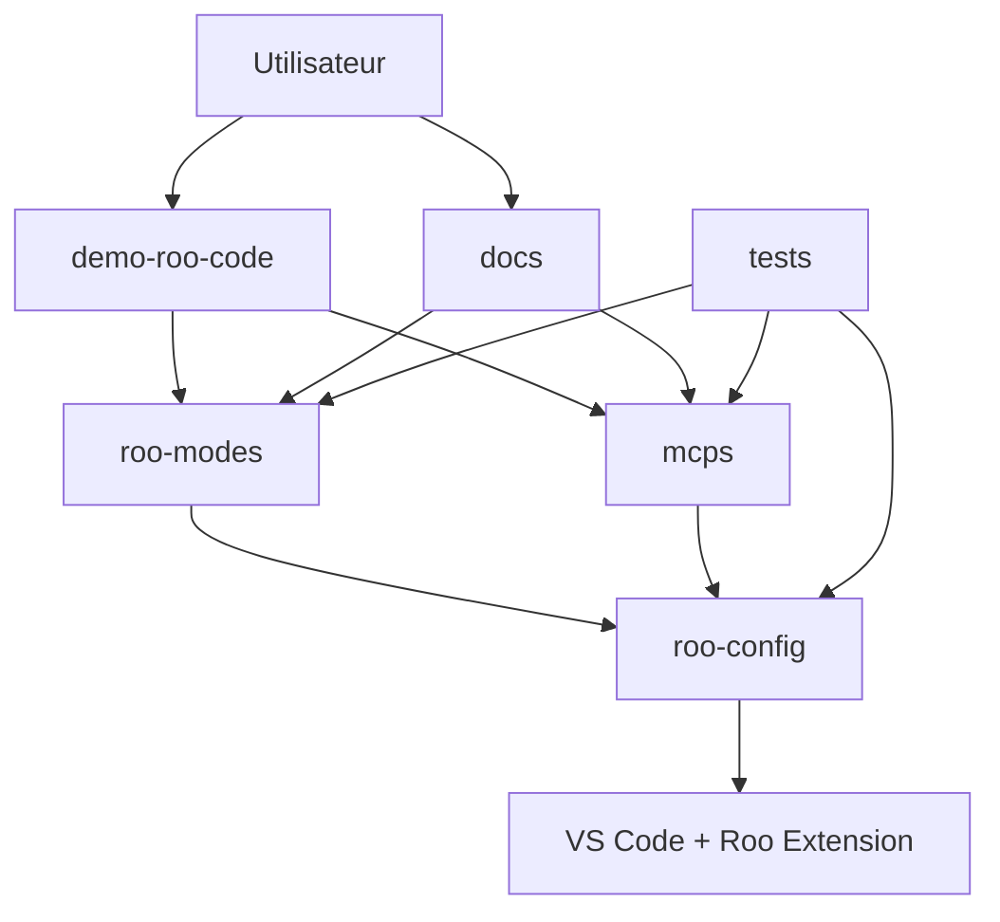

# Architecture du projet Roo Extensions

Ce document présente la vue d'ensemble de l'architecture du dépôt roo-extensions, les relations entre composants et les flux de travail recommandés.

## Table des matières

1. [Vue d'ensemble](#vue-densemble)
2. [Structure du dépôt](#structure-du-dépôt)
3. [Composants principaux](#composants-principaux)
4. [Relations entre composants](#relations-entre-composants)
5. [Points d'entrée par profil utilisateur](#points-dentrée-par-profil-utilisateur)
6. [Flux de travail recommandés](#flux-de-travail-recommandés)
7. [Architecture des modes](#architecture-des-modes)
8. [Écosystème MCP](#écosystème-mcp)

## Vue d'ensemble

Roo Extensions est un écosystème modulaire qui étend les capacités de l'assistant Roo pour VS Code. L'architecture est conçue pour :

- **Modularité** : Composants indépendants et réutilisables
- **Extensibilité** : Ajout facile de nouveaux modes et MCPs
- **Maintenabilité** : Structure claire et documentation complète
- **Évolutivité** : Support de différents profils et niveaux de complexité

## Structure du dépôt

```
roo-extensions/
├── 📁 demo-roo-code/          # Point d'entrée principal pour nouveaux utilisateurs
│   ├── 01-decouverte/         # Introduction (15 min)
│   ├── 02-orchestration-taches/ # Gestion de projets (30 min)
│   ├── 03-assistant-pro/      # Usage professionnel (45 min)
│   ├── 04-creation-contenu/   # Développement web (45 min)
│   ├── 05-projets-avances/    # Cas complexes (60+ min)
│   ├── prepare-workspaces.ps1 # Script de préparation
│   └── clean-workspaces.ps1   # Script de nettoyage
│
├── 📁 roo-modes/              # Modes personnalisés et configurations
│   ├── configs/               # Configurations des modes
│   ├── optimized/             # Architecture 2 niveaux (production)
│   ├── n5/                    # Architecture 5 niveaux (expérimental)
│   └── examples/              # Exemples de configuration
│
├── 📁 mcps/                   # Serveurs MCP (Model Context Protocol)
│   ├── internal/              # MCPs développés en interne
│   │   ├── quickfiles/        # Opérations fichiers multiples
│   │   ├── jinavigator/       # Conversion web → Markdown
│   │   └── jupyter/           # Notebooks Jupyter
│   ├── external/              # MCPs tiers
│   │   ├── searxng/           # Recherche web
│   │   ├── win-cli/           # Commandes système
│   │   ├── github/            # API GitHub
│   │   └── filesystem/        # Système de fichiers
│   └── tests/                 # Tests des MCPs
│
├── 📁 roo-config/             # Configuration et déploiement
│   ├── settings/              # Paramètres globaux
│   ├── qwen3-profiles/        # Profils Qwen3
│   ├── backups/               # Sauvegardes
│   └── diagnostic-scripts/    # Scripts de diagnostic
│
├── 📁 docs/                   # Documentation technique
│   ├── guides/                # Guides d'utilisation
│   ├── rapports/              # Rapports d'analyse
│   └── architecture/          # Documentation architecture
│
├── 📁 tests/                  # Tests et validation
│   ├── mcp/                   # Tests des MCPs
│   ├── escalation/            # Tests d'escalade
│   └── results/               # Résultats des tests
│
└── 📁 modules/                # Modules autonomes
    └── form-validator/        # Validation de formulaires
```

## Composants principaux

### 1. Demo Roo Code
**Rôle** : Point d'entrée et apprentissage progressif
- 5 niveaux de complexité croissante
- Scripts d'automatisation inclus
- Exemples pratiques et cas d'usage réels

### 2. Roo Modes
**Rôle** : Définition du comportement des agents Roo
- **Architecture 2 niveaux** : Simple/Complex (production)
- **Architecture 5 niveaux** : MICRO/MINI/MEDIUM/LARGE/ORACLE (expérimental)
- Système de profils pour adaptation aux modèles IA

### 3. MCPs (Model Context Protocol)
**Rôle** : Extension des capacités de Roo
- **Internes** : Développés spécifiquement pour ce projet
- **Externes** : Intégration de MCPs tiers
- Interface standardisée pour l'ajout de fonctionnalités

### 4. Roo Config
**Rôle** : Gestion de la configuration et du déploiement
- Scripts de déploiement automatisés
- Gestion des profils et sauvegardes
- Outils de diagnostic et maintenance

## Relations entre composants



### Flux de données

1. **Configuration** : `roo-config` → `roo-modes` → `VS Code`
2. **Fonctionnalités** : `mcps` → `Roo Extension` → `Modes`
3. **Apprentissage** : `demo-roo-code` → `Utilisateur` → `Modes + MCPs`
4. **Validation** : `tests` → `Tous les composants`

## Points d'entrée par profil utilisateur

### 🆕 Nouveau utilisateur
**Objectif** : Découvrir Roo et ses capacités

**Parcours recommandé** :
1. `README.md` → Vue d'ensemble rapide
2. `GETTING-STARTED.md` → Installation et premiers pas
3. `demo-roo-code/01-decouverte/` → Première expérience pratique
4. Progression vers les niveaux suivants

### 👨‍💻 Développeur expérimenté
**Objectif** : Intégrer Roo dans le workflow existant

**Parcours recommandé** :
1. `ARCHITECTURE.md` → Compréhension technique
2. `roo-modes/README.md` → Configuration des modes
3. `mcps/README.md` → Intégration des MCPs
4. `demo-roo-code/04-creation-contenu/` → Cas d'usage avancés

### 🏗️ Architecte système
**Objectif** : Comprendre l'architecture et personnaliser

**Parcours recommandé** :
1. `ARCHITECTURE.md` → Vue d'ensemble complète
2. `docs/guides/` → Documentation technique
3. `roo-config/README.md` → Configuration avancée
4. `tests/` → Validation et tests

### 🔧 Contributeur
**Objectif** : Contribuer au développement du projet

**Parcours recommandé** :
1. `ARCHITECTURE.md` → Compréhension de l'architecture
2. `demo-roo-code/CONTRIBUTING.md` → Guide de contribution
3. `tests/README.md` → Procédures de test
4. `docs/rapports/` → Rapports d'analyse existants

## Flux de travail recommandés

### Workflow d'installation

```
1. Installation Roo Extension (VS Code)
   ↓
2. Clone du dépôt roo-extensions
   ↓
3. Déploiement des modes (roo-config)
   ↓
4. Test avec demo-roo-code/01-decouverte
   ↓
5. Configuration des MCPs (optionnel)
```

### Workflow de développement

```
1. Analyse du besoin
   ↓
2. Sélection du mode approprié
   ↓
3. Configuration de l'environnement (prepare-workspaces.ps1)
   ↓
4. Développement avec Roo
   ↓
5. Test et validation
   ↓
6. Nettoyage (clean-workspaces.ps1)
```

### Workflow de contribution

```
1. Fork du dépôt
   ↓
2. Création d'une branche feature
   ↓
3. Développement et tests
   ↓
4. Documentation des changements
   ↓
5. Pull Request avec tests
```

## Architecture des modes

### Architecture 2 niveaux (Production)

```
Modes Simples (Qwen 3 32B)
├── Ask Simple
├── Code Simple
├── Debug Simple
├── Architect Simple
└── Orchestrator Simple

Modes Complexes (Claude 3.7 Sonnet)
├── Ask Complex
├── Code Complex
├── Debug Complex
├── Architect Complex
└── Orchestrator Complex
```

**Avantages** :
- Simplicité de configuration
- Coût optimisé
- Maintenance facilitée

### Architecture 5 niveaux (Expérimental)

```
ORACLE (Claude 3.7 Sonnet)    # Tâches très complexes
├── LARGE (Qwen 235B)         # Tâches complexes
├── MEDIUM (Qwen 32B)         # Tâches standard
├── MINI (Qwen 8B)            # Tâches simples
└── MICRO (Qwen 1.5B)         # Tâches très simples
```

**Avantages** :
- Optimisation fine des coûts
- Adaptation précise à la complexité
- Escalade automatique possible

## Écosystème MCP

### MCPs Internes

| MCP | Fonction | Usage principal |
|-----|----------|-----------------|
| **QuickFiles** | Opérations fichiers multiples | Gestion de projets, refactoring |
| **JinaNavigator** | Web → Markdown | Recherche, documentation |
| **Jupyter** | Notebooks interactifs | Analyse de données, prototypage |

### MCPs Externes

| MCP | Fonction | Usage principal |
|-----|----------|-----------------|
| **SearXNG** | Recherche web | Veille, recherche d'information |
| **Win-CLI** | Commandes système | Automatisation, déploiement |
| **GitHub** | API GitHub | Gestion de dépôts, CI/CD |
| **Filesystem** | Système de fichiers | Opérations de base sur fichiers |

### Architecture MCP

```
Roo Extension
    ↓
MCP Protocol
    ↓
┌─────────────┬─────────────┐
│ MCPs        │ MCPs        │
│ Internes    │ Externes    │
├─────────────┼─────────────┤
│ QuickFiles  │ SearXNG     │
│ JinaNav     │ Win-CLI     │
│ Jupyter     │ GitHub      │
└─────────────┴─────────────┘
```

## Évolution et maintenance

### Versioning
- **Modes** : Versioning sémantique dans `roo-modes/`
- **MCPs** : Versioning indépendant par MCP
- **Configuration** : Sauvegarde automatique avant changements

### Tests et validation
- **Tests unitaires** : Par composant
- **Tests d'intégration** : Entre composants
- **Tests d'escalade** : Validation des architectures

### Documentation
- **Auto-génération** : Documentation technique
- **Exemples vivants** : Via demo-roo-code
- **Rapports** : Analyses et synthèses dans docs/rapports/

---

**💡 Note** : Cette architecture évolue en fonction des retours utilisateurs et des nouvelles fonctionnalités de Roo. Consultez régulièrement la documentation pour les mises à jour.