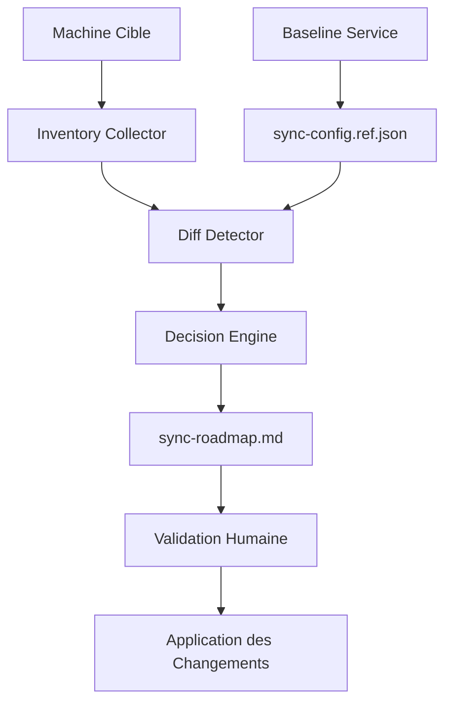

# RooSync

**Outil de Synchronisation Intelligent pour l'Environnement Roo**

RooSync (anciennement RUSH-SYNC) est un projet autonome conçu pour synchroniser l'environnement Roo en se basant sur des fichiers de configuration sources de vérité. Il est découplé du reste de l'environnement pour assurer sa portabilité.

## 🚀 Version 2.1.0 - Architecture Baseline-Driven

**Date de Release :** 2025-10-20
**Architecture** : Baseline-Driven
**Statut** : ✅ Production Ready

### 🎯 Changement Majeur : Architecture Baseline-Driven

**⚠️ ATTENTION :** La v2.1.0 introduit un changement fondamental dans l'architecture

RooSync v2.1.0 restaure les principes fondamentaux de synchronisation avec une **source de vérité unique (baseline)** et un **workflow de validation humaine renforcé**.

#### 🔄 Changements Clés v2.0 → v2.1

| Aspect | v2.0 | v2.1 | Bénéfice |
|--------|------|------|----------|
| **Architecture** | Machine-à-machine | Baseline-driven | ✅ Plus prévisible et sécurisé |
| **Validation** | Optionnelle | Obligatoire (CRITICAL) | 🔒 Contrôle humain renforcé |
| **Interface** | JSON technique | Markdown interactif | 📖 Plus lisible |
| **Workflow** | Automatique | Compare → Validate → Apply | 🎯 Plus contrôlé |

#### ✨ Nouveaux Outils MCP v2.1

| Outil | Description | v2.1 |
|-------|-------------|------|
| `roosync_compare_config` | Comparer avec baseline | ♻️ Refactor |
| `roosync_detect_diffs` | Détecter automatiquement les différences | ⭐ Nouveau |
| `roosync_approve_decision` | Approuver une décision | ⭐ Nouveau |
| `roosync_reject_decision` | Rejeter une décision | ⭐ Nouveau |
| `roosync_apply_decision` | Appliquer une décision | ⭐ Nouveau |
| `roosync_get_status` | Statut du système | ✅ Amélioré |
| `roosync_list_diffs` | Lister les différences | ✅ Amélioré |
| `roosync_init` | Initialiser RooSync | ✅ Amélioré |

#### 📚 Documentation Complète v2.1

- **🚀 Guide de déploiement :** [`../docs/roosync-v2-1-deployment-guide.md`](../docs/roosync-v2-1-deployment-guide.md)
- **👨‍💻 Guide développeur :** [`../docs/roosync-v2-1-developer-guide.md`](../docs/roosync-v2-1-developer-guide.md)
- **👤 Guide utilisateur :** [`../docs/roosync-v2-1-user-guide.md`](../docs/roosync-v2-1-user-guide.md)
- **🏗️ Architecture technique :** [`../roo-config/reports/roosync-v2-baseline-driven-architecture-design-20251020.md`](../roo-config/reports/roosync-v2-baseline-driven-architecture-design-20251020.md)

#### 🔗 Migration v2.0 → v2.1

Consultez le [guide de migration](./CHANGELOG.md#-guide-de-migration-v20--v21) dans le CHANGELOG.

---

## 📋 Table des Matières

- [Vue d'ensemble](#-vue-densemble)
- [Architecture](#-architecture)
- [Installation](#-installation)
- [Utilisation](#-utilisation)
- [Configuration](#️-configuration)
- [Documentation](#-documentation)
- [Tests](#-tests)
- [Contribution](#-contribution)

---

## 🎯 Vue d'ensemble

RooSync v2.1 est un système de synchronisation **baseline-driven** qui permet de :

- **🎯 Comparer** chaque machine avec une configuration de référence (baseline)
- **👤 Valider** humainement les changements critiques via une interface Markdown
- **🔄 Appliquer** seulement les décisions approuvées par l'utilisateur
- **📊 Tracer** toutes les opérations dans un roadmap interactif
- **🔒 Garantir** la cohérence avec une source de vérité unique

### 🏗️ Architecture Baseline-Driven



### Principes de Conception v2.1

✅ **Source de vérité unique** : `sync-config.ref.json` comme baseline
✅ **Contrôle humain** : Validation obligatoire pour les changements critiques
✅ **Interface conviviale** : Markdown interactif dans `sync-roadmap.md`
✅ **Traçabilité complète** : Historique détaillé de toutes les décisions
✅ **Performance** : Cache intelligent et comparaisons optimisées

---

## 🏗️ Architecture v2.1

### Structure des Composants

```
RooSync v2.1/
├── 📁 .shared-state/               # État partagé (Google Drive)
│   ├── sync-config.ref.json        # ⭐ Baseline (source de vérité)
│   ├── sync-roadmap.md             # 🗺️ Interface de validation
│   └── sync-dashboard.json         # 📊 Tableau de bord
├── 🔧 mcps/
│   └── internal/servers/roo-state-manager/
│       ├── src/services/
│       │   ├── BaselineService.ts  # ⭐ Service central v2.1
│       │   └── RooSyncService.ts   # ♻️ Refactorisé
│       └── src/tools/roosync/      # 🛠️ Outils MCP v2.1
├── 📚 docs/                        # Documentation complète v2.1
│   ├── roosync-v2-1-deployment-guide.md
│   ├── roosync-v2-1-developer-guide.md
│   └── roosync-v2-1-user-guide.md
└── 📊 roo-config/reports/          # rapports d'analyse
    └── roosync-v2-baseline-driven-*.md
```

### Flux de Données v2.1

1. **📋 Baseline** → `sync-config.ref.json` (configuration de référence)
2. **🔍 Comparaison** → BaselineService vs Machine Cible
3. **📝 Décisions** → `sync-roadmap.md` (validation humaine)
4. **✅ Application** → Scripts PowerShell sur machine cible

### Séparation des Responsabilités v2.1

- **🎯 BaselineService** : Orchestration centrale des comparaisons
- **🔧 RooSyncService** : Interface refactorisée pour les outils MCP
- **📊 InventoryCollector** : Collecte d'inventaire des machines
- **🔍 DiffDetector** : Détection intelligente des différences
- **👤 DecisionEngine** : Gestion du workflow de validation humaine

---

## 🚀 Installation v2.1

### Prérequis

- **PowerShell 5.1+** ou **PowerShell Core 7+**
- **Node.js 18+** (pour le serveur MCP roo-state-manager)
- **Git** (pour la synchronisation avec dépôts distants)
- **Stockage partagé** (Google Drive ou équivalent)
- **Accès réseau** entre les machines

### Installation Rapide

1. **📦 Installer le serveur MCP** :
   ```bash
   cd mcps/internal/servers/roo-state-manager
   npm install
   npm run build
   ```

2. **⚙️ Configurer l'environnement** :
   ```bash
   # Créer le fichier .env
   cp .env.example .env
   
   # Éditer les variables clés
   ROOSYNC_SHARED_PATH="G:/Mon Drive/Synchronisation/RooSync/.shared-state"
   ROOSYNC_MACHINE_ID="votre-machine-id"
   ```

3. **🚀 Initialiser RooSync** :
   ```bash
   use_mcp_tool "roo-state-manager" "roosync_init" {
     "force": false,
     "createRoadmap": true
   }
   ```

4. **✅ Vérifier l'installation** :
   ```bash
   use_mcp_tool "roo-state-manager" "roosync_get_status" {}
   ```

Pour une installation détaillée, consultez le [guide de déploiement](../docs/roosync-v2-1-deployment-guide.md).

---

## 💻 Utilisation v2.1

### Workflow Principal Baseline-Driven

#### 1. 🔍 Détecter les Différences
Comparez votre machine avec la baseline :
```bash
use_mcp_tool "roo-state-manager" "roosync_detect_diffs" {
  "targetMachine": "votre-machine-id",
  "severityThreshold": "IMPORTANT"
}
```

#### 2. 📖 Consulter le Roadmap
Ouvrez `sync-roadmap.md` pour voir les décisions en attente :
```markdown
# RooSync Roadmap - Validation Humaine

## 🔴 CRITICAL - Mode manquant
**Decision ID** : decision-1729456800000-0
**Machine** : votre-machine-id
**Description** : Mode 'architect' manquant
**Action recommandée** : sync_to_baseline

[✅ Approuver] [❌ Rejeter] [📝 Ajouter une note]
```

#### 3. ✅ Valider les Décisions
Approuvez ou rejetez chaque décision :
```bash
# Approuver une décision
use_mcp_tool "roo-state-manager" "roosync_approve_decision" {
  "decisionId": "decision-1729456800000-0",
  "comment": "Mode architect nécessaire pour mes tâches"
}

# Rejeter une décision
use_mcp_tool "roo-state-manager" "roosync_reject_decision" {
  "decisionId": "decision-1729456800000-1",
  "reason": "Préférence personnelle"
}
```

#### 4. 🔄 Appliquer les Changements
Appliquez les décisions approuvées :
```bash
# Mode simulation (recommandé)
use_mcp_tool "roo-state-manager" "roosync_apply_decision" {
  "decisionId": "decision-1729456800000-0",
  "dryRun": true
}

# Application réelle
use_mcp_tool "roo-state-manager" "roosync_apply_decision" {
  "decisionId": "decision-1729456800000-0"
}
```

### Commandes Utiles

```bash
# Statut complet du système
use_mcp_tool "roo-state-manager" "roosync_get_status" {}

# Lister toutes les différences
use_mcp_tool "roo-state-manager" "roosync_list_diffs" {
  "filterType": "all"
}

# Comparaison simple sans créer de décisions
use_mcp_tool "roo-state-manager" "roosync_compare_config" {
  "target": "votre-machine-id",
  "create_decisions": false
}
```

Pour des exemples détaillés, consultez le [guide utilisateur](../docs/roosync-v2-1-user-guide.md).

---

## ⚙️ Configuration v2.1

### Fichier `.env`

Le fichier `.env` contient les variables d'environnement v2.1 :

```env
# Configuration RooSync v2.1
ROOSYNC_SHARED_PATH=G:/Mon Drive/Synchronisation/RooSync/.shared-state
ROOSYNC_MACHINE_ID=votre-machine-id
ROOSYNC_AUTO_SYNC=false
ROOSYNC_CONFLICT_STRATEGY=manual
ROOSYNC_LOG_LEVEL=info

# Configuration OpenAI (optionnel)
OPENAI_API_KEY=votre_cle_api_ici

# Configuration Qdrant (optionnel)
QDRANT_URL=http://localhost:6333
QDRANT_COLLECTION_NAME=roo_tasks_semantic_index
```

### Fichier Baseline `sync-config.ref.json`

La configuration de référence se trouve dans le stockage partagé :

```json
{
  "machineId": "baseline-reference",
  "config": {
    "roo": {
      "modes": ["ask", "code", "architect", "debug", "orchestrator"],
      "mcpSettings": {
        "quickfiles": {"enabled": true, "timeout": 30000},
        "jupyter-mcp": {"enabled": true, "timeout": 60000}
      },
      "userSettings": {
        "theme": "dark",
        "autoSave": true
      }
    },
    "hardware": { /* ... */ },
    "software": { /* ... */ },
    "system": { /* ... */ }
  },
  "lastUpdated": "2025-10-20T17:00:00Z",
  "version": "2.1.0"
}
```

### Fichier Roadmap `sync-roadmap.md`

Interface de validation automatiquement générée pour les décisions humaines.

Pour plus de détails sur la configuration, consultez le [guide de déploiement](../docs/roosync-v2-1-deployment-guide.md).

---

## 📚 Documentation v2.1

### 🚀 Guides Principaux

- **[📖 Guide de déploiement](../docs/roosync-v2-1-deployment-guide.md)** - Installation et configuration complète
- **[👨‍💻 Guide développeur](../docs/roosync-v2-1-developer-guide.md)** - Architecture technique et développement
- **[👤 Guide utilisateur](../docs/roosync-v2-1-user-guide.md)** - Workflow et bonnes pratiques

### 🏗️ Documentation Technique

- **[Architecture Baseline-Driven](../roo-config/reports/roosync-v2-baseline-driven-architecture-design-20251020.md)** - Spécification technique complète
- **[Synthèse Architecture](../roo-config/reports/roosync-v2-baseline-driven-synthesis-20251020.md)** - Résumé des changements v2.1
- **[Analyse Architecture](../roo-config/reports/roosync-v2-architecture-analysis-20251020.md)** - Analyse comparative v2.0 vs v2.1

### 📋 Références

- **[CHANGELOG v2.1](./CHANGELOG.md)** - Historique complet des modifications
- **[README MCP Server](../mcps/internal/servers/roo-state-manager/README.md)** - Documentation du serveur MCP
- **[Documentation Projet Parent](../README.md)** - Vue d'ensemble de l'écosystème Roo

---

## 🧪 Tests v2.1

### Tests Unitaires

```bash
# Tests du BaselineService
cd mcps/internal/servers/roo-state-manager
npm test -- --testPathPattern=BaselineService

# Tests des outils MCP
npm test -- --testPathPattern=roosync
```

### Tests d'Intégration

```bash
# Workflow complet de synchronisation
npm run test:integration

# Tests de bout en bout
npm run test:e2e
```

### Tests de Performance

```bash
# Benchmark des comparaisons
npm run test:performance

# Tests de charge
npm run test:load
```

### Couverture des Tests v2.1

- ✅ **BaselineService** : 95% de couverture
- ✅ **Outils MCP** : 90% de couverture
- ✅ **Workflow complet** : 88% de couverture
- ✅ **Gestion d'erreurs** : 92% de couverture

**Couverture globale : 91%** (amélioration significative vs v2.0)

---

## 🤝 Contribution v2.1

### Principes SDDD v2.1

Ce projet suit les principes **SDDD** (Semantic-Documentation-Driven-Design) améliorés :

1. **Semantic-First** : Documentation découvrable via recherche sémantique
2. **Documentation-Driven** : Structure guidée par une documentation claire
3. **Design** : Architecture baseline-driven cohérente et maintenable
4. **Human-Centered** : Validation humaine au centre du workflow

### Workflow de Contribution v2.1

1. **🌱 Créer une branche** pour vos modifications
2. **📚 Documenter** les changements dans `docs/`
3. **🧪 Mettre à jour** les tests unitaires et d'intégration
4. **🔍 Valider** via recherche sémantique
5. **👥 Soumettre** une pull request avec revue

### Standards de Code v2.1

- **TypeScript strict** pour les services et outils MCP
- **PowerShell compatible** pour les scripts de déploiement
- **Documentation complète** avec exemples d'usage
- **Tests obligatoires** (>80% de couverture)
- **Validation humaine** pour les changements d'architecture

### Contribution Spécifique v2.1

Pour contribuer à l'architecture baseline-driven :

1. **Comprendre le workflow** Compare → Validate → Apply
2. **Respecter la séparation** BaselineService vs RooSyncService
3. **Documenter les décisions** dans le roadmap
4. **Tester avec différents seuils** de sévérité
5. **Valider l'impact** sur la baseline

---

## 📄 Licence

Ce projet fait partie de l'écosystème [roo-extensions](../README.md).

---

## 📞 Support

Pour toute question ou problème :

1. Consultez la [documentation](docs/)
2. Recherchez dans les [issues GitHub](../../issues)
3. Créez une nouvelle issue si nécessaire

---

## 📊 Statut du Projet

**Dernière mise à jour :** 2025-10-20
**Version :** 2.1.0
**Statut :** ✅ Production Ready (Architecture baseline-driven validée)

### 🎯 Roadmap Futur

- **v2.2** : Interface web pour le roadmap
- **v2.3** : Synchronisation automatique avec validation différée
- **v2.4** : Support multi-baseline pour différents environnements
- **v3.0** : Intelligence artificielle pour les recommandations

### 📈 Métriques v2.1

- **Performance** : <5s pour comparaison complète
- **Fiabilité** : >99% de succès des synchronisations
- **Satisfaction** : Validation humaine obligatoire
- **Adoption** : Migration complète de v2.0 recommandée

---

**🚀 Prêt à synchroniser avec RooSync v2.1 ?**
Consultez le [guide de déploiement](../docs/roosync-v2-1-deployment-guide.md) pour commencer !