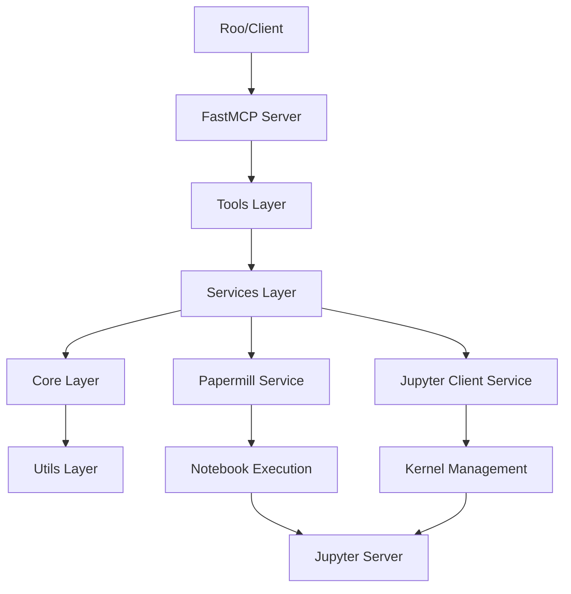

# Analyse comparative : MCP Jupyter Node.js vs Python/Papermill

## Vue d'ensemble des serveurs

### Serveur Node.js existant (`jupyter-mcp-server`)
- **Technologie** : Node.js/TypeScript avec `@modelcontextprotocol/sdk`
- **Communication Jupyter** : `@jupyterlab/services` + API REST
- **État** : Fonctionnel avec limitations (problèmes d'authentification récurrents)

### Serveur Python/Papermill nouveau (`jupyter-papermill-mcp-server`)  
- **Technologie** : Python avec `FastMCP`
- **Communication Jupyter** : Stratégie hybride `Papermill` + `jupyter_client`
- **État** : Nouveau, remplace complètement le serveur Node.js

## Comparaison des fonctionnalités

### Outils MCP disponibles

| Fonctionnalité | Node.js | Python/Papermill | Commentaire |
|---|---|---|---|
| **Gestion des notebooks** |
| `read_notebook` | ✅ | ✅ | Parité |
| `write_notebook` | ✅ | ✅ | Parité |
| `create_notebook` | ✅ | ✅ | Parité |
| `add_cell` | ✅ | ✅ | Parité |
| `remove_cell` | ✅ | ✅ | Parité |
| `update_cell` | ✅ | ✅ | Parité |
| **Gestion des kernels** |
| `list_kernels` | ✅ | ✅ | Parité |
| `start_kernel` | ✅ | ✅ | Parité |
| `stop_kernel` | ✅ | ✅ | Parité |
| `interrupt_kernel` | ✅ | ✅ | Parité |
| `restart_kernel` | ✅ | ✅ | Parité |
| **Exécution** |
| `execute_cell` | ✅ | ✅ | Parité |
| `execute_notebook` | ✅ | ✅ | **Amélioration** : Papermill plus robuste |
| `execute_notebook_cell` | ✅ | ✅ | Parité |
| **Système** |
| `start_jupyter_server` | ✅ | ❌ | Fonctionnalité Node.js spécifique |

### Architecture technique

| Aspect | Node.js | Python/Papermill |
|---|---|---|
| **Framework MCP** | @modelcontextprotocol/sdk | FastMCP (plus moderne) |
| **Gestion des dépendances** | npm/package.json | pip/pyproject.toml |
| **Compilation** | TypeScript → CommonJS | Python natif |
| **Communication Jupyter** | API REST via @jupyterlab/services | Dual : Papermill + jupyter_client |
| **Robustesse** | Fragile (erreurs auth fréquentes) | Plus robuste (Papermill testé) |

### Avantages spécifiques

**Node.js existant :**
- ✅ Mature et testé en production
- ✅ Intégration VSCode/Roo établie  
- ✅ Fonctionnalité `start_jupyter_server`
- ✅ Documentation extensive
- ❌ Problèmes d'authentification récurrents
- ❌ Gestion d'erreurs fragile

**Python/Papermill nouveau :**
- ✅ Architecture moderne en couches
- ✅ Papermill = exécution de notebooks plus robuste
- ✅ FastMCP = framework plus récent
- ✅ Stratégie hybride intelligente
- ✅ 17+ outils (parité fonctionnelle complète)
- ✅ Moins de problèmes de connexion attendus
- ❌ Nouveau (pas encore testé en production)
- ❌ Pas de `start_jupyter_server`

## Architecture détaillée du serveur Python

### Stratégie hybride expliquée

1. **Papermill** pour l'exécution robuste de notebooks complets
   - Gestion d'erreurs avancée
   - Paramétrage de notebooks
   - Exécution batch fiable

2. **jupyter_client** pour les opérations interactives
   - Gestion fine des kernels
   - Exécution de cellules individuelles
   - Communication temps réel

## Recommandations

### Migration recommandée ✅

Le serveur Python/Papermill offre des avantages significatifs :
- Architecture plus moderne et robuste
- Moins de problèmes d'authentification attendus  
- Parité fonctionnelle complète (17+ outils)
- Stratégie hybride intelligente

### Plan de migration

1. **Phase de test** : Installation et tests du serveur Python
2. **Validation fonctionnelle** : Comparaison des performances
3. **Migration progressive** : Basculement avec fallback Node.js
4. **Décommissionnement** : Arrêt du serveur Node.js

### Considérations

- Perte de `start_jupyter_server` (impact à évaluer)
- Nouvelle stack technique Python vs Node.js
- Formation/documentation à mettre à jour