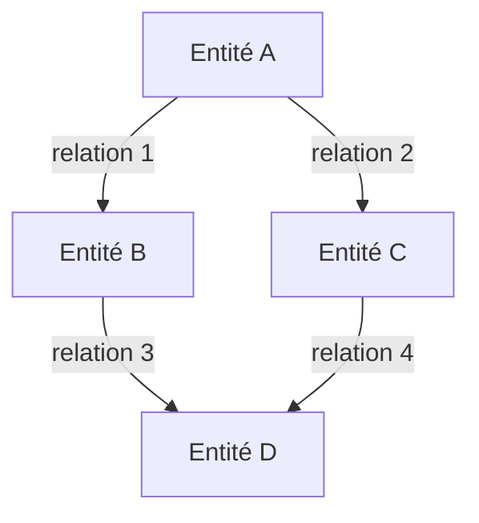
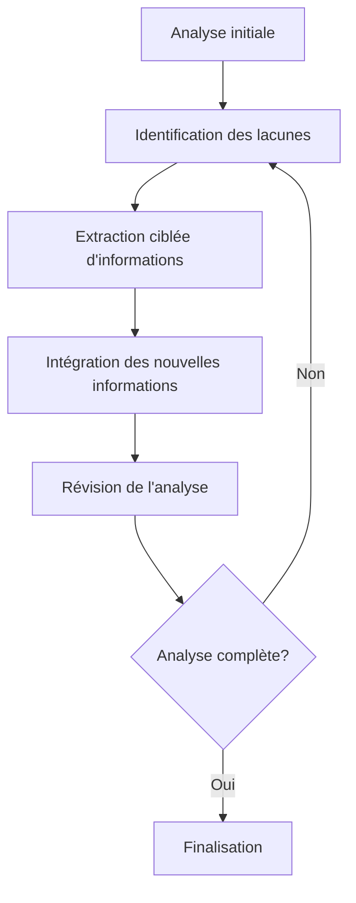

# 🔍 Guide d'Analyse de Documents Complexes avec Roo

Ce guide présente une méthodologie structurée pour analyser des documents complexes à l'aide de Roo. Il couvre les techniques avancées d'extraction, d'analyse et de synthèse d'informations à partir de documents techniques, juridiques, scientifiques ou commerciaux.

## Table des matières

1. [Préparation à l'analyse](#1-préparation-à-lanalyse)
2. [Extraction structurée](#2-extraction-structurée)
3. [Analyse approfondie](#3-analyse-approfondie)
4. [Synthèse et visualisation](#4-synthèse-et-visualisation)
5. [Validation et itération](#5-validation-et-itération)
6. [Cas d'usage spécifiques](#6-cas-dusage-spécifiques)
7. [Outils et techniques avancés](#7-outils-et-techniques-avancés)

---

## 1. Préparation à l'analyse

### 1.1. Définition des objectifs

Avant de commencer l'analyse d'un document complexe, définissez clairement vos objectifs:

```yaml
objectifs_analyse:
  primaires:
    - Extraire les informations clés sur [sujet spécifique]
    - Identifier les relations entre [concepts A] et [concepts B]
    - Évaluer la validité des [affirmations/méthodes/résultats]
  
  secondaires:
    - Comparer avec [documents/standards de référence]
    - Identifier les lacunes ou incohérences
    - Générer des visualisations pour [public cible]
  
  livrables:
    - Résumé exécutif (500 mots)
    - Analyse détaillée structurée
    - Recommandations basées sur l'analyse
    - Visualisations des concepts clés
```

### 1.2. Évaluation préliminaire

Effectuez une évaluation rapide du document pour déterminer:

- **Type et structure**: Rapport technique, article scientifique, contrat, documentation...
- **Complexité**: Longueur, densité d'information, technicité du langage
- **Qualité**: Format, lisibilité, cohérence structurelle
- **Contexte**: Auteur, date, public cible, objectif du document

### 1.3. Préparation du document

Pour optimiser l'analyse avec Roo:

1. **Conversion en format exploitable**:
   ```python
   # Exemple conceptuel de préparation de document
   def prepare_document(document_path):
       # Détection du format
       format = detect_format(document_path)
       
       # Conversion en texte structuré si nécessaire
       if format in ["pdf", "docx", "image"]:
           text = convert_to_structured_text(document_path, format)
       else:
           text = read_file(document_path)
       
       # Nettoyage et normalisation
       text = clean_and_normalize(text)
       
       return text
   ```

2. **Segmentation initiale**:
   - Divisez le document en sections logiques
   - Identifiez la hiérarchie des titres et sous-titres
   - Repérez les éléments spéciaux (tableaux, figures, références)

## 2. Extraction structurée

### 2.1. Extraction de la structure

Utilisez Roo pour extraire la structure hiérarchique du document:

```javascript
// Exemple d'instruction pour Roo
const documentStructure = {
  title: "Extrait la structure complète du document avec tous les niveaux de titres",
  format: "JSON hiérarchique",
  includePageNumbers: true,
  detectSections: true
};

// Structure résultante
{
  "title": "Titre principal du document",
  "sections": [
    {
      "level": 1,
      "title": "Section 1",
      "page": 1,
      "sections": [
        {
          "level": 2,
          "title": "Sous-section 1.1",
          "page": 2,
          "sections": []
        },
        // ...
      ]
    },
    // ...
  ]
}
```

### 2.2. Extraction d'entités

Identifiez et extrayez les entités clés du document:

| Type d'entité | Exemples | Techniques d'extraction |
|---------------|----------|-------------------------|
| Personnes | Auteurs, participants, responsables | NER (Named Entity Recognition), analyse contextuelle |
| Organisations | Entreprises, institutions, départements | NER, analyse des acronymes |
| Dates et périodes | Échéances, périodes d'étude, jalons | Reconnaissance de patterns temporels |
| Lieux | Sites, pays, régions | NER, analyse géographique |
| Termes techniques | Jargon spécifique au domaine | Extraction terminologique, analyse de fréquence |
| Métriques | KPIs, mesures, statistiques | Analyse numérique, reconnaissance de patterns |
| Citations | Références à d'autres travaux | Analyse de patterns bibliographiques |

### 2.3. Extraction de relations

Identifiez les relations entre les entités extraites:



Techniques pour l'extraction de relations:
- Analyse de proximité textuelle
- Analyse syntaxique des phrases
- Identification des marqueurs de relation (verbes, prépositions)
- Analyse des cooccurrences

### 2.4. Extraction de tableaux et données structurées

Pour les tableaux et données structurées:

1. **Détection de tableaux**:
   ```
   roo.detectTables(document, {
     includeHeaders: true,
     preserveFormatting: true,
     outputFormat: "markdown"
   })
   ```

2. **Conversion en structures de données**:
   ```python
   # Conversion d'un tableau en DataFrame
   table_data = extract_table(document, table_index)
   df = pd.DataFrame(table_data)
   
   # Analyse statistique basique
   summary = df.describe()
   correlations = df.corr()
   ```

## 3. Analyse approfondie

### 3.1. Analyse thématique

Identifiez les thèmes principaux et secondaires du document:

1. **Extraction de thèmes**:
   ```
   roo.extractThemes(document, {
     method: "LDA", // Latent Dirichlet Allocation
     numThemes: 5,
     includeKeywords: true,
     weightByRelevance: true
   })
   ```

2. **Cartographie thématique**:
   ```
   ┌─────────────────┐     ┌─────────────────┐
   │  Thème 1 (27%)  │     │  Thème 2 (23%)  │
   │                 │     │                 │
   │ - Mot-clé 1.1   │     │ - Mot-clé 2.1   │
   │ - Mot-clé 1.2   │     │ - Mot-clé 2.2   │
   │ - Mot-clé 1.3   │     │ - Mot-clé 2.3   │
   └────────┬────────┘     └────────┬────────┘
            │                       │
            ▼                       ▼
   ┌─────────────────────────────────────────┐
   │           Thème 3 (18%)                 │
   │                                         │
   │ - Mot-clé 3.1                           │
   │ - Mot-clé 3.2                           │
   │ - Mot-clé 3.3                           │
   └────────┬────────────────────┬───────────┘
            │                    │
            ▼                    ▼
   ┌─────────────────┐     ┌─────────────────┐
   │  Thème 4 (17%)  │     │  Thème 5 (15%)  │
   │                 │     │                 │
   │ - Mot-clé 4.1   │     │ - Mot-clé 5.1   │
   │ - Mot-clé 4.2   │     │ - Mot-clé 5.2   │
   │ - Mot-clé 4.3   │     │ - Mot-clé 5.3   │
   └─────────────────┘     └─────────────────┘
   ```

### 3.2. Analyse argumentative

Identifiez la structure argumentative du document:

1. **Extraction des arguments**:
   - Thèses principales et secondaires
   - Prémisses et conclusions
   - Preuves et exemples
   - Contre-arguments et réfutations

2. **Évaluation de la solidité argumentative**:
   - Cohérence logique
   - Qualité des preuves
   - Biais potentiels
   - Lacunes dans l'argumentation

### 3.3. Analyse critique

Évaluez de manière critique le contenu du document:

| Aspect | Questions d'analyse | Techniques |
|--------|---------------------|------------|
| Validité | Les conclusions sont-elles justifiées par les données? | Vérification des sources, analyse logique |
| Fiabilité | Les méthodes sont-elles robustes et reproductibles? | Comparaison avec standards du domaine |
| Actualité | Les informations sont-elles à jour? | Comparaison avec sources récentes |
| Exhaustivité | Des aspects importants sont-ils omis? | Analyse des lacunes, comparaison avec cadres de référence |
| Biais | Y a-t-il des biais identifiables? | Analyse du langage, des sources, des méthodes |
| Applicabilité | Dans quels contextes les conclusions s'appliquent-elles? | Analyse des limites mentionnées et implicites |

### 3.4. Analyse comparative

Comparez le document avec d'autres sources pertinentes:

```python
# Exemple conceptuel d'analyse comparative
def comparative_analysis(main_doc, reference_docs, criteria):
    results = {}
    
    for criterion in criteria:
        results[criterion] = {
            "main_doc": extract_criterion_data(main_doc, criterion),
            "references": {}
        }
        
        for ref_name, ref_doc in reference_docs.items():
            results[criterion]["references"][ref_name] = extract_criterion_data(ref_doc, criterion)
    
    # Calcul des différences et similitudes
    for criterion in criteria:
        results[criterion]["similarities"] = calculate_similarities(
            results[criterion]["main_doc"],
            results[criterion]["references"]
        )
        
        results[criterion]["differences"] = calculate_differences(
            results[criterion]["main_doc"],
            results[criterion]["references"]
        )
    
    return results
```

## 4. Synthèse et visualisation

### 4.1. Génération de résumés multi-niveaux

Créez différents niveaux de résumés selon les besoins:

1. **Résumé exécutif** (1-2 paragraphes):
   - Points clés uniquement
   - Conclusions principales
   - Recommandations essentielles

2. **Résumé détaillé** (10-15% du document original):
   - Structure principale préservée
   - Points importants de chaque section
   - Données et preuves clés

3. **Résumé structuré** (par sections):
   - Résumé distinct pour chaque section majeure
   - Préservation de la hiérarchie
   - Points clés contextualisés

### 4.2. Visualisations avancées

Générez des visualisations pour représenter les informations complexes:

1. **Cartes conceptuelles**:
   ```
   roo.generateConceptMap(document, {
     centralConcept: "concept_principal",
     maxDepth: 3,
     includeRelations: true,
     groupByClusters: true
   })
   ```

2. **Diagrammes de flux**:
   ```
   roo.generateFlowDiagram(document, {
     processType: "sequential",
     includeDecisionPoints: true,
     simplifyComplexSteps: true
   })
   ```

3. **Visualisations de données**:
   ```
   roo.visualizeData(extractedData, {
     chartType: "appropriate", // Roo sélectionne le type de graphique optimal
     highlightOutliers: true,
     includeStatistics: true,
     colorScheme: "professional"
   })
   ```

### 4.3. Tableaux de synthèse

Créez des tableaux de synthèse pour faciliter la comparaison et l'analyse:

| Section | Points clés | Preuves | Limites | Implications |
|---------|------------|---------|---------|--------------|
| Section 1 | Point 1.1<br>Point 1.2 | Preuve 1.1<br>Preuve 1.2 | Limite 1.1 | Implication 1.1 |
| Section 2 | Point 2.1<br>Point 2.2 | Preuve 2.1 | Limite 2.1<br>Limite 2.2 | Implication 2.1 |
| ... | ... | ... | ... | ... |

## 5. Validation et itération

### 5.1. Vérification de la précision

Validez la précision de votre analyse:

1. **Vérification factuelle**:
   - Confrontation avec les sources primaires
   - Validation des chiffres et statistiques
   - Confirmation des citations et références

2. **Vérification de cohérence**:
   - Cohérence interne de l'analyse
   - Alignement avec les objectifs initiaux
   - Couverture complète des aspects importants

3. **Révision par domaine**:
   - Validation par expertise du domaine
   - Identification des interprétations erronées
   - Correction des erreurs techniques

### 5.2. Raffinement itératif

Améliorez votre analyse par itérations successives:



### 5.3. Documentation du processus

Documentez votre processus d'analyse pour assurer la reproductibilité:

```yaml
processus_analyse:
  document:
    titre: "Titre du document analysé"
    auteurs: ["Auteur 1", "Auteur 2"]
    date: "2025-05-15"
    version: "1.3"
  
  étapes:
    - nom: "Extraction structurelle"
      outils: ["Roo.extractStructure", "Roo.parseHeaders"]
      paramètres: { ... }
      résultats: "structure_document.json"
    
    - nom: "Analyse thématique"
      outils: ["Roo.thematicAnalysis"]
      paramètres: { ... }
      résultats: "themes_document.json"
    
    # Autres étapes...
  
  validation:
    méthodes: ["Cross-checking", "Expert review"]
    résultats: "validation_report.md"
  
  itérations:
    nombre: 3
    changements_majeurs: ["Raffinement des thèmes", "Ajout d'analyse comparative"]
```

## 6. Cas d'usage spécifiques

### 6.1. Analyse de documents techniques

Pour les documents techniques (spécifications, documentation API, etc.):

1. **Extraction des exigences**:
   - Exigences fonctionnelles vs non-fonctionnelles
   - Contraintes techniques
   - Dépendances et prérequis

2. **Analyse de cohérence technique**:
   - Vérification des contradictions
   - Identification des ambiguïtés
   - Évaluation de la complétude

3. **Génération de documentation dérivée**:
   - Guides d'implémentation
   - Matrices de traçabilité
   - Diagrammes techniques

### 6.2. Analyse de documents juridiques

Pour les contrats, règlements et autres documents juridiques:

1. **Extraction des clauses**:
   - Obligations des parties
   - Conditions et exceptions
   - Délais et échéances

2. **Analyse des risques**:
   - Identification des clauses problématiques
   - Évaluation des ambiguïtés
   - Comparaison avec standards juridiques

3. **Génération de résumés structurés**:
   - Résumé par partie prenante
   - Chronologie des obligations
   - Tableau des risques et mitigations

### 6.3. Analyse de documents scientifiques

Pour les articles et rapports scientifiques:

1. **Extraction méthodologique**:
   - Design expérimental
   - Variables et mesures
   - Analyses statistiques

2. **Évaluation critique**:
   - Validité interne et externe
   - Fiabilité des résultats
   - Limitations reconnues et non reconnues

3. **Synthèse comparative**:
   - Positionnement dans la littérature
   - Contributions originales
   - Contradictions avec d'autres études

## 7. Outils et techniques avancés

### 7.1. Techniques d'analyse sémantique

```python
# Exemple conceptuel d'analyse sémantique avec Roo
def semantic_analysis(document):
    # Extraction des concepts clés
    concepts = roo.extractConcepts(document)
    
    # Analyse des relations sémantiques
    semantic_network = roo.buildSemanticNetwork(concepts)
    
    # Calcul de centralité des concepts
    centrality = roo.calculateConceptCentrality(semantic_network)
    
    # Identification des clusters sémantiques
    clusters = roo.identifySemanticClusters(semantic_network)
    
    return {
        "concepts": concepts,
        "semantic_network": semantic_network,
        "centrality": centrality,
        "clusters": clusters
    }
```

### 7.2. Analyse multi-documents

Pour analyser plusieurs documents connexes:

1. **Alignement thématique**:
   - Identification des thèmes communs
   - Mapping des concepts partagés
   - Détection des divergences conceptuelles

2. **Analyse chronologique**:
   - Évolution des concepts dans le temps
   - Changements de perspective
   - Développement des arguments

3. **Synthèse croisée**:
   - Consolidation des informations complémentaires
   - Résolution des contradictions
   - Construction d'une vue unifiée

### 7.3. Intégration avec d'autres outils

Combinez Roo avec d'autres outils spécialisés:

| Outil | Intégration | Cas d'usage |
|-------|-------------|-------------|
| Jupyter | Analyse interactive, visualisations | Exploration de données extraites |
| GitHub | Versionnement, collaboration | Analyse collaborative, suivi des changements |
| QuickFiles | Traitement par lots | Analyse de corpus documentaires |
| JinaNavigator | Extraction web | Enrichissement avec sources externes |
| SearXNG | Recherche contextuelle | Validation et enrichissement |

## Conclusion

L'analyse de documents complexes avec Roo est un processus itératif qui combine extraction structurée, analyse approfondie et synthèse intelligente. En suivant cette méthodologie et en adaptant les techniques aux spécificités de vos documents, vous pouvez extraire efficacement des insights précieux à partir de contenus complexes et volumineux.

Pour mettre en pratique cette méthodologie, consultez l'[exemple de document complexe](./exemple-document.md) fourni dans ce module, qui illustre l'application de ces techniques sur un rapport technique détaillé.

---

**Remarque**: Ce guide présente une approche générale qui peut être adaptée selon les besoins spécifiques et les types de documents. Les techniques et outils mentionnés sont conceptuels et illustrent les capacités de Roo dans l'analyse documentaire avancée.