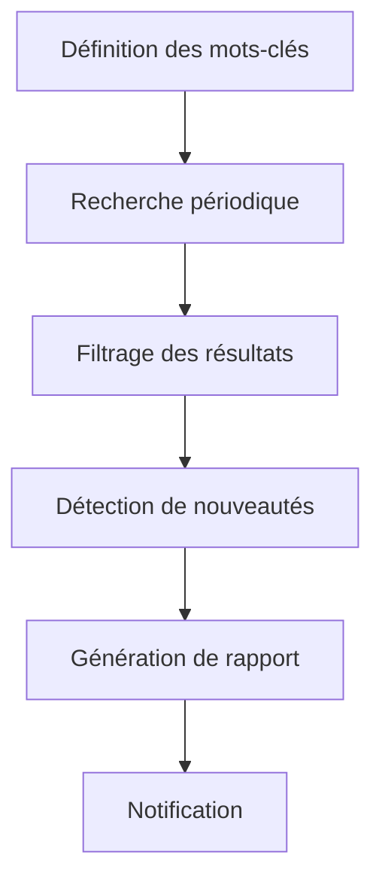

# 🔍 Assistant de Recherche avec Roo

## Introduction

Ce guide présente les techniques avancées pour utiliser Roo comme assistant de recherche et de synthèse d'informations. Roo peut transformer votre approche de la recherche en automatisant la collecte, l'analyse et la synthèse de données provenant de sources diverses.

## Capacités de Roo en matière de recherche

### 1. Collecte multi-sources

Roo peut collecter des informations à partir de multiples sources:

- **Recherche web** via SearXNG, JinaNavigator et le navigateur intégré
- **Bases de données** accessibles via API
- **Documents locaux** (PDF, DOCX, TXT, etc.)
- **Dépôts de code** via GitHub et autres plateformes
- **Données structurées** (CSV, JSON, XML)

### 2. Analyse contextuelle

Roo excelle dans:

- L'analyse sémantique du contenu
- La détection des informations pertinentes
- L'identification des contradictions entre sources
- L'évaluation de la fiabilité des sources
- La mise en relation d'informations disparates

### 3. Synthèse intelligente

Les capacités de synthèse incluent:

- Résumés adaptatifs (longueur et complexité variables)
- Extraction des points clés et des insights
- Organisation thématique des informations
- Génération de visualisations conceptuelles
- Identification des lacunes informationnelles

## Architecture d'un système de recherche avec Roo

```
┌─────────────────────┐     ┌─────────────────────┐     ┌─────────────────────┐
│  Collecte de données │     │  Analyse et tri     │     │  Synthèse           │
│                     │     │                     │     │                     │
│  - SearXNG          │     │  - Filtrage         │     │  - Résumés          │
│  - JinaNavigator    │     │  - Classification   │     │  - Rapports         │
│  - Browser Action   │     │  - Validation       │     │  - Visualisations   │
│  - MCP Resources    │     │  - Enrichissement   │     │  - Recommandations  │
└─────────────────────┘     └─────────────────────┘     └─────────────────────┘
          │                           │                           │
          ▼                           ▼                           ▼
┌─────────────────────────────────────────────────────────────────────────────┐
│                         Orchestration des workflows                         │
│                                                                             │
│  - Définition des objectifs de recherche                                    │
│  - Sélection des sources pertinentes                                        │
│  - Configuration des filtres et critères                                    │
│  - Planification des étapes d'analyse                                       │
│  - Personnalisation des formats de sortie                                   │
└─────────────────────────────────────────────────────────────────────────────┘
```

## Intégration avec les MCP Servers

Roo peut exploiter plusieurs MCP Servers pour améliorer ses capacités de recherche:

| MCP Server | Fonctionnalités pour la recherche |
|------------|-----------------------------------|
| SearXNG | Recherche web agrégée, filtrage par date, recherche multilingue |
| JinaNavigator | Conversion de pages web en Markdown, extraction de structure |
| GitHub | Recherche de code, analyse de dépôts, extraction de documentation |
| Filesystem | Analyse de documents locaux, recherche dans des fichiers |
| Jupyter | Analyse de données, visualisation, traitement statistique |

## Cas d'usage avancés

### 1. Veille technologique automatisée

Configurez Roo pour surveiller les avancées dans un domaine technologique spécifique:



### 2. Analyse comparative de produits/technologies

Utilisez Roo pour comparer objectivement différentes solutions:

- Collecte des spécifications techniques
- Analyse des avis utilisateurs
- Extraction des avantages/inconvénients
- Évaluation des performances
- Génération de tableaux comparatifs

### 3. Recherche académique et scientifique

Exploitez Roo pour accélérer la recherche académique:

- Revue de littérature automatisée
- Extraction de méthodologies
- Analyse de résultats d'études
- Identification de tendances de recherche
- Génération de bibliographies

## Bonnes pratiques

1. **Définissez clairement vos objectifs de recherche**
   - Utilisez des questions précises et structurées
   - Établissez des critères de pertinence

2. **Diversifiez vos sources**
   - Combinez sources académiques, techniques et grand public
   - Équilibrez entre sources récentes et références historiques

3. **Itérez progressivement**
   - Commencez par une recherche large puis affinez
   - Utilisez les résultats préliminaires pour guider les recherches suivantes

4. **Validez les informations**
   - Recoupez les données entre plusieurs sources
   - Identifiez les biais potentiels

5. **Structurez vos résultats**
   - Organisez par thèmes, chronologie ou pertinence
   - Utilisez des formats adaptés à votre audience

## Ressources complémentaires

- [Méthodologie de recherche avancée](./methodologie-recherche.md)
- [Exemple de synthèse d'informations](./exemple-synthese.md)
- [Documentation SearXNG](../../02-orchestration-taches/recherche-web/searxng.md)
- [Documentation JinaNavigator](../../02-orchestration-taches/recherche-web/jinavigator.md)

---

Pour aller plus loin, explorez les techniques d'intégration avec d'autres outils dans la section [Intégration d'outils](../integration-outils/README.md).