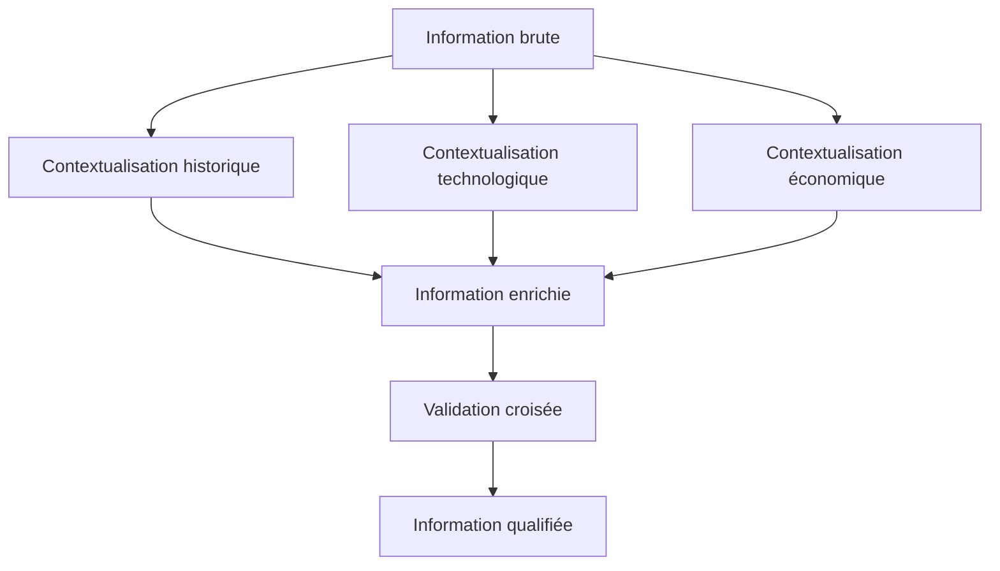

# 📊 Méthodologie de Recherche Avancée avec Roo

## Introduction

Ce document présente une méthodologie structurée pour mener des recherches avancées avec Roo. Cette approche systématique maximise l'efficacité de la collecte d'informations, de l'analyse et de la synthèse pour des projets complexes nécessitant une base informationnelle solide.

## Cadre méthodologique PRISMA-R

Le framework PRISMA-R (Planification, Recherche, Intégration, Synthèse, Méta-analyse, Application - Roo) structure le processus de recherche en phases distinctes mais interconnectées:

### 1. Planification stratégique

#### 1.1 Définition de la problématique
```python
# Exemple de structuration de problématique
recherche = {
    "question_principale": "Impact de l'IA générative sur la productivité des développeurs",
    "sous_questions": [
        "Quelles tâches sont les plus optimisées par l'IA générative?",
        "Quels sont les indicateurs mesurables de productivité?",
        "Quelles sont les limitations actuelles?",
        "Comment évolue l'adoption dans différents secteurs?"
    ],
    "contraintes": ["Études publiées après 2020", "Focus sur environnements professionnels"],
    "exclusions": ["IA non générative", "Usages non-développement"]
}
```

#### 1.2 Cartographie conceptuelle
Créez une carte des concepts clés et leurs relations pour guider la recherche:

```
IA Générative
├── Technologies
│   ├── LLMs (GPT-4, Claude, etc.)
│   ├── Assistants de code (GitHub Copilot, etc.)
│   └── Outils de génération (Roo, etc.)
├── Productivité développeur
│   ├── Métriques quantitatives
│   │   ├── Vitesse de développement
│   │   ├── Réduction des bugs
│   │   └── Complexité du code
│   └── Métriques qualitatives
│       ├── Satisfaction développeur
│       ├── Créativité
│       └── Transfert de connaissances
└── Contextes d'application
    ├── Entreprises
    ├── Open source
    └── Éducation
```

#### 1.3 Définition des critères d'évaluation

| Critère | Description | Pondération |
|---------|-------------|-------------|
| Pertinence | Alignement avec la problématique | Élevée |
| Actualité | Récence des informations | Moyenne |
| Fiabilité | Crédibilité de la source | Élevée |
| Profondeur | Niveau de détail et d'analyse | Moyenne |
| Applicabilité | Potentiel d'application pratique | Élevée |

### 2. Recherche multi-modale

#### 2.1 Configuration des sources

```javascript
// Configuration des sources pour Roo
const sourceConfig = {
  prioritaires: [
    { type: "academic", engines: ["Google Scholar", "ArXiv", "ACM Digital Library"] },
    { type: "technical", engines: ["GitHub", "Stack Overflow", "Dev.to"] },
    { type: "industry", engines: ["TechCrunch", "InfoQ", "ThoughtWorks"] }
  ],
  secondaires: [
    { type: "news", engines: ["Hacker News", "TechMeme"] },
    { type: "social", engines: ["Twitter", "LinkedIn"] }
  ],
  exclusions: ["non-verified sources", "paywalled content without abstracts"]
};
```

#### 2.2 Stratégies de requêtes avancées

| Type de requête | Structure | Exemple |
|----------------|-----------|---------|
| Booléenne | `concept1 AND concept2 AND (concept3 OR concept4)` | `"generative AI" AND "developer productivity" AND (metrics OR measurement)` |
| Proximité | `"concept1 concept2"~N` | `"AI pair programming"~5` |
| Wildcards | `concept*` | `develop* productiv*` |
| Filtres temporels | `after:YYYY-MM-DD before:YYYY-MM-DD` | `after:2022-01-01 before:2023-12-31` |
| Exclusions | `-concept` | `-"machine learning" -"computer vision"` |

#### 2.3 Extraction programmatique

Utilisez les MCP Servers pour extraire des données structurées:

```python
# Pseudo-code pour extraction via MCP
def extract_structured_data(sources, query_config):
    results = []
    
    # Utilisation de SearXNG pour recherche web
    web_results = mcp_searxng.search(query_config.main_query, 
                                     time_range=query_config.time_range)
    
    # Extraction de contenu avec JinaNavigator
    for result in web_results:
        page_content = mcp_jina.convert_web_to_markdown(result.url)
        structured_content = analyze_content(page_content)
        results.append(structured_content)
    
    # Recherche dans dépôts GitHub
    if "github" in sources:
        code_results = mcp_github.search_code(query_config.code_query)
        for repo in code_results:
            readme = mcp_github.get_file_contents(repo.owner, repo.name, "README.md")
            results.append(analyze_github_content(readme, repo))
    
    return results
```

### 3. Intégration et validation

#### 3.1 Matrice de triangulation

Créez une matrice pour valider les informations par recoupement:

| Information | Source 1 | Source 2 | Source 3 | Niveau de confiance |
|-------------|----------|----------|----------|---------------------|
| "L'IA générative réduit le temps de codage de 30%" | ✓ | ✓ | ✗ | Moyen |
| "Les développeurs juniors bénéficient davantage des assistants IA" | ✓ | ✓ | ✓ | Élevé |
| "La qualité du code généré par IA dépasse celle des humains" | ✗ | ✗ | ✓ | Faible |

#### 3.2 Analyse des biais et limitations

Pour chaque source majeure, évaluez:

- **Biais méthodologiques**: Échantillonnage, mesures, interprétation
- **Biais commerciaux**: Intérêts financiers, marketing déguisé
- **Biais cognitifs**: Confirmation, nouveauté, autorité
- **Limitations contextuelles**: Géographie, secteur, échelle

#### 3.3 Enrichissement contextuel



### 4. Synthèse multi-dimensionnelle

#### 4.1 Modèles de synthèse adaptés

| Type de synthèse | Structure | Cas d'usage |
|-----------------|-----------|-------------|
| Narrative | Introduction → Développement chronologique → Conclusion | Évolution technologique |
| Thématique | Thème 1 → Thème 2 → ... → Thème N | Comparaison de solutions |
| Analytique | Hypothèse → Preuves → Contre-arguments → Synthèse | Évaluation d'impact |
| Systémique | Composants → Interactions → Émergence → Limites | Architecture technique |

#### 4.2 Techniques de visualisation avancées

- **Cartes de chaleur**: Pour représenter la densité d'informations par sous-thème
- **Graphes de relations**: Pour visualiser les connexions entre concepts
- **Chronologies interactives**: Pour situer les développements dans le temps
- **Tableaux de bord**: Pour agréger métriques et indicateurs clés

#### 4.3 Méta-analyse quantitative

Pour les données numériques issues de multiples sources:

```r
# Pseudo-code R pour méta-analyse
library(metafor)

# Préparation des données
effect_sizes <- c(0.32, 0.45, 0.28, 0.51, 0.38)
standard_errors <- c(0.08, 0.12, 0.09, 0.14, 0.11)
sample_sizes <- c(120, 85, 150, 75, 100)

# Méta-analyse à effets aléatoires
meta_result <- rma(yi = effect_sizes, 
                  sei = standard_errors, 
                  method = "REML")

# Forest plot
forest(meta_result, 
       slab = paste("Étude", 1:5, 
                   " (n=", sample_sizes, ")", sep=""))
```

### 5. Application et itération

#### 5.1 Framework de prise de décision

```
┌─────────────────────┐     ┌─────────────────────┐     ┌─────────────────────┐
│  Données probantes  │     │  Expertise          │     │  Contexte           │
│                     │     │                     │     │                     │
│  - Recherche        │     │  - Connaissances    │     │  - Contraintes      │
│  - Statistiques     │     │  - Expérience       │     │  - Ressources       │
│  - Études de cas    │     │  - Intuition        │     │  - Culture          │
└─────────────────────┘     └─────────────────────┘     └─────────────────────┘
          │                           │                           │
          ▼                           ▼                           ▼
┌─────────────────────────────────────────────────────────────────────────────┐
│                         Décision informée                                   │
└─────────────────────────────────────────────────────────────────────────────┘
```

#### 5.2 Boucle de rétroaction

Implémentez un cycle d'amélioration continue:

1. **Appliquer** les connaissances acquises
2. **Mesurer** les résultats obtenus
3. **Analyser** les écarts avec les prévisions
4. **Ajuster** la stratégie de recherche
5. **Répéter** le processus avec les nouvelles questions

#### 5.3 Documentation évolutive

Maintenez une base de connaissances vivante:

```yaml
# Structure de documentation évolutive
knowledge_base:
  core_findings:
    - id: "CF001"
      statement: "L'IA générative réduit le temps de codage de 30% en moyenne"
      confidence: 0.85
      sources: ["S001", "S003", "S007"]
      last_updated: "2023-11-15"
      
  open_questions:
    - id: "OQ003"
      question: "Comment mesurer l'impact sur la qualité architecturale?"
      priority: "high"
      related_findings: ["CF001", "CF008"]
      
  action_items:
    - id: "AI002"
      task: "Développer un framework d'évaluation comparative"
      assignee: "Équipe R&D"
      deadline: "2023-12-31"
      dependencies: ["OQ003"]
```

## Implémentation avec Roo

### Configuration de l'environnement de recherche

```javascript
// Configuration de l'environnement Roo pour recherche avancée
const researchEnvironment = {
  // Modes à utiliser selon les phases
  modes: {
    planning: "architect",
    dataCollection: "code",
    analysis: "debug",
    synthesis: "ask",
    coordination: "orchestrator"
  },
  
  // Outils MCP à exploiter
  mcpTools: [
    { server: "searxng", tools: ["searxng_web_search", "web_url_read"] },
    { server: "jinavigator", tools: ["convert_web_to_markdown", "extract_markdown_outline"] },
    { server: "github", tools: ["search_code", "search_repositories", "get_file_contents"] },
    { server: "quickfiles", tools: ["read_multiple_files", "search_in_files"] }
  ],
  
  // Structure de stockage des résultats
  outputStructure: {
    rawData: "./data/raw/",
    processedData: "./data/processed/",
    analysis: "./analysis/",
    visualizations: "./visualizations/",
    reports: "./reports/"
  }
};
```

### Workflow d'exécution

1. **Initialisation**
   ```
   roo orchestrator "Initialiser projet de recherche sur l'IA générative et productivité"
   ```

2. **Planification**
   ```
   roo architect "Concevoir une stratégie de recherche sur l'impact de l'IA générative"
   ```

3. **Collecte de données**
   ```
   roo code "Implémenter les scripts d'extraction de données depuis les sources identifiées"
   ```

4. **Analyse**
   ```
   roo debug "Analyser les données collectées et identifier les patterns et anomalies"
   ```

5. **Synthèse**
   ```
   roo ask "Synthétiser les résultats de recherche sur l'IA générative et la productivité"
   ```

### Évaluation et amélioration continue

Utilisez ces métriques pour évaluer et améliorer votre processus de recherche:

| Métrique | Description | Cible |
|----------|-------------|-------|
| Couverture | % des sous-questions adressées | >90% |
| Diversité des sources | Indice d'hétérogénéité des sources | >0.7 |
| Profondeur | Niveaux d'analyse atteints | ≥3 |
| Cohérence | Taux de contradictions résolues | >95% |
| Applicabilité | % des insights actionnables | >80% |

## Conclusion

Cette méthodologie de recherche avancée transforme Roo en un puissant assistant de recherche capable de traiter des problématiques complexes avec rigueur et profondeur. En suivant ce cadre structuré, vous pouvez exploiter pleinement les capacités de Roo pour générer des insights de haute valeur à partir de sources d'information diverses et volumineuses.

---

Pour voir cette méthodologie appliquée à un cas concret, consultez [l'exemple de synthèse d'informations](./exemple-synthese.md).