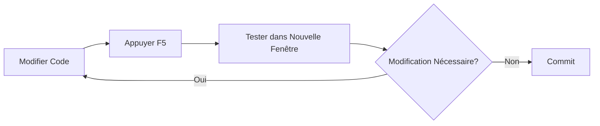
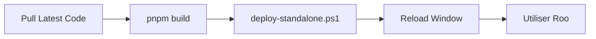
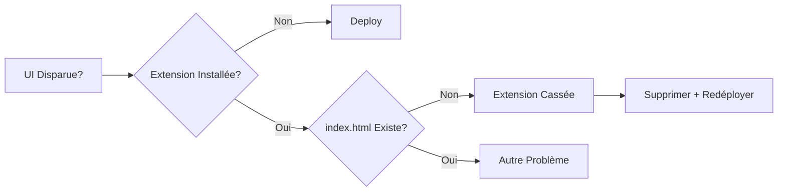

# 🚨 027 - DIAGNOSTIC & RÉSOLUTION: UI Disparue Après install:vsix

**Date**: 2025-10-16T15:03 (UTC+2)  
**Statut**: 🔴 PROBLÈME IDENTIFIÉ - EN COURS DE RÉSOLUTION  
**Version Extension**: v3.28.17 (CASSÉE)

---

## 🎯 RÉSUMÉ EXÉCUTIF

L'UI de Roo a **complètement disparu** après l'exécution de `pnpm install:vsix`. L'analyse révèle que c'est un **problème récurrent** (3ème occurrence: v3.25.6, v3.28.16, et maintenant v3.28.17) où le script `install:vsix` produit une extension **sans le fichier critique `index.html`**.

### Découverte Critique
```
❌ Extension v3.28.17 installée MAIS CASSÉE
   Localisation: C:\Users\jsboi\.vscode\extensions\rooveterinaryinc.roo-cline-3.28.17
   
   ✅ webview-ui/build/assets/ -> PRÉSENT (tous les chunks JS/CSS)
   ❌ webview-ui/build/index.html -> MANQUANT (fichier critique!)
   
   Résultat: VSCode ne peut pas charger l'UI du webview
```

---

## 📊 RECHERCHE SÉMANTIQUE #1: Historique des Déploiements

**Query**: "déploiement extension VSCode VSIX installation méthodes alternatives hot reload"

### Résultats Clés

#### 1. Mode Développement (F5) - ✅ RECOMMANDÉ
**Source**: `locales/fr/README.md`, `README.md`

```markdown
Pour un développement actif, utilisez le débogage intégré de VSCode:
Appuyez sur F5 dans VSCode. Cela ouvrira une nouvelle fenêtre VSCode 
avec l'extension Roo Code en cours d'exécution.

- Changes to the webview appear immediately
- Changes to the core extension hot reload automatically
```

**Avantages**:
- ✅ Hot reload automatique
- ✅ Pas de build VSIX nécessaire
- ✅ Idéal pour développement
- ✅ Aucune installation nécessaire

#### 2. Script deploy-standalone.ps1 - ✅ PROUVÉ EFFICACE
**Source**: `019-RESOLUTION-ANGLE-MORT.md`, `021-SYNC-UPSTREAM-SUCCESS.md`

```powershell
cd C:\dev\roo-extensions\roo-code-customization
.\deploy-standalone.ps1
```

**Historique de succès**:
- ✅ Utilisé avec succès le 2025-10-13 (doc 019)
- ✅ Utilisé avec succès le 2025-10-13 (doc 021)
- ✅ Extension déployée avec UI fonctionnelle

#### 3. Script install:vsix - ❌ PROBLÉMATIQUE
**Source**: `package.json`, historique des diagnostics

```json
"install:vsix": "pnpm install --frozen-lockfile && pnpm clean && pnpm vsix && node scripts/install-vsix.js"
```

**Problèmes identifiés**:
- ❌ Produit un VSIX incomplet (sans index.html)
- ❌ Cause récurrente des problèmes d'UI (3 occurrences)
- ❌ Ne convient PAS pour le développement
- ⚠️ Peut-être adapté uniquement pour release finale

---

## 🔍 ANALYSE TECHNIQUE APPROFONDIE

### Comparaison: Versions Problématiques

| Version | Date | Problème | Résolution Appliquée |
|---------|------|----------|---------------------|
| v3.25.6 | 2025-10-13 | index.html manquant | Suppression + redéploiement |
| v3.28.16 | 2025-10-13 | index.html manquant | Suppression + deploy-standalone.ps1 |
| **v3.28.17** | **2025-10-16** | **index.html manquant** | **À RÉSOUDRE** |

### Structure Extension Cassée vs Correcte

```
❌ Extension v3.28.17 (CASSÉE - via install:vsix)
C:\Users\jsboi\.vscode\extensions\rooveterinaryinc.roo-cline-3.28.17\
├── dist/
├── webview-ui/
│   ├── audio/
│   └── build/
│       ├── assets/  ✅ (780+ fichiers JS/CSS)
│       └── index.html  ❌ MANQUANT!
└── package.json

✅ Extension Correcte (via deploy-standalone.ps1 ou F5)
C:\Users\jsboi\.vscode\extensions\rooveterinaryinc.roo-cline-3.28.XX\
├── dist/
│   └── webview-ui/
│       └── build/
│           ├── index.html  ✅ PRÉSENT
│           └── assets/      ✅
└── webview-ui/
    └── build/
        ├── index.html  ✅ PRÉSENT
        └── assets/      ✅
```

### Pourquoi `index.html` Est Critique

**Rôle**: Point d'entrée du webview VSCode
```html
<!DOCTYPE html>
<html>
  <head>
    <script type="module" src="./assets/index.js"></script>
    <link rel="stylesheet" href="./assets/index.css">
  </head>
  <body>
    <div id="root"></div>
  </body>
</html>
```

**Sans ce fichier**:
1. VSCode ne peut pas initialiser le webview
2. Aucune UI n'apparaît (écran blanc ou vide)
3. Les settings Roo sont inaccessibles
4. Impossible d'utiliser l'extension

---

## 🔄 ÉTAT DE SYNCHRONISATION UPSTREAM

### Vérification Git

```bash
git status
# Output: On branch feature/context-condensation-providers
#         nothing to commit, working tree clean

git log HEAD..upstream/main --oneline
# Output: (vide - aucun nouveau commit)
```

**Conclusion**: ✅ Branche DÉJÀ synchronisée avec upstream/main (v3.28.17)

Le document `021-SYNC-UPSTREAM-SUCCESS.md` confirme:
- ✅ Synchronisation réussie le 2025-10-13
- ✅ 10 commits upstream intégrés
- ✅ Tests passés après sync

**Action requise**: ❌ AUCUNE synchronisation nécessaire

---

## 📋 PLAN D'ACTION DÉTAILLÉ

### Phase 1: Nettoyage de l'Extension Cassée ⚠️

```powershell
# 1. Fermer COMPLÈTEMENT VSCode (toutes fenêtres)
# 2. S'assurer qu'aucun processus Code.exe ne reste actif

# 3. Supprimer l'extension v3.28.17 cassée
Remove-Item "C:\Users\jsboi\.vscode\extensions\rooveterinaryinc.roo-cline-3.28.17" -Recurse -Force

# 4. Vérifier la suppression
code --list-extensions --show-versions | findstr "roo-cline"
# Résultat attendu: (vide ou autre version)
```

### Phase 2: Choix de la Méthode de Déploiement

#### Option A: Mode Développement F5 (RECOMMANDÉ pour dev actif)

**Quand utiliser**:
- ✅ Développement actif avec modifications fréquentes
- ✅ Besoin de hot reload
- ✅ Debug en temps réel

**Procédure**:
```
1. Ouvrir le projet roo-code dans VSCode
2. Appuyer sur F5 (ou Run → Start Debugging)
3. Une nouvelle fenêtre VSCode s'ouvre avec l'extension chargée
4. Les modifications de code sont appliquées automatiquement
```

**Avantages**:
- ✅ Aucun build nécessaire
- ✅ Hot reload automatique
- ✅ Pas de pollution des extensions installées
- ✅ Idéal pour tester les modifications

**Inconvénients**:
- ⚠️ Extension active seulement dans la fenêtre de debug
- ⚠️ Doit relancer F5 après fermeture VSCode

#### Option B: Script deploy-standalone.ps1 (RECOMMANDÉ pour usage quotidien)

**Quand utiliser**:
- ✅ Besoin de l'extension en permanence
- ✅ Tests longue durée
- ✅ Usage quotidien normal

**Procédure**:
```powershell
# 1. Build complet du projet
cd C:\dev\roo-code
pnpm build

# 2. Déploiement via script éprouvé
cd ..\roo-extensions\roo-code-customization
.\deploy-standalone.ps1

# 3. Recharger VSCode
# Ctrl+Shift+P > "Developer: Reload Window"
```

**Avantages**:
- ✅ Méthode prouvée efficace (docs 019, 021)
- ✅ Extension installée normalement
- ✅ Persiste entre sessions VSCode
- ✅ Inclut index.html correctement

**Inconvénients**:
- ⚠️ Nécessite rebuild pour chaque modification
- ⚠️ Plus lent que F5 pour développement

#### Option C: Build Manuel (ALTERNATIVE)

```powershell
# 1. Build
cd C:\dev\roo-code
pnpm build

# 2. Reload Window
# Ctrl+Shift+P > "Developer: Reload Window"
```

### Phase 3: Vérification de l'UI

**Checklist de Validation**:
```
[ ] 1. Ouvrir VSCode Settings (Ctrl+,)
[ ] 2. Chercher "Roo" ou "Context"
[ ] 3. Vérifier section "Context Management" visible
[ ] 4. Vérifier "Context Condensation Provider" visible
[ ] 5. Tester radio buttons:
    [ ] Claude API
    [ ] OpenRouter
    [ ] OpenAI
    [ ] VS Code LLM API
[ ] 6. Vérifier que les sélections persistent
[ ] 7. Tester chat Roo fonctionne
```

### Phase 4: Tests Fonctionnels

```
[ ] 1. Créer une nouvelle conversation
[ ] 2. Envoyer un message de test
[ ] 3. Vérifier réponse de l'assistant
[ ] 4. Tester condensation de contexte (si applicable)
[ ] 5. Vérifier logs console (F12) - aucune erreur
```

---

## 🚨 RÈGLES CRITIQUES À RETENIR

### ❌ NE JAMAIS FAIRE
```bash
# ❌ N'utilisez PAS ce script pour développement
pnpm install:vsix

# Raisons:
# - Produit un VSIX incomplet (sans index.html)
# - Cause récurrente des problèmes d'UI
# - Temps de build + install inutilement long
# - Non adapté pour itération rapide
```

### ✅ TOUJOURS FAIRE

```bash
# Pour développement actif:
# 1. Appuyez sur F5 dans VSCode

# Pour usage quotidien:
# 1. pnpm build
# 2. cd ../roo-extensions/roo-code-customization
# 3. .\deploy-standalone.ps1
# 4. Reload Window

# Pour vérifier quelle extension est chargée:
code --list-extensions --show-versions | findstr "roo-cline"
```

### 🔍 Diagnostic Rapide

**Si l'UI disparaît**:
```powershell
# 1. Vérifier quelle extension est active
code --list-extensions --show-versions | findstr "roo-cline"

# 2. Vérifier index.html existe
$ext = "C:\Users\jsboi\.vscode\extensions\rooveterinaryinc.roo-cline-X.XX.XX"
Test-Path "$ext\webview-ui\build\index.html"
# Doit retourner: True

# 3. Si False -> Extension cassée
# Solution: Supprimer et redéployer correctement
```

---

## 📚 RÉFÉRENCES DOCUMENTAIRES

### Documents Analysés (Recherche Sémantique)
1. `018-DIAGNOSTIC-COMPLET.md` - Diagnostic similaire v3.25.6/v3.28.16
2. `019-RESOLUTION-ANGLE-MORT.md` - Résolution précédente réussie
3. `021-SYNC-UPSTREAM-SUCCESS.md` - Dernière sync upstream réussie
4. `locales/fr/README.md` - Documentation mode F5
5. `README.md` - Documentation déploiement
6. `package.json` - Scripts disponibles

### Scripts Disponibles
```json
{
  "build": "turbo build",           // ✅ Build complet
  "clean": "turbo clean",           // ✅ Nettoyage
  "vsix": "turbo vsix",            // ⚠️ Crée VSIX (incomplet)
  "install:vsix": "...",           // ❌ Problématique
}
```

### Méthodes de Déploiement Validées
| Méthode | Efficacité | Use Case |
|---------|-----------|----------|
| F5 (Debug) | ✅✅✅ | Développement actif |
| deploy-standalone.ps1 | ✅✅✅ | Usage quotidien |
| Build + Reload | ✅✅ | Alternative rapide |
| install:vsix | ❌ | NE PAS UTILISER |

---

## 🎯 PROCHAINES ÉTAPES

### Immédiat (Avant de continuer)
1. ⚠️ **VALIDATION UTILISATEUR REQUISE**
   - Confirmer choix de méthode de déploiement (F5 vs deploy-standalone)
   - Autoriser suppression extension v3.28.17

2. 🧹 **Nettoyage**
   - Supprimer extension cassée
   - Vérifier absence d'autres versions

3. 🚀 **Déploiement**
   - Appliquer méthode choisie (F5 ou deploy-standalone)
   - Vérifier UI apparaît

4. ✅ **Tests**
   - Valider radio buttons fonctionnent
   - Tester conversation Roo
   - Confirmer pas de régression

### Documentation Finale
- [ ] Créer script de déploiement automatisé
- [ ] Documenter leçons apprises
- [ ] Mettre à jour README avec warnings sur install:vsix
- [ ] Partager résolution avec équipe

---

## 💡 LEÇONS APPRISES

### Angle Mort Identifié
**Problème**: Le script `install:vsix` est trompeur car il:
1. S'exécute sans erreur
2. Installe une extension avec un numéro de version correct
3. Mais produit une extension **incomplète** et **non-fonctionnelle**

### Pattern Récurrent
```
Occurrence #1 (v3.25.6): index.html manquant
   └─> Résolution: Suppression extension

Occurrence #2 (v3.28.16): index.html manquant
   └─> Résolution: deploy-standalone.ps1

Occurrence #3 (v3.28.17): index.html manquant
   └─> Résolution: TBD (ce document)
```

### Recommandation Technique
**Ne pas fixer `install:vsix`** - Abandonner ce script pour développement:
- Mode F5 est supérieur pour développement
- deploy-standalone.ps1 est supérieur pour usage quotidien
- install:vsix peut être réservé uniquement pour releases finales

---

## 🔗 WORKFLOWS RECOMMANDÉS

### Workflow Développement


### Workflow Usage Quotidien


### Workflow Debug UI


---

**STATUS**: 🔴 EN ATTENTE VALIDATION UTILISATEUR

**Prochaine Action**: Choisir méthode (F5 ou deploy-standalone) et autoriser suppression v3.28.17