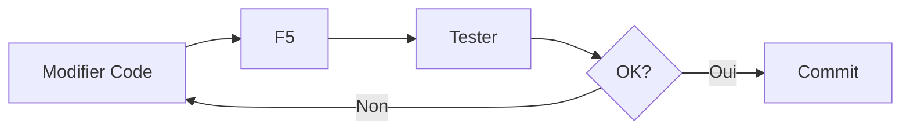
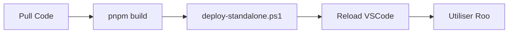

# 🚀 Guide de Déploiement Rapide - Extension Roo

**Version**: v3.28.17+  
**Mis à jour**: 2025-10-19

---

## ⚡ Déploiement en 2 Minutes

### 🎯 Pour le Développement Actif

```bash
# 1. Ouvrir le projet
cd C:\dev\roo-code

# 2. Lancer F5
# Appuyer sur F5 dans VSCode

# ✅ Terminé! Nouvelle fenêtre VSCode avec l'extension active
```

### 🏭 Pour l'Usage Quotidien

```bash
# 1. Build complet
cd C:\dev\roo-code
pnpm build

# 2. Déploiement
cd ../roo-extensions/roo-code-customization
./deploy-standalone.ps1

# 3. Recharger VSCode
# Ctrl+Shift+P > "Developer: Reload Window"

# ✅ Terminé! Extension installée et fonctionnelle
```

---

## 🚨 Ce Qu'il FAUT ÉVITER

```bash
# ❌ NE JAMAIS UTILISER
pnpm install:vsix

# Pourquoi:
# - Produit une extension cassée (sans index.html)
# - Problèmes récurrents d'UI
# - Temps de build inutilement long
```

---

## 🔍 Vérification Rapide

### Checklist Post-Déploiement

```
[ ] 1. Ouvrir VSCode Settings (Ctrl+,)
[ ] 2. Chercher "Roo" ou "Context"
[ ] 3. Vérifier section "Context Management" visible
[ ] 4. Vérifier "Context Condensation Provider" visible
[ ] 5. Tester radio buttons:
    [ ] Claude API
    [ ] OpenRouter
    [ ] OpenAI
    [ ] VS Code LLM API
[ ] 6. Vérifier que les sélections persistent
[ ] 7. Tester chat Roo fonctionne
```

### Diagnostic Rapide

**Si l'UI ne s'affiche pas:**
```powershell
# 1. Vérifier quelle extension est active
code --list-extensions --show-versions | findstr "roo-cline"

# 2. Vérifier index.html existe
$ext = "C:\Users\jsboi\.vscode\extensions\rooveterinaryinc.roo-cline-3.28.17"
Test-Path "$ext\webview-ui\build\index.html"
# Doit retourner: True

# 3. Si False → Extension cassée
# Solution: Supprimer et redéployer avec deploy-standalone.ps1
```

---

## 📋 Méthodes de Déploiement Comparées

| Méthode | Temps | Fiabilité | Use Case | Recommandation |
|---------|-------|-----------|----------|----------------|
| **F5 Debug** | 10s | ✅✅✅ | Développement actif | **Recommandé** pour dev |
| **deploy-standalone.ps1** | 2min | ✅✅✅ | Usage quotidien | **Recommandé** pour prod |
| **Build + Reload** | 1min | ✅✅ | Alternative rapide | Optionnel |
| **install:vsix** | 3min | ❌ | Release finale | **À ÉVITER** |

---

## 🛠️ Commandes Essentielles

### Développement
```bash
# Hot reload immédiat
F5 dans VSCode

# Recharger la fenêtre de debug
Ctrl+R dans la fenêtre de debug
```

### Production
```bash
# Build complet
pnpm build

# Déploiement rapide
cd ../roo-extensions/roo-code-customization
./deploy-standalone.ps1

# Recharger VSCode
Ctrl+Shift+P > "Developer: Reload Window"
```

### Nettoyage
```bash
# Supprimer extension cassée
Remove-Item "C:\Users\jsboi\.vscode\extensions\rooveterinaryinc.roo-cline-3.28.17" -Recurse -Force

# Vérifier extensions installées
code --list-extensions --show-versions | findstr "roo-cline"
```

---

## 🎯 Workflows Recommandés

### Workflow Développeur


### Workflow Utilisateur


---

## 📞 Support et Dépannage

### Problèmes Courants

**UI disparue après déploiement:**
```bash
# Cause: install:vsix utilisé (extension cassée)
# Solution: Supprimer et utiliser deploy-standalone.ps1
```

**Radio buttons non-fonctionnels:**
```bash
# Cause: Extension ancienne installée
# Solution: Rebuild et redéployer
```

**F5 ne fonctionne pas:**
```bash
# Cause: .vscode/settings.json avec args PowerShell
# Solution: Vérifier la configuration (voir rapport 031)
```

### Obtenir de l'Aide

1. **Vérifier la documentation**: `031-RAPPORT-FINAL-SUCCES.md`
2. **Consulter les diagnostics**: `027-DEPLOYMENT-FIX-AND-VERIFICATION.md`
3. **Analyser les logs**: Console développeur VSCode (F12)

---

## ✅ Validation Finale

### Tests Rapides

```bash
# 1. Test des radio buttons
# Cliquer sur chaque provider et vérifier la persistance

# 2. Test de conversation
# Créer une nouvelle conversation et envoyer un message

# 3. Test des settings
# Modifier des paramètres et vérifier la sauvegarde

# 4. Test de rechargement
# Reload VSCode et vérifier que tout est préservé
```

### Success Criteria

- ✅ UI s'affiche correctement
- ✅ Radio buttons fonctionnent
- ✅ Les sélections persistent
- ✅ Chat Roo répond
- ✅ Pas d'erreur dans console

---

## 📚 Références

- **Rapport complet**: `031-RAPPORT-FINAL-SUCCES.md`
- **Analyse technique**: `026-BUG-RADIO-BUTTONS-ROOT-CAUSE-ANALYSIS.md`
- **Scripts de test**: `scripts/final-validation.ps1`

---

**Status**: ✅ GUIDE VALIDÉ  
**Next Steps**: Utiliser ce guide pour tous les déploiements futurs

---

*Guide simplifié pour déploiement rapide et fiable de l'extension Roo*