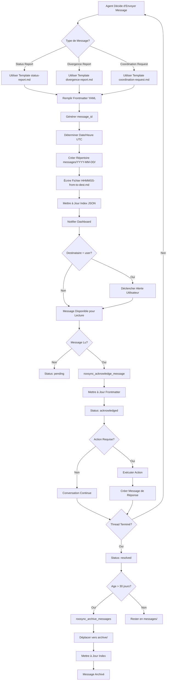
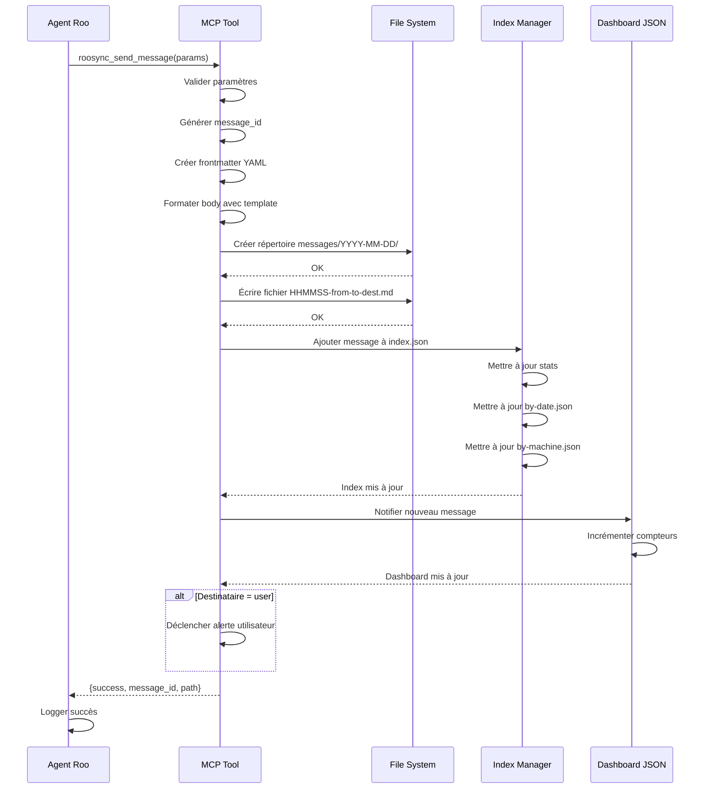
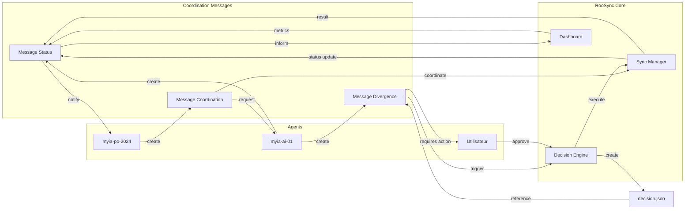

# 🗓️ Architecture des Messages de Coordination Temporelle RooSync v2.0

**Version :** 1.0.0  
**Date :** 2025-10-15  
**Auteur :** Architecture Design (Sous-tâche)  
**Statut :** Spécification Complète

---

## 📋 Vue d'Ensemble

### Contexte

RooSync v2.0 utilise actuellement des messages de coordination agent-to-agent au format Markdown stockés dans `.shared-state/` avec une convention de nommage plate (`message-from-*.md`). Cette architecture manque de structure temporelle claire, rendant difficile :

- La recherche de messages par période
- L'archivage automatique des conversations anciennes
- La compréhension de l'historique de coordination
- Le débogage de séquences temporelles

### Objectif

Concevoir une architecture hiérarchique temporelle pour organiser les messages selon le pattern : 

```
messages/
  ├── {YYYY-MM-DD}/
  │   ├── {HHMMSS}-{source}-to-{destination}.md
  │   └── ...
  └── ...
```

### Principes Directeurs

1. **Compatibilité ascendante** : Ne pas casser les systèmes actuels
2. **Lisibilité humaine** : Markdown reste le format de base
3. **Facilité de recherche** : Index JSON pour requêtes rapides
4. **Facilité de débogage** : Chronologie claire et traçable
5. **Compatible Google Drive** : Structure sync-friendly

---

## 🗂️ 1. Structure de Répertoires

### 1.1 Arborescence Complète

```
RooSync/.shared-state/
├── messages/                          # Nouveau répertoire temporel
│   ├── 2025-10-15/                   # Répertoire par date (ISO 8601 sans tiret)
│   │   ├── 141530-myia-ai-01-to-myia-po-2024.md
│   │   ├── 152045-myia-po-2024-to-myia-ai-01.md
│   │   └── 161203-myia-ai-01-to-all.md
│   ├── 2025-10-14/
│   │   └── ...
│   ├── archive/                      # Messages anciens (> 30 jours)
│   │   └── 2025-09/
│   │       └── 2025-09-15/
│   │           └── ...
│   ├── templates/                    # Templates de messages
│   │   ├── status-report.md
│   │   ├── divergence-report.md
│   │   └── coordination-request.md
│   └── .index/                       # Index JSON (auto-généré)
│       ├── index.json               # Index global
│       ├── by-date.json             # Index par date
│       ├── by-machine.json          # Index par machine
│       └── by-type.json             # Index par type de message
│
├── message-from-*.md                 # Format actuel (rétrocompatibilité)
├── sync-dashboard.json               # Dashboard principal
├── sync-config.json                  # Configuration partagée
└── sync-roadmap.md                   # Roadmap partagée
```

### 1.2 Conventions de Nommage

#### Format de Date
- **Standard :** ISO 8601 format `YYYY-MM-DD`
- **Exemple :** `2025-10-15`
- **Timezone :** UTC (toujours)

#### Format d'Heure
- **Standard :** 24h format `HHMMSS` (sans séparateurs)
- **Exemple :** `141530` pour 14:15:30 UTC
- **Précision :** Secondes (suffisant pour éviter collisions)

#### Format de Nom de Machine
- **Standard :** Slug normalisé du hostname
- **Règles :** 
  - Minuscules uniquement
  - Lettres, chiffres, tirets
  - Pas d'espaces ni caractères spéciaux
  - Max 32 caractères
- **Exemples :** 
  - `myia-ai-01`
  - `myia-po-2024`
  - `prod-server-01`

#### Format Complet de Fichier

**Pattern :** `{HHMMSS}-{source}-to-{destination}.md`

**Exemples :**
- `141530-myia-ai-01-to-myia-po-2024.md` (message point-à-point)
- `152045-myia-po-2024-to-all.md` (broadcast)
- `161203-myia-ai-01-to-user.md` (message vers utilisateur)

**Cas Spéciaux :**
- `{source}-to-all` : Broadcast à toutes les machines
- `{source}-to-user` : Message nécessitant intervention utilisateur
- `{source}-to-system` : Message système/log

### 1.3 Répertoires Spéciaux

#### `archive/`
- **But :** Archivage automatique des messages > 30 jours
- **Structure :** `archive/{YYYY-MM}/{YYYY-MM-DD}/`
- **Critères :** 
  - Messages non référencés dans décisions actives
  - Pas d'actions en attente
  - Older than `ARCHIVE_THRESHOLD_DAYS` (défaut: 30)

#### `templates/`
- **But :** Templates standardisés pour création rapide
- **Contenu :**
  - Frontmatter pré-rempli
  - Sections obligatoires
  - Exemples de formatage
  - Marqueurs de statut

#### `.index/`
- **But :** Index JSON pour recherche rapide
- **Format :** JSON (auto-généré par outils MCP)
- **Régénération :** À chaque création/modification de message
- **Ignoré :** Par `.gitignore` (volatile)

---

## 📄 2. Format Standardisé des Messages

### 2.1 Frontmatter YAML

**Structure Obligatoire :**

```yaml
---
# Métadonnées Obligatoires
message_id: "msg-20251015-141530-ai01-po24"
from: "myia-ai-01"
to: "myia-po-2024"
timestamp: "2025-10-15T14:15:30.000Z"
type: "status_report" | "divergence_report" | "coordination_request" | "response" | "broadcast"

# Métadonnées Optionnelles
in_reply_to: "msg-20251015-120345-po24-ai01"  # ID du message parent
decision_id: "dec-20251015-001"                # Référence décision RooSync
checkpoint: "CHECKPOINT-RESOLUTION"            # Checkpoint protocole coordination
priority: "high" | "normal" | "low"
tags: ["sync", "critical", "requires-action"]
expires_at: "2025-10-20T14:15:30.000Z"        # Pour messages temporaires

# Statut et Traçabilité
status: "pending" | "acknowledged" | "resolved" | "expired"
acknowledged_by: ["myia-po-2024"]
acknowledged_at: "2025-10-15T14:20:00.000Z"
---
```

### 2.2 Sections Obligatoires

Chaque message DOIT contenir les sections suivantes (dans l'ordre) :

```markdown
# 📨 [Titre Descriptif du Message]

**🔍 Résumé Exécutif** (1-2 phrases)

---

## 📊 Contexte

[Description du contexte et de la situation actuelle]

---

## 🎯 Objectif / Action Requise

[Ce qui est demandé ou communiqué]

---

## 📋 Détails

[Détails techniques, logs, métriques, etc.]

---

## ✅ Prochaines Étapes

[Ce qui doit suivre, avec timeline si applicable]

---

## 💬 Notes / Observations

[Remarques additionnelles, questions, clarifications]

---

**Signature :** {machine_id}  
**Timestamp :** {ISO 8601 UTC}
```

### 2.3 Sections Optionnelles

Selon le type de message, ajouter :

```markdown
## 🔄 Historique des Échanges
[Si partie d'une conversation multi-messages]

## 📈 Métriques
[Statistiques, performances, indicateurs]

## ⚠️ Avertissements / Risques
[Problèmes potentiels identifiés]

## 🔗 Références
[Liens vers décisions, fichiers, documentation]
```

### 2.4 Marqueurs de Statut Standardisés

**Emojis Obligatoires :**

| Emoji | Signification | Usage |
|-------|---------------|-------|
| ✅ | Succès / Complété | Action réussie, validation OK |
| ⚠️ | Avertissement | Problème mineur, attention requise |
| 🔴 | Erreur / Bloquant | Problème critique, action impossible |
| 🔵 | Information | Notification, pas d'action requise |
| 🟡 | En attente | Action en cours, résultat attendu |
| 🟢 | Opérationnel | Système OK, pas de problème |
| ⏸️ | Pause / Suspendu | Action temporairement suspendue |
| 🔄 | En cours | Traitement actif |
| 📌 | Important | Nécessite attention particulière |
| 🚀 | Déployé / Actif | Changement appliqué avec succès |

**Format Standardisé :**

```markdown
### [Section Title]

**Status :** 🟢 Opérationnel  
**Action :** ✅ Complétée avec succès  
**Risque :** ⚠️ Attention requise pour X

**Détails :**
- ✅ Item complété
- 🔄 Item en cours
- 🔴 Item bloqué : [raison]
- 🟡 Item en attente de [dépendance]
```

### 2.5 Traçabilité et Références

**Format des IDs :**

```yaml
# Message ID
message_id: "msg-{YYYYMMDD}-{HHMMSS}-{source_short}-{dest_short}"
# Exemple: "msg-20251015-141530-ai01-po24"

# Decision ID (référence RooSync)
decision_id: "dec-{YYYYMMDD}-{seq}"
# Exemple: "dec-20251015-001"

# Thread ID (conversation multi-messages)
thread_id: "thread-{YYYYMMDD}-{HHMMSS}-{topic_slug}"
# Exemple: "thread-20251015-140000-sync-config-divergence"
```

**Liens Inter-Messages :**

```markdown
## 🔗 Références

**Thread :** [thread-20251015-140000-sync-config-divergence]
**Répond à :** [msg-20251015-120345-po24-ai01](../2025-10-15/120345-myia-po-2024-to-myia-ai-01.md)
**Décision Associée :** [dec-20251015-001](../../decisions/dec-20251015-001.json)
**Documentation :** [roosync-coordination-protocol.md](../../../docs/testing/roosync-coordination-protocol.md)
```

---

## 🔄 3. Stratégie de Migration

### 3.1 Approche par Étapes

#### Phase 1 : Préparation (Jour 1)
1. ✅ Créer structure de répertoires `messages/`
2. ✅ Créer templates dans `messages/templates/`
3. ✅ Initialiser index vide dans `messages/.index/`
4. ✅ Documenter mapping ancien → nouveau format

#### Phase 2 : Coexistence (Jours 2-7)
1. ✅ Système actuel continue de fonctionner
2. ✅ Nouveaux messages créés dans structure temporelle
3. ✅ Outils MCP lisent les deux emplacements
4. ✅ Avertissement utilisateur sur format obsolète

#### Phase 3 : Migration Manuelle (Jours 8-14)
1. ✅ Script de migration fourni (non automatique)
2. ✅ Utilisateur valide quels messages migrer
3. ✅ Messages migrés avec métadonnées enrichies
4. ✅ Originaux déplacés vers `.shared-state/deprecated/`

#### Phase 4 : Validation (Jour 15+)
1. ✅ Vérification intégrité messages migrés
2. ✅ Tests end-to-end avec nouveau format
3. ✅ Documentation mise à jour
4. ✅ Archivage définitif anciens messages

### 3.2 Règles de Mapping

**Ancien Format → Nouveau Format :**

| Ancien | Nouveau | Transformation |
|--------|---------|----------------|
| `message-from-myia-ai-01.md` | `{date}/{time}-myia-ai-01-to-{inferred}.md` | Extraire date de contenu ou last modified |
| `message-to-myia-ai-01-20251015-1605.md` | `2025-10-15/160500-{inferred}-to-myia-ai-01.md` | Parser date/heure du nom |
| Pas de frontmatter | Ajouter frontmatter complet | Extraire métadonnées du contenu |
| En-tête custom | Normaliser avec template | Standardiser sections |

**Extraction de Métadonnées :**

```markdown
# Ancien Format
**Date :** 2025-10-15 17:12 (Europe/Paris, UTC+2)
**De :** Machine `myia-ai-01`
**À :** Machine `myia-po-2024`

↓ Migration ↓

# Nouveau Format (Frontmatter)
---
from: "myia-ai-01"
to: "myia-po-2024"
timestamp: "2025-10-15T15:12:00.000Z"  # Conversion UTC
---
```

### 3.3 Script de Migration (Pseudo-code)

```typescript
// Exemple conceptuel - À implémenter dans MCP
async function migrateMessage(oldPath: string): Promise<string> {
  // 1. Lire message ancien format
  const content = await fs.readFile(oldPath, 'utf-8');
  
  // 2. Extraire métadonnées
  const metadata = extractMetadata(content);
  
  // 3. Valider et enrichir
  const enriched = {
    message_id: generateMessageId(metadata),
    from: metadata.from,
    to: metadata.to || 'unknown',
    timestamp: parseTimestamp(metadata.date, metadata.timezone),
    type: inferMessageType(content),
    status: 'acknowledged', // Messages anciens = déjà traités
    tags: extractTags(content)
  };
  
  // 4. Créer frontmatter
  const frontmatter = yaml.stringify(enriched);
  
  // 5. Normaliser sections
  const normalizedBody = normalizeSections(content);
  
  // 6. Générer nouveau fichier
  const date = enriched.timestamp.split('T')[0];
  const time = enriched.timestamp.split('T')[1].replace(/:/g, '').substring(0, 6);
  const newPath = `messages/${date}/${time}-${enriched.from}-to-${enriched.to}.md`;
  
  // 7. Écrire nouveau fichier
  await fs.writeFile(newPath, `---\n${frontmatter}---\n\n${normalizedBody}`);
  
  // 8. Déplacer ancien vers deprecated
  await fs.rename(oldPath, `deprecated/${path.basename(oldPath)}`);
  
  return newPath;
}
```

### 3.4 Préservation de l'Historique

**Principes :**
- ✅ Aucun message supprimé, seulement déplacé
- ✅ Backlinks créés automatiquement
- ✅ Index contient références croisées
- ✅ Logs de migration dans `.shared-state/migration-log.json`

**Format Log de Migration :**

```json
{
  "migration_date": "2025-10-15T16:00:00.000Z",
  "total_messages": 3,
  "migrated": [
    {
      "old_path": "message-from-myia-ai-01.md",
      "new_path": "messages/2025-10-15/151200-myia-ai-01-to-myia-po-2024.md",
      "status": "success",
      "warnings": []
    }
  ],
  "failed": [],
  "skipped": []
}
```

---

## 🔍 4. Système d'Indexation et Recherche

### 4.1 Index JSON Principal

**Fichier :** `messages/.index/index.json`

**Structure :**

```json
{
  "version": "1.0.0",
  "last_updated": "2025-10-15T16:00:00.000Z",
  "total_messages": 42,
  "messages": [
    {
      "id": "msg-20251015-141530-ai01-po24",
      "path": "messages/2025-10-15/141530-myia-ai-01-to-myia-po-2024.md",
      "from": "myia-ai-01",
      "to": "myia-po-2024",
      "type": "status_report",
      "timestamp": "2025-10-15T14:15:30.000Z",
      "status": "acknowledged",
      "checkpoint": "CHECKPOINT-RESOLUTION",
      "decision_id": "dec-20251015-001",
      "thread_id": "thread-20251015-140000-sync-config-divergence",
      "tags": ["sync", "critical"],
      "size_bytes": 7530,
      "line_count": 259
    }
  ],
  "stats": {
    "by_type": {
      "status_report": 15,
      "divergence_report": 8,
      "coordination_request": 10,
      "response": 9
    },
    "by_machine": {
      "myia-ai-01": 21,
      "myia-po-2024": 21
    },
    "by_status": {
      "acknowledged": 40,
      "pending": 2
    }
  }
}
```

### 4.2 Index Spécialisés

#### `by-date.json`
```json
{
  "2025-10-15": {
    "count": 8,
    "messages": ["msg-20251015-141530-ai01-po24", "..."],
    "first": "2025-10-15T09:00:00.000Z",
    "last": "2025-10-15T16:15:30.000Z"
  }
}
```

#### `by-machine.json`
```json
{
  "myia-ai-01": {
    "sent": 21,
    "received": 21,
    "last_activity": "2025-10-15T16:15:30.000Z",
    "threads": ["thread-20251015-140000-sync-config-divergence"]
  }
}
```

#### `by-type.json`
```json
{
  "status_report": {
    "count": 15,
    "latest": "msg-20251015-161530-ai01-po24",
    "oldest": "msg-20251013-090000-po24-ai01"
  }
}
```

### 4.3 API de Recherche (Conceptuel)

```typescript
// Interface de recherche pour outils MCP
interface MessageSearchQuery {
  from?: string;
  to?: string;
  type?: MessageType;
  date_range?: { start: string; end: string };
  checkpoint?: string;
  decision_id?: string;
  thread_id?: string;
  tags?: string[];
  status?: MessageStatus;
  text_search?: string; // Recherche full-text dans contenu
}

// Exemple d'utilisation
const results = await searchMessages({
  from: "myia-ai-01",
  date_range: { start: "2025-10-15", end: "2025-10-15" },
  type: "divergence_report",
  status: "pending"
});
```

### 4.4 Régénération Automatique

**Triggers :**
- Création d'un nouveau message
- Modification de métadonnées (status, acknowledgment)
- Migration de messages anciens
- Commande manuelle `roosync_rebuild_index`

**Performance :**
- Index incrémental (pas de rebuild complet)
- Cache en mémoire pour requêtes fréquentes
- Limitation à 1000 messages par index spécialisé
- Archivage automatique si dépassement

---

## 🛠️ 5. Intégration avec Outils MCP RooSync

### 5.1 Nouveaux Outils MCP

#### `roosync_send_message`

**Description :** Créer et envoyer un message dans la structure temporelle

**Paramètres :**
```typescript
{
  to: string;                    // Machine destination ou 'all'
  type: MessageType;
  subject: string;
  body: string;                  // Markdown
  decision_id?: string;
  checkpoint?: string;
  priority?: 'high' | 'normal' | 'low';
  tags?: string[];
  template?: string;             // Nom du template à utiliser
}
```

**Retour :**
```typescript
{
  success: true,
  message_id: "msg-20251015-161530-ai01-po24",
  path: "messages/2025-10-15/161530-myia-ai-01-to-myia-po-2024.md",
  url: "file:///G:/Mon%20Drive/..."
}
```

#### `roosync_read_messages`

**Description :** Lire messages avec filtres

**Paramètres :**
```typescript
{
  query: MessageSearchQuery;
  limit?: number;                // Défaut: 50
  offset?: number;
  include_content?: boolean;     // Défaut: false (seulement métadonnées)
  sort_by?: 'timestamp' | 'priority';
  sort_order?: 'asc' | 'desc';
}
```

**Retour :**
```typescript
{
  total: 8,
  results: [
    {
      id: "msg-20251015-141530-ai01-po24",
      from: "myia-ai-01",
      to: "myia-po-2024",
      timestamp: "2025-10-15T14:15:30.000Z",
      subject: "Status Update - RooSync Tests",
      status: "acknowledged",
      content?: "...",  // Si include_content=true
      path: "messages/2025-10-15/141530-..."
    }
  ]
}
```

#### `roosync_acknowledge_message`

**Description :** Marquer un message comme lu/traité

**Paramètres :**
```typescript
{
  message_id: string;
  acknowledgment: string;        // Commentaire optionnel
}
```

**Retour :**
```typescript
{
  success: true,
  acknowledged_at: "2025-10-15T16:20:00.000Z",
  message_updated: true
}
```

#### `roosync_archive_messages`

**Description :** Archiver messages anciens

**Paramètres :**
```typescript
{
  older_than_days?: number;      // Défaut: 30
  dry_run?: boolean;             // Simulation sans archivage
  exclude_active_threads?: boolean; // Défaut: true
}
```

**Retour :**
```typescript
{
  total_scanned: 150,
  eligible_for_archive: 42,
  archived: 42,
  skipped: 0,
  archive_path: "messages/archive/2025-09/"
}
```

### 5.2 Modifications d'Outils Existants

#### `roosync_init`

**Ajout :** Créer structure `messages/` lors de l'initialisation

```typescript
// Nouvelle section dans init.ts
const messageDirs = [
  'messages',
  'messages/templates',
  'messages/archive',
  'messages/.index'
];

for (const dir of messageDirs) {
  await fs.mkdir(path.join(sharedStatePath, dir), { recursive: true });
}

// Créer templates de base
await createDefaultTemplates(path.join(sharedStatePath, 'messages/templates'));
```

#### `roosync_get_status`

**Ajout :** Inclure statistiques des messages

```typescript
{
  ...existingStatus,
  messaging: {
    total_messages: 42,
    pending_messages: 2,
    last_message_at: "2025-10-15T16:15:30.000Z",
    by_type: {
      status_report: 15,
      divergence_report: 8,
      coordination_request: 10,
      response: 9
    }
  }
}
```

#### `roosync_compare_config`

**Ajout :** Créer message automatique en cas de divergence

```typescript
// Si divergences détectées
if (differences.length > 0) {
  // Créer message de divergence automatique
  await sendMessage({
    to: targetMachine,
    type: 'divergence_report',
    subject: `Configuration Divergence Detected - ${differences.length} differences`,
    body: formatDivergences(differences),
    priority: 'high',
    tags: ['auto-generated', 'config-divergence']
  });
}
```

### 5.3 Compatibilité Ascendante

**Stratégie :**

1. **Lecture Hybride :** Outils lisent à la fois ancien et nouveau format
2. **Écriture Progressive :** Nouveaux messages dans nouveau format uniquement
3. **Dépréciation Graduelle :** Warnings puis erreur sur ancien format
4. **Migration Opt-in :** Utilisateur décide quand migrer

**Exemple d'Implémentation :**

```typescript
async function readAllMessages(): Promise<Message[]> {
  const messages: Message[] = [];
  
  // 1. Lire nouveau format (prioritaire)
  const temporalMessages = await readTemporalMessages('messages/');
  messages.push(...temporalMessages);
  
  // 2. Lire ancien format (fallback)
  const legacyMessages = await readLegacyMessages('.shared-state/message-*.md');
  
  // 3. Marquer messages legacy
  legacyMessages.forEach(msg => {
    msg.tags = [...(msg.tags || []), 'legacy-format'];
    msg.migration_needed = true;
  });
  
  messages.push(...legacyMessages);
  
  // 4. Trier par timestamp
  return messages.sort((a, b) => 
    new Date(b.timestamp).getTime() - new Date(a.timestamp).getTime()
  );
}
```

---

## 📚 6. Exemples Concrets

### 6.1 Exemple 1 : Status Report

**Fichier :** `messages/2025-10-15/161530-myia-ai-01-to-myia-po-2024.md`

```markdown
---
message_id: "msg-20251015-161530-ai01-po24"
from: "myia-ai-01"
to: "myia-po-2024"
timestamp: "2025-10-15T16:15:30.000Z"
type: "status_report"
checkpoint: "CHECKPOINT-RESOLUTION"
decision_id: "dec-20251015-001"
priority: "normal"
tags: ["sync", "status-update"]
status: "pending"
---

# 📨 Status Update - Decision Applied Successfully

**🔍 Résumé Exécutif**  
Decision `dec-20251015-001` has been applied successfully on myia-ai-01. System is now synced with myia-po-2024.

---

## 📊 Contexte

Following the coordination checkpoint **CHECKPOINT-RESOLUTION**, I proceeded to apply the approved decision regarding configuration synchronization.

**Previous State:**
- Status: diverged
- Divergences: 3 configuration mismatches
- Decision: Approved by user at 2025-10-15T15:45:00Z

---

## 🎯 Action Complétée

**Decision Applied:** `dec-20251015-001`
- ✅ Configuration files synchronized
- ✅ MCP settings updated
- ✅ Verification passed

**Verification Results:**
```json
{
  "status": "synced",
  "divergences": 0,
  "last_sync": "2025-10-15T16:15:00.000Z"
}
```

---

## 📋 Détails

### Changes Applied

1. **mcp_settings.json**
   - Updated: `roo-state-manager` → v1.0.14
   - Status: ✅ Applied successfully

2. **Mode Configurations**
   - Updated: architect mode restrictions
   - Status: ✅ Applied successfully

3. **SDDD Specifications**
   - Updated: 2 new specifications added
   - Status: ✅ Applied successfully

### Logs
```
[16:15:10] Starting decision application...
[16:15:12] Backing up current configuration...
[16:15:13] Applying changes...
[16:15:28] Verifying synchronization...
[16:15:30] ✅ Synchronization complete
```

---

## ✅ Prochaines Étapes

1. **Awaiting Confirmation** from myia-po-2024
2. **Next Checkpoint:** CHECKPOINT-FINAL
3. **Timeline:** Expected within 5 minutes

---

## 💬 Notes

System is fully operational. No errors detected during application. Ready for final validation checkpoint.

---

**Signature:** myia-ai-01  
**Timestamp:** 2025-10-15T16:15:30.000Z
```

### 6.2 Exemple 2 : Divergence Report

**Fichier :** `messages/2025-10-15/143000-myia-ai-01-to-user.md`

```markdown
---
message_id: "msg-20251015-143000-ai01-user"
from: "myia-ai-01"
to: "user"
timestamp: "2025-10-15T14:30:00.000Z"
type: "divergence_report"
checkpoint: "CHECKPOINT-DIFFS"
decision_id: "dec-20251015-002"
priority: "high"
tags: ["divergence", "requires-user-action"]
status: "pending"
---

# 📨 Configuration Divergence Requires User Decision

**🔍 Résumé Exécutif**  
Critical configuration divergence detected between myia-ai-01 and myia-po-2024. User arbitration required.

---

## 📊 Contexte

During routine synchronization check at **CHECKPOINT-DIFFS**, the system detected 2 configuration divergences that cannot be automatically resolved due to conflicting timestamps and content.

---

## 🎯 Divergences Detected

### Divergence #1: MCP Server Version Mismatch

**Field:** `mcpServers.roo-state-manager.version`

| Machine | Value | Last Modified |
|---------|-------|---------------|
| myia-ai-01 | v1.0.14 | 2025-10-15T14:00:00Z |
| myia-po-2024 | v1.0.15-beta | 2025-10-15T13:00:00Z |

**Conflict Reason:** Both modifications made within 1 hour window. Cannot determine which is newer.

**Recommendation:** 🟡 Keep v1.0.14 (stable) unless beta testing required

---

### Divergence #2: Mode Configuration File

**Field:** `modes/architect/restrictions`

| Machine | Value | Last Modified |
|---------|-------|---------------|
| myia-ai-01| `["*.md"]` | 2025-10-15T12:00:00Z |
| myia-po-2024 | `["*.md", "*.txt"]` | 2025-10-15T14:15:00Z |

**Conflict Reason:** Different edit scopes added independently.

**Recommendation:** 🟢 Merge both (union) → `["*.md", "*.txt"]`

---

## 📋 Decision Required

**Decision ID:** `dec-20251015-002`

**Options:**

1. **Option A: Keep myia-ai-01 configuration**
   - Use: v1.0.14 (stable)
   - Restrictions: `["*.md"]`
   - Risk: ⚠️ Lose myia-po-2024's recent changes

2. **Option B: Keep myia-po-2024 configuration**
   - Use: v1.0.15-beta
   - Restrictions: `["*.md", "*.txt"]`
   - Risk: ⚠️ Beta version may have instability

3. **Option C: Merge (Recommended)**
   - Use: v1.0.14 (stable)
   - Restrictions: `["*.md", "*.txt"]` (union)
   - Risk: 🟢 Low

---

## ✅ Action Requise

Please respond with your decision:
- Execute `roosync_approve_decision dec-20251015-002 --option C`
- Or manually edit decision file with chosen option

**Timeline:** Decision required within 1 hour to maintain sync window

---

**Signature:** myia-ai-01  
**Timestamp:** 2025-10-15T14:30:00.000Z
```

### 6.3 Exemple 3 : Coordination Request

**Fichier :** `messages/2025-10-15/150000-myia-po-2024-to-myia-ai-01.md`

```markdown
---
message_id: "msg-20251015-150000-po24-ai01"
from: "myia-po-2024"
to: "myia-ai-01"
timestamp: "2025-10-15T15:00:00.000Z"
type: "coordination_request"
in_reply_to: "msg-20251015-143000-ai01-user"
checkpoint: "CHECKPOINT-RESOLUTION"
decision_id: "dec-20251015-002"
priority: "high"
tags: ["coordination", "decision-execution"]
status: "pending"
---

# 📨 Ready to Apply Decision - Requesting Synchronization

**🔍 Résumé Exécutif**  
Decision `dec-20251015-002` has been approved (Option C). Requesting myia-ai-01 to confirm readiness for synchronized application.

---

## 📊 Contexte

User approved **Option C (Merge)** for decision `dec-20251015-002` at 2025-10-15T14:45:00Z.

**Approved Changes:**
- MCP Version: v1.0.14 (stable)
- Restrictions: `["*.md", "*.txt"]` (union)

---

## 🎯 Coordination Required

**Action Plan:**
1. Both machines backup current configuration
2. myia-po-2024 applies decision first (local changes already present)
3. myia-ai-01 pulls and applies decision
4. Both machines verify synchronization
5. Report to **CHECKPOINT-RESOLUTION**

---

## 📋 Request

**Question:** Is myia-ai-01 ready to proceed with synchronized decision application?

**Expected Response:**
- ✅ Ready to proceed (confirm within 5 minutes)
- ⏸️ Need more time (specify duration)
- 🔴 Blocker detected (specify issue)

---

## ✅ Timeline

**Proposed Execution:** 2025-10-15T15:10:00Z (in 10 minutes)
**Synchronization Window:** 15:10:00 - 15:15:00 UTC
**Verification:** 15:15:00 - 15:20:00 UTC

---

## 💬 Notes

My side is ready. Configuration backup completed. Awaiting your confirmation to proceed.

---

**Signature:** myia-po-2024  
**Timestamp:** 2025-10-15T15:00:00.000Z
```

### 6.4 Structure de Répertoire Peuplée (Exemple)

```
messages/
├── 2025-10-15/
│   ├── 090000-myia-po-2024-to-myia-ai-01.md    # Salutation matinale
│   ├── 100000-myia-ai-01-to-myia-po-2024.md    # Réponse + status
│   ├── 120000-myia-ai-01-to-user.md            # Demande clarification
│   ├── 130000-user-to-myia-ai-01.md            # Réponse utilisateur
│   ├── 143000-myia-ai-01-to-user.md            # Divergence report (ex 6.2)
│   ├── 150000-myia-po-2024-to-myia-ai-01.md    # Coordination request (ex 6.3)
│   ├── 151000-myia-ai-01-to-myia-po-2024.md    # Confirmation readiness
│   ├── 151500-myia-po-2024-to-all.md           # Broadcast: decision applied
│   └── 161530-myia-ai-01-to-myia-po-2024.md    # Status report (ex 6.1)
│
├── 2025-10-14/
│   ├── 140000-myia-po-2024-to-myia-ai-01.md
│   ├── 160000-myia-ai-01-to-myia-po-2024.md
│   └── ...
│
├── archive/
│   └── 2025-09/
│       └── 2025-09-20/
│           └── ... (messages > 30 jours)
│
├── templates/
│   ├── status-report.md
│   ├── divergence-report.md
│   └── coordination-request.md
│
└── .index/
    ├── index.json              # Index global complet
    ├── by-date.json            # Index par jour
    ├── by-machine.json         # Index par machine
    └── by-type.json            # Index par type de message
```

### 6.5 Exemple d'Index JSON

**Fichier :** `messages/.index/index.json`

```json
{
  "version": "1.0.0",
  "generated_at": "2025-10-15T17:00:00.000Z",
  "total_messages": 9,
  "date_range": {
    "oldest": "2025-10-15T09:00:00.000Z",
    "newest": "2025-10-15T16:15:30.000Z"
  },
  "messages": [
    {
      "id": "msg-20251015-161530-ai01-po24",
      "path": "messages/2025-10-15/161530-myia-ai-01-to-myia-po-2024.md",
      "from": "myia-ai-01",
      "to": "myia-po-2024",
      "type": "status_report",
      "timestamp": "2025-10-15T16:15:30.000Z",
      "checkpoint": "CHECKPOINT-RESOLUTION",
      "decision_id": "dec-20251015-001",
      "status": "pending",
      "priority": "normal",
      "tags": ["sync", "status-update"],
      "in_reply_to": null,
      "thread_id": "thread-20251015-140000-decision-001",
      "size_bytes": 2847,
      "line_count": 85
    },
    {
      "id": "msg-20251015-150000-po24-ai01",
      "path": "messages/2025-10-15/150000-myia-po-2024-to-myia-ai-01.md",
      "from": "myia-po-2024",
      "to": "myia-ai-01",
      "type": "coordination_request",
      "timestamp": "2025-10-15T15:00:00.000Z",
      "checkpoint": "CHECKPOINT-RESOLUTION",
      "decision_id": "dec-20251015-002",
      "status": "pending",
      "priority": "high",
      "tags": ["coordination", "decision-execution"],
      "in_reply_to": "msg-20251015-143000-ai01-user",
      "thread_id": "thread-20251015-140000-decision-002",
      "size_bytes": 1923,
      "line_count": 67
    },
    {
      "id": "msg-20251015-143000-ai01-user",
      "path": "messages/2025-10-15/143000-myia-ai-01-to-user.md",
      "from": "myia-ai-01",
      "to": "user",
      "type": "divergence_report",
      "timestamp": "2025-10-15T14:30:00.000Z",
      "checkpoint": "CHECKPOINT-DIFFS",
      "decision_id": "dec-20251015-002",
      "status": "acknowledged",
      "priority": "high",
      "tags": ["divergence", "requires-user-action"],
      "in_reply_to": null,
      "thread_id": "thread-20251015-140000-decision-002",
      "size_bytes": 3156,
      "line_count": 102
    }
  ],
  "stats": {
    "by_type": {
      "status_report": 3,
      "divergence_report": 2,
      "coordination_request": 2,
      "response": 2
    },
    "by_machine": {
      "myia-ai-01": {
        "sent": 5,
        "received": 3
      },
      "myia-po-2024": {
        "sent": 3,
        "received": 5
      },
      "user": {
        "sent": 1,
        "received": 2
      }
    },
    "by_status": {
      "pending": 2,
      "acknowledged": 6,
      "resolved": 1
    },
    "by_priority": {
      "high": 4,
      "normal": 5
    }
  },
  "threads": [
    {
      "id": "thread-20251015-140000-decision-001",
      "message_count": 3,
      "first_message": "msg-20251015-140000-ai01-po24",
      "last_message": "msg-20251015-161530-ai01-po24",
      "participants": ["myia-ai-01", "myia-po-2024"],
      "status": "active"
    },
    {
      "id": "thread-20251015-140000-decision-002",
      "message_count": 4,
      "first_message": "msg-20251015-143000-ai01-user",
      "last_message": "msg-20251015-151500-po24-all",
      "participants": ["myia-ai-01", "myia-po-2024", "user"],
      "status": "resolved"
    }
  ]
}
```

---

## 📊 7. Diagrammes de Flux

### 7.1 Cycle de Vie d'un Message



### 7.2 Flow de Création de Message



### 7.3 Interactions avec RooSync



---

## ✅ 8. Checklist de Validation

### Phase 1 : Design & Spécification ✅
- [x] Structure de répertoires définie
- [x] Conventions de nommage standardisées
- [x] Format de message spécifié (frontmatter + sections)
- [x] Stratégie de migration documentée
- [x] Système d'indexation conçu
- [x] Intégration MCP spécifiée
- [x] Exemples concrets créés
- [x] Diagrammes de flux dessinés

### Phase 2 : Implémentation (Futur)
- [ ] Créer structure messages/ sur Google Drive
- [ ] Implémenter outils MCP (send, read, acknowledge, archive)
- [ ] Créer templates de messages
- [ ] Implémenter système d'indexation
- [ ] Écrire script de migration
- [ ] Mettre à jour outils existants (init, get_status, compare_config)

### Phase 3 : Tests (Futur)
- [ ] Tester création de messages temporels
- [ ] Tester recherche et filtrage
- [ ] Tester acknowledgment
- [ ] Tester archivage automatique
- [ ] Tester migration messages legacy
- [ ] Validation end-to-end

### Phase 4 : Documentation (Futur)
- [ ] Mettre à jour roosync-coordination-protocol.md
- [ ] Documenter nouveaux outils MCP
- [ ] Créer guide utilisateur
- [ ] Documenter bonnes pratiques

---

## 🔐 9. Considérations de Sécurité

### 9.1 Protection des Données

- ✅ **Pas de données sensibles** : Messages ne doivent contenir aucun secret, mot de passe, token
- ✅ **Google Drive encryption** : Données chiffrées en transit et au repos par Google
- ✅ **Accès contrôlé** : Seules les machines autorisées ont accès au répertoire partagé

### 9.2 Intégrité des Messages

- ✅ **Frontmatter YAML validé** : Schema validation avant écriture
- ✅ **Message ID unique** : Timestamp + source + destination = collision improbable
- ✅ **Checksums optionnels** : Pour messages critiques, ajouter SHA256 hash

### 9.3 Audit Trail

- ✅ **Tous les messages horodatés UTC** : Traçabilité temporelle complète
- ✅ **Signatures machines** : Chaque message signé par machine source
- ✅ **Index immuable** : Pas de suppression, seulement archivage
- ✅ **Log de migration** : Toutes migrations enregistrées dans migration-log.json

---

## 🎯 10. Roadmap d'Implémentation

### Semaine 1 : Fondations
- Jour 1-2 : Créer structure répertoires + templates
- Jour 3-4 : Implémenter roosync_send_message
- Jour 5 : Tests basiques création messages

### Semaine 2 : Fonctionnalités Principales
- Jour 1-2 : Implémenter roosync_read_messages + filtres
- Jour 3 : Implémenter roosync_acknowledge_message
- Jour 4-5 : Implémenter système d'indexation

### Semaine 3 : Migration & Intégration
- Jour 1-2 : Script de migration messages legacy
- Jour 3-4 : Mettre à jour outils existants (init, status, compare)
- Jour 5 : Tests d'intégration

### Semaine 4 : Validation & Documentation
- Jour 1-2 : Tests end-to-end avec 2 machines
- Jour 3 : Implémenter roosync_archive_messages
- Jour 4-5 : Documentation complète + guide utilisateur

---

## 📞 11. Support & Maintenance

### Outils de Diagnostic

```bash
# Vérifier intégrité structure messages
roosync_validate_messages --full-scan

# Régénérer index si corrompu
roosync_rebuild_index --force

# Vérifier messages orphelins
roosync_check_orphans

# Statistiques détaillées
roosync_message_stats --detailed
```

### Troubleshooting Commun

| Problème | Cause Probable | Solution |
|----------|----------------|----------|
| Index manquant | Premier lancement | Exécuter roosync_rebuild_index |
| Message non trouvé | Mauvais path | Vérifier timestamp UTC vs local |
| Échec acknowledgment | Frontmatter corrompu | Réparer manuellement ou réindexer |
| Archivage bloqué | Messages dans thread actif | Exclure threads actifs |

---

## 📄 12. Conclusion

Cette architecture des messages de coordination temporelle fournit à RooSync v2.0 :

1. ✅ **Organisation hiérarchique** : Chronologie claire et navigable
2. ✅ **Recherche efficace** : Index multiples pour requêtes rapides
3. ✅ **Traçabilité complète** : Chaque message horodaté et référencé
4. ✅ **Compatibilité ascendante** : Migration progressive sans rupture
5. ✅ **Facilité de débogage** : Structure logique et lisible
6. ✅ **Prêt pour production** : Spécification complète et testable

### Prochaines Étapes Recommandées

1. **Validation utilisateur** : Review de cette spécification
2. **Création sous-tâche implémentation** : Découper en tâches techniques
3. **Tests pilotes** : Créer quelques messages manuellement
4. **Feedback & ajustements** : Itérer sur le design si nécessaire
5. **Implémentation complète** : Suivre roadmap semaine par semaine

---

**Version :** 1.0.0  
**Statut :** ✅ Spécification Complète - Prêt pour Implémentation  
**Auteur :** Architecture Design Team  
**Date :** 2025-10-15  
**Prochaine Révision :** Après implémentation Phase 1