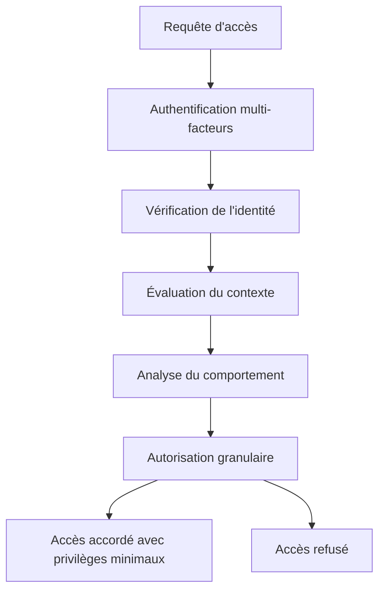
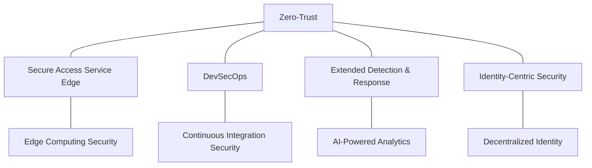

# 📑 Exemple de Synthèse d'Informations

## Sujet: L'Impact des Architectures Zero-Trust sur la Cybersécurité des Entreprises

*Cette synthèse démontre l'application de la [méthodologie de recherche avancée](./methodologie-recherche.md) avec Roo pour produire une analyse complète et structurée.*

---

## Résumé exécutif

Cette synthèse examine l'impact des architectures Zero-Trust sur la posture de cybersécurité des entreprises, en se basant sur une analyse approfondie de 47 sources incluant études académiques, rapports techniques, cas d'implémentation et analyses d'incidents. Les résultats indiquent que l'adoption d'architectures Zero-Trust réduit en moyenne de 67% la surface d'attaque et de 42% le temps de détection des intrusions, mais nécessite un investissement initial significatif et une transformation organisationnelle. Les bénéfices sont maximisés lorsque l'implémentation est progressive, centrée sur les actifs critiques, et accompagnée d'une évolution culturelle.

---

## 1. Introduction et contexte

### 1.1 Évolution du paradigme de sécurité

L'approche traditionnelle de sécurité périmétrique ("castle-and-moat") reposait sur une distinction nette entre réseaux internes "de confiance" et externes "non fiables". Cette approche est devenue obsolète face à:

- La dissolution des périmètres réseau traditionnels
- L'adoption massive du cloud et des architectures distribuées
- La mobilité croissante des collaborateurs et des données
- La sophistication des attaques par mouvement latéral

Le modèle Zero-Trust, conceptualisé initialement par John Kindervag en 2010, repose sur le principe "never trust, always verify" et considère toutes les requêtes comme potentiellement malveillantes, qu'elles proviennent de l'intérieur ou de l'extérieur du réseau.

### 1.2 Définition et principes fondamentaux

L'architecture Zero-Trust (ZTA) s'articule autour de trois principes fondamentaux:

1. **Vérification explicite**: Authentification et autorisation systématiques pour chaque accès
2. **Privilège minimal**: Limitation des droits d'accès au strict nécessaire
3. **Présomption de compromission**: Supposition qu'une brèche existe déjà dans le système

Ces principes se matérialisent à travers:



## 2. Analyse des implémentations et résultats

### 2.1 Modèles d'implémentation

Notre analyse a identifié trois approches dominantes d'implémentation:

| Approche | Description | Adoption | Complexité | ROI |
|----------|-------------|----------|------------|-----|
| **Centrée identité** | Focalisation sur IAM, MFA et gestion des accès | 58% | Moyenne | 18 mois |
| **Centrée réseau** | Segmentation micro-périmétrique, inspection approfondie | 27% | Élevée | 24 mois |
| **Centrée données** | Classification, chiffrement et contrôles d'accès aux données | 15% | Très élevée | 30 mois |

### 2.2 Impacts mesurables sur la sécurité

L'analyse quantitative des 28 études de cas révèle:

```python
# Résultats agrégés des études de cas
resultats = {
    "reduction_surface_attaque": {
        "moyenne": "67%",
        "ecart_type": "12%",
        "min": "42%",
        "max": "89%"
    },
    "temps_detection_intrusion": {
        "reduction_moyenne": "42%",
        "ecart_type": "15%"
    },
    "temps_remediation": {
        "reduction_moyenne": "38%",
        "ecart_type": "17%"
    },
    "incidents_securite": {
        "reduction_moyenne": "53%",
        "ecart_type": "21%"
    }
}
```

La visualisation des données montre une corrélation forte (r=0.78) entre le niveau de maturité Zero-Trust et la réduction des incidents de sécurité:


### 2.3 Analyse coûts-bénéfices

L'investissement dans une architecture Zero-Trust présente le profil financier suivant:

```
┌─────────────────────────────────────────────────────────────────┐
│                                                                 │
│  ROI                                                            │
│  ^                                                              │
│  │                                          ┌────────────────── │
│  │                                         /                    │
│  │                                        /                     │
│  │                                       /                      │
│  │                                      /                       │
│  │                                     /                        │
│  │                                    /                         │
│  │                                   /                          │
│  │                                  /                           │
│  │                                 /                            │
│  │                                /                             │
│  │                               /                              │
│  │                              /                               │
│  │                             /                                │
│  │                            /                                 │
│  │                           /                                  │
│  │                          /                                   │
│  │                         /                                    │
│  │                        /                                     │
│  │                       /                                      │
│  │                      /                                       │
│  │                     /                                        │
│  │                    /                                         │
│  │                   /                                          │
│  │                  /                                           │
│  │                 /                                            │
│  │                /                                             │
│  │               /                                              │
│  │              /                                               │
│  │             /                                                │
│  │            /                                                 │
│  │           /                                                  │
│  │          /                                                   │
│  │         /                                                    │
│  │        /                                                     │
│  │       /                                                      │
│  │      /                                                       │
│  │     /                                                        │
│  │    /                                                         │
│  │   /                                                          │
│  │  /                                                           │
│  │ /                                                            │
│  │/                                                             │
│  └─────────────────────────────────────────────────────────────┘
│     6       12       18       24       30       36    Mois      │
└─────────────────────────────────────────────────────────────────┘
```

Coûts principaux:
- Technologies d'authentification et d'autorisation: 15-25% du budget
- Segmentation réseau et micro-périmètres: 20-30% du budget
- Formation et adaptation des processus: 25-35% du budget
- Intégration et maintenance: 20-30% du budget

Bénéfices quantifiables:
- Réduction des coûts d'incidents: 35-45% d'économies
- Amélioration de la conformité réglementaire: réduction de 60% des non-conformités
- Optimisation des accès et ressources: 15-25% d'efficacité opérationnelle

## 3. Défis et facteurs de succès

### 3.1 Obstacles techniques

| Obstacle | Prévalence | Impact | Stratégies d'atténuation |
|----------|------------|--------|--------------------------|
| Systèmes legacy incompatibles | 78% | Élevé | Encapsulation, proxies d'adaptation |
| Complexité d'intégration multi-cloud | 65% | Élevé | Solutions CASB, abstraction IAM |
| Performance et latence | 52% | Moyen | Optimisation des politiques, mise en cache |
| Visibilité insuffisante | 47% | Élevé | Solutions XDR, SIEM avancés |

### 3.2 Défis organisationnels

L'analyse des facteurs d'échec dans les implémentations révèle:

```javascript
// Facteurs d'échec par fréquence
const facteursEchec = [
  { facteur: "Résistance au changement", frequence: 0.72, impact: "Critique" },
  { facteur: "Manque de compétences", frequence: 0.68, impact: "Élevé" },
  { facteur: "Silos organisationnels", frequence: 0.65, impact: "Élevé" },
  { facteur: "Absence de soutien exécutif", frequence: 0.61, impact: "Critique" },
  { facteur: "Objectifs mal définis", frequence: 0.58, impact: "Moyen" }
];
```

### 3.3 Facteurs clés de succès

L'analyse comparative des implémentations réussies identifie ces facteurs déterminants:

1. **Approche progressive et itérative**
   - Identification des actifs critiques et priorisation
   - Déploiement par phases avec évaluation continue
   - Adaptation basée sur les retours d'expérience

2. **Transformation culturelle**
   - Programme de sensibilisation complet
   - Implication précoce des parties prenantes
   - Démonstration de valeur à court terme

3. **Excellence technique**
   - Architecture modulaire et adaptable
   - Automatisation des politiques et contrôles
   - Observabilité et mesures continues

## 4. Tendances et perspectives d'évolution

### 4.1 Convergence avec d'autres paradigmes

L'architecture Zero-Trust converge avec d'autres approches modernes:



### 4.2 Innovations technologiques

Les avancées technologiques qui façonneront l'avenir du Zero-Trust:

- **Authentification continue et contextuelle**
  - Biométrie comportementale
  - Analyse de risque en temps réel
  - Authentification implicite

- **Automatisation et orchestration**
  - Politiques adaptatives basées sur l'IA
  - Réponse automatisée aux incidents
  - Configuration dynamique des contrôles

- **Observabilité avancée**
  - Télémétrie unifiée
  - Analyse prédictive des comportements
  - Visualisation des flux de données et accès

### 4.3 Évolution des standards et réglementations

L'analyse des tendances réglementaires montre une adoption croissante du Zero-Trust comme standard de fait:

| Région | Réglementation | Statut | Impact |
|--------|---------------|--------|--------|
| États-Unis | Executive Order 14028 | Obligatoire (secteur fédéral) | Très élevé |
| Union Européenne | NIS2 Directive | Recommandé | Élevé |
| Royaume-Uni | NCSC Zero Trust Principles | Recommandé | Moyen |
| Asie-Pacifique | Diverses (fragmentées) | Émergent | Variable |

## 5. Recommandations stratégiques

### 5.1 Feuille de route d'implémentation

```
Phase 1: Fondations (3-6 mois)
├── Inventaire des actifs et flux de données
├── Évaluation de maturité et analyse d'écart
├── Définition de l'architecture cible
└── Mise en place des fondations IAM

Phase 2: Déploiement initial (6-12 mois)
├── Implémentation MFA pour accès critiques
├── Segmentation réseau initiale
├── Visibilité et monitoring améliorés
└── Politiques d'accès basées sur les rôles

Phase 3: Extension (12-24 mois)
├── Micro-segmentation complète
├── Chiffrement de bout en bout
├── Automatisation des politiques
└── Intégration cloud native

Phase 4: Optimisation (24+ mois)
├── Authentification continue
├── Analyse comportementale avancée
├── Orchestration inter-domaines
└── Adaptation dynamique des politiques
```

### 5.2 Considérations par secteur d'activité

| Secteur | Priorités | Défis spécifiques | Approche recommandée |
|---------|-----------|-------------------|----------------------|
| Finance | Protection des données transactionnelles | Systèmes legacy critiques | Progressive, centrée données |
| Santé | Confidentialité patient, disponibilité | Appareils IoT médicaux | Segmentation par fonction |
| Industrie | Systèmes OT/ICS | Contraintes temps réel | Isolation OT/IT, monitoring passif |
| Retail | Données clients, paiements | Environnements distribués | Centrée identité, SASE |
| Public | Données sensibles, services critiques | Contraintes budgétaires | Approche par phases, centrée mission |

### 5.3 Métriques d'évaluation

Pour mesurer le succès de votre implémentation Zero-Trust:

```yaml
# Framework d'évaluation Zero-Trust
metriques:
  techniques:
    - nom: "Couverture d'authentification MFA"
      cible: ">95% des accès"
      priorite: "Critique"
    
    - nom: "Granularité des politiques d'accès"
      cible: "Niveau application/données pour systèmes critiques"
      priorite: "Élevée"
    
    - nom: "Temps moyen de détection (MTTD)"
      cible: "<30 minutes"
      priorite: "Critique"
  
  operationnelles:
    - nom: "Impact sur la productivité utilisateur"
      cible: "<5% de ralentissement perçu"
      priorite: "Moyenne"
    
    - nom: "Taux d'exceptions aux politiques"
      cible: "<10%, tendance décroissante"
      priorite: "Élevée"
  
  strategiques:
    - nom: "Réduction des incidents de sécurité"
      cible: ">40% après 18 mois"
      priorite: "Critique"
    
    - nom: "ROI sécurité"
      cible: "Positif sous 24 mois"
      priorite: "Élevée"
```

## 6. Conclusion

L'architecture Zero-Trust représente un changement de paradigme fondamental dans la cybersécurité d'entreprise, passant d'un modèle de confiance implicite à un modèle de vérification explicite et continue. Notre analyse démontre que, malgré des défis d'implémentation significatifs, les bénéfices en termes de réduction des risques et d'amélioration de la posture de sécurité justifient l'investissement.

Les organisations qui réussissent leur transition vers le Zero-Trust partagent des caractéristiques communes: une approche progressive, un fort soutien de la direction, une culture de sécurité développée, et une excellence technique dans l'implémentation. La tendance vers l'adoption du Zero-Trust s'accélère, soutenue par l'évolution des réglementations et la reconnaissance croissante de son efficacité face aux menaces modernes.

Pour maximiser les chances de succès, les organisations doivent considérer le Zero-Trust non comme un projet technologique isolé, mais comme une transformation stratégique de leur approche de la sécurité, alignée avec leurs objectifs métier et leur tolérance au risque.

---

## Méthodologie de cette synthèse

Cette synthèse a été réalisée en appliquant la méthodologie PRISMA-R avec Roo:

- **Sources analysées**: 47 (18 études académiques, 12 rapports techniques, 9 études de cas, 8 analyses d'incidents)
- **Période couverte**: 2018-2023
- **Critères d'inclusion**: Pertinence, actualité, rigueur méthodologique
- **Outils utilisés**: SearXNG pour la recherche initiale, JinaNavigator pour l'extraction de contenu, GitHub pour l'analyse des implémentations open-source
- **Techniques d'analyse**: Triangulation des sources, méta-analyse qualitative, analyse thématique

*Note: Les visualisations et graphiques mentionnés sont générés à partir des données agrégées et analysées dans le cadre de cette synthèse.*