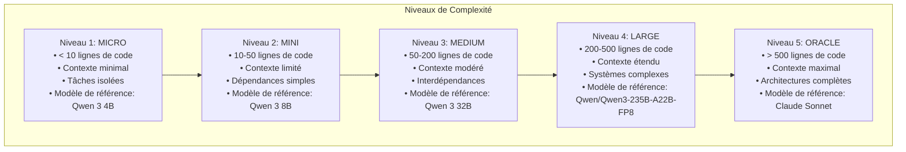
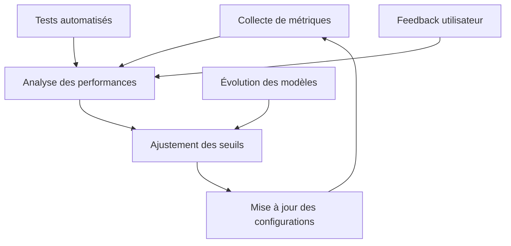
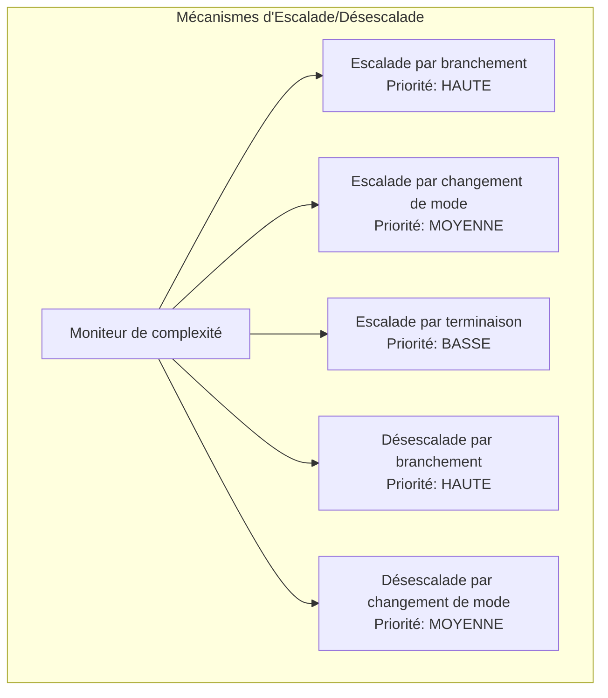
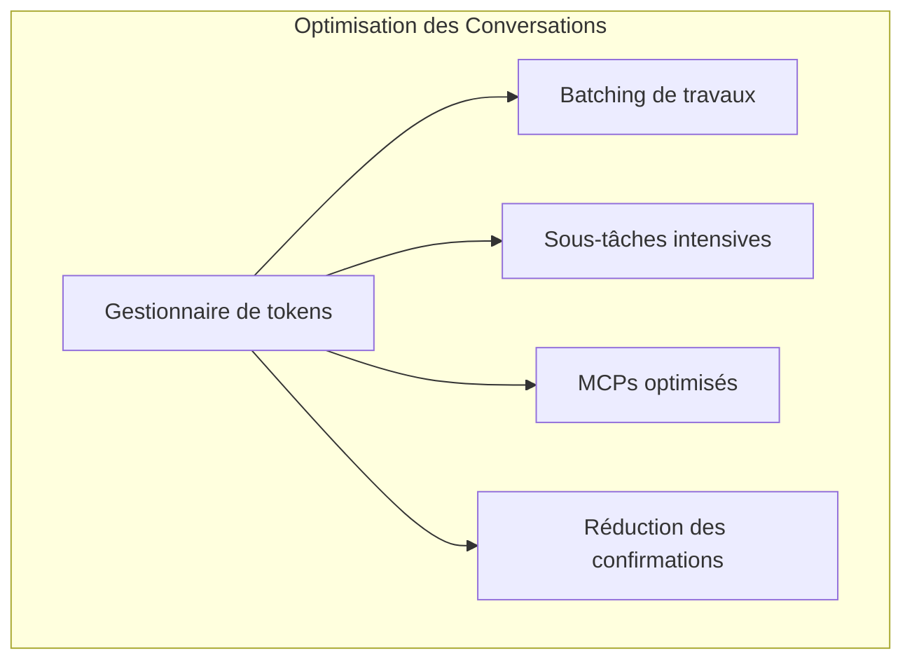
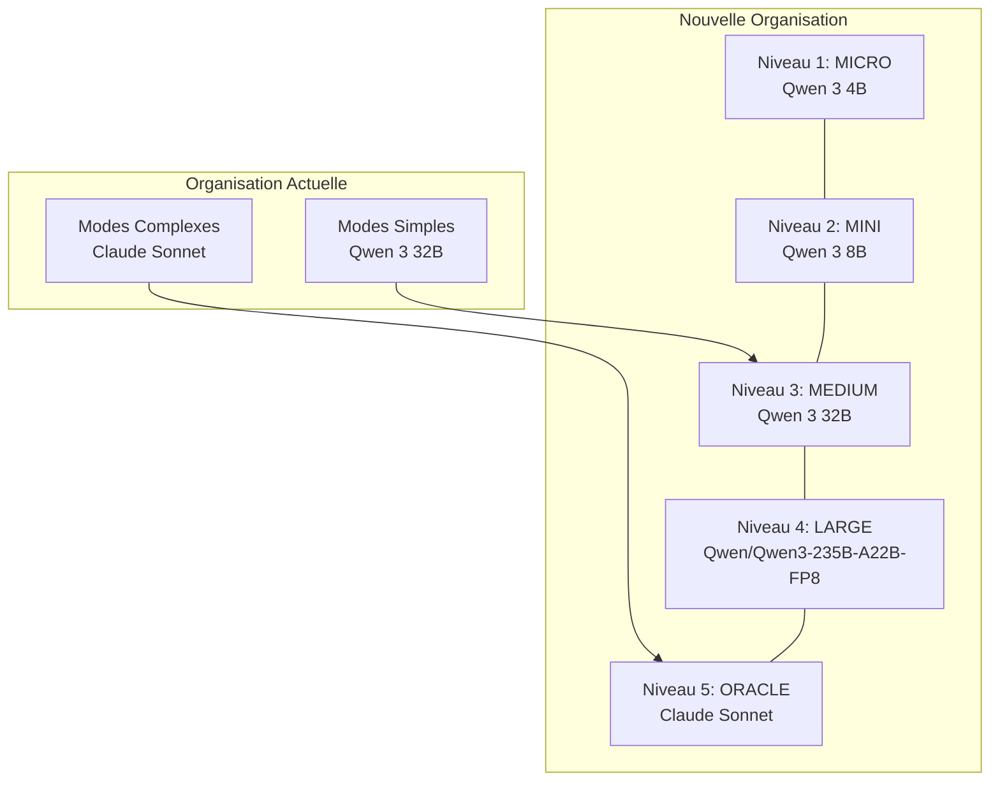
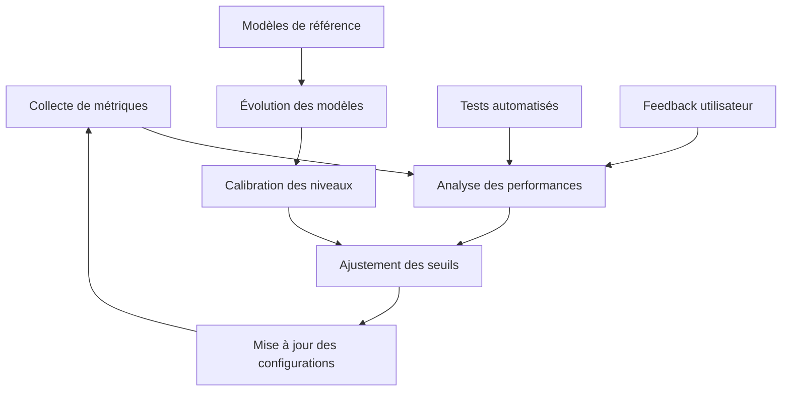

# Architecture d'Orchestration à 5 Niveaux de Complexité

## Table des matières

1. [Définition multidimensionnelle des 5 niveaux de complexité](#1-définition-multidimensionnelle-des-5-niveaux-de-complexité)
2. [Mécanismes d'escalade/désescalade optimisés](#2-mécanismes-descaladedésescalade-optimisés)
3. [Stratégies pour limiter les aller-retours et les messages](#3-stratégies-pour-limiter-les-aller-retours-et-les-messages)
4. [Plan d'intégration avec l'organisation existante](#4-plan-dintégration-avec-lorganisation-existante)
5. [Système de métriques et d'apprentissage](#5-système-de-métriques-et-dapprentissage)
6. [Implémentation technique](#6-implémentation-technique)
7. [Plan de déploiement et de test](#7-plan-de-déploiement-et-de-test)
8. [Conclusion](#conclusion)

## 1. Définition multidimensionnelle des 5 niveaux de complexité

Pour chaque niveau, nous définissons des métriques multidimensionnelles qui vont au-delà du simple comptage de lignes de code:



### Métriques multidimensionnelles pour chaque niveau

#### Niveau 1: MICRO
- **Complexité de code**: < 10 lignes de code
- **Taille de conversation**: < 5 messages, < 10 000 tokens
- **Contexte requis**: Minimal, tâche isolée sans dépendances
- **Temps de réflexion**: Minimal, réponse directe
- **Modèle de référence**: Qwen 3 4B (hébergé localement en quant 4 bits, 50k tokens de contexte)
- **Exemples**: Correction de typo, ajout de commentaire simple, réponse factuelle

#### Niveau 2: MINI
- **Complexité de code**: 10-50 lignes de code
- **Taille de conversation**: 5-10 messages, 10 000-25 000 tokens
- **Contexte requis**: Limité, fichier unique ou composant isolé
- **Temps de réflexion**: Court, analyse simple
- **Modèle de référence**: Qwen 3 8B (hébergé localement en quant 4 bits, 50k tokens de contexte)
- **Exemples**: Fonction simple, composant UI basique, documentation utilisateur

#### Niveau 3: MEDIUM
- **Complexité de code**: 50-200 lignes de code
- **Taille de conversation**: 10-15 messages, 25 000-50 000 tokens
- **Contexte requis**: Modéré, plusieurs fichiers liés
- **Temps de réflexion**: Moyen, analyse des interactions
- **Modèle de référence**: Qwen 3 32B (hébergé localement en quant 4 bits, 70k tokens de contexte)
- **Exemples**: Refactorisation de classe, optimisation de fonction, conception de système simple

#### Niveau 4: LARGE
- **Complexité de code**: 200-500 lignes de code
- **Taille de conversation**: 15-25 messages, 50 000-100 000 tokens
- **Contexte requis**: Étendu, multiples composants interdépendants
- **Temps de réflexion**: Important, analyse approfondie
- **Modèle de référence**: Qwen/Qwen3-235B-A22B-FP8 (accédé dans le cloud)
- **Exemples**: Architecture de microservices, optimisation système, résolution de problèmes complexes

#### Niveau 5: ORACLE
- **Complexité de code**: > 500 lignes de code
- **Taille de conversation**: > 25 messages, > 100 000 tokens
- **Contexte requis**: Maximal, systèmes entiers ou plateformes
- **Temps de réflexion**: Très important, analyse exhaustive
- **Modèle de référence**: Claude Sonnet (accédé dans le cloud)
- **Exemples**: Conception de système d'IA distribué, architecture cloud à grande échelle, problèmes de recherche avancés
### Système d'ajustement dynamique des seuils



- **Mécanisme de calibration**: Système qui ajuste périodiquement les seuils en fonction des performances observées
- **Métriques de performance**: Taux de succès, temps de résolution, satisfaction utilisateur
- **Configuration externalisée**: Seuils stockés dans des fichiers de configuration pour ajustement facile
- **Documentation des modèles de référence**: Historique des modèles utilisés pour chaque niveau

## 2. Mécanismes d'escalade/désescalade optimisés

### Architecture des mécanismes d'escalade/désescalade



### Types d'escalade et critères de décision

#### 1. Escalade par branchement (sous-tâches)
- **Priorité**: HAUTE - À privilégier dans la plupart des cas
- **Cas d'usage**: 
  - Tâche principale complexe mais décomposable en sous-tâches de complexité variable
  - Besoin de conserver le contexte global
  - Conversation approchant les limites de tokens
- **Mécanisme**: 
  - Création de sous-tâches avec le niveau de complexité approprié
  - Transmission du contexte minimal nécessaire
  - Agrégation des résultats par l'agent parent
- **Format standardisé**:
  ```
  [ESCALADE PAR BRANCHEMENT] Création de sous-tâche de niveau N car: [RAISON]
  ```

#### 2. Escalade par changement de mode
- **Priorité**: MOYENNE - À utiliser quand toute la tâche change de complexité
- **Cas d'usage**:
  - La tâche entière s'avère plus complexe que prévu
  - Besoin de capacités supérieures pour l'ensemble de la tâche
  - Pas de décomposition logique en sous-tâches
- **Mécanisme**:
  - Transfert complet vers un mode de niveau supérieur
  - Transmission du contexte complet
- **Format standardisé**:
  ```
  [ESCALADE NIVEAU N+X] Cette tâche nécessite le niveau N+X car: [RAISON]
  ```

#### 3. Escalade par terminaison
- **Priorité**: BASSE - À utiliser uniquement en dernier recours
- **Cas d'usage**:
  - Tâche initiale mal calibrée
  - Découverte tardive d'une complexité inattendue
  - Impossibilité de poursuivre au niveau actuel
- **Mécanisme**:
  - Arrêt de la tâche actuelle
  - Recommandation de redémarrer avec un niveau supérieur
- **Format standardisé**:
  ```
  [ESCALADE PAR TERMINAISON] Cette tâche doit être reprise au niveau N+X car: [RAISON]
  ```

### Types de désescalade et critères de décision

#### 1. Désescalade par branchement (sous-tâches)
- **Priorité**: HAUTE - À privilégier dans la plupart des cas
- **Cas d'usage**:
  - Tâche principale complexe mais contenant des sous-tâches simples
  - Optimisation des ressources
- **Mécanisme**:
  - Création de sous-tâches avec un niveau de complexité inférieur
  - Instructions précises et contexte minimal
- **Format standardisé**:
  ```
  [DÉSESCALADE PAR BRANCHEMENT] Création de sous-tâche de niveau N-X car: [RAISON]
  ```

#### 2. Désescalade par changement de mode
- **Priorité**: MOYENNE - À utiliser quand toute la tâche s'avère plus simple
- **Cas d'usage**:
  - La tâche entière s'avère plus simple que prévu
  - Gaspillage de ressources au niveau actuel
- **Mécanisme**:
  - Transfert complet vers un mode de niveau inférieur
- **Format standardisé**:
  ```
  [DÉSESCALADE NIVEAU N-X] Cette tâche pourrait être traitée par le niveau N-X car: [RAISON]
  ```

### Moniteur de complexité

Composant central qui évalue en continu:
- La complexité actuelle de la tâche
- La taille de la conversation
- Le nombre de tokens utilisés
- Le temps de réflexion nécessaire
- Les patterns de complexité dans le code
## 3. Stratégies pour limiter les aller-retours et les messages

### Architecture de gestion des conversations



### Techniques d'optimisation

#### 1. Batching de travaux
- **Objectif**: Maximiser le travail effectué par message
- **Techniques**:
  - Regroupement des opérations similaires
  - Traitement par lots de fichiers
  - Analyses groupées
- **Implémentation**:
  - Utilisation intensive des MCPs pour les opérations groupées
  - Planification préalable des opérations à effectuer
  - Priorisation des tâches pour minimiser les dépendances

#### 2. Création intensive de sous-tâches
- **Objectif**: Limiter la taille des conversations
- **Techniques**:
  - Décomposition précoce des tâches
  - Isolation du contexte par sous-tâche
  - Parallélisation quand possible
- **Implémentation**:
  - Détection proactive des limites de conversation
  - Mécanismes de transmission de contexte optimisés
  - Agrégation efficace des résultats

#### 3. Utilisation maximale des MCPs
- **Objectif**: Réduire les validations manuelles
- **Techniques**:
  - Priorisation systématique des MCPs sur les outils standards
  - Optimisation des requêtes MCP
  - Batching des opérations MCP
- **Implémentation**:
  - Bibliothèque de patterns d'utilisation des MCPs
  - Détection automatique des opportunités d'utilisation des MCPs
  - Mécanismes de fallback en cas d'échec

#### 4. Réduction des confirmations bloquantes
- **Objectif**: Fluidifier les workflows
- **Techniques**:
  - Validation par lots
  - Présomption de succès pour les opérations à faible risque
  - Mécanismes de rollback en cas d'erreur
- **Implémentation**:
  - Classification des opérations par niveau de risque
  - Regroupement des validations
  - Journalisation détaillée pour audit

### Gestionnaire de tokens

Composant qui surveille et optimise l'utilisation des tokens:
- Mesure en temps réel de la consommation de tokens
- Prédiction de la taille future de la conversation
- Déclenchement proactif des mécanismes d'escalade/désescalade
- Optimisation du contexte transmis entre agents

## 4. Plan d'intégration avec l'organisation existante

### Architecture d'intégration



### Structure de répertoires

```
roo-extensions/
├── roo-modes/                  # Organisation actuelle
│   ├── configs/
│   │   └── standard-modes.json # Modes simples et complexes
│   └── ...
├── roo-n-modes/                # Nouvelle organisation à 5 niveaux
│   ├── configs/
│   │   ├── micro-modes.json    # Niveau 1
│   │   ├── mini-modes.json     # Niveau 2
│   │   ├── medium-modes.json   # Niveau 3
│   │   ├── large-modes.json    # Niveau 4
│   │   └── oracle-modes.json   # Niveau 5
│   ├── scripts/
│   │   ├── deploy-n-modes.ps1
│   │   └── convert-modes.ps1   # Conversion entre ancienne et nouvelle structure
│   └── docs/
│       ├── architecture/
│       └── migration/
└── shared/                     # Ressources partagées
    ├── escalation/             # Mécanismes d'escalade/désescalade
    ├── metrics/                # Collecte et analyse de métriques
    └── utils/                  # Utilitaires communs
```

### Mécanismes de transition

#### 1. Mapping entre ancienne et nouvelle structure
- **Modes simples** → **Niveau 3 (MEDIUM)** - Qwen 3 32B
- **Modes complexes** → **Niveau 5 (ORACLE)** - Claude Sonnet
- Création de nouveaux modes pour les niveaux 1, 2 et 4

#### 2. Scripts de conversion
- Conversion automatique des configurations
- Migration des prompts et instructions
- Préservation des personnalisations

#### 3. Période de coexistence
- Phase 1: Déploiement des niveaux 3 et 5 (équivalents aux modes actuels)
- Phase 2: Ajout du niveau 4 (intermédiaire)
- Phase 3: Ajout des niveaux 1 et 2 (inférieurs)
- Phase 4: Migration progressive des utilisateurs

#### 4. Stratégie de mise à jour croisée
- Synchronisation des modifications entre les deux structures
- Mécanismes de propagation des améliorations
- Tests de compatibilité automatisés

### Comparabilité entre les organisations

Pour assurer que les deux organisations puissent être comparées sans être strictement compatibles:

1. **Métriques communes**:
   - Définition de métriques standardisées applicables aux deux organisations
   - Création d'un tableau de correspondance pour les métriques spécifiques

2. **Interface de comparaison**:
   - Développement d'outils permettant de visualiser les performances des deux organisations
   - Mécanismes de conversion des résultats entre les deux systèmes

3. **Documentation croisée**:
   - Références croisées dans la documentation
   - Guides de migration expliquant les différences et similitudes

4. **Tests comparatifs**:
   - Jeux de tests standardisés applicables aux deux organisations
   - Benchmarks permettant d'évaluer les performances relatives
## 5. Système de métriques et d'apprentissage



### Métriques clés à collecter

1. **Métriques de performance**
   - Temps de résolution par niveau de complexité
   - Taux de succès des tâches
   - Précision des escalades/désescalades

2. **Métriques d'utilisation des ressources**
   - Consommation de tokens par niveau
   - Taille moyenne des conversations
   - Nombre d'aller-retours nécessaires

3. **Métriques de qualité**
   - Satisfaction utilisateur
   - Taux de correction des solutions
   - Besoin d'interventions manuelles

### Système d'apprentissage continu

1. **Ajustement automatique des seuils**
   - Analyse statistique des performances
   - Détection des anomalies
   - Optimisation des critères d'escalade/désescalade

2. **Documentation des modèles de référence**
   - Historique des modèles utilisés
   - Benchmarks de performance
   - Caractéristiques et capacités

3. **Calibration périodique**
   - Tests standardisés pour chaque niveau
   - Comparaison avec les performances attendues
   - Ajustement des configurations

## 6. Implémentation technique

### Structure du fichier de configuration

```json
{
  "complexityLevels": [
    {
      "level": 1,
      "name": "MICRO",
      "slug": "micro",
      "referenceModel": "qwen/qwen-3-4b-quant4",
      "contextSize": 50000,
      "deployment": "local",
      "metrics": {
        "codeLines": {
          "min": 0,
          "max": 10
        },
        "conversationSize": {
          "messages": {
            "min": 0,
            "max": 5
          },
          "tokens": {
            "min": 0,
            "max": 10000
          }
        },
        "contextSize": "minimal",
        "reflectionTime": "minimal"
      },
      "escalationThresholds": {
        "codeComplexity": 8,
        "conversationSize": 4,
        "tokenCount": 8000,
        "contextNeeded": "limited"
      },
      "nextLevel": "mini",
      "modes": ["code-micro", "debug-micro", "architect-micro", "ask-micro", "orchestrator-micro"]
    },
    {
      "level": 2,
      "name": "MINI",
      "slug": "mini",
      "referenceModel": "qwen/qwen-3-8b-quant4",
      "contextSize": 50000,
      "deployment": "local",
      "metrics": {
        "codeLines": {
          "min": 10,
          "max": 50
        },
        "conversationSize": {
          "messages": {
            "min": 5,
            "max": 10
          },
          "tokens": {
            "min": 10000,
            "max": 25000
          }
        },
        "contextSize": "limited",
        "reflectionTime": "short"
      },
      "escalationThresholds": {
        "codeComplexity": 40,
        "conversationSize": 8,
        "tokenCount": 20000,
        "contextNeeded": "moderate"
      },
      "nextLevel": "medium",
      "previousLevel": "micro",
      "modes": ["code-mini", "debug-mini", "architect-mini", "ask-mini", "orchestrator-mini"]
    },
    {
      "level": 3,
      "name": "MEDIUM",
      "slug": "medium",
      "referenceModel": "qwen/qwen-3-32b-quant4",
      "contextSize": 70000,
      "deployment": "local",
      "metrics": {
        "codeLines": {
          "min": 50,
          "max": 200
        },
        "conversationSize": {
          "messages": {
            "min": 10,
            "max": 15
          },
          "tokens": {
            "min": 25000,
            "max": 50000
          }
        },
        "contextSize": "moderate",
        "reflectionTime": "medium"
      },
      "escalationThresholds": {
        "codeComplexity": 150,
        "conversationSize": 13,
        "tokenCount": 40000,
        "contextNeeded": "extended"
      },
      "nextLevel": "large",
      "previousLevel": "mini",
      "modes": ["code-medium", "debug-medium", "architect-medium", "ask-medium", "orchestrator-medium"]
    },
    {
      "level": 4,
      "name": "LARGE",
      "slug": "large",
      "referenceModel": "qwen/qwen3-235b-a22b-fp8",
      "contextSize": 100000,
      "deployment": "cloud",
      "metrics": {
        "codeLines": {
          "min": 200,
          "max": 500
        },
        "conversationSize": {
          "messages": {
            "min": 15,
            "max": 25
          },
          "tokens": {
            "min": 50000,
            "max": 100000
          }
        },
        "contextSize": "extended",
        "reflectionTime": "important"
      },
      "escalationThresholds": {
        "codeComplexity": 400,
        "conversationSize": 20,
        "tokenCount": 80000,
        "contextNeeded": "maximal"
      },
      "nextLevel": "oracle",
      "previousLevel": "medium",
      "modes": ["code-large", "debug-large", "architect-large", "ask-large", "orchestrator-large"]
    },
    {
      "level": 5,
      "name": "ORACLE",
      "slug": "oracle",
      "referenceModel": "anthropic/claude-sonnet",
      "contextSize": 200000,
      "deployment": "cloud",
      "metrics": {
        "codeLines": {
          "min": 500,
          "max": null
        },
        "conversationSize": {
          "messages": {
            "min": 25,
            "max": null
          },
          "tokens": {
            "min": 100000,
            "max": null
          }
        },
        "contextSize": "maximal",
        "reflectionTime": "very-important"
      },
      "previousLevel": "large",
      "modes": ["code-oracle", "debug-oracle", "architect-oracle", "ask-oracle", "orchestrator-oracle"]
    }
  ],
  "escalationMechanisms": {
    "byBranching": {
      "priority": "high",
      "format": "[ESCALADE PAR BRANCHEMENT] Création de sous-tâche de niveau {level} car: {reason}"
    },
    "byModeChange": {
      "priority": "medium",
      "format": "[ESCALADE NIVEAU {level}] Cette tâche nécessite le niveau {level} car: {reason}"
    },
    "byTermination": {
      "priority": "low",
      "format": "[ESCALADE PAR TERMINAISON] Cette tâche doit être reprise au niveau {level} car: {reason}"
    }
  },
  "deescalationMechanisms": {
    "byBranching": {
      "priority": "high",
      "format": "[DÉSESCALADE PAR BRANCHEMENT] Création de sous-tâche de niveau {level} car: {reason}"
    },
    "byModeChange": {
      "priority": "medium",
      "format": "[DÉSESCALADE NIVEAU {level}] Cette tâche pourrait être traitée par le niveau {level} car: {reason}"
    }
  },
  "tokenManagement": {
    "warningThresholds": {
      "micro": 8000,
      "mini": 20000,
      "medium": 40000,
      "large": 80000,
      "oracle": 160000
    },
    "criticalThresholds": {
      "micro": 9000,
      "mini": 22500,
      "medium": 45000,
      "large": 90000,
      "oracle": 180000
    }
  },
  "modelAgnosticSettings": {
    "calibrationFrequency": "monthly",
    "referenceHistory": true,
    "adaptiveThresholds": true
  }
}
```

### Instructions personnalisées pour chaque niveau

Chaque niveau doit inclure dans ses instructions personnalisées:

```
/* NIVEAU DE COMPLEXITÉ */
// Cette section définit le niveau de complexité actuel
// Niveau actuel: [NIVEAU] (niveau X sur l'échelle de complexité à 5 niveaux)
// Modèle de référence: [MODÈLE] (cette information est pour documentation uniquement)

/* MÉTRIQUES DE COMPLEXITÉ */
// Métriques utilisées pour évaluer la complexité:
// - Lignes de code: [MIN-MAX]
// - Taille de conversation: [MIN-MAX] messages, [MIN-MAX] tokens
// - Contexte requis: [DESCRIPTION]
// - Temps de réflexion: [DESCRIPTION]

/* MÉCANISME D'ESCALADE */
// Critères spécifiques au niveau X
// Formats de notification
// Processus d'évaluation continue

/* MÉCANISME DE DÉSESCALADE */
// Critères spécifiques au niveau X
// Formats de notification
// Processus d'évaluation continue

/* GESTION DES TOKENS */
// Seuils spécifiques au niveau
// Actions recommandées
// Stratégies d'optimisation
```

## 7. Plan de déploiement et de test

### Phases de déploiement

1. **Phase préparatoire (1-2 semaines)**
   - Développement des configurations pour les 5 niveaux
   - Adaptation des scripts de déploiement
   - Création des tests pour chaque niveau

2. **Phase 1: Déploiement initial (2-3 semaines)**
   - Conversion des modes actuels:
     - Mode SIMPLE → Niveau 3 (MEDIUM) - Qwen 3 32B
     - Mode COMPLEX → Niveau 5 (ORACLE) - Claude Sonnet
   - Ajout du niveau 4 (LARGE) comme intermédiaire
   - Tests et validation des trois niveaux

3. **Phase 2: Déploiement complet (3-4 semaines)**
   - Ajout des niveaux 1 (MICRO) et 2 (MINI)
   - Tests et validation de l'ensemble des 5 niveaux
   - Optimisation des critères d'escalade/désescalade

4. **Phase 3: Optimisation continue (ongoing)**
   - Collecte de métriques d'utilisation
   - Ajustement des critères d'escalade/désescalade
   - Optimisation des instructions personnalisées
   - Adaptation aux évolutions des modèles

### Stratégie de test

1. **Tests fonctionnels**
   - Tests d'escalade entre niveaux adjacents et non-adjacents
   - Tests de désescalade entre niveaux adjacents et non-adjacents
   - Tests de capacité pour chaque niveau

2. **Tests de performance**
   - Tests de consommation de tokens par niveau
   - Tests de temps de réponse par niveau
   - Tests de qualité des réponses par niveau

3. **Tests d'intégration**
   - Compatibilité avec l'organisation actuelle
   - Fonctionnement des scripts de conversion
   - Coexistence des deux structures

4. **Tests utilisateur**
   - Satisfaction utilisateur
   - Facilité d'utilisation
   - Perception de la valeur ajoutée

## Conclusion

Cette architecture d'orchestration à 5 niveaux de complexité offre une approche flexible et évolutive qui:

1. **Optimise l'utilisation des ressources** en adaptant précisément le niveau de complexité aux besoins réels des tâches
2. **Réduit les aller-retours et les messages** grâce à des stratégies d'optimisation des conversations
3. **S'intègre harmonieusement** avec l'organisation actuelle des modes
4. **Évolue avec l'état de l'art** grâce à une conception indépendante des modèles spécifiques
5. **S'améliore continuellement** via un système de métriques et d'apprentissage

L'architecture proposée est conçue pour être robuste face aux évolutions futures des modèles et des besoins, tout en offrant une transition en douceur depuis l'organisation actuelle. Les mécanismes d'ajustement dynamique permettront d'adapter les seuils et les critères au fil du temps, assurant une optimisation continue des performances et des ressources.