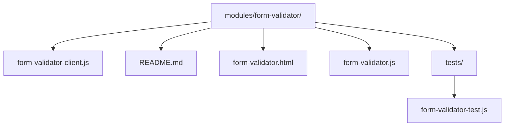
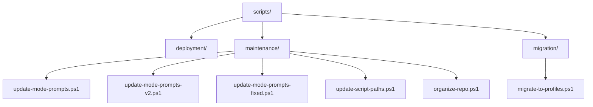
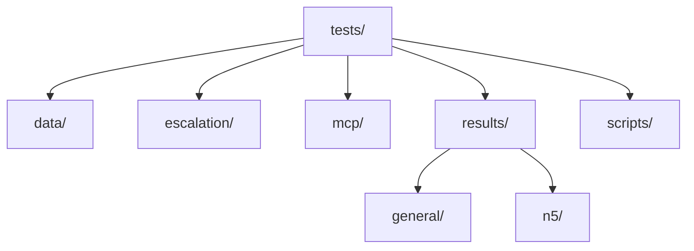
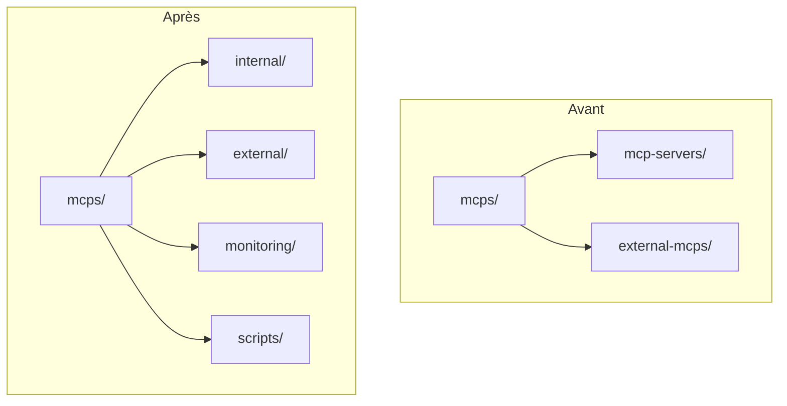
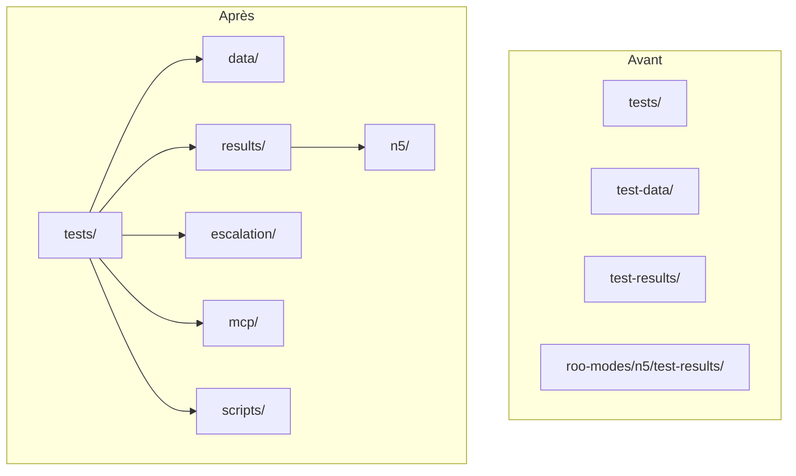

# Diagramme de la nouvelle structure du dépôt

Ce document présente un diagramme visuel de la nouvelle structure proposée pour le dépôt Roo Extensions.

## Structure générale

```mermaid
graph TD
    Root[roo-extensions] --> Docs[docs/]
    Root --> Modules[modules/]
    Root --> MCPs[mcps/]
    Root --> RooCode[roo-code/]
    Root --> RooConfig[roo-config/]
    Root --> RooModes[roo-modes/]
    Root --> Scripts[scripts/]
    Root --> Tests[tests/]
    Root --> Archive[archive/]
    
    %% Documentation
    Docs --> DocsArch[architecture/]
    Docs --> DocsGuides[guides/]
    Docs --> DocsRapports[rapports/]
    Docs --> DocsTests[tests/]
    
    %% Modules
    Modules --> ModFormValidator[form-validator/]
    
    %% MCPs
    MCPs --> MCPsInternal[internal/]
    MCPs --> MCPsExternal[external/]
    MCPs --> MCPsMonitoring[monitoring/]
    MCPs --> MCPsScripts[scripts/]
    
    %% MCPs Internal
    MCPsInternal --> MCPQuickfiles[quickfiles/]
    MCPsInternal --> MCPJinavigator[jinavigator/]
    MCPsInternal --> MCPJupyter[jupyter/]
    
    %% MCPs External
    MCPsExternal --> MCPSearxng[searxng/]
    MCPsExternal --> MCPWinCLI[win-cli/]
    MCPsExternal --> MCPFilesystem[filesystem/]
    MCPsExternal --> MCPGit[git/]
    MCPsExternal --> MCPGitHub[github/]
    
    %% Roo Code
    RooCode --> RooCodeAssets[assets/]
    RooCode --> RooCodeDocs[docs/]
    RooCode --> RooCodeSrc[src/]
    
    %% Roo Config
    RooConfig --> RooConfigBackups[backups/]
    RooConfig --> RooConfigTemplates[config-templates/]
    RooConfig --> RooConfigDiagnostic[diagnostic-scripts/]
    RooConfig --> RooConfigModes[modes/]
    RooConfig --> RooConfigQwen[qwen3-profiles/]
    RooConfig --> RooConfigScheduler[scheduler/]
    RooConfig --> RooConfigSettings[settings/]
    
    %% Roo Modes
    RooModes --> RooModesDocs[docs/]
    RooModes --> RooModesExamples[examples/]
    RooModes --> RooModesN5[n5/]
    RooModes --> RooModesOptimized[optimized/]
    
    %% Scripts
    Scripts --> ScriptsDeployment[deployment/]
    Scripts --> ScriptsMaintenance[maintenance/]
    Scripts --> ScriptsMigration[migration/]
    
    %% Tests
    Tests --> TestsData[data/]
    Tests --> TestsEscalation[escalation/]
    Tests --> TestsMCP[mcp/]
    Tests --> TestsResults[results/]
    Tests --> TestsScripts[scripts/]
    
    %% Archive
    Archive --> ArchiveLegacy[legacy/]
```

## Détail du module form-validator

## Détail des scripts

## Détail des tests

## Comparaison avant/après pour les MCPs

## Comparaison avant/après pour les tests

Ces diagrammes illustrent la nouvelle structure proposée pour le dépôt Roo Extensions, mettant en évidence l'organisation plus cohérente et intuitive des fichiers et répertoires.