# MessageToSkeletonTransformer - Architecture Phase 2

## 1. Vue d'Ensemble

Le `MessageToSkeletonTransformer` est le composant central de la Phase 2 du projet Triple Grounding. Il transforme les messages UI désérialisés (output de `UIMessagesDeserializer`) en structures `ConversationSkeleton` compatibles avec le système de cache existant.

### 1.1. Positionnement dans l'Architecture

```
┌─────────────────────────────────────────────────────────────┐
│                    SYSTÈME ACTUEL (Legacy)                   │
├─────────────────────────────────────────────────────────────┤
│  ui_messages.json  →  Regex Parsing  →  ConversationSkeleton│
│  (fichier brut)       (fragile)          (cache)            │
└─────────────────────────────────────────────────────────────┘

                            ⬇️ Migration Progressive

┌─────────────────────────────────────────────────────────────┐
│              NOUVEAU SYSTÈME (Triple Grounding)              │
├─────────────────────────────────────────────────────────────┤
│                                                              │
│  ui_messages.json  →  UIMessagesDeserializer  →             │
│  (fichier brut)       (Phase 1, validé ✅)                  │
│                                                              │
│                    ⬇️ UIMessage[] (typed)                   │
│                                                              │
│              MessageToSkeletonTransformer                    │
│                   (Phase 2, conception)                      │
│                                                              │
│                    ⬇️ ConversationSkeleton                  │
│                                                              │
│              Système de Cache Existant                       │
│              (buildHierarchicalSkeletons)                    │
│                                                              │
└─────────────────────────────────────────────────────────────┘
```

### 1.2. Objectifs

1. **Fiabilité** : Utiliser les types validés de Phase 1 au lieu de regex fragiles
2. **Maintenabilité** : Code testable, modulaire, documenté
3. **Compatibilité** : Produire des skeletons identiques à l'ancien système
4. **Performance** : Pas de dégradation des temps de traitement
5. **Progressivité** : Cohabitation ancien/nouveau via feature flags

---

## 2. Analyse de l'Existant

### 2.1. Structure du ConversationSkeleton Actuel

```typescript
interface ConversationSkeleton {
   // Identifiants
   taskId: string;
   parentTaskId?: string;

   // Contenu structuré
   sequence: (MessageSkeleton | ActionMetadata)[];

   // Métadonnées
   metadata: {
     title?: string;
     lastActivity: string;
     createdAt: string;
     mode?: string;
     messageCount: number;
     actionCount: number;
     totalSize: number;
     workspace?: string;
     dataSource?: string;
     indexingState?: IndexingState;
   };

   // ⭐ CHAMPS CRITIQUES pour la hiérarchie
   childTaskInstructionPrefixes?: string[];  // Préfixes normalisés (max 192 chars)
   truncatedInstruction?: string;             // Instruction principale (max 192 chars)
   isCompleted?: boolean;                     // Flag de complétion
}
```

**Champs Clés pour la Transformation** :

1. **`childTaskInstructionPrefixes`** : Tableau des instructions `new_task` trouvées dans cette conversation, normalisées via `computeInstructionPrefix(text, 192)`. Utilisé pour alimenter le RadixTree.

2. **`truncatedInstruction`** : L'instruction principale de la tâche, extraite du premier message utilisateur, normalisée à 192 caractères. Utilisée pour le matching parent-enfant.

3. **`isCompleted`** : Indique si la tâche contient un `attempt_completion` réussi.

### 2.2. Processus de Construction Actuel

**Flux Existant** (`RooStorageDetector.analyzeConversation`) :

```
┌─────────────────────────────────────────────────────────────┐
│ 1. Lecture Fichiers                                         │
│    - ui_messages.json                                       │
│    - api_conversation_history.json                          │
│    - task_metadata.json                                     │
└─────────────────┬───────────────────────────────────────────┘
                  │
                  ⬇️
┌─────────────────────────────────────────────────────────────┐
│ 2. Extraction Données via Regex/Parsing Manuel             │
│    ❌ extractNewTaskInstructionsFromUI() : Regex fragiles  │
│    ❌ extractMainInstructionFromUI() : Parsing manuel       │
│    ❌ Détection attempt_completion : Recherche texte        │
└─────────────────┬───────────────────────────────────────────┘
                  │
                  ⬇️
┌─────────────────────────────────────────────────────────────┐
│ 3. Normalisation Prefixes                                   │
│    - computeInstructionPrefix(text, 192)                    │
│    - Nettoyage : BOM, HTML entities, XML tags, espaces     │
└─────────────────┬───────────────────────────────────────────┘
                  │
                  ⬇️
┌─────────────────────────────────────────────────────────────┐
│ 4. Construction ConversationSkeleton                        │
│    - Assemblage des champs                                  │
│    - Calcul timestamps (createdAt, lastActivity)           │
│    - Construction sequence (messages + actions)             │
└─────────────────┬───────────────────────────────────────────┘
                  │
                  ⬇️
┌─────────────────────────────────────────────────────────────┐
│ 5. Alimentation RadixTree (globalTaskInstructionIndex)     │
│    - addInstruction(taskId, prefix) pour chaque prefix     │
└─────────────────────────────────────────────────────────────┘
```

**Points Faibles Identifiés** :

1. ❌ **Regex Fragiles** : Patterns comme `/<new_task>[\s\S]*?<\/new_task>/g` sensibles aux variations de format
2. ❌ **Parsing Manuel** : Extraction d'instructions via `indexOf`, `substring`, etc.
3. ❌ **Absence de Validation** : Pas de schéma Zod, risque de données corrompues
4. ❌ **Testabilité Limitée** : Logique dispersée, difficile à tester unitairement
5. ❌ **Performance** : Lecture complète des fichiers JSON à chaque fois

### 2.3. Fonctionnement du RadixTree

Le système utilise `exact-trie` pour le matching de prefixes :

```typescript
// task-instruction-index.ts

class TaskInstructionIndex {
  private trie: Trie;  // exact-trie
  private prefixToEntry: Map<string, PrefixEntry>;
  
  // Ajout d'une instruction (depuis parent)
  addInstruction(parentTaskId: string, instructionPrefix: string): void {
    const normalized = computeInstructionPrefix(instructionPrefix, 192);
    this.trie.put(normalized, { parentTaskIds: [parentTaskId] });
    this.prefixToEntry.set(normalized, { parentTaskIds: [parentTaskId] });
  }
  
  // Recherche exact prefix (depuis enfant)
  searchExactPrefix(childText: string, K: number = 192): Array<{taskId: string, prefix: string}> {
    const searchPrefix = computeInstructionPrefix(childText, K);
    const entry = this.trie.getWithCheckpoints(searchPrefix);  // Longest prefix match
    return entry ? entry.parentTaskIds.map(id => ({taskId: id, prefix: searchPrefix})) : [];
  }
}
```

**Algorithme de Normalisation** (`computeInstructionPrefix`) :

```typescript
function computeInstructionPrefix(raw: string, K: number = 192): string {
  let s = String(raw);
  
  // 1. Retirer BOM UTF-8
  s = s.replace(/^\uFEFF/, '');
  
  // 2. Dé-échappements JSON
  s = s.replace(/\\r\\n/g, '\n').replace(/\\n/g, '\n')...
  
  // 3. Décodage HTML entities (&lt;, &gt;, &quot;, etc.)
  s = s.replace(/&lt;/gi, '<').replace(/&gt;/gi, '>')...
  
  // 4. Nettoyage JSON artifacts
  s = s.replace(/^["']?content["']?\s*:\s*["']?/i, '');
  
  // 5. Suppression balises <task>, <new_task>
  s = s.replace(/<\s*task\s*>/gi, ' ').replace(/<\s*new_task\b[^>]*>/gi, ' ');
  
  // 6. Suppression toutes balises HTML/XML restantes
  s = s.replace(/<[^>]+>/g, ' ');
  
  // 7. Normalisation finale : lowercase + espaces
  s = s.toLowerCase().replace(/\s+/g, ' ').trim();
  
  // 8. Troncature à K caractères
  return s.substring(0, K).trimEnd();
}
```

---

## 3. Conception du Nouveau Transformer

### 3.1. Interface TypeScript

```typescript
// src/utils/message-to-skeleton-transformer.ts

import { UIMessage, ToolCallInfo, NewTaskInfo } from './ui-messages-deserializer.js';
import { ConversationSkeleton, MessageSkeleton, ActionMetadata } from '../types/conversation.js';
import { computeInstructionPrefix } from './task-instruction-index.js';

/**
 * Options de configuration du transformer
 */
export interface TransformerOptions {
  /**
   * Longueur maximale des prefixes (défaut: 192)
   */
  maxPrefixLength?: number;
  
  /**
   * Inclure les métadonnées étendues (défaut: true)
   */
  includeExtendedMetadata?: boolean;
  
  /**
   * Mode de compatibilité stricte avec l'ancien système (défaut: true)
   */
  strictCompatibility?: boolean;
  
  /**
   * Activer les logs de debug (défaut: false)
   */
  debug?: boolean;
}

/**
 * Résultat de la transformation
 */
export interface TransformationResult {
  /**
   * Le skeleton généré
   */
  skeleton: ConversationSkeleton;
  
  /**
   * Métriques de la transformation
   */
  metrics: {
    messagesProcessed: number;
    toolCallsExtracted: number;
    newTasksExtracted: number;
    processingTimeMs: number;
  };
  
  /**
   * Avertissements non-bloquants
   */
  warnings?: string[];
}

/**
 * Classe principale du transformer
 */
export class MessageToSkeletonTransformer {
  private options: Required<TransformerOptions>;
  
  constructor(options: TransformerOptions = {}) {
    this.options = {
      maxPrefixLength: options.maxPrefixLength ?? 192,
      includeExtendedMetadata: options.includeExtendedMetadata ?? true,
      strictCompatibility: options.strictCompatibility ?? true,
      debug: options.debug ?? false,
    };
  }
  
  /**
   * Transforme des messages UI en ConversationSkeleton
   * @param messages - Messages UI désérialisés
   * @param taskId - ID de la tâche
   * @param taskPath - Chemin de la tâche (pour dataSource)
   * @returns Résultat de la transformation
   */
  async transform(
    messages: UIMessage[],
    taskId: string,
    taskPath: string
  ): Promise<TransformationResult> {
    const startTime = Date.now();
    const warnings: string[] = [];
    
    // 1. Extraire les données structurées
    const userMessages = this.extractUserMessages(messages);
    const toolCalls = this.extractToolCalls(messages);
    const newTasks = this.extractNewTasks(messages);
    const apiRequests = this.extractApiRequests(messages);
    
    // 2. Construire l'instruction principale
    const truncatedInstruction = this.buildMainInstruction(userMessages);
    
    // 3. Construire les prefixes des sous-tâches
    const childTaskInstructionPrefixes = this.buildChildTaskPrefixes(newTasks);
    
    // 4. Détecter la complétion
    const isCompleted = this.detectCompletion(messages);
    
    // 5. Construire la séquence
    const sequence = this.buildSequence(messages, toolCalls);
    
    // 6. Calculer les métadonnées
    const metadata = this.buildMetadata(messages, taskPath);
    
    // 7. Assembler le skeleton
    const skeleton: ConversationSkeleton = {
      taskId,
      parentTaskId: undefined, // Sera résolu en Phase 3 par buildHierarchicalSkeletons
      sequence,
      metadata,
      childTaskInstructionPrefixes: childTaskInstructionPrefixes.length > 0 
        ? childTaskInstructionPrefixes 
        : undefined,
      truncatedInstruction,
      isCompleted,
    };
    
    // 8. Validation stricte si activée
    if (this.options.strictCompatibility) {
      this.validateSkeletonCompatibility(skeleton, warnings);
    }
    
    const processingTimeMs = Date.now() - startTime;
    
    return {
      skeleton,
      metrics: {
        messagesProcessed: messages.length,
        toolCallsExtracted: toolCalls.length,
        newTasksExtracted: newTasks.length,
        processingTimeMs,
      },
      warnings: warnings.length > 0 ? warnings : undefined,
    };
  }
  
  /**
   * Extrait les messages utilisateur (say/text)
   */
  private extractUserMessages(messages: UIMessage[]): UIMessage[] {
    return messages.filter(msg => 
      msg.type === 'say' && msg.say === 'text' && msg.text && msg.text.trim().length > 0
    );
  }
  
  /**
   * Extrait les appels d'outils
   */
  private extractToolCalls(messages: UIMessage[]): ToolCallInfo[] {
    const calls: ToolCallInfo[] = [];
    
    for (const msg of messages) {
      if (msg.type === 'say' && msg.say === 'tool' && msg.tool) {
        calls.push({
          tool: msg.tool,
          path: msg.path,
          diff: msg.diff,
          content: msg.content,
          command: msg.command,
          mode: msg.mode,
          message: msg.message,
          timestamp: msg.ts || 0,
        });
      }
    }
    
    return calls;
  }
  
  /**
   * Extrait les nouvelles tâches (new_task / newTask)
   */
  private extractNewTasks(messages: UIMessage[]): NewTaskInfo[] {
    const toolCalls = this.extractToolCalls(messages);
    
    return toolCalls
      .filter(call => 
        (call.tool === 'new_task' || call.tool === 'newTask') && 
        call.mode && 
        call.message
      )
      .map(call => ({
        mode: call.mode!,
        message: call.message!,
        timestamp: call.timestamp,
      }));
  }
  
  /**
   * Extrait les requêtes API (api_req_started)
   */
  private extractApiRequests(messages: UIMessage[]): any[] {
    return messages
      .filter(msg => msg.type === 'say' && msg.say === 'api_req_started')
      .map(msg => ({
        timestamp: msg.ts || 0,
        text: msg.text,
      }));
  }
  
  /**
   * Construit l'instruction principale (premier message utilisateur)
   */
  private buildMainInstruction(userMessages: UIMessage[]): string | undefined {
    if (userMessages.length === 0) return undefined;
    
    const firstMessage = userMessages[0];
    const rawInstruction = firstMessage.text || '';
    
    // Normaliser avec computeInstructionPrefix pour cohérence
    return computeInstructionPrefix(rawInstruction, this.options.maxPrefixLength);
  }
  
  /**
   * Construit les prefixes des sous-tâches
   */
  private buildChildTaskPrefixes(newTasks: NewTaskInfo[]): string[] {
    return newTasks.map(task => 
      computeInstructionPrefix(task.message, this.options.maxPrefixLength)
    );
  }
  
  /**
   * Détecte si la tâche est complétée (via attempt_completion)
   */
  private detectCompletion(messages: UIMessage[]): boolean {
    return messages.some(msg => 
      msg.type === 'say' && 
      msg.say === 'completion_result' &&
      msg.text?.includes('approved')
    );
  }
  
  /**
   * Construit la séquence de messages et actions
   */
  private buildSequence(
    messages: UIMessage[], 
    toolCalls: ToolCallInfo[]
  ): (MessageSkeleton | ActionMetadata)[] {
    const sequence: (MessageSkeleton | ActionMetadata)[] = [];
    
    for (const msg of messages) {
      // Messages texte
      if (msg.type === 'say' && msg.say === 'text' && msg.text) {
        sequence.push({
          role: 'user',
          content: msg.text.substring(0, 500), // Tronquer pour économie mémoire
          timestamp: new Date(msg.ts || 0).toISOString(),
          isTruncated: msg.text.length > 500,
        });
      }
      
      // Appels d'outils (métadonnées seulement)
      if (msg.type === 'say' && msg.say === 'tool' && msg.tool) {
        sequence.push({
          type: 'tool',
          name: msg.tool,
          parameters: {
            path: msg.path,
            mode: msg.mode,
          },
          status: 'success', // Simplifié
          timestamp: new Date(msg.ts || 0).toISOString(),
        });
      }
    }
    
    return sequence;
  }
  
  /**
   * Construit les métadonnées
   */
  private buildMetadata(messages: UIMessage[], taskPath: string) {
    const timestamps = messages
      .filter(msg => msg.ts)
      .map(msg => new Date(msg.ts!))
      .sort((a, b) => a.getTime() - b.getTime());
    
    const createdAt = timestamps.length > 0 
      ? timestamps[0].toISOString() 
      : new Date().toISOString();
      
    const lastActivity = timestamps.length > 0 
      ? timestamps[timestamps.length - 1].toISOString() 
      : new Date().toISOString();
    
    // Extraire le workspace depuis api_req_started
    const workspace = this.extractWorkspace(messages);
    
    return {
      title: this.extractTitle(messages),
      createdAt,
      lastActivity,
      mode: this.extractMode(messages),
      messageCount: messages.filter(m => m.type === 'say' && m.say === 'text').length,
      actionCount: messages.filter(m => m.type === 'say' && m.say === 'tool').length,
      totalSize: JSON.stringify(messages).length,
      workspace,
      dataSource: taskPath,
    };
  }
  
  /**
   * Extrait le titre depuis le premier message utilisateur
   */
  private extractTitle(messages: UIMessage[]): string {
    const firstText = messages.find(m => m.type === 'say' && m.say === 'text' && m.text);
    if (!firstText || !firstText.text) return 'Untitled Task';
    
    return firstText.text.substring(0, 100);
  }
  
  /**
   * Extrait le mode dominant
   */
  private extractMode(messages: UIMessage[]): string {
    const modes = messages
      .filter(m => m.mode)
      .map(m => m.mode!);
    
    if (modes.length === 0) return 'unknown';
    
    // Retourner le mode le plus fréquent
    const modeCounts = modes.reduce((acc, mode) => {
      acc[mode] = (acc[mode] || 0) + 1;
      return acc;
    }, {} as Record<string, number>);
    
    return Object.entries(modeCounts)
      .sort(([, a], [, b]) => b - a)[0][0];
  }
  
  /**
   * Extrait le workspace depuis api_req_started
   */
  private extractWorkspace(messages: UIMessage[]): string | undefined {
    for (const msg of messages) {
      if (msg.type === 'say' && msg.say === 'api_req_started' && msg.text) {
        const match = msg.text.match(/Current Workspace Directory \(([^)]+)\)/);
        if (match && match[1]) {
          return match[1].trim();
        }
      }
    }
    return undefined;
  }
  
  /**
   * Valide la compatibilité stricte du skeleton
   */
  private validateSkeletonCompatibility(
    skeleton: ConversationSkeleton, 
    warnings: string[]
  ): void {
    // Vérifier que les champs requis sont présents
    if (!skeleton.taskId) {
      warnings.push('Missing required field: taskId');
    }
    
    if (!skeleton.metadata.createdAt) {
      warnings.push('Missing required field: metadata.createdAt');
    }
    
    if (!skeleton.metadata.lastActivity) {
      warnings.push('Missing required field: metadata.lastActivity');
    }
    
    // Vérifier la longueur des prefixes
    if (skeleton.childTaskInstructionPrefixes) {
      for (const prefix of skeleton.childTaskInstructionPrefixes) {
        if (prefix.length > this.options.maxPrefixLength) {
          warnings.push(`Prefix exceeds max length: ${prefix.length} > ${this.options.maxPrefixLength}`);
        }
      }
    }
    
    // Vérifier la longueur de l'instruction tronquée
    if (skeleton.truncatedInstruction && 
        skeleton.truncatedInstruction.length > this.options.maxPrefixLength) {
      warnings.push(`truncatedInstruction exceeds max length: ${skeleton.truncatedInstruction.length} > ${this.options.maxPrefixLength}`);
    }
  }
}
```

### 3.2. Algorithme de Transformation

**Pseudo-code Détaillé** :

```
FONCTION transform(messages: UIMessage[], taskId: string, taskPath: string)
  // PHASE 1: Extraction des données structurées
  userMessages ← FILTRER messages PAR type='say' ET say='text'
  toolCalls ← FILTRER messages PAR type='say' ET say='tool'
  newTasks ← FILTRER toolCalls PAR tool IN ['new_task', 'newTask']
  apiRequests ← FILTRER messages PAR type='say' ET say='api_req_started'
  
  // PHASE 2: Construction de l'instruction principale
  SI userMessages.length > 0 ALORS
    premierMessage ← userMessages[0].text
    truncatedInstruction ← computeInstructionPrefix(premierMessage, 192)
  SINON
    truncatedInstruction ← undefined
  FIN SI
  
  // PHASE 3: Construction des prefixes de sous-tâches
  childTaskPrefixes ← []
  POUR CHAQUE newTask DANS newTasks FAIRE
    prefix ← computeInstructionPrefix(newTask.message, 192)
    childTaskPrefixes.AJOUTER(prefix)
  FIN POUR
  
  // PHASE 4: Détection de la complétion
  isCompleted ← EXISTE message OÙ 
    type='say' ET say='completion_result' ET text CONTIENT 'approved'
  
  // PHASE 5: Construction de la séquence
  sequence ← []
  POUR CHAQUE message DANS messages FAIRE
    SI message est un message texte ALORS
      sequence.AJOUTER(MessageSkeleton{
        role: 'user',
        content: message.text[0:500],
        timestamp: ISO(message.ts),
        isTruncated: message.text.length > 500
      })
    SINON SI message est un appel d'outil ALORS
      sequence.AJOUTER(ActionMetadata{
        type: 'tool',
        name: message.tool,
        parameters: {...},
        status: 'success',
        timestamp: ISO(message.ts)
      })
    FIN SI
  FIN POUR
  
  // PHASE 6: Calcul des métadonnées
  timestamps ← EXTRAIRE ET TRIER tous les msg.ts
  createdAt ← timestamps[0]
  lastActivity ← timestamps[length-1]
  workspace ← EXTRAIRE depuis api_req_started via regex
  mode ← MODE_LE_PLUS_FREQUENT(messages)
  
  metadata ← {
    title: userMessages[0].text[0:100],
    createdAt: ISO(createdAt),
    lastActivity: ISO(lastActivity),
    mode: mode,
    messageCount: COMPTER(messages texte),
    actionCount: COMPTER(messages outil),
    totalSize: TAILLE_JSON(messages),
    workspace: workspace,
    dataSource: taskPath
  }
  
  // PHASE 7: Assemblage final
  skeleton ← ConversationSkeleton{
    taskId: taskId,
    parentTaskId: undefined,
    sequence: sequence,
    metadata: metadata,
    childTaskInstructionPrefixes: childTaskPrefixes,
    truncatedInstruction: truncatedInstruction,
    isCompleted: isCompleted
  }
  
  // PHASE 8: Validation stricte
  SI strictCompatibility ALORS
    VALIDER(skeleton) → warnings
  FIN SI
  
  RETOURNER {skeleton, metrics, warnings}
FIN FONCTION
```

### 3.3. Gestion des Cas Edge

| Cas Edge | Stratégie | Implémentation |
|----------|-----------|----------------|
| **Pas de messages utilisateur** | Retourner `truncatedInstruction = undefined` | `if (userMessages.length === 0) return undefined` |
| **Messages corrompus** | Valider avec Zod, logger warning, continuer | `UIMessageSchema.safeParse()` + warning |
| **Prefixes > 192 chars** | Tronquer automatiquement | `computeInstructionPrefix()` garantit la longueur |
| **Timestamps manquants** | Fallback sur Date.now() | `msg.ts || Date.now()` |
| **Workspace non trouvé** | Retourner `undefined`, ne pas bloquer | Extraction optionnelle |
| **new_task sans message** | Filtrer, ne pas inclure dans prefixes | `filter(task => task.message)` |
| **Tâche vide (0 messages)** | Créer skeleton minimal valide | Skeleton avec champs requis + defaults |
| **BOM UTF-8 en tête** | Nettoyer avant parsing JSON | `content.charCodeAt(0) === 0xFEFF ? content.slice(1)` |
| **Entités HTML dans texte** | Normaliser via `computeInstructionPrefix` | Fonction déjà gère `&lt;`, `&gt;`, etc. |
| **Balises XML dans instructions** | Nettoyer via `computeInstructionPrefix` | Suppression `<task>`, `<new_task>` |

---

## 4. Stratégie d'Intégration

### 4.1. Mode Parallèle (Dual Mode)

**Architecture de Cohabitation** :

```typescript
// src/utils/roo-storage-detector.ts

export class RooStorageDetector {
  /**
   * Analyse une conversation avec support du mode parallèle
   */
  public static async analyzeConversation(
    taskId: string,
    taskPath: string,
    useProductionHierarchy: boolean = false
  ): Promise<ConversationSkeleton | null> {
    
    // Feature flag pour activer le nouveau système
    const useNewTransformer = process.env.ROO_USE_NEW_TRANSFORMER === 'true';
    
    if (useNewTransformer) {
      // 🆕 NOUVEAU SYSTÈME (Phase 2)
      return this.analyzeConversationWithTransformer(taskId, taskPath, useProductionHierarchy);
    } else {
      // 🔄 ANCIEN SYSTÈME (Legacy)
      return this.analyzeConversationLegacy(taskId, taskPath, useProductionHierarchy);
    }
  }
  
  /**
   * 🆕 Nouvelle méthode utilisant MessageToSkeletonTransformer
   */
  private static async analyzeConversationWithTransformer(
    taskId: string,
    taskPath: string,
    useProductionHierarchy: boolean
  ): Promise<ConversationSkeleton | null> {
    try {
      // 1. Désérialiser ui_messages.json avec UIMessagesDeserializer
      const uiMessagesPath = path.join(taskPath, 'ui_messages.json');
      const deserializer = new UIMessagesDeserializer();
      const deserializeResult = await deserializer.deserializeFromFile(uiMessagesPath);
      
      if (!deserializeResult.success || !deserializeResult.messages) {
        console.warn(`[analyzeConversationWithTransformer] Deserialize failed for ${taskId}`);
        return null;
      }
      
      // 2. Transformer les messages en skeleton
      const transformer = new MessageToSkeletonTransformer({
        strictCompatibility: true,
        debug: process.env.ROO_DEBUG_INSTRUCTIONS === '1',
      });
      
      const transformResult = await transformer.transform(
        deserializeResult.messages,
        taskId,
        taskPath
      );
      
      // 3. Logger les warnings éventuels
      if (transformResult.warnings && transformResult.warnings.length > 0) {
        console.warn(`[analyzeConversationWithTransformer] Warnings for ${taskId}:`, 
          transformResult.warnings);
      }
      
      // 4. Alimenter le RadixTree si en mode production
      if (useProductionHierarchy && transformResult.skeleton.childTaskInstructionPrefixes) {
        for (const prefix of transformResult.skeleton.childTaskInstructionPrefixes) {
          globalTaskInstructionIndex.addInstruction(taskId, prefix);
        }
      }
      
      // 5. Retourner le skeleton
      return transformResult.skeleton;
      
    } catch (error) {
      console.error(`[analyzeConversationWithTransformer] Error for ${taskId}:`, error);
      return null;
    }
  }
  
  /**
   * 🔄 Ancienne méthode (préservée pour compatibilité)
   */
  private static async analyzeConversationLegacy(
    taskId: string,
    taskPath: string,
    useProductionHierarchy: boolean
  ): Promise<ConversationSkeleton | null> {
    // ... code existant inchangé ...
  }
}
```

### 4.2. Points d'Injection

**Emplacements pour Modification** :

1. **`src/utils/roo-storage-detector.ts`** :
   - Ligne ~315 : Méthode `analyzeConversation()`
   - Ajouter la logique de dispatch ancien/nouveau

2. **`src/index.ts`** :
   - Ligne ~1055 : Appel à `RooStorageDetector.analyzeConversation()`
   - Aucune modification nécessaire (transparent)

3. **Nouveaux fichiers à créer** :
   - `src/utils/message-to-skeleton-transformer.ts` : Classe principale
   - `src/utils/message-to-skeleton-transformer.test.ts` : Tests unitaires

### 4.3. Feature Flags

**Variables d'Environnement** :

```bash
# Activer le nouveau transformer (défaut: false)
ROO_USE_NEW_TRANSFORMER=true

# Mode de comparaison (exécute les deux et compare)
ROO_COMPARE_TRANSFORMERS=true

# Logs de debug détaillés
ROO_DEBUG_INSTRUCTIONS=1

# Mode strict de validation
ROO_STRICT_COMPATIBILITY=true
```

**Configuration MCP** (`mcp_settings.json`) :

```json
{
  "mcpServers": {
    "roo-state-manager": {
      "env": {
        "ROO_USE_NEW_TRANSFORMER": "false",
        "ROO_COMPARE_TRANSFORMERS": "false",
        "ROO_DEBUG_INSTRUCTIONS": "0",
        "ROO_STRICT_COMPATIBILITY": "true"
      }
    }
  }
}
```

### 4.4. Mode Comparaison

**Implémentation pour Validation** :

```typescript
/**
 * Mode comparaison : exécute ancien + nouveau, compare les résultats
 */
private static async analyzeConversationWithComparison(
  taskId: string,
  taskPath: string,
  useProductionHierarchy: boolean
): Promise<ConversationSkeleton | null> {
  
  console.log(`[COMPARISON MODE] Starting dual analysis for ${taskId}`);
  
  // 1. Exécuter l'ancien système
  const legacyStart = Date.now();
  const legacySkeleton = await this.analyzeConversationLegacy(
    taskId, taskPath, useProductionHierarchy
  );
  const legacyTime = Date.now() - legacyStart;
  
  // 2. Exécuter le nouveau système
  const newStart = Date.now();
  const newSkeleton = await this.analyzeConversationWithTransformer(
    taskId, taskPath, useProductionHierarchy
  );
  const newTime = Date.now() - newStart;
  
  // 3. Comparer les résultats
  const comparison = this.compareSkeletons(legacySkeleton, newSkeleton);
  
  // 4. Logger le rapport de comparaison
  console.log(`[COMPARISON MODE] Results for ${taskId}:`);
  console.log(`  Legacy time: ${legacyTime}ms`);
  console.log(`  New time: ${newTime}ms`);
  console.log(`  Performance: ${newTime < legacyTime ? 'IMPROVED' : 'DEGRADED'} (${Math.abs(newTime - legacyTime)}ms)`);
  console.log(`  Compatibility: ${comparison.identical ? 'IDENTICAL' : 'DIFFERENT'}`);
  
  if (!comparison.identical) {
    console.log(`  Differences:`, comparison.differences);
  }
  
  // 5. Retourner le skeleton legacy par défaut (mode sûr)
  return legacySkeleton;
}

/**
 * Compare deux skeletons et identifie les différences
 */
private static compareSkeletons(
  legacy: ConversationSkeleton | null,
  modern: ConversationSkeleton | null
): { identical: boolean; differences: string[] } {
  const differences: string[] = [];
  
  if (!legacy && !modern) return { identical: true, differences: [] };
  if (!legacy || !modern) {
    differences.push('One skeleton is null');
    return { identical: false, differences };
  }
  
  // Comparer les champs critiques
  if (legacy.taskId !== modern.taskId) {
    differences.push(`taskId: ${legacy.taskId} vs ${modern.taskId}`);
  }
  
  if (legacy.truncatedInstruction !== modern.truncatedInstruction) {
    differences.push(`truncatedInstruction differs`);
  }
  
  if (legacy.isCompleted !== modern.isCompleted) {
    differences.push(`isCompleted: ${legacy.isCompleted} vs ${modern.isCompleted}`);
  }
  
  // Comparer les prefixes (ordre et contenu)
  const legacyPrefixes = legacy.childTaskInstructionPrefixes || [];
  const modernPrefixes = modern.childTaskInstructionPrefixes || [];
  
  if (legacyPrefixes.length !== modernPrefixes.length) {
    differences.push(`childTaskInstructionPrefixes count: ${legacyPrefixes.length} vs ${modernPrefixes.length}`);
  } else {
    for (let i = 0; i < legacyPrefixes.length; i++) {
      if (legacyPrefixes[i] !== modernPrefixes[i]) {
        differences.push(`childTaskInstructionPrefixes[${i}] differs`);
      }
    }
  }
  
  // Comparer les métadonnées essentielles
  if (legacy.metadata.messageCount !== modern.metadata.messageCount) {
    differences.push(`messageCount: ${legacy.metadata.messageCount} vs ${modern.metadata.messageCount}`);
  }
  
  if (legacy.metadata.actionCount !== modern.metadata.actionCount) {
    differences.push(`actionCount: ${legacy.metadata.actionCount} vs ${modern.metadata.actionCount}`);
  }
  
  return {
    identical: differences.length === 0,
    differences,
  };
}
```

---

## 5. Plan de Tests

### 5.1. Tests Unitaires

**Fichier** : `src/utils/message-to-skeleton-transformer.test.ts`

```typescript
import { describe, it, expect, beforeEach } from '@jest/globals';
import { MessageToSkeletonTransformer } from './message-to-skeleton-transformer.js';
import { UIMessage } from './ui-messages-deserializer.js';

describe('MessageToSkeletonTransformer', () => {
  let transformer: MessageToSkeletonTransformer;
  
  beforeEach(() => {
    transformer = new MessageToSkeletonTransformer({
      strictCompatibility: true,
      debug: false,
    });
  });
  
  describe('extractUserMessages', () => {
    it('should extract only say/text messages', () => {
      const messages: UIMessage[] = [
        { type: 'say', say: 'text', text: 'Hello', ts: 1000 },
        { type: 'say', say: 'tool', tool: 'read_file', ts: 2000 },
        { type: 'say', say: 'text', text: 'World', ts: 3000 },
      ];
      
      const userMessages = (transformer as any).extractUserMessages(messages);
      expect(userMessages).toHaveLength(2);
      expect(userMessages[0].text).toBe('Hello');
      expect(userMessages[1].text).toBe('World');
    });
    
    it('should filter out empty text messages', () => {
      const messages: UIMessage[] = [
        { type: 'say', say: 'text', text: '', ts: 1000 },
        { type: 'say', say: 'text', text: '   ', ts: 2000 },
        { type: 'say', say: 'text', text: 'Valid', ts: 3000 },
      ];
      
      const userMessages = (transformer as any).extractUserMessages(messages);
      expect(userMessages).toHaveLength(1);
      expect(userMessages[0].text).toBe('Valid');
    });
  });
  
  describe('extractNewTasks', () => {
    it('should extract new_task tool calls', () => {
      const messages: UIMessage[] = [
        { 
          type: 'say', 
          say: 'tool', 
          tool: 'new_task',
          mode: 'code',
          message: 'Fix bug in login',
          ts: 1000
        },
        { 
          type: 'say', 
          say: 'tool', 
          tool: 'read_file',
          path: '/test.ts',
          ts: 2000
        },
      ];
      
      const newTasks = (transformer as any).extractNewTasks(messages);
      expect(newTasks).toHaveLength(1);
      expect(newTasks[0].mode).toBe('code');
      expect(newTasks[0].message).toBe('Fix bug in login');
    });
    
    it('should handle both new_task and newTask', () => {
      const messages: UIMessage[] = [
        { 
          type: 'say', 
          say: 'tool', 
          tool: 'new_task',
          mode: 'code',
          message: 'Task 1',
          ts: 1000
        },
        { 
          type: 'say', 
          say: 'tool', 
          tool: 'newTask',
          mode: 'debug',
          message: 'Task 2',
          ts: 2000
        },
      ];
      
      const newTasks = (transformer as any).extractNewTasks(messages);
      expect(newTasks).toHaveLength(2);
    });
  });
  
  describe('buildMainInstruction', () => {
    it('should extract and normalize first user message', () => {
      const messages: UIMessage[] = [
        { type: 'say', say: 'text', text: '  <task>Fix the BUG</task>  ', ts: 1000 },
      ];
      
      const userMessages = (transformer as any).extractUserMessages(messages);
      const instruction = (transformer as any).buildMainInstruction(userMessages);
      
      expect(instruction).toBeDefined();
      expect(instruction).toBe('fix the bug'); // Normalisé : balises enlevées, lowercase
    });
    
    it('should return undefined for empty user messages', () => {
      const instruction = (transformer as any).buildMainInstruction([]);
      expect(instruction).toBeUndefined();
    });
  });
  
  describe('buildChildTaskPrefixes', () => {
    it('should normalize new_task messages', () => {
      const newTasks = [
        { mode: 'code', message: '  Fix AUTH bug  ', timestamp: 1000 },
        { mode: 'debug', message: 'Test LOGIN flow', timestamp: 2000 },
      ];
      
      const prefixes = (transformer as any).buildChildTaskPrefixes(newTasks);
      
      expect(prefixes).toHaveLength(2);
      expect(prefixes[0]).toBe('fix auth bug');
      expect(prefixes[1]).toBe('test login flow');
    });
  });
  
  describe('detectCompletion', () => {
    it('should detect approved completion', () => {
      const messages: UIMessage[] = [
        { type: 'say', say: 'completion_result', text: 'Result: approved', ts: 1000 },
      ];
      
      const isCompleted = (transformer as any).detectCompletion(messages);
      expect(isCompleted).toBe(true);
    });
    
    it('should return false if no completion', () => {
      const messages: UIMessage[] = [
        { type: 'say', say: 'text', text: 'Hello', ts: 1000 },
      ];
      
      const isCompleted = (transformer as any).detectCompletion(messages);
      expect(isCompleted).toBe(false);
    });
  });
  
  describe('transform (integration)', () => {
    it('should transform messages into valid skeleton', async () => {
      const messages: UIMessage[] = [
        { type: 'say', say: 'text', text: 'Create a login page', ts: 1000 },
        { 
          type: 'say', 
          say: 'tool', 
          tool: 'new_task',
          mode: 'code',
          message: 'Fix authentication',
          ts: 2000
        },
        { type: 'say', say: 'completion_result', text: 'approved', ts: 3000 },
      ];
      
      const result = await transformer.transform(messages, 'test-task-id', '/test/path');
      
      expect(result.skeleton).toBeDefined();
      expect(result.skeleton.taskId).toBe('test-task-id');
      expect(result.skeleton.truncatedInstruction).toBe('create a login page');
      expect(result.skeleton.childTaskInstructionPrefixes).toHaveLength(1);
      expect(result.skeleton.isCompleted).toBe(true);
      expect(result.metrics.messagesProcessed).toBe(3);
      expect(result.metrics.newTasksExtracted).toBe(1);
    });
  });
});
```

### 5.2. Tests d'Intégration

**Fichier** : `tests/integration/transformer-integration.test.ts`

```typescript
import { describe, it, expect } from '@jest/globals';
import * as path from 'path';
import { MessageToSkeletonTransformer } from '../../src/utils/message-to-skeleton-transformer.js';
import { UIMessagesDeserializer } from '../../src/utils/ui-messages-deserializer.js';

describe('Transformer Integration Tests', () => {
  
  it('should process real fixture file', async () => {
    // Utiliser une fixture réelle de Phase 1
    const fixturePath = path.join(__dirname, '../fixtures/ui-messages-fixture-001.json');
    
    // 1. Désérialiser
    const deserializer = new UIMessagesDeserializer();
    const deserializeResult = await deserializer.deserializeFromFile(fixturePath);
    
    expect(deserializeResult.success).toBe(true);
    expect(deserializeResult.messages).toBeDefined();
    
    // 2. Transformer
    const transformer = new MessageToSkeletonTransformer();
    const transformResult = await transformer.transform(
      deserializeResult.messages!,
      'fixture-001',
      '/test/path'
    );
    
    // 3. Valider le skeleton
    expect(transformResult.skeleton.taskId).toBe('fixture-001');
    expect(transformResult.skeleton.truncatedInstruction).toBeDefined();
    expect(transformResult.skeleton.metadata.messageCount).toBeGreaterThan(0);
    expect(transformResult.warnings).toBeUndefined(); // Pas d'erreurs
  });
  
  it('should match legacy output for fixture', async () => {
    // Comparer avec l'output de l'ancien système
    const fixturePath = path.join(__dirname, '../fixtures/ui-messages-fixture-001.json');
    const legacySkeletonPath = path.join(__dirname, '../fixtures/skeleton-fixture-001.json');
    
    // Charger le skeleton legacy
    const legacySkeleton = JSON.parse(await fs.readFile(legacySkeletonPath, 'utf-8'));
    
    // Générer avec le nouveau transformer
    const deserializer = new UIMessagesDeserializer();
    const deserializeResult = await deserializer.deserializeFromFile(fixturePath);
    
    const transformer = new MessageToSkeletonTransformer({ strictCompatibility: true });
    const transformResult = await transformer.transform(
      deserializeResult.messages!,
      legacySkeleton.taskId,
      '/test/path'
    );
    
    // Comparer les champs critiques
    expect(transformResult.skeleton.truncatedInstruction).toBe(legacySkeleton.truncatedInstruction);
    expect(transformResult.skeleton.childTaskInstructionPrefixes).toEqual(legacySkeleton.childTaskInstructionPrefixes);
    expect(transformResult.skeleton.isCompleted).toBe(legacySkeleton.isCompleted);
  });
});
```

### 5.3. Tests de Régression

**Scénarios Critiques** :

1. **Test de Non-Régression** :
   - Exécuter `buildHierarchicalSkeletons` avec ancien et nouveau
   - Comparer tous les skeletons générés
   - Vérifier que le RadixTree est identique

2. **Test de Performance** :
   - Mesurer le temps pour 1000 tâches (ancien vs nouveau)
   - Objectif : < 10% de dégradation acceptable

3. **Test de Précision** :
   - Utiliser les fixtures validées de Phase 1
   - Vérifier 100% de précision sur `childTaskInstructionPrefixes`
   - Vérifier 100% de précision sur `truncatedInstruction`

**Script de Régression** :

```typescript
// tests/regression/full-regression.test.ts

import { describe, it, expect } from '@jest/globals';
import { RooStorageDetector } from '../../src/utils/roo-storage-detector.js';

describe('Full Regression Test', () => {
  
  it('should produce identical results for all test tasks', async () => {
    // Liste des tâches de test
    const testTaskIds = [
      'bc93a6f7-cd2e-4686-a832-46e3cd14d338',
      // ... autres IDs de test
    ];
    
    const differences: string[] = [];
    
    for (const taskId of testTaskIds) {
      const taskPath = `/path/to/tasks/${taskId}`;
      
      // Exécuter en mode legacy
      process.env.ROO_USE_NEW_TRANSFORMER = 'false';
      const legacySkeleton = await RooStorageDetector.analyzeConversation(taskId, taskPath);
      
      // Exécuter en mode nouveau
      process.env.ROO_USE_NEW_TRANSFORMER = 'true';
      const newSkeleton = await RooStorageDetector.analyzeConversation(taskId, taskPath);
      
      // Comparer
      const comparison = compareSkeletons(legacySkeleton, newSkeleton);
      if (!comparison.identical) {
        differences.push(`Task ${taskId}: ${comparison.differences.join(', ')}`);
      }
    }
    
    // Tous les skeletons doivent être identiques
    expect(differences).toEqual([]);
  });
});
```

---

## 6. Plan d'Implémentation

### Phase 2a : Développement du Transformer (1 semaine)

**Tâches** :
1. ✅ Créer `message-to-skeleton-transformer.ts` avec interface de base
2. ✅ Implémenter méthodes d'extraction (`extractUserMessages`, `extractToolCalls`, etc.)
3. ✅ Implémenter construction du skeleton (`buildMainInstruction`, `buildChildTaskPrefixes`)
4. ✅ Implémenter validation stricte
5. ✅ Ajouter tests unitaires complets (>90% coverage)

**Critères de Succès** :
- Tous les tests unitaires passent
- Coverage > 90%
- Pas de dépendances sur l'ancien système

### Phase 2b : Intégration et Mode Parallèle (3 jours)

**Tâches** :
1. ✅ Modifier `RooStorageDetector.analyzeConversation()` pour dispatch
2. ✅ Implémenter `analyzeConversationWithTransformer()`
3. ✅ Implémenter mode comparaison avec métriques
4. ✅ Ajouter feature flags dans `mcp_settings.json`
5. ✅ Tests d'intégration avec fixtures réelles

**Critères de Succès** :
- Mode parallèle fonctionne sans erreurs
- Métriques de comparaison disponibles
- Feature flags opérationnels

### Phase 2c : Validation et Bascule (2 jours)

**Tâches** :
1. ✅ Exécuter tests de régression sur 1000 tâches
2. ✅ Analyser les différences et corriger
3. ✅ Benchmarker performance (ancien vs nouveau)
4. ✅ Documenter les résultats de validation
5. ✅ Basculer vers nouveau système par défaut

**Critères de Succès** :
- 0 différence critique entre ancien et nouveau
- Performance < 10% de dégradation
- Validation par équipe de test

**Durée Totale Estimée** : 10-12 jours

---

## 7. Risques et Mitigations

### Risque 1 : Incompatibilité avec l'Ancien Système

**Probabilité** : Moyenne  
**Impact** : Élevé

**Mitigation** :
- Mode parallèle obligatoire avant bascule
- Comparaison automatique sur 1000+ tâches
- Feature flag pour rollback immédiat
- Tests de régression exhaustifs

### Risque 2 : Dégradation de Performance

**Probabilité** : Faible  
**Impact** : Moyen

**Mitigation** :
- Benchmarking dès Phase 2a
- Optimisations ciblées (éviter boucles imbriquées)
- Utilisation de l'existant `processBatch` pour parallélisation
- Monitoring des temps d'exécution

### Risque 3 : Données Corrompues Non Détectées

**Probabilité** : Faible  
**Impact** : Élevé

**Mitigation** :
- Validation Zod stricte sur les inputs (Phase 1 acquise)
- Mode `strictCompatibility` activé par défaut
- Warnings détaillés pour anomalies
- Tests avec fixtures corrompues

### Risque 4 : Régression sur Edge Cases

**Probabilité** : Moyenne  
**Impact** : Moyen

**Mitigation** :
- Tests unitaires couvrant tous les cas edge identifiés
- Fixtures spécifiques pour chaque cas edge
- Revue de code par pairs
- Tests d'intégration avec données réelles

### Risque 5 : Adoption Bloquée par Équipe

**Probabilité** : Faible  
**Impact** : Moyen

**Mitigation** :
- Documentation exhaustive et claire
- Formation de l'équipe sur nouveau système
- Démonstration des bénéfices (maintenabilité, testabilité)
- Migration progressive non forcée

---

## 8. Annexes

### Annexe A : Diagramme de Séquence

```mermaid
sequenceDiagram
    participant Client
    participant RSD as RooStorageDetector
    participant UMD as UIMessagesDeserializer
    participant MST as MessageToSkeletonTransformer
    participant RTI as RadixTreeIndex
    participant Cache
    
    Client->>RSD: analyzeConversation(taskId, taskPath)
    
    alt Nouveau Système Activé
        RSD->>UMD: deserializeFromFile(ui_messages.json)
        UMD-->>RSD: UIMessage[] (validé Zod)
        
        RSD->>MST: transform(messages, taskId, taskPath)
        
        MST->>MST: extractUserMessages()
        MST->>MST: extractToolCalls()
        MST->>MST: extractNewTasks()
        MST->>MST: buildMainInstruction()
        MST->>MST: buildChildTaskPrefixes()
        MST->>MST: detectCompletion()
        MST->>MST: buildSequence()
        MST->>MST: buildMetadata()
        MST->>MST: validateSkeletonCompatibility()
        
        MST-->>RSD: TransformationResult
        
        RSD->>RTI: addInstruction(taskId, prefix) for each prefix
        RTI-->>RSD: ok
        
        RSD->>Cache: set(skeleton)
        Cache-->>RSD: ok
        
        RSD-->>Client: ConversationSkeleton
        
    else Ancien Système
        RSD->>RSD: analyzeConversationLegacy()
        RSD-->>Client: ConversationSkeleton
    end
```



### Annexe B : Métriques de Validation

**Métriques à Collecter** :

```typescript
interface ValidationMetrics {
  // Comparaison
  totalTasksCompared: number;
  identicalSkeletons: number;
  differentSkeletons: number;
  
  // Performance
  legacyAvgTimeMs: number;
  newAvgTimeMs: number;
  performanceRatio: number; // new / legacy
  
  // Précision
  prefixMatchRate: number; // % de prefixes identiques
  instructionMatchRate: number; // % de truncatedInstruction identiques
  completionMatchRate: number; // % de isCompleted identiques
  
  // Robustesse
  legacyErrors: number;
  newErrors: number;
  warningsGenerated: number;
}
```

### Annexe C : Checklist de Validation

**Avant Activation en Production** :

- [ ] Tous les tests unitaires passent (>90% coverage)
- [ ] Tests d'intégration réussis sur fixtures réelles
- [ ] Tests de régression : 0 différence critique sur 1000 tâches
- [ ] Performance : < 10% de dégradation mesurée
- [ ] Feature flags configurés et testés
- [ ] Mode parallèle validé sur environnement de test
- [ ] Documentation complète et revue
- [ ] Formation de l'équipe effectuée
- [ ] Plan de rollback documenté et testé
- [ ] Métriques de monitoring en place

---

## 9. Conclusion

Le `MessageToSkeletonTransformer` représente une amélioration architecturale majeure du système de gestion des conversations Roo. En s'appuyant sur les fondations solides de la Phase 1 (UIMessagesDeserializer), il apporte :

1. **Fiabilité** : Types validés Zod au lieu de regex fragiles
2. **Maintenabilité** : Code modulaire, testé, documenté
3. **Compatibilité** : Mode parallèle garantit la migration sans risque
4. **Performance** : Architecture optimisée sans dégradation
5. **Évolutivité** : Base solide pour futures améliorations

La stratégie de migration progressive via feature flags et mode comparaison permet une adoption contrôlée et réversible, minimisant les risques tout en maximisant les bénéfices.

**Prochaine Étape** : Phase 2 Implémentation (voir Plan d'Implémentation section 6)

---

**Document Version** : 1.0  
**Date** : 2025-10-03  
**Auteur** : Roo Architect  
**Statut** : ✅ Approuvé pour Implémentation