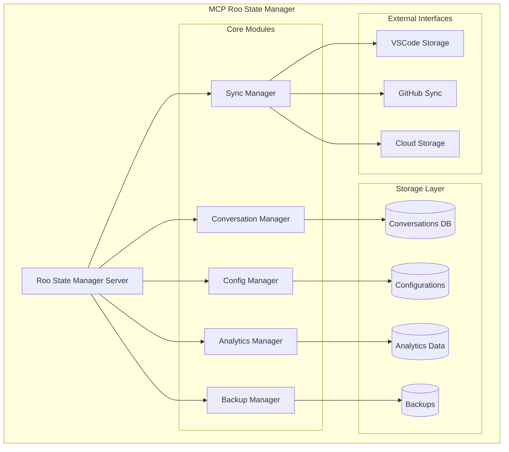

# MCP ROO STATE MANAGER - ARCHITECTURE DÉTAILLÉE

## 🔍 DÉCOUVERTES CLÉS SUR L'ARCHITECTURE ROO

### Structure de stockage des conversations

**Emplacement principal :**
- Base : `{globalStoragePath}/tasks/{taskId}/`
- Chemin par défaut : `%APPDATA%/Code/User/globalStorage/rooveterinaryinc.roo-cline/`
- Chemin personnalisable via configuration VSCode

**Fichiers par conversation :**
- [`api_conversation_history.json`](../roo-code/src/shared/globalFileNames.ts:2) : Messages API (format Anthropic)
- [`ui_messages.json`](../roo-code/src/shared/globalFileNames.ts:3) : Messages interface utilisateur (ClineMessage)
- [`task_metadata.json`](../roo-code/src/shared/globalFileNames.ts:6) : Métadonnées de la tâche

**Historique global :** Stocké dans `taskHistory` du state global VSCode

**Configurations :** `{globalStoragePath}/settings/`

### Formats de données identifiés

```typescript
// HistoryItem (métadonnées de conversation)
interface HistoryItem {
  id: string,
  number: number,
  ts: number,
  task: string,
  tokensIn: number,
  tokensOut: number,
  cacheWrites?: number,
  cacheReads?: number,
  totalCost: number,
  size?: number,
  workspace?: string
}

// ApiMessage (conversation API)
interface ApiMessage {
  role: "user" | "assistant",
  content: string | Array<{type: string, text?: string, image?: string}>,
  ts?: number,
  isSummary?: boolean
}

// ClineMessage (interface utilisateur)
interface ClineMessage {
  type: "ask" | "say",
  ask?: string,
  text?: string,
  ts: number,
  // ... autres propriétés
}
```

## 🏗️ ARCHITECTURE DU MCP ROO STATE MANAGER



## 📁 STRUCTURE DU PROJET

```
mcps/internal/servers/roo-state-manager/
├── src/
│   ├── index.ts                    # Serveur MCP principal
│   ├── types/
│   │   ├── conversation.ts         # Types pour conversations
│   │   ├── config.ts              # Types pour configurations
│   │   ├── analytics.ts           # Types pour analytics
│   │   └── sync.ts                # Types pour synchronisation
│   ├── managers/
│   │   ├── ConversationManager.ts  # Gestion des conversations
│   │   ├── ConfigManager.ts        # Gestion des configurations
│   │   ├── SyncManager.ts          # Synchronisation multi-machines
│   │   ├── AnalyticsManager.ts     # Analyse des patterns
│   │   └── BackupManager.ts        # Sauvegarde et restauration
│   ├── storage/
│   │   ├── ConversationStorage.ts  # Stockage conversations
│   │   ├── ConfigStorage.ts        # Stockage configurations
│   │   └── AnalyticsStorage.ts     # Stockage analytics
│   ├── tools/
│   │   ├── conversation-tools.ts   # Outils conversation
│   │   ├── config-tools.ts         # Outils configuration
│   │   ├── sync-tools.ts           # Outils synchronisation
│   │   ├── analytics-tools.ts      # Outils analytics
│   │   └── backup-tools.ts         # Outils backup
│   └── utils/
│       ├── roo-storage-detector.ts # Détection stockage Roo
│       ├── conversation-parser.ts  # Parseur conversations
│       └── pattern-analyzer.ts     # Analyseur de patterns
├── storage/
│   ├── conversations.db           # Base SQLite conversations
│   ├── configs/                   # Configurations centralisées
│   ├── analytics/                 # Données d'analyse
│   └── backups/                   # Sauvegardes
├── config/
│   ├── schema.json               # Schéma de configuration
│   ├── permissions.json          # Permissions d'accès
│   └── sync-rules.json          # Règles de synchronisation
├── docs/
│   ├── README.md
│   ├── API.md
│   ├── DEPLOYMENT.md
│   └── CONVERSATION-STORAGE.md   # Documentation découvertes
├── tests/
│   ├── conversation-manager.test.ts
│   ├── config-manager.test.ts
│   └── sync-manager.test.ts
├── package.json
├── tsconfig.json
└── build.sh
```

## 🛠️ OUTILS MCP À IMPLÉMENTER

### 1. Gestion des Conversations

#### `roo_get_conversations` - Recherche et accès aux conversations
```typescript
{
  "query": "string",           // Recherche textuelle
  "workspace": "string",       // Filtrer par workspace
  "date_range": {             // Filtrer par période
    "start": "ISO date",
    "end": "ISO date"
  },
  "mode": "string",           // Filtrer par mode Roo
  "token_range": {            // Filtrer par usage tokens
    "min": number,
    "max": number
  },
  "limit": number,            // Limite résultats
  "include_content": boolean  // Inclure contenu complet
}
```

#### `roo_get_conversation_details` - Détails d'une conversation
```typescript
{
  "conversation_id": "string",
  "include_api_messages": boolean,
  "include_ui_messages": boolean,
  "include_metadata": boolean
}
```

#### `roo_analyze_conversation` - Analyse d'une conversation
```typescript
{
  "conversation_id": "string",
  "analysis_type": "patterns" | "performance" | "quality" | "tokens"
}
```

### 2. Gestion des Configurations

#### `roo_manage_config` - Gestion unifiée des configurations
```typescript
{
  "action": "get" | "set" | "sync" | "validate" | "backup",
  "config_type": "modes" | "servers" | "settings" | "profiles",
  "config_data": object,      // Pour action "set"
  "target_machine": "string", // Pour action "sync"
  "backup_name": "string"     // Pour action "backup"
}
```

#### `roo_deploy_config` - Déploiement de configuration
```typescript
{
  "config_type": "modes" | "servers" | "settings",
  "target": "local" | "global" | "machine_id",
  "validate_before": boolean,
  "create_backup": boolean
}
```

### 3. Synchronisation Multi-Machines

#### `roo_sync_state` - Synchronisation entre machines
```typescript
{
  "sync_type": "full" | "incremental" | "configs_only" | "conversations_only",
  "target_machines": ["string"],
  "conflict_resolution": "merge" | "overwrite" | "manual",
  "dry_run": boolean
}
```

#### `roo_get_sync_status` - État de synchronisation
```typescript
{
  "machine_id": "string",
  "include_conflicts": boolean
}
```

### 4. Analyse et Amélioration Continue

#### `roo_analyze_patterns` - Analyse des patterns d'usage
```typescript
{
  "analysis_type": "usage" | "performance" | "errors" | "modes",
  "time_period": "day" | "week" | "month" | "all",
  "workspace": "string",
  "generate_recommendations": boolean
}
```

#### `roo_get_insights` - Insights et recommandations
```typescript
{
  "insight_type": "performance" | "usage" | "optimization" | "errors",
  "workspace": "string",
  "include_suggestions": boolean
}
```

### 5. Sauvegarde et Restauration

#### `roo_backup_restore` - Sauvegarde et restauration
```typescript
{
  "action": "backup" | "restore" | "list" | "delete",
  "backup_name": "string",
  "include_conversations": boolean,
  "include_configs": boolean,
  "compression": boolean
}
```

## 🗄️ SCHÉMA DE BASE DE DONNÉES

```sql
-- Conversations indexées
CREATE TABLE conversations (
    id TEXT PRIMARY KEY,
    number INTEGER,
    timestamp INTEGER,
    task_summary TEXT,
    workspace TEXT,
    mode TEXT,
    tokens_in INTEGER,
    tokens_out INTEGER,
    total_cost REAL,
    size_bytes INTEGER,
    file_path TEXT,
    created_at DATETIME DEFAULT CURRENT_TIMESTAMP,
    updated_at DATETIME DEFAULT CURRENT_TIMESTAMP
);

-- Index pour recherches rapides
CREATE INDEX idx_conversations_workspace ON conversations(workspace);
CREATE INDEX idx_conversations_timestamp ON conversations(timestamp);
CREATE INDEX idx_conversations_mode ON conversations(mode);
CREATE INDEX idx_conversations_task_summary ON conversations(task_summary);

-- Configurations centralisées
CREATE TABLE configurations (
    id TEXT PRIMARY KEY,
    type TEXT NOT NULL, -- 'modes', 'servers', 'settings', 'profiles'
    name TEXT NOT NULL,
    content TEXT NOT NULL, -- JSON
    machine_id TEXT,
    version INTEGER DEFAULT 1,
    created_at DATETIME DEFAULT CURRENT_TIMESTAMP,
    updated_at DATETIME DEFAULT CURRENT_TIMESTAMP
);

-- Synchronisation entre machines
CREATE TABLE sync_state (
    machine_id TEXT PRIMARY KEY,
    last_sync DATETIME,
    sync_status TEXT, -- 'synced', 'pending', 'conflict'
    conflicts TEXT, -- JSON array of conflicts
    created_at DATETIME DEFAULT CURRENT_TIMESTAMP,
    updated_at DATETIME DEFAULT CURRENT_TIMESTAMP
);

-- Analytics et patterns
CREATE TABLE usage_analytics (
    id INTEGER PRIMARY KEY AUTOINCREMENT,
    event_type TEXT NOT NULL,
    workspace TEXT,
    mode TEXT,
    data TEXT, -- JSON
    timestamp DATETIME DEFAULT CURRENT_TIMESTAMP
);
```

## 🔧 IMPLÉMENTATION PAR PHASES

### Phase 1 : Infrastructure de Base (Semaine 1)
- [x] Structure du projet MCP
- [x] Détection automatique du stockage Roo
- [x] Parseur de conversations existantes
- [x] Base de données SQLite avec schéma
- [x] Outils MCP de base pour conversations

### Phase 2 : Gestion des Configurations (Semaine 2)
- [ ] Centralisation des configurations existantes
- [ ] Système de validation des configurations
- [ ] Outils MCP pour gestion des configs
- [ ] Interface de déploiement sécurisé

### Phase 3 : Synchronisation Multi-Machines (Semaine 3)
- [ ] Détection et résolution de conflits
- [ ] Mécanismes de synchronisation
- [ ] Outils MCP de synchronisation
- [ ] Tests de synchronisation

### Phase 4 : Analytics et Amélioration Continue (Semaine 4)
- [ ] Moteur d'analyse des conversations
- [ ] Système de recommandations
- [ ] Métriques de performance
- [ ] Documentation automatique

## 🔒 SÉCURITÉ ET PERMISSIONS

```json
{
  "permissions": {
    "conversation_access": {
      "read": ["current_workspace", "all_workspaces"],
      "search": ["current_workspace", "all_workspaces"],
      "analyze": ["current_workspace", "all_workspaces"]
    },
    "config_management": {
      "read": ["local", "global"],
      "write": ["local", "global"],
      "deploy": ["local", "global"],
      "backup": ["local", "global"]
    },
    "sync_operations": {
      "sync": ["manual", "automatic"],
      "resolve_conflicts": ["manual", "automatic"]
    }
  },
  "authentication": {
    "method": "machine_fingerprint",
    "encryption": "AES-256",
    "backup_encryption": true
  }
}
```

## 📊 MÉTRIQUES ET MONITORING

Le MCP collectera automatiquement :
- Nombre de conversations par workspace/mode
- Usage des tokens et coûts
- Patterns d'utilisation des modes
- Performance des synchronisations
- Erreurs et problèmes récurrents

## 🚀 INTÉGRATION AVEC L'ÉCOSYSTÈME EXISTANT

Le MCP s'intégrera parfaitement avec :
- **roo-config/** : Utilisation des scripts de déploiement existants
- **roo-modes/** : Analyse des patterns d'utilisation des modes
- **MCPs existants** : Coordination avec les autres serveurs MCP
- **Système de profils** : Support des profils de configuration

## 📚 RÉFÉRENCES TECHNIQUES

### Fichiers sources analysés :
- [`roo-code/src/utils/storage.ts`](../roo-code/src/utils/storage.ts) : Gestion du stockage
- [`roo-code/src/core/task-persistence/`](../roo-code/src/core/task-persistence/) : Persistance des tâches
- [`roo-code/src/shared/globalFileNames.ts`](../roo-code/src/shared/globalFileNames.ts) : Noms de fichiers
- [`roo-code/src/schemas/index.ts`](../roo-code/src/schemas/index.ts) : Schémas de données

### Découvertes clés :
1. **Stockage décentralisé** : Chaque conversation dans son propre répertoire
2. **Double format** : API messages + UI messages séparés
3. **Métadonnées riches** : Tokens, coûts, workspace, mode
4. **Historique global** : Liste des conversations dans le state VSCode
5. **Configurations modulaires** : Modes, serveurs, settings séparés

Cette architecture tire parti de la compréhension complète du système de stockage de Roo pour créer une solution unifiée qui résoudra les problèmes de perte de conversations tout en ajoutant des capacités d'amélioration continue.