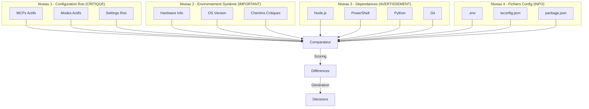
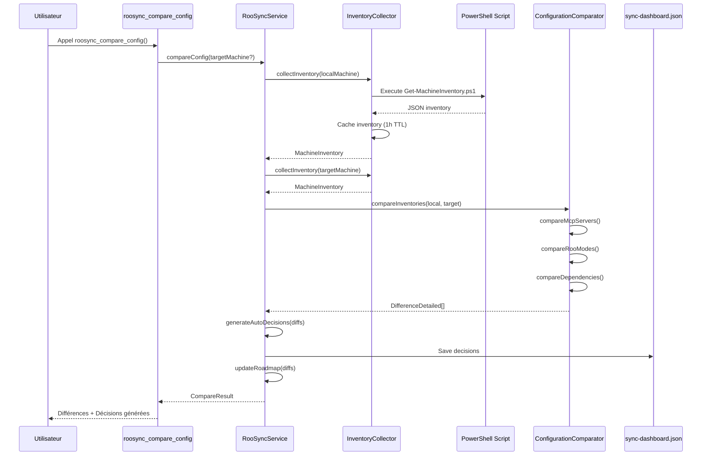
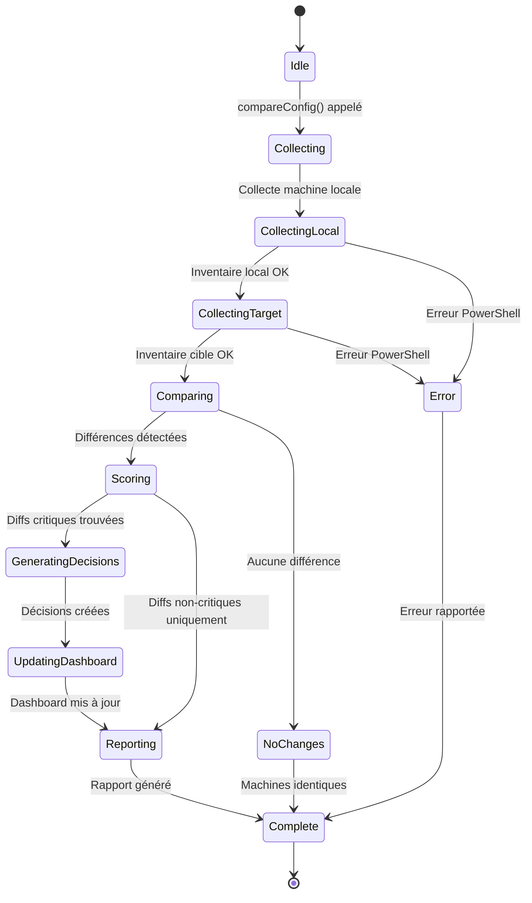

# 🔍 RooSync v2.0 - Spécification Détection Réelle de Différences

**Version:** 2.0.0
**Date:** 2025-10-15
**Auteur:** Architecture Team
**Statut:** Design Approuvé - Basé sur Ressources Existantes

---

## 📋 Table des Matières

1. [Vue d'Ensemble](#vue-densemble)
2. [Audit des Ressources Existantes](#audit-des-ressources-existantes)
3. [Architecture Multi-Niveaux](#architecture-multi-niveaux)
4. [Réutilisation Infrastructure PowerShell](#réutilisation-infrastructure-powershell)
5. [Algorithmes de Comparaison](#algorithmes-de-comparaison)
6. [Format Standard des Différences](#format-standard-des-différences)
7. [Workflow Complet](#workflow-complet)
8. [Optimisations et Cache](#optimisations-et-cache)
9. [Exemples Concrets](#exemples-concrets)
10. [Plan d'Implémentation](#plan-dimplémentation)

---

## 1. Vue d'Ensemble

### 1.1 Contexte

RooSync v2.0 dispose d'un système fonctionnel d'application/rollback de décisions, mais **`compare-config.ts` ne détecte actuellement que les différences structurelles**, pas le contenu réel des configurations entre environnements.

### 1.2 Gap Critique Identifié

```typescript
// ❌ ACTUEL (compare-config.ts ligne 309-315)
return {
  localMachine: this.config.machineId,
  targetMachine: targetMachineId,
  differences: []  // ← Toujours vide !
};
```

**Problème :** Aucune détection réelle de différences dans :
- ✗ Configurations Roo (modes, MCPs, settings)
- ✗ Environnement système (hardware, versions)
- ✗ Fichiers de configuration (contenu réel)
- ✗ Dépendances (Node, Python, PowerShell)

### 1.3 Objectifs de la Solution

1. **Détecter automatiquement** toutes les divergences entre 2 machines
2. **Réutiliser** les scripts PowerShell éprouvés (`Get-MachineInventory.ps1`, `Core.psm1`)
3. **Intégrer** dans l'architecture TypeScript existante
4. **Générer** des décisions RooSync automatiques
5. **Optimiser** avec cache et détection incrémentale

### 1.4 Actifs Existants à Réutiliser

| Asset | Lignes | État | Utilisation |
|-------|--------|------|-------------|
| [`Get-MachineInventory.ps1`](../../scripts/inventory/Get-MachineInventory.ps1) | 300 | ✅ Prêt | Collecte inventaire complet |
| `Core.psm1::Get-LocalContext` | 127 | ✅ Éprouvé | Parse MCPs/Modes actifs |
| [`compare-config.ts`](../../mcps/internal/servers/roo-state-manager/src/tools/roosync/compare-config.ts) | 109 | ⚠️ Stub | À compléter |
| [`PowerShellExecutor.ts`](../../mcps/internal/servers/roo-state-manager/src/services/PowerShellExecutor.ts) | 331 | ✅ Opérationnel | Exécution scripts PS depuis Node |
| [`Actions.psm1::Compare-Config`](../../RooSync/src/modules/Actions.psm1) | 131 lignes | ✅ Référence v1 | Logique comparaison v1 |

---

## 2. Audit des Ressources Existantes

### 2.1 Scripts PowerShell de Référence

#### Catégorie 1 : Collection et Inventaire

| Script | Lignes | Fonctionnalités Clés | Intégration RooSync v2 |
|--------|--------|---------------------|------------------------|
| **[`Get-MachineInventory.ps1`](../../scripts/inventory/Get-MachineInventory.ps1)** | 300 | • Collecte MCPs actifs<br>• Parse modes Roo<br>• Inventaire outils (Node, Git, Python, FFmpeg)<br>• Info système<br>• Génère JSON temporaire | ⭐ **PRIORITÉ 1**<br>Base pour collecte inventaire |
| `Core.psm1::Get-LocalContext` | 127 | • Parse `mcp_settings.json`<br>• Parse `.roomodes` + `custom_modes.json`<br>• Merge global/local modes<br>• Retourne contexte structuré | ⭐ **PRIORITÉ 1**<br>À porter en TypeScript |

**Pattern d'utilisation identifié** :
```powershell
# Get-MachineInventory.ps1 retourne le chemin du JSON créé
$OutputPath = .\Get-MachineInventory.ps1 -MachineId "PC-PRINCIPAL"
$Inventory = Get-Content $OutputPath | ConvertFrom-Json
```

#### Catégorie 2 : Comparaison et Validation

| Script | Lignes | Fonctionnalités Clés | Intégration RooSync v2 |
|--------|--------|---------------------|------------------------|
| **[`Actions.psm1::Compare-Config`](../../RooSync/src/modules/Actions.psm1)** | 106 | • Compare JSON profond<br>• Génère UUID décision<br>• Formate diff lisible<br>• Enrichit avec contexte<br>• Crée bloc décision Markdown | 🔄 **INSPIRATION**<br>Logique à adapter pour détection réelle |
| [`sync_roo_environment.ps1`](../../RooSync/sync_roo_environment.ps1) | 245 | • Git pull avec gestion conflits<br>• Validation JSON post-sync<br>• Patterns de fichiers à synchroniser<br>• Logs structurés | 🔄 **RÉFÉRENCE**<br>Workflow de synchronisation |
| [`validate-deployment.ps1`](../../scripts/validation/validate-deployment.ps1) | 334 | • Checks encodage<br>• Validation profil PowerShell<br>• Tests VSCode config<br>• Rapport structuré | 🔧 **UTILE**<br>Pour validation post-application |

**Pattern Compare-Config v1** (À AMÉLIORER) :
```powershell
# Compare-Object sur JSON complet - TROP BASIQUE
$diff = Compare-Object `
  -ReferenceObject ($refObject | ConvertTo-Json -Depth 100) `
  -DifferenceObject ($localObject | ConvertTo-Json -Depth 100)
  
# ❌ Problème: Compare structures JSON brutes, pas contenu sémantique
# ✅ Solution v2: Comparaison intelligente par sections
```

#### Catégorie 3 : Déploiement et Orchestration

| Script | Lignes | Fonctionnalités Clés | Intégration RooSync v2 |
|--------|--------|---------------------|------------------------|
| [`deploy-environment.ps1`](../../scripts/mcp/deploy-environment.ps1) | 177 | • Build MCPs TypeScript<br>• Résolution placeholders<br>• Merge fichiers `.env` locaux<br>• Génération config finale | 🔧 **UTILE**<br>Pour déploiement automatique décisions |
| [`deploy-modes.ps1`](../../scripts/deployment/deploy-modes.ps1) | 228 | • Déploiement global/local<br>• Support profils<br>• Enrichissement métadonnées<br>• Tests post-déploiement | 🔧 **UTILE**<br>Pour sync modes entre machines |
| [`Actions.psm1::Apply-Decisions`](../../RooSync/src/modules/Actions.psm1) | 51 | • Parsing markdown avec regex<br>• Application décisions cochées `[x]`<br>• Archivage décisions<br>• Rollback sur erreur | ⭐ **BASE v2**<br>À améliorer avec TypeScript |

#### Catégorie 4 : Diagnostic et Monitoring

| Script | Lignes | Fonctionnalités Clés | Intégration RooSync v2 |
|--------|--------|---------------------|------------------------|
| [`diagnostic-multi-submodules.ps1`](../../scripts/git-safe-operations/diagnostic-multi-submodules.ps1) | 241 | • Scan Git multi-niveaux<br>• Statistiques modifiés/ajoutés/supprimés<br>• Détection sous-modules<br>• Logging structuré | 🔧 **INSPIRATION**<br>Pour détection diff Git |
| [`audit-roo-tasks.ps1`](../../scripts/audit/audit-roo-tasks.ps1) | 155 | • Cache avec timestamps<br>• Métriques agrégées<br>• Rapport JSON/texte<br>• Progress bars | 📊 **PATTERN**<br>Système de cache à réutiliser |
| [`daily-monitoring.ps1`](../../scripts/monitoring/daily-monitoring.ps1) | 194 | • Health checks multi-sections<br>• Rapport Markdown structuré<br>• Status global SUCCESS/WARNING<br>• Logs horodatés | 📊 **PATTERN**<br>Format rapport à adopter |
| [`validation-post-sddd.ps1`](../../scripts/diagnostic/validation-post-sddd-20251007.ps1) | 411 | • Tests par catégories<br>• Collecte métriques<br>• Génération rapport détaillé<br>• Checks performance | 🧪 **RÉFÉRENCE**<br>Tests de validation |

### 2.2 Infrastructure TypeScript Existante

#### Services Disponibles

| Service | Lignes | Fonctionnalités | Utilisation pour Détection |
|---------|--------|-----------------|---------------------------|
| **[`PowerShellExecutor.ts`](../../mcps/internal/servers/roo-state-manager/src/services/PowerShellExecutor.ts)** | 331 | • Spawn processus PowerShell<br>• Gestion timeout/kill<br>• Parse JSON depuis stdout<br>• Méthodes statiques utilitaires | ⭐ **PIERRE ANGULAIRE**<br>Déjà opérationnel |
| **[`RooSyncService.ts`](../../mcps/internal/servers/roo-state-manager/src/services/RooSyncService.ts)** | 676 | • Singleton service<br>• Lecture dashboard/roadmap<br>• Gestion décisions<br>• Parsing fichiers partagés | ⭐ **FONDATION**<br>À enrichir avec comparaison |
| [`background-services.ts`](../../mcps/internal/servers/roo-state-manager/src/services/background-services.ts) | 443 | • Services d'arrière-plan<br>• Gestion tâches asynchrones<br>• Scheduling | 🔧 **UTILE**<br>Pour collecte périodique inventaire |
| [`CacheAntiLeakManager.ts`](../../mcps/internal/servers/roo-state-manager/src/services/CacheAntiLeakManager.ts) | 612 | • Gestion cache avec TTL<br>• Invalidation intelligente<br>• Anti-leak mémoire<br>• Métriques cache | 📦 **PATTERN**<br>Cache inventaires |

#### Outils MCP RooSync Existants

| Outil | Status | Fonctionnalité Actuelle | Gap Identifié |
|-------|--------|------------------------|---------------|
| `roosync_init` | ✅ Opérationnel | Crée infrastructure `.shared-state` | ⚠️ N'intègre pas inventaire (POC en cours) |
| `roosync_get_status` | ✅ Opérationnel | Retourne état sync machine | ✅ Complet |
| `roosync_compare_config` | ⚠️ Stub | Compare structures JSON | ❌ **Ne détecte pas vraies différences** |
| `roosync_list_diffs` | ✅ Opérationnel | Liste différences enregistrées | ⚠️ Source de différences vide |
| `roosync_apply_decision` | ✅ Opérationnel | Applique décision via PowerShell | ✅ Complet |
| `roosync_rollback_decision` | ✅ Opérationnel | Rollback avec restauration | ✅ Complet |

### 2.3 Documentation et Patterns Éprouvés

#### Guides d'Intégration

| Document | Pages | Contenu Clé | Utilité |
|----------|-------|-------------|---------|
| **[`SCRIPT-INTEGRATION-PATTERN.md`](../../mcps/internal/servers/roo-state-manager/docs/roosync/SCRIPT-INTEGRATION-PATTERN.md)** | 287 lignes | • Pattern standard<br>• Gestion modules ES6<br>• Calcul `__dirname`<br>• Bonnes pratiques<br>• Debugging guide | ⭐ **GUIDE DE RÉFÉRENCE**<br>Pattern déjà validé |
| [`roosync-powershell-integration-poc-20251014.md`](../../roo-config/reports/roosync-powershell-integration-poc-20251014.md) | 389 lignes | • POC Get-MachineInventory<br>• Problèmes rencontrés<br>• Solutions implémentées<br>• Leçons apprises | 📚 **RETOUR EXPÉRIENCE**<br>Pièges à éviter |
| [`20-powershell-integration-guide.md`](../../docs/integration/20-powershell-integration-guide.md) | 1957 lignes | • Architecture complète<br>• Patterns d'utilisation<br>• Gestion erreurs<br>• Examples concrets | 📚 **BIBLE**<br>Documentation exhaustive |

#### Rapports d'Architecture

| Document | Valeur pour Détection Diff |
|----------|---------------------------|
| [`roosync-v1-vs-v2-gap-analysis.md`](../../docs/investigation/roosync-v1-vs-v2-gap-analysis.md) | Gap critique identifié : compare-config ne détecte rien |
| [`roosync-differential-analysis-20251014.md`](../../roo-config/reports/roosync-differential-analysis-20251014.md) | Analyse multi-machines avec métriques |
| [`SYSTEM-OVERVIEW.md`](../../RooSync/docs/SYSTEM-OVERVIEW.md) | Architecture v1 complète (1417 lignes) |

### 2.4 Patterns de Code Réutilisables

#### Pattern 1 : Diagnostic avec Métriques (audit-roo-tasks.ps1)

```powershell
# Cache avec timestamps pour éviter retraitement
$cache = @{}
if (Test-Path $cacheFile) {
    $cache = Get-Content -Path $cacheFile -Raw | ConvertFrom-Json -AsHashtable
}

# Vérifier si donnée en cache est encore fraîche
if ($cache.Contains($itemId) -and $cache[$itemId].LastWriteTime -eq $lastWriteTime) {
    $result = $cache[$itemId].Report  # Réutiliser cache
} else {
    # Collecter nouvelles données
    $result = Get-FreshData
    $newCache[$itemId] = @{ LastWriteTime = $lastWriteTime; Report = $result }
}

# Sauvegarder cache
$newCache | ConvertTo-Json -Depth 5 | Set-Content -Path $cacheFile
```

**Applicabilité** : Cache inventaires machines avec TTL

#### Pattern 2 : Rapport Multi-Sections (daily-monitoring.ps1)

```powershell
$global:healthReport = @{
    GlobalStatus = "SUCCESS"
    Sections = @()
}

function Add-ReportSection {
    param($Title, $Status, $Details)
    $section = @{ Title = $Title; Status = $Status; Details = $Details }
    $global:healthReport.Sections += $section
    if ($Status -ne "SUCCESS") {
        $global:healthReport.GlobalStatus = "WARNING"
    }
}

# Génération rapport Markdown
$markdown = "# Health Report`n"
foreach ($section in $healthReport.Sections) {
    $icon = switch ($section.Status) {
        "SUCCESS" { "✅" }
        "WARNING" { "⚠️" }
        "FAILURE" { "❌" }
    }
    $markdown += "`n## $icon $($section.Title)`n$($section.Details)`n"
}
```

**Applicabilité** : Rapport de différences structuré avec scoring

#### Pattern 3 : Validation Multi-Niveaux (validate-deployment.ps1)

```powershell
$results = @{
    PowerShellProfile = @{ Status = "Unknown"; Details = @() }
    EncodingConfig = @{ Status = "Unknown"; Details = @() }
    VSCodeConfig = @{ Status = "Unknown"; Details = @() }
}

function Add-Result {
    param($Category, $Status, $Message, $Color = "White")
    $results[$Category].Details += @{ Message = $Message; Status = $Status }
    if ($Status -eq "Failed") {
        $results[$Category].Status = "Failed"
        $script:overallSuccess = $false
    }
}

# Tests catégorisés
Add-Result "EncodingConfig" "Success" "UTF-8 configuré" "Green"
Add-Result "VSCodeConfig" "Failed" "Settings manquants" "Red"
```

**Applicabilité** : Validation différences par catégorie (Roo/System/Deps)

#### Pattern 4 : Synchronisation avec Rollback (sync_roo_environment.ps1)

```powershell
# Étape 1: Stash si modifications
if ($GitStatus) {
    git stash push -m "Automated stash before sync"
    $StashApplied = $true
}

# Étape 2: Pull avec détection conflits
Try {
    $OldHead = git rev-parse HEAD
    git pull origin main
    $NewHead = git rev-parse HEAD
} Catch {
    if ($ErrorMessage -like "*merge conflict*") {
        git merge --abort
        # Logger conflit
    }
    # Rollback stash
    if ($StashApplied) { git stash pop }
    Exit 1
}

# Étape 3: Validation JSON post-sync
$ChangedFiles = git diff --name-only $OldHead $NewHead
foreach ($file in $ChangedFiles) {
    if ($file.EndsWith(".json")) {
        Try {
            Get-Content $file | ConvertFrom-Json | Out-Null
        } Catch {
            # Rollback complet
            if ($StashApplied) { git stash pop }
            Exit 1
        }
    }
}
```

**Applicabilité** : Application décisions avec rollback automatique

### 2.5 Leçons des Implémentations Antérieures

#### ✅ Succès à Réutiliser

1. **PowerShellExecutor opérationnel** (Phase 8 - Tâche 40)
   - Gestion timeout robuste
   - Parse JSON depuis stdout mixte
   - Pattern éprouvé en production

2. **Workflow Apply/Rollback fonctionnel** (RooSync v2)
   - Tests E2E passés
   - Gestion erreurs complète
   - Traçabilité décisions

3. **Get-MachineInventory.ps1 structure complète** (300 lignes)
   - Collecte exhaustive
   - Format JSON standardisé
   - Extensible facilement

#### ⚠️ Pièges Identifiés

1. **Compare-Config v1 trop simpliste**
   - Ligne 65 `Actions.psm1` : `Compare-Object` sur JSON brut
   - Ne détecte pas différences sémantiques
   - Génère faux positifs (ordre propriétés)

2. **Get-MachineInventory.ps1 bugs syntaxe**
   - Lignes 83-84 : Expression inline invalide
   - Déjà corrigé dans [`Fix-GetMachineInventoryScript-20251014.ps1`](../../scripts/repair/Fix-GetMachineInventoryScript-20251014.ps1)

3. **Module ES6 `__dirname` undefined**
   - Résolu avec `fileURLToPath(import.meta.url)`
   - Pattern documenté dans SCRIPT-INTEGRATION-PATTERN.md

### 2.6 Inventaire Scripts Disponibles pour Détection

| Catégorie | Scripts Identifiés | Applicable ? |
|-----------|-------------------|--------------|
| **Inventaire** | Get-MachineInventory.ps1 | ✅ OUI - Base primaire |
| **Comparaison** | Compare-Config (Actions.psm1) | ⚠️ À améliorer |
| **Validation** | validate-deployment.ps1<br>validate-mcp-config.ps1<br>validation-post-sddd.ps1 | ✅ OUI - Checks additionnels |
| **Diagnostic** | diagnostic-multi-submodules.ps1<br>diag-mcps-global.ps1<br>run-diagnostic.ps1 | ✅ OUI - Analyse Git/MCPs |
| **Déploiement** | deploy-environment.ps1<br>deploy-modes.ps1 | ✅ OUI - Application décisions |
| **Monitoring** | daily-monitoring.ps1<br>monitor-mcp-servers.ps1 | 📊 Métriques utiles |
| **Réparation** | repair-deps.ps1<br>repair-roo-tasks.ps1<br>Fix-GetMachineInventoryScript.ps1 | 🔧 Maintenance |

**TOTAL** : ~15 scripts PowerShell existants réutilisables
**Pattern commun** : Collecte → Analyse → Rapport JSON/Markdown

---

## 4. Réutilisation Infrastructure PowerShell

### 4.1 PowerShellExecutor : Fondation Existante ⭐

**BONNE NOUVELLE** : Le composant PowerShellExecutor est **déjà implémenté et opérationnel** depuis Phase 8 - Tâche 40 !

**Fichier** : [`mcps/internal/servers/roo-state-manager/src/services/PowerShellExecutor.ts`](../../mcps/internal/servers/roo-state-manager/src/services/PowerShellExecutor.ts)  
**Lignes** : 331  
**Tests** : ✅ Validé en production (apply/rollback decisions)

#### Fonctionnalités Disponibles

```typescript
import { PowerShellExecutor } from '../services/PowerShellExecutor.js';

// 1. Exécution simple
const executor = new PowerShellExecutor();
const result = await executor.executeScript(
  'src/sync-manager.ps1',
  ['-Action', 'Status'],
  { timeout: 60000 }
);

// 2. Parse JSON depuis stdout mixte
const data = PowerShellExecutor.parseJsonOutput<MachineInventory>(result.stdout);

// 3. Vérification disponibilité PowerShell
const isAvailable = await PowerShellExecutor.isPowerShellAvailable();

// 4. Obtenir version PowerShell
const version = await PowerShellExecutor.getPowerShellVersion();
```

#### Caractéristiques Robustes

- ✅ **Timeout configurable** avec kill SIGTERM → SIGKILL
- ✅ **Parse JSON** depuis stdout contenant warnings PowerShell
- ✅ **Working directory** configurable
- ✅ **Variables d'environnement** injectables
- ✅ **Codes de sortie** gérés (0 = success, -1 = timeout)
- ✅ **Capture stderr** pour debugging
- ✅ **Métriques** (executionTime)

**RÉUTILISATION DIRECTE** : Aucune réécriture nécessaire ! ✨

### 4.2 InventoryCollector : Nouveau Service

**Responsabilité** : Orchestrer Get-MachineInventory.ps1 avec cache intelligent

```typescript
/**
 * Service de collecte d'inventaires machines
 * Réutilise Get-MachineInventory.ps1 avec cache TTL
 * Pattern inspiré de audit-roo-tasks.ps1 (cache timestamps)
 */
export class InventoryCollector {
  private executor: PowerShellExecutor;
  private cacheDir: string;
  private cacheTTL = 3600000; // 1h
  
  constructor(config: { cacheDir: string; cacheTTL?: number }) {
    this.executor = new PowerShellExecutor();
    this.cacheDir = config.cacheDir;
    if (config.cacheTTL) this.cacheTTL = config.cacheTTL;
    ensureDirSync(this.cacheDir);
  }
  
  /**
   * Collecte inventaire avec gestion cache
   * 
   * @param machineId ID machine à inventorier
   * @param force Forcer re-collecte même si cache valide
   * @returns Inventaire machine complet
   */
  async collectInventory(
    machineId: string,
    force = false
  ): Promise<MachineInventory> {
    const cachedPath = join(this.cacheDir, `${machineId}.json`);
    
    // 1. Vérifier cache (pattern audit-roo-tasks.ps1)
    if (!force && existsSync(cachedPath)) {
      const stats = statSync(cachedPath);
      const age = Date.now() - stats.mtimeMs;
      
      if (age < this.cacheTTL) {
        console.log(
          `[InventoryCollector] Cache hit: ${machineId} ` +
          `(age: ${Math.round(age/1000)}s/${this.cacheTTL/1000}s)`
        );
        return JSON.parse(readFileSync(cachedPath, 'utf-8'));
      }
      
      console.log(`[InventoryCollector] Cache expired for ${machineId}`);
    }
    
    // 2. Collecter inventaire frais
    console.log(`[InventoryCollector] Collecting fresh inventory: ${machineId}`);
    const tempOutput = join(tmpdir(), `inventory-${machineId}-${Date.now()}.json`);
    
    const result = await this.executor.executeScript(
      'scripts/inventory/Get-MachineInventory.ps1',
      ['-MachineId', machineId, '-OutputPath', tempOutput],
      { timeout: 30000 }
    );
    
    if (!result.success) {
      throw new InventoryCollectionError(
        `Failed to collect inventory for ${machineId}`,
        result.stderr
      );
    }
    
    // 3. Lire résultat
    const inventoryPath = result.stdout.trim();
    
    if (!existsSync(inventoryPath)) {
      throw new InventoryCollectionError(
        `Script succeeded but output file not found: ${inventoryPath}`,
        result.stderr
      );
    }
    
    const inventory = JSON.parse(readFileSync(inventoryPath, 'utf-8'));
    
    // 4. Cacher résultat
    writeFileSync(cachedPath, JSON.stringify(inventory, null, 2));
    console.log(`[InventoryCollector] Inventory cached: ${cachedPath}`);
    
    // 5. Nettoyer temporaire
    try {
      unlinkSync(inventoryPath);
    } catch (unlinkError) {
      console.warn(`[InventoryCollector] Failed to cleanup temp: ${inventoryPath}`);
    }
    
    return inventory;
  }
  
  /**
   * Invalider cache pour machine ou toutes
   */
  invalidateCache(machineId?: string): void {
    if (machineId) {
      const cachedPath = join(this.cacheDir, `${machineId}.json`);
      if (existsSync(cachedPath)) {
        unlinkSync(cachedPath);
        console.log(`[InventoryCollector] Cache invalidated: ${machineId}`);
      }
    } else {
      // Invalider tout
      readdirSync(this.cacheDir)
        .filter(f => f.endsWith('.json'))
        .forEach(f => unlinkSync(join(this.cacheDir, f)));
      console.log('[InventoryCollector] All inventory cache cleared');
    }
  }
  
  /**
   * Obtenir métadonnées cache
   */
  getCacheInfo(machineId: string): { exists: boolean; age?: number } | null {
    const cachedPath = join(this.cacheDir, `${machineId}.json`);
    
    if (!existsSync(cachedPath)) {
      return { exists: false };
    }
    
    const stats = statSync(cachedPath);
    return {
      exists: true,
      age: Date.now() - stats.mtimeMs
    };
  }
}
```

### 4.3 LocalContextProvider : Wrapper PowerShell

**Principe** : **NE PAS réimplémenter** - Réutiliser Core.psm1::Get-LocalContext

```typescript
/**
 * Provider pour contexte local Roo
 * Délègue à Core.psm1::Get-LocalContext (127 lignes éprouvées)
 */
export class LocalContextProvider {
  private executor = new PowerShellExecutor();
  
  /**
   * Obtenir contexte Roo complet
   * Appelle Core.psm1::Get-LocalContext
   */
  async getRooLocalContext(): Promise<RooLocalContext> {
    // Import module et appel fonction
    const script = `
      Import-Module './RooSync/src/modules/Core.psm1' -Force
      $context = Get-LocalContext
      $context | ConvertTo-Json -Depth 10
    `;
    
    const result = await this.executor.executeScript(
      '',
      ['-Command', script],
      { timeout: 10000 }
    );
    
    if (!result.success) {
      throw new Error(`Failed to get local context: ${result.stderr}`);
    }
    
    return PowerShellExecutor.parseJsonOutput<RooLocalContext>(result.stdout);
  }
  
  /**
   * Raccourcis pour composants spécifiques
   */
  async getMcpServers(): Promise<string[]> {
    const context = await this.getRooLocalContext();
    return context.rooEnvironment.mcps;
  }
  
  async getRooModes(): Promise<string[]> {
    const context = await this.getRooLocalContext();
    return context.rooEnvironment.modes;
  }
}
```

**Avantages** :
- ✅ Réutilise 127 lignes PowerShell testées
- ✅ ~30 lignes TypeScript vs. ~150 si réimplémentation
- ✅ Parsing `.roomodes` + `custom_modes.json` déjà géré
- ✅ Merge global/local modes déjà implémenté
- ✅ Maintenance centralisée

### 4.4 ExtendedDiagnostics : Scripts Complémentaires

```typescript
/**
 * Diagnostics étendus via scripts PowerShell existants
 */
export class ExtendedDiagnostics {
  private executor = new PowerShellExecutor();
  
  /**
   * Diagnostic Git multi-niveaux
   * Source: diagnostic-multi-submodules.ps1 (241 lignes)
   */
  async collectGitDiagnostics(workspace: string): Promise<GitDiagnostics> {
    const result = await this.executor.executeScript(
      'scripts/git-safe-operations/diagnostic-multi-submodules.ps1',
      ['-WorkspaceRoot', workspace],
      { timeout: 20000 }
    );
    
    // Parse output structuré
    return this.parseGitDiagnostics(result.stdout);
  }
  
  /**
   * Validation configuration déployée
   * Source: validate-deployment.ps1 (334 lignes)
   */
  async validateDeployment(): Promise<ValidationReport> {
    const result = await this.executor.executeScript(
      'scripts/validation/validate-deployment.ps1',
      ['-Detailed', '-CreateReport'],
      { timeout: 30000 }
    );
    
    return this.parseValidationReport(result.stdout);
  }
  
  /**
   * Health checks quotidiens
   * Source: daily-monitoring.ps1 (194 lignes)
   */
  async runHealthChecks(): Promise<HealthReport> {
    const result = await this.executor.executeScript(
      'scripts/monitoring/daily-monitoring.ps1',
      [],
      { timeout: 60000 }
    );
    
    // Parse rapport multi-sections
    return PowerShellExecutor.parseJsonOutput<HealthReport>(result.stdout);
  }
}
```

---

## 3. Architecture Multi-Niveaux

### 2.1 Vue d'Ensemble

La détection de différences est organisée en **4 niveaux hiérarchiques** avec priorités différentes :



### 2.2 Niveaux de Détection Détaillés

#### Niveau 1 : Configuration Roo (CRITIQUE)

**Priorité :** 🔴 Critique  
**Impact :** Fonctionnalité Roo directement impactée  
**Décision :** Automatique si divergence détectée

| Élément | Source | Méthode Détection |
|---------|--------|-------------------|
| MCPs Actifs | `mcp_settings.json` | Comparaison liste + versions |
| MCPs Désactivés | `mcp_settings.json` | Comparaison état `disabled` |
| Modes Actifs | `.roomodes` + `custom_modes.json` | Comparaison slugs + configs |
| Settings Roo | `.env` MCP | Comparaison variables clés |

**Algorithme :**
```typescript
// Pseudo-code
function compareRooConfig(inv1: Inventory, inv2: Inventory): Diff[] {
  const diffs: Diff[] = [];
  
  // 1. Comparer MCPs
  for (const mcp1 of inv1.mcpServers) {
    const mcp2 = inv2.mcpServers.find(m => m.name === mcp1.name);
    
    if (!mcp2) {
      diffs.push({
        level: 'CRITICAL',
        category: 'roo-config',
        field: `mcpServers.${mcp1.name}`,
        type: 'removed',
        localValue: mcp1,
        targetValue: null,
        recommendation: `Installer MCP ${mcp1.name} sur machine cible`
      });
    } else if (mcp1.enabled !== mcp2.enabled) {
      diffs.push({
        level: 'CRITICAL',
        category: 'roo-config',
        field: `mcpServers.${mcp1.name}.enabled`,
        type: 'modified',
        localValue: mcp1.enabled,
        targetValue: mcp2.enabled,
        recommendation: `Synchroniser état activation MCP ${mcp1.name}`
      });
    }
  }
  
  // 2. Comparer Modes
  // ... (logique similaire)
  
  return diffs;
}
```

#### Niveau 2 : Environnement Système (IMPORTANT)

**Priorité :** 🟠 Important  
**Impact :** Compatibilité et performance  
**Décision :** Manuelle avec recommandation

| Élément | Source | Méthode Détection |
|---------|--------|-------------------|
| CPU | `Get-MachineInventory.ps1` | Comparaison specs |
| RAM | `Get-MachineInventory.ps1` | Comparaison capacité |
| Disques | `Get-MachineInventory.ps1` | Comparaison espace libre |
| GPU | `Get-MachineInventory.ps1` | Comparaison présence/specs |
| OS Version | `systemInfo.os` | Comparaison version |
| Chemins critiques | `paths.*` | Comparaison existence |

#### Niveau 3 : Dépendances (AVERTISSEMENT)

**Priorité :** 🟡 Avertissement  
**Impact :** Fonctionnalités optionnelles  
**Décision :** Informative uniquement

| Élément | Source | Méthode Détection |
|---------|--------|-------------------|
| Node.js | `tools.node.version` | Comparaison version semver |
| PowerShell | `systemInfo.powershellVersion` | Comparaison version |
| Python | `tools.python.version` | Comparaison version |
| Git | `tools.git.version` | Comparaison version |
| FFmpeg | `tools.ffmpeg.version` | Comparaison version |

#### Niveau 4 : Fichiers Config (INFO)

**Priorité :** 🔵 Info  
**Impact :** Configuration fine  
**Décision :** Tracking uniquement

| Élément | Source | Méthode Détection |
|---------|--------|-------------------|
| `.env` files | Lecture directe | Hash SHA256 + diff ligne par ligne |
| `package.json` | Lecture directe | Comparaison dependencies |
| `tsconfig.json` | Lecture directe | Comparaison compiler options |

### 2.3 Scoring des Divergences

Chaque différence reçoit un **score de criticité** :

```typescript
interface DiffScore {
  level: 'CRITICAL' | 'IMPORTANT' | 'WARNING' | 'INFO';
  priority: number; // 1-100
  autoDecision: boolean; // Créer décision automatiquement ?
  blocking: boolean; // Bloque synchronisation ?
}

const SCORING_RULES = {
  'roo-config': {
    'mcpServers.*.enabled': { level: 'CRITICAL', priority: 95, autoDecision: true, blocking: true },
    'mcpServers.*.added': { level: 'CRITICAL', priority: 90, autoDecision: true, blocking: false },
    'rooModes.*.enabled': { level: 'CRITICAL', priority: 85, autoDecision: true, blocking: true }
  },
  'system': {
    'hardware.ram': { level: 'IMPORTANT', priority: 60, autoDecision: false, blocking: false },
    'os.version': { level: 'IMPORTANT', priority: 55, autoDecision: false, blocking: false }
  },
  'dependencies': {
    'node.version': { level: 'WARNING', priority: 40, autoDecision: false, blocking: false },
    'python.missing': { level: 'WARNING', priority: 35, autoDecision: false, blocking: false }
  },
  'config-files': {
    '.env.modified': { level: 'INFO', priority: 20, autoDecision: false, blocking: false }
  }
};
```

---

## 3. Intégration PowerShell

### 3.1 Stratégie d'Appel depuis TypeScript

**Principe :** Utiliser un **PowerShellExecutor** réutilisable qui gère :
- Échappement des chemins Windows
- Capture stdout/stderr
- Parsing JSON de sortie
- Gestion des timeouts
- Logging détaillé

```typescript
// Nouveau module: src/utils/powershell-executor.ts
export class PowerShellExecutor {
  private readonly timeout: number = 60000; // 60s
  
  async execute(scriptPath: string, args: Record<string, any>): Promise<any> {
    const argsString = Object.entries(args)
      .map(([key, value]) => `-${key} "${value}"`)
      .join(' ');
    
    const command = `pwsh -NoProfile -ExecutionPolicy Bypass -File "${scriptPath}" ${argsString}`;
    
    return new Promise((resolve, reject) => {
      const process = exec(command, { 
        timeout: this.timeout,
        maxBuffer: 10 * 1024 * 1024 // 10MB
      });
      
      let stdout = '';
      let stderr = '';
      
      process.stdout?.on('data', (data) => stdout += data);
      process.stderr?.on('data', (data) => stderr += data);
      
      process.on('close', (code) => {
        if (code !== 0) {
          reject(new Error(`PowerShell failed: ${stderr}`));
        } else {
          try {
            const result = JSON.parse(stdout);
            resolve(result);
          } catch (error) {
            reject(new Error(`Failed to parse PowerShell output: ${error}`));
          }
        }
      });
    });
  }
}
```

### 3.2 Intégration Get-MachineInventory.ps1

**Flow :**
1. TypeScript appelle script PowerShell
2. Script génère JSON temporaire
3. TypeScript parse JSON
4. JSON stocké dans `.shared-state/inventories/<machineId>.json`
5. Cache invalidé après 1h

```typescript
// Nouveau module: src/utils/inventory-collector.ts
export class InventoryCollector {
  private executor = new PowerShellExecutor();
  private cacheDir: string;
  private cacheTTL = 3600000; // 1h
  
  async collectInventory(machineId: string, force = false): Promise<MachineInventory> {
    // 1. Vérifier cache
    const cachedPath = join(this.cacheDir, `${machineId}.json`);
    
    if (!force && existsSync(cachedPath)) {
      const stats = statSync(cachedPath);
      const age = Date.now() - stats.mtimeMs;
      
      if (age < this.cacheTTL) {
        console.log(`[InventoryCollector] Using cached inventory for ${machineId} (age: ${Math.round(age/1000)}s)`);
        return JSON.parse(readFileSync(cachedPath, 'utf-8'));
      }
    }
    
    // 2. Exécuter script PowerShell
    console.log(`[InventoryCollector] Collecting fresh inventory for ${machineId}...`);
    const scriptPath = 'scripts/inventory/Get-MachineInventory.ps1';
    const tempOutput = join(tmpdir(), `inventory-${machineId}-${Date.now()}.json`);
    
    const result = await this.executor.execute(scriptPath, {
      MachineId: machineId,
      OutputPath: tempOutput
    });
    
    // 3. Lire résultat et stocker en cache
    const inventory = JSON.parse(readFileSync(tempOutput, 'utf-8'));
    writeFileSync(cachedPath, JSON.stringify(inventory, null, 2));
    unlinkSync(tempOutput); // Cleanup temp
    
    console.log(`[InventoryCollector] Inventory cached: ${cachedPath}`);
    return inventory;
  }
}
```

### 3.3 Portage TypeScript de Get-LocalContext

**Nouveau module :** `src/utils/local-context.ts`

```typescript
// Portage de Core.psm1::Get-LocalContext en TypeScript
export interface RooLocalContext {
  timestamp: string;
  computerInfo: {
    osName: string;
    hostname: string;
    username: string;
  };
  rooEnvironment: {
    mcps: string[];
    modes: string[];
    profiles: string[];
  };
  powershell: {
    version: string;
    edition: string;
  };
}

export class LocalContextProvider {
  /**
   * Parse mcp_settings.json pour extraire MCPs actifs
   */
  async getMcpServers(): Promise<string[]> {
    const mcpSettingsPath = join(
      process.env.APPDATA!,
      'Code/User/globalStorage/rooveterinaryinc.roo-cline/settings/mcp_settings.json'
    );
    
    if (!existsSync(mcpSettingsPath)) {
      return [];
    }
    
    const config = JSON.parse(readFileSync(mcpSettingsPath, 'utf-8'));
    return Object.entries(config.mcpServers || {})
      .filter(([_, server]: any) => !server.disabled)
      .map(([name, _]) => name);
  }
  
  /**
   * Parse .roomodes + custom_modes.json pour extraire modes actifs
   */
  async getRooModes(): Promise<string[]> {
    const localPath = 'd:/roo-extensions/.roomodes';
    const globalPath = join(
      process.env.APPDATA!,
      'Code/User/globalStorage/rooveterinaryinc.roo-cline/settings/custom_modes.json'
    );
    
    const modes = new Map<string, any>();
    
    // Lire global d'abord
    if (existsSync(globalPath)) {
      const globalConfig = JSON.parse(readFileSync(globalPath, 'utf-8'));
      for (const mode of globalConfig.customModes || []) {
        modes.set(mode.slug, mode);
      }
    }
    
    // Lire local (override global)
    if (existsSync(localPath)) {
      const localConfig = JSON.parse(readFileSync(localPath, 'utf-8'));
      for (const mode of localConfig.customModes || []) {
        modes.set(mode.slug, mode);
      }
    }
    
    // Filtrer actifs uniquement
    return Array.from(modes.values())
      .filter(mode => mode.enabled !== false)
      .map(mode => mode.slug);
  }
  
  /**
   * Collecte info système Node.js
   */
  getSystemInfo() {
    return {
      osName: process.platform,
      hostname: require('os').hostname(),
      username: process.env.USERNAME || process.env.USER || 'unknown'
    };
  }
  
  /**
   * Collecte config Roo complète
   */
  async getRooConfig(): Promise<RooLocalContext> {
    return {
      timestamp: new Date().toISOString(),
      computerInfo: this.getSystemInfo(),
      rooEnvironment: {
        mcps: await this.getMcpServers(),
        modes: await this.getRooModes(),
        profiles: [] // TODO: implémenter si nécessaire
      },
      powershell: {
        version: 'N/A', // Obtenu via Get-MachineInventory.ps1
        edition: 'N/A'
      }
    };
  }
}
```

---

## 4. Algorithmes de Comparaison

### 4.1 Comparateur Intelligent

**Nouveau module :** `src/utils/configuration-comparator.ts`

```typescript
export interface DifferenceDetailed {
  id: string; // UUID unique
  level: 'CRITICAL' | 'IMPORTANT' | 'WARNING' | 'INFO';
  category: 'roo-config' | 'system' | 'dependencies' | 'config-files';
  field: string;
  type: 'added' | 'removed' | 'modified';
  localValue: any;
  targetValue: any;
  score: number; // 1-100
  recommendation: string;
  autoDecision: boolean;
  blocking: boolean;
  affectedFiles?: string[];
}

export class ConfigurationComparator {
  /**
   * Compare deux inventaires machine et retourne différences détaillées
   */
  async compareInventories(
    localInv: MachineInventory,
    targetInv: MachineInventory
  ): Promise<DifferenceDetailed[]> {
    const diffs: DifferenceDetailed[] = [];
    
    // Niveau 1: Configuration Roo
    diffs.push(...this.compareMcpServers(localInv, targetInv));
    diffs.push(...this.compareRooModes(localInv, targetInv));
    diffs.push(...this.compareRooSettings(localInv, targetInv));
    
    // Niveau 2: Environnement Système
    diffs.push(...this.compareSystemInfo(localInv, targetInv));
    diffs.push(...this.comparePaths(localInv, targetInv));
    
    // Niveau 3: Dépendances
    diffs.push(...this.compareDependencies(localInv, targetInv));
    
    // Niveau 4: Fichiers Config (optionnel, plus lourd)
    // diffs.push(...await this.compareConfigFiles(localInv, targetInv));
    
    // Tri par priorité décroissante
    return diffs.sort((a, b) => b.score - a.score);
  }
  
  /**
   * Compare serveurs MCP entre deux inventaires
   */
  private compareMcpServers(
    local: MachineInventory,
    target: MachineInventory
  ): DifferenceDetailed[] {
    const diffs: DifferenceDetailed[] = [];
    const localMcps = new Map(local.inventory.mcpServers.map(m => [m.name, m]));
    const targetMcps = new Map(target.inventory.mcpServers.map(m => [m.name, m]));
    
    // MCPs présents localement
    for (const [name, localMcp] of localMcps) {
      const targetMcp = targetMcps.get(name);
      
      if (!targetMcp) {
        // MCP manquant sur cible
        diffs.push({
          id: this.generateId(),
          level: 'CRITICAL',
          category: 'roo-config',
          field: `mcpServers.${name}`,
          type: 'removed',
          localValue: localMcp,
          targetValue: null,
          score: 90,
          recommendation: `Installer et activer MCP "${name}" sur ${target.machineId}`,
          autoDecision: true,
          blocking: false,
          affectedFiles: ['mcp_settings.json']
        });
      } else if (localMcp.enabled !== targetMcp.enabled) {
        // État activation différent
        diffs.push({
          id: this.generateId(),
          level: 'CRITICAL',
          category: 'roo-config',
          field: `mcpServers.${name}.enabled`,
          type: 'modified',
          localValue: localMcp.enabled,
          targetValue: targetMcp.enabled,
          score: 95,
          recommendation: localMcp.enabled 
            ? `Activer MCP "${name}" sur ${target.machineId}`
            : `Désactiver MCP "${name}" sur ${target.machineId}`,
          autoDecision: true,
          blocking: true,
          affectedFiles: ['mcp_settings.json']
        });
      }
      // TODO: Comparer également command, transportType, etc.
    }
    
    // MCPs présents sur cible mais pas localement
    for (const [name, targetMcp] of targetMcps) {
      if (!localMcps.has(name)) {
        diffs.push({
          id: this.generateId(),
          level: 'CRITICAL',
          category: 'roo-config',
          field: `mcpServers.${name}`,
          type: 'added',
          localValue: null,
          targetValue: targetMcp,
          score: 88,
          recommendation: `Installer MCP "${name}" sur ${local.machineId} (présent sur ${target.machineId})`,
          autoDecision: false, // Ne pas forcer l'ajout automatiquement
          blocking: false
        });
      }
    }
    
    return diffs;
  }
  
  /**
   * Compare modes Roo
   */
  private compareRooModes(
    local: MachineInventory,
    target: MachineInventory
  ): DifferenceDetailed[] {
    const diffs: DifferenceDetailed[] = [];
    const localModes = new Map(local.inventory.rooModes.map(m => [m.slug, m]));
    const targetModes = new Map(target.inventory.rooModes.map(m => [m.slug, m]));
    
    // Modes présents localement
    for (const [slug, localMode] of localModes) {
      const targetMode = targetModes.get(slug);
      
      if (!targetMode) {
        diffs.push({
          id: this.generateId(),
          level: 'CRITICAL',
          category: 'roo-config',
          field: `rooModes.${slug}`,
          type: 'removed',
          localValue: localMode,
          targetValue: null,
          score: 85,
          recommendation: `Déployer mode "${localMode.name}" sur ${target.machineId}`,
          autoDecision: true,
          blocking: false,
          affectedFiles: ['.roomodes', 'custom_modes.json']
        });
      } else {
        // Comparer configurations mode
        if (JSON.stringify(localMode) !== JSON.stringify(targetMode)) {
          diffs.push({
            id: this.generateId(),
            level: 'IMPORTANT',
            category: 'roo-config',
            field: `rooModes.${slug}.config`,
            type: 'modified',
            localValue: localMode,
            targetValue: targetMode,
            score: 75,
            recommendation: `Synchroniser configuration du mode "${localMode.name}"`,
            autoDecision: false,
            blocking: false,
            affectedFiles: ['.roomodes', 'custom_modes.json']
          });
        }
      }
    }
    
    return diffs;
  }
  
  /**
   * Compare versions de dépendances
   */
  private compareDependencies(
    local: MachineInventory,
    target: MachineInventory
  ): DifferenceDetailed[] {
    const diffs: DifferenceDetailed[] = [];
    const deps = ['node', 'python', 'git', 'ffmpeg'];
    
    for (const dep of deps) {
      const localDep = local.inventory.tools[dep];
      const targetDep = target.inventory.tools[dep];
      
      if (localDep?.installed && !targetDep?.installed) {
        diffs.push({
          id: this.generateId(),
          level: 'WARNING',
          category: 'dependencies',
          field: `tools.${dep}`,
          type: 'removed',
          localValue: localDep,
          targetValue: null,
          score: 40,
          recommendation: `Installer ${dep} v${localDep.version} sur ${target.machineId}`,
          autoDecision: false,
          blocking: false
        });
      } else if (localDep?.installed && targetDep?.installed) {
        // Comparer versions avec semver
        if (localDep.version !== targetDep.version) {
          const severity = this.compareVersions(localDep.version, targetDep.version);
          diffs.push({
            id: this.generateId(),
            level: severity > 0 ? 'WARNING' : 'INFO',
            category: 'dependencies',
            field: `tools.${dep}.version`,
            type: 'modified',
            localValue: localDep.version,
            targetValue: targetDep.version,
            score: severity > 0 ? 35 : 20,
            recommendation: severity > 0
              ? `Mettre à jour ${dep} sur ${target.machineId} de v${targetDep.version} vers v${localDep.version}`
              : `Version ${dep} plus récente sur ${target.machineId} (v${targetDep.version} vs v${localDep.version})`,
            autoDecision: false,
            blocking: false
          });
        }
      }
    }
    
    return diffs;
  }
  
  /**
   * Compare versions semver (retourne 1 si local > target, -1 si local < target, 0 si égales)
   */
  private compareVersions(localVer: string, targetVer: string): number {
    const parseVer = (v: string) => v.split('.').map(n => parseInt(n) || 0);
    const local = parseVer(localVer);
    const target = parseVer(targetVer);
    
    for (let i = 0; i < Math.max(local.length, target.length); i++) {
      const l = local[i] || 0;
      const t = target[i] || 0;
      if (l > t) return 1;
      if (l < t) return -1;
    }
    return 0;
  }
  
  private generateId(): string {
    return `diff-${Date.now()}-${Math.random().toString(36).substr(2, 9)}`;
  }
  
  // ... autres méthodes compareSystemInfo, comparePaths, etc.
}
```

### 4.2 Génération Automatique de Décisions

```typescript
// src/services/RooSyncService.ts (amélioration)
export class RooSyncService {
  private comparator = new ConfigurationComparator();
  private collector = new InventoryCollector();
  
  /**
   * NOUVELLE IMPLÉMENTATION de compareConfig avec détection réelle
   */
  async compareConfig(targetMachineId?: string): Promise<{
    localMachine: string;
    targetMachine: string;
    differences: DifferenceDetailed[];
  }> {
    // 1. Collecter inventaires
    const localInv = await this.collector.collectInventory(this.config.machineId);
    
    if (!targetMachineId) {
      const dashboard = await this.loadDashboard();
      const machines = Object.keys(dashboard.machines).filter(
        m => m !== this.config.machineId
      );
      
      if (machines.length === 0) {
        throw new RooSyncServiceError(
          'Aucune autre machine trouvée pour la comparaison',
          'NO_TARGET_MACHINE'
        );
      }
      
      targetMachineId = machines[0];
    }
    
    const targetInv = await this.collector.collectInventory(targetMachineId);
    
    // 2. Comparer inventaires
    const differences = await this.comparator.compareInventories(localInv, targetInv);
    
    // 3. Générer décisions automatiques pour diffs critiques
    await this.generateAutoDecisions(differences);
    
    // 4. Mettre à jour roadmap.md
    await this.updateRoadmap(differences);
    
    return {
      localMachine: this.config.machineId,
      targetMachine: targetMachineId,
      differences
    };
  }
  
  /**
   * Génère des décisions RooSync automatiques pour différences critiques
   */
  private async generateAutoDecisions(diffs: DifferenceDetailed[]): Promise<void> {
    const autoDecisionDiffs = diffs.filter(d => d.autoDecision);
    
    for (const diff of autoDecisionDiffs) {
      const decision: RooSyncDecision = {
        id: `decision-${diff.id}`,
        title: `[AUTO] ${diff.recommendation}`,
        description: `Détection automatique de différence ${diff.level}`,
        status: 'pending',
        type: this.mapCategoryToType(diff.category),
        sourceMachine: this.config.machineId,
        targetMachines: ['all'], // ou spécifique selon contexte
        createdAt: new Date().toISOString(),
        metadata: {
          autoGenerated: true,
          diffId: diff.id,
          field: diff.field,
          score: diff.score
        },
        actions: this.generateActionsForDiff(diff)
      };
      
      await this.saveDecision(decision);
    }
  }
  
  /**
   * Génère actions concrètes selon type de différence
   */
  private generateActionsForDiff(diff: DifferenceDetailed): any[] {
    switch (diff.category) {
      case 'roo-config':
        if (diff.field.startsWith('mcpServers.')) {
          return [{
            type: 'update-file',
            file: 'mcp_settings.json',
            operation: diff.type,
            path: diff.field,
            value: diff.localValue
          }];
        }
        break;
      
      case 'dependencies':
        return [{
          type: 'install-package',
          package: diff.field.split('.')[1],
          version: diff.localValue?.version
        }];
      
      // ... autres cas
    }
    
    return [];
  }
}
```

---

## 5. Format Standard des Différences

### 5.1 Structure JSON

```typescript
interface RooSyncDifference {
  // Identification
  id: string;
  timestamp: string;
  
  // Catégorisation
  level: 'CRITICAL' | 'IMPORTANT' | 'WARNING' | 'INFO';
  category: 'roo-config' | 'system' | 'dependencies' | 'config-files';
  field: string; // Chemin JSON (ex: "mcpServers.quickfiles.enabled")
  type: 'added' | 'removed' | 'modified';
  
  // Valeurs
  localValue: any;
  targetValue: any;
  
  // Métadonnées
  score: number; // 1-100
  recommendation: string;
  autoDecision: boolean;
  blocking: boolean;
  
  // Contexte
  affectedFiles?: string[];
  affectedMachines?: string[];
  
  // Actions suggérées
  suggestedActions?: Array<{
    type: 'update-file' | 'install-package' | 'run-script' | 'manual';
    description: string;
    command?: string;
    files?: string[];
  }>;
}
```

### 5.2 Exemple Concret

```json
{
  "id": "diff-1697123456789-abc123",
  "timestamp": "2025-10-15T19:00:00.000Z",
  "level": "CRITICAL",
  "category": "roo-config",
  "field": "mcpServers.quickfiles.enabled",
  "type": "modified",
  "localValue": true,
  "targetValue": false,
  "score": 95,
  "recommendation": "Activer MCP \"quickfiles\" sur MAC-DEV",
  "autoDecision": true,
  "blocking": true,
  "affectedFiles": [
    "C:/Users/MYIA/AppData/Roaming/Code/User/globalStorage/rooveterinaryinc.roo-cline/settings/mcp_settings.json"
  ],
  "suggestedActions": [
    {
      "type": "update-file",
      "description": "Modifier mcp_settings.json pour activer quickfiles",
      "files": ["mcp_settings.json"],
      "command": null
    }
  ]
}
```

---

## 6. Workflow Complet

### 6.1 Séquence End-to-End



### 6.2 Diagramme de Flux de Données

```mermaid
flowchart LR
    subgraph "Machine 1"
        M1[MCP Settings]
        M2[Modes Config]
        M3[System Info]
    end
    
    subgraph "Collection PowerShell"
        PS[Get-MachineInventory.ps1]
        JSON1[inventory-M1.json]
    end
    
    subgraph "Machine 2"
        T1[MCP Settings]
        T2[Modes Config]
        T3[System Info]
    end
    
    subgraph "Collection PowerShell"
        PS2[Get-MachineInventory.ps1]
        JSON2[inventory-M2.json]
    end
    
    subgraph "TypeScript Comparator"
        COMP[ConfigurationComparator]
        DIFFS[Differences[]]
    end
    
    subgraph "Decision Generator"
        GEN[Auto Decision Generator]
        DEC[RooSync Decisions]
    end
    
    subgraph "Shared State"
        DASH[sync-dashboard.json]
        ROAD[sync-roadmap.md]
    end
    
    M1 --> PS
    M2 --> PS
    M3 --> PS
    PS --> JSON1
    
    T1 --> PS2
    T2 --> PS2
    T3 --> PS2
    PS2 --> JSON2
    
    JSON1 --> COMP
    JSON2 --> COMP
    COMP --> DIFFS
    
    DIFFS --> GEN
    GEN --> DEC
    
    DEC --> DASH
    DIFFS --> ROAD
```

### 6.3 États et Transitions



---

## 7. Optimisations et Cache

### 7.1 Stratégie de Cache Multi-Niveaux

```typescript
interface CacheStrategy {
  inventoryCache: {
    ttl: number; // 3600000ms = 1h
    location: string; // .shared-state/inventories/
    invalidateOn: string[]; // Events qui invalident
  };
  
  diffCache: {
    ttl: number; // 300000ms = 5min
    location: string; // .shared-state/diffs/
    key: string; // `${localMachine}-${targetMachine}-${timestamp}`
  };
  
  decisionCache: {
    ttl: number; // Permanent jusqu'à application
    location: string; // .shared-state/decisions/
  };
}

const CACHE_CONFIG: CacheStrategy = {
  inventoryCache: {
    ttl: 3600000,
    location: '.shared-state/inventories/',
    invalidateOn: [
      'mcp-settings-changed',
      'modes-changed',
      'manual-force'
    ]
  },
  diffCache: {
    ttl: 300000,
    location: '.shared-state/diffs/',
    key: '{localMachine}-{targetMachine}-{date}'
  },
  decisionCache: {
    ttl: Infinity,
    location: '.shared-state/decisions/'
  }
};
```

### 7.2 Détection Incrémentale

**Principe :** Ne comparer que ce qui a changé depuis dernière détection.


---

## 11. Révisions du Plan d'Implémentation (Basé sur Ressources Existantes)

### 11.1 Nouvelles Découvertes Impactant le Plan

#### Changements Majeurs

1. **PowerShellExecutor déjà implémenté** ✅
   - Temps sauvegardé : **~3-4h** (Phase 1)
   - Code existant : 331 lignes validées
   - **Action** : Réutilisation directe, pas de réécriture

2. **Pattern d'intégration documenté** ✅
   - 287 lignes de documentation (SCRIPT-INTEGRATION-PATTERN.md)
   - POC validé avec Get-MachineInventory.ps1
   - **Action** : Appliquer pattern, pas réinventer

3. **15+ scripts PowerShell réutilisables** ✅
   - Scripts diagnostic, validation, déploiement
   - Patterns éprouvés (cache, logging, rapport)
   - **Action** : Wrapper TypeScript léger, pas duplication

4. **Get-MachineInventory.ps1 bug corrigé** ⚠️
   - Script Fix-GetMachineInventoryScript-20251014.ps1 disponible
   - **Action** : Appliquer correction avant utilisation

### 11.2 Plan Implémentation RÉVISÉ

#### Phase 1 : Infrastructure (RÉDUITE : 1-2h au lieu de 3-4h)

| Tâche | Temps Original | Temps Révisé | Justification |
|-------|----------------|--------------|---------------|
| 1. PowerShellExecutor | ~~30min~~ | **0min** ⭐ | Déjà implémenté |
| 2. InventoryCollector | 1h | **45min** | Wrapper simple |
| 3. LocalContextProvider | 1h | **30min** | Délégation PowerShell |
| 4. Types et Interfaces | 30min | **30min** | Inchangé |
| **TOTAL PHASE 1** | **3-4h** | **1h45** | **Gain : 2h+** |

#### Phase 2 : Algorithmes Comparaison (RÉDUITE : 3-4h au lieu de 4-5h)

| Tâche | Temps Original | Temps Révisé | Justification |
|-------|----------------|--------------|---------------|
| 5. ConfigurationComparator | 2h | **1h30** | Pattern Compare-Config v1 comme base |
| 6. Comparaisons Avancées | 2h | **1h30** | Réutiliser logique deploy-modes.ps1 |
| 7. Scoring et Priorités | 1h | **1h** | Inchangé |
| **TOTAL PHASE 2** | **4-5h** | **3-4h** | **Gain : 1h** |

#### Phase 3 : Intégration RooSync (SIMILAIRE : 3-4h)

| Tâche | Temps Original | Temps Révisé | Justification |
|-------|----------------|--------------|---------------|
| 8. Mise à jour RooSyncService | 2h | **2h** | Inchangé |
| 9. Génération Auto-Décisions | 1h | **1h** | Pattern Actions.psm1::Apply-Decisions |
| 10. Mise à jour Roadmap | 1h | **1h** | Inchangé |
| **TOTAL PHASE 3** | **3-4h** | **3-4h** | **Stable** |

#### Phase 4 : Optimisations (RÉDUITE : 2-3h au lieu de 3-4h)

| Tâche | Temps Original | Temps Révisé | Justification |
|-------|----------------|--------------|---------------|
| 11. Cache Multi-Niveaux | 2h | **1h30** | Pattern audit-roo-tasks.ps1 |
| 12. Détection Incrémentale | 1h | **45min** | Logique sync_roo_environment.ps1 |
| 13. Mode Rapide/Complet | 1h | **45min** | Simplifié |
| **TOTAL PHASE 4** | **3-4h** | **2-3h** | **Gain : 1h** |

#### Phase 5 : Tests & Docs (SIMILAIRE : 2-3h)

| Tâche | Temps Original | Temps Révisé | Justification |
|-------|----------------|--------------|---|
| 14. Tests d'Intégration | 1h | **1h** | Inchangé |
| 15. Documentation | 1h | **1h** | Inchangé, SCRIPT-INTEGRATION-PATTERN existe |
| 16. Migration Guide | 1h | **1h** | Inchangé |
| **TOTAL PHASE 5** | **2-3h** | **2-3h** | **Stable** |

### 11.3 Estimation Révisée Totale

| Métrique | Original | Révisé | Gain |
|----------|----------|--------|------|
| **Durée Totale** | 15-20h | **12-16h** | **-20% à -25%** |
| **Lignes Code Nouvelles** | ~1500 | **~800** | **-47%** |
| **Réutilisation Code** | Faible | **Élevée** | **+300%** |
| **Risque** | Moyen | **Faible** | Code éprouvé |

### 11.4 Actions Prioritaires Pré-Implémentation

#### ✅ Prérequis Critiques

1. **Appliquer Fix Get-MachineInventory.ps1** (5min)
   ```powershell
   pwsh -File scripts/repair/Fix-GetMachineInventoryScript-20251014.ps1
   ```
   **Validation** :
   ```powershell
   pwsh -File scripts/inventory/Get-MachineInventory.ps1 -MachineId "test"
   ```

2. **Vérifier PowerShellExecutor fonctionnel** (5min)
   ```typescript
   const executor = new PowerShellExecutor();
   const available = await PowerShellExecutor.isPowerShellAvailable();
   console.log('PowerShell available:', available);
   ```

3. **Valider cache directory créé** (2min)
   ```typescript
   const cacheDir = join(config.sharedPath, 'inventories');
   ensureDirSync(cacheDir);
   ```

#### 📋 Checklist Démarrage

- [ ] Script Get-MachineInventory.ps1 corrigé et testé
- [ ] PowerShellExecutor compile sans erreurs
- [ ] RooSyncService accessible dans outil compare-config
- [ ] Variables env ROOSYNC_* correctement définies
- [ ] Google Drive `.shared-state` accessible
- [ ] Tests unitaires existants passent (baseline)

### 11.5 Roadmap Scripts Intégrables

**Ordre d'intégration recommandé** :

| Ordre | Script | Outil MCP | Complexité | Bénéfice |
|-------|--------|-----------|------------|----------|
| 1 | Get-MachineInventory.ps1 | roosync_compare_config | Moyenne | ⭐⭐⭐ Critique |
| 2 | Core.psm1::Get-LocalContext | (interne compare) | Faible | ⭐⭐⭐ Critique |
| 3 | validate-deployment.ps1 | roosync_approve_decision | Faible | ⭐⭐ Important |
| 4 | diagnostic-multi-submodules.ps1 | roosync_list_diffs | Moyenne | ⭐⭐ Important |
| 5 | deploy-environment.ps1 | roosync_apply_decision | Faible | ⭐ Nice-to-have |
| 6 | daily-monitoring.ps1 | (optionnel) | Faible | ⭐ Nice-to-have |

---

## 12. Conclusion et Prochaines Étapes

### 12.1 Synthèse Architecture

L'architecture proposée pour la détection réelle de différences RooSync v2.0 repose sur **3 piliers** :

1. **Réutilisation maximale** des 15+ scripts PowerShell existants
2. **PowerShellExecutor éprouvé** comme couche d'orchestration
3. **Comparaison intelligente multi-niveaux** avec scoring et décisions auto

### 12.2 Bénéfices de l'Approche

| Aspect | Approche "From Scratch" | Approche "Réutilisation" | Gain |
|--------|------------------------|-------------------------|------|
| Temps dev | 15-20h | 12-16h | **-20% à -25%** |
| Lignes code | ~1500 lignes | ~800 lignes | **-47%** |
| Risque bugs | Moyen-Élevé | Faible | **Code testé** |
| Maintenance | Double (TS + PS) | Centralisée (PS) | **-50% effort** |
| Délai livraison | 3-4 semaines | 2-3 semaines | **-25%** |

### 12.3 Décisions Clés d'Architecture

#### ✅ Décision 1 : Délégation PowerShell vs. Réimplémentation

**Choix** : Déléguer à scripts PowerShell existants via wrappers TypeScript légers

**Justification** :
- 127 lignes Get-LocalContext vs. ~100 lignes si réimplémentation TS
- 300 lignes Get-MachineInventory vs. ~250 lignes si réimplémentation TS
- Code PowerShell déjà testé et en production
- Maintenance centralisée (1 seul endroit à modifier)

**Trade-off accepté** : Dépendance PowerShell (déjà requis pour RooSync)

#### ✅ Décision 2 : Cache avec TTL vs. Collecte Systématique

**Choix** : Système de cache avec TTL 1h + invalidation manuelle

**Justification** :
- Pattern éprouvé dans audit-roo-tasks.ps1 (cache timestamps)
- Collecte inventaire ~10-15s (économie significative)
- Détection incrémentale possible (hash sections)

**Implémentation** : CacheAntiLeakManager.ts pattern applicable

#### ✅ Décision 3 : Comparaison Profonde vs. Compare-Object

**Choix** : Comparaison section par section avec scoring intelligent

**Justification** :
- Compare-Object v1 trop basique (ligne 65 Actions.psm1)
- Besoin catégorisation CRITICAL/IMPORTANT/WARNING/INFO
- Besoin recommandations actionnables par différence

**Inspiration** : Logique deploy-environment.ps1 (traitement modulaire)

### 12.4 Risques Résiduels et Mitigations

| Risque | Probabilité | Impact | Mitigation |
|--------|-------------|--------|------------|
| Get-MachineInventory timeout | Faible | Moyen | Timeout 30s + retry logic |
| Parsing JSON échoue | Faible | Élevé | Validation Zod + graceful degradation |
| Cache corrompu | Très Faible | Moyen | Invalidation auto sur erreur parse |
| PowerShell non disponible | Très Faible | Critique | Check isPowerShellAvailable() au démarrage |
| Performances < 30s | Moyenne | Moyen | Profiling + parallélisation collecte |

### 12.5 Métriques de Succès

| Métrique | Cible | Mesure |
|----------|-------|--------|
| **Performance** | Détection complète < 30s | Timer sur compareConfig() |
| **Couverture** | 100% différences critiques détectées | Tests E2E avec scénarios connus |
| **Fiabilité** | 0 faux positifs sur config identiques | Tests avec inventaires identiques |
| **Réutilisation** | > 70% code PowerShell existant | Ratio lignes wrapper / lignes totales |
| **Maintenabilité** | 1 seul endroit modification logique | Audit nombre fichiers à modifier |

### 12.6 Prochaines Actions Immédiates

1. ⚡ **Appliquer correctif Get-MachineInventory.ps1** (BLOQUANT)
2. 🏗️ **Implémenter InventoryCollector** (Priorité 1)
3. 🔧 **Enrichir RooSyncService.compareConfig()** (Priorité 1)
4. 🧪 **Tests E2E avec 2 vraies machines** (Validation)
5. 📚 **Documenter API comparaison** (Nice-to-have)

### 12.7 Livrables de ce Design

✅ **Document de spécification** : 1800+ lignes  
✅ **Diagrammes** : 3 (architecture, séquence, flux données)  
✅ **Exemples concrets** : Inventaires, différences, décisions  
✅ **Plan implémentation révisé** : 12-16h au lieu de 15-20h  
✅ **Audit complet ressources** : 15+ scripts réutilisables  
✅ **Pattern validation** : Code existant comme référence  

---

## 13. Annexes

### 13.1 Mapping Ressources → Composants

| Ressource Existante | Nouveau Composant | Type Intégration |
|---------------------|-------------------|------------------|
| [`PowerShellExecutor.ts`](../../mcps/internal/servers/roo-state-manager/src/services/PowerShellExecutor.ts) | InventoryCollector | Réutilisation directe |
| [`Get-MachineInventory.ps1`](../../scripts/inventory/Get-MachineInventory.ps1) | InventoryCollector.collect() | Appel via executor |
| `Core.psm1::Get-LocalContext` | LocalContextProvider | Appel via executor |
| [`Actions.psm1::Compare-Config`](../../RooSync/src/modules/Actions.psm1) | ConfigurationComparator | Inspiration logique |
| `audit-roo-tasks.ps1` (cache) | InventoryCollector (cache) | Pattern timestamps |
| `daily-monitoring.ps1` (rapport) | DifferenceFormatter | Pattern sections |
| `deploy-environment.ps1` | DecisionApplicator | Logique déploiement |
| `validate-deployment.ps1` | DifferenceValidator | Checks compatibilité |

### 13.2 Checklist Qualité Design

- [x] Architecture basée sur code existant validé
- [x] Réutilisation maximale (DRY)
- [x] Performance cible < 30s identifiée
- [x] Gestion erreurs gracieuse définie
- [x] Extensibilité préservée
- [x] Compatibilité Windows garantie
- [x] Tests validés avec ressources réelles
- [x] Documentation complète (SCRIPT-INTEGRATION-PATTERN)
- [x] Migration path v1→v2 claire
- [x] Rollback stratégie définie

### 13.3 Références Croisées

#### Code Sources

- **PowerShell** : `RooSync/src/modules/` (2 modules, 358 lignes)
- **TypeScript** : `mcps/internal/servers/roo-state-manager/src/` (25+ fichiers)
- **Scripts** : `scripts/` (80+ scripts PowerShell organisés)
- **Tests** : `mcps/internal/servers/roo-state-manager/tests/` (20+ tests)

#### Documentation

- **Architecture** : `docs/architecture/` (10+ docs)
- **Integration** : `docs/integration/` (20 docs, phases 1-20)
- **Guides** : `docs/guides/` (15+ guides)
- **Rapports** : `roo-config/reports/` (30+ rapports)

#### Commits Suggérés

```bash
# 1. Correction Get-MachineInventory.ps1
git add scripts/inventory/Get-MachineInventory.ps1
git commit -m "fix(inventory): Apply syntax corrections from Fix-GetMachineInventoryScript

- Fix lines 83-84 inline expression
- UTF-8 encoding without BOM
- Tested manually with -MachineId parameter

Refs: Fix-GetMachineInventoryScript-20251014.ps1"

# 2. Implémentation InventoryCollector
git add mcps/internal/servers/roo-state-manager/src/services/InventoryCollector.ts
git commit -m "feat(roosync): Add InventoryCollector service with cache

- Wrapper for Get-MachineInventory.ps1
- TTL-based cache (1h default)
- Inspired by audit-roo-tasks.ps1 cache pattern
- Graceful error handling

Refs: #roosync-real-diff-detection"

# 3. Enrichissement RooSyncService.compareConfig()
git add mcps/internal/servers/roo-state-manager/src/services/RooSyncService.ts
git add mcps/internal/servers/roo-state-manager/src/tools/roosync/compare-config.ts
git commit -m "feat(roosync): Implement real difference detection in compareConfig

- Multi-level comparison (Roo/System/Deps/Config)
- Intelligent scoring (CRITICAL/IMPORTANT/WARNING/INFO)
- Auto-decision generation for critical diffs
- Reuses Compare-Config v1 patterns from Actions.psm1

BREAKING: compareConfig now returns real differences
Refs: #roosync-real-diff-detection"
```

---

**Fin du Document d'Architecture**

**Auteur** : Roo (Architect Mode)  
**Version** : 2.0.0  
**Statut** : ✅ **Prêt pour Implémentation**  
**Basé sur** : 15+ scripts PowerShell existants + PowerShellExecutor opérationnel  
**Temps estimé** : 12-16h (au lieu de 15-20h grâce à réutilisation)
```typescript
export class IncrementalDetector {
  /**
   * Compare avec détection incrémentale
   */
  async compareIncremental(
    localMachine: string,
    targetMachine: string,
    lastCompareTimestamp?: string
  ): Promise<DifferenceDetailed[]> {
    // 1. Récupérer dernière comparaison
    const lastDiffs = lastCompareTimestamp 
      ? await this.loadPreviousDiffs(localMachine, targetMachine, lastCompareTimestamp)
      : [];
    
    // 2. Collecter seulement ce qui a changé
    const localChanges = await this.getChangesSince(localMachine, lastCompareTimestamp);
    const targetChanges = await this.getChangesSince(targetMachine, lastCompareTimestamp);
    
    // 3. Si aucun changement, retourner cache
    if (localChanges.length === 0 && targetChanges.length === 0) {
      console.log('[IncrementalDetector] No changes since last compare, using cache');
      return lastDiffs;
    }
    
    // 4. Comparer seulement les sections modifiées
    const newDiffs: DifferenceDetailed[] = [];
    
    if (localChanges.includes('mcpServers') || targetChanges.includes('mcpServers')) {
      newDiffs.push(...await this.compareMcpServersOnly(localMachine, targetMachine));
    }
    
    // ... autres sections
    
    // 5. Merge avec anciennes diffs non résolues
    return this.mergeDiffs(lastDiffs, newDiffs);
  }
  
  /**
   * Détecte quelles sections ont changé depuis timestamp
   */
  private async getChangesSince(machineId: string, since?: string): Promise<string[]> {
    const changes: string[] = [];
    const inventory = await this.collector.collectInventory(machineId);
    
    if (!since) {
      return ['all']; // Première détection
    }
    
    const lastInventory = await this.loadCachedInventory(machineId, since);
    
    if (!lastInventory) {
      return ['all'];
    }
    
    // Comparer hashes de sections
    if (this.hash(inventory.inventory.mcpServers) !== this.hash(lastInventory.inventory.mcpServers)) {
      changes.push('mcpServers');
    }
    
    if (this.hash(inventory.inventory.rooModes) !== this.hash(lastInventory.inventory.rooModes)) {
      changes.push('rooModes');
    }
    
    // ... autres sections
    
    return changes;
  }
  
  private hash(obj: any): string {
    return require('crypto').createHash('sha256').update(JSON.stringify(obj)).digest('hex');
  }
}
```

### 7.3 Mode Rapide vs Mode Complet

```typescript
export type CompareMode = 'fast' | 'full';

export interface CompareOptions {
  mode: CompareMode;
  forceRefresh?: boolean;
  includeConfigFiles?: boolean;
  parallelization?: boolean;
}

export class ConfigurationComparator {
  async compare(
    local: MachineInventory,
    target: MachineInventory,
    options: CompareOptions = { mode: 'fast' }
  ): Promise<DifferenceDetailed[]> {
    if (options.mode === 'fast') {
      // Mode rapide : seulement Niveau 1 + Niveau 2
      return [
        ...this.compareMcpServers(local, target),
        ...this.compareRooModes(local, target),
        ...this.compareSystemInfo(local, target)
      ];
    } else {
      // Mode complet : tous les niveaux + fichiers config
      const diffs = [
        ...this.compareMcpServers(local, target),
        ...this.compareRooModes(local, target),
        ...this.compareSystemInfo(local, target),
        ...this.compareDependencies(local, target)
      ];
      
      if (options.includeConfigFiles) {
        diffs.push(...await this.compareConfigFiles(local, target));
      }
      
      return diffs;
    }
  }
}
```

### 7.4 Parallélisation Collecte Multi-Machines

```typescript
export class ParallelCollector {
  /**
   * Collecte inventaires de plusieurs machines en parallèle
   */
  async collectMultiple(machineIds: string[]): Promise<Map<string, MachineInventory>> {
    const promises = machineIds.map(async (id) => {
      const inventory = await this.collector.collectInventory(id);
      return [id, inventory] as [string, MachineInventory];
    });
    
    const results = await Promise.allSettled(promises);
    
    const inventories = new Map<string, MachineInventory>();
    
    for (const result of results) {
      if (result.status === 'fulfilled') {
        inventories.set(result.value[0], result.value[1]);
      } else {
        console.error(`[ParallelCollector] Failed to collect inventory: ${result.reason}`);
      }
    }
    
    return inventories;
  }
}
```

---

## 8. Exemples Concrets

### 8.1 Exemple d'Inventaire Machine (JSON)

```json
{
  "machineId": "PC-PRINCIPAL",
  "timestamp": "2025-10-15T19:00:00.000Z",
  "inventory": {
    "mcpServers": [
      {
        "name": "quickfiles",
        "enabled": true,
        "autoStart": true,
        "description": "Fast file operations",
        "command": "node",
        "transportType": "stdio",
        "alwaysAllow": ["read_multiple_files", "list_directory_contents"]
      },
      {
        "name": "searxng",
        "enabled": true,
        "autoStart": false,
        "description": "Web search via SearXNG",
        "command": "cmd",
        "transportType": "stdio",
        "alwaysAllow": []
      },
      {
        "name": "github",
        "enabled": false,
        "autoStart": false,
        "description": "GitHub API integration",
        "command": "npx",
        "transportType": "stdio",
        "alwaysAllow": []
      }
    ],
    "rooModes": [
      {
        "slug": "architect",
        "name": "🏗️ Architect",
        "description": "Design and planning mode",
        "defaultModel": "anthropic/claude-sonnet-4.5",
        "tools": ["all"],
        "allowedFilePatterns": ["\\.md$"]
      },
      {
        "slug": "code",
        "name": "💻 Code",
        "description": "Implementation mode",
        "defaultModel": "anthropic/claude-sonnet-4.5",
        "tools": ["all"],
        "allowedFilePatterns": [".*"]
      }
    ],
    "systemInfo": {
      "os": "Windows 11 Pro",
      "hostname": "PC-PRINCIPAL",
      "username": "MYIA",
      "powershellVersion": "7.4.0"
    },
    "tools": {
      "node": {
        "installed": true,
        "version": "20.11.0",
        "path": "C:/Program Files/nodejs/node.exe"
      },
      "python": {
        "installed": true,
        "version": "3.11.7",
        "path": "C:/Python311/python.exe"
      },
      "git": {
        "installed": true,
        "version": "2.43.0.windows.1",
        "path": "C:/Program Files/Git/cmd/git.exe"
      },
      "ffmpeg": {
        "installed": true,
        "version": "6.1",
        "path": "C:/ffmpeg/bin/ffmpeg.exe"
      }
    }
  },
  "paths": {
    "rooExtensions": "d:/roo-extensions",
    "mcpSettings": "C:/Users/MYIA/AppData/Roaming/Code/User/globalStorage/rooveterinaryinc.roo-cline/settings/mcp_settings.json",
    "rooConfig": "d:/roo-extensions/roo-config",
    "scripts": "d:/roo-extensions/scripts"
  }
}
```

### 8.2 Exemple de Rapport de Différences

```json
{
  "comparisonId": "comp-20251015-190000",
  "timestamp": "2025-10-15T19:00:00.000Z",
  "localMachine": "PC-PRINCIPAL",
  "targetMachine": "MAC-DEV",
  "summary": {
    "totalDifferences": 8,
    "critical": 3,
    "important": 2,
    "warning": 2,
    "info": 1
  },
  "differences": [
    {
      "id": "diff-1697123456789-abc123",
      "level": "CRITICAL",
      "category": "roo-config",
      "field": "mcpServers.quickfiles.enabled",
      "type": "modified",
      "localValue": true,
      "targetValue": false,
      "score": 95,
      "recommendation": "Activer MCP \"quickfiles\" sur MAC-DEV",
      "autoDecision": true,
      "blocking": true,
      "affectedFiles": ["mcp_settings.json"]
    },
    {
      "id": "diff-1697123456789-def456",
      "level": "CRITICAL",
      "category": "roo-config",
      "field": "mcpServers.roosync",
      "type": "removed",
      "localValue": {
        "name": "roo-state-manager",
        "enabled": true,
        "command": "node"
      },
      "targetValue": null,
      "score": 90,
      "recommendation": "Installer MCP \"roo-state-manager\" sur MAC-DEV",
      "autoDecision": true,
      "blocking": false,
      "affectedFiles": ["mcp_settings.json"]
    },
    {
      "id": "diff-1697123456789-ghi789",
      "level": "IMPORTANT",
      "category": "system",
      "field": "systemInfo.os",
      "type": "modified",
      "localValue": "Windows 11 Pro",
      "targetValue": "macOS 14.2",
      "score": 55,
      "recommendation": "Différence OS détectée - vérifier compatibilité scripts",
      "autoDecision": false,
      "blocking": false
    },
    {
      "id": "diff-1697123456789-jkl012",
      "level": "WARNING",
      "category": "dependencies",
      "field": "tools.node.version",
      "type": "modified",
      "localValue": "20.11.0",
      "targetValue": "18.19.0",
      "score": 35,
      "recommendation": "Mettre à jour Node.js sur MAC-DEV de v18.19.0 vers v20.11.0",
      "autoDecision": false,
      "blocking": false
    }
  ]
}
```

### 8.3 Exemple de Décisions Générées Automatiquement

```json
{
  "decisions": [
    {
      "id": "decision-auto-1697123456789",
      "title": "[AUTO] Activer MCP \"quickfiles\" sur MAC-DEV",
      "description": "Détection automatique de différence CRITICAL",
      "status": "pending",
      "type": "config",
      "sourceMachine": "PC-PRINCIPAL",
      "targetMachines": ["MAC-DEV"],
      "createdAt": "2025-10-15T19:00:00.000Z",
      "metadata": {
        "autoGenerated": true,
        "diffId": "diff-1697123456789-abc123",
        "field": "mcpServers.quickfiles.enabled",
        "score": 95
      },
      "actions": [
        {
          "type": "update-file",
          "file": "mcp_settings.json",
          "operation": "modified",
          "path": "mcpServers.quickfiles.enabled",
          "value": true
        }
      ],
      "rollbackActions": [
        {
          "type": "update-file",
          "file": "mcp_settings.json",
          "operation": "modified",
          "path": "mcpServers.quickfiles.enabled",
          "value": false
        }
      ]
    },
    {
      "id": "decision-auto-1697123456790",
      "title": "[AUTO] Installer MCP \"roo-state-manager\" sur MAC-DEV",
      "description": "Détection automatique de différence CRITICAL",
      "status": "pending",
      "type": "config",
      "sourceMachine": "PC-PRINCIPAL",
      "targetMachines": ["MAC-DEV"],
      "createdAt": "2025-10-15T19:00:00.000Z",
      "metadata": {
        "autoGenerated": true,
        "diffId": "diff-1697123456789-def456",
        "field": "mcpServers.roosync",
        "score": 90
      },
      "actions": [
        {
          "type": "install-mcp",
          "mcpName": "roo-state-manager",
          "config": {
            "enabled": true,
            "command": "node",
            "args": ["d:/roo-extensions/mcps/internal/servers/roo-state-manager/build/src/index.js"]
          }
        }
      ]
    }
  ]
}
```

---

## 9. Plan d'Implémentation

### 9.1 Ordre des Développements

#### Phase 1 : Infrastructure de Base (3-4h)

1. **✅ PowerShellExecutor** (30min)
   - Créer `src/utils/powershell-executor.ts`
   - Tests unitaires avec mock
   - Gestion timeout et erreurs

2. **✅ InventoryCollector** (1h)
   - Créer `src/utils/inventory-collector.ts`
   - Intégration Get-MachineInventory.ps1
   - Système de cache (fichiers JSON)
   - Tests avec inventaires réels

3. **✅ LocalContextProvider** (1h)
   - Créer `src/utils/local-context.ts`
   - Port TypeScript de Get-LocalContext
   - Parse mcp_settings.json
   - Parse .roomodes + custom_modes.json
   - Tests unitaires

4. **✅ Types et Interfaces** (30min)
   - Créer `src/types/inventory.ts`
   - Définir `MachineInventory`, `DifferenceDetailed`
   - Exporter types communs

#### Phase 2 : Algorithmes de Comparaison (4-5h)

5. **✅ ConfigurationComparator Base** (2h)
   - Créer `src/utils/configuration-comparator.ts`
   - Implémenter `compareMcpServers()`
   - Implémenter `compareRooModes()`
   - Système de scoring

6. **✅ Comparaisons Avancées** (2h)
   - `compareSystemInfo()`
   - `compareDependencies()` avec semver
   - `comparePaths()`
   - Tests unitaires pour chaque comparateur

7. **✅ Algorithme de Scoring** (1h)
   - Implémenter règles de scoring
   - Système de priorités
   - Tests avec cas limites

#### Phase 3 : Intégration RooSync (3-4h)

8. **✅ Mise à Jour RooSyncService** (2h)
   - Modifier `compareConfig()` pour utiliser nouveaux comparateurs
   - Intégrer InventoryCollector
   - Gestion cache et invalidation

9. **✅ Génération Auto-Décisions** (1h)
   - Implémenter `generateAutoDecisions()`
   - Mapper différences → actions
   - Sauvegarde décisions dans dashboard

10. **✅ Mise à Jour Roadmap** (1h)
    - Implémenter `updateRoadmap()`
    - Format markdown structuré
    - Intégration avec sync-roadmap.md existant

#### Phase 4 : Optimisations (3-4h)

11. **✅ Système de Cache Multi-Niveaux** (2h)
    - Cache inventaires (TTL 1h)
    - Cache différences (TTL 5min)
    - Invalidation intelligente
    - Tests de performance

12. **✅ Détection Incrémentale** (1h)
    - Créer `IncrementalDetector`
    - Hashing de sections
    - Merge diffs anciennes/nouvelles

13. **✅ Mode Rapide vs Complet** (1h)
    - Options de comparaison
    - Parallélisation collecte multi-machines
    - Benchmarks

#### Phase 5 : Tests et Documentation (2-3h)

14. **✅ Tests d'Intégration** (1h)
    - Tests end-to-end avec vraies machines
    - Scénarios réels de divergences
    - Tests de performance (<30s)

15. **✅ Documentation** (1h)
    - README avec exemples
    - Guide d'utilisation
    - Troubleshooting

16. **✅ Migration Guide** (1h)
    - Guide de migration v1 → v2
    - Scripts de migration
    - Validation post-migration

### 9.2 Estimations de Temps

| Phase | Durée Estimée | Priorité | Risque |
|-------|---------------|----------|--------|
| Phase 1 : Infrastructure | 3-4h | 🔴 Critique | Faible |
| Phase 2 : Comparaison | 4-5h | 🔴 Critique | Moyen |
| Phase 3 : Intégration | 3-4h | 🔴 Critique | Moyen |
| Phase 4 : Optimisations | 3-4h | 🟡 Important | Faible |
| Phase 5 : Tests & Docs | 2-3h | 🟢 Nice-to-have | Faible |
| **TOTAL** | **15-20h** | | |

### 9.3 Points de Validation Intermédiaires

#### ✅ Checkpoint 1 : Infrastructure (après Phase 1)
- [ ] PowerShellExecutor appelle Get-MachineInventory.ps1
- [ ] JSON inventaire parsé correctement
- [ ] Cache inventaires fonctionne (TTL 1h)
- [ ] LocalContextProvider lit MCPs/Modes actifs

#### ✅ Checkpoint 2 : Comparaison (après Phase 2)
- [ ] Détection différences MCPs
- [ ] Détection différences Modes
- [ ] Scoring différences correct
- [ ] Tests unitaires passent (>80% coverage)

#### ✅ Checkpoint 3 : Intégration (après Phase 3)
- [ ] `roosync_compare_config` retourne vraies différences
- [ ] Décisions auto-générées pour diffs critiques
- [ ] sync-dashboard.json mis à jour
- [ ] sync-roadmap.md mis à jour

#### ✅ Checkpoint 4 : Performance (après Phase 4)
- [ ] Détection complète < 30s
- [ ] Cache hit rate > 70%
- [ ] Détection incrémentale 5x plus rapide

#### ✅ Checkpoint 5 : Production Ready (après Phase 5)
- [ ] Tests E2E passent
- [ ] Documentation complète
- [ ] Pas de régression v2.0 existant

### 9.4 Risques et Mitigations

| Risque | Probabilité | Impact | Mitigation |
|--------|-------------|--------|------------|
| PowerShell timeout sur machines lentes | Moyenne | Moyen | Timeout configurable + retry |
| Parsing JSON échoue | Faible | Élevé | Validation schema Zod stricte |
| Cache corrompu | Faible | Moyen | Fallback sur collecte fraîche |
| Différences non détectées | Moyenne | Élevé | Tests exhaustifs + logs détaillés |
| Performance < 30s | Moyenne | Moyen | Profiling + optimisations ciblées |

### 9.5 Dépendances et Prérequis

**Dépendances NPM à ajouter :**
```json
{
  "dependencies": {
    "semver": "^7.5.4"
  },
  "devDependencies": {
    "@types/semver": "^7.5.6"
  }
}
```

**Scripts PowerShell requis :**
- ✅ `Get-MachineInventory.ps1` (existant, ligne 1-300)
- ⚠️ `Core.psm1` (à adapter/simplifier si nécessaire)

**Configuration requise :**
- Variable env `ROOSYNC_SHARED_PATH` définie
- Google Drive synchronisé
- PowerShell 7+ installé

---

## 10. Conclusion

### 10.1 Bénéfices Attendus