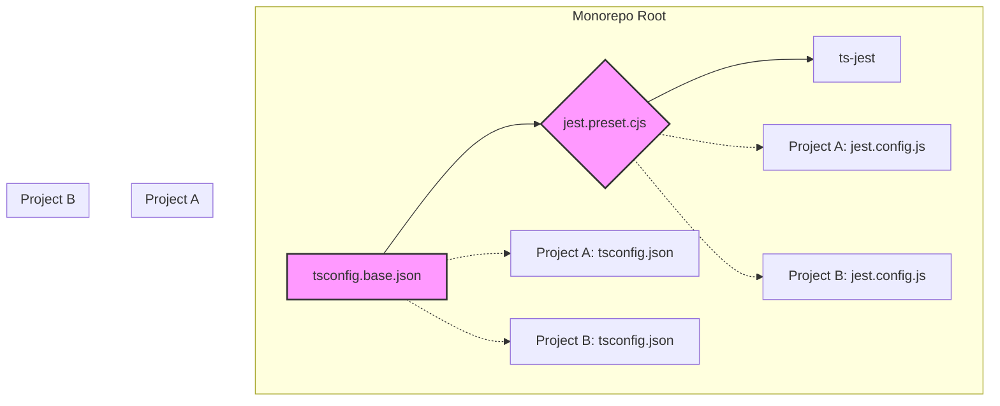

# Plan de Refonte de l'Architecture de Test

**Auteur:** Roo, Architecte Technique
**Date:** 2025-07-16
**Statut:** Proposition

## 1. Contexte et Problématique

L'analyse des projets du monorepo, notamment `github-projects-mcp` et `quickfiles-server`, a révélé plusieurs incohérences et sources d'instabilité dans la configuration des tests et du build :

- **Configurations hétérogènes :** Chaque projet possède sa propre configuration `jest.config.js` et `tsconfig.json`, avec des options de compilation (`module`, `moduleResolution`) et des conventions de test différentes.
- **Gestion des modules confuse :** Bien que les projets tendent vers l'ESM (`"type": "module"`), les configurations de test sont un mélange complexe pour tenter de faire cohabiter ESM et CommonJS, source majeure de fragilité.
- **Résolution des chemins cassée :** Les alias de chemins TypeScript (définis dans `tsconfig.paths.json`) ne sont pas résolus par Jest dans les projets qui les utilisent, rendant les tests d'intégration impossibles.

Ce manque de standardisation rend la maintenance difficile, l'ajout de nouveaux projets complexe et la fiabilité des tests aléatoire.

## 2. Nouvelle Architecture Cible

Pour résoudre ces problèmes, nous proposons une architecture de test unifiée, basée sur les principes de standardisation, de centralisation et de cohérence.

### 2.1. Standardisation : ESM-First

**Le monorepo adoptera une stratégie "ESM-First" stricte.**

- **Justification :** Simplification radicale, alignement avec l'écosystème moderne (Node.js, bibliothèques), et suppression des hacks de compatibilité.
- **`package.json` de chaque projet :** Doit contenir `"type": "module"`.
- **Imports :** Les imports de fichiers locaux devront utiliser l'extension `.js` (ex: `import { helper } from './utils.js';`). C'est une contrainte de Node.js pour les modules ESM que TypeScript peut gérer automatiquement.

### 2.2. Centralisation : Fichiers de Configuration à la Racine

Toute la configuration partagée sera centralisée à la racine du monorepo.

- **`tsconfig.base.json` (Anciennement `tsconfig.paths.json`)**
  - Fichier de base pour les options du compilateur TypeScript partagées, notamment `baseUrl` et `paths` pour les alias.
  - Il sera étendu par les `tsconfig.json` de chaque projet.

- **`jest.preset.cjs` (Fichier CJS)**
  - Un preset Jest central qui sera utilisé par toutes les configurations Jest des sous-projets.
  - Il contiendra la configuration `ts-jest`, la gestion ESM, et surtout, le `moduleNameMapper` pour les alias. L'utilisation du format `.cjs` est intentionnelle pour permettre de `require` dynamiquement le `tsconfig.base.json` et générer le mappage des chemins sans conflit de module.

### 2.3. Cohérence : Build et Test

- **TypeScript (`tsconfig.json` par projet) :**
  - Chaque projet aura son `tsconfig.json` qui `extends ../../tsconfig.base.json`.
  - Les options de compilation seront standardisées :
    ```json
    "compilerOptions": {
      "target": "ESNext",
      "module": "NodeNext",
      "moduleResolution": "NodeNext",
      "outDir": "./dist",
      "strict": true,
      "esModuleInterop": true,
      // ...
    }
    ```

- **Jest (`jest.config.js` par projet) :**
  - Chaque projet aura un `jest.config.js` minimaliste.
  - Il importera et étendra le preset central : `import preset from '../../jest.preset.cjs';`.



## 3. Plan de Migration

La migration se fera en plusieurs étapes séquentielles.

### Étape 1 : Création des Fichiers de Configuration Centraux

1.  **Renommer `tsconfig.paths.json` :**
    - **Commande :** `mv tsconfig.paths.json tsconfig.base.json`
    - **Contenu de `tsconfig.base.json` :**
      ```json
      {
        "compilerOptions": {
          "baseUrl": ".",
          "paths": {
            "@mcp/core/*": ["core/*"],
            "@mcp/client-sse-transport": ["client-sse-transport"],
            "@mcp/common/*": ["common/*"]
          },
          "target": "ESNext",
          "esModuleInterop": true,
          "skipLibCheck": true,
          "forceConsistentCasingInFileNames": true
        }
      }
      ```

2.  **Créer `jest.preset.cjs` :**
    - **Fichier :** `/jest.preset.cjs`
    - **Contenu :**
      ```javascript
      // jest.preset.cjs
      const { pathsToModuleNameMapper } = require('ts-jest');
      const { compilerOptions } = require('./tsconfig.base.json');

      /** @type {import('ts-jest').JestConfigWithTsJest} */
      module.exports = {
        preset: 'ts-jest/presets/default-esm',
        testEnvironment: 'node',
        transform: {
          '^.+\\.tsx?$': ['ts-jest', { useESM: true }],
        },
        moduleNameMapper: {
          ...pathsToModuleNameMapper(compilerOptions.paths, { prefix: '<rootDir>/' }),
          '^(\\.{1,2}/.*)\\.js$': '$1',
        },
        extensionsToTreatAsEsm: ['.ts'],
        testPathIgnorePatterns: ['/node_modules/', '/dist/'],
        coverageDirectory: './coverage',
        collectCoverageFrom: ['src/**/*.ts', '!src/**/*.d.ts'],
      };
      ```
    - **Dépendance :** Assurez-vous que `ts-jest` est une dépendance à la racine du projet, ou installez-la.

### Étape 2 : Migration du projet `github-projects-mcp`

1.  **Mettre à jour `tsconfig.json` :**
    - **Fichier :** `mcps/internal/servers/github-projects-mcp/tsconfig.json`
    - **Modification :**
      ```json
      {
        "extends": "../../../../tsconfig.base.json",
        "compilerOptions": {
          "module": "NodeNext",
          "moduleResolution": "NodeNext",
          "outDir": "./dist",
          "rootDir": "./src"
        },
        "include": ["src/**/*"],
        "exclude": ["node_modules", "dist", "tests"]
      }
      ```

2.  **Mettre à jour `jest.config.js` :**
    - **Fichier :** `mcps/internal/servers/github-projects-mcp/jest.config.js`
    - **Modification :**
      ```javascript
      // jest.config.js
      import preset from '../../../../jest.preset.cjs';

      export default {
        ...preset,
        displayName: 'github-projects-mcp',
      };
      ```

3.  **Vérifier les tests :**
    - **Commande :** `npm test --prefix mcps/internal/servers/github-projects-mcp`
    - **Action :** Corriger les éventuels problèmes d'importation. `ts-jest` avec ESM peut nécessiter des ajustements mineurs dans les fichiers de test.

### Étape 3 : Migration des autres projets (ex: `quickfiles-server`)

Répéter le processus de l'étape 2 pour chaque projet dans `mcps/internal/servers`.

1.  **Mettre à jour `tsconfig.json` pour `quickfiles-server` :**
    - **Fichier :** `mcps/internal/servers/quickfiles-server/tsconfig.json`
    - **Modification :** Ajouter `"extends": "../../../../tsconfig.base.json"` et standardiser les options comme ci-dessus.

2.  **Mettre à jour `jest.config.js` pour `quickfiles-server` :**
    - **Fichier :** `mcps/internal/servers/quickfiles-server/jest.config.js`
    - **Modification :** Remplacer tout le contenu par l'extension du preset central.

3.  **Vérification :** Lancer les tests pour chaque projet migré.

## 4. Risques et Atténuations

- **Risque :** Des tests pourraient échouer à cause de la transition stricte vers ESM (ex: dépendances qui ne sont pas entièrement compatibles).
  - **Atténuation :** Migrer projet par projet. En cas de blocage sur une dépendance, l'isoler et voir si une mise à jour est disponible ou si un import dynamique (`await import(...)`) peut contourner le problème.
- **Risque :** Les alias de chemins pourraient mal se comporter au début.
  - **Atténuation :** La méthode `pathsToModuleNameMapper` est éprouvée. La clé est de s'assurer que le `prefix` (`<rootDir>/`) est correct et pointe bien vers la racine du monorepo depuis la configuration Jest de chaque projet.
- **Risque :** Le temps de configuration du CI/CD pourrait augmenter.
  - **Atténuation :** La centralisation devrait au contraire simplifier le CI/CD en ayant une seule commande `jest` à la racine qui peut lancer tous les tests, plutôt que des commandes par projet.

## 5. Prochaines Étapes

- Examen et approbation de ce plan.
- Création d'une branche de feature pour la migration.
- Implémentation du plan, étape par étape.
- Validation finale en CI.