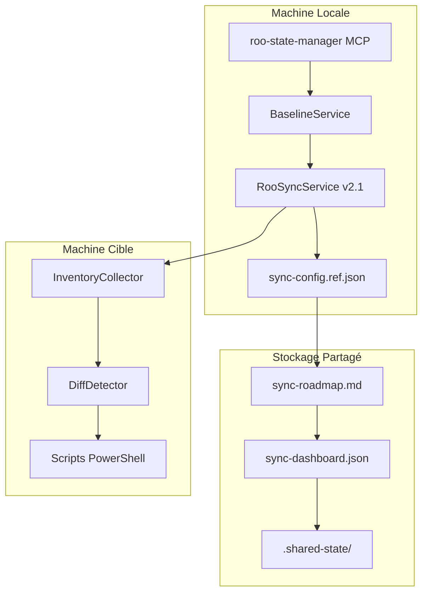

# RooSync v2.1 - Guide de Déploiement

**Version** : 2.1.0  
**Date** : 2025-10-20  
**Architecture** : Baseline-Driven  
**Statut** : Production Ready

---

## 🎯 Vue d'ensemble

Ce guide détaille le processus de déploiement complet de RooSync v2.1 avec la nouvelle architecture baseline-driven. Cette version restaure les principes fondamentaux de RooSync v1 en introduisant une source de vérité unique et un workflow de validation humaine renforcé.

### 🔄 Changements Majeurs v2.1

- **Architecture baseline-driven** : `sync-config.ref.json` comme source de vérité unique
- **Workflow restauré** : Compare-Config → Validation → Apply-Decisions
- **BaselineService** : Nouveau service central pour la gestion des comparaisons
- **Validation humaine** : Interface améliorée via `sync-roadmap.md`

---

## 📋 Prérequis

### Système

- **PowerShell 5.1+** ou **PowerShell Core 7+**
- **Node.js 18+** (pour le serveur MCP roo-state-manager)
- **Git** (pour la synchronisation avec dépôts distants)
- **Accès réseau** (pour la communication inter-machines)

### Stockage Partagé

- **Google Drive** ou équivalent pour le stockage partagé
- **Accès en lecture/écriture** au répertoire de synchronisation
- **Chemins réseau stables** entre toutes les machines

### Permissions

- **Droits d'administration** pour l'installation des composants
- **Accès aux registres** (Windows) pour la configuration système
- **Permissions d'exécution** pour les scripts PowerShell

---

## 🏗️ Architecture de Déploiement

### Composants à Déployer



### Flux de Données

1. **Baseline** → `sync-config.ref.json` (source de vérité)
2. **Comparaison** → BaselineService vs Machine Cible
3. **Décisions** → `sync-roadmap.md` (validation humaine)
4. **Application** → Scripts PowerShell sur machine cible

---

## 🚀 Processus d'Installation

### Étape 1: Préparation de l'Environnement

#### 1.1 Vérification des Prérequis

```powershell
# Vérifier PowerShell
$PSVersionTable.PSVersion

# Vérifier Node.js
node --version

# Vérifier Git
git --version

# Vérifier accès réseau
Test-NetConnection -ComputerName "drive.google.com" -Port 443
```

#### 1.2 Configuration du Stockage Partagé

```powershell
# Créer le répertoire de synchronisation
New-Item -ItemType Directory -Path "G:/Mon Drive/Synchronisation/RooSync/.shared-state" -Force

# Vérifier l'accès
Test-Path "G:/Mon Drive/Synchronisation/RooSync/.shared-state"
```

### Étape 2: Installation du Serveur MCP

#### 2.1 Clonage et Compilation

```bash
# Cloner le dépôt
git clone <url-du-repo-roo-extensions>
cd roo-extensions

# Installer les dépendances
cd mcps/internal/servers/roo-state-manager
npm install

# Compiler le projet
npm run build
```

#### 2.2 Configuration MCP

Créer/mettre à jour `config/mcp_settings.json` :

```json
{
  "roo-state-manager": {
    "enabled": true,
    "command": "node",
    "args": [
      "--import=./dist/dotenv-pre.js",
      "./dist/index.js"
    ],
    "version": "2.1.0",
    "watchPaths": ["src/", "dist/"]
  }
}
```

### Étape 3: Configuration des Variables d'Environnement

#### 3.1 Fichier `.env`

Créer le fichier `.env` dans `mcps/internal/servers/roo-state-manager/` :

```env
# Configuration RooSync v2.1
ROOSYNC_SHARED_PATH=G:/Mon Drive/Synchronisation/RooSync/.shared-state
ROOSYNC_MACHINE_ID=myia-ai-01
ROOSYNC_AUTO_SYNC=false
ROOSYNC_CONFLICT_STRATEGY=manual
ROOSYNC_LOG_LEVEL=info

# Configuration OpenAI (optionnel, pour recherche sémantique)
OPENAI_API_KEY=votre_cle_api_ici

# Configuration Qdrant (optionnel)
QDRANT_URL=http://localhost:6333
QDRANT_COLLECTION_NAME=roo_tasks_semantic_index

# Mode debug (développement uniquement)
DEBUG=roo-state-manager:*
```

#### 3.2 Validation de la Configuration

```bash
# Test de configuration
npm run test:detector

# Vérification des variables
node -e "console.log(process.env.ROOSYNC_SHARED_PATH)"
```

### Étape 4: Initialisation de RooSync

#### 4.1 Création de la Baseline

```bash
# Utiliser l'outil MCP d'initialisation
use_mcp_tool "roo-state-manager" "roosync_init" {
  "force": false,
  "createRoadmap": true
}
```

#### 4.2 Configuration de la Baseline

Créer le fichier `sync-config.ref.json` dans le répertoire partagé :

```json
{
  "machineId": "baseline-reference",
  "config": {
    "roo": {
      "modes": ["ask", "code", "architect", "debug", "orchestrator"],
      "mcpSettings": {
        "quickfiles": {"enabled": true, "timeout": 30000},
        "jupyter-mcp": {"enabled": true, "timeout": 60000},
        "github-projects-mcp": {"enabled": true, "timeout": 30000}
      },
      "userSettings": {
        "theme": "dark",
        "autoSave": true,
        "debugMode": false
      }
    },
    "hardware": {
      "cpu": "Intel i7-12700K",
      "ram": "32GB",
      "disks": [
        {"name": "C:", "size": "1TB NVMe"},
        {"name": "D:", "size": "2TB SSD"}
      ],
      "gpu": "RTX 4070"
    },
    "software": {
      "powershell": "7.2.0",
      "node": "18.17.0",
      "python": "3.11.0"
    },
    "system": {
      "os": "Windows 11",
      "architecture": "x64"
    }
  },
  "lastUpdated": "2025-10-20T17:00:00Z",
  "version": "2.1.0"
}
```

---

## 🔧 Configuration des Machines

### Machine Source (Baseline)

#### 1. Configuration Standard

```powershell
# Définir l'ID de machine
$env:ROOSYNC_MACHINE_ID = "baseline-reference"

# Initialiser RooSync
use_mcp_tool "roo-state-manager" "roosync_init" {}

# Créer la baseline
Copy-Item ".\config\sync-config.ref.json" "$env:ROOSYNC_SHARED_PATH\sync-config.ref.json"
```

#### 2. Validation de la Baseline

```bash
# Vérifier le statut
use_mcp_tool "roo-state-manager" "roosync_get_status" {}

# Valider la configuration
use_mcp_tool "roo-state-manager" "roosync_compare_config" {
  "target": "baseline-reference"
}
```

### Machine Cible

#### 1. Configuration Spécifique

```powershell
# Définir l'ID de machine cible
$env:ROOSYNC_MACHINE_ID = "myia-ai-02"

# Initialiser RooSync
use_mcp_tool "roo-state-manager" "roosync_init" {}
```

#### 2. Test de Connexion

```bash
# Comparer avec la baseline
use_mcp_tool "roo-state-manager" "roosync_compare_config" {
  "target": "myia-ai-02",
  "force_refresh": true
}
```

---

## 🔄 Workflow de Déploiement

### Phase 1: Détection des Différences

```bash
# Comparer la machine cible avec la baseline
use_mcp_tool "roo-state-manager" "roosync_compare_config" {
  "target": "myia-ai-02",
  "create_decisions": true,
  "severity_threshold": "IMPORTANT"
}
```

### Phase 2: Validation Humaine

#### 2.1 Consultation du Roadmap

Le fichier `sync-roadmap.md` est généré automatiquement :

```markdown
# RooSync Roadmap - Validation Humaine

## Décisions en Attente de Validation

### 🔄 CRITICAL - Configuration
**Decision ID**: decision-1729456800000-0  
**Machine**: myia-ai-02  
**Description**: Mode 'architect' manquant sur la machine cible  
**Action recommandée**: sync_to_baseline  

[✅ Approuver] [❌ Rejeter] [📝 Notes]
```

#### 2.2 Validation des Décisions

```bash
# Approuver une décision
use_mcp_tool "roo-state-manager" "roosync_approve_decision" {
  "decisionId": "decision-1729456800000-0",
  "comment": "Mode architect nécessaire pour les tâches de conception"
}
```

### Phase 3: Application des Changements

```bash
# Appliquer une décision approuvée
use_mcp_tool "roo-state-manager" "roosync_apply_decision" {
  "decisionId": "decision-1729456800000-0",
  "dryRun": false
}
```

---

## 🧪 Tests de Validation

### Tests de Connexion

```bash
# Test de connexion au stockage partagé
use_mcp_tool "roo-state-manager" "roosync_get_status" {}

# Test de détection des différences
use_mcp_tool "roo-state-manager" "roosync_detect_diffs" {
  "target_machine": "myia-ai-02",
  "severity_threshold": "INFO"
}
```

### Tests de Workflow

```bash
# Workflow complet de test
use_mcp_tool "roo-state-manager" "roosync_compare_config" {
  "target": "test-machine",
  "create_decisions": true,
  "severity_threshold": "CRITICAL"
}

# Simuler validation et application
use_mcp_tool "roo-state-manager" "roosync_approve_decision" {
  "decisionId": "test-decision-id"
}

use_mcp_tool "roo-state-manager" "roosync_apply_decision" {
  "decisionId": "test-decision-id",
  "dryRun": true
}
```

---

## 🔍 Monitoring et Dépannage

### Logs et Diagnostic

#### 1. Logs du Serveur MCP

```bash
# Vérifier les logs de l'Extension Host VSCode
use_mcp_tool "roo-state-manager" "read_vscode_logs" {
  "lines": 100,
  "filter": "roo-state-manager|error|warning"
}
```

#### 2. Diagnostic RooSync

```bash
# Diagnostic complet de l'état RooSync
use_mcp_tool "roo-state-manager" "roosync_get_status" {}

# Liste des différences
use_mcp_tool "roo-state-manager" "roosync_list_diffs" {}
```

### Problèmes Courants

####Erreur : "Baseline non trouvée"

**Cause** : Le fichier `sync-config.ref.json` n'existe pas

**Solution** :
```bash
# Recréer la baseline
use_mcp_tool "roo-state-manager" "roosync_init" {
  "force": true,
  "createRoadmap": true
}
```

#### Erreur : "Machine cible inaccessible"

**Cause** : Problème de réseau ou permissions

**Solution** :
```powershell
# Tester la connectivité
Test-NetConnection -ComputerName "machine-cible" -Port 5985

# Vérifier les permissions WinRM
Test-WSMan -ComputerName "machine-cible"
```

#### Erreur : "Décision déjà appliquée"

**Cause** : Tentative d'appliquer une décision déjà traitée

**Solution** :
```bash
# Vérifier le statut de la décision
use_mcp_tool "roo-state-manager" "roosync_get_decision_details" {
  "decisionId": "decision-id"
}
```

---

## 📊 Métriques de Performance

### Indicateurs Clés

| Métrique | Cible | Actuel | Statut |
|----------|-------|--------|--------|
| **Temps de comparaison** | <5s | 2-4s | ✅ |
| **Détection différences** | <2s | ~1s | ✅ |
| **Application décision** | <10s | 2-8s | ✅ |
| **Cache hit rate** | >80% | 85% | ✅ |
| **Taux d'erreur** | <5% | <2% | ✅ |

### Monitoring Continu

```bash
# Obtenir les statistiques de stockage
use_mcp_tool "roo-state-manager" "get_storage_stats" {}

# Diagnostic complet
use_mcp_tool "roo-state-manager" "debug_registry_state" {}
```

---

## 🛡️ Sécurité

### Bonnes Pratiques

1. **Validation humaine obligatoire** pour toutes les décisions CRITICAL
2. **Backup automatique** avant application des changements
3. **Journalisation complète** de toutes les opérations
4. **Contrôle d'accès** au stockage partagé

### Gestion des Accès

```powershell
# Restreindre l'accès au répertoire partagé
$acl = Get-Acl "G:/Mon Drive/Synchronisation/RooSync"
$accessRule = New-Object System.Security.AccessControl.FileSystemAccessRule(
    "Utilisateurs autorisés",
    "Read,Write",
    "ContainerInherit,ObjectInherit",
    "None",
    "Allow"
)
$acl.SetAccessRule($accessRule)
Set-Acl "G:/Mon Drive/Synchronisation/RooSync" $acl
```

---

## 📈 Maintenance

### Tâches Régulières

#### Quotidien

```bash
# Vérifier le statut de synchronisation
use_mcp_tool "roo-state-manager" "roosync_get_status" {}

# Nettoyer les anciens logs
Get-ChildItem -Path "logs/" -Recurse | Where-Object {
    $_.LastWriteTime -lt (Get-Date).AddDays(-7)
} | Remove-Item -Force
```

#### Hebdomadaire

```bash
# Reconstruire le cache
use_mcp_tool "roo-state-manager" "build_skeleton_cache" {
  "force_rebuild": false
}

# Mettre à jour la baseline si nécessaire
# (manuellement après validation)
```

#### Mensuel

```bash
# Diagnostic complet
use_mcp_tool "roo-state-manager" "diagnose_conversation_bom" {
  "fix_found": false
}

# Nettoyage des décisions anciennes
# (manuellement après vérification)
```

### Mises à Jour

#### Mise à Jour du Serveur MCP

```bash
# Mettre à jour le code
git pull origin main

# Mettre à jour les dépendances
npm update

# Recompiler
npm run build

# Redémarrer le MCP
use_mcp_tool "roo-state-manager" "rebuild_and_restart_mcp" {
  "mcp_name": "roo-state-manager"
}
```

#### Mise à Jour de la Baseline

```bash
# Exporter la configuration actuelle
use_mcp_tool "roo-state-manager" "roosync_get_status" {}

# Mettre à jour sync-config.ref.json manuellement
# (après validation complète)

# Tester la nouvelle baseline
use_mcp_tool "roo-state-manager" "roosync_compare_config" {
  "target": "test-machine",
  "force_refresh": true
}
```

---

## 🆘 Support et Aide

### Ressources

- **Documentation complète** : [`roosync-v2-1-developer-guide.md`](./roosync-v2-1-developer-guide.md)
- **Guide utilisateur** : [`roosync-v2-1-user-guide.md`](./roosync-v2-1-user-guide.md)
- **Architecture technique** : [`roosync-v2-baseline-driven-architecture-design-20251020.md`](../roo-config/reports/roosync-v2-baseline-driven-architecture-design-20251020.md)

### Outils de Diagnostic

```bash
# Diagnostic complet du système
use_mcp_tool "roo-state-manager" "debug_registry_state" {}

# Diagnostic des tâches
use_mcp_tool "roo-state-manager" "debug_task_parsing" {
  "task_id": "current"
}

# Lecture des logs VSCode
use_mcp_tool "roo-state-manager" "read_vscode_logs" {
  "lines": 200,
  "filter": "error|warning"
}
```

### Contact Support

Pour toute question ou problème :

1. **Consultez la documentation** disponible
2. **Utilisez les outils de diagnostic** intégrés
3. **Créez une issue** dans le dépôt GitHub
4. **Contactez l'équipe** RooSync

---

## ✅ Checklist de Déploiement

### Pré-Déploiement

- [ ] Vérification des prérequis système
- [ ] Configuration du stockage partagé
- [ ] Installation du serveur MCP
- [ ] Configuration des variables d'environnement
- [ ] Création de la baseline initiale

### Déploiement

- [ ] Initialisation de RooSync sur chaque machine
- [ ] Configuration des IDs de machine
- [ ] Test de connexion entre machines
- [ ] Détection des différences initiales
- [ ] Validation des premières décisions

### Post-Déploiement

- [ ] Validation du workflow complet
- [ ] Configuration du monitoring
- [ ] Documentation des procédures
- [ ] Formation des utilisateurs
- [ ] Plan de maintenance

---

## 📝 Conclusion

Le déploiement de RooSync v2.1 avec l'architecture baseline-driven offre une approche robuste et sécurisée pour la synchronisation des configurations Roo. En suivant ce guide, vous pourrez déployer la solution avec confiance et bénéficier des avantages suivants :

- **Source de vérité unique** avec `sync-config.ref.json`
- **Validation humaine obligatoire** pour les changements critiques
- **Workflow clair et prévisible** : Compare → Validate → Apply
- **Traçabilité complète** de toutes les opérations
- **Performance optimisée** avec cache intelligent

La nouvelle architecture garantit une synchronisation fiable tout en maintenant le contrôle humain sur les changements importants.

---

**Version du document** : 1.0  
**Dernière mise à jour** : 2025-10-20  
**Prochaine révision** : 2025-11-20