# RooSync v2.1 - Guide Développeur

**Version** : 2.1.0  
**Date** : 2025-10-20  
**Architecture** : Baseline-Driven  
**Audience** : Développeurs TypeScript/Node.js  

---

## 🎯 Vue d'ensemble Technique

Ce guide détaille l'architecture technique de RooSync v2.1 et fournit toutes les informations nécessaires pour comprendre, étendre et maintenir le système.

### 🏗️ Architecture Baseline-Driven

RooSync v2.1 introduit une architecture centrée autour d'un concept clé : **la baseline comme source de vérité unique**. Contrairement à v2.0 qui comparait les machines entre elles, v2.1 compare chaque machine à une configuration de référence.

```mermaid
graph TB
    subgraph "Architecture v2.1"
        A[BaselineService] --> B[sync-config.ref.json]
        C[RooSyncService v2.1] --> A
        D[InventoryCollector] --> A
        E[DiffDetector] --> A
        F[DecisionEngine] --> A
    end
    
    subgraph "Flux de Données"
        G[Machine Cible] --> D
        D --> H[Inventory JSON]
        B --> I[Baseline JSON]
        H --> E
        I --> E
        E --> J[Diff Report]
        J --> F
        F --> K[Decisions]
        K --> L[sync-roadmap.md]
    end
```



---

## 📁 Structure du Projet

### Arborescence des Fichiers Clés

```
roo-extensions/
├── mcps/internal/servers/roo-state-manager/
│   ├── src/
│   │   ├── services/
│   │   │   ├── BaselineService.ts          # ⭐ NOUVEAU - Service central
│   │   │   ├── RooSyncService.ts           # ♻️ REFACTOR - Service principal
│   │   │   ├── InventoryCollector.ts       # 📊 Collecte d'inventaire
│   │   │   └── DiffDetector.ts             # 🔍 Détection de différences
│   │   ├── tools/
│   │   │   ├── roosync/
│   │   │   │   ├── compare-config.ts       # ♻️ REFACTOR - Comparaison baseline
│   │   │   │   ├── detect-diffs.ts         # ⭐ NOUVEAU - Détection automatique
│   │   │   │   ├── approve-decision.ts     # ⭐ NOUVEAU - Validation
│   │   │   │   ├── apply-decision.ts       # ⭐ NOUVEAU - Application
│   │   │   │   └── get-status.ts           # 📊 Statut système
│   │   │   └── registry.ts                 # 📋 Registre des outils
│   │   ├── types/
│   │   │   ├── roosync.ts                  # 🏷️ Types RooSync v2.1
│   │   │   └── baseline.ts                 # 🏷️ Types BaselineService
│   │   └── index.ts                        # 🚀 Point d'entrée MCP
│   ├── dist/                               # 📦 Build TypeScript
│   ├── .env                                # ⚙️ Configuration
│   └── package.json                        # 📦 Dépendances
├── docs/
│   ├── roosync-v2-1-deployment-guide.md    # 📖 Guide déploiement
│   ├── roosync-v2-1-developer-guide.md     # 📖 Guide développeur
│   └── roosync-v2-1-user-guide.md          # 📖 Guide utilisateur
└── roo-config/
    └── reports/                            # 📊 Rapports d'analyse
```

---

## 🔧 Composants Techniques

### 1. BaselineService - Le Cœur de l'Architecture

Le `BaselineService` est le nouveau composant central de RooSync v2.1. Il orchestre toutes les opérations de comparaison avec la baseline.

```typescript
// src/services/BaselineService.ts
export class BaselineService {
  private baselinePath: string;
  private sharedStatePath: string;
  private cache: Map<string, any> = new Map();

  constructor(
    private logger: Logger,
    private fileManager: FileManager,
    private diffEngine: DiffEngine
  ) {
    this.baselinePath = process.env.ROOSYNC_BASELINE_PATH || './sync-config.ref.json';
    this.sharedStatePath = process.env.ROOSYNC_SHARED_PATH || './.shared-state';
  }

  /**
   * Charge la configuration baseline depuis le fichier de référence
   */
  public async loadBaseline(): Promise<BaselineConfig | null> {
    try {
      const baselineContent = await this.fileManager.readFile(this.baselinePath);
      const baseline = JSON.parse(baselineContent) as BaselineConfig;
      
      this.logger.info(`Baseline chargée: ${baseline.machineId}`);
      return baseline;
    } catch (error) {
      this.logger.error(`Erreur chargement baseline: ${error.message}`);
      return null;
    }
  }

  /**
   * Compare une machine cible avec la baseline
   */
  public async compareWithBaseline(targetMachineId: string): Promise<BaselineComparisonReport | null> {
    const baseline = await this.loadBaseline();
    if (!baseline) {
      throw new Error('Baseline non disponible');
    }

    const targetInventory = await this.collectMachineInventory(targetMachineId);
    const comparison = await this.diffEngine.compare(baseline, targetInventory);
    
    return {
      baselineId: baseline.machineId,
      targetId: targetMachineId,
      timestamp: new Date().toISOString(),
      differences: comparison.differences,
      summary: comparison.summary
    };
  }

  /**
   * Crée les décisions de synchronisation à partir du rapport de comparaison
   */
  public async createSyncDecisions(report: BaselineComparisonReport): Promise<SyncDecision[]> {
    const decisions: SyncDecision[] = [];
    
    for (const diff of report.differences) {
      const decision = await this.createDecisionFromDiff(diff);
      decisions.push(decision);
    }
    
    // Sauvegarder les décisions dans le roadmap
    await this.saveDecisionsToRoadmap(decisions);
    
    return decisions;
  }

  /**
   * Applique une décision de synchronisation
   */
  public async applyDecision(decisionId: string): Promise<boolean> {
    const decision = await this.getDecision(decisionId);
    if (!decision || decision.status !== 'approved') {
      throw new Error('Decision non trouvée ou non approuvée');
    }

    try {
      const result = await this.executeDecision(decision);
      await this.updateDecisionStatus(decisionId, 'applied');
      return result;
    } catch (error) {
      await this.updateDecisionStatus(decisionId, 'failed');
      throw error;
    }
  }
}
```

### 2. Types et Interfaces

```typescript
// src/types/baseline.ts
export interface BaselineConfig {
  machineId: string;
  config: {
    roo: {
      modes: string[];
      mcpSettings: Record<string, any>;
      userSettings: Record<string, any>;
    };
    hardware: HardwareConfig;
    software: SoftwareConfig;
    system: SystemConfig;
  };
  lastUpdated: string;
  version: string;
}

export interface BaselineComparisonReport {
  baselineId: string;
  targetId: string;
  timestamp: string;
  differences: ConfigDifference[];
  summary: {
    total: number;
    critical: number;
    important: number;
    warning: number;
    info: number;
  };
}

export interface ConfigDifference {
  path: string;
  type: 'missing' | 'extra' | 'different';
  severity: 'CRITICAL' | 'IMPORTANT' | 'WARNING' | 'INFO';
  baselineValue: any;
  targetValue: any;
  description: string;
  recommendedAction: 'sync_to_baseline' | 'keep_target' | 'manual_review';
}

export interface SyncDecision {
  id: string;
  timestamp: string;
  machineId: string;
  difference: ConfigDifference;
  status: 'pending' | 'approved' | 'rejected' | 'applied' | 'failed';
  action: 'sync_to_baseline' | 'keep_target' | 'manual_review';
  notes?: string;
  appliedAt?: string;
  errorMessage?: string;
}
```

### 3. RooSyncService Refactorisé

Le `RooSyncService` a été refactorisé pour déléguer ses opérations au `BaselineService`.

```typescript
// src/services/RooSyncService.ts
export class RooSyncService {
  private baselineService: BaselineService;

  constructor(
    private logger: Logger,
    private fileManager: FileManager,
    private messageService: MessageService
  ) {
    this.baselineService = new BaselineService(logger, fileManager, new DiffEngine());
  }

  /**
   * Compare une configuration avec la baseline (v2.1)
   * @deprecated Utiliser BaselineService.compareWithBaseline() directement
   */
  public async compareConfig(options: CompareConfigOptions): Promise<ComparisonResult> {
    if (options.target) {
      // Mode baseline-driven (v2.1)
      return await this.baselineService.compareWithBaseline(options.target);
    } else {
      // Mode legacy machine-à-machine (v2.0) - déprécié
      this.logger.warn('Mode machine-à-machine déprécié, utilisez le mode baseline-driven');
      return await this.legacyCompareConfig(options);
    }
  }

  /**
   * Détecte automatiquement les différences et crée les décisions
   */
  public async detectDiffs(targetMachine: string, options: DetectDiffsOptions = {}): Promise<SyncDecision[]> {
    const report = await this.baselineService.compareWithBaseline(targetMachine);
    
    // Filtrer par sévérité si demandé
    let filteredDifferences = report.differences;
    if (options.severityThreshold) {
      filteredDifferences = this.filterBySeverity(report.differences, options.severityThreshold);
    }
    
    const filteredReport = { ...report, differences: filteredDifferences };
    return await this.baselineService.createSyncDecisions(filteredReport);
  }

  /**
   * Approuve une décision de synchronisation
   */
  public async approveDecision(decisionId: string, comment?: string): Promise<void> {
    await this.baselineService.updateDecision(decisionId, {
      status: 'approved',
      notes: comment
    });
    
    this.logger.info(`Décision ${decisionId} approuvée`);
  }

  /**
   * Applique une décision approuvée
   */
  public async applyDecision(decisionId: string, options: ApplyDecisionOptions = {}): Promise<boolean> {
    if (options.dryRun) {
      this.logger.info(`Mode simulation: application de ${decisionId}`);
      return true;
    }

    return await this.baselineService.applyDecision(decisionId);
  }
}
```

---

## 🛠️ Outils MCP v2.1

### 1. compare-config - Comparaison Baseline

```typescript
// src/tools/roosync/compare-config.ts
export const CompareConfigTool: Tool = {
  name: "roosync_compare_config",
  description: "Compare la configuration d'une machine avec la baseline (v2.1)",
  inputSchema: z.object({
    target: z.string().optional()
      .describe('ID de la machine cible à comparer avec la baseline'),
    force_refresh: z.boolean().default(false)
      .describe('Forcer la collecte fraîche de l\'inventaire'),
    create_decisions: z.boolean().default(false)
      .describe('Créer automatiquement les décisions de synchronisation'),
    severity_threshold: z.enum(['CRITICAL', 'IMPORTANT', 'WARNING', 'INFO']).default('IMPORTANT')
      .describe('Seuil de sévérité pour créer des décisions')
  }),

  async handler(args) {
    const rooSyncService = new RooSyncService(/* ... */);
    
    if (args.create_decisions) {
      // Mode v2.1: détection et création de décisions
      const decisions = await rooSyncService.detectDiffs(args.target, {
        severityThreshold: args.severity_threshold,
        forceRefresh: args.force_refresh
      });
      
      return {
        success: true,
        decisions: decisions.length,
        roadmap_updated: true,
        message: `${decisions.length} décisions créées dans sync-roadmap.md`
      };
    } else {
      // Mode comparaison simple
      const report = await rooSyncService.compareConfig({
        target: args.target,
        forceRefresh: args.force_refresh
      });
      
      return {
        success: true,
        report: report.summary,
        differences: report.differences.length,
        message: `Comparaison terminée: ${report.differences.length} différences trouvées`
      };
    }
  }
};
```

### 2. detect-diffs - Détection Automatique

```typescript
// src/tools/roosync/detect-diffs.ts
export const DetectDiffsTool: Tool = {
  name: "roosync_detect_diffs",
  description: "Détecte automatiquement les différences et crée les décisions",
  inputSchema: z.object({
    sourceMachine: z.string().optional()
      .describe('ID de la machine source (défaut: local)'),
    targetMachine: z.string()
      .describe('ID de la machine cible'),
    forceRefresh: z.boolean().default(false)
      .describe('Forcer la collecte fraîche des inventaires'),
    severityThreshold: z.enum(['CRITICAL', 'IMPORTANT', 'WARNING', 'INFO']).default('IMPORTANT')
      .describe('Seuil de sévérité pour créer des décisions')
  }),

  async handler(args) {
    const rooSyncService = new RooSyncService(/* ... */);
    
    const decisions = await rooSyncService.detectDiffs(args.targetMachine, {
      severityThreshold: args.severityThreshold,
      forceRefresh: args.forceRefresh
    });
    
    // Analyser la distribution des sévérités
    const severityStats = decisions.reduce((stats, decision) => {
      const severity = decision.difference.severity;
      stats[severity] = (stats[severity] || 0) + 1;
      return stats;
    }, {} as Record<string, number>);
    
    return {
      success: true,
      total_decisions: decisions.length,
      severity_distribution: severityStats,
      roadmap_updated: true,
      message: `${decisions.length} décisions créées avec seuil ${args.severityThreshold}`
    };
  }
};
```

### 3. approve-decision - Validation Humaine

```typescript
// src/tools/roosync/approve-decision.ts
export const ApproveDecisionTool: Tool = {
  name: "roosync_approve_decision",
  description: "Approuve une décision de synchronisation",
  inputSchema: z.object({
    decisionId: z.string()
      .describe('ID de la décision à approuver'),
    comment: z.string().optional()
      .describe('Commentaire d\'approbation')
  }),

  async handler(args) {
    const rooSyncService = new RooSyncService(/* ... */);
    
    await rooSyncService.approveDecision(args.decisionId, args.comment);
    
    return {
      success: true,
      decision_id: args.decisionId,
      status: 'approved',
      message: `Décision ${args.decisionId} approuvée avec succès`
    };
  }
};
```

---

## 🔄 Workflow de Développement

### 1. Cycle de Vie d'une Décision

```mermaid
stateDiagram-v2
    [*] --> Détection
    Détection --> Pending: createSyncDecisions()
    Pending --> Approved: approveDecision()
    Pending --> Rejected: rejectDecision()
    Approved --> Applied: applyDecision()
    Approved --> Failed: applyDecision() error
    Rejected --> [*]
    Applied --> [*]
    Failed --> Pending: retry
```



### 2. Implémentation d'un Nouvel Outil

Pour ajouter un nouvel outil MCP à RooSync v2.1 :

```typescript
// src/tools/roosync/my-new-tool.ts
import { z } from 'zod';
import { Tool, Logger } from '@modelcontextprotocol/sdk/server/index.js';
import { RooSyncService } from '../../services/RooSyncService.js';

export const MyNewTool: Tool = {
  name: "roosync_my_new_tool",
  description: "Description de mon nouvel outil",
  inputSchema: z.object({
    param1: z.string().describe('Paramètre 1'),
    param2: z.boolean().default(false).describe('Paramètre 2 optionnel')
  }),

  async handler(args, context) {
    const logger = context.logger;
    const rooSyncService = new RooSyncService(logger);
    
    try {
      // Logique métier ici
      const result = await rooSyncService.doSomething(args);
      
      return {
        success: true,
        data: result,
        message: "Opération réussie"
      };
    } catch (error) {
      logger.error(`Erreur dans my-new-tool: ${error.message}`);
      return {
        success: false,
        error: error.message,
        message: "Échec de l'opération"
      };
    }
  }
};
```

### 3. Enregistrement de l'Outil

```typescript
// src/tools/registry.ts
import { MyNewTool } from './roosync/my-new-tool.js';

export function registerRooSyncTools(server: Server) {
  // Outils existants...
  server.setRequestHandler(CallToolRequestSchema, async (request) => {
    switch (request.params.name) {
      // ...
      case "roosync_my_new_tool":
        return await MyNewTool.handler(request.params.arguments, context);
      default:
        throw new Error(`Tool unknown: ${request.params.name}`);
    }
  });
}
```

---

## 🧪 Tests et Débogage

### 1. Tests Unitaires

```typescript
// tests/services/BaselineService.test.ts
import { BaselineService } from '../../src/services/BaselineService.js';
import { MockLogger, MockFileManager } from '../mocks/index.js';

describe('BaselineService', () => {
  let baselineService: BaselineService;
  let mockLogger: MockLogger;
  let mockFileManager: MockFileManager;

  beforeEach(() => {
    mockLogger = new MockLogger();
    mockFileManager = new MockFileManager();
    baselineService = new BaselineService(mockLogger, mockFileManager, new DiffEngine());
  });

  describe('loadBaseline', () => {
    it('devrait charger la baseline avec succès', async () => {
      const mockBaseline = {
        machineId: 'test-baseline',
        config: { /* ... */ },
        lastUpdated: '2025-10-20T00:00:00Z',
        version: '2.1.0'
      };
      
      mockFileManager.readFile.mockResolvedValue(JSON.stringify(mockBaseline));
      
      const result = await baselineService.loadBaseline();
      
      expect(result).toEqual(mockBaseline);
      expect(mockLogger.info).toHaveBeenCalledWith('Baseline chargée: test-baseline');
    });

    it('devrait retourner null en cas d\'erreur', async () => {
      mockFileManager.readFile.mockRejectedValue(new Error('Fichier non trouvé'));
      
      const result = await baselineService.loadBaseline();
      
      expect(result).toBeNull();
      expect(mockLogger.error).toHaveBeenCalledWith('Erreur chargement baseline: Fichier non trouvé');
    });
  });

  describe('compareWithBaseline', () => {
    it('devrait comparer avec succès une machine cible', async () => {
      const mockBaseline = { /* ... */ };
      const mockInventory = { /* ... */ };
      const expectedReport = { /* ... */ };
      
      mockFileManager.readFile.mockResolvedValue(JSON.stringify(mockBaseline));
      jest.spyOn(baselineService, 'collectMachineInventory').mockResolvedValue(mockInventory);
      jest.spyOn(baselineService['diffEngine'], 'compare').mockResolvedValue(expectedReport);
      
      const result = await baselineService.compareWithBaseline('test-machine');
      
      expect(result).toEqual(expectedReport);
    });
  });
});
```

### 2. Tests d'Intégration

```typescript
// tests/integration/roosync-workflow.test.ts
describe('RooSync Workflow Integration', () => {
  it('devrait exécuter le workflow complet de synchronisation', async () => {
    // 1. Détection des différences
    const detectResult = await mcpClient.callTool('roosync_detect_diffs', {
      targetMachine: 'test-machine',
      severityThreshold: 'IMPORTANT'
    });
    
    expect(detectResult.success).toBe(true);
    expect(detectResult.total_decisions).toBeGreaterThan(0);
    
    // 2. Validation des décisions
    const decisions = detectResult.decisions;
    for (const decision of decisions.slice(0, 3)) { // Tester les 3 premières
      const approveResult = await mcpClient.callTool('roosync_approve_decision', {
        decisionId: decision.id,
        comment: 'Test automatique'
      });
      
      expect(approveResult.success).toBe(true);
    }
    
    // 3. Application des décisions
    for (const decision of decisions.slice(0, 3)) {
      const applyResult = await mcpClient.callTool('roosync_apply_decision', {
        decisionId: decision.id,
        dryRun: true // Mode test
      });
      
      expect(applyResult.success).toBe(true);
    }
  });
});
```

### 3. Débogage avec les Outils MCP

```bash
# Diagnostic de l'état du registre
use_mcp_tool "roo-state-manager" "debug_registry_state" {}

# Diagnostic d'une tâche spécifique
use_mcp_tool "roo-state-manager" "debug_task_parsing" {
  "task_id": "current"
}

# Lecture des logs VSCode
use_mcp_tool "roo-state-manager" "read_vscode_logs" {
  "lines": 100,
  "filter": "roosync|error|warning"
}
```

---

## 📊 Performance et Optimisation

### 1. Cache Intelligent

```typescript
// src/services/CacheService.ts
export class CacheService {
  private cache = new Map<string, CacheEntry>();
  private readonly TTL = 3600000; // 1 heure

  async get<T>(key: string): Promise<T | null> {
    const entry = this.cache.get(key);
    if (!entry || Date.now() > entry.expiresAt) {
      this.cache.delete(key);
      return null;
    }
    return entry.value as T;
  }

  async set<T>(key: string, value: T, ttl: number = this.TTL): Promise<void> {
    this.cache.set(key, {
      value,
      expiresAt: Date.now() + ttl
    });
  }

  async invalidate(pattern: string): Promise<void> {
    const regex = new RegExp(pattern);
    for (const key of this.cache.keys()) {
      if (regex.test(key)) {
        this.cache.delete(key);
      }
    }
  }
}
```

### 2. Optimisation des Comparaisons

```typescript
// src/services/OptimizedDiffEngine.ts
export class OptimizedDiffEngine {
  async compare(baseline: BaselineConfig, target: MachineInventory): Promise<DiffResult> {
    // Comparaison parallèle des sections
    const [rooDiff, hardwareDiff, softwareDiff, systemDiff] = await Promise.all([
      this.compareSection(baseline.config.roo, target.roo),
      this.compareSection(baseline.config.hardware, target.hardware),
      this.compareSection(baseline.config.software, target.software),
      this.compareSection(baseline.config.system, target.system)
    ]);

    return {
      differences: [...rooDiff, ...hardwareDiff, ...softwareDiff, ...systemDiff],
      summary: this.generateSummary([...rooDiff, ...hardwareDiff, ...softwareDiff, ...systemDiff])
    };
  }

  private async compareSection(baseline: any, target: any): Promise<ConfigDifference[]> {
    // Implémentation optimisée avec comparaison profonde
    const differences: ConfigDifference[] = [];
    const visited = new Set<string>();

    // Parcours récursif optimisé
    await this.deepCompare(baseline, target, '', differences, visited);
    
    return differences;
  }
}
```

---

## 🔒 Sécurité et Bonnes Pratiques

### 1. Validation des Entrées

```typescript
// src/utils/validation.ts
export class InputValidator {
  static validateMachineId(machineId: string): boolean {
    const pattern = /^[a-zA-Z0-9-_]+$/;
    return pattern.test(machineId) && machineId.length >= 3;
  }

  static validateDecisionId(decisionId: string): boolean {
    const pattern = /^decision-\d+-\d+$/;
    return pattern.test(decisionId);
  }

  static sanitizePath(path: string): string {
    // Éviter les path traversal attacks
    return path.replace(/\.\./g, '').replace(/[<>:"|?*]/g, '');
  }
}
```

### 2. Gestion des Erreurs

```typescript
// src/utils/error-handling.ts
export class RooSyncError extends Error {
  constructor(
    message: string,
    public code: string,
    public details?: any
  ) {
    super(message);
    this.name = 'RooSyncError';
  }
}

export class ErrorHandler {
  static handle(error: Error, context: string): never {
    if (error instanceof RooSyncError) {
      throw error;
    }
    
    // Logger l'erreur avec contexte
    logger.error(`[${context}] ${error.message}`, { stack: error.stack });
    
    // Transformer en RooSyncError
    throw new RooSyncError(
      `Erreur inattendue dans ${context}: ${error.message}`,
      'UNEXPECTED_ERROR',
      { originalError: error.name, context }
    );
  }
}
```

### 3. Audit et Traçabilité

```typescript
// src/services/AuditService.ts
export class AuditService {
  async logOperation(operation: AuditOperation): Promise<void> {
    const auditEntry = {
      timestamp: new Date().toISOString(),
      operation: operation.type,
      user: operation.userId,
      machineId: operation.machineId,
      details: operation.details,
      result: operation.result,
      ip: operation.ipAddress
    };
    
    await this.appendToAuditLog(auditEntry);
  }

  async getAuditHistory(filters: AuditFilters): Promise<AuditEntry[]> {
    // Implémentation de la recherche dans les logs d'audit
    return this.searchAuditLogs(filters);
  }
}
```

---

## 🚀 Extensibilité

### 1. Architecture de Plugins

```typescript
// src/plugins/PluginManager.ts
export class PluginManager {
  private plugins = new Map<string, Plugin>();

  async loadPlugin(pluginPath: string): Promise<void> {
    const plugin = await import(pluginPath);
    this.plugins.set(plugin.name, plugin);
    
    // Enregistrer les outils du plugin
    if (plugin.tools) {
      for (const tool of plugin.tools) {
        this.registerTool(tool);
      }
    }
  }

  async unloadPlugin(pluginName: string): Promise<void> {
    const plugin = this.plugins.get(pluginName);
    if (plugin) {
      // Désenregistrer les outils
      if (plugin.tools) {
        for (const tool of plugin.tools) {
          this.unregisterTool(tool.name);
        }
      }
      
      this.plugins.delete(pluginName);
    }
  }
}
```

### 2. Personnalisation des Règles de Comparaison

```typescript
// src/rules/ComparisonRuleEngine.ts
export class ComparisonRuleEngine {
  private rules: ComparisonRule[] = [];

  addRule(rule: ComparisonRule): void {
    this.rules.push(rule);
  }

  async applyRules(differences: ConfigDifference[]): Promise<ConfigDifference[]> {
    let processedDifferences = [...differences];
    
    for (const rule of this.rules) {
      processedDifferences = await rule.apply(processedDifferences);
    }
    
    return processedDifferences;
  }
}

// Exemple de règle personnalisée
export class IgnoreVersionRule implements ComparisonRule {
  async apply(differences: ConfigDifference[]): Promise<ConfigDifference[]> {
    return differences.filter(diff => 
      !diff.path.includes('version') || 
      diff.severity === 'CRITICAL'
    );
  }
}
```

---

## 📈 Monitoring et Métriques

### 1. Métriques de Performance

```typescript
// src/metrics/MetricsCollector.ts
export class MetricsCollector {
  private metrics = new Map<string, Metric>();

  recordOperation(operation: string, duration: number, success: boolean): void {
    const key = `${operation}_${success ? 'success' : 'failure'}`;
    const metric = this.metrics.get(key) || { count: 0, totalDuration: 0 };
    
    metric.count++;
    metric.totalDuration += duration;
    
    this.metrics.set(key, metric);
  }

  getMetrics(): MetricsReport {
    const report: MetricsReport = {};
    
    for (const [key, metric] of this.metrics) {
      report[key] = {
        count: metric.count,
        averageDuration: metric.totalDuration / metric.count,
        totalDuration: metric.totalDuration
      };
    }
    
    return report;
  }
}
```

### 2. Health Checks

```typescript
// src/health/HealthChecker.ts
export class HealthChecker {
  async checkSystemHealth(): Promise<HealthReport> {
    const checks = await Promise.allSettled([
      this.checkBaselineFile(),
      this.checkSharedStateAccess(),
      this.checkMCPConnection(),
      this.checkDiskSpace(),
      this.checkMemoryUsage()
    ]);

    return {
      status: this.calculateOverallStatus(checks),
      checks: checks.map((check, index) => ({
        name: this.getCheckName(index),
        status: check.status === 'fulfilled' ? 'healthy' : 'unhealthy',
        message: check.status === 'fulfilled' ? 'OK' : check.reason.message
      })),
      timestamp: new Date().toISOString()
    };
  }
}
```

---

## 🧪 Développement Local

### 1. Configuration de Développement

```bash
# Installation des dépendances
npm install

# Configuration de l'environnement de développement
cp .env.example .env.dev

# Démarrage en mode développement
npm run dev

# Build pour production
npm run build

# Exécution des tests
npm test

# Tests avec couverture
npm run test:coverage
```

### 2. Debugging avec VS Code

```json
// .vscode/launch.json
{
  "version": "0.2.0",
  "configurations": [
    {
      "name": "Debug RooSync MCP",
      "type": "node",
      "request": "launch",
      "program": "${workspaceFolder}/mcps/internal/servers/roo-state-manager/dist/index.js",
      "env": {
        "NODE_ENV": "development",
        "DEBUG": "roo-state-manager:*"
      },
      "console": "integratedTerminal",
      "restart": true,
      "runtimeExecutable": "nodemon"
    }
  ]
}
```

### 3. Scripts de Développement

```json
// package.json scripts
{
  "scripts": {
    "dev": "nodemon --exec 'npm run build && npm start'",
    "build": "tsc",
    "start": "node dist/index.js",
    "test": "jest",
    "test:watch": "jest --watch",
    "test:coverage": "jest --coverage",
    "lint": "eslint src/**/*.ts",
    "lint:fix": "eslint src/**/*.ts --fix",
    "typecheck": "tsc --noEmit",
    "debug": "node --inspect-brk dist/index.js"
  }
}
```

---

## 📝 Contribution Guidelines

### 1. Processus de Contribution

1. **Forker** le dépôt
2. **Créer une branche** feature/votre-fonctionnalité
3. **Développer** avec les tests unitaires
4. **Tester** avec les tests d'intégration
5. **Documenter** les changements
6. **Soumettre** une Pull Request

### 2. Standards de Code

```typescript
// Utiliser les types TypeScript stricts
interface StrictInterface {
  requiredField: string;
  optionalField?: number;
}

// Préfixer les erreurs avec contexte
throw new RooSyncError(
  `Erreur lors de la comparaison baseline: ${error.message}`,
  'BASELINE_COMPARISON_ERROR'
);

// Logger avec contexte structuré
logger.info('Opération réussie', {
  operation: 'compare-config',
  machineId: targetMachine,
  duration: Date.now() - startTime,
  differences: differences.length
});
```

### 3. Review Checklist

- [ ] Code suit les standards TypeScript
- [ ] Tests unitaires inclus (>80% couverture)
- [ ] Documentation mise à jour
- [ ] Pas de fuites de mémoire
- [ ] Gestion d'erreurs robuste
- [ ] Logs appropriés
- [ ] Performance acceptable
- [ ] Sécurité validée

---

## 🔄 Migration depuis v2.0

### 1. Changements Brisants

| Composant | v2.0 | v2.1 | Impact |
|-----------|------|------|--------|
| **Architecture** | Machine-à-machine | Baseline-driven | 🔄 Major |
| **compare-config** | Compare 2 machines | Compare machine vs baseline | ⚠️ Breaking |
| **Validation** | Optionnelle | Obligatoire pour CRITICAL | ✅ Enhancement |
| **Roadmap** | Simple JSON | Markdown interactif | ✅ Enhancement |

### 2. Script de Migration

```typescript
// scripts/migrate-v2-to-v2.1.ts
export class MigrationService {
  async migrateFromV2(): Promise<void> {
    // 1. Sauvegarder la configuration actuelle
    await this.backupCurrentConfig();
    
    // 2. Créer la baseline depuis la machine de référence
    await this.createBaselineFromReference();
    
    // 3. Mettre à jour les outils MCP
    await this.updateMCPTools();
    
    // 4. Migrer les décisions existantes
    await this.migrateExistingDecisions();
    
    // 5. Valider la migration
    await this.validateMigration();
  }
}
```

---

## 📚 Références API

### BaselineService API

```typescript
class BaselineService {
  async loadBaseline(): Promise<BaselineConfig | null>
  async compareWithBaseline(targetMachineId: string): Promise<BaselineComparisonReport>
  async createSyncDecisions(report: BaselineComparisonReport): Promise<SyncDecision[]>
  async applyDecision(decisionId: string): Promise<boolean>
  async getDecision(decisionId: string): Promise<SyncDecision | null>
  async updateDecision(decisionId: string, updates: Partial<SyncDecision>): Promise<void>
}
```

### Outils MCP Disponibles

| Outil | Description | Paramètres |
|-------|-------------|------------|
| `roosync_compare_config` | Comparer avec baseline | `target`, `force_refresh`, `create_decisions` |
| `roosync_detect_diffs` | Détecter différences | `targetMachine`, `severityThreshold` |
| `roosync_approve_decision` | Approuver décision | `decisionId`, `comment` |
| `roosync_apply_decision` | Appliquer décision | `decisionId`, `dryRun` |
| `roosync_get_status` | Statut système | `machineFilter` |
| `roosync_list_diffs` | Lister différences | `filterType` |

---

## ✅ Conclusion

Ce guide développeur fournit une vue complète de l'architecture technique de RooSync v2.1. Les points clés à retenir :

1. **Architecture baseline-driven** : Source de vérité unique avec `sync-config.ref.json`
2. **BaselineService central** : Orchestration de toutes les opérations de comparaison
3. **Workflow de validation humaine** : Sécurité renforcée avec `sync-roadmap.md`
4. **Extensibilité** : Architecture de plugins et règles personnalisables
5. **Performance** : Cache intelligent et comparaisons optimisées
6. **Sécurité** : Validation des entrées et audit complet

La nouvelle architecture offre une base solide pour des synchronisations fiables et sécurisées tout en maintenant une grande flexibilité pour les extensions futures.

---

**Version du document** : 1.0  
**Dernière mise à jour** : 2025-10-20  
**Prochaine révision** : 2025-11-20