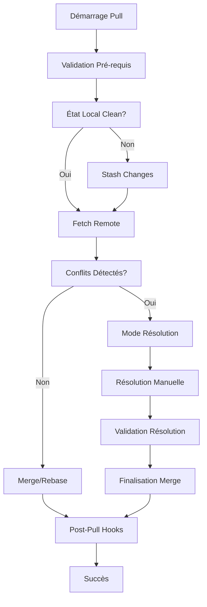
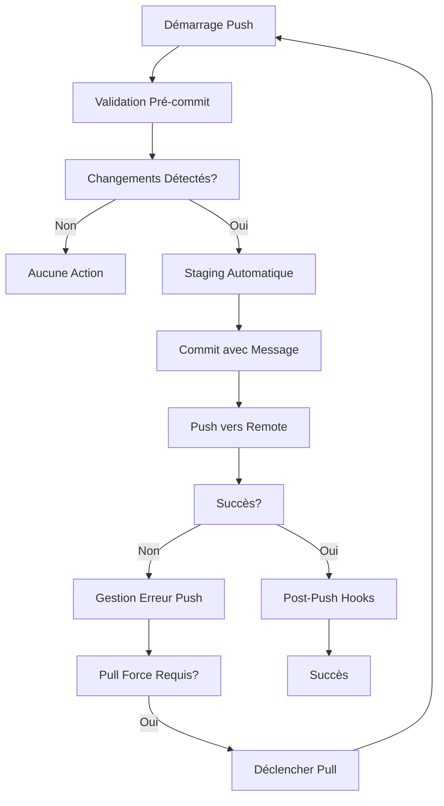

# Spécification Technique : sync-manager.ps1

## Objectifs et Philosophie

### Vision Générale
Le `sync-manager.ps1` est conçu comme un script de synchronisation unifié, moderne et robuste qui remplace l'approche fragmentée actuelle. Il respecte une philosophie de **Git comme Source Unique de Vérité (SSoT)** et implémente une **synchronisation bidirectionnelle contrôlée** avec une **gestion assistée des conflits**.

### Principes Directeurs

1. **Git comme SSoT** : Toutes les opérations de synchronisation s'appuient sur Git comme référentiel central de vérité
2. **Synchronisation Bidirectionnelle Contrôlée** : Support des opérations `pull` et `push` avec validation préalable
3. **Gestion Assistée des Conflits** : Détection intelligente et guidance utilisateur pour la résolution
4. **Opérations Atomiques** : Garantie que chaque synchronisation est soit complète, soit annulée
5. **Agnosticisme Plateforme** : Fonctionnement optimal sur PowerShell Core (pwsh) multi-plateforme
6. **Observabilité** : Journalisation détaillée et reporting des opérations

## Interface de Commande

### Structure Générale
```powershell
.\sync-manager.ps1 -Action <ACTION> [PARAMÈTRES]
```

### Actions Principales

#### 1. Pull (Synchronisation Descendante)
```powershell
# Synchronisation standard
.\sync-manager.ps1 -Action Pull

# Avec validation préalable
.\sync-manager.ps1 -Action Pull -Validate

# Mode dry-run (simulation)
.\sync-manager.ps1 -Action Pull -DryRun

# Avec spécification de branche
.\sync-manager.ps1 -Action Pull -Branch "feature/sync-improvements"
```

#### 2. Push (Synchronisation Montante)
```powershell
# Push standard avec validation
.\sync-manager.ps1 -Action Push

# Push forcé (avec précautions)
.\sync-manager.ps1 -Action Push -Force

# Push avec message de commit personnalisé
.\sync-manager.ps1 -Action Push -CommitMessage "Sync: $(Get-Date -Format 'yyyy-MM-dd HH:mm')"
```

#### 3. Status (Vérification d'État)
```powershell
# Vérification complète
.\sync-manager.ps1 -Action Status

# Vérification rapide
.\sync-manager.ps1 -Action Status -Quick

# Export vers JSON
.\sync-manager.ps1 -Action Status -OutputFormat JSON -OutputPath "sync-status.json"
```

#### 4. Resolve (Résolution de Conflits)
```powershell
# Mode interactif de résolution
.\sync-manager.ps1 -Action Resolve

# Résolution automatique selon stratégie
.\sync-manager.ps1 -Action Resolve -Strategy "AcceptRemote" | "AcceptLocal" | "Manual"
```

#### 5. Configure (Gestion de Configuration)
```powershell
# Initialisation de la configuration
.\sync-manager.ps1 -Action Configure -Init

# Validation de la configuration
.\sync-manager.ps1 -Action Configure -Validate

# Affichage de la configuration actuelle
.\sync-manager.ps1 -Action Configure -Show
```

### Paramètres Communs

| Paramètre | Type | Description |
|-----------|------|-------------|
| `-ConfigPath` | String | Chemin vers le fichier de configuration (défaut: `sync-config.json`) |
| `-LogLevel` | String | Niveau de journalisation (`DEBUG`, `INFO`, `WARN`, `ERROR`) |
| `-LogPath` | String | Chemin du fichier de log (défaut: `logs/sync-manager.log`) |
| `-Quiet` | Switch | Mode silencieux (sortie minimale) |
| `-Verbose` | Switch | Mode verbose (sortie détaillée) |
| `-WhatIf` | Switch | Mode simulation sans exécution |

## Workflows Détaillés

### Workflow Pull



#### Étapes Détaillées

1. **Validation des Pré-requis**
   - Vérification de l'existence du dépôt Git
   - Validation de la configuration
   - Contrôle des permissions

2. **Évaluation de l'État Local**
   - Détection des modifications non commitées
   - Stash automatique si nécessaire avec étiquetage temporel

3. **Synchronisation Remote**
   - `git fetch origin` avec gestion des erreurs réseau
   - Comparaison des SHA pour détecter les changements

4. **Gestion des Conflits**
   - Analyse des différences fichier par fichier
   - Classification des conflits (contenu, renommage, suppression)
   - Proposition de stratégies de résolution

5. **Finalisation**
   - Exécution des hooks post-pull configurés
   - Nettoyage des stash temporaires
   - Génération du rapport de synchronisation

### Workflow Push



#### Étapes Détaillées

1. **Validation Pré-commit**
   - Vérification de la qualité du code (si configuré)
   - Validation des formats de fichiers
   - Contrôle des chemins et noms de fichiers

2. **Préparation du Commit**
   - Staging intelligent basé sur la configuration
   - Génération automatique du message de commit
   - Validation des métadonnées

3. **Push Sécurisé**
   - Tentative de push avec gestion des rejets
   - Détection des conflits upstream
   - Retry automatique avec pull si nécessaire

### Workflow Status

1. **Collecte des Informations**
   - État du working directory
   - Comparaison avec l'upstream branch
   - Analyse des conflits en cours

2. **Génération du Rapport**
   - Synthèse textuelle pour l'utilisateur
   - Export JSON pour l'intégration système
   - Métriques de performance

## Gestion des Conflits

### Stratégie de Détection

Le script implémente une **détection multi-niveaux des conflits** :

1. **Conflits Git Natifs** : Détectés via `git status --porcelain`
2. **Conflits Sémantiques** : Analyse des patterns de modification
3. **Conflits de Configuration** : Validation de la cohérence des configurations

### Modes de Résolution

#### 1. Mode Interactif (Défaut)
```powershell
# Interface en ligne de commande guidée
Write-Host "Conflit détecté dans : $FilePath" -ForegroundColor Yellow
Write-Host "1. Accepter la version locale"
Write-Host "2. Accepter la version distante" 
Write-Host "3. Éditer manuellement"
Write-Host "4. Ignorer ce fichier"
$choice = Read-Host "Votre choix (1-4)"
```

#### 2. Mode Automatique
- **AcceptLocal** : Priorité aux modifications locales
- **AcceptRemote** : Priorité aux modifications distantes
- **Strategy-Based** : Application de règles prédéfinies

#### 3. Mode Assisté
- Analyse du contexte des modifications
- Suggestions basées sur l'historique
- Validation sémantique des résolutions

### Gestion des Conflits Complexes

```powershell
# Structure de données pour tracking des conflits
$ConflictContext = @{
    FilePath = $FilePath
    ConflictType = "Content|Rename|Delete|Binary"
    LocalVersion = @{
        SHA = $LocalSHA
        Timestamp = $LocalTime
        Author = $LocalAuthor
    }
    RemoteVersion = @{
        SHA = $RemoteSHA
        Timestamp = $RemoteTime
        Author = $RemoteAuthor
    }
    Resolution = @{
        Strategy = "Manual|Auto|Assisted"
        Result = "Resolved|Pending|Skipped"
        Details = $ResolutionDetails
    }
}
```

## Configuration

### Fichier de Configuration Principal : `sync-config.json`

```json
{
  "version": "1.0",
  "metadata": {
    "created": "2025-01-20T10:00:00Z",
    "updated": "2025-01-20T10:00:00Z",
    "schema": "sync-manager-config-v1"
  },
  "git": {
    "remote": {
      "name": "origin",
      "url": null,
      "authentication": {
        "method": "token|ssh|credentials",
        "tokenPath": "${env:GITHUB_TOKEN_PATH}"
      }
    },
    "branches": {
      "default": "main",
      "protected": ["main", "master", "production"],
      "autoCreate": true
    },
    "operations": {
      "autoStash": true,
      "autoCommit": true,
      "commitMessageTemplate": "Sync: ${timestamp} - ${changesSummary}",
      "pushStrategy": "simple|matching",
      "pullStrategy": "merge|rebase"
    }
  },
  "conflict": {
    "resolution": {
      "defaultStrategy": "interactive",
      "autoResolution": {
        "enabled": false,
        "rules": [
          {
            "pattern": "*.log",
            "strategy": "acceptLocal"
          },
          {
            "pattern": "config/*.json",
            "strategy": "manual"
          }
        ]
      },
      "backupBeforeResolve": true
    }
  },
  "hooks": {
    "prePull": [
      {
        "name": "backup-critical-files",
        "command": "powershell -c \"Copy-Item config/critical.json config/critical.json.bak\"",
        "continueOnError": false
      }
    ],
    "postPull": [
      {
        "name": "restart-services",
        "command": "powershell -c \"Restart-Service MyService\"",
        "continueOnError": true
      }
    ],
    "prePush": [
      {
        "name": "run-tests",
        "command": "powershell -c \"Invoke-Pester tests/\"",
        "continueOnError": false
      }
    ],
    "postPush": [
      {
        "name": "notify-team",
        "command": "powershell -c \"Send-Notification 'Sync completed'\"",
        "continueOnError": true
      }
    ]
  },
  "logging": {
    "level": "INFO",
    "file": {
      "enabled": true,
      "path": "logs/sync-manager.log",
      "maxSize": "10MB",
      "retention": 30
    },
    "console": {
      "enabled": true,
      "colorized": true
    }
  },
  "performance": {
    "timeout": {
      "pull": 300,
      "push": 180,
      "resolve": 600
    },
    "parallel": {
      "enabled": false,
      "maxJobs": 4
    }
  },
  "security": {
    "allowedPaths": [
      "**",
      "!**/.env",
      "!**/secrets/**"
    ],
    "verification": {
      "signatures": false,
      "checksums": false
    }
  }
}
```

### Configuration Environnementale

```powershell
# Variables d'environnement supportées
$env:SYNC_CONFIG_PATH = "custom-sync-config.json"
$env:SYNC_LOG_LEVEL = "DEBUG"
$env:SYNC_DRY_RUN = "true"
$env:GITHUB_TOKEN = "ghp_xxxxxxxxxxxx"
$env:SYNC_HOOKS_DISABLED = "true"
```

### Validation de Configuration

```powershell
function Test-SyncConfiguration {
    param(
        [string]$ConfigPath = "sync-config.json"
    )
    
    # Validation du schéma JSON
    $schema = Get-Content "schemas/sync-config-schema.json" | ConvertFrom-Json
    
    # Tests de connectivité
    Test-GitRemoteConnection
    
    # Validation des hooks
    Test-HookCommands
    
    # Vérification des permissions
    Test-PathPermissions
}
```

## Portabilité

### Cibles Supportées

1. **Windows** (PowerShell 5.1 et PowerShell Core 7+)
2. **Linux** (PowerShell Core 7+)
3. **macOS** (PowerShell Core 7+)

### Stratégies de Portabilité

#### 1. Détection d'Environnement
```powershell
function Get-PlatformInfo {
    $platform = @{
        OS = if ($IsWindows) { "Windows" } 
             elseif ($IsLinux) { "Linux" } 
             elseif ($IsMacOS) { "macOS" } 
             else { "Unknown" }
        PSVersion = $PSVersionTable.PSVersion
        Architecture = [System.Runtime.InteropServices.RuntimeInformation]::ProcessArchitecture
        Shell = if ($env:SHELL) { Split-Path $env:SHELL -Leaf } else { "powershell" }
    }
    return $platform
}
```

#### 2. Gestion des Chemins
```powershell
function Resolve-CrossPlatformPath {
    param([string]$Path)
    
    # Normalisation des séparateurs
    $normalizedPath = $Path -replace '[/\\]', [System.IO.Path]::DirectorySeparatorChar
    
    # Résolution des variables d'environnement cross-platform
    $resolvedPath = [System.Environment]::ExpandEnvironmentVariables($normalizedPath)
    
    return $resolvedPath
}
```

#### 3. Commandes Git Universelles
```powershell
function Invoke-GitCommand {
    param(
        [string]$Arguments,
        [string]$WorkingDirectory = (Get-Location)
    )
    
    $gitExe = if (Get-Command git -ErrorAction SilentlyContinue) {
        "git"
    } else {
        throw "Git n'est pas installé ou accessible dans le PATH"
    }
    
    $processInfo = @{
        FileName = $gitExe
        Arguments = $Arguments
        WorkingDirectory = $WorkingDirectory
        UseShellExecute = $false
        RedirectStandardOutput = $true
        RedirectStandardError = $true
    }
    
    return Start-Process @processInfo -Wait -PassThru
}
```

#### 4. Gestion des Permissions
```powershell
function Test-PathPermissions {
    param([string]$Path)
    
    if ($IsWindows) {
        # Utilisation des ACL Windows
        $acl = Get-Acl $Path
        return $acl.Access | Where-Object { $_.FileSystemRights -match "Write|FullControl" }
    } else {
        # Utilisation des permissions Unix
        $permissions = stat -c "%a" $Path 2>/dev/null
        return $permissions -match "[2367]"
    }
}
```

### Précautions Spécifiques

1. **Encodage des Fichiers** : UTF-8 sans BOM par défaut
2. **Caractères Spéciaux** : Validation et échappement des noms de fichiers
3. **Longueur des Chemins** : Gestion des limites Windows (260 caractères)
4. **Sécurité** : Validation des chemins pour prévenir les attaques de traversée

## Architecture Technique

### Structure Modulaire

```
sync-manager.ps1
├── Core/
│   ├── SyncEngine.psm1          # Moteur principal
│   ├── GitOperations.psm1       # Opérations Git
│   ├── ConflictResolver.psm1    # Gestion des conflits
│   └── ConfigManager.psm1       # Gestion de configuration
├── Utils/
│   ├── Logger.psm1              # Système de journalisation
│   ├── Validator.psm1           # Validations
│   └── CrossPlatform.psm1       # Utilitaires multi-plateforme
└── Hooks/
    ├── PrePull.ps1              # Hooks pré-pull
    ├── PostPull.ps1             # Hooks post-pull
    ├── PrePush.ps1              # Hooks pré-push
    └── PostPush.ps1             # Hooks post-push
```

### Interfaces et Contrats

```powershell
# Interface principale du moteur de synchronisation
interface ISyncEngine {
    [SyncResult] Pull([SyncOptions]$options)
    [SyncResult] Push([SyncOptions]$options)
    [StatusResult] GetStatus()
    [ConflictResult] ResolveConflicts([ResolutionStrategy]$strategy)
}

# Contrat de résultat d'opération
class SyncResult {
    [bool]$Success
    [string]$Message
    [TimeSpan]$Duration
    [hashtable]$Metadata
    [array]$Errors
    [array]$Warnings
}
```

## Métriques et Observabilité

### Journalisation Structurée

```json
{
  "timestamp": "2025-01-20T10:30:00Z",
  "level": "INFO",
  "operation": "pull",
  "duration": 15.5,
  "result": "success",
  "details": {
    "filesChanged": 5,
    "conflicts": 0,
    "remoteCommits": 3
  },
  "metadata": {
    "branch": "main",
    "user": "roo-sync",
    "platform": "Windows"
  }
}
```

### Métriques de Performance

- **Temps de Synchronisation** : Durée totale des opérations
- **Taux de Conflits** : Pourcentage de synchronisations avec conflits
- **Efficacité de Résolution** : Temps moyen de résolution des conflits
- **Fiabilité** : Taux de succès des opérations

## Sécurité

### Authentification
- Support des tokens GitHub/GitLab
- Intégration SSH avec gestion des clés
- Credentials Manager Windows/macOS/Linux

### Validation des Données
- Vérification de l'intégrité des fichiers
- Validation des signatures Git (optionnel)
- Contrôle des chemins et noms de fichiers

### Audit et Traçabilité
- Log complet de toutes les opérations
- Historique des résolutions de conflits
- Tracking des modifications de configuration

---

*Document généré le : $(Get-Date -Format "yyyy-MM-dd HH:mm:ss")*
*Version : 1.0*
*Auteur : Roo Architect Complex*