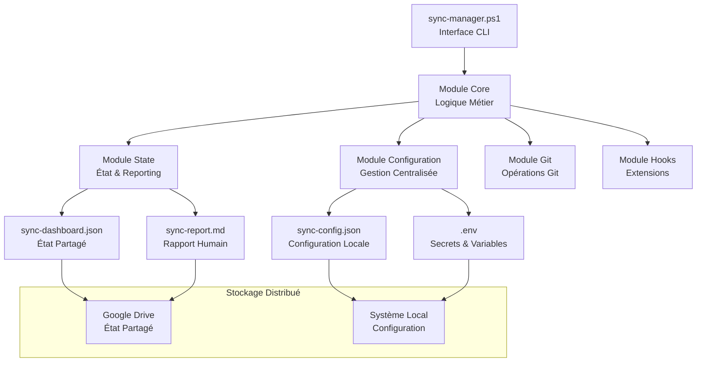
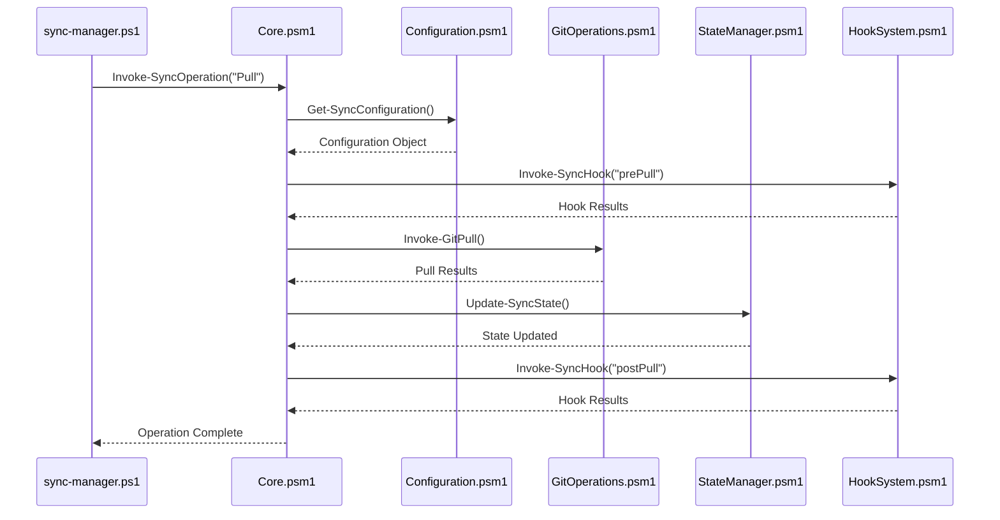
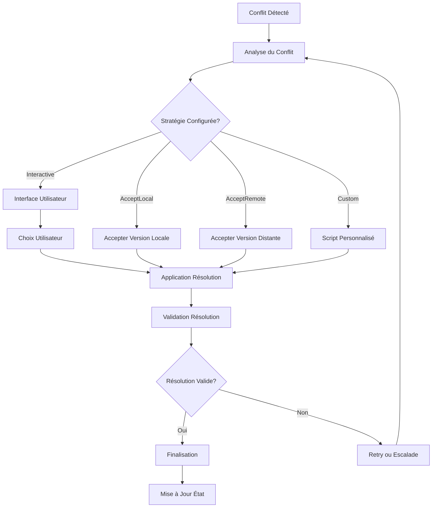
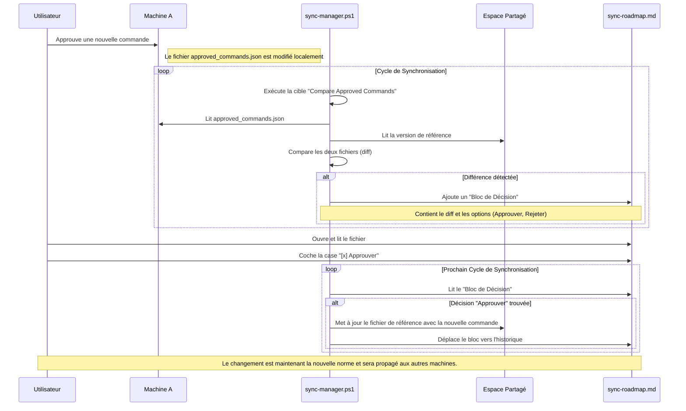
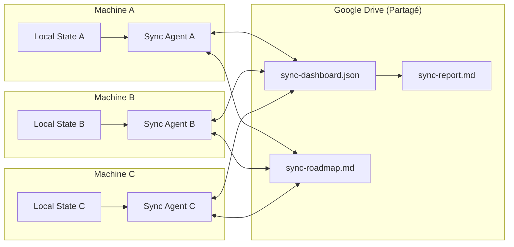
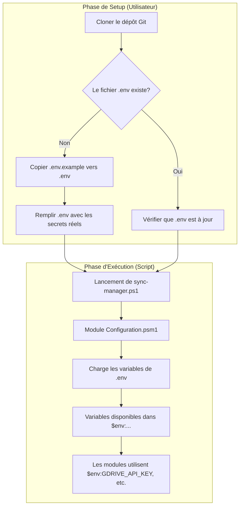

# Architecture Technique : Système de Synchronisation Unifié

**Projet :** roo-extensions  
**Framework :** SDDD (Semantic-Driven Design and Development)  
**Date :** 28 juillet 2025  
**Version :** 1.0  
**Basé sur :** [01-sync-manager-specification.md](./01-sync-manager-specification.md) et [RAPPORT-MISSION-SYNC-MANAGER.md](./RAPPORT-MISSION-SYNC-MANAGER.md)

---

## 📄 Résumé Exécutif

Ce document définit l'architecture technique du **Système de Synchronisation Unifié**, un projet visant à remplacer les scripts de synchronisation hétérogènes par une solution centralisée, modulaire et robuste en PowerShell. L'architecture s'articule autour d'un script orchestrateur, `sync-manager.ps1`, qui s'appuie sur une configuration déclarative au format JSON (`sync-config.json`) et un système d'état partagé (`sync-dashboard.json`) pour coordonner les opérations sur plusieurs machines.

Les principes directeurs sont la **modularité**, la **configuration en tant que code**, l'**observabilité** et la **résilience**. Le système est conçu pour être extensible via un mécanisme de hooks et sécurisé par une gestion rigoureuse des secrets via des fichiers `.env`. L'objectif est de fournir une solution fiable, maintenable et scalable pour la synchronisation de dépôts Git et d'autres ressources critiques.

---

## 🎯 Vue d'Ensemble de l'Architecture

### Vision Architecturale

Le système de synchronisation unifié repose sur une **architecture modulaire en couches** avec une **configuration centralisée** et un **état partagé distribué**. L'architecture respecte les principes SOLID et implémente une séparation claire des responsabilités.



### Principes Architecturaux

1. **Modularité** : Chaque module a une responsabilité unique, ce qui isole les défaillances, simplifie les tests et permet des mises à jour indépendantes sans impacter le reste du système.
2. **Configuration as Code** : En définissant le comportement dans un fichier versionnable (`sync-config.json`), nous garantissons la reproductibilité, la traçabilité des changements et la capacité à gérer des configurations complexes de manière déclarative.
3. **État Distribué** : Le `sync-dashboard.json` partagé permet au système de prendre des décisions globales basées sur l'état de l'ensemble du parc, prévenant les actions conflictuelles entre machines.
4. **Extensibilité** : Le système de hooks offre des points d'entrée définis pour injecter des logiques spécifiques à un environnement (ex: lancer un build sur une machine d'intégration) sans modifier le cœur du `sync-manager`.
5. **Observabilité** : La combinaison des rapports, du tableau de bord et des logs structurés fournit des niveaux de visibilité adaptés à chaque besoin, de la supervision rapide par un humain à l'analyse forensique détaillée par une machine.
6. **Résilience** : Des mécanismes comme les stratégies de résolution de conflits, les tentatives automatiques et les mises à jour atomiques de l'état sont intégrés pour que le système puisse survivre à des pannes partielles (réseau, disque) et des erreurs opérationnelles.

---

## 🏗️ Architecture Modulaire Détaillée

### Structure des Modules

```
sync-manager/
├── sync-manager.ps1              # Script principal (orchestrateur)
├── modules/                      # Modules PowerShell
│   ├── Core.psm1                 # Logique métier centrale
│   ├── Configuration.psm1        # Gestion de configuration
│   ├── GitOperations.psm1        # Opérations Git spécialisées
│   ├── StateManager.psm1         # Gestion d'état distribué
│   ├── ConflictResolver.psm1     # Résolution de conflits
│   ├── HookSystem.psm1           # Système d'extensions
│   ├── Logger.psm1               # Logging structuré
│   └── Utils.psm1                # Utilitaires communs
├── config/                       # Configuration
│   ├── sync-config.json          # Configuration principale
│   ├── sync-config.schema.json   # Schéma de validation
│   └── .env                      # Variables d'environnement
├── shared/                       # État partagé (Google Drive)
│   ├── sync-dashboard.json       # État machine-readable
│   ├── sync-report.md            # Rapport human-readable
│   └── sync-roadmap.md           # Feuille de route et décisions
└── logs/                         # Journalisation
    └── sync-manager.log
```

### 1. Module Core (Core.psm1)

**Responsabilité :** Orchestration principale et logique métier

```powershell
# Fonctions principales
function Invoke-SyncOperation {
    param(
        [ValidateSet('Pull', 'Push', 'Status', 'Resolve', 'Configure')]
        [string]$Action,
        [hashtable]$Parameters
    )
}

function Initialize-SyncManager {
    # Initialisation du système de synchronisation
}

function Test-SyncPrerequisites {
    # Validation des prérequis système
}
```

**Interface :**
- `Invoke-SyncOperation` : Point d'entrée pour toutes les opérations
- `Initialize-SyncManager` : Initialisation du système
- `Test-SyncPrerequisites` : Validation environnement

**Justification et Résilience :** Le module Core est le chef d'orchestre. En centralisant la logique de haut niveau, il s'assure que les opérations se déroulent dans le bon ordre (ex: `prePull` hooks avant `pull`), garantissant un processus prédictible et robuste.

### 2. Module Configuration (Configuration.psm1)

**Responsabilité :** Gestion centralisée de la configuration

```powershell
# Fonctions de configuration
function Get-SyncConfiguration {
    param([string]$ConfigPath = "config/sync-config.json")
}

function Set-SyncConfiguration {
    param([hashtable]$Configuration, [string]$ConfigPath)
}

function Test-ConfigurationSchema {
    param([string]$ConfigPath, [string]$SchemaPath)
}

function Resolve-EnvironmentVariables {
    param([string]$EnvPath = "config/.env")
}
```

**Fonctionnalités :**
- Chargement et validation de `sync-config.json`
- Résolution des variables d'environnement depuis `.env`
- Validation par schéma JSON
- Fusion de configurations machine-spécifiques

**Justification et Résilience :** Ce module est la clé de la gestion des environnements hétérogènes. En chargeant une configuration de base et en la fusionnant avec des surcharges spécifiques à une machine (`machineOverrides`), il permet de gérer un parc entier avec un seul fichier de configuration, tout en autorisant des exceptions (ex: chemins de fichiers différents, niveaux de log spécifiques) de manière contrôlée et explicite. La validation par schéma JSON dès le chargement (`Test-ConfigurationSchema`) est une sécurité fondamentale : elle bloque toute opération basée sur une configuration malformée, prévenant des comportements indéfinis et potentiellement destructeurs.

### 3. Module GitOperations (GitOperations.psm1)

**Responsabilité :** Opérations Git spécialisées et optimisées

```powershell
# Opérations Git atomiques
function Invoke-GitPull {
    param([string]$Repository, [string]$Branch, [hashtable]$Options)
}

function Invoke-GitPush {
    param([string]$Repository, [string]$CommitMessage, [hashtable]$Options)
}

function Get-GitStatus {
    param([string]$Repository, [switch]$Detailed)
}

function Resolve-GitConflict {
    param([string]$Repository, [string]$Strategy, [string[]]$Files)
}
```

### 4. Module StateManager (StateManager.psm1)

**Responsabilité :** Gestion de l'état distribué et reporting

```powershell
# Gestion d'état
function Get-SyncState {
    param([string]$StatePath = "shared/sync-dashboard.json")
}

function Update-SyncState {
    param([hashtable]$StateUpdate, [string]$StatePath)
}

function Sync-SharedState {
    param([string]$GoogleDrivePath, [string]$LocalPath)
}

function Export-SyncReport {
    param([hashtable]$SyncData, [string]$OutputPath = "shared/sync-report.md")
}
```

**Justification et Résilience :** La synchronisation de l'état est l'opération la plus sensible. L'utilisation de timestamps et de hachage prévient les écrasements accidentels ("race conditions"). La stratégie de `Merge-States`, qui pourrait être implémentée dans `Update-SyncState`, est particulièrement importante pour la résilience : si deux machines, déconnectées du réseau, mettent à jour des parties *différentes* du tableau de bord, la synchronisation suivante fusionnera intelligemment les deux changements au lieu de simplement garder la version la plus récente qui aurait écrasé une des deux modifications. La mise à jour atomique (écriture dans un fichier temporaire puis renommage) garantit qu'une coupure de courant ou une erreur réseau ne laissera jamais un fichier d'état corrompu sur le disque partagé.
### 5. Module ConflictResolver (ConflictResolver.psm1)

**Responsabilité :** Résolution intelligente des conflits

```powershell
# Résolution de conflits
function Get-ConflictAnalysis {
    param([string]$Repository, [string[]]$ConflictFiles)
}

function Invoke-ConflictResolution {
    param([string]$Strategy, [hashtable]$ConflictData)
}

function Show-InteractiveConflictResolver {
    param([hashtable]$ConflictData)
}
```

### 6. Module HookSystem (HookSystem.psm1)

**Responsabilité :** Système d'extensions par hooks

```powershell
# Système de hooks
function Invoke-SyncHook {
    param([string]$HookType, [hashtable]$Context, [string[]]$HookScripts)
}

function Register-SyncHook {
    param([string]$HookType, [string]$ScriptPath)
}

function Get-AvailableHooks {
    param([string]$HookType)
}
```

---

## 📋 Configuration Centralisée

### Schéma sync-config.json (Étendu)

```json
{
  "$schema": "./sync-config.schema.json",
  "version": "1.0",
  "metadata": {
    "created": "2025-07-28T10:00:00Z",
    "lastModified": "2025-07-28T10:00:00Z",
    "description": "Configuration unifiée de synchronisation"
  },
  "syncTargets": [
    {
      "name": "roo-extensions-main",
      "type": "git",
      "localPath": ".",
      "remotePath": "origin",
      "branch": "main",
      "conflictStrategy": "interactive",
      "hooks": {
        "prePull": ["hooks/validate-environment.ps1"],
        "postPull": ["hooks/update-dependencies.ps1"],
        "prePush": ["hooks/run-tests.ps1"],
        "postPush": ["hooks/notify-team.ps1"]
      },
      "filters": {
        "include": ["**/*.ps1", "**/*.md", "**/*.json"],
        "exclude": ["**/logs/**", "**/.temp/**"]
      }
    }
  ],
  "globalSettings": {
    "git": {
      "defaultRemote": "origin",
      "autoStash": true,
      "stashMessage": "auto-stash-{timestamp}",
      "mergeStrategy": "merge",
      "pushStrategy": "simple"
    },
    "conflictResolution": {
      "defaultStrategy": "interactive",
      "timeout": 300,
      "autoRetry": {
        "enabled": true,
        "maxAttempts": 3,
        "backoffSeconds": [5, 15, 30]
      }
    },
    "state": {
      "sharedLocation": {
        "type": "googledrive",
        "path": "/sync-manager/shared",
        "syncInterval": 60
      },
      "localCache": {
        "enabled": true,
        "maxAge": 3600,
        "path": "cache/sync-state.json"
      }
    },
    "logging": {
      "level": "INFO",
      "structured": true,
      "outputs": [
        {
          "type": "file",
          "path": "logs/sync-manager.log",
          "format": "json",
          "rotation": {
            "enabled": true,
            "maxSize": "10MB",
            "maxFiles": 5
          }
        },
        {
          "type": "console",
          "format": "human",
          "colors": true
        }
      ]
    },
    "performance": {
      "parallelOperations": 3,
      "timeouts": {
        "gitFetch": 300,
        "gitPush": 180,
        "stateSync": 60
      },
      "caching": {
        "gitStatus": 30,
        "remoteState": 120
      }
    }
  },
  "machineOverrides": {
    "conditions": [
      {
        "when": { "hostname": "DEV-MACHINE-01" },
        "override": {
          "globalSettings.logging.level": "DEBUG",
          "syncTargets[0].conflictStrategy": "acceptLocal"
        }
      }
    ]
  },
  "validation": {
    "schemas": {
      "config": "./sync-config.schema.json",
      "state": "./sync-dashboard.schema.json"
    },
    "hooks": {
      "validateOnLoad": true,
      "validateOnSave": true
    }
  }
}
```

#### Note sur la Résilience via `machineOverrides`

La section `machineOverrides` est fondamentale pour la flexibilité du système. Elle permet de gérer des cas où un sous-ensemble de machines requiert une configuration divergente sans avoir à maintenir des fichiers `sync-config.json` entièrement séparés.

**Exemple de cas d'usage :**
*   **Chemins différents :** Un projet est dans `C:\dev\` sur une machine et `/home/user/dev` sur une autre. Un `override` peut ajuster le `localPath` de la `syncTarget` concernée.
*   **Comportement de test :** Sur les machines de build, la stratégie de conflit peut être forcée à `acceptLocal` pour éviter toute interaction humaine.
*   **Ressources limitées :** Sur un Raspberry Pi, les `parallelOperations` peuvent être réduites à `1` pour ne pas surcharger le système.

Cette approche centralise la gestion des exceptions et rend la configuration principale plus propre et plus lisible.

### Schéma de l'État Partagé (sync-dashboard.json)

```json
{
  "$schema": "./sync-dashboard.schema.json",
  "version": "1.0",
  "metadata": {
    "lastUpdated": "2025-07-28T10:15:00Z",
    "generatedBy": "sync-manager.ps1 v1.0",
    "totalMachines": 3
  },
  "machines": {
    "DEV-MACHINE-01": {
      "hostname": "DEV-MACHINE-01",
      "user": "developer",
      "lastSync": "2025-07-28T10:10:00Z",
      "status": "success",
      "syncTargets": {
        "roo-extensions-main": {
          "lastPull": "2025-07-28T10:05:00Z",
          "lastPush": "2025-07-28T09:30:00Z",
          "branch": "main",
          "commitHash": "abc123def456",
          "conflicts": [],
          "metrics": {
            "pullDuration": 12.5,
            "pushDuration": 8.2,
            "filesChanged": 5
          }
        }
      },
      "health": {
        "gitVersion": "2.41.0",
        "powershellVersion": "7.3.4",
        "diskSpace": "85%",
        "networkLatency": 45
      }
    }
  },
  "aggregated": {
    "totalSyncs": 156,
    "successRate": 0.987,
    "averageSyncTime": 10.2,
    "lastGlobalSync": "2025-07-28T10:15:00Z",
    "conflicts": {
      "total": 3,
      "resolved": 3,
      "pending": 0
    }
  },
  "alerts": [
    {
      "type": "warning",
      "message": "Machine PROD-SERVER-02 non synchronisée depuis 6h",
      "timestamp": "2025-07-28T04:00:00Z",
      "severity": "medium"
    }
  ]
}
```

---

## 🔄 Flux Architecturaux Détaillés

### Flux de Synchronisation Pull



### Flux de Gestion des Conflits



---

## 📖 Scénarios d'Usage Avancés

Cette section illustre, à travers des cas d'usage concrets, comment l'architecture répond à des problématiques complexes et hétérogènes.

### Scénario 1 : Synchronisation des Commandes Roo Approuvées

**Problématique :** Chaque environnement Roo peut avoir une liste de commandes terminal auto-approuvées. Maintenir la cohérence de ces listes à travers plusieurs machines (PC principal, laptop de travail, etc.) est complexe et source d'erreurs. Une nouvelle commande approuvée sur une machine doit être validée avant d'être propagée sur les autres.

**Solution Architecturale :** Le `sync-manager` transforme ce problème de synchronisation brute en un **flux de décision assisté**.

**Acteurs du Flux :**
*   **`sync-config.json`** : Définit un nouveau type de cible, `config-file`, qui pointe vers les fichiers de commandes approuvées de chaque machine et vers un fichier de référence.
*   **`sync-manager`** : Le moteur qui détecte les écarts.
*   **`sync-roadmap.md`** : L'interface de décision asynchrone.
*   **Opérateur Humain** : Le valideur final.

**Déroulement du Processus :**



**Bénéfices de cette approche :**

*   **Résilience :** Aucune modification n'est faite sans validation. Une approbation accidentelle sur une machine ne "pollue" pas l'ensemble du parc.
*   **Flexibilité :** L'opérateur peut valider les changements de manière asynchrone, sans être présent lors de la détection.
*   **Traçabilité :** La `sync-roadmap.md` conserve un historique clair de qui a approuvé quoi et quand.
*   **Extensibilité :** Ce modèle peut être appliqué à n'importe quel type de fichier de configuration critique (settings VSCode, configurations d'application, etc.), pas seulement les commandes Roo.

---

## 📖 Scénarios d'Usage Avancés

Cette section illustre, à travers des cas d'usage concrets, comment l'architecture répond à des problématiques complexes et hétérogènes.

### Scénario 1 : Synchronisation des Commandes Roo Approuvées

**Problématique :** Chaque environnement Roo peut avoir une liste de commandes terminal auto-approuvées. Maintenir la cohérence de ces listes à travers plusieurs machines (PC principal, laptop de travail, etc.) est complexe et source d'erreurs. Une nouvelle commande approuvée sur une machine doit être validée avant d'être propagée sur les autres.

**Solution Architecturale :** Le `sync-manager` transforme ce problème de synchronisation brute en un **flux de décision assisté**.

**Acteurs du Flux :**
*   **`sync-config.json`** : Définit un nouveau type de cible, `configFile`, qui pointe vers les fichiers de commandes approuvées de chaque machine et vers un fichier de référence.
*   **`sync-manager`** : Le moteur qui détecte les écarts.
*   **`sync-roadmap.md`** : L'interface de décision asynchrone.
*   **Opérateur Humain** : Le valideur final.

**Déroulement du Processus :**


**Bénéfices de cette approche :**

*   **Résilience :** Aucune modification n'est faite sans validation. Une approbation accidentelle sur une machine ne "pollue" pas l'ensemble du parc.
*   **Flexibilité :** L'opérateur peut valider les changements de manière asynchrone, sans être présent lors de la détection.
*   **Traçabilité :** La `sync-roadmap.md` conserve un historique clair de qui a approuvé quoi et quand.
*   **Extensibilité :** Ce modèle peut être appliqué à n'importe quel type de fichier de configuration critique (settings VSCode, configurations d'application, etc.), pas seulement les commandes Roo.

---

## 🌐 Gestion de l'État Distribué

### Architecture de Synchronisation d'État



### Mécanisme de Conflict Resolution d'État

1. **Détection de Conflits d'État**
   - Timestamps de dernière modification
   - Hachage de contenu pour validation
   - Versioning sémantique des modifications

2. **Stratégies de Résolution**
   - **Last-Writer-Wins** : Par défaut avec timestamp
   - **Merge-States** : Fusion intelligente des états non-conflictuels
   - **Manual-Review** : Escalade vers utilisateur pour états critiques

3. **Garanties de Cohérence**
   - Atomic Updates via fichiers temporaires
   - Rollback automatique en cas d'échec
   - Validation de schéma avant écriture

**Justification et Résilience :** La synchronisation de l'état est l'opération la plus sensible. L'utilisation de timestamps et de hachage prévient les écrasements accidentels ("race conditions"). La stratégie de `Merge-States` est particulièrement importante pour la résilience : si deux machines, déconnectées du réseau, mettent à jour des parties *différentes* du tableau de bord (ex: Machine A met à jour son statut, Machine B met à jour le sien), la synchronisation suivante fusionnera intelligemment les deux changements au lieu de simplement garder la version la plus récente qui aurait écrasé une des deux modifications.

---

## 🔐 Gestion des Secrets et Environnements

La gestion des informations sensibles (clés API, tokens, etc.) est cruciale pour la sécurité du système. L'approche retenue est simple, robuste et basée sur des standards éprouvés.

### Principe de Fonctionnement

1.  **Fichier `.env`** : Un fichier `.env` est placé à la racine du projet. Il contient les paires `CLE=VALEUR` pour toutes les variables d'environnement et secrets nécessaires.
2.  **Ignoré par Git** : Ce fichier `.env` est **obligatoirement** listé dans le fichier `.gitignore` pour ne **jamais** être commité dans le dépôt Git.
3.  **Modèle de Configuration** : Un fichier `.env.example` est, lui, commité dans le dépôt. Il sert de modèle et liste toutes les variables requises par le projet avec des valeurs factices.
4.  **Chargement au Démarrage** : Au lancement, le module `Configuration.psm1` est responsable de détecter, lire et charger les variables du fichier `.env` dans l'environnement du script en cours d'exécution. Les scripts PowerShell peuvent alors accéder à ces variables de manière sécurisée via `$env:NOM_DE_LA_VARIABLE`.

### Flux de Gestion des Secrets



Cette méthode assure que la configuration de l'environnement est découplée du code et que les secrets ne sont jamais exposés dans le contrôle de version, tout en rendant le projet facile à configurer pour un nouvel utilisateur ou sur une nouvelle machine.

---

## 📈 Observabilité : Tableau de Bord et Rapports

Un système robuste nécessite une excellente observabilité. Le `sync-manager` produit deux artefacts clés pour suivre l'état, la performance et la santé du processus de synchronisation sur l'ensemble du parc de machines.

### 1. Tableau de Bord d'État Partagé (`sync-dashboard.json`)

Le `sync-dashboard.json` est le **cerveau collectif** du système. C'est un fichier JSON structuré, stocké sur un service partagé (ex: Google Drive), qui agrège l'état de toutes les machines.

*   **Objectif** : Fournir une vue centralisée et *machine-readable* de l'état global. Permet aux scripts et aux machines de prendre des décisions informées basées sur l'état des autres.
*   **Contenu Clé** :
    *   État agrégé (nombre de cibles synchronisées, en conflit, en erreur).
    *   État détaillé pour chaque machine (dernière synchronisation, statut, détails par cible).
    *   Alertes globales (conflits non résolus, machines non vues depuis longtemps).
*   **Validation** : Sa structure est rigoureusement validée par le schéma [`config/sync-dashboard.schema.json`](../config/sync-dashboard.schema.json).
*   **Exemple Concret** : Un exemple détaillé est disponible ici : [`docs/examples/sync-dashboard.example.json`](../examples/sync-dashboard.example.json).

### 2. Rapport de Synchronisation (`sync-report.md`)

Le `sync-report.md` est le **visage humain** du système. C'est un rapport en Markdown, généré à la fin de chaque opération de synchronisation majeure.

*   **Objectif** : Fournir un résumé clair, concis et *human-readable* de la dernière opération. Destiné aux développeurs et aux administrateurs pour un diagnostic rapide.
*   **Contenu Clé** :
    *   Résumé de l'opération (statut global, durée).
    *   Détails par cible (changements, succès, erreurs).
    *   Journal séquentiel des événements importants.
*   **Exemple Concret** : Un exemple de rapport est disponible ici : [`docs/examples/sync-report.example.md`](../examples/sync-report.example.md).

### 3. Feuille de Route Partagée (`sync-roadmap.md`)

Le `sync-roadmap.md` est la **conscience collective et l'espace de dialogue** du système. Contrairement au `sync-dashboard.json` qui est un état instantané et au `sync-report.md` qui est un rapport d'une seule exécution, la feuille de route est un **document persistant et conversationnel**.

*   **Objectif** : Servir de journal de bord pour les décisions à prendre, les arbitrages en attente et les discussions entre les agents et l'opérateur humain. Il permet de gérer des problématiques qui ne peuvent être résolues automatiquement ou instantanément.
*   **Contenu Clé** :
    *   **Propositions de Synchronisation** : Blocs générés automatiquement lorsqu'un agent détecte un écart de configuration notable (ex: nouvelles commandes Roo à approuver).
    *   **Décisions Manuelles** : Sections où l'opérateur peut consigner des décisions (`[x] Approuver`, `[ ] Rejeter`) qui seront lues et appliquées par le `sync-manager`.
    *   **Historique des Alertes** : Un log des alertes importantes qui nécessitent un suivi.
    *   **Statut des Tâches de Fond** : Suivi des opérations longues ou complexes.
*   **Interaction** : Ce fichier est conçu pour être lu et écrit à la fois par les scripts (via des marqueurs et une structure de sections spécifique) et par les humains. Il forme un pont entre l'automatisation et la supervision.
*   **Exemple Concret** : Un exemple illustrant la structure et les cas d'usage est disponible ici : [`docs/examples/sync-roadmap.example.md`](../examples/sync-roadmap.example.md).

### 4. Journalisation Structurée (Logs)

En complément, chaque opération génère des logs structurés (JSON) qui peuvent être ingérés par des plateformes d'analyse de logs (ex: ELK, Splunk, Graylog).

*   **Objectif** : Permettre une analyse approfondie, la création de tableaux de bord de monitoring avancés et le débogage post-mortem.
*   **Contenu Clé** :
    *   Timestamp, niveau, composant, opération.
    *   Métriques de performance (durée, temps réseau/disque).
    *   Métadonnées contextuelles (hash de commit, cible, machine).

---

## 🚀 Patterns d'Implémentation

### Pattern Singleton pour Configuration

```powershell
# Dans Configuration.psm1
$Script:ConfigurationInstance = $null

function Get-SyncConfiguration {
    if ($null -eq $Script:ConfigurationInstance) {
        $Script:ConfigurationInstance = Initialize-Configuration
    }
    return $Script:ConfigurationInstance
}
```

### Pattern Strategy pour Résolution de Conflits

```powershell
# Dans ConflictResolver.psm1
$Script:ResolutionStrategies = @{
    'interactive' = { param($conflict) Show-InteractiveResolver $conflict }
    'acceptLocal' = { param($conflict) Accept-LocalVersion $conflict }
    'acceptRemote' = { param($conflict) Accept-RemoteVersion $conflict }
    'custom' = { param($conflict) Invoke-CustomResolver $conflict }
}

function Invoke-ConflictResolution {
    param([string]$Strategy, [object]$Conflict)
    
    $resolver = $Script:ResolutionStrategies[$Strategy]
    if ($resolver) {
        & $resolver $Conflict
    }
}
```

### Pattern Observer pour Hooks

```powershell
# Dans HookSystem.psm1
$Script:HookSubscribers = @{}

function Register-SyncHook {
    param([string]$EventType, [scriptblock]$Hook)
    
    if (-not $Script:HookSubscribers.ContainsKey($EventType)) {
        $Script:HookSubscribers[$EventType] = @()
    }
    $Script:HookSubscribers[$EventType] += $Hook
}

function Invoke-SyncHook {
    param([string]$EventType, [object]$Context)
    
    $hooks = $Script:HookSubscribers[$EventType]
    foreach ($hook in $hooks) {
        & $hook $Context
    }
}
```

---

## ✅ Validation et Tests

### Tests d'Architecture

1. **Tests de Charge de Configuration**
   - Validation avec configurations volumineuses
   - Test de performance du parsing JSON
   - Validation des overrides machine-spécifiques

2. **Tests de Résilience d'État**
   - Simulation de pannes réseau
   - Test de récupération après corruption
   - Validation de la cohérence distribuée

3. **Tests d'Intégration**
   - Intégration avec différentes versions de Git
   - Compatibilité PowerShell Core vs Windows PowerShell
   - Test multi-plateforme (Windows/Linux/macOS)

### Métriques de Qualité Architecturale

| Critère | Cible | Mesure |
|---------|-------|--------|
| Modularité | > 90% | Couplage faible entre modules |
| Testabilité | > 95% | Couverture de code |
| Performance | < 15s | Temps de sync moyen |
| Fiabilité | > 99% | Taux de succès des opérations |
| Maintenabilité | A+ | Complexité cyclomatique < 10 |

---

## 🔌 Écosystème et Intégrations Futures

Le `sync-manager` est conçu pour être le moteur robuste de la synchronisation. Cependant, pour faciliter son intégration dans un écosystème d'agents plus large et permettre un pilotage de haut niveau, une couche d'abstraction sera introduite via un **MCP (Model Context Protocol) dédié : `roo-state-manager`**.

### Vision : Le MCP comme Tour de Contrôle

Le `roo-state-manager` agira comme une **tour de contrôle** ou une API centralisée pour l'ensemble du système de synchronisation. Tandis que `sync-manager.ps1` est l'exécutant sur chaque machine, le MCP sera le point d'entrée unifié pour consulter l'état, prendre des décisions et, à terme, déclencher des actions de manière programmatique.

```mermaid
graph TD
    subgraph "Écosystème Roo"
        AgentA[Agent A]
        AgentB[Agent B]
        RooCLI[Interface Roo]
    end

    subgraph "MCP: roo-state-manager"
        MCP[Serveur MCP]
        MCP_API{API Haut Niveau}
        MCP_Access[Accès aux Fichiers d'État]
    end
    
    subgraph "Système de Synchronisation (sur chaque machine)"
        SyncManager[sync-manager.ps1]
        SharedDrive[(Espace Partagé)]
        Dashboard[sync-dashboard.json]
        Roadmap[sync-roadmap.md]
    end
    
    AgentA --> MCP_API
    AgentB --> MCP_API
    RooCLI --> MCP_API

    MCP_API --> MCP_Access
    MCP_Access --> SharedDrive
    
    SharedDrive -- contient -- Dashboard
    SharedDrive -- contient -- Roadmap
    
    SyncManager -- lit/écrit --> SharedDrive
    
    MCP_API -- peut déclencher (futur) --> SyncManager
```

### Responsabilités Futures du MCP

Le développement du MCP n'est pas dans le périmètre initial, mais l'architecture du `sync-manager` est conçue pour supporter ces interactions futures.

1.  **Consultation d'État :**
    *   **Outil :** `get_sync_status`
    *   **Description :** Permet d'interroger l'état de synchronisation d'une ou plusieurs machines en parsant le `sync-dashboard.json`.
    *   **Exemple :** `use_mcp_tool -server roo-state-manager -tool get_sync_status -args '{"machine": "WORK-LAPTOP"}'`

2.  **Gestion de la Feuille de Route :**
    *   **Outil :** `get_pending_decisions` : Lit la `sync-roadmap.md` et retourne les blocs de décision en attente au format JSON.
    *   **Outil :** `submit_decision` : Permet de répondre à une décision. Met à jour la `sync-roadmap.md` en cochant la case appropriée et en ajoutant un commentaire.
    *   **Exemple :** `use_mcp_tool -server roo-state-manager -tool submit_decision -args '{"id": "roo-commands-sync-20250729-1", "choice": "Approve", "comment": "Validé par l'admin."}'`

3.  **Déclenchement d'Actions (Vision à long terme) :**
    *   **Outil :** `trigger_sync_operation`
    *   **Description :** Enverrait une instruction au `sync-manager` sur une machine cible pour qu'il exécute une action spécifique (pull, push, etc.). Ceci nécessiterait un "listener" sur chaque machine.

Cette approche découple l'intelligence de bas niveau (la synchronisation elle-même) de la logique de pilotage de haut niveau, ouvrant la voie à des automatisations plus complexes et à une intégration transparente avec d'autres outils de l'écosystème Roo.

---

## Conclusion et Prochaines Étapes

Cette architecture technique fournit un plan directeur complet pour le développement du **Système de Synchronisation Unifié**. En adoptant une approche modulaire, pilotée par la configuration et axée sur l'observabilité, nous posons les bases d'une solution à la fois robuste, flexible et maintenable. Les choix architecturaux, tels que la séparation des modules, la validation par schémas et la gestion centralisée de l'état, visent à minimiser la complexité et à maximiser la fiabilité.

Les prochaines étapes pour la mise en œuvre de ce projet sont les suivantes :

1.  **Implémentation du "PoC" (Proof of Concept)** : Développer un premier prototype fonctionnel incluant les modules `Core`, `Configuration` et `GitOperations` pour valider les interactions fondamentales.
2.  **Développement des Modules** : Implémenter séquentiellement les autres modules (`StateManager`, `ConflictResolver`, `HookSystem`) en suivant les interfaces définies dans ce document.
3.  **Mise en Place de l'Intégration Continue** : Créer un pipeline de CI/CD pour automatiser les tests (unitaires, intégration) et le déploiement des modules.
4.  **Rédaction de la Documentation Utilisateur** : Produire des guides pour l'installation, la configuration et l'utilisation quotidienne du `sync-manager`.
5.  **Phase de Test Bêta** : Déployer le système sur un parc de machines limité pour recueillir des retours et identifier les problèmes en conditions réelles.

Ce document servira de référence tout au long du cycle de vie du projet, garantissant que le développement reste aligné avec la vision architecturale initiale.