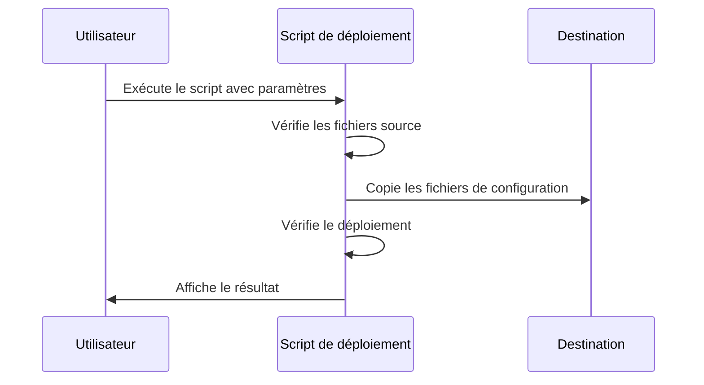

# Documentation de la structure de configuration Roo

## Introduction

Ce document présente la nouvelle structure de configuration de Roo, mise en place suite à une restructuration des répertoires. Cette restructuration vise à mieux organiser les différents types de configurations et à simplifier leur gestion et leur déploiement.

## Nouvelle structure des répertoires

La configuration de Roo est désormais organisée en deux répertoires distincts :

1. **roo-modes** : Contient les configurations spécifiques aux modes personnalisés
2. **roo-settings** : Contient les configurations générales de Roo

Cette séparation permet une meilleure organisation et une gestion plus claire des différents aspects de la configuration.

```
roo-extensions/
├── roo-modes/               # Configurations des modes personnalisés
│   ├── modes/               # Fichiers de configuration des modes
│   │   └── standard-modes.json
│   ├── deploy-modes.ps1     # Script de déploiement des modes
│   └── README.md            # Documentation des modes
│
└── roo-settings/            # Configurations générales
    ├── settings.json        # Fichier de configuration générale
    ├── deploy-settings.ps1  # Script de déploiement des paramètres
    └── README.md            # Documentation des paramètres généraux
```

## Types de configurations

### 1. Configurations des modes (roo-modes)

Les configurations des modes définissent les modes personnalisés disponibles dans Roo, leurs propriétés et comportements. Ces configurations peuvent être déployées :

- **Globalement** : Pour toutes les instances de VS Code
  - Emplacement : `%APPDATA%\Code\User\globalStorage\rooveterinaryinc.roo-cline\settings\custom_modes.json`
  
- **Localement** : Pour un projet spécifique
  - Emplacement : `.roomodes` à la racine du projet

### 2. Configurations générales (roo-settings)

Les configurations générales définissent les paramètres globaux de Roo, indépendamment des modes personnalisés. Ces configurations incluent :

- Paramètres d'autorisation (lecture, écriture, exécution de commandes)
- Paramètres du terminal et du navigateur
- Associations entre les modes et les profils d'API
- Autres paramètres généraux

Ces configurations sont déployées dans un emplacement spécifique selon le système d'exploitation :
- **Windows** : `%APPDATA%\roo\config.json`
- **macOS** : `~/Library/Application Support/roo/config.json`
- **Linux** : `~/.config/roo/config.json`

## Procédures de déploiement

### Déploiement des modes personnalisés

Le script `deploy-modes.ps1` permet de déployer les configurations des modes personnalisés :

```powershell
.\roo-modes\deploy-modes.ps1 [-ConfigFile <chemin>] [-DeploymentType <global|local>] [-Force]
```

Exemples :
```powershell
# Déploiement global de la configuration standard
.\roo-modes\deploy-modes.ps1

# Déploiement local de la configuration standard
.\roo-modes\deploy-modes.ps1 -DeploymentType local

# Déploiement global d'une configuration personnalisée
.\roo-modes\deploy-modes.ps1 -ConfigFile modes/ma-config.json
```

### Déploiement des configurations générales

Le script `deploy-settings.ps1` permet de déployer les configurations générales :

```powershell
.\roo-settings\deploy-settings.ps1 [-ConfigFile <chemin>] [-Force]
```

Exemple :
```powershell
# Déploiement de la configuration générale
.\roo-settings\deploy-settings.ps1
```

## Flux de déploiement



## Recommandations

- **Pour un environnement de développement personnel** : Utilisez le déploiement global des modes pour les avoir disponibles dans tous vos projets.
- **Pour un projet partagé** : Utilisez le déploiement local des modes pour que chaque développeur ait la même configuration.
- **Pour les configurations générales** : Déployez-les une fois sur chaque machine et ajoutez manuellement les informations sensibles (clés d'API, etc.).
- **Après chaque déploiement** : Redémarrez Visual Studio Code pour appliquer les changements.

## Documentation détaillée

Pour plus d'informations sur chaque type de configuration, consultez les documents suivants :

- [Documentation des modes personnalisés](./roo-modes/README.md)
- [Documentation des configurations générales](./roo-settings/README.md)