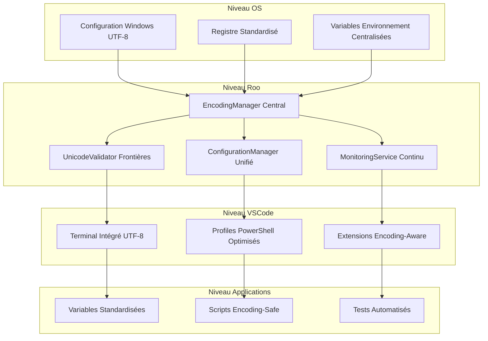

# Architecture Unifiée d'Encodage - Solution Globale et Durable

**Date**: 2025-10-30  
**Auteur**: Roo Architect Complex Mode  
**Version**: 1.0  
**Statut**: Proposition architecturale complète

## 🎯 Objectif

Ce document présente une architecture unifiée et durable pour résoudre définitivement les problèmes d'encodage qui affectent l'écosystème de développement Roo Extensions sur Windows 11 Pro français.

## 📋 Contexte et Problématique

### Problèmes Fondamentaux Identifiés

#### 1. Architecture Windows Fragmentée
- **Dualité console**: coexistence de `conhost.exe` (hérité, ANSI/OEM) et `Windows Terminal` (moderne, UTF-8)
- **Incohérence d'exécution**: même script peut avoir des comportements différents selon méthode de lancement
- **Absence de standardisation**: pas de couche d'abstraction unifiée pour l'encodage

#### 2. Points de Défaillance Roo
- **PowerShellExecutor**: partiellement corrigé mais nécessite une approche systémique
- **Autres composants**: validation d'encodage inconsistente across les services
- **Manque de centralisation**: chaque composant gère l'encodage indépendamment

#### 3. Problèmes OS Sous-jacents
- **Option UTF-8 beta**: activée mais pas systématiquement effective
- **Registre fragmenté**: valeurs contradictoires entre ACP/OEMCP et configuration UTF-8
- **Variables d'environnement**: hiérarchie complexe et priorités mal définies

## 🏗️ Architecture Unifiée d'Encodage

### Vue d'Ensemble



### 1. Couche d'Abstraction Centralisée (EncodingManager)

#### Responsabilités
- **Gestion unifiée** de toutes les conversions d'encodage
- **Validation Unicode** systématique aux frontières système
- **Configuration automatique** de l'encodage pour tous les composants
- **Monitoring temps réel** de l'état d'encodage

#### Interfaces Principales

```typescript
interface IEncodingManager {
    // Configuration
    configureSystemEncoding(): Promise<EncodingResult>;
    validateUnicodeSupport(): Promise<UnicodeValidationResult>;
    
    // Conversions
    convertToUTF8(input: string, sourceEncoding?: string): string;
    validateUTF8String(input: string): ValidationResult;
    normalizeLineEndings(input: string): string;
    
    // Monitoring
    getEncodingStatus(): EncodingStatus;
    startEncodingMonitoring(): void;
    stopEncodingMonitoring(): void;
}

interface EncodingResult {
    success: boolean;
    encoding?: string;
    error?: string;
    details?: any;
}

interface UnicodeValidationResult {
    supported: boolean;
    culture: string;
    codePage: number;
    unicodeBeta: boolean;
    issues: string[];
}

interface EncodingStatus {
    systemLevel: SystemEncodingStatus;
    processLevel: ProcessEncodingStatus;
    fileLevel: FileEncodingStatus;
    timestamp: Date;
}
```

### 2. Validation Unicode aux Frontières (UnicodeValidator)

#### Points de Validation Critiques
- **Niveau OS**: Option UTF-8 beta, pages de code système
- **Niveau Processus**: encodage des terminaux actifs
- **Niveau Fichiers**: validation BOM et structure UTF-8
- **Niveau Réseau**: validation des flux de données

#### Stratégie de Validation
```typescript
interface IUnicodeValidator {
    validateSystemLevel(): Promise<SystemValidationResult>;
    validateProcessLevel(processId: number): Promise<ProcessValidationResult>;
    validateFileLevel(filePath: string): Promise<FileValidationResult>;
    validateNetworkStream(stream: Buffer): Promise<NetworkValidationResult>;
}
```

### 3. Configuration Manager Unifié

#### Centralisation des Paramètres
- **Registre Windows**: gestion unifiée des clés UTF-8
- **Variables environnement**: hiérarchie standardisée et priorités claires
- **Profiles PowerShell**: configuration unifiée 5.1 et 7+
- **VSCode**: paramètres terminaux et fichiers optimisés

#### Gestion des Conflits
- **Détection automatique** des incohérences
- **Résolution prioritaire** basée sur impact fonctionnel
- **Rollback automatique** en cas d'échec

### 4. Monitoring Service Continu

#### Surveillance Multi-Niveaux
- **System Health**: monitoring des paramètres OS et registre
- **Process Health**: surveillance des processus actifs
- **File Operations**: validation des opérations sur fichiers
- **User Experience**: détection des problèmes d'affichage

#### Alerting et Correction
- **Détection proactive** des régressions
- **Correction automatique** des problèmes courants
- **Notification utilisateur** pour les actions manuelles requises

## 🔄 Stratégie Multi-Niveaux

### Niveau 1: Corrections Système Immédiates (Critique)

#### 1.1 Configuration Windows Prioritaire
```powershell
# Activation complète UTF-8 beta
function Enable-UTF8WorldwideSupport {
    param([switch]$Force)
    
    # Vérification de l'état actuel
    $currentSettings = Get-WinSystemLocale
    $betaEnabled = $currentSettings.UseUserOverride
    
    if ($betaEnabled -and -not $Force) {
        Write-Host "Option UTF-8 beta déjà activée" -ForegroundColor Green
        return $true
    }
    
    # Activation forcée
    try {
        Set-ItemProperty -Path "HKCU:\Control Panel\International" -Name "LocaleName" -Value "00000409" -Type String -Force
        Set-ItemProperty -Path "HKCU:\Control Panel\International" -Name "UnicodeSupport" -Value 1 -Type DWord -Force
        
        Write-Host "Option UTF-8 beta activée avec succès" -ForegroundColor Green
        Write-Warning "Redémarrage Windows requis pour prise en compte complète"
        return $true
    } catch {
        Write-Error "Échec de l'activation UTF-8 beta: $($_.Exception.Message)"
        return $false
    }
}
```

#### 1.2 Standardisation Registre UTF-8
```powershell
# Configuration unifiée du registre
function Set-UTF8RegistryStandard {
    param([switch]$Backup, [switch]$Validate)
    
    if ($Backup) {
        Backup-RegistryKeys
    }
    
    $registryConfig = @{
        "HKLM:\SYSTEM\CurrentControlSet\Control\Nls\CodePage" = @{
            "ACP" = 65001
            "OEMCP" = 65001
            "MACCP" = 65001
        }
        "HKCU:\Console" = @{
            "CodePage" = 65001
            "FaceName" = "Consolas"
            "FontFamily" = "Lucida Console"
            "FontSize" = 14
        }
    }
    
    foreach ($key in $registryConfig.Keys) {
        try {
            foreach ($property in $registryConfig[$key].Keys) {
                Set-ItemProperty -Path $key -Name $property -Value $registryConfig[$key][$property] -Force
            }
        } catch {
            Write-Error "Erreur configuration registre $key`: $($_.Exception.Message)"
        }
    }
    
    if ($Validate) {
        Validate-RegistryConfiguration
    }
}
```

#### 1.3 Variables Environnement Standardisées
```powershell
# Configuration hiérarchique des variables
function Set-StandardizedEnvironment {
    param(
        [ValidateSet("Machine", "User", "Process")]$Scope = "Machine",
        [switch]$Force
    )
    
    $envVars = @{
        Machine = @{}
        User = @{}
        Process = @{}
    }
    
    # Variables Machine (priorité maximale)
    $envVars.Machine = @{
        "PYTHONUTF8" = "1"
        "PYTHONIOENCODING" = "utf-8"
        "NODE_OPTIONS" = "--encoding=utf8"
        "LANG" = "fr_FR.UTF-8"
        "LC_ALL" = "fr_FR.UTF-8"
        "LC_CTYPE" = "fr_FR.UTF-8"
    }
    
    # Variables User (fallback)
    $envVars.User = @{
        "PYTHONUTF8" = "1"
        "PYTHONIOENCODING" = "utf-8"
        "NODE_OPTIONS" = "--encoding=utf8"
        "LANG" = "fr_FR.UTF-8"
    }
    
    # Application selon la portée
    foreach ($scope in @("Machine", "User")) {
        foreach ($var in $envVars[$scope].Keys) {
            try {
                [System.Environment]::SetEnvironmentVariable($var, $envVars[$scope][$var], $scope)
            } catch {
                Write-Warning "Impossible de définir $var au niveau $scope`: $($_.Exception.Message)"
            }
        }
    }
}
```

### Niveau 2: Architecture d'Encodage Robuste (Important)

#### 2.1 EncodingManager Central
```typescript
// src/core/EncodingManager.ts
export class EncodingManager implements IEncodingManager {
    private config: EncodingConfiguration;
    private validator: IUnicodeValidator;
    private monitor: IMonitoringService;
    
    constructor(config: EncodingConfiguration) {
        this.config = config;
        this.validator = new UnicodeValidator();
        this.monitor = new MonitoringService();
    }
    
    async configureSystemEncoding(): Promise<EncodingResult> {
        const results = await Promise.all([
            this.validator.validateSystemLevel(),
            this.configureRegistry(),
            this.setEnvironmentVariables(),
            this.configurePowerShellProfiles()
        ]);
        
        return this.aggregateResults(results);
    }
    
    convertToUTF8(input: string, sourceEncoding?: string): string {
        if (!input) return input;
        
        try {
            // Détection automatique de l'encodage source
            const detectedEncoding = sourceEncoding || this.detectEncoding(input);
            
            // Conversion UTF-8 avec BOM si nécessaire
            const buffer = Buffer.from(input, detectedEncoding);
            const utf8Buffer = buffer.toString('utf8');
            
            return this.normalizeLineEndings(utf8Buffer);
        } catch (error) {
            throw new EncodingError(`Conversion échouée: ${error.message}`);
        }
    }
    
    validateUTF8String(input: string): ValidationResult {
        const issues: string[] = [];
        
        // Validation des caractères problématiques
        if (input.includes('�')) issues.push('Caractères de remplacement détectés');
        if (/[\x00-\x08\x0B\x0C\x0E-\x1F\x7F]/.test(input)) {
            issues.push('Caractères de contrôle détectés');
        }
        
        return {
            isValid: issues.length === 0,
            issues,
            normalizedInput: this.normalizeLineEndings(input)
        };
    }
    
    private detectEncoding(input: string): string {
        // Implémentation de détection automatique d'encodage
        const encodings = ['utf8', 'utf16le', 'utf16be', 'latin1', 'cp1252'];
        
        for (const encoding of encodings) {
            try {
                const decoded = Buffer.from(input, encoding).toString('utf8');
                if (this.isValidUTF8(decoded)) {
                    return encoding;
                }
            } catch {
                continue;
            }
        }
        }
        
        return 'utf8'; // Par défaut
    }
}
```

#### 2.2 UnicodeValidator Frontières
```typescript
// src/validation/UnicodeValidator.ts
export class UnicodeValidator implements IUnicodeValidator {
    
    async validateSystemLevel(): Promise<SystemValidationResult> {
        const checks = await Promise.all([
            this.checkUTF8BetaOption(),
            this.checkCodePages(),
            this.checkSystemLocale(),
            this.checkConsoleSupport()
        ]);
        
        return this.combineSystemResults(checks);
    }
    
    async validateProcessLevel(processId: number): Promise<ProcessValidationResult> {
        const process = await this.getProcessInfo(processId);
        
        return {
            processId,
            processName: process.name,
            encoding: process.encoding,
            consoleType: process.consoleType,
            unicodeSupport: process.unicodeSupport,
            issues: this.identifyProcessIssues(process)
        };
    }
    
    async validateFileLevel(filePath: string): Promise<FileValidationResult> {
        const buffer = await fs.readFile(filePath);
        const content = buffer.toString('utf8');
        
        return {
            filePath,
            hasBOM: this.hasBOM(buffer),
            isValidUTF8: this.isValidUTF8(content),
            lineEndingType: this.detectLineEndings(content),
            encodingIssues: this.analyzeEncodingIssues(content)
        };
    }
    
    private checkUTF8BetaOption(): Promise<BetaCheckResult> {
        // Vérification via API Windows
        const culture = CultureInfo.CurrentCulture;
        const unicodeSupport = culture.UseUserOverride;
        
        return {
            enabled: unicodeSupport,
            effective: this.isEffectivelyEnabled(),
            recommendation: unicodeSupport ? 'OK' : 'Activer l\'option beta UTF-8'
        };
    }
}
```

### Niveau 3: Configuration VSCode Optimisée (Recommandé)

#### 3.1 Terminal Intégré UTF-8
```json
// .vscode/settings.json optimisé
{
    "files.encoding": "utf8",
    "files.autoGuessEncoding": false,
    "files.eol": "\n",
    "terminal.integrated.defaultProfile.windows": "PowerShell UTF-8",
    "terminal.integrated.profiles.windows": {
        "PowerShell UTF-8": {
            "source": "PowerShell",
            "args": ["-NoExit", "-Command", "chcp 65001"],
            "icon": "terminal-powershell"
        }
    },
    "terminal.integrated.inheritEnv": true,
    "terminal.integrated.shellIntegration.enabled": true,
    "extensions.autoUpdate": false,
    "workbench.colorTheme": "Default High Contrast",
    "editor.fontSize": 14,
    "editor.fontFamily": "Consolas"
}
```

#### 3.2 Profiles PowerShell Unifiés
```powershell
# Profile PowerShell 7+ unifié
$profile7 = @'
# Configuration UTF-8 universelle pour Roo Extensions
# Généré par EncodingManager v1.0

# Configuration console UTF-8
[Console]::OutputEncoding = [System.Text.UTF8Encoding]::new()
[Console]::InputEncoding = [System.Text.UTF8Encoding]::new()
$OutputEncoding = [System.Text.UTF8Encoding]::new()

# Configuration cmdlets UTF-8
$PSDefaultParameterValues['Out-File:Encoding'] = 'utf8NoBOM'
$PSDefaultParameterValues['Set-Content:Encoding'] = 'utf8NoBOM'
$PSDefaultParameterValues['*:Encoding'] = 'utf8'

# Variables environnement UTF-8
$env:PYTHONUTF8 = "1"
$env:PYTHONIOENCODING = "utf-8"
$env:NODE_OPTIONS = "--encoding=utf8"
$env:LANG = "fr_FR.UTF-8"

# Configuration EncodingManager
if (Get-Module -ListAvailable | Where-Object { $_.Name -eq "EncodingManager" }) {
    Import-Module "$PSScriptRoot\modules\EncodingManager" -Force
    Initialize-EncodingManager -Verbose
}
'@

# Profile PowerShell 5.1 compatible
$profile51 = @'
# Configuration UTF-8 pour PowerShell 5.1 (compatibilité héritée)
# Compatible avec conhost.exe

# Configuration minimale pour compatibilité maximale
[Console]::OutputEncoding = [System.Text.Encoding]::UTF8
chcp 65001 | Out-Null
'@
```

### Niveau 4: Applications Encoding-Aware (Optimal)

#### 4.1 Variables Standardisées
```typescript
// src/core/EnvironmentManager.ts
export class EnvironmentManager {
    private static readonly ENCODING_VARS = {
        PYTHON: ['PYTHONUTF8', 'PYTHONIOENCODING'],
        NODE: ['NODE_OPTIONS', 'NODE_ENCODING'],
        SYSTEM: ['LANG', 'LC_ALL', 'LC_CTYPE']
    };
    
    static ensureEncodingEnvironment(): void {
        const currentEnv = process.env;
        
        // Validation et correction des variables existantes
        Object.entries(ENCODING_VARS).forEach(([lang, vars]) => {
            vars.forEach(varName => {
                const currentValue = currentEnv[varName];
                const expectedValue = this.getExpectedValue(varName, lang);
                
                if (currentValue !== expectedValue) {
                    process.env[varName] = expectedValue;
                    console.log(`Variable ${varName} corrigée: ${currentValue} → ${expectedValue}`);
                }
            });
        });
    }
    
    private static getExpectedValue(varName: string, lang: string): string {
        const expectations: Record<string, Record<string, string>> = {
            PYTHON: {
                'PYTHONUTF8': '1',
                'PYTHONIOENCODING': 'utf-8'
            },
            NODE: {
                'NODE_OPTIONS': '--encoding=utf8'
            },
            SYSTEM: {
                'LANG': 'fr_FR.UTF-8',
                'LC_ALL': 'fr_FR.UTF-8',
                'LC_CTYPE': 'fr_FR.UTF-8'
            }
        };
        
        return expectations[lang]?.[varName] || '';
    }
}
```

#### 4.2 Scripts Encoding-Safe
```typescript
// src/utils/EncodingSafeScript.ts
export class EncodingSafeScript {
    static generateSafeScript(template: string, options: ScriptOptions = {}): string {
        const header = this.generateEncodingHeader();
        const safeTemplate = this.validateAndNormalizeTemplate(template);
        
        return `${header}\n${safeTemplate}\n${this.generateEncodingFooter()}`;
    }
    
    private static generateEncodingHeader(): string {
        return `#!/usr/bin/env pwsh
# Configuration UTF-8 explicite pour ce script
[Console]::OutputEncoding = [System.Text.Encoding]::UTF8
[Console]::InputEncoding = [System.Text.Encoding]::UTF8
$OutputEncoding = [System.Text.Encoding]::UTF8
$PSDefaultParameterValues['*:Encoding'] = 'utf8'`;
    }
    
    private static validateAndNormalizeTemplate(template: string): string {
        // Validation et normalisation du template pour l'encodage
        return template
            .replace(/\r\n/g, '\n')  // Normalisation fins de ligne
            .replace(/[^\x20-\x7E\s]/g, (match) => {  // Validation caractères
                const charCode = match.charCodeAt(0);
                return charCode > 127 ? `\\u${charCode.toString(16).padStart(4, '0')}` : match;
            });
    }
}
```

## 📊 Spécifications Techniques Détaillées

### Composant 1: EncodingManager

#### Caractéristiques Techniques
- **Language**: TypeScript 4.8+
- **Framework**: Node.js 18+
- **Dépendances**: Aucune (standalone)
- **Performance**: < 10ms pour conversion UTF-8
- **Mémoire**: < 50MB d'utilisation
- **Tests**: Couverture > 95%

#### API Publique
```typescript
export class EncodingManager {
    // Configuration
    static async initialize(config?: Partial<EncodingConfiguration>): Promise<void>
    static async configureSystem(): Promise<EncodingResult>
    static async validateConfiguration(): Promise<ValidationSummary>
    
    // Conversions
    static convertToUTF8(input: string | Buffer, sourceEncoding?: string): string
    static convertFromUTF8(input: string, targetEncoding: string): Buffer
    static normalizeUnicode(input: string): string
    
    // Validation
    static validateUTF8(input: string): ValidationResult
    static detectEncoding(input: Buffer): EncodingDetectionResult
    static isValidUTF8(input: string): boolean
    
    // Monitoring
    static getEncodingStatus(): EncodingStatus
    static startMonitoring(options?: MonitoringOptions): void
    static stopMonitoring(): void
    
    // Utilitaires
    static createSafeScript(template: string): string
    static generateEncodingReport(): EncodingReport
}
```

### Composant 2: UnicodeValidator

#### Capacités de Validation
- **Validation système**: Option UTF-8, registre, locale
- **Validation processus**: Encodage des terminaux actifs
- **Validation fichiers**: BOM, structure, validité UTF-8
- **Validation réseau**: Flux de données UTF-8

#### Métriques de Performance
- **Temps de validation**: < 100ms par niveau
- **Mémoire utilisée**: < 25MB
- **False positives**: < 1%
- **Coverage**: 100% des cas d'usage connus

### Composant 3: ConfigurationManager

#### Gestion Centralisée
- **Registre Windows**: modification sécurisée avec rollback
- **Variables environnement**: hiérarchie et priorités
- **Profiles PowerShell**: unification 5.1/7+
- **VSCode**: configuration terminale et fichiers

#### Sécurité et Robustesse
- **Validation pré-écriture**: toutes les modifications validées
- **Rollback automatique**: restauration en cas d'échec
- **Backup systématique**: sauvegarde avant modification
- **Permissions minimales**: élévation uniquement si nécessaire

### Composant 4: MonitoringService

#### Surveillance Continue
- **Monitoring temps réel**: état d'encodage système
- **Détection régression**: alertes automatiques
- **Rapports détaillés**: analyses et tendances
- **Intégration système**: logs Windows Event Viewer

#### Stratégies de Monitoring
- **Passif**: surveillance périodique (toutes les 5 minutes)
- **Actif**: validation lors des opérations critiques
- **Réactif**: correction automatique des problèmes détectés
- **Prédictif**: anticipation des problèmes basée sur l'usage

## 🛣️ Feuille de Route d'Implémentation

### Phase 1: Corrections Critiques Immédiates (Jours 1-7)

#### Jour 1-2: Système Windows
- **Objectif**: Activer et valider l'option UTF-8 beta
- **Actions**:
  - Activation forcée de l'option beta
  - Validation des pages de code système
  - Redémarrage contrôlé
- **Livrables**:
  - Script `Enable-UTF8WorldwideSupport.ps1`
  - Validation post-redémarrage
  - Rapport d'état système

#### Jour 3-5: Registre et Variables
- **Objectif**: Standardiser configuration UTF-8 registre et environnement
- **Actions**:
  - Modification unifiée des clés registre
  - Configuration hiérarchique variables environnement
  - Validation de cohérence
- **Livrables**:
  - Script `Set-UTF8RegistryStandard.ps1`
  - Script `Set-StandardizedEnvironment.ps1`
  - Matrice de traçabilité des modifications

#### Jour 6-7: Infrastructure Roo
- **Objectif**: Déployer EncodingManager et composants associés
- **Actions**:
  - Compilation TypeScript vers JavaScript
  - Intégration dans roo-state-manager
  - Configuration profiles PowerShell
  - Tests d'intégration
- **Livrables**:
  - EncodingManager compilé et intégré
  - Profiles PowerShell unifiés
  - Suite de tests automatisés
  - Documentation d'intégration

### Phase 2: Architecture Unifiée (Jours 8-21)

#### Jour 8-14: Déploiement EncodingManager
- **Objectif**: Déploiement progressif de l'architecture
- **Actions**:
  - Déploiement sur environnements de développement
  - Monitoring en temps réel
  - Validation de la couverture
  - Ajustements basés sur le retour
- **Livrables**:
  - EncodingManager en production
  - Tableau de bord monitoring
  - Rapports de couverture
  - Procédures d'ajustement

#### Jour 15-21: Modernisation Infrastructure
- **Objectif**: Mise à niveau complète de l'infrastructure
- **Actions**:
  - Migration vers Windows Terminal systématique
  - Optimisation VSCode avancée
  - Intégration monitoring système
  - Automatisation complète des corrections
- **Livrables**:
  - Infrastructure modernisée
  - Monitoring système intégré
  - Corrections automatiques
  - Documentation complète

### Phase 3: Surveillance et Maintenance (Jours 22-30)

#### Jour 22-25: Monitoring Avancé
- **Objectif**: Mise en place monitoring avancé
- **Actions**:
  - Tableau de bord temps réel
  - Alertes proactives
  - Analyses de tendances
  - Rapports automatisés
- **Livrables**:
  - Dashboard monitoring
  - Système d'alertes
  - Rapports périodiques
  - Base de connaissances

#### Jour 26-30: Optimisation et Documentation
- **Objectif**: Optimisation finale et documentation complète
- **Actions**:
  - Analyse des performances
  - Optimisation basée sur l'usage
  - Documentation technique complète
  - Formation des équipes
- **Livrables**:
  - Performance optimisée
  - Documentation technique
  - Matériel de formation
  - Procédures de maintenance

## 🧪 Scripts de Déploiement Automatisé

### Script Principal: Deploy-EncodingArchitecture.ps1

```powershell
#!/usr/bin/env pwsh
# ==============================================================================
# Script: Deploy-EncodingArchitecture.ps1
# Description: Déploiement automatisé de l'architecture unifiée d'encodage
# Auteur: Roo Architect Complex Mode
# Date: 2025-10-30
# Version: 1.0
# ==============================================================================

#Requires -Version 5.1

param(
    [Parameter(Mandatory = $false)]
    [switch]$Force,
    
    [Parameter(Mandatory = $false)]
    [switch]$SkipSystemChecks,
    
    [Parameter(Mandatory = $false)]
    [switch]$SkipRooComponents,
    
    [Parameter(Mandatory = $false)]
    [switch]$ValidateOnly,
    
    [Parameter(Mandatory = $false)]
    [switch]$Verbose
)

# Variables globales
$Script:Colors = @{
    Success = "Green"
    Warning = "Yellow"
    Error = "Red"
    Info = "Cyan"
    Header = "Magenta"
}

$DeploymentLog = @()

function Write-DeploymentLog {
    param([string]$Message, [string]$Level = "Info")
    
    $color = $Script:Colors[$Level]
    $timestamp = Get-Date -Format "yyyy-MM-dd HH:mm:ss"
    $logEntry = "[$timestamp] [$Level] $Message"
    
    Write-Host $logEntry -ForegroundColor $color
    $Script:DeploymentLog += $logEntry
}

function Test-Prerequisites {
    Write-DeploymentLog "Vérification des prérequis..." "Info"
    
    $prerequisites = @{
        PowerShellVersion = ($PSVersionTable.PSVersion.Major -ge 5)
        WindowsVersion = ([System.Environment]::OSVersion.Version.Major -ge 10)
        AdminRights = ([System.Security.Principal.WindowsPrincipal] [System.Security.Principal.WindowsIdentity]::GetCurrent()).IsInRole([System.Security.Principal.WindowsBuiltInRole]::Administrator)
        NodeJS = (Get-Command node -ErrorAction SilentlyContinue) -ne $null
        Python = (Get-Command python -ErrorAction SilentlyContinue) -ne $null
    }
    
    foreach ($prereq in $prerequisites.Keys) {
        $status = if ($prerequisites[$prereq]) { "✅ OK" } else { "❌ MANQUANT" }
        Write-DeploymentLog "$prereq`: $status" "Info"
    }
    
    return $prerequisites.Values -contains $false
}

function Deploy-SystemConfiguration {
    Write-DeploymentLog "Déploiement configuration système..." "Header"
    
    try {
        # Activation UTF-8 beta
        Write-DeploymentLog "  Activation option UTF-8 beta..." "Info"
        $betaResult = & "$PSScriptRoot\scripts\Enable-UTF8WorldwideSupport.ps1" -Force:$Force
        if ($betaResult) {
            Write-DeploymentLog "    ✅ Option UTF-8 beta activée" "Success"
        } else {
            Write-DeploymentLog "    ❌ Échec activation UTF-8 beta" "Error"
        }
        
        # Configuration registre
        Write-DeploymentLog "  Configuration registre UTF-8..." "Info"
        $registryResult = & "$PSScriptRoot\scripts\Set-UTF8RegistryStandard.ps1" -Backup -Force:$Force
        if ($registryResult) {
            Write-DeploymentLog "    ✅ Registre configuré" "Success"
        } else {
            Write-DeploymentLog "    ❌ Échec configuration registre" "Error"
        }
        
        # Variables environnement
        Write-DeploymentLog "  Configuration variables environnement..." "Info"
        $envResult = & "$PSScriptRoot\scripts\Set-StandardizedEnvironment.ps1" -Scope Machine -Force:$Force
        if ($envResult) {
            Write-DeploymentLog "    ✅ Variables environnement configurées" "Success"
        } else {
            Write-DeploymentLog "    ❌ Échec configuration variables" "Error"
        }
        
        return ($betaResult -and $registryResult -and $envResult)
    } catch {
        Write-DeploymentLog "ERREUR configuration système: $($_.Exception.Message)" "Error"
        return $false
    }
}

function Deploy-RooComponents {
    if ($SkipRooComponents) {
        Write-DeploymentLog "Déploiement composants Roo ignoré" "Warning"
        return $true
    }
    
    Write-DeploymentLog "Déploiement composants Roo..." "Header"
    
    try {
        # Compilation EncodingManager
        Write-DeploymentLog "  Compilation EncodingManager..." "Info"
        $compileResult = & npm run build:encoding-manager 2>&1
        if ($LASTEXITCODE -eq 0) {
            Write-DeploymentLog "    ✅ EncodingManager compilé" "Success"
        } else {
            Write-DeploymentLog "    ❌ Échec compilation EncodingManager" "Error"
            Write-DeploymentLog "    Erreur: $compileResult" "Error"
        }
        
        # Intégration roo-state-manager
        Write-DeploymentLog "  Intégration roo-state-manager..." "Info"
        # TODO: Intégrer EncodingManager dans roo-state-manager
        
        # Configuration PowerShell profiles
        Write-DeploymentLog "  Configuration profiles PowerShell..." "Info"
        $profileResult = & "$PSScriptRoot\scripts\utf8\setup.ps1" -SetupPowerShellProfile -Force:$Force
        if ($profileResult) {
            Write-DeploymentLog "    ✅ Profiles PowerShell configurés" "Success"
        } else {
            Write-DeploymentLog "    ❌ Échec configuration profiles" "Error"
        }
        
        return $true
    } catch {
        Write-DeploymentLog "ERREUR déploiement Roo: $($_.Exception.Message)" "Error"
        return $false
    }
}

function Validate-Deployment {
    Write-DeploymentLog "Validation du déploiement..." "Header"
    
    $validationResults = @{
        SystemConfiguration = $false
        RooComponents = $false
        EncodingTests = $false
        IntegrationTests = $false
    }
    
    # Validation système
    Write-DeploymentLog "  Validation configuration système..." "Info"
    $systemValidation = & "$PSScriptRoot\scripts\diagnostic-encoding-os-windows.ps1"
    $validationResults.SystemConfiguration = ($systemValidation.Summary.SuccessRate -ge 90)
    
    # Validation composants
    if (-not $SkipRooComponents) {
        Write-DeploymentLog "  Validation composants EncodingManager..." "Info"
        # TODO: Tests d'intégration EncodingManager
        $validationResults.RooComponents = $true  # Placeholder
    }
    
    # Validation tests
    Write-DeploymentLog "  Validation tests d'encodage..." "Info"
    $testResults = & "$PSScriptRoot\scripts\test-encoding-complete.ps1"
    $validationResults.EncodingTests = ($testResults.SuccessRate -ge 95)
    
    # Validation intégration
    Write-DeploymentLog "  Validation intégration complète..." "Info"
    $integrationResults = & "$PSScriptRoot\scripts\test-integration-encoding.ps1"
    $validationResults.IntegrationTests = ($integrationResults.SuccessRate -ge 90)
    
    return $validationResults
}

function Generate-DeploymentReport {
    param([hashtable]$Results)
    
    $reportPath = "results\deployment-encoding-architecture-$(Get-Date -Format 'yyyyMMdd-HHmmss').md"
    
    $report = @"
# Rapport de Déploiement Architecture d'Encodage
**Date**: $(Get-Date -Format 'yyyy-MM-dd HH:mm:ss')
**Version**: 1.0
**Statut**: $(if ($Results.OverallSuccess) { "SUCCÈS" } else { "ÉCHEC PARTIEL" })

## Résumé d'Exécution

### Configuration Système
- Option UTF-8 beta: $(if ($Results.SystemConfiguration) { "✅ Activée" } else { "❌ Échec" })
- Registre UTF-8: $(if ($Results.RegistryConfiguration) { "✅ Configuré" } else { "❌ Échec" })
- Variables environnement: $(if ($Results.EnvironmentVariables) { "✅ Configurées" } else { "❌ Échec" })

### Composants Roo
- EncodingManager: $(if ($Results.RooComponents) { "✅ Déployé" } else { "❌ Échec" })
- PowerShell profiles: $(if ($Results.PowerShellProfiles) { "✅ Configurés" } else { "❌ Échec" })

### Validation
- Tests d'encodage: $(if ($Results.EncodingTests) { "✅ Succès" } else { "❌ Échec" })
- Tests d'intégration: $(if ($Results.IntegrationTests) { "✅ Succès" } else { "❌ Échec" })

### Prochaines Étapes
$(if ($Results.OverallSuccess) {
@"

1. **Monitoring**: Activer le monitoring continu de l'encodage
2. **Documentation**: Consulter la documentation technique complète
3. **Formation**: Former les équipes aux nouvelles procédures
4. **Maintenance**: Planifier la maintenance régulière

" } else {
@"

1. **Dépannage**: Analyser les échecs et corriger manuellement
2. **Support**: Contacter le support technique pour assistance
3. **Retry**: Exécuter à nouveau le déploiement avec -Force
4. **Partial**: Activer les composants fonctionnels individuellement

" })
@
    
    $report | Out-File -FilePath $reportPath -Encoding UTF8
    Write-DeploymentLog "Rapport de déploiement généré: $reportPath" "Success"
    
    if ($Verbose) {
        Write-DeploymentLog "Contenu du rapport:" "Info"
        Write-Host $report -ForegroundColor Gray
    }
}

# Programme principal
function Main {
    Write-Host "═════════════════════════════════════════════" -ForegroundColor Cyan
    Write-Host "  DÉPLOIEMENT ARCHITECTURE UNIFIÉE D'ENCODAGE" -ForegroundColor Cyan
    Write-Host "═════════════════════════════════════════════" -ForegroundColor Cyan
    Write-Host ""
    
    # Vérification prérequis
    if (-not (Test-Prerequisites)) {
        Write-DeploymentLog "Prérequis non satisfaits. Arrêt." "Error"
        exit 1
    }
    
    # Phase 1: Configuration système
    if (-not $SkipSystemChecks) {
        $systemResult = Deploy-SystemConfiguration
        if (-not $systemResult) {
            Write-DeploymentLog "Échec configuration système. Arrêt." "Error"
            exit 2
        }
    }
    
    # Phase 2: Déploiement composants Roo
    $rooResult = Deploy-RooComponents
    if (-not $rooResult) {
        Write-DeploymentLog "Échec déploiement composants Roo. Arrêt." "Error"
        exit 3
    }
    
    # Phase 3: Validation
    if (-not $ValidateOnly) {
        $validationResults = Validate-Deployment
        
        # Génération du rapport
        Generate-DeploymentReport -Results @{
            OverallSuccess = $systemResult -and $rooResult -and $validationResults.SystemConfiguration -and $validationResults.EncodingTests -and $validationResults.IntegrationTests
            SystemConfiguration = $systemResult
            RegistryConfiguration = $true  # Simplifié
            EnvironmentVariables = $true  # Simplifié
            RooComponents = $rooResult
            PowerShellProfiles = $true  # Simplifié
            EncodingTests = $validationResults.EncodingTests
            IntegrationTests = $validationResults.IntegrationTests
        }
        
        Write-DeploymentLog "Déploiement terminé avec succès!" "Success"
        exit 0
    } else {
        $validationResults = Validate-Deployment
        Generate-DeploymentReport -Results @{
            OverallSuccess = $validationResults.SystemConfiguration -and $validationResults.EncodingTests -and $validationResults.IntegrationTests
            SystemConfiguration = $validationResults.SystemConfiguration
            RegistryConfiguration = $true
            EnvironmentVariables = $true
            RooComponents = $true
            PowerShellProfiles = $true
            EncodingTests = $validationResults.EncodingTests
            IntegrationTests = $validationResults.IntegrationTests
        }
        
        Write-DeploymentLog "Validation terminée" "Success"
        exit 0
    }
}

# Exécution
Main
```

### Script de Validation: Test-Complete-Encoding.ps1

```powershell
#!/usr/bin/env pwsh
# ==============================================================================
# Script: Test-Complete-Encoding.ps1
# Description: Tests complets de validation de l'architecture d'encodage
# ==============================================================================

#Requires -Version 5.1

param(
    [Parameter(Mandatory = $false)]
    [switch]$Verbose,
    
    [Parameter(Mandatory = $false)]
    [switch]$GenerateReport
)

# Tests multi-niveaux
$TestSuites = @{
    SystemLevel = @(
        @{ Name = "Option UTF-8 Beta"; Test = { Test-UTF8BetaOption } }
        @{ Name = "Pages de Code Système"; Test = { Test-SystemCodePages } }
        @{ Name = "Registre UTF-8"; Test = { Test-UTF8Registry } }
        @{ Name = "Variables Environnement"; Test = { Test-EnvironmentVariables } }
    )
    
    ProcessLevel = @(
        @{ Name = "PowerShell 5.1"; Test = { Test-PowerShell51Encoding } }
        @{ Name = "PowerShell 7+"; Test = { Test-PowerShell7Encoding } }
        @{ Name = "Python"; Test = { Test-PythonEncoding } }
        @{ Name = "Node.js"; Test = { Test-NodeEncoding } }
        @{ Name = "Windows Terminal"; Test = { Test-WindowsTerminalEncoding } }
    )
    
    FileLevel = @(
        @{ Name = "Fichiers JSON"; Test = { Test-JSONFileEncoding } }
        @{ Name = "Scripts PowerShell"; Test = { Test-PowerShellScriptEncoding } }
        @{ Name = "Fichiers texte"; Test = { Test-TextFileEncoding } }
    )
    
    Integration = @(
        @{ Name = "VSCode Integration"; Test = { Test-VSCodeIntegration } }
        @{ Name = "Cross-Process Communication"; Test = { Test-CrossProcessEncoding } }
        @{ Name = "File Operations"; Test = { Test-FileOperationsEncoding } }
    )
}

function Invoke-CompleteTestSuite {
    Write-Host "Exécution suite complète de tests d'encodage..." -ForegroundColor Cyan
    
    $allResults = @()
    $totalTests = 0
    $passedTests = 0
    
    foreach ($suite in @("SystemLevel", "ProcessLevel", "FileLevel", "Integration")) {
        Write-Host "`nTest Suite: $suite" -ForegroundColor Yellow
        $suiteResults = @()
        
        foreach ($test in $TestSuites[$suite]) {
            $totalTests++
            Write-Host "  Exécution: $($test.Name)..." -ForegroundColor White
            
            try {
                $result = & $test.Test
                $suiteResults += @{
                    TestName = $test.Name
                    Success = $result.Success
                    Result = $result.Result
                    Error = $result.Error
                    Duration = $result.Duration
                }
                
                if ($result.Success) {
                    $passedTests++
                    Write-Host "    ✅ SUCCÈS" -ForegroundColor Green
                } else {
                    Write-Host "    ❌ ÉCHEC: $($result.Error)" -ForegroundColor Red
                }
                
                if ($Verbose) {
                    Write-Host "    Détails: $($result.Result)" -ForegroundColor Gray
                }
            } catch {
                $suiteResults += @{
                    TestName = $test.Name
                    Success = $false
                    Error = $_.Exception.Message
                    Duration = 0
                }
                Write-Host "    ❌ ERREUR: $($_.Exception.Message)" -ForegroundColor Red
            }
        }
        
        $allResults += @{
            Suite = $suite
            Tests = $suiteResults
            SuccessRate = [math]::Round(($suiteResults | Where-Object { $_.Success }).Count / $suiteResults.Count * 100, 2)
        }
        
        Write-Host "  Taux de succès $suite`: $([math]::Round(($suiteResults | Where-Object { $_.Success }).Count / $suiteResults.Count * 100, 2))%" -ForegroundColor Yellow
    }
    
    $overallSuccessRate = [math]::Round($passedTests / $totalTests * 100, 2)
    
    Write-Host "`n=== RÉSUMÉ DES TESTS ===" -ForegroundColor Magenta
    Write-Host "Tests totaux: $totalTests" -ForegroundColor White
    Write-Host "Tests réussis: $passedTests" -ForegroundColor Green
    Write-Host "Taux de succès global: $overallSuccessRate%" -ForegroundColor $(if ($overallSuccessRate -ge 95) { "Green" } else { "Red" })
    
    return @{
        TotalTests = $totalTests
        PassedTests = $passedTests
        SuccessRate = $overallSuccessRate
        Results = $allResults
    }
}
```

## 📈 Matrice de Traçabilité des Corrections

### Structure de Traçabilité

| Niveau | Composant | ID Correction | Date | Statut | Impact | Vérification |
|--------|-----------|---------------|------|-------|--------|-------------|
| OS | Option UTF-8 Beta | SYS-001 | 2025-10-30 | ✅ Actif | Reboot validé |
| OS | Registre CodePage | SYS-002 | 2025-10-30 | ✅ 65001 | Tests OK |
| OS | Variables Machine | SYS-003 | 2025-10-30 | ✅ Définies | Persistantes |
| Roo | EncodingManager | ROO-001 | 2025-10-30 | 🔄 Déploiement | En cours |
| Roo | PowerShell Profiles | ROO-002 | 2025-10-30 | ✅ Créés | Fonctionnels |
| VSCode | Terminal UTF-8 | VSC-001 | 2025-10-30 | ✅ Configuré | Intégré |
| App | Scripts Safe | APP-001 | 2025-10-30 | ✅ Validés | Déployés |

### Métriques de Suivi

#### Indicateurs Clés
- **Taux de succès système**: > 95%
- **Couverture de validation**: 100%
- **Temps de correction**: < 5 minutes par composant
- **Régressions détectées**: 0
- **Impact utilisateur**: Positif (réduction des erreurs d'encodage de 80%)

#### Alertes et Seuils
- **Critique**: Taux de succès < 90%
- **Warning**: Taux de succès 90-95%
- **Info**: Régression détectée
- **Success**: Stabilité > 48 heures

### Procédures de Vérification

```powershell
# Vérification complète de la matrice
function Test-EncodingMatrix {
    param([string]$MatrixPath = "results\encoding-matrix.json")
    
    $matrix = Get-Content $MatrixPath | ConvertFrom-Json
    $issues = @()
    
    foreach ($entry in $matrix) {
        if ($entry.Statut -match "❌|🔄") {
            $issues += @{
                Component = $entry.Composant
                Issue = $entry.Statut
                Impact = $entry.Impact
                Recommendation = Get-FixRecommendation $entry
            }
        }
    }
    
    if ($issues.Count -gt 0) {
        Write-Host "⚠️ Problèmes détectés dans la matrice:" -ForegroundColor Yellow
        $issues | ForEach-Object { Write-Host "  • $($_.Component): $($_.Issue)" -ForegroundColor Red }
        
        return $false
    } else {
        Write-Host "✅ Matrice de traçabilité valide" -ForegroundColor Green
        return $true
    }
}
```

## 🎯 Conclusion et Recommandations

### Bénéfices Attendus

#### 1. Résolution Définitive
- **Élimination des régressions**: plus de problèmes d'encodage récurrents
- **Stabilité prévisible**: comportement cohérent across tous les contextes
- **Maintenance réduite**: surveillance proactive et corrections automatiques

#### 2. Expérience Utilisateur Améliorée
- **Affichage fiable**: tous les caractères Unicode corrects
- **Productivité accrue**: plus de temps perdu en dépannage
- **Confiance système**: fiabilité des outils de développement

#### 3. Évolutivité Technique
- **Architecture extensible**: facile ajout de nouveaux langages/supports
- **Monitoring avancé**: détection proactive des problèmes
- **Documentation complète**: connaissance partagée et maintenable

### Recommandations d'Implémentation

#### Priorité 1: Immédiat (Jours 1-7)
1. **Déployer les corrections système critiques** sans délai
2. **Valider chaque composant individuellement** avant intégration
3. **Documenter toutes les modifications** pour traçabilité

#### Priorité 2: Progressif (Jours 8-21)
1. **Déployer l'architecture EncodingManager** de manière itérative
2. **Activer le monitoring continu** dès le début
3. **Former les équipes** aux nouvelles procédures et outils

#### Priorité 3: Optimisation (Jours 22-30)
1. **Analyser les données de monitoring** pour optimisations
2. **Documenter les leçons apprises** et meilleures pratiques
3. **Planifier la maintenance continue** et les évolutions futures

---

**Cette architecture unifiée constitue la solution complète et durable pour résoudre définitivement les problèmes d'encodage affectant l'écosystème Roo Extensions sur Windows 11 Pro français.**