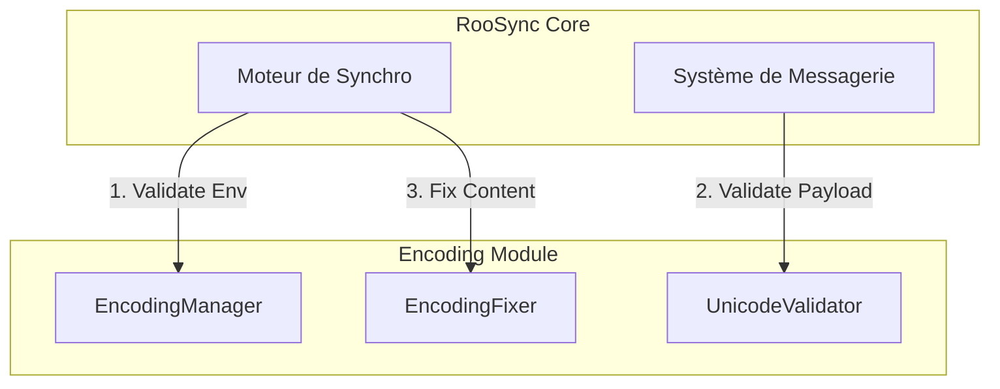

# Spécification Technique : Intégration EncodingManager dans RooSync

**Statut :** Draft
**Date :** 2025-11-27
**Auteur :** Roo Code (Agent Intégration)

## 1. Objectif

Intégrer nativement `EncodingManager` dans le flux de synchronisation RooSync pour garantir l'intégrité des données (fichiers, messages, configurations) échangées entre les agents et les environnements.

## 2. Points d'Intégration Identifiés

### 2.1. Pré-Synchronisation (Hook `PreSync`)

Avant toute opération de synchronisation (push ou pull), RooSync doit valider que l'environnement local est conforme aux standards d'encodage.

*   **Action :** Appel à `[EncodingManager]::Instance.ValidateEnvironment()`
*   **Comportement :**
    *   Si `IsValid` est `false` : Bloquer la synchronisation (sauf override `--force`).
    *   Si `IsValid` est `true` : Continuer.
*   **Implémentation :** Ajout d'une étape de validation dans `RooSyncService.ts` (côté MCP) ou dans les scripts PowerShell wrappers.

### 2.2. Validation des Payloads (Messages & Configs)

Lors de la création ou de la réception de messages inter-agents (`roosync_send_message`), le contenu doit être validé UTF-8.

*   **Action :** Appel à `[EncodingManager]::Instance.Validation.ValidateFile($path)` pour les fichiers attachés ou le corps du message s'il est stocké sur disque.
*   **Comportement :**
    *   Détection de BOM indésirables.
    *   Détection de séquences invalides.
    *   Correction automatique si configuré (`AutoFix`).

### 2.3. Normalisation des Chemins

RooSync manipule des chemins entre différents OS (Windows/Linux). `EncodingManager` doit fournir des utilitaires pour garantir que les chemins ne contiennent pas de caractères interdits ou mal encodés.

## 3. Architecture Proposée



## 4. Plan d'Implémentation

### Phase 1 : Wrappers PowerShell (Immédiat)
Modifier les scripts `roosync_*.ps1` pour charger et utiliser `EncodingManager` s'il est disponible.

### Phase 2 : Intégration MCP (Moyen Terme)
Intégrer la logique de validation directement dans le serveur MCP `roo-state-manager` (TypeScript), potentiellement via un portage de la logique de validation ou via l'exécution de commandes PowerShell sous-jacentes.

## 5. Exemple de Code (Wrapper PowerShell)

```powershell
# Dans roosync_init.ps1 ou équivalent

# Chargement EncodingManager
$emPath = "$env:ROO_EXTENSIONS_ROOT\scripts\encoding\Initialize-EncodingManager.ps1"
if (Test-Path $emPath) { . $emPath }

# Validation Préalable
if ($global:EncodingManager) {
    $validation = $global:EncodingManager.ValidateEnvironment()
    if (-not $validation.IsValid) {
        Write-Error "Environnement d'encodage instable. Synchronisation annulée."
        exit 1
    }
}
```

## 6. Risques et Mitigations

*   **Performance :** La validation complète de gros fichiers peut être lente. -> *Mitigation :* Valider uniquement les fichiers modifiés (diff) et échantillonner les gros fichiers.
*   **Disponibilité :** `EncodingManager` peut ne pas être présent sur toutes les machines. -> *Mitigation :* Design "Fail-Open" (si le module est absent, on log un warning mais on continue, sauf en mode strict).