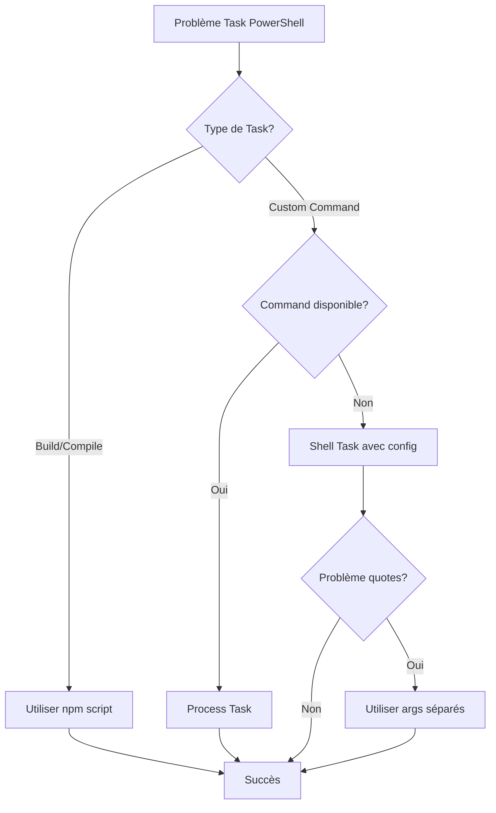

# Configuration Debug VSCode Extension avec PowerShell sur Windows

**Date:** 2025-10-16  
**Contexte:** Recherche documentaire sur la configuration correcte de `tasks.json` et `launch.json` pour le développement d'extensions VSCode avec PowerShell 7 sur Windows 11  
**Problème Initial:** Erreur "Le format du paramètre est incorrect - -Command" lors du lancement F5

---

## 📋 Table des matières

- [1. Introduction](#1-introduction)
- [2. Documentation Officielle VSCode](#2-documentation-officielle-vscode)
- [3. Configuration launch.json pour Extension Debugging](#3-configuration-launchjson-pour-extension-debugging)
- [4. Configuration tasks.json avec PowerShell](#4-configuration-tasksjson-avec-powershell)
- [5. Problèmes Connus avec PowerShell](#5-problèmes-connus-avec-powershell)
- [6. Solutions et Bonnes Pratiques](#6-solutions-et-bonnes-pratiques)
- [7. Exemples de Configurations](#7-exemples-de-configurations)
- [8. Références](#8-références)

---

## 1. Introduction

### Contexte du Problème

Lors du développement d'extensions VSCode sur Windows avec PowerShell 7 (pwsh.exe) comme shell par défaut, des erreurs peuvent survenir lors du lancement F5, notamment:

```
Le format du paramètre est incorrect - -Command
```

Cette erreur est liée à la façon dont PowerShell 7 traite les tâches `preLaunchTask` différemment de Windows PowerShell.

### Objectifs de cette Documentation

1. Comprendre la configuration correcte de `launch.json` pour le debugging d'extensions
2. Configurer `tasks.json` pour fonctionner correctement avec PowerShell sur Windows
3. Identifier et résoudre les problèmes connus
4. Fournir des exemples de configurations qui fonctionnent

---

## 2. Documentation Officielle VSCode

### 2.1 Testing Extensions

**Source:** [VSCode API - Testing Extensions](https://code.visualstudio.com/api/working-with-extensions/testing-extension)

#### Points Clés

- **Extension Development Host:** Instance spéciale de VSCode pour tester les extensions
- Les tests d'intégration ont accès complet à l'API VSCode
- Configuration via `launch.json` avec type `extensionHost`

#### Configuration de Base pour Extension Tests

```json
{
  "version": "0.2.0",
  "configurations": [
    {
      "name": "Extension Tests",
      "type": "extensionHost",
      "request": "launch",
      "runtimeExecutable": "${execPath}",
      "args": [
        "--extensionDevelopmentPath=${workspaceFolder}",
        "--extensionTestsPath=${workspaceFolder}/out/test/suite/index"
      ],
      "outFiles": ["${workspaceFolder}/out/test/**/*.js"]
    }
  ]
}
```

#### Arguments CLI Importants

- `--extensionDevelopmentPath`: Chemin vers le dossier de l'extension
- `--extensionTestsPath`: Chemin vers le script de test runner
- `--disable-extensions`: Désactive les autres extensions pendant le test

### 2.2 Tasks Integration

**Source:** [VSCode Docs - Integrate with External Tools via Tasks](https://code.visualstudio.com/docs/debugtest/tasks)

#### Propriétés Importantes des Tasks

```json
{
  "label": "Task Label",           // Nom affiché
  "type": "shell",                 // "shell" ou "process"
  "command": "command",            // Commande à exécuter
  "args": [],                      // Arguments
  "options": {                     // Options d'exécution
    "cwd": "${workspaceFolder}",
    "shell": {
      "executable": "pwsh.exe",
      "args": ["-NoProfile", "-Command"]
    }
  },
  "presentation": {                // Comportement du terminal
    "reveal": "always",            // "always" | "never" | "silent"
    "panel": "new",                // "shared" | "dedicated" | "new"
    "clear": false,
    "focus": false
  },
  "problemMatcher": [],
  "isBackground": false            // Pour les tâches watch
}
```

#### Types de Tasks

1. **Shell Tasks**: Exécute via un shell (PowerShell, cmd, bash)
2. **Process Tasks**: Exécute directement le processus sans shell

#### Quoting et Escaping

**⚠️ CRITIQUE:** PowerShell nécessite un traitement spécial des quotes et espaces

```json
{
  "label": "PowerShell example 1 (unexpected escaping)",
  "type": "shell",
  "command": "Get-ChildItem \"Folder With Spaces\""
},
{
  "label": "PowerShell example 2 (expected escaping)",
  "type": "shell",
  "command": "Get-ChildItem",
  "args": ["Folder With Spaces"]
},
{
  "label": "PowerShell example 3 (manual escaping)",
  "type": "shell",
  "command": "& Get-ChildItem \\\"Folder With Spaces\\\""
}
```

**Recommandation:** Toujours utiliser le format `args` séparé plutôt que d'inclure les arguments dans `command`.

---

## 3. Configuration launch.json pour Extension Debugging

### 3.1 Configuration de Base

```json
{
  "version": "0.2.0",
  "configurations": [
    {
      "name": "Run Extension",
      "type": "extensionHost",
      "request": "launch",
      "runtimeExecutable": "${execPath}",
      "args": [
        "--extensionDevelopmentPath=${workspaceFolder}"
      ],
      "outFiles": [
        "${workspaceFolder}/out/**/*.js"
      ],
      "preLaunchTask": "npm: compile"
    }
  ]
}
```

### 3.2 Options Avancées

#### Désactiver les Autres Extensions

```json
{
  "name": "Run Extension",
  "type": "extensionHost",
  "request": "launch",
  "runtimeExecutable": "${execPath}",
  "args": [
    "--disable-extensions",  // ← Désactive autres extensions
    "--extensionDevelopmentPath=${workspaceFolder}"
  ]
}
```

#### Ouvrir un Workspace Spécifique

```json
{
  "args": [
    "--extensionDevelopmentPath=${workspaceFolder}",
    "${workspaceFolder}/test-workspace"  // ← Workspace à ouvrir
  ]
}
```

### 3.3 Debugging avec Source Maps

```json
{
  "name": "Run Extension",
  "type": "extensionHost",
  "request": "launch",
  "runtimeExecutable": "${execPath}",
  "args": ["--extensionDevelopmentPath=${workspaceFolder}"],
  "outFiles": ["${workspaceFolder}/out/**/*.js"],
  "sourceMaps": true,
  "smartStep": true,
  "skipFiles": ["<node_internals>/**"]
}
```

---

## 4. Configuration tasks.json avec PowerShell

### 4.1 Structure de Base

```json
{
  "version": "2.0.0",
  "tasks": [
    {
      "label": "npm: compile",
      "type": "npm",
      "script": "compile",
      "problemMatcher": "$tsc",
      "presentation": {
        "reveal": "silent"
      },
      "group": {
        "kind": "build",
        "isDefault": true
      }
    }
  ]
}
```

### 4.2 Configuration PowerShell Spécifique

#### Option 1: Utiliser npm Scripts (Recommandé)

```json
{
  "type": "npm",
  "script": "compile",
  "problemMatcher": "$tsc"
}
```

✅ **Avantage:** npm gère l'exécution du script indépendamment du shell

#### Option 2: Shell Task avec Configuration Explicite

```json
{
  "label": "Build",
  "type": "shell",
  "command": "tsc",
  "args": ["-p", "."],
  "options": {
    "shell": {
      "executable": "pwsh.exe",
      "args": ["-NoProfile", "-Command"]
    }
  },
  "problemMatcher": "$tsc"
}
```

#### Option 3: Process Task (Sans Shell)

```json
{
  "label": "Build",
  "type": "process",
  "command": "node_modules/.bin/tsc",
  "args": ["-p", "."],
  "problemMatcher": "$tsc"
}
```

### 4.3 Automation Profile pour Tasks

**Fichier:** `settings.json`

```json
{
  "terminal.integrated.automationProfile.windows": {
    "path": "C:\\Program Files\\PowerShell\\7\\pwsh.exe",
    "args": ["-NoProfile", "-Command"]
  }
}
```

**⚠️ IMPORTANT:** Ne pas utiliser `-NoExit` pour les tasks car elles doivent se terminer.

### 4.4 Configuration pour Différents Shells

```json
{
  "version": "2.0.0",
  "windows": {
    "options": {
      "shell": {
        "executable": "pwsh.exe",
        "args": ["-NoProfile", "-Command"]
      }
    }
  },
  "linux": {
    "options": {
      "shell": {
        "executable": "/bin/bash"
      }
    }
  },
  "tasks": [...]
}
```

---

## 5. Problèmes Connus avec PowerShell

### 5.1 Issue #241255: Comportement Différent pwsh vs PowerShell

**Source:** [GitHub Issue #241255](https://github.com/microsoft/vscode/issues/241255)

#### Description du Problème

- **Avec PowerShell 7 (pwsh):** Les tasks preLaunchTask ne se terminent pas correctement
- **Avec Windows PowerShell:** Les tasks se terminent et le debugger s'attache correctement

#### Symptômes

```
Command line: C:\Program Files\PowerShell\7\pwsh.exe '-Command
```

Le processus démarre mais:
- Avec `-NoExit`: La task ne se termine jamais (debugger attend indéfiniment)
- Sans `-NoExit`: Le processus se termine trop tôt (avant la fin de l'exécution)

#### Cause

Différence dans la façon dont PowerShell 7 et Windows PowerShell gèrent l'exit code après l'exécution de commandes avec le paramètre `-Command`.

#### Solution de Contournement

1. **Utiliser Windows PowerShell pour les preLaunchTask:**

```json
{
  "terminal.integrated.automationProfile.windows": {
    "path": "C:\\Windows\\System32\\WindowsPowerShell\\v1.0\\powershell.exe",
    "args": ["-Command"]
  }
}
```

2. **Ou spécifier le shell par task:**

```json
{
  "label": "Start Runtime",
  "type": "shell",
  "command": "node",
  "args": ["build.js"],
  "options": {
    "shell": {
      "executable": "C:\\Windows\\System32\\WindowsPowerShell\\v1.0\\powershell.exe",
      "args": ["-Command"]
    }
  }
}
```

### 5.2 Issue #72039: Quotes Supprimées dans PowerShell

**Source:** [GitHub Issue #72039](https://github.com/microsoft/vscode/issues/72039)

#### Problème

Les double quotes sont supprimées quand on passe des commandes à PowerShell:

```json
{
  "command": "Copy-Item \"My test file.txt\" -Destination \"Another test file.txt\""
}
```

#### Solution

Utiliser le format args séparé:

```json
{
  "command": "Copy-Item",
  "args": [
    {
      "value": "My test file.txt",
      "quoting": "escape"
    },
    "-Destination",
    {
      "value": "Another test file.txt", 
      "quoting": "escape"
    }
  ]
}
```

### 5.3 Problème: Command Not Found

#### Cause

Les commandes configurées dans les scripts de startup du shell ne sont pas disponibles car les tasks s'exécutent en mode non-login/non-interactive.

#### Solutions

1. **Ajouter au PATH système** (Recommandé)
2. **Utiliser le chemin complet:**

```json
{
  "command": "C:\\Program Files\\nodejs\\node.exe"
}
```

3. **Forcer le shell en mode login** (Non recommandé):

```json
{
  "options": {
    "shell": {
      "executable": "bash",
      "args": ["-c", "-l"]  // login mode
    }
  }
}
```

---

## 6. Solutions et Bonnes Pratiques

### 6.1 Hiérarchie des Solutions



### 6.2 Checklist de Configuration

#### ✅ Pour launch.json

- [ ] Type `extensionHost` pour debugging d'extension
- [ ] `runtimeExecutable`: `${execPath}`
- [ ] `args`: Include `--extensionDevelopmentPath`
- [ ] `outFiles`: Path vers les fichiers JS compilés
- [ ] `preLaunchTask`: Référence à une task valide
- [ ] `sourceMaps`: true pour debugging TypeScript

#### ✅ Pour tasks.json

- [ ] Préférer `type: "npm"` pour les build scripts
- [ ] Si `type: "shell"`, configurer explicitement le shell
- [ ] Utiliser `args` séparé plutôt que command avec arguments
- [ ] Configurer `problemMatcher` approprié
- [ ] Tester avec `terminal.integrated.automationProfile.windows`
- [ ] Vérifier que la task se termine correctement

#### ✅ Pour PowerShell

- [ ] Utiliser `-NoProfile` pour éviter les scripts de startup
- [ ] Utiliser `-Command` (pas `-NoExit`) pour les tasks
- [ ] Éviter les quotes dans command, utiliser args
- [ ] Tester avec Windows PowerShell si pwsh pose problème
- [ ] Documenter les workarounds dans les commentaires

### 6.3 Patterns Recommandés

#### Pattern 1: Build Simple avec npm

```json
{
  "version": "2.0.0",
  "tasks": [
    {
      "label": "npm: compile",
      "type": "npm",
      "script": "compile",
      "problemMatcher": "$tsc",
      "presentation": {
        "reveal": "silent"
      }
    }
  ]
}
```

**Avantages:**
- Indépendant du shell
- Simple et fiable
- Standard de l'industrie

#### Pattern 2: Build avec Watch Mode

```json
{
  "label": "npm: watch",
  "type": "npm",
  "script": "watch",
  "problemMatcher": "$tsc-watch",
  "isBackground": true,
  "presentation": {
    "reveal": "never"
  }
}
```

**Usage:** Pour `preLaunchTask` avec background task

#### Pattern 3: Custom Shell Command (PowerShell-safe)

```json
{
  "label": "Custom Build",
  "type": "shell",
  "command": "node",
  "args": ["${workspaceFolder}/scripts/build.js"],
  "options": {
    "cwd": "${workspaceFolder}",
    "shell": {
      "executable": "pwsh.exe",
      "args": ["-NoProfile", "-Command"]
    }
  },
  "problemMatcher": []
}
```

### 6.4 Debugging des Tasks

#### Voir les Commandes Exécutées

1. Activer la sortie détaillée:

```json
{
  "presentation": {
    "reveal": "always",
    "echo": true
  }
}
```

2. Vérifier le terminal task pour voir la commande exacte

#### Tester les Tasks Manuellement

```powershell
# Dans le terminal intégré
pwsh -NoProfile -Command "node build.js"
```

#### Logs VSCode

```
Help > Toggle Developer Tools > Console
```

Filtrer par "tasks" pour voir les logs de tâches.

---

## 7. Exemples de Configurations

### 7.1 Configuration Complète Extension TypeScript

#### launch.json

```json
{
  "version": "0.2.0",
  "configurations": [
    {
      "name": "Run Extension",
      "type": "extensionHost",
      "request": "launch",
      "runtimeExecutable": "${execPath}",
      "args": [
        "--extensionDevelopmentPath=${workspaceFolder}"
      ],
      "outFiles": [
        "${workspaceFolder}/out/**/*.js"
      ],
      "preLaunchTask": "npm: compile",
      "sourceMaps": true,
      "smartStep": true
    },
    {
      "name": "Extension Tests",
      "type": "extensionHost",
      "request": "launch",
      "runtimeExecutable": "${execPath}",
      "args": [
        "--disable-extensions",
        "--extensionDevelopmentPath=${workspaceFolder}",
        "--extensionTestsPath=${workspaceFolder}/out/test/suite/index"
      ],
      "outFiles": [
        "${workspaceFolder}/out/test/**/*.js"
      ],
      "preLaunchTask": "npm: compile-tests"
    }
  ]
}
```

#### tasks.json

```json
{
  "version": "2.0.0",
  "tasks": [
    {
      "label": "npm: compile",
      "type": "npm",
      "script": "compile",
      "problemMatcher": "$tsc",
      "presentation": {
        "reveal": "silent",
        "panel": "shared"
      },
      "group": {
        "kind": "build",
        "isDefault": true
      }
    },
    {
      "label": "npm: compile-tests",
      "type": "npm",
      "script": "compile-tests",
      "problemMatcher": "$tsc",
      "presentation": {
        "reveal": "silent",
        "panel": "shared"
      }
    },
    {
      "label": "npm: watch",
      "type": "npm",
      "script": "watch",
      "problemMatcher": "$tsc-watch",
      "isBackground": true,
      "presentation": {
        "reveal": "never"
      }
    }
  ]
}
```

#### package.json (scripts)

```json
{
  "scripts": {
    "compile": "tsc -p ./",
    "compile-tests": "tsc -p ./ --outDir out",
    "watch": "tsc -watch -p ./",
    "pretest": "npm run compile-tests",
    "test": "node ./out/test/runTest.js"
  }
}
```

### 7.2 Configuration avec esbuild

#### tasks.json

```json
{
  "version": "2.0.0",
  "tasks": [
    {
      "label": "npm: compile",
      "type": "npm",
      "script": "compile",
      "problemMatcher": {
        "owner": "esbuild",
        "fileLocation": "relative",
        "pattern": {
          "regexp": "^(.*):(\\d+):(\\d+): (warning|error): (.*)$",
          "file": 1,
          "line": 2,
          "column": 3,
          "severity": 4,
          "message": 5
        }
      }
    },
    {
      "label": "npm: watch",
      "type": "npm",
      "script": "watch",
      "isBackground": true,
      "problemMatcher": {
        "owner": "esbuild",
        "fileLocation": "relative",
        "pattern": {
          "regexp": "^(.*):(\\d+):(\\d+): (warning|error): (.*)$",
          "file": 1,
          "line": 2,
          "column": 3,
          "severity": 4,
          "message": 5
        },
        "background": {
          "activeOnStart": true,
          "beginsPattern": "^\\[watch\\] build started",
          "endsPattern": "^\\[watch\\] build finished"
        }
      }
    }
  ]
}
```

### 7.3 Configuration Multi-Platform

```json
{
  "version": "2.0.0",
  "tasks": [
    {
      "label": "Build",
      "type": "shell",
      "command": "./scripts/build.sh",
      "windows": {
        "command": ".\\scripts\\build.ps1",
        "options": {
          "shell": {
            "executable": "pwsh.exe",
            "args": ["-NoProfile", "-File"]
          }
        }
      },
      "problemMatcher": []
    }
  ]
}
```

### 7.4 Configuration avec Background Task pour preLaunchTask

```json
{
  "version": "0.2.0",
  "configurations": [
    {
      "name": "Launch Extension",
      "type": "extensionHost",
      "request": "launch",
      "runtimeExecutable": "${execPath}",
      "args": ["--extensionDevelopmentPath=${workspaceFolder}"],
      "outFiles": ["${workspaceFolder}/out/**/*.js"],
      "preLaunchTask": "npm: watch"
    }
  ]
}
```

```json
{
  "version": "2.0.0",
  "tasks": [
    {
      "label": "npm: watch",
      "type": "npm",
      "script": "watch",
      "problemMatcher": "$tsc-watch",
      "isBackground": true
    }
  ]
}
```

**Note:** Le `problemMatcher` de type `$tsc-watch` est requis pour détecter quand la compilation est terminée.

---

## 8. Références

### 8.1 Documentation Officielle VSCode

| Source | URL | Date d'Accès |
|--------|-----|--------------|
| Testing Extensions | https://code.visualstudio.com/api/working-with-extensions/testing-extension | 2025-10-16 |
| Integrate with External Tools via Tasks | https://code.visualstudio.com/docs/debugtest/tasks | 2025-10-16 |
| Debugging | https://code.visualstudio.com/docs/debugtest/debugging-configuration | 2025-10-16 |
| Variables Reference | https://code.visualstudio.com/docs/reference/variables-reference | 2025-10-16 |
| Extension Anatomy | https://code.visualstudio.com/api/get-started/extension-anatomy | 2025-10-16 |

### 8.2 GitHub Issues Pertinentes

| Issue | Titre | URL | Statut |
|-------|-------|-----|--------|
| #241255 | preLaunchTask different behavior between pwsh and Windows PowerShell | https://github.com/microsoft/vscode/issues/241255 | Closed (Not Planned) |
| #72039 | All double quotes removed from command in tasks.json in powershell | https://github.com/microsoft/vscode/issues/72039 | Open |
| #132241 | Run tasks using cmd.exe instead of powershell | https://github.com/microsoft/vscode/issues/132241 | Open |
| #185755 | Behavior of the `${command:...}` preLaunchTask | https://github.com/microsoft/vscode/issues/185755 | Open |

### 8.3 Exemples de Repos

| Repository | Description | URL |
|------------|-------------|-----|
| vscode-extension-samples | Exemples officiels Microsoft | https://github.com/microsoft/vscode-extension-samples |
| helloworld-test-sample | Exemple avec tests | https://github.com/microsoft/vscode-extension-samples/tree/main/helloworld-test-sample |
| tree-view-sample | Exemple avec launch.json | https://github.com/microsoft/vscode-extension-samples/tree/main/tree-view-sample |

### 8.4 Ressources Complémentaires

- **Stack Overflow:** Questions tagged with `vscode` + `tasks` + `powershell`
- **VSCode Docs:** tasks.json schema reference
- **PowerShell Docs:** Command-line syntax and escaping
- **TypeScript Handbook:** Compiler options for sourcemaps

---

## 9. Conclusion

### Points Clés à Retenir

1. **Préférer npm scripts** pour les builds: Plus fiables et indépendants du shell
2. **PowerShell 7 vs Windows PowerShell:** Comportements différents avec preLaunchTask
3. **Args séparés:** Toujours utiliser `args` au lieu d'inclure dans `command`
4. **Configuration du shell:** Utiliser `terminal.integrated.automationProfile.windows`
5. **Background tasks:** Nécessitent un `problemMatcher` approprié pour `preLaunchTask`

### Workflow Recommandé pour Résoudre les Problèmes

```
1. Identifier le type de problème
   ├─ Task ne démarre pas → Vérifier shell configuration
   ├─ Task ne se termine pas → Vérifier isBackground/problemMatcher
   ├─ Erreur de quotes → Utiliser args séparés
   └─ Command not found → Vérifier PATH ou utiliser chemin absolu

2. Tester la commande manuellement
   └─ Dans terminal intégré avec le shell configuré

3. Simplifier la configuration
   ├─ Utiliser npm script si possible
   ├─ Process task au lieu de shell task
   └─ Automation profile au lieu de shell par task

4. Vérifier les logs
   └─ Developer Tools > Console > Filter "tasks"
```

### Prochaines Étapes

Pour votre projet spécifique:

1. ✅ Identifier les tasks actuelles dans votre `tasks.json`
2. ✅ Vérifier si elles utilisent des npm scripts ou des commandes custom
3. ✅ Tester avec `terminal.integrated.automationProfile.windows` configuré
4. ✅ Si problèmes persistent, envisager Windows PowerShell pour tasks
5. ✅ Documenter les workarounds dans des commentaires

---

**Document créé le:** 2025-10-16  
**Dernière mise à jour:** 2025-10-16  
**Auteur:** Recherche documentaire via MCPs searxng et jinavigator  
**Version:** 1.0