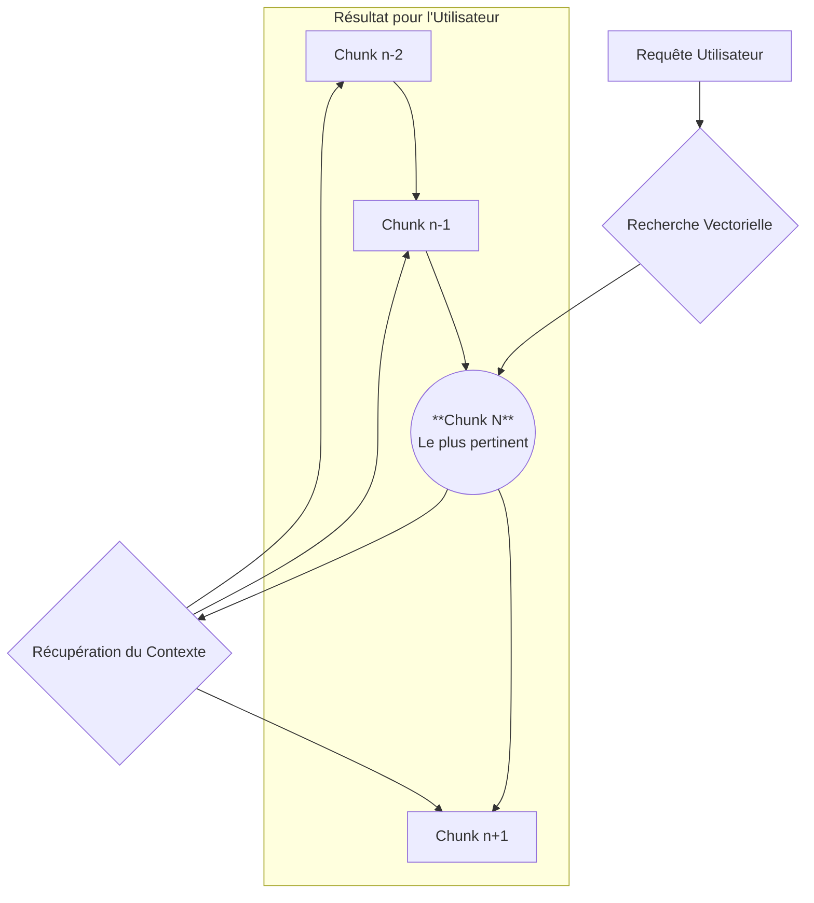

# Stratégie d'Indexation Sémantique Granulaire (SDDD)

## 1. Rapport de Grounding Sémantique

*Cette section résume les conclusions de la phase d'analyse par recherche sémantique, justifiant la nécessité de cette nouvelle conception.*

**Constats Clés :**
- **Indexation Monolithique :** Le système actuel génère un seul vecteur sémantique pour l'ensemble du contenu textuel d'une tâche (`api_conversation_history.json` et `ui_messages.json`).
- **Limites de la Recherche :** La recherche sémantique actuelle retourne des `task_id` complets, sans possibilité d'isoler le passage spécifique qui a déclenché la correspondance. Le contexte retourné est donc global et non spécifique.
- **Métadonnées :** Les métadonnées persistées (`task_metadata.json`) sont riches pour le filtrage (dates, statut, etc.), mais ne contiennent pas d'informations de filiation entre les tâches, ce qui limite la reconstitution de contextes complexes.

**Conclusion :** L'approche monolithique est un obstacle à la recherche de précision. Pour améliorer la pertinence, il est impératif de passer à une indexation granulaire où des "chunks" (fragments) de conversation sont traités comme des unités de recherche indépendantes.

## 2. Stratégie de Découpage ("Chunking") et d'Indexation Sélective

L'unité de base de la navigation dans une tâche est le **"chunk"**. Cependant, tous les chunks ne sont pas destinés à l'indexation sémantique.

**Types de Chunks :**
1.  **`message_exchange` (Indexé)**: Représente un échange de messages (ex: utilisateur/assistant). **Seul ce type de chunk sera vectorisé et indexé dans Qdrant.** Le contenu peut être tronqué pour l'affichage avec un lien vers le contenu complet.
2.  **`tool_interaction` (Non-indexé)**: Représente une interaction avec un outil (commande CLI, appel MCP, lecture de fichier). Ce chunk contient des métadonnées sur l'action mais son contenu (ex: le `stdout` d'une commande) n'est pas indexé pour éviter de saturer l'index avec des données peu pertinentes sémantiquement. Il est stocké pour la navigation et peut être consulté à la demande.
3.  **`task_summary` (Indexé)**: Un résumé de la tâche (titre, objectif) qui sert de méta-description.

**Principe de l'Indexation Sélective :**
Le but est de peupler l'index sémantique uniquement avec le contenu riche et concis des dialogues, tout en conservant la trace complète des actions pour une consultation manuelle.

## 3. Structure des Données et Métadonnées

Chaque **chunk** est un objet JSON. Seuls les chunks indexables seront envoyés à Qdrant.

**Payload (Métadonnées pour tous les chunks) :**
```json
{
  "chunk_id": "unique-chunk-uuid",
  "task_id": "task-12345",
  "parent_task_id": "task-12344",      // Cohérence avec la navigation en arborescence
  "root_task_id": "task-12300",        // Cohérence avec la navigation en arborescence
  "chunk_type": "message_exchange",    // 'message_exchange' ou 'tool_interaction'
  "sequence_order": 15,
  "timestamp": "2023-10-27T10:00:00Z",
  "indexed": true,                     // Booléen contrôlant l'envoi à Qdrant
  "content": "Contenu textuel du message...",
  "content_summary": "Version tronquée du contenu...", // Pour affichage rapide
  "participants": ["user", "assistant"],
  "tool_details": null,                // Ou objet contenant les détails de l'outil
  "custom_tags": []
}
```

**Exemple de `tool_details` pour un chunk `tool_interaction` :**
```json
"tool_details": {
  "tool_name": "execute_command",
  "parameters": { "command": "ls -l" },
  "status": "success",
  "summary": "Listed files in the current directory." // Résumé de l'action
}
```

## 4. Processus d'Indexation "Lazy" (Paresseux)

L'indexation sera déclenchée "paresseusement" pour optimiser les ressources.

1.  **Déclenchement :** L'indexation d'une tâche n'est initiée que lorsqu'elle est inactive depuis un certain temps (ex: 15 minutes) ou lorsqu'elle est explicitement marquée comme "terminée".
2.  **Mise en file d'attente :** Une tâche candidate à l'indexation est ajoutée à une file d'attente interne.
3.  **Traitement par lots :** Un service en arrière-plan traite la file, générant les chunks, calculant les embeddings et les insérant dans Qdrant par lots pour minimiser les appels réseau.
4.  **Mise à jour :** Si une tâche est modifiée après indexation, un processus de ré-indexation est déclenché pour mettre à jour ou remplacer les chunks existants.

## 5. Stratégie de Recherche et Reconstitution

La recherche s'effectuera en deux étapes pour fournir un contexte riche.

**Étape 1 : Recherche du Chunk Initial**
- La requête de l'utilisateur est vectorisée.
- Une recherche est effectuée dans Qdrant pour trouver les **N chunks** les plus pertinents (ex: N=5).

**Étape 2 : Reconstitution du Contexte**
- Pour chaque chunk trouvé, son `task_id` et `sequence_order` sont utilisés.
- Le système récupère les `K` chunks précédents et `M` chunks suivants (ex: K=2, M=1) à partir de la base de données ou d'un cache rapide.
- **Résultat final :** L'utilisateur reçoit une liste de "context windows", chacune contenant le chunk le plus pertinent mis en évidence au milieu de son contexte immédiat.

