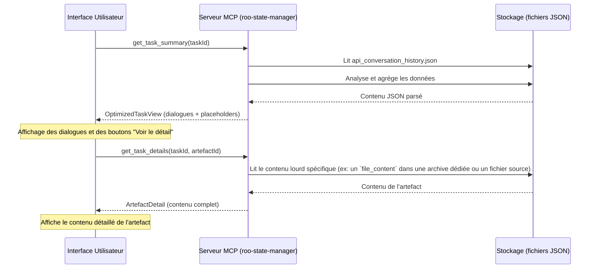

# Conception de la Navigation Optimisée pour les Tâches

Ce document détaille l'architecture de la fonctionnalité de navigation optimisée pour la consultation des tâches dans le MCP `roo-state-manager`.

## 1. Vue d'ensemble

L'objectif est de fournir un chargement rapide des tâches en séparant les dialogues légers des contenus riches (artefacts) qui seront chargés à la demande.

## 2. Modèle de Données

Le modèle s'inspire de la structure existante de `api_conversation_history.json` mais l'adapte pour la hiérarchisation et le chargement différé.

### 2.1. Structure principale : `OptimizedTaskView`

L'objet racine retourné par `get_task_summary`.

```json
{
  "taskId": "task-12345",
  "title": "Analyse des logs de production",
  "metadata": { ... }, // Métadonnées de la tâche (TaskMetadata)
  "conversation": [
    // ... tableau de DialogMessage
  ]
}
```

### 2.2. Le Message de Dialogue : `DialogMessage`

Représente un échange simple (question utilisateur, réponse de l'agent). Il peut contenir des pointeurs vers des contenus lourds.

```json
{
  "id": "msg-abcde",
  "role": "user" | "assistant",
  "content": "Peux-tu lire le contenu du fichier 'logs/errors.log' ?",
  "timestamp": "2023-10-27T10:00:00Z",
  "artefacts": [
    // ... tableau optionnel de ArtefactPlaceholder
  ]
}
```

### 2.3. Le Pointeur d'Artefact : `ArtefactPlaceholder`

C'est une référence légère vers un contenu volumineux.

```json
{
  "artefactId": "artefact-fghij",
  "type": "file_content" | "command_output" | "file_diff" | "image_display",
  "triggeringMessageId": "msg-abcde", // ID du message qui a déclenché cet artefact
  "metadata": {
    // Métadonnées spécifiques au type
    // Pour "file_content": { "path": "logs/errors.log", "size": 12345, "lines": 500 }
    // Pour "command_output": { "command": "ls -l", "exitCode": 0 }
  },
  "summary": "Lecture du fichier 'logs/errors.log' (12.3 Ko)" // Un résumé textuel pour l'affichage
}
```

Lorsque l'assistant répond avec le résultat d'un outil (par exemple, la lecture d'un fichier), le message de l'assistant contiendra une référence à l'artefact correspondant.

**Exemple de message de l'assistant :**
```json
{
  "id": "msg-klmno",
  "role": "assistant",
  "content": "J'ai lu le fichier. Il contient 500 lignes.",
  "timestamp": "2023-10-27T10:00:05Z",
  "artefacts": [
    {
      "artefactId": "artefact-fghij",
      "type": "file_content",
      "triggeringMessageId": "msg-abcde",
      "metadata": {
        "path": "logs/errors.log",
        "size": 12345,
        "lines": 500
      },
      "summary": "Contenu de 'logs/errors.log' (12.3 Ko)"
    }
  ]
}
```

Cette structure permet à l'interface de n'afficher que le dialogue et les résumés des artefacts. Un clic sur le résumé déclenchera un appel à `get_task_details` avec l'`artefactId`.

## 3. API du MCP

Deux nouvelles méthodes sont introduites dans le serveur MCP `roo-state-manager`.

### 3.1. `get_task_summary(taskId: string)`

Cette méthode récupère la vue d'ensemble d'une tâche. Elle est conçue pour être rapide et légère, en ne retournant que la structure de la conversation et les pointeurs vers les artefacts.

*   **Arguments :**
    *   `taskId` (string, requis) : L'identifiant unique de la tâche.
*   **Retourne :** Un objet `OptimizedTaskView`.

**Exemple de réponse JSON pour `get_task_summary` :**

```json
{
  "taskId": "task-b7a8f6e",
  "title": "Debug issue in production",
  "metadata": {
    "createdAt": "2023-10-27T09:58:00Z",
    "updatedAt": "2023-10-27T10:05:00Z",
    "status": "active",
    "totalMessages": 4
  },
  "conversation": [
    {
      "id": "msg-001",
      "role": "user",
      "content": "I'm seeing a lot of errors in the logs. Can you check 'logs/prod-api-errors.log'?",
      "timestamp": "2023-10-27T10:00:00Z",
      "artefacts": []
    },
    {
      "id": "msg-002",
      "role": "assistant",
      "content": "Certainly. I will read the file now.",
      "timestamp": "2023-10-27T10:00:05Z",
      "artefacts": []
    },
    {
      "id": "msg-003",
      "role": "assistant",
      "content": "I have read the file. It contains 1,258 lines, mostly timeout exceptions. Here is the content.",
      "timestamp": "2023-10-27T10:01:15Z",
      "artefacts": [
        {
          "artefactId": "artefact-e5c1a",
          "type": "file_content",
          "triggeringMessageId": "msg-001",
          "metadata": {
            "path": "logs/prod-api-errors.log",
            "size": 87432,
            "lines": 1258
          },
          "summary": "Content of 'logs/prod-api-errors.log' (87.4 KB)"
        }
      ]
    }
  ]
}
```

### 3.2. `get_task_details(taskId: string, artefactId: string)`

Cette méthode récupère le contenu complet et potentiellement lourd d'un artefact spécifique, identifié par son `artefactId`.

*   **Arguments :**
    *   `taskId` (string, requis) : L'identifiant de la tâche parente.
    *   `artefactId` (string, requis) : L'identifiant de l'artefact à récupérer.
*   **Retourne :** Un objet `ArtefactDetail`.

**Exemple de réponse JSON pour `get_task_details` :**

```json
{
  "artefactId": "artefact-e5c1a",
  "taskId": "task-b7a8f6e",
  "type": "file_content",
  "metadata": {
    "path": "logs/prod-api-errors.log",
    "size": 87432,
    "lines": 1258
  },
  "content": "2023-10-27 09:59:01,ERROR,TimeoutException: Timed out waiting for response from service-auth\n2023-10-27 09:59:03,ERROR,TimeoutException: Timed out waiting for response from service-auth\n..."
}
```

## 4. Interaction Utilisateur (UI/UX)

Le parcours utilisateur dans la webview de consultation d'une tâche sera le suivant :

1.  **Chargement Initial :** L'utilisateur ouvre une tâche. La webview appelle `get_task_summary(taskId)`.
2.  **Affichage Résumé :** L'interface affiche l'intégralité des messages de dialogue (`DialogMessage`). Pour chaque artefact trouvé dans les messages, elle affiche le `summary` (ex: "Contenu de 'logs/prod-api-errors.log' (87.4 KB)") sous forme d'un bloc cliquable (par exemple, un bouton "Voir le contenu").
3.  **Consultation à la Demande :** L'utilisateur clique sur le bouton "Voir le contenu" d'un artefact.
4.  **Appel de Détail :** La webview appelle la méthode `get_task_details(taskId, artefactId)` en utilisant l'ID de l'artefact.
5.  **Affichage du Détail :** Une fois les données reçues, l'interface affiche le contenu complet de l'artefact (par exemple, dans un bloc de code `pre`, une visionneuse d'image, etc.) directement sous le placeholder, ou dans un modal.

Cette approche garantit un temps de chargement initial très court, même pour des tâches contenant des dizaines de mégaoctets de données, tout en donnant un accès complet à l'information lorsque c'est nécessaire.

## 5. Diagramme de Séquence

