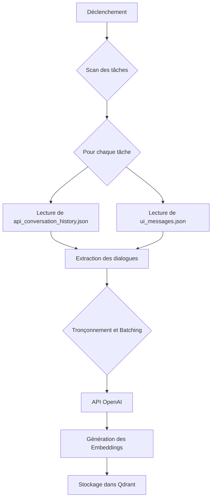

# Conception de la Recherche Sémantique pour les Tâches

Ce document détaille l'architecture et le fonctionnement de la fonctionnalité de recherche sémantique dans l'historique des tâches pour le MCP `roo-state-manager`.

## 1. Vue d'ensemble

L'objectif est de permettre aux utilisateurs de retrouver des tâches passées en se basant sur le sens de leurs requêtes plutôt que sur des mots-clés exacts. Le processus s'articule autour de deux axes principaux :

1.  **L'indexation :** Un processus en arrière-plan qui scanne les conversations, en extrait les dialogues pertinents, les transforme en vecteurs sémantiques (embeddings) et les stocke dans une base de données vectorielle (Qdrant).
2.  **La recherche :** Une nouvelle API exposée par le MCP qui transforme la requête de l'utilisateur en vecteur et interroge la base de données pour trouver les dialogues les plus similaires.

## 2. Flux d'Indexation

Le flux d'indexation est conçu pour être efficace et ciblé, en se concentrant uniquement sur le contenu conversationnel pour minimiser les coûts et la taille de l'index.



### 2.1. Extraction des dialogues

L'extraction sera réalisée en modifiant ou en s'inspirant de la méthode `analyzeConversation` dans `RooStorageDetector`. Le but est de ne garder que le contenu textuel des échanges.

-   **Source :** `api_conversation_history.json` et `ui_messages.json`.
-   **Filtrage :** Seuls les messages avec un `role` "user" ou "assistant" (ou équivalent) seront conservés. Les messages système, les résultats d'outils bruts et autres données non conversationnelles seront ignorés.

**Exemple de contenu extrait (pseudo-code) :**
```json
[
  "Utilisateur: Comment je peux créer un serveur MCP ?",
  "Assistant: Tu peux utiliser la commande `npx @modelcontextprotocol/create`...",
  "Utilisateur: Super, merci !"
]
```

### 2.2. Génération des Embeddings

Les lots de dialogues extraits seront envoyés à l'API OpenAI (modèle `text-embedding-ada-002` ou plus récent) pour la vectorisation. Les clés d'API seront lues depuis le fichier `.env` du MCP.

### 2.3. Structure des données dans Qdrant

Chaque dialogue ou groupe de dialogues sera stocké comme un point dans une collection Qdrant dédiée.

**Nom de la collection :** `roo_tasks_semantic_index`

**Schéma du point :**
```json
{
  "id": "uuid-unique-pour-le-chunk",
  "vector": [0.123, 0.456, ...], // Vecteur de l'embedding
  "payload": {
    "task_id": "8a5d3e2b-7f8c-4a3b-9e1d-0f2c6a4b8e9c",
    "source_file": "api_conversation_history.json",
    "timestamp": 1679600000, // Timestamp du message ou de la tâche
    "dialogue_snippet": "Utilisateur: Comment je peux créer un serveur MCP ? Assistant: Tu peux utiliser la commande...",
    "user": "user-id-si-disponible" // Pour de futures extensions multi-utilisateurs
  }
}
```

## 3. API de Recherche

Une nouvelle fonction sera ajoutée au `RooStateManagerServer` pour gérer les recherches.

### 3.1. Contrat de l'outil MCP

**Nom de l'outil :** `search_tasks_semantic`

**Description :** Recherche sémantiquement dans les conversations des tâches passées.

**Schéma d'entrée :**
```json
{
  "type": "object",
  "properties": {
    "query": {
      "type": "string",
      "description": "La requête de recherche en langage naturel."
    },
    "date_range": {
      "type": "object",
      "properties": {
        "start_date": {
          "type": "string",
          "format": "date-time",
          "description": "Date de début (ISO 8601)"
        },
        "end_date": {
          "type": "string",
          "format": "date-time",
          "description": "Date de fin (ISO 8601)"
        }
      },
      "description": "Filtre optionnel pour restreindre la recherche à une période."
    },
    "limit": {
      "type": "number",
      "default": 10,
      "description": "Nombre maximum de résultats à retourner."
    }
  },
  "required": ["query"]
}
```

### 3.2. Flux de la recherche

```mermaid
graph TD
    A[Requête Utilisateur] --> B{API search_tasks_semantic};
    B --> C[Vectorisation de la requête via OpenAI];
    B --> D[Construction du filtre Qdrant (dates)];
    C --> E{Requête à Qdrant};
    D --> E;
    E --> F[Récupération des points similaires];
    F --> G[Agrégation et formatage des résultats];
    G --> H[Réponse à l'utilisateur];
```

Les résultats contiendront des informations agrégées par `task_id`, incluant les extraits de dialogue les plus pertinents qui ont correspondu à la recherche.