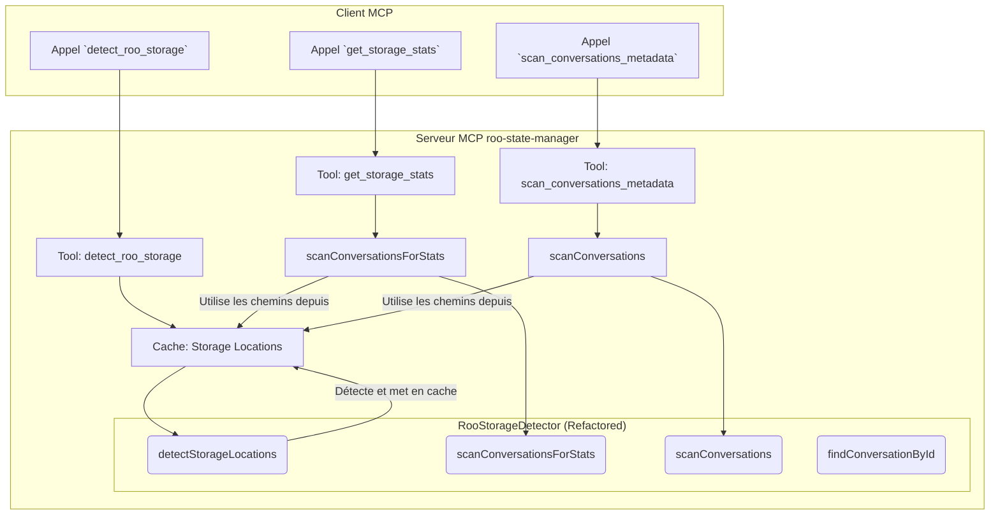

# Plan de Refactoring pour le MCP `roo-state-manager`

**Auteur:** Roo, Architecte Technique
**Date:** 2025-07-24
**Statut:** En cours de rédaction

## 1. Contexte et Analyse du Problème

L'outil MCP `detect_roo_storage` du serveur `roo-state-manager` est actuellement la source d'une instabilité critique. Lors de son exécution, il tente de charger et de retourner l'intégralité des données de toutes les conversations Roo détectées sur le système de l'utilisateur. Avec une base de plusieurs milliers de conversations, ce volume de données dépasse systématiquement la limite de contexte du client, provoquant un crash de la connexion MCP.

### 1.1. Cause Racine

L'analyse du code source, notamment des fichiers `index.ts` et `utils/roo-storage-detector.ts`, a révélé que le problème provient d'une mauvaise conception architecturale :

- **Fusion de responsabilités :** La méthode `RooStorageDetector.detectRooStorage` est une fonction monolithique qui exécute deux tâches distinctes et coûteuses :
    1.  **La détection des chemins de stockage :** Parcourir le système de fichiers pour trouver les répertoires contenant les données de Roo.
    2.  **L'analyse exhaustive du contenu :** Lire et parser les fichiers JSON (`api_conversation_history.json`, `ui_messages.json`, `task_metadata.json`) de **chaque** conversation pour en extraire des métadonnées détaillées.

- **Non-scalabilité :** Cette approche ne passe pas à l'échelle. Le temps de réponse et la taille de la charge utile augmentent linéairement avec le nombre de conversations, rendant l'outil inutilisable sur des installations matures.

- **Appels redondants et inefficaces :** Plusieurs autres outils aggravent le problème en appelant cette méthode coûteuse pour des besoins simples :
    - `get_storage_stats` et `find_conversation` appellent `detectRooStorage` et chargent toutes les conversations en mémoire, alors qu'ils n'ont besoin que de métadonnées agrégées ou d'une seule conversation.
    - `list_conversations` effectue son propre appel à `detectRooStorage`, créant une redondance complète.

## 2. Objectifs du Refactoring

L'objectif est de transformer cette architecture fragile en un système robuste, performant et scalable.

1.  **Performance :** Réduire drastiquement le temps de réponse et l'utilisation mémoire des outils, en particulier pour `detect_roo_storage`.
2.  **Scalabilité :** Garantir que les performances restent acceptables même avec des dizaines de milliers de conversations.
3.  **Clarté et Maintenabilité :** Séparer clairement les responsabilités pour rendre le code plus facile à comprendre, à maintenir et à faire évoluer.
4.  **Efficacité :** Éliminer les calculs redondants en partageant un cache d'informations de base (comme la liste des chemins de stockage).

## 3. Nouvelle Architecture Proposée

La clé de la nouvelle architecture est la **séparation stricte entre la détection des emplacements et l'analyse du contenu**.



### 3.1. Description du Flux

1.  **Détection et Mise en Cache des Emplacements (`detectStorageLocations`) :**
    - Une nouvelle méthode, `detectStorageLocations`, sera responsable **uniquement** de trouver les chemins (`tasksPath`) où les conversations sont stockées.
    - Le résultat (une simple liste de chaînes de caractères) sera léger et rapide à obtenir.
    - Ce résultat sera mis en cache (en mémoire du serveur) pour une durée raisonnable (ex: 5 minutes) afin d'éviter des scans répétés du système de fichiers.
    - Le nouvel outil `detect_roo_storage` appellera cette méthode et ne retournera que la liste des chemins.

2.  **Scan à la Demande :**
    - Des méthodes de scan spécialisées seront créées pour répondre à des besoins spécifiques, en prenant un chemin de stockage en paramètre.
    - `scanConversationsForStats(storagePath)` : Scannera un répertoire pour en extraire uniquement les statistiques (nombre, taille, dates) sans lire le contenu complet des fichiers.
    - `scanConversations(storagePath, filters)` : Scannera un répertoire pour retourner les métadonnées de base des conversations (ID, titre, date, etc.), avec des options de pagination et de tri.

3.  **Modification des Outils Existants :**
    - `detect_roo_storage` (sémantique modifiée) : Retournera maintenant uniquement la liste des chemins de stockage détectés depuis le cache. Rapide et léger.
    - `get_storage_stats` : Appellera d'abord `detectStorageLocations`, puis `scanConversationsForStats` sur chaque chemin pour agréger les résultats.
    - `find_conversation` : Devient plus intelligent. Il utilisera `detectStorageLocations` pour trouver les chemins, puis cherchera le répertoire avec le `taskId` correspondant, et n'analysera que cette conversation spécifique.
    - `list_conversations` : Sera refactorisé pour utiliser `detectStorageLocations` puis `scanConversations` de manière paginée.

## 4. Nouvelles Signatures de Méthodes

Voici les nouvelles méthodes proposées pour la classe `RooStorageDetector`.

```typescript
class RooStorageDetector {
    /**
     * Détecte les chemins de stockage Roo et les met en cache.
     * Ne retourne qu'une liste de chemins vers les répertoires 'tasks'.
     * Rapide et léger.
     */
    public static async detectStorageLocations(): Promise<string[]>;

    /**
     * Scanne un répertoire de tâches pour en extraire des statistiques agrégées.
     * Ne lit pas le contenu complet des fichiers, se base sur fs.stat.
     */
    public static async getStatsForPath(storagePath: string): Promise<{ count: number; totalSize: number; lastActivity: Date }>;

    /**
     * Scanne un répertoire de tâches et retourne une liste paginée de métadonnées de conversation.
     * Le scan du contenu est limité au strict nécessaire (ex: task_metadata.json).
     */
    public static async scanConversationsMetadata(
        storagePath: string,
        options: { limit: number; offset: number; sortBy: string; sortOrder: 'asc'|'desc' }
    ): Promise<ConversationSummary[]>;

    /**
     * Trouve et analyse une seule conversation par son ID.
     * C'est la méthode la plus efficace pour obtenir les détails d'une conversation.
     */
    public static async findConversationById(taskId: string): Promise<ConversationSummary | null>;
}
```

## 5. Plan de Migration et Modification des Outils

La transition se fera en modifiant les gestionnaires d'outils dans `index.ts`.

1.  **`handleDetectRooStorage` :**
    - Appelle `RooStorageDetector.detectStorageLocations()`.
    - Retourne la liste des chemins.
    - **Le contrat de l'outil `detect_roo_storage` change.**

2.  **`handleGetStorageStats` :**
    - Récupère les chemins via `RooStorageDetector.detectStorageLocations()`.
    - Itère sur chaque chemin et appelle `RooStorageDetector.getStatsForPath()`.
    - Agrège les résultats et les retourne.

3.  **`handleFindConversation` :**
    - Appelle directement `RooStorageDetector.findConversationById(taskId)`.
    - C'est un changement radical qui améliore considérablement les performances.

4.  **`handleListConversations` :**
    - Récupère les chemins via `RooStorageDetector.detectStorageLocations()`.
    - Appelle `RooStorageDetector.scanConversationsMetadata()` sur les chemins, en appliquant le tri et la pagination.

## 6. Impact sur le Client et Communication

Le changement le plus important concerne l'outil `detect_roo_storage`. Sa sémantique change : **il ne retourne plus les conversations, mais seulement les chemins où elles se trouvent.**

- **Communication :** Ce changement doit être clairement documenté dans le `changelog.md` et dans la description de l'outil.
- **Nouvel outil :** Pour conserver la fonctionnalité de "tout scanner" (utile pour le débogage ou des migrations), un nouvel outil `scan_all_conversations` pourrait être introduit, mais il serait clairement marqué comme coûteux et déprécié pour un usage général.

Ce plan permet de résoudre le problème de performance de manière structurelle tout en posant les bases d'un module plus robuste et maintenable.