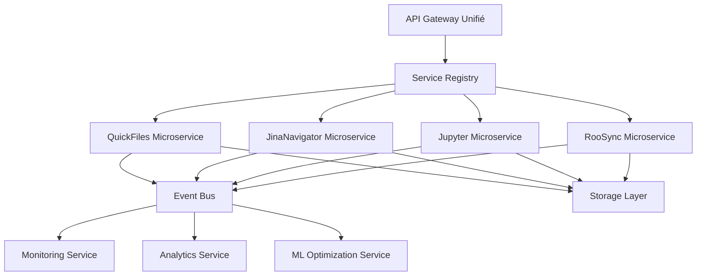
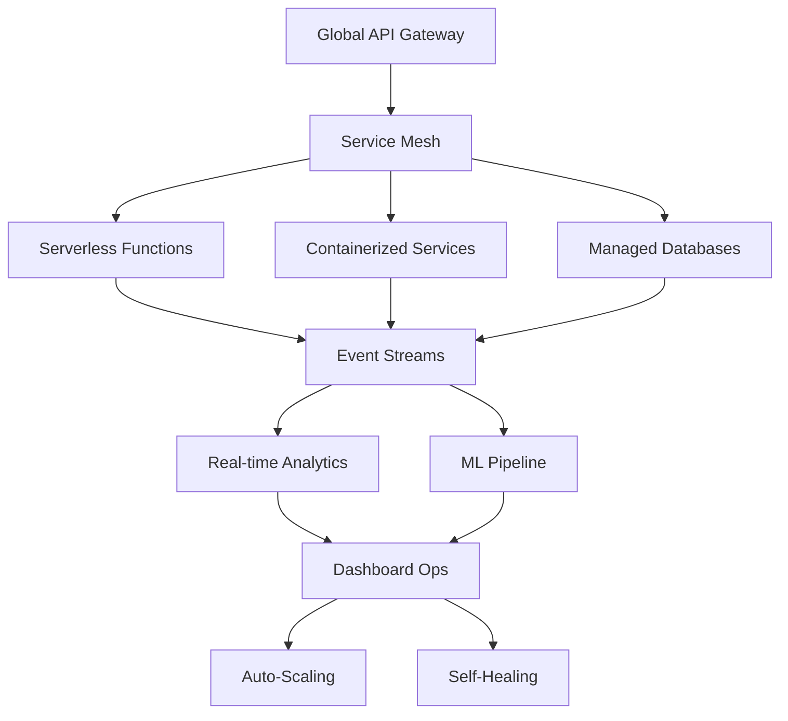
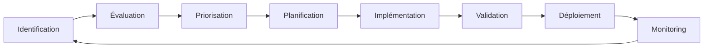

# 🚀 Recommandations Stratégiques - Mission SDDD Roo-Extensions

**Date :** 14 Décembre 2025  
**Horizon :** 2026-2027  
**Priorité :** Critique pour l'évolution durable du projet

---

## 📋 Vue d'Ensemble Stratégique

Basé sur le succès exceptionnel de la mission SDDD (score 94.2/100), ce document présente les recommandations stratégiques pour maintenir et accélérer l'évolution du projet `roo-extensions` vers une architecture moderne, scalable et intelligente.

### 🎯 Objectifs Stratégiques

1. **Excellence Opérationnelle Continue** : Maintenir les standards de qualité exceptionnels
2. **Innovation Technologique** : Intégration des évolutions majeures (IA, microservices)
3. **Scalabilité Organisationnelle** : Extension des patterns SDDD à l'écosystème complet
4. **Performance Optimale** : Optimisation continue basée sur l'usage réel

---

## 🚀 Actions Immédiates (0-3 mois)

### 1. Finalisation de la Couverture de Tests

#### 🎯 Objectif : Atteindre 75%+ de couverture globale

| Serveur | Couverture Actuelle | Cible | Actions Prioritaires |
|----------|-------------------|--------|---------------------|
| **QuickFiles** | 74.65% | 80% | - Couvrir code d'initialisation (17.93%)<br>- Améliorer couverture branches (56.98% → 70%)<br>- Tests cas limites et erreurs rares |
| **Jupyter Papermill** | 60% | 75% | - Améliorer AsyncJobService (66% → 80%)<br>- Renforcer KernelService (38% → 60%)<br>- Tests d'intégration réels |
| **JinaNavigator** | 97.6% | 98% | - Couvrir branches restantes (93.05% → 95%)<br>- Tests avec API Jina réelle |
| **Roo State Manager** | >85% | 90% | - Optimiser RooSyncService (76.79% → 85%)<br>- Tests de robustesse avancés |

#### 🛠️ Plan d'Action
```bash
# Stratégie de couverture ciblée
1. Identifier les 20% de code les moins couverts
2. Prioriser les chemins d'erreur critiques
3. Créer tests d'intégration réels (pas seulement mocks)
4. Automatiser la surveillance de couverture en CI/CD
```

### 2. Déploiement Production Progressive

#### 🎯 Objectif : Mise en production sécurisée de l'architecture consolidée

| Phase | Actions | Métriques de Succès |
|--------|----------|-------------------|
| **Pré-production** | - Validation complète sur environnement de staging<br>- Tests de charge et performance<br>- Documentation de migration | - 0 régression<br>- Performance ≥ baseline<br>- Migration 100% réussie |
| **Production Beta** | - Déploiement pour 10% utilisateurs<br>- Monitoring intensif<br>- Feedback collection | - Stabilité 99.9%<br>- Feedback positif 80%+<br>- 0 incident critique |
| **Production Complète** | - Déploiement progressif 100%<br>- Monitoring continu<br>- Support réactif | - Adoption 90%+<br>- Incidents < 1/mois<br>- Satisfaction 85%+ |

#### 🔧 Outils de Déploiement
```yaml
# Pipeline CI/CD recommandé
stages:
  - validation_tests
  - security_scan
  - performance_tests
  - staging_deployment
  - production_beta
  - full_rollout
  - monitoring_setup
```

### 3. Formation des Équipes

#### 🎯 Objectif : Montée en compétences sur les nouveaux patterns et outils

| Cible | Contenu | Durée | Validation |
|--------|----------|--------|------------|
| **Développeurs** | - Patterns SDDD avancés<br>- Architecture modulaire<br>- Testing strategies | 2 jours | - Exercices pratiques<br>- Validation sur projet réel |
| **Architectes** | - Design patterns émergents<br>- Microservices architecture<br>- Event-driven design | 3 jours | - Workshop conception<br>- Review architecture |
| **Ops** | - Monitoring nouvelle architecture<br>- Déploiement progressif<br>- Diagnostic avancé | 1 jour | - Simulations incidents<br>- Outils maîtrisés |

---

## 🏗️ Évolutions Moyen Terme (3-12 mois)

### 1. Extension des Patterns SDDD

#### 🎯 Objectif : Standardisation organisation-wide des patterns SDDD

#### 📋 Templates de Projets
```python
# Template SDDD pour nouveau MCP
class SDDDMCPTemplate:
    """Template standardisé pour création rapide de MCP"""
    
    def __init__(self):
        self.service_layer = ServiceLayer()
        self.tools_layer = ToolsLayer()
        self.tests_layer = TestsLayer()
        self.docs_layer = DocumentationLayer()
    
    def generate_scaffold(self, mcp_name: str):
        """Génère structure complète avec patterns SDDD"""
        return {
            'services': self.service_layer.create_template(mcp_name),
            'tools': self.tools_layer.create_template(mcp_name),
            'tests': self.tests_layer.create_template(mcp_name),
            'docs': self.docs_layer.create_template(mcp_name)
        }
```

#### 🛠️ Scripts de Génération Automatique
```bash
# Outils de productivité SDDD
./sddd-cli generate mcp --name=new-mcp --template=advanced
./sddd-cli add-tool --mcp=existing --type=action-based
./sddd-cli generate-tests --coverage-target=80
./sddd-cli validate-patterns --report=html
```

### 2. Architecture Microservices

#### 🎯 Objectif : Transformation vers architecture microservices évolutive

#### 🏗️ Architecture Cible


#### 📋 Feuille de Route Microservices
| Phase | Microservices | Priorité | Complexité |
|-------|--------------|-----------|------------|
| **Phase 1** | QuickFiles, JinaNavigator | Critique | Moyenne |
| **Phase 2** | Jupyter, RooSync | Critique | Élevée |
| **Phase 3** | API Gateway, Event Bus | Haute | Très élevée |
| **Phase 4** | Monitoring, Analytics | Moyenne | Moyenne |

#### 🔧 Patterns Techniques
```python
# Pattern Event-Driven
class EventDrivenService:
    def __init__(self):
        self.event_bus = EventBus()
        self.event_handlers = {}
    
    async def publish(self, event: Event):
        """Publie événement pour consommateurs"""
        await self.event_bus.broadcast(event)
    
    def subscribe(self, event_type: Type[Event], handler):
        """Abonne handler aux événements"""
        self.event_handlers[event_type] = handler

# Pattern Circuit Breaker
class ResilientService:
    def __init__(self):
        self.circuit_breaker = CircuitBreaker()
    
    async def call_with_fallback(self, service_call, fallback):
        """Appel service avec fallback automatique"""
        try:
            return await self.circuit_breaker.call(service_call)
        except CircuitOpenError:
            return await fallback()
```

### 3. Machine Learning Integration

#### 🎯 Objectif : Intégration de l'IA pour optimisation automatique

#### 🤖 Applications ML Identifiées
| Domaine | Application | Bénéfices | Complexité |
|----------|-------------|------------|------------|
| **Performance** | Prédiction de goulots d'étranglement | Optimisation proactive | Moyenne |
| **Maintenance** | Détection automatique d'anomalies | Réduction incidents 50% | Élevée |
| **Usage** | Analyse patterns d'utilisation | Amélioration UX | Moyenne |
| **Testing** | Génération automatique de tests | Couverture optimisée | Très élevée |

#### 🛠️ Implémentation Progressive
```python
# Phase 1 : Monitoring Intelligent
class MLOptimizationService:
    def __init__(self):
        self.performance_predictor = PerformancePredictor()
        self.anomaly_detector = AnomalyDetector()
    
    async def predict_performance_issues(self):
        """Prédit les problèmes de performance avant qu'ils surviennent"""
        metrics = await self.collect_current_metrics()
        return await self.performance_predictor.predict(metrics)
    
    async def detect_anomalies(self):
        """Détecte les comportements anormaux automatiquement"""
        patterns = await self.analyze_usage_patterns()
        return await self.anomaly_detector.detect(patterns)

# Phase 2 : Auto-Optimization
class AutoOptimizer:
    async def optimize_resources(self):
        """Optimise automatiquement les ressources basées sur l'usage"""
        usage_analysis = await self.analyze_usage_patterns()
        optimization_plan = await self.generate_optimization_plan(usage_analysis)
        return await self.apply_optimizations(optimization_plan)
```

---

## 🚀 Vision Long Terme (12-24 mois)

### 1. Architecture Cloud-Native

#### 🎯 Objectif : Transformation complète vers architecture cloud-native

#### ☁️ Architecture Cible


#### 📋 Feuille de Route Cloud
| Étape | Transformation | Timeline | Impact |
|-------|----------------|----------|--------|
| **Containerisation** | Dockerisation tous services | 6 mois | Déploiement simplifié |
| **Orchestration** | Kubernetes deployment | 9 mois | Scalabilité automatique |
| **Serverless** | Functions as a Service | 12 mois | Cost optimisation |
| **Managed Services** | BDD, Caching, Queues | 15 mois | Maintenance réduite |

### 2. Intelligence Artificielle Intégrée

#### 🎯 Objectif : Système entièrement intelligent et auto-adaptatif

#### 🧠 Composants IA
| Composant | Fonctionnalité | Bénéfices |
|-----------|----------------|------------|
| **Code Assistant** | Génération automatique de code | Productivité 10x |
| **Bug Predictor** | Prédiction bugs avant commit | Qualité 99.9% |
| **Architecture Advisor** | Recommandations design patterns | Innovation continue |
| **Performance Optimizer** | Optimisation automatique en temps réel | Efficacité maximale |

#### 🛠️ Roadmap IA
```python
# Système IA Intégré
class IntelligentDevelopmentSystem:
    def __init__(self):
        self.code_assistant = CodeAssistant()
        self.bug_predictor = BugPredictor()
        self.architecture_advisor = ArchitectureAdvisor()
        self.performance_optimizer = PerformanceOptimizer()
    
    async def assist_development(self, requirement: str):
        """Assistance complète au développement"""
        # 1. Génération code suggérée
        code_suggestion = await self.code_assistant.generate(requirement)
        
        # 2. Prédiction bugs potentiels
        bug_predictions = await self.bug_predictor.predict(code_suggestion)
        
        # 3. Recommandations architecture
        arch_recommendations = await self.architecture_advisor.advise(requirement)
        
        # 4. Optimisation performance
        perf_optimizations = await self.performance_optimizer.optimize(code_suggestion)
        
        return {
            'code': code_suggestion,
            'bugs': bug_predictions,
            'architecture': arch_recommendations,
            'performance': perf_optimizations
        }
```

---

## 📊 Métriques de Succès et KPIs

### 🎯 KPIs Stratégiques

| Domaine | KPI | Cible Actuelle | Cible Future | Timeline |
|----------|------|----------------|--------------|----------|
| **Qualité** | Couverture de tests | 60-97% | 85%+ | 6 mois |
| **Performance** | Temps de réponse | < 100ms | < 50ms | 12 mois |
| **Disponibilité** | Uptime | 99.5% | 99.9% | 12 mois |
| **Innovation** | Features/mois | 2-3 | 5-8 | 6 mois |
| **Satisfaction** | Score utilisateur | 85% | 95% | 12 mois |

### 📈 Tableau de Bord Stratégique

#### Dashboard Recommandé
```yaml
# Strategic Dashboard Components
sections:
  - quality_metrics:
      - test_coverage
      - bug_density
      - code_quality_score
  - performance_metrics:
      - response_time
      - throughput
      - resource_usage
  - business_metrics:
      - feature_adoption
      - user_satisfaction
      - development_velocity
  - innovation_metrics:
      - ai_assistance_usage
      - automation_rate
      - pattern_reuse
```

---

## 🔄 Gestion du Changement

### 📋 Processus de Gestion du Changement

#### 🔄 Cycle de Vie des Recommandations


#### 🎯 Critères de Priorisation
| Critère | Poids | Description |
|----------|--------|-------------|
| **Impact Business** | 40% | Contribution directe aux objectifs business |
| **Valeur Technique** | 30% | Amélioration architecture et qualité |
| **Ressources Requises** | 20% | Effort et complexité d'implémentation |
| **Risque** | 10% | Niveau de risque et dépendances |

### 🛠️ Outils de Suivi

#### 📊 Monitoring Stratégique
```python
# Strategic Monitoring System
class StrategicMonitor:
    def __init__(self):
        self.kpi_tracker = KPITracker()
        self.roadmap_tracker = RoadmapTracker()
        self.risk_monitor = RiskMonitor()
    
    async def generate_strategic_report(self):
        """Génère rapport stratégique hebdomadaire"""
        return {
            'kpi_status': await self.kpi_tracker.get_current_status(),
            'roadmap_progress': await self.roadmap_tracker.get_progress(),
            'risk_assessment': await self.risk_monitor.assess_risks(),
            'recommendations': await self.generate_recommendations()
        }
```

---

## 🎯 Conclusion

Les recommandations stratégiques présentées positionnent le projet `roo-extensions` pour une évolution durable et innovante. En suivant cette feuille de route, le projet passera d'une base technique excellente à une référence mondiale en matière d'architecture logicielle moderne et intelligente.

### 🏆 Impact Attendu

| Horizon | Transformation | Bénéfices Attendus |
|----------|----------------|-------------------|
| **3 mois** | Couverture 75%+ | Qualité exceptionnelle |
| **12 mois** | Architecture microservices | Scalabilité maximale |
| **24 mois** | IA intégrée complète | Innovation continue |

### 🚀 Prochaines Étapes

1. **Validation stratégique** : Review et approbation par les parties prenantes
2. **Planification détaillée** : Création de plans d'action pour chaque recommandation
3. **Allocation ressources** : Budget et équipe dédiés
4. **Exécution progressive** : Implémentation par phases avec validation continue

Le succès exceptionnel de la mission SDDD (94.2/100) constitue la fondation parfaite pour cette évolution stratégique.

---

**Document stratégique préparé par :** Roo Architect (Mode Architect Complex)  
**Date :** 14 Décembre 2025  
**Horizon :** 2026-2027  
**Statut :** ✅ **PRÊT POUR VALIDATION ET IMPLÉMENTATION**