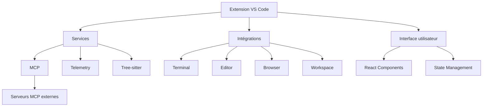

# Documentation du sous-module roo-code

## Table des matières

1. [Introduction](#introduction)
2. [Vue d'ensemble](#vue-densemble)
3. [Structure du projet](#structure-du-projet)
4. [Composants principaux](#composants-principaux)
5. [Flux de travail et interactions](#flux-de-travail-et-interactions)
6. [Dépendances et technologies](#dépendances-et-technologies)
7. [Architecture](#architecture)
8. [Intégration avec d'autres modules](#intégration-avec-dautres-modules)
9. [Guide d'utilisation](#guide-dutilisation)

## Introduction

Roo Code est une extension VS Code qui fonctionne comme un agent de codage autonome alimenté par l'IA. Elle permet aux utilisateurs de communiquer en langage naturel, de lire et écrire des fichiers, d'exécuter des commandes dans le terminal, d'automatiser des actions de navigateur, et de s'intégrer avec des API/modèles OpenAI ou personnalisés.

Ce sous-module constitue le cœur de l'extension Roo Code, fournissant toutes les fonctionnalités nécessaires pour interagir avec les modèles d'IA, gérer les modes de fonctionnement, et faciliter l'interaction avec l'environnement de développement de l'utilisateur.

## Vue d'ensemble

Roo Code est conçu comme une extension VS Code qui agit comme un assistant de développement intelligent. Ses principales caractéristiques sont :

- **Communication en langage naturel** : Interaction avec l'utilisateur via une interface de chat
- **Manipulation de fichiers** : Lecture et écriture directe dans l'espace de travail
- **Exécution de commandes** : Lancement de commandes dans le terminal VS Code
- **Automatisation de navigateur** : Contrôle d'un navigateur pour des tâches web
- **Intégration avec des modèles d'IA** : Support pour OpenAI, Anthropic, et d'autres fournisseurs d'IA
- **Modes personnalisables** : Adaptation du comportement et des capacités via des modes spécialisés
- **Protocole MCP (Model Context Protocol)** : Extension des capacités via des serveurs externes

L'extension est conçue pour être hautement extensible et personnalisable, permettant aux utilisateurs d'adapter son comportement à leurs besoins spécifiques.

## Structure du projet

Le sous-module roo-code est organisé en plusieurs répertoires principaux :

```
roo-code/
├── assets/            # Ressources graphiques et médias
├── audio/            # Fichiers audio pour les notifications
├── docs/             # Documentation
├── e2e/              # Tests end-to-end
├── evals/            # Outils d'évaluation
├── locales/          # Fichiers de traduction
├── scripts/          # Scripts utilitaires
├── src/              # Code source principal
│   ├── activate/     # Logique d'activation de l'extension
│   ├── api/          # API publique
│   ├── core/         # Fonctionnalités principales
│   ├── exports/      # Exports pour l'API
│   ├── i18n/         # Internationalisation
│   ├── integrations/ # Intégrations avec VS Code et autres systèmes
│   ├── schemas/      # Schémas de validation
│   ├── services/     # Services (MCP, telemetry, etc.)
│   ├── shared/       # Code partagé
│   └── utils/        # Utilitaires
└── webview-ui/       # Interface utilisateur React
    ├── public/       # Ressources statiques
    └── src/          # Code source de l'interface
        ├── context/  # Contextes React
        ├── i18n/     # Internationalisation UI
        ├── lib/      # Bibliothèques
        ├── oauth/    # Authentification OAuth
        ├── stories/  # Storybook components
        └── utils/    # Utilitaires UI
```

### Fichiers de configuration principaux

- **package.json** : Configuration principale du projet, dépendances et scripts
- **tsconfig.json** : Configuration TypeScript
- **vitest.config.ts** : Configuration des tests Vitest
- **esbuild.js** : Configuration de build avec esbuild

## Composants principaux

### 1. Extension VS Code (Core)

Le point d'entrée principal de l'extension est `src/extension.ts`, qui gère l'activation et la désactivation de l'extension. Les principales responsabilités incluent :

- Initialisation des services (telemetry, i18n, terminal)
- Enregistrement des commandes et actions
- Configuration des vues webview
- Exposition de l'API publique

### 2. Gestionnaire de modes

Le système de modes est défini dans `src/shared/modes.ts`. Il permet à l'extension de changer de comportement en fonction du contexte ou des besoins de l'utilisateur. Les modes principaux sont :

- **Code** : Pour les tâches de codage générales
- **Architect** : Pour la planification et le leadership technique
- **Ask** : Pour répondre aux questions et fournir des informations
- **Debug** : Pour le diagnostic systématique des problèmes
- **Orchestrator** : Pour coordonner des tâches complexes

Chaque mode définit :
- Un slug unique
- Un nom d'affichage
- Une définition de rôle (instructions pour l'IA)
- Des groupes d'outils autorisés
- Des instructions personnalisées optionnelles

Le gestionnaire de modes permet également de créer des modes personnalisés qui peuvent être stockés dans la configuration globale ou au niveau du projet.

### 3. Système MCP (Model Context Protocol)

Le système MCP, défini principalement dans `src/services/mcp/McpHub.ts` et `src/services/mcp/McpServerManager.ts`, permet d'étendre les capacités de l'extension via des serveurs externes. Il comprend :

- **McpServerManager** : Singleton qui gère les instances de serveurs MCP
- **McpHub** : Classe principale qui gère les connexions aux serveurs MCP

Le système MCP prend en charge deux types de connexions :
- **stdio** : Communication via stdin/stdout avec un processus local
- **sse** : Communication via Server-Sent Events avec un serveur distant

Les serveurs MCP peuvent être configurés globalement ou au niveau du projet, et peuvent exposer :
- **Outils** : Fonctions que l'extension peut appeler
- **Ressources** : Données que l'extension peut accéder

Ce système est particulièrement important pour l'intégration avec d'autres modules du dépôt, car il permet d'étendre les capacités de l'extension sans modifier son code source.

### 4. Interface utilisateur (webview-ui)

L'interface utilisateur est construite avec React et est définie dans le répertoire `webview-ui/`. Elle utilise :

- **React** pour la construction de l'interface
- **Radix UI** pour les composants d'interface
- **TailwindCSS** pour le styling
- **i18next** pour l'internationalisation

L'interface communique avec l'extension via des messages postés entre le webview et l'extension.

### 5. Services d'intégration

L'extension comprend plusieurs services d'intégration :

- **Terminal** : Exécution de commandes dans le terminal VS Code
- **Editor** : Manipulation de l'éditeur VS Code
- **Browser** : Contrôle d'un navigateur via Puppeteer
- **Workspace** : Interaction avec l'espace de travail VS Code

## Flux de travail et interactions

### Initialisation de l'extension

1. L'extension est activée lorsque VS Code démarre ou lorsqu'une commande spécifique est exécutée
2. Le contexte d'extension est initialisé
3. Les services (telemetry, i18n, terminal) sont initialisés
4. Les commandes et actions sont enregistrées
5. Les vues webview sont créées
6. Les serveurs MCP sont initialisés

### Communication entre l'extension et l'interface utilisateur

La communication entre l'extension et l'interface utilisateur se fait via des messages postés entre le webview et l'extension :

1. L'utilisateur interagit avec l'interface utilisateur
2. L'interface envoie un message à l'extension
3. L'extension traite le message et effectue les actions nécessaires
4. L'extension envoie une réponse à l'interface
5. L'interface met à jour son état en fonction de la réponse

### Gestion des modes

1. L'utilisateur sélectionne un mode dans l'interface
2. L'interface envoie un message à l'extension pour changer de mode
3. L'extension charge la configuration du mode
4. L'extension met à jour les outils disponibles en fonction du mode
5. L'interface est mise à jour pour refléter le nouveau mode

### Utilisation des serveurs MCP

1. Les serveurs MCP sont configurés dans les fichiers de configuration
2. L'extension se connecte aux serveurs au démarrage
3. L'extension peut appeler des outils exposés par les serveurs
4. L'extension peut accéder aux ressources exposées par les serveurs

## Dépendances et technologies

### Extension principale

- **@anthropic-ai/sdk**, **@anthropic-ai/bedrock-sdk**, **@anthropic-ai/vertex-sdk** : Intégration avec Anthropic Claude
- **@aws-sdk/client-bedrock-runtime** : Intégration avec AWS Bedrock
- **@google/genai** : Intégration avec Google Gemini
- **@mistralai/mistralai** : Intégration avec Mistral AI
- **@modelcontextprotocol/sdk** : SDK pour le protocole MCP
- **axios** : Client HTTP
- **cheerio** : Parsing HTML
- **chokidar** : Surveillance de fichiers
- **diff**, **diff-match-patch** : Gestion des différences de texte
- **i18next** : Internationalisation
- **puppeteer-core** : Automatisation de navigateur
- **tiktoken** : Comptage de tokens pour les modèles d'IA
- **zod** : Validation de schémas

### Interface utilisateur

- **React** : Bibliothèque UI
- **@radix-ui/react-*** : Composants UI accessibles
- **TailwindCSS** : Framework CSS utilitaire
- **i18next** : Internationalisation
- **react-markdown** : Rendu Markdown
- **react-virtuoso** : Virtualisation de listes
- **shiki** : Coloration syntaxique

## Architecture

L'architecture de Roo Code est basée sur plusieurs couches :

1. **Couche d'extension VS Code** : Point d'entrée et intégration avec VS Code
2. **Couche de services** : Services principaux (MCP, telemetry, etc.)
3. **Couche d'intégration** : Intégration avec l'environnement (terminal, éditeur, etc.)
4. **Couche d'interface utilisateur** : Interface React dans un webview



## Intégration avec d'autres modules

### Intégration avec le gestionnaire de modes

Le sous-module roo-code interagit avec le gestionnaire de modes personnalisés via :

1. **Chargement des modes** : Les modes personnalisés sont chargés depuis la configuration globale ou au niveau du projet
2. **Application des modes** : Les modes définissent le comportement de l'IA et les outils disponibles
3. **Validation des modes** : Les modes sont validés selon un schéma défini

Le fichier `src/shared/modes.ts` contient la logique principale pour gérer les modes, y compris :

- `getModeBySlug` : Récupère un mode par son slug
- `getAllModes` : Récupère tous les modes disponibles
- `isCustomMode` : Vérifie si un mode est personnalisé
- `getToolsForMode` : Récupère les outils disponibles pour un mode

### Intégration avec le moteur de MCPs

Le sous-module roo-code interagit avec le moteur de MCPs via :

1. **Chargement des configurations** : Les configurations de serveurs MCP sont chargées depuis les fichiers de configuration
2. **Connexion aux serveurs** : L'extension se connecte aux serveurs MCP configurés
3. **Appel d'outils** : L'extension peut appeler des outils exposés par les serveurs
4. **Accès aux ressources** : L'extension peut accéder aux ressources exposées par les serveurs

Le système MCP est particulièrement important pour l'extensibilité de Roo Code, car il permet d'ajouter de nouvelles fonctionnalités sans modifier le code source de l'extension.

Les fichiers principaux pour cette intégration sont :
- `src/services/mcp/McpHub.ts` : Gestion des connexions aux serveurs MCP
- `src/services/mcp/McpServerManager.ts` : Gestion des instances de serveurs MCP
- `src/shared/mcp.ts` : Types et interfaces pour le système MCP

## Guide d'utilisation

### Utilisation du sous-module

Pour utiliser le sous-module roo-code dans un projet :

1. **Installation des dépendances** :
   ```bash
   npm run install:all
   ```

2. **Développement** :
   ```bash
   # Démarrer le webview (app React avec HMR)
   npm run dev

   # Déboguer l'extension
   # Appuyer sur F5 dans VS Code
   ```

3. **Construction** :
   ```bash
   npm run build
   ```
   Un fichier `.vsix` sera créé dans le répertoire `bin/` qui peut être installé avec :
   ```bash
   code --install-extension bin/roo-cline-<version>.vsix
   ```

### Extension des fonctionnalités

#### Ajout d'un nouveau mode

Pour ajouter un nouveau mode personnalisé :

1. Créer une configuration de mode dans le format suivant :
   ```json
   {
     "slug": "mon-mode",
     "name": "Mon Mode",
     "roleDefinition": "Vous êtes Roo, un assistant spécialisé dans...",
     "groups": ["read", "edit", "browser", "command", "mcp"],
     "customInstructions": "Instructions personnalisées pour ce mode..."
   }
   ```

2. Ajouter cette configuration au fichier de configuration global ou au niveau du projet

#### Création d'un serveur MCP

Pour créer un serveur MCP qui étend les capacités de Roo Code :

1. Créer un serveur qui implémente le protocole MCP
2. Configurer le serveur dans le fichier de configuration :
   ```json
   {
     "mcpServers": {
       "mon-serveur": {
         "type": "stdio",
         "command": "node",
         "args": ["chemin/vers/mon/serveur.js"],
         "alwaysAllow": ["nom-outil-1", "nom-outil-2"]
       }
     }
   }
   ```

3. Redémarrer l'extension pour connecter le nouveau serveur

Le serveur MCP peut exposer des outils et des ressources qui seront disponibles dans l'extension.