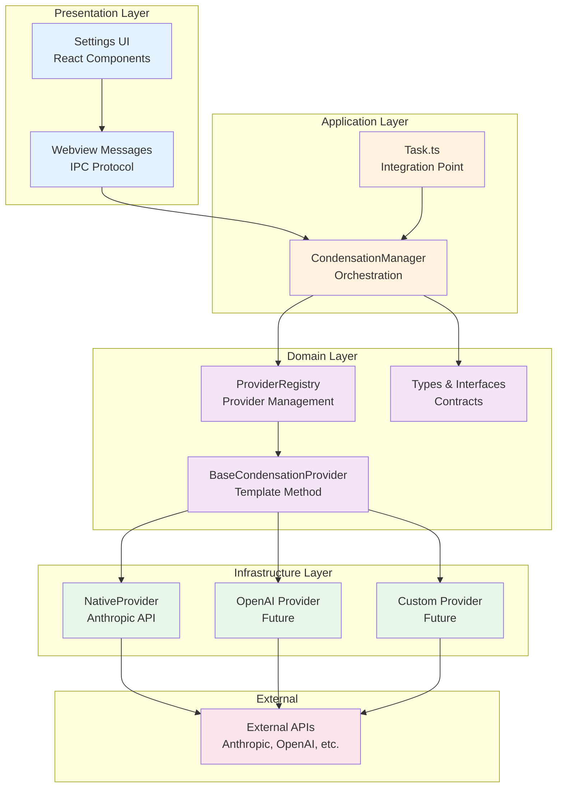
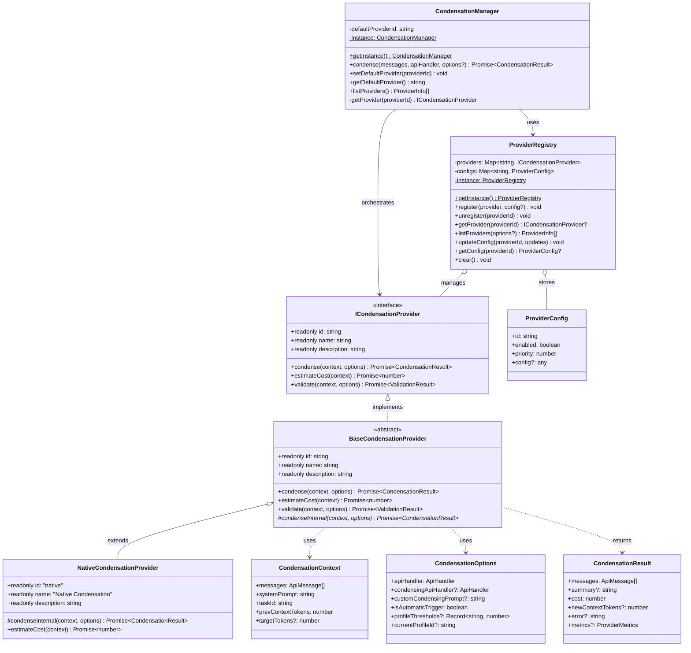
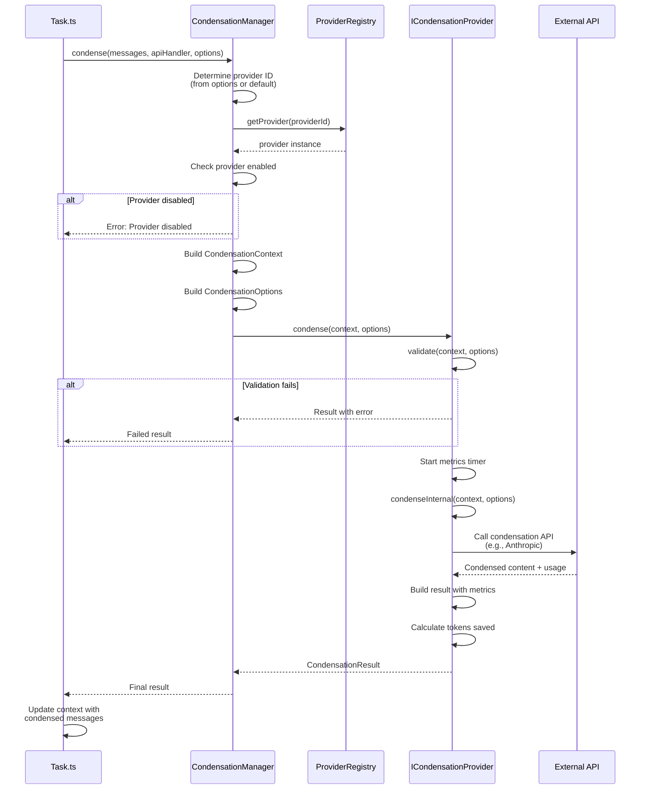
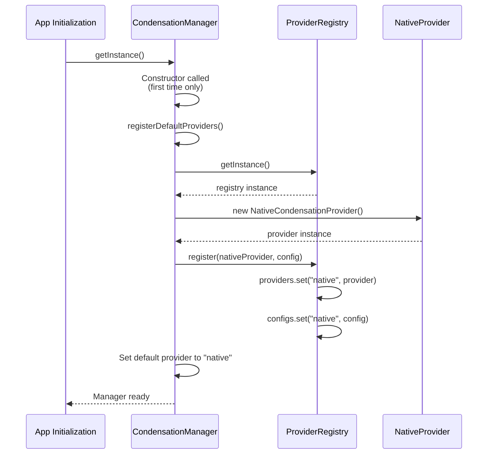
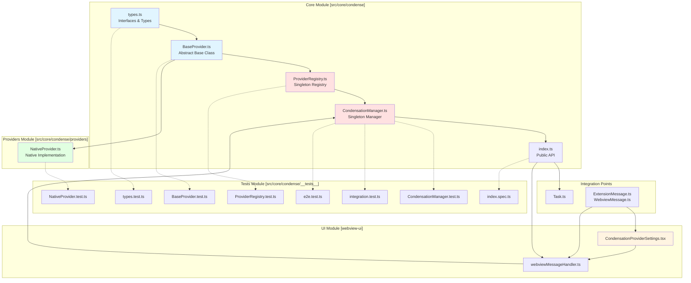
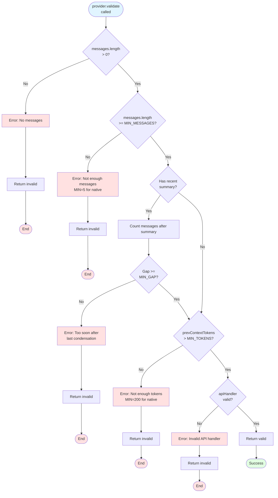

# Context Condensation System - Architecture Guide

**Version**: 1.0  
**Date**: 2025-10-02  
**Status**: Phase 1 Complete  

---

## 📖 Table des Matières

1. [Vue d'Ensemble](#vue-densemble)
2. [Architecture en Couches](#architecture-en-couches)
3. [Diagrammes Détaillés](#diagrammes-détaillés)
4. [Patterns de Conception](#patterns-de-conception)
5. [Flow de Condensation](#flow-de-condensation)
6. [Composants Clés](#composants-clés)
7. [Extensibilité](#extensibilité)
8. [Débogage](#débogage)
9. [Performance](#performance)

---

## Vue d'Ensemble

Le **Context Condensation System** est une architecture modulaire et extensible permettant de condenser intelligemment le contexte des conversations dans Roo Code. Le système supporte plusieurs stratégies de condensation via un pattern de providers, tout en maintenant une backward compatibility complète avec le système existant.

### Objectifs Architecturaux

- 🎯 **Extensibilité** : Ajouter facilement de nouveaux providers de condensation
- 🔄 **Backward Compatibility** : Maintenir 100% de compatibilité avec le système existant
- 🧪 **Testabilité** : Architecture facilitant les tests unitaires et d'intégration
- 📊 **Observabilité** : Métriques et logs pour monitorer les performances
- 🎨 **Flexibilité** : Configuration par provider et par utilisateur

### Principes de Design

1. **Separation of Concerns** : Chaque composant a une responsabilité unique et claire
2. **Open/Closed Principle** : Ouvert à l'extension, fermé à la modification
3. **Dependency Inversion** : Dépendances vers des abstractions, pas des implémentations
4. **Single Responsibility** : Une classe = une raison de changer
5. **Interface Segregation** : Interfaces minimales et cohésives

---

## Architecture en Couches



### Responsabilités des Couches

#### Presentation Layer
- **Responsabilité** : Interface utilisateur et communication webview
- **Technologies** : React, TypeScript, VSCode Webview API
- **Composants** : Settings UI, IPC Messages

#### Application Layer
- **Responsabilité** : Orchestration et logique métier de haut niveau
- **Technologies** : TypeScript, Singleton pattern
- **Composants** : CondensationManager, Task integration

#### Domain Layer
- **Responsabilité** : Règles métier et abstractions du domaine
- **Technologies** : TypeScript, Design patterns
- **Composants** : Registry, Base classes, Interfaces

#### Infrastructure Layer
- **Responsabilité** : Implémentations concrètes et intégrations externes
- **Technologies** : TypeScript, API clients
- **Composants** : Providers concrets (Native, OpenAI, etc.)

---

## Diagrammes Détaillés

### Diagramme de Classes



### Diagramme de Séquence - Condensation Flow



### Diagramme de Séquence - Provider Registration



### Diagramme de Composants



---

## Patterns de Conception

### 1. Singleton Pattern

**Utilisé pour** : `ProviderRegistry` et `CondensationManager`

**Justification** :
- Garantit une instance unique du registry des providers
- Évite la duplication de state
- Simplifie l'accès global

**Implémentation** :
```typescript
class ProviderRegistry {
  private static instance: ProviderRegistry

  private constructor() {
    // Constructor privé pour empêcher l'instanciation directe
  }

  static getInstance(): ProviderRegistry {
    if (!ProviderRegistry.instance) {
      ProviderRegistry.instance = new ProviderRegistry()
    }
    return ProviderRegistry.instance
  }
}
```

**Avantages** :
- ✅ Instance unique garantie
- ✅ Lazy initialization
- ✅ Accès global simple

**Considérations** :
- ⚠️ Rend les tests plus complexes (nécessité de clear entre tests)
- ⚠️ État global (attention aux side effects)

### 2. Template Method Pattern

**Utilisé pour** : `BaseCondensationProvider`

**Justification** :
- Définit le squelette de l'algorithme de condensation
- Permet aux sous-classes de redéfinir certaines étapes
- Code commun factori (validation, métriques, error handling)

**Implémentation** :
```typescript
abstract class BaseCondensationProvider implements ICondensationProvider {
  // Méthode template (finale, non overridable)
  async condense(context, options): Promise<CondensationResult> {
    // 1. Validation (commun)
    const validation = await this.validate(context, options)
    if (!validation.valid) return errorResult
    
    // 2. Métriques start (commun)
    const startTime = Date.now()
    
    // 3. Algorithme spécifique (variable)
    const result = await this.condenseInternal(context, options)
    
    // 4. Métriques end (commun)
    result.metrics = { timeElapsed: Date.now() - startTime, ...}
    
    return result
  }
  
  // Hook method (abstract, à implémenter)
  protected abstract condenseInternal(context, options): Promise<CondensationResult>
}
```

**Avantages** :
- ✅ Code commun réutilisé
- ✅ Structure claire et prévisible
- ✅ Facilite l'ajout de nouveaux providers

**Considérations** :
- ⚠️ Inflexible pour cas très différents
- ⚠️ Nécessite une bonne conception initiale

### 3. Strategy Pattern

**Utilisé pour** : Différents providers de condensation

**Justification** :
- Encapsule différents algorithmes de condensation
- Rend les algorithmes interchangeables
- Permet de choisir dynamiquement la stratégie

**Implémentation** :
```typescript
// Context (Manager)
class CondensationManager {
  async condense(messages, apiHandler, options?) {
    const providerId = options?.providerId || this.defaultProviderId
    const provider = this.getProvider(providerId) // Strategy selection
    return provider.condense(context, condensationOptions)
  }
}

// Strategies (Providers)
class NativeProvider extends BaseCondensationProvider { /* ... */ }
class OpenAIProvider extends BaseCondensationProvider { /* ... */ }
class CustomProvider extends BaseCondensationProvider { /* ... */ }
```

**Avantages** :
- ✅ Extensibilité facile (ajouter nouveaux providers)
- ✅ Testabilité (mock de providers)
- ✅ Choix dynamique de stratégie

**Considérations** :
- ⚠️ Overhead pour cas simples
- ⚠️ Nécessite interface commune bien définie

### 4. Registry Pattern

**Utilisé pour** : `ProviderRegistry`

**Justification** :
- Centralise l'enregistrement et la récupération des providers
- Permet la configuration par provider
- Facilite le listing et la découverte

**Implémentation** :
```typescript
class ProviderRegistry {
  private providers: Map<string, ICondensationProvider> = new Map()
  private configs: Map<string, ProviderConfig> = new Map()
  
  register(provider: ICondensationProvider, config?: Partial<ProviderConfig>) {
    this.providers.set(provider.id, provider)
    this.configs.set(provider.id, fullConfig)
  }
  
  getProvider(providerId: string): ICondensationProvider | undefined {
    return this.providers.get(providerId)
  }
}
```

**Avantages** :
- ✅ Découverte centralisée
- ✅ Configuration uniforme
- ✅ Gestion du lifecycle

**Considérations** :
- ⚠️ Couplage au registry
- ⚠️ Nécessite des IDs uniques

---

## Flow de Condensation

### Flow Complet End-to-End

```mermaid
flowchart TD
    Start([User triggers condensation])
    
    Start --> CheckManual{Manual or<br/>Automatic?}
    
    CheckManual -->|Manual| UIClick[User clicks 'Condense'<br/>in chat UI]
    CheckManual -->|Automatic| ThresholdCheck[Context size check<br/>vs threshold]
    
    UIClick --> TaskCondense[Task.condenseConversation()]
    ThresholdCheck -->|Exceeds| TaskCondense
    ThresholdCheck -->|Below| End1([No action])
    
    TaskCondense --> ManagerGet[getCondensationManager()]
    ManagerGet --> ManagerCondense[manager.condense()]
    
    ManagerCondense --> DetermineProvider{Provider<br/>specified?}
    DetermineProvider -->|Yes| UseSpecified[Use specified provider]
    DetermineProvider -->|No| UseDefault[Use default provider]
    
    UseSpecified --> GetProvider
    UseDefault --> GetProvider[registry.getProvider()]
    
    GetProvider --> CheckEnabled{Provider<br/>enabled?}
    CheckEnabled -->|No| ErrorDisabled[Error: Provider disabled]
    CheckEnabled -->|Yes| BuildContext
    
    ErrorDisabled --> ReturnError1[Return error result]
    ReturnError1 --> End2([End])
    
    BuildContext[Build CondensationContext]
    BuildContext --> BuildOptions[Build CondensationOptions]
    BuildOptions --> ProviderCondense[provider.condense()]
    
    ProviderCondense --> Validate[provider.validate()]
    Validate --> CheckValid{Valid?}
    CheckValid -->|No| ErrorValidation[Error: Validation failed]
    CheckValid -->|Yes| StartMetrics
    
    ErrorValidation --> ReturnError2[Return error result]
    ReturnError2 --> End3([End])
    
    StartMetrics[Start metrics timer]
    StartMetrics --> CondenseInternal[provider.condenseInternal()]
    
    CondenseInternal --> CheckMinMsg{Enough<br/>messages?}
    CheckMinMsg -->|No| ErrorMinMsg[Error: Not enough messages]
    CheckMinMsg -->|Yes| CheckRecentCondense
    
    ErrorMinMsg --> ReturnError3[Return error result]
    ReturnError3 --> End4([End])
    
    CheckRecentCondense{Recently<br/>condensed?}
    CheckRecentCondense -->|Yes| ErrorRecent[Error: Recently condensed]
    CheckRecentCondense -->|No| CallAPI
    
    ErrorRecent --> ReturnError4[Return error result]
    ReturnError4 --> End5([End])
    
    CallAPI[Call external API<br/>with condensation prompt]
    CallAPI --> ReceiveResponse[Receive condensed content]
    ReceiveResponse --> CountTokens[Count tokens in result]
    
    CountTokens --> CheckGrowth{Context<br/>grew?}
    CheckGrowth -->|Yes| ErrorGrowth[Error: Context grew]
    CheckGrowth -->|No| BuildResult
    
    ErrorGrowth --> ReturnError5[Return error result]
    ReturnError5 --> End6([End])
    
    BuildResult[Build CondensationResult]
    BuildResult --> AddMetrics[Add metrics<br/>(time, tokens saved)]
    AddMetrics --> ReturnSuccess[Return success result]
    
    ReturnSuccess --> UpdateTask[Update Task context<br/>with condensed messages]
    UpdateTask --> NotifyUI[Notify UI of success]
    NotifyUI --> End7([Success])
    
    style Start fill:#e1f5ff
    style End1 fill:#f1f1f1
    style End2 fill:#ffe1e1
    style End3 fill:#ffe1e1
    style End4 fill:#ffe1e1
    style End5 fill:#ffe1e1
    style End6 fill:#ffe1e1
    style End7 fill:#e1ffe1
    style ErrorDisabled fill:#ffe1e1
    style ErrorValidation fill:#ffe1e1
    style ErrorMinMsg fill:#ffe1e1
    style ErrorRecent fill:#ffe1e1
    style ErrorGrowth fill:#ffe1e1
```

### Validation Flow



---

## Composants Clés

### 1. Types & Interfaces (`types.ts`)

**Rôle** : Définir les contrats du système

**Interfaces Principales** :
- `ICondensationProvider` : Contrat que tout provider doit respecter
- `CondensationContext` : Contexte d'entrée pour la condensation
- `CondensationOptions` : Options de configuration
- `CondensationResult` : Résultat de la condensation
- `ProviderConfig` : Configuration d'un provider
- `ProviderMetrics` : Métriques de performance

**Localisation** : [`src/core/condense/types.ts`](../../../../src/core/condense/types.ts)

### 2. BaseCondensationProvider (`BaseProvider.ts`)

**Rôle** : Classe abstraite de base pour tous les providers

**Responsabilités** :
- Validation standardisée des inputs
- Gestion uniforme des erreurs
- Collecte automatique des métriques
- Template Method pour `condense()`

**Points d'Extension** :
```typescript
protected abstract condenseInternal(
  context: CondensationContext,
  options: CondensationOptions
): Promise<CondensationResult>

async estimateCost(context: CondensationContext): Promise<number>
```

**Localisation** : [`src/core/condense/BaseProvider.ts`](../../../../src/core/condense/BaseProvider.ts)

### 3. ProviderRegistry (`ProviderRegistry.ts`)

**Rôle** : Registry singleton pour gérer les providers

**API Publique** :
```typescript
getInstance(): ProviderRegistry
register(provider, config?): void
unregister(providerId): void
getProvider(providerId): ICondensationProvider | undefined
listProviders(options?): ProviderInfo[]
updateConfig(providerId, updates): void
getConfig(providerId): ProviderConfig | undefined
clear(): void  // Pour les tests uniquement
```

**State Interne** :
- `providers: Map<string, ICondensationProvider>` : Instances des providers
- `configs: Map<string, ProviderConfig>` : Configurations par provider

**Localisation** : [`src/core/condense/ProviderRegistry.ts`](../../../../src/core/condense/ProviderRegistry.ts)

### 4. CondensationManager (`CondensationManager.ts`)

**Rôle** : Point d'entrée principal pour la condensation

**API Publique** :
```typescript
getInstance(): CondensationManager
condense(messages, apiHandler, options?): Promise<CondensationResult>
setDefaultProvider(providerId): void
getDefaultProvider(): string
listProviders(): ProviderInfo[]
```

**Workflow** :
1. Déterminer le provider (options ou default)
2. Vérifier que le provider est enabled
3. Construire le context et les options
4. Déléguer à `provider.condense()`

**Localisation** : [`src/core/condense/CondensationManager.ts`](../../../../src/core/condense/CondensationManager.ts)

### 5. NativeProvider (`providers/NativeProvider.ts`)

**Rôle** : Provider natif pour backward compatibility

**Caractéristiques** :
- ID: `"native"`
- Utilise l'API Anthropic
- Logique identique à `summarizeConversation` original
- Validations strictes (min messages, gap après condensation, etc.)

**Validations Spécifiques** :
- Minimum 5 messages
- Minimum 200 tokens dans le contexte
- Gap minimum de 3 messages après dernière condensation
- Vérification que le contexte ne grandit pas

**Localisation** : [`src/core/condense/providers/NativeProvider.ts`](../../../../src/core/condense/providers/NativeProvider.ts)

---

## Extensibilité

### Ajouter un Nouveau Provider

#### Étape 1 : Créer la Classe Provider

```typescript
// src/core/condense/providers/OpenAIProvider.ts
import { BaseCondensationProvider } from "../BaseProvider"
import type { CondensationContext, CondensationOptions, CondensationResult } from "../types"

export class OpenAICondensationProvider extends BaseCondensationProvider {
  readonly id = "openai"
  readonly name = "OpenAI Condensation"
  readonly description = "Uses OpenAI API for context condensation"

  protected async condenseInternal(
    context: CondensationContext,
    options: CondensationOptions,
  ): Promise<CondensationResult> {
    // 1. Validation spécifique à OpenAI
    // 2. Appel à l'API OpenAI
    // 3. Traitement de la réponse
    // 4. Construction du résultat
  }

  async estimateCost(context: CondensationContext): Promise<number> {
    // Estimation basée sur les tarifs OpenAI
  }
}
```

#### Étape 2 : Enregistrer le Provider

```typescript
// src/core/condense/CondensationManager.ts
private registerDefaultProviders(): void {
  const registry = getProviderRegistry()

  // Native provider
  const nativeProvider = new NativeCondensationProvider()
  registry.register(nativeProvider, { enabled: true, priority: 100 })

  // Nouveau provider OpenAI
  const openAIProvider = new OpenAICondensationProvider()
  registry.register(openAIProvider, { enabled: true, priority: 90 })
}
```

#### Étape 3 : Tests

```typescript
// src/core/condense/providers/__tests__/OpenAIProvider.test.ts
import { describe, it, expect, beforeEach, vi } from "vitest"
import { OpenAICondensationProvider } from "../OpenAIProvider"

describe("OpenAICondensationProvider", () => {
  let provider: OpenAICondensationProvider

  beforeEach(() => {
    provider = new OpenAICondensationProvider()
  })

  it("should have correct metadata", () => {
    expect(provider.id).toBe("openai")
    expect(provider.name).toBe("OpenAI Condensation")
  })

  it("should condense context successfully", async () => {
    // Test implementation
  })

  // ... plus de tests
})
```

### Configuration Avancée par Provider

```typescript
// Exemple de configuration custom pour un provider
interface OpenAIProviderConfig {
  model: string           // e.g., "gpt-4-turbo"
  temperature: number     // 0-1
  maxTokens: number       // Max tokens in summary
  customPrompt?: string   // Override default prompt
}

registry.register(openAIProvider, {
  enabled: true,
  priority: 90,
  config: {
    model: "gpt-4-turbo",
    temperature: 0.7,
    maxTokens: 500,
  } as OpenAIProviderConfig
})
```

---

## Débogage

### Logs et Métriques

#### Activer les Logs Détaillés

Les providers loggent automatiquement :
- Temps d'exécution via `metrics.timeElapsed`
- Tokens économisés via `metrics.tokensSaved`
- Coût de l'opération via `result.cost`

#### Analyser les Erreurs

Toutes les erreurs sont capturées et retournées dans `CondensationResult.error` :

```typescript
const result = await manager.condense(messages, apiHandler)
if (result.error) {
  console.error("Condensation failed:", result.error)
  // Messages originaux sont retournés
  console.log("Original messages preserved:", result.messages)
}
```

### Outils de Débogage

#### 1. Lister les Providers

```typescript
const manager = getCondensationManager()
const providers = manager.listProviders()

console.log("Available providers:", providers.map(p => ({
  id: p.id,
  name: p.name,
  enabled: p.enabled,
  priority: p.priority,
})))
```

#### 2. Tester un Provider Isolément

```typescript
const registry = getProviderRegistry()
const provider = registry.getProvider("native")

if (provider) {
  const context: CondensationContext = { /* ... */ }
  const options: CondensationOptions = { /* ... */ }
  
  // Test validation
  const validation = await provider.validate(context, options)
  console.log("Validation:", validation)
  
  // Test condensation
  const result = await provider.condense(context, options)
  console.log("Result:", result)
}
```

#### 3. Inspecter la Configuration

```typescript
const registry = getProviderRegistry()
const config = registry.getConfig("native")

console.log("Provider config:", config)
// { id: "native", enabled: true, priority: 100, config: undefined }
```

### Problèmes Courants

#### Provider Not Found

**Symptôme** : `Error: Provider 'xxx' not found`

**Causes** :
- Provider pas enregistré
- Typo dans l'ID du provider
- Provider désenregistré par erreur

**Solution** :
```typescript
// Vérifier les providers disponibles
const providers = manager.listProviders()
console.log("Available:", providers.map(p => p.id))

// Ré-enregistrer si nécessaire
registry.register(myProvider, { enabled: true })
```

#### Provider Disabled

**Symptôme** : `Error: Provider 'xxx' is disabled`

**Solution** :
```typescript
// Activer le provider
registry.updateConfig("native", { enabled: true })
```

#### Validation Fails

**Symptôme** : `result.error` contient un message de validation

**Debug** :
```typescript
// Tester validation directement
const validation = await provider.validate(context, options)
console.log("Validation result:", validation)

// Vérifier les contraintes
console.log("Messages count:", context.messages.length)
console.log("Context tokens:", context.prevContextTokens)
console.log("Has recent summary:", context.messages.some(m => m.isSummary))
```

---

## Performance

### Optimisations Implémentées

#### 1. Singleton Pattern
- Évite la recréation d'instances
- State partagé efficacement

#### 2. Lazy Initialization
- Registry et Manager créés au premier accès
- Providers enregistrés à la demande

#### 3. Validation Précoce
- Échec rapide si validation échoue
- Évite les appels API inutiles

#### 4. Métriques Minimales
- Overhead de métriques < 1ms
- Pas d'impact sur les performances

### Métriques de Performance

**Temps Typiques** (Native Provider) :
- Validation : < 1ms
- API Call : 500-2000ms (dépend du contexte)
- Post-processing : < 10ms
- **Total** : 500-2100ms

**Tokens Économisés** :
- Dépend de la taille du contexte original
- Typiquement 50-70% de réduction
- Exemple : 1000 tokens → 300-500 tokens

**Coût** :
- Varie selon le provider et le modèle
- Native (Anthropic) : ~$0.001-0.005 par condensation
- Retourné dans `result.cost`

### Considérations Futures

#### Caching
- Cache des résultats de condensation
- Invalidation basée sur changements de contexte
- Économie de coûts API

#### Batching
- Grouper plusieurs demandes de condensation
- Optimisation pour auto-condensation
- Réduction du nombre d'appels API

#### Streaming
- Streamer les résultats de condensation
- Amélioration de l'UX (feedback progressif)
- Nécessite support API (Anthropic ✅, OpenAI ✅)

---

## Références

### Code Source

- [Types](../../../../src/core/condense/types.ts)
- [BaseProvider](../../../../src/core/condense/BaseProvider.ts)
- [ProviderRegistry](../../../../src/core/condense/ProviderRegistry.ts)
- [CondensationManager](../../../../src/core/condense/CondensationManager.ts)
- [NativeProvider](../../../../src/core/condense/providers/NativeProvider.ts)
- [Tests](../../../../src/core/condense/__tests__/)

### Documentation

- [Checkpoint Phase 1](../../pr-tracking/context-condensation/009-phase1-checkpoint.md)
- [Plan 30 Commits](../../pr-tracking/context-condensation/007-operational-plan-30-commits.md)
- [Guide Contributeur](./contributing-guide.md) *(à créer)*

### Design Patterns

- [Singleton Pattern](https://refactoring.guru/design-patterns/singleton)
- [Template Method Pattern](https://refactoring.guru/design-patterns/template-method)
- [Strategy Pattern](https://refactoring.guru/design-patterns/strategy)
- [Registry Pattern](https://martinfowler.com/eaaCatalog/registry.html)

---

**Auteur** : Roo AI Assistant  
**Version** : 1.0  
**Date** : 2025-10-02  
**Status** : Living Document