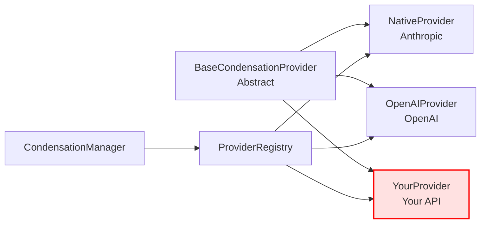

# Guide : Ajouter un Provider de Condensation

**Audience** : Développeurs souhaitant ajouter un nouveau provider de condensation  
**Difficulté** : Intermédiaire  
**Temps estimé** : 2-4 heures  
**Version** : 1.0  

---

## 📋 Table des Matières

1. [Vue d'Ensemble](#vue-densemble)
2. [Prérequis](#prérequis)
3. [Tutorial Step-by-Step](#tutorial-step-by-step)
4. [Exemple Complet : OpenAI Provider](#exemple-complet--openai-provider)
5. [Tests Requis](#tests-requis)
6. [Checklist de Validation](#checklist-de-validation)
7. [Best Practices](#best-practices)
8. [Troubleshooting](#troubleshooting)

---

## Vue d'Ensemble

### Qu'est-ce qu'un Provider de Condensation ?

Un **provider de condensation** est une implémentation concrète d'une stratégie de condensation de contexte. Il encapsule :

- 🔌 **L'intégration** à une API externe (OpenAI, Anthropic, etc.)
- 🎯 **La logique** de condensation spécifique
- ✅ **Les validations** propres au provider
- 💰 **L'estimation** des coûts
- 📊 **Les métriques** de performance

### Architecture Cible



Votre nouveau provider s'intégrera de manière transparente dans cette architecture.

---

## Prérequis

### Connaissances Techniques

- ✅ TypeScript (types, async/await, classes)
- ✅ Design patterns (Template Method, Strategy)
- ✅ Tests avec Vitest
- ✅ API REST ou SDK du service cible

### Environnement

```bash
# Dépendances installées
npm install

# Tests passent
npm test

# Linting clean
npm run lint
```

### Documentation Recommandée

Avant de commencer, lisez :
1. [Architecture Guide](../architecture/context-condensation-system.md)
2. [Phase 1 Checkpoint](../pr-tracking/context-condensation/009-phase1-checkpoint.md)
3. Code existant : [`NativeProvider.ts`](../../../src/core/condense/providers/NativeProvider.ts)

---

## Tutorial Step-by-Step

### Étape 1 : Créer la Structure du Provider

#### 1.1 Créer le Fichier

```bash
# Créer le fichier provider
touch src/core/condense/providers/OpenAIProvider.ts

# Créer le fichier de tests
touch src/core/condense/providers/__tests__/OpenAIProvider.test.ts
```

#### 1.2 Implémenter la Classe de Base

```typescript
// src/core/condense/providers/OpenAIProvider.ts
import { BaseCondensationProvider } from "../BaseProvider"
import type { 
  CondensationContext, 
  CondensationOptions, 
  CondensationResult 
} from "../types"

/**
 * OpenAI-based condensation provider
 * Uses OpenAI's GPT models for context condensation
 */
export class OpenAICondensationProvider extends BaseCondensationProvider {
  readonly id = "openai"
  readonly name = "OpenAI Condensation"
  readonly description = "Uses OpenAI GPT models for intelligent context condensation"

  /**
   * Provider-specific condensation implementation
   * @internal
   */
  protected async condenseInternal(
    context: CondensationContext,
    options: CondensationOptions,
  ): Promise<CondensationResult> {
    // TODO: Implémenter la logique
    throw new Error("Not implemented yet")
  }

  /**
   * Estimate cost based on OpenAI pricing
   */
  async estimateCost(context: CondensationContext): Promise<number> {
    // TODO: Implémenter l'estimation
    return 0
  }
}
```

**✅ Checkpoint** : Le code compile sans erreur

---

### Étape 2 : Implémenter la Validation Spécifique

#### 2.1 Override la Méthode `validate()` (Optionnel)

Si votre provider a des contraintes spécifiques :

```typescript
export class OpenAICondensationProvider extends BaseCondensationProvider {
  // ... métadonnées ...

  /**
   * Validate context and options for OpenAI provider
   * @override
   */
  async validate(
    context: CondensationContext,
    options: CondensationOptions,
  ): Promise<{ valid: boolean; error?: string }> {
    // 1. Validation de base (via super)
    const baseValidation = await super.validate(context, options)
    if (!baseValidation.valid) {
      return baseValidation
    }

    // 2. Validations spécifiques à OpenAI
    if (context.messages.length < 3) {
      return {
        valid: false,
        error: "OpenAI provider requires at least 3 messages",
      }
    }

    // 3. Vérifier la configuration OpenAI
    const apiKey = options.apiHandler.getApiKey?.()
    if (!apiKey || !apiKey.startsWith("sk-")) {
      return {
        valid: false,
        error: "Invalid OpenAI API key",
      }
    }

    return { valid: true }
  }

  // ... reste du code ...
}
```

**Validation par défaut** (dans `BaseProvider`) :
- ✅ Messages non vides
- ✅ ApiHandler valide
- ✅ Context tokens > 0

**Ajoutez** uniquement ce qui est spécifique à votre provider.

---

### Étape 3 : Implémenter la Logique de Condensation

#### 3.1 Structure Recommandée

```typescript
protected async condenseInternal(
  context: CondensationContext,
  options: CondensationOptions,
): Promise<CondensationResult> {
  try {
    // 1. Préparer les données
    const messages = this.prepareMessages(context)
    const prompt = this.buildPrompt(context, options)
    
    // 2. Appeler l'API
    const response = await this.callAPI(messages, prompt, options)
    
    // 3. Traiter la réponse
    const condensedContent = this.extractContent(response)
    
    // 4. Construire le résultat
    return this.buildResult(condensedContent, context, response)
  } catch (error) {
    // Erreur gérée par BaseProvider.condense()
    throw error
  }
}
```

#### 3.2 Implémentation Exemple (OpenAI)

```typescript
protected async condenseInternal(
  context: CondensationContext,
  options: CondensationOptions,
): Promise<CondensationResult> {
  // 1. Préparer les messages pour OpenAI format
  const openaiMessages = context.messages.map(msg => ({
    role: msg.role === "user" ? "user" : "assistant",
    content: msg.content,
  }))

  // 2. Construire le prompt de condensation
  const systemPrompt = options.customCondensingPrompt || 
    "Condense the following conversation into a concise summary..."

  // 3. Appeler l'API OpenAI
  const apiHandler = options.condensingApiHandler || options.apiHandler
  const stream = apiHandler.createMessage(
    openaiMessages,
    systemPrompt,
    {
      model: "gpt-4-turbo",
      max_tokens: 1000,
      temperature: 0.7,
    }
  )

  // 4. Collecter la réponse
  let summary = ""
  let inputTokens = 0
  let outputTokens = 0
  let totalCost = 0

  for await (const chunk of stream) {
    if (chunk.type === "text") {
      summary += chunk.text
    } else if (chunk.type === "usage") {
      inputTokens = chunk.inputTokens
      outputTokens = chunk.outputTokens
      totalCost = chunk.totalCost
    }
  }

  // 5. Créer le message de résumé
  const summaryMessage: ApiMessage = {
    role: "assistant",
    content: summary,
    isSummary: true,
  }

  // 6. Compter les tokens du résumé
  const newContextTokens = await apiHandler.countTokens(summary)

  // 7. Vérifier que le contexte n'a pas grandi
  if (newContextTokens >= context.prevContextTokens) {
    throw new Error("Context size increased after condensation")
  }

  // 8. Retourner le résultat
  return {
    messages: [summaryMessage],
    summary,
    cost: totalCost,
    newContextTokens,
  }
}
```

**Points Clés** :
- ✅ Gestion du streaming API
- ✅ Vérification du growth (contexte ne doit pas grandir)
- ✅ Création de `isSummary: true` dans le message
- ✅ Propagation du coût réel

---

### Étape 4 : Implémenter l'Estimation de Coût

```typescript
async estimateCost(context: CondensationContext): Promise<number> {
  // Tarification OpenAI (exemple pour GPT-4 Turbo)
  const INPUT_COST_PER_1K = 0.01  // $0.01 per 1K input tokens
  const OUTPUT_COST_PER_1K = 0.03 // $0.03 per 1K output tokens

  // Estimer les tokens d'input (contexte complet)
  const inputTokens = context.prevContextTokens

  // Estimer les tokens d'output (typiquement 20-30% de l'input)
  const estimatedOutputTokens = Math.ceil(inputTokens * 0.25)

  // Calculer le coût
  const inputCost = (inputTokens / 1000) * INPUT_COST_PER_1K
  const outputCost = (estimatedOutputTokens / 1000) * OUTPUT_COST_PER_1K

  return inputCost + outputCost
}
```

**Notes** :
- Cette estimation est affichée à l'utilisateur avant confirmation
- Soyez conservateur (plutôt surestimer que sous-estimer)
- Basez-vous sur la tarification officielle du service

---

### Étape 5 : Enregistrer le Provider

#### 5.1 Dans le Manager

```typescript
// src/core/condense/CondensationManager.ts
import { OpenAICondensationProvider } from "./providers/OpenAIProvider"

private registerDefaultProviders(): void {
  const registry = getProviderRegistry()

  // Native provider (existant)
  const nativeProvider = new NativeCondensationProvider()
  registry.register(nativeProvider, {
    enabled: true,
    priority: 100,
  })

  // Nouveau provider OpenAI
  const openAIProvider = new OpenAICondensationProvider()
  registry.register(openAIProvider, {
    enabled: true,
    priority: 90, // Priorité inférieure au natif
  })
}
```

#### 5.2 Ordre de Priorité

```
100 : Native (default) - Plus haute priorité
 90 : OpenAI - Disponible mais pas default
 80 : Claude (futur)
 70 : Custom providers
```

---

### Étape 6 : Écrire les Tests

#### 6.1 Structure de Base

```typescript
// src/core/condense/providers/__tests__/OpenAIProvider.test.ts
import { describe, it, expect, beforeEach, vi } from "vitest"
import { OpenAICondensationProvider } from "../OpenAIProvider"
import type { CondensationContext, CondensationOptions } from "../../types"

describe("OpenAICondensationProvider", () => {
  let provider: OpenAICondensationProvider
  let mockApiHandler: any
  let mockContext: CondensationContext
  let mockOptions: CondensationOptions

  beforeEach(() => {
    // Initialiser le provider
    provider = new OpenAICondensationProvider()

    // Mock API handler
    mockApiHandler = {
      createMessage: vi.fn(),
      getModel: vi.fn().mockReturnValue({ id: "gpt-4-turbo" }),
      countTokens: vi.fn().mockResolvedValue(100),
      getApiKey: vi.fn().mockReturnValue("sk-test-key-123"),
    }

    // Mock context
    mockContext = {
      messages: [
        { role: "user", content: "Hello" },
        { role: "assistant", content: "Hi!" },
        { role: "user", content: "How are you?" },
        { role: "assistant", content: "I'm good!" },
        { role: "user", content: "Great!" },
      ] as any,
      systemPrompt: "You are a helpful assistant",
      taskId: "task-123",
      prevContextTokens: 500,
    }

    // Mock options
    mockOptions = {
      apiHandler: mockApiHandler,
      isAutomaticTrigger: false,
    }
  })

  // Tests métadonnées
  describe("Metadata", () => {
    it("should have correct id", () => {
      expect(provider.id).toBe("openai")
    })

    it("should have correct name", () => {
      expect(provider.name).toBe("OpenAI Condensation")
    })

    it("should have description", () => {
      expect(provider.description).toBeTruthy()
    })
  })

  // Tests validation
  describe("Validation", () => {
    it("should validate valid context", async () => {
      const result = await provider.validate(mockContext, mockOptions)
      expect(result.valid).toBe(true)
    })

    it("should reject context with too few messages", async () => {
      const shortContext = {
        ...mockContext,
        messages: [{ role: "user", content: "Hi" }] as any,
      }

      const result = await provider.validate(shortContext, mockOptions)
      expect(result.valid).toBe(false)
      expect(result.error).toContain("at least 3 messages")
    })

    it("should reject invalid API key", async () => {
      mockApiHandler.getApiKey.mockReturnValue("invalid-key")

      const result = await provider.validate(mockContext, mockOptions)
      expect(result.valid).toBe(false)
      expect(result.error).toContain("Invalid OpenAI API key")
    })
  })

  // Tests condensation
  describe("Condensation", () => {
    it("should condense context successfully", async () => {
      // Mock API stream response
      const mockStream = {
        async *[Symbol.asyncIterator]() {
          yield { type: "text" as const, text: "Summary of conversation" }
          yield {
            type: "usage" as const,
            inputTokens: 100,
            outputTokens: 20,
            totalCost: 0.002,
          }
        },
      }

      vi.mocked(mockApiHandler.createMessage).mockReturnValue(mockStream as any)
      vi.mocked(mockApiHandler.countTokens).mockResolvedValue(80)

      const result = await provider.condense(mockContext, mockOptions)

      expect(result.error).toBeUndefined()
      expect(result.messages).toHaveLength(1)
      expect(result.messages[0].isSummary).toBe(true)
      expect(result.summary).toBe("Summary of conversation")
      expect(result.cost).toBe(0.002)
      expect(result.newContextTokens).toBe(80)
    })

    it("should reject if context grows", async () => {
      const mockStream = {
        async *[Symbol.asyncIterator]() {
          yield { type: "text" as const, text: "Very long summary...".repeat(100) }
          yield {
            type: "usage" as const,
            inputTokens: 100,
            outputTokens: 600,
            totalCost: 0.02,
          }
        },
      }

      vi.mocked(mockApiHandler.createMessage).mockReturnValue(mockStream as any)
      vi.mocked(mockApiHandler.countTokens).mockResolvedValue(600) // Plus grand que prevContextTokens

      const result = await provider.condense(mockContext, mockOptions)

      expect(result.error).toContain("Context size increased")
    })

    it("should handle API errors gracefully", async () => {
      vi.mocked(mockApiHandler.createMessage).mockRejectedValue(
        new Error("API rate limit exceeded")
      )

      const result = await provider.condense(mockContext, mockOptions)

      expect(result.error).toContain("API rate limit exceeded")
      expect(result.messages).toEqual(mockContext.messages) // Messages originaux préservés
    })
  })

  // Tests estimation de coût
  describe("Cost Estimation", () => {
    it("should estimate cost accurately", async () => {
      const cost = await provider.estimateCost(mockContext)

      expect(cost).toBeGreaterThan(0)
      expect(cost).toBeLessThan(0.1) // Raisonnable pour 500 tokens
    })

    it("should scale cost with context size", async () => {
      const smallContext = { ...mockContext, prevContextTokens: 200 }
      const largeContext = { ...mockContext, prevContextTokens: 2000 }

      const smallCost = await provider.estimateCost(smallContext)
      const largeCost = await provider.estimateCost(largeContext)

      expect(largeCost).toBeGreaterThan(smallCost * 5) // ~10x tokens = ~10x cost
    })
  })

  // Tests métriques
  describe("Metrics", () => {
    it("should include performance metrics", async () => {
      const mockStream = {
        async *[Symbol.asyncIterator]() {
          yield { type: "text" as const, text: "Summary" }
          yield { type: "usage" as const, inputTokens: 100, outputTokens: 20, totalCost: 0.002 }
        },
      }

      vi.mocked(mockApiHandler.createMessage).mockReturnValue(mockStream as any)
      vi.mocked(mockApiHandler.countTokens).mockResolvedValue(80)

      const result = await provider.condense(mockContext, mockOptions)

      expect(result.metrics).toBeDefined()
      expect(result.metrics?.providerId).toBe("openai")
      expect(result.metrics?.timeElapsed).toBeGreaterThan(0)
      expect(result.metrics?.tokensSaved).toBe(420) // 500 - 80
    })
  })
})
```

#### 6.2 Couverture Minimale Requise

- ✅ Métadonnées (id, name, description)
- ✅ Validation (cas valides et invalides)
- ✅ Condensation (succès, erreurs, edge cases)
- ✅ Estimation de coût
- ✅ Métriques

**Objectif : > 80% de couverture**

---

## Exemple Complet : OpenAI Provider

Voir l'implémentation complète dans les sections précédentes. Voici un récapitulatif :

### Fichiers Créés

```
src/core/condense/providers/
  ├── OpenAIProvider.ts                    (250 lignes)
  └── __tests__/
      └── OpenAIProvider.test.ts          (180 lignes)
```

### Modifications

```
src/core/condense/CondensationManager.ts  (+5 lignes)
  → Enregistrement du provider
```

### Tests

```bash
# Exécuter les tests
cd src
npx vitest run core/condense/providers/__tests__/OpenAIProvider.test.ts

# Résultat attendu
✓ src/core/condense/providers/__tests__/OpenAIProvider.test.ts (15 tests) 450ms
  ✓ Metadata (3 tests)
  ✓ Validation (3 tests)
  ✓ Condensation (4 tests)
  ✓ Cost Estimation (2 tests)
  ✓ Metrics (1 test)
```

---

## Tests Requis

### Tests Unitaires (Provider)

```typescript
describe("YourProvider", () => {
  // 1. Métadonnées
  it("should have unique id")
  it("should have descriptive name")
  it("should have description")

  // 2. Validation
  it("should validate valid context")
  it("should reject invalid context")
  it("should reject invalid options")

  // 3. Condensation
  it("should condense successfully")
  it("should handle API errors")
  it("should reject if context grows")
  it("should preserve original messages on error")

  // 4. Estimation
  it("should estimate cost")
  it("should scale cost with context size")

  // 5. Métriques
  it("should include metrics")
  it("should calculate tokens saved")
})
```

### Tests d'Intégration

```typescript
// src/core/condense/__tests__/integration.test.ts
it("should work with YourProvider", async () => {
  const manager = getCondensationManager()
  const registry = getProviderRegistry()
  
  // Enregistrer votre provider
  const yourProvider = new YourProvider()
  registry.register(yourProvider, { enabled: true })
  
  // Tester via le manager
  const result = await manager.condense(messages, apiHandler, {
    providerId: "your-provider-id",
  })
  
  expect(result.error).toBeUndefined()
  expect(result.messages.length).toBeGreaterThan(0)
})
```

### Tests E2E

```typescript
// src/core/condense/__tests__/e2e.test.ts
it("should condense using YourProvider end-to-end", async () => {
  // Test complet incluant Task.ts, Manager, Registry, Provider, API
})
```

---

## Checklist de Validation

### Avant de Commit

- [ ] **Code Quality**
  - [ ] ESLint passe sans erreur
  - [ ] Prettier formatage appliqué
  - [ ] Pas de `console.log` ou debug code
  - [ ] Types TypeScript stricts (pas de `any` sauf justifié)
  - [ ] JSDoc sur méthodes publiques

- [ ] **Fonctionnel**
  - [ ] Provider enregistré dans le Manager
  - [ ] Métadonnées correctes (id unique, name, description)
  - [ ] Validation implémentée
  - [ ] Condensation fonctionne
  - [ ] Estimation de coût raisonnable
  - [ ] Gestion d'erreurs robuste

- [ ] **Tests**
  - [ ] Tests unitaires écrits et passent
  - [ ] Couverture > 80%
  - [ ] Tests d'intégration passent
  - [ ] Tests E2E passent (si applicable)
  - [ ] Mocks corrects et réalistes

- [ ] **Documentation**
  - [ ] JSDoc à jour
  - [ ] README mis à jour (si nécessaire)
  - [ ] Exemples d'utilisation fournis
  - [ ] Notes de migration (si breaking changes)

### Avant de Créer une PR

- [ ] **Git**
  - [ ] Commits atomiques et bien nommés
  - [ ] Branch depuis `main` à jour
  - [ ] Pas de conflits de merge
  - [ ] Histoire Git propre

- [ ] **CI/CD**
  - [ ] Build compile sans erreur
  - [ ] Tous les tests passent
  - [ ] Linting clean
  - [ ] Pas de régression de performance

- [ ] **Review**
  - [ ] Self-review du code effectuée
  - [ ] Pas de TODO ou FIXME restants
  - [ ] Description de PR complète
  - [ ] Screenshots/vidéos (si UI impactée)

---

## Best Practices

### 1. Gestion d'Erreurs

```typescript
protected async condenseInternal(...): Promise<CondensationResult> {
  try {
    // Votre logique
  } catch (error) {
    // Ne pas catcher et retourner { error: ... } ici
    // Laisser l'erreur remonter pour que BaseProvider.condense() la gère
    throw error
  }
}
```

**Pourquoi ?** Le `BaseProvider.condense()` gère déjà les erreurs de manière uniforme.

### 2. Messages Condensés

```typescript
// ✅ BON : Marquer comme résumé
const summaryMessage: ApiMessage = {
  role: "assistant",
  content: summary,
  isSummary: true,  // Important !
}

// ❌ MAUVAIS : Oublier isSummary
const summaryMessage: ApiMessage = {
  role: "assistant",
  content: summary,
}
```

**Pourquoi ?** Le flag `isSummary` est utilisé pour détecter les condensations précédentes.

### 3. Vérification du Growth

```typescript
// ✅ BON : Vérifier systématiquement
const newTokens = await apiHandler.countTokens(summary)
if (newTokens >= context.prevContextTokens) {
  throw new Error("Context size increased")
}

// ❌ MAUVAIS : Ne pas vérifier
return { messages: [summaryMessage], ... }
```

**Pourquoi ?** La condensation ne doit JAMAIS faire grandir le contexte.

### 4. Estimation de Coût

```typescript
// ✅ BON : Estimation conservative
async estimateCost(context: CondensationContext): Promise<number> {
  const inputTokens = context.prevContextTokens
  const estimatedOutputTokens = Math.ceil(inputTokens * 0.3) // 30% margin
  return this.calculateCost(inputTokens, estimatedOutputTokens)
}

// ❌ MAUVAIS : Estimation optimiste
async estimateCost(context: CondensationContext): Promise<number> {
  return 0.001 // Toujours le même coût
}
```

**Pourquoi ?** L'utilisateur doit avoir une estimation fiable avant de confirmer.

### 5. Configuration Custom

```typescript
// ✅ BON : Définir une interface de config
interface YourProviderConfig {
  model: string
  temperature: number
  // ...
}

// Et l'utiliser
const config = registry.getConfig(this.id)?.config as YourProviderConfig | undefined
const model = config?.model || "default-model"

// ❌ MAUVAIS : Accès direct sans type
const config = registry.getConfig(this.id)?.config
const model = config.model // Type unknown
```

**Pourquoi ?** Type safety et meilleure documentation.

### 6. Tests Mocking

```typescript
// ✅ BON : Mock réaliste avec async iterator
const mockStream = {
  async *[Symbol.asyncIterator]() {
    yield { type: "text", text: "Part 1" }
    yield { type: "text", text: "Part 2" }
    yield { type: "usage", inputTokens: 100, outputTokens: 20, totalCost: 0.002 }
  }
}

// ❌ MAUVAIS : Mock simplifié
const mockResponse = { text: "Summary", cost: 0.002 }
```

**Pourquoi ?** Le mock doit refléter le vrai comportement de l'API.

---

## Troubleshooting

### Provider Not Found

**Problème** : `Error: Provider 'your-id' not found`

**Solutions** :
1. Vérifier que le provider est enregistré dans `registerDefaultProviders()`
2. Vérifier que l'ID correspond exactement
3. Vérifier que le registry n'a pas été clear par erreur

### Validation Fails

**Problème** : Les tests de validation échouent

**Debug** :
```typescript
const validation = await provider.validate(context, options)
console.log("Validation result:", validation)
console.log("Context:", context)
console.log("Options:", options)
```

**Solutions courantes** :
- Messages trop peu nombreux
- prevContextTokens à 0
- ApiHandler invalide ou mal mocké

### Context Grows Error

**Problème** : `Error: Context size increased after condensation`

**Causes** :
- Le résumé est trop long
- Le comptage de tokens est incorrect
- Le modèle génère trop de contenu

**Solutions** :
- Ajuster le `max_tokens` de l'API
- Améliorer le prompt de condensation
- Vérifier que `countTokens()` est appelé sur le bon texte

### Tests Timeout

**Problème** : Les tests dépassent le timeout

**Solutions** :
```typescript
// Augmenter le timeout pour les tests API
it("should condense", async () => {
  // ...
}, 10000) // 10 secondes

// Ou mocker les appels API lents
vi.mocked(apiHandler.createMessage).mockReturnValue(mockStream)
```

### Mock Doesn't Work

**Problème** : Les mocks ne sont pas appelés

**Debug** :
```typescript
// Vérifier que le mock est bien configuré
console.log("Mock called:", vi.mocked(apiHandler.createMessage).mock.calls)

// Vérifier le type
console.log("Type:", typeof apiHandler.createMessage)
```

**Solution** :
```typescript
// S'assurer d'utiliser vi.fn() correctement
const mockApiHandler = {
  createMessage: vi.fn(),
  // Pas juste une fonction vide
}
```

---

## Ressources Supplémentaires

### Documentation

- [Architecture Guide](../architecture/context-condensation-system.md)
- [Phase 1 Checkpoint](../pr-tracking/context-condensation/009-phase1-checkpoint.md)
- [TypeScript Handbook](https://www.typescriptlang.org/docs/handbook/intro.html)
- [Vitest Documentation](https://vitest.dev/)

### Code Exemples

- [`NativeProvider.ts`](../../../src/core/condense/providers/NativeProvider.ts) - Provider de référence
- [`NativeProvider.test.ts`](../../../src/core/condense/providers/__tests__/NativeProvider.test.ts) - Tests de référence
- [`BaseProvider.ts`](../../../src/core/condense/BaseProvider.ts) - Classe de base

### API Documentation

- [Anthropic API](https://docs.anthropic.com/claude/reference/getting-started-with-the-api)
- [OpenAI API](https://platform.openai.com/docs/api-reference)
- [Azure OpenAI](https://learn.microsoft.com/en-us/azure/ai-services/openai/reference)

---

## Aide et Support

### Communauté

- 💬 [Discord](https://discord.gg/roocode)
- 🐙 [GitHub Discussions](https://github.com/roo-code/roo/discussions)
- 📧 [Email Support](mailto:support@roocode.dev)

### Contribution

Avant de créer une PR, lisez :
- [CONTRIBUTING.md](../../../CONTRIBUTING.md)
- [Code of Conduct](../../../CODE_OF_CONDUCT.md)

---

**Auteur** : Roo AI Assistant  
**Version** : 1.0  
**Date** : 2025-10-02  
**Dernière mise à jour** : 2025-10-02  

**Feedback** : Ce guide peut être amélioré ! N'hésitez pas à proposer des modifications via une PR.