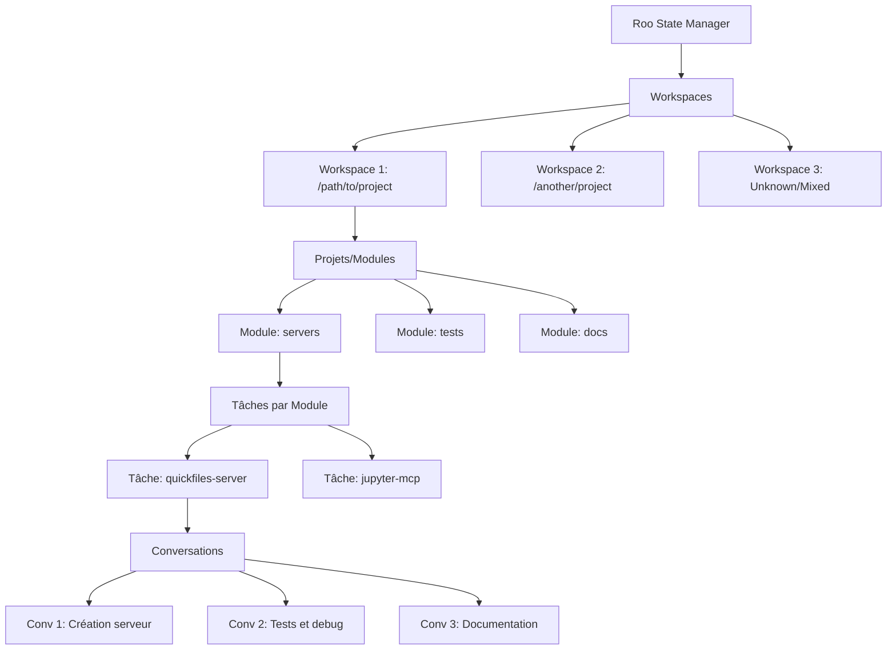

# Architecture de l'Arborescence de Tâches - MCP Roo State Manager

## Contexte et Problématique

Le MCP Roo State Manager actuel détecte 901 conversations Roo mais les présente comme une liste séquentielle de GUIDs, rendant la navigation quasi impossible. L'objectif est de créer une arborescence de tâches organisée par workspace/projet.

## Analyse de la Structure Actuelle des Données

### Structure des Fichiers de Conversation

Chaque conversation Roo est stockée dans un répertoire avec la structure suivante :
```
tasks/
├── {taskId}/
│   ├── api_conversation_history.json    # Historique des échanges API
│   ├── task_metadata.json              # Métadonnées de la tâche
│   ├── ui_messages.json                # Messages de l'interface utilisateur
│   └── checkpoints/                    # Points de sauvegarde (optionnel)
```

### Exemple de Métadonnées Analysées

D'après l'analyse du fichier `task_metadata.json`, nous avons identifié :

**Structure des métadonnées :**
- `files_in_context` : Liste des fichiers manipulés dans la conversation
- Chaque fichier contient :
  - `path` : Chemin relatif du fichier dans le workspace
  - `record_state` : État du fichier (active, stale)
  - `record_source` : Source de la modification (read_tool, roo_edited, user_edited)
  - Timestamps de lecture et modification

**Patterns de Workspace identifiés :**
- Les chemins de fichiers révèlent la structure du projet
- Exemple : `servers/quickfiles-server/package.json` indique un workspace avec des serveurs MCP
- Les fichiers racine comme `demo-file1.txt` indiquent le répertoire de travail principal

## Architecture Proposée pour l'Arborescence de Tâches

### 1. Structure Hiérarchique



### 2. Types de Données Enrichis

#### WorkspaceNode
```typescript
interface WorkspaceNode {
  id: string;
  name: string;
  path: string;
  type: 'workspace';
  children: ProjectNode[];
  metadata: {
    totalConversations: number;
    lastActivity: string;
    totalSize: number;
    detectedFrom: string[]; // Chemins détectés
  };
}
```

#### ProjectNode
```typescript
interface ProjectNode {
  id: string;
  name: string;
  path: string;
  type: 'project' | 'module';
  parent: WorkspaceNode;
  children: TaskClusterNode[];
  metadata: {
    conversationCount: number;
    filePatterns: string[];
    technologies: string[]; // Détectées via extensions
    lastActivity: string;
  };
}
```

#### TaskClusterNode
```typescript
interface TaskClusterNode {
  id: string;
  name: string;
  type: 'task_cluster';
  parent: ProjectNode;
  conversations: ConversationNode[];
  metadata: {
    theme: string; // Thème principal des tâches
    timespan: { start: string; end: string };
    relatedFiles: string[];
    complexity: 'simple' | 'medium' | 'complex';
  };
}
```

#### ConversationNode
```typescript
interface ConversationNode {
  id: string; // taskId original
  name: string; // Généré automatiquement
  type: 'conversation';
  parent: TaskClusterNode;
  originalData: ConversationSummary;
  metadata: {
    title: string; // Extrait du premier message
    summary: string; // Résumé automatique
    tags: string[];
    dependencies: string[]; // Autres conversations liées
    outcome: 'completed' | 'abandoned' | 'ongoing';
  };
}
```

### 3. Algorithmes de Classification

#### Détection de Workspace
```typescript
interface WorkspaceDetectionStrategy {
  // 1. Analyse des chemins de fichiers
  analyzeFilePaths(conversations: ConversationSummary[]): WorkspaceCandidate[];
  
  // 2. Clustering par similarité de chemins
  clusterBySimilarity(candidates: WorkspaceCandidate[]): WorkspaceGroup[];
  
  // 3. Validation et consolidation
  validateWorkspaces(groups: WorkspaceGroup[]): WorkspaceNode[];
}
```

#### Classification des Projets
```typescript
interface ProjectClassificationStrategy {
  // 1. Détection de patterns technologiques
  detectTechStack(files: string[]): TechStack;
  
  // 2. Analyse de la structure de répertoires
  analyzeDirectoryStructure(paths: string[]): ProjectStructure;
  
  // 3. Regroupement par affinité
  groupByAffinity(conversations: ConversationSummary[]): ProjectGroup[];
}
```

#### Clustering des Tâches
```typescript
interface TaskClusteringStrategy {
  // 1. Analyse sémantique des titres/contenus
  analyzeSemanticSimilarity(conversations: ConversationNode[]): ClusterCandidate[];
  
  // 2. Analyse temporelle
  analyzeTemporalPatterns(conversations: ConversationNode[]): TemporalCluster[];
  
  // 3. Analyse des dépendances de fichiers
  analyzeFileDependencies(conversations: ConversationNode[]): DependencyCluster[];
}
```

### 4. Nouveaux Outils MCP

#### Navigation dans l'Arborescence
```typescript
// Outil : browse_task_tree
interface BrowseTaskTreeTool {
  input: {
    path?: string; // Chemin dans l'arborescence
    depth?: number; // Profondeur d'exploration
    filters?: {
      workspace?: string;
      project?: string;
      timeRange?: { start: string; end: string };
      tags?: string[];
    };
  };
  output: TreeNode[];
}
```

#### Recherche Contextuelle
```typescript
// Outil : search_conversations
interface SearchConversationsTool {
  input: {
    query: string;
    scope?: 'workspace' | 'project' | 'cluster' | 'global';
    searchIn?: ('title' | 'content' | 'files' | 'tags')[];
    filters?: ConversationFilters;
  };
  output: SearchResult[];
}
```

#### Analyse de Relations
```typescript
// Outil : analyze_task_relationships
interface AnalyzeTaskRelationshipsTool {
  input: {
    taskId: string;
    relationshipTypes?: ('file_dependency' | 'temporal' | 'semantic')[];
    maxDepth?: number;
  };
  output: RelationshipGraph;
}
```

#### Génération de Résumés
```typescript
// Outil : generate_task_summary
interface GenerateTaskSummaryTool {
  input: {
    scope: 'conversation' | 'cluster' | 'project' | 'workspace';
    targetId: string;
    summaryType?: 'brief' | 'detailed' | 'technical';
  };
  output: TaskSummary;
}
```

### 5. Optimisations de Performance

#### Cache et Indexation
- **Index de fichiers** : Mapping rapide fichier → conversations
- **Index temporel** : Accès rapide par période
- **Index sémantique** : Recherche par mots-clés et concepts
- **Cache de métadonnées** : Éviter le re-parsing des gros fichiers

#### Chargement Progressif
- **Lazy loading** : Chargement à la demande des sous-arbres
- **Pagination** : Limitation du nombre d'éléments affichés
- **Streaming** : Traitement par chunks pour les gros volumes

### 6. Plan d'Implémentation

#### Phase 1 : Analyse et Classification (2-3 jours)
1. **Analyseur de métadonnées** : Extraction des patterns de workspace
2. **Algorithmes de clustering** : Classification automatique
3. **Générateur d'arborescence** : Construction de la structure hiérarchique

#### Phase 2 : API et Outils MCP (2-3 jours)
1. **Nouveaux types TypeScript** : Définition des interfaces
2. **Outils de navigation** : browse_task_tree, search_conversations
3. **Outils d'analyse** : analyze_relationships, generate_summary

#### Phase 3 : Optimisation et Cache (1-2 jours)
1. **Système de cache** : Persistance des métadonnées calculées
2. **Indexation** : Création des index de performance
3. **Tests de charge** : Validation avec 900+ conversations

#### Phase 4 : Interface et UX (1-2 jours)
1. **Formatage des réponses** : Présentation claire de l'arborescence
2. **Navigation intuitive** : Commandes de drill-down/up
3. **Recherche avancée** : Filtres et facettes

### 7. Exemples d'Usage

#### Navigation Hiérarchique
```bash
# Exploration du niveau racine
roo-state-manager browse_task_tree

# Exploration d'un workspace spécifique
roo-state-manager browse_task_tree --path="/workspaces/roo-extensions"

# Exploration avec filtres
roo-state-manager browse_task_tree --filters='{"timeRange":{"start":"2025-01-01"}}'
```

#### Recherche Contextuelle
```bash
# Recherche globale
roo-state-manager search_conversations --query="MCP server" --scope="global"

# Recherche dans un projet
roo-state-manager search_conversations --query="quickfiles" --scope="project"
```

#### Analyse de Relations
```bash
# Relations d'une conversation
roo-state-manager analyze_task_relationships --taskId="000324b2-d897-4386-9eca-13f1b63e08f2"
```

## Bénéfices Attendus

### Navigation Intuitive
- **Exploration logique** : Navigation par workspace → projet → tâche
- **Contexte préservé** : Compréhension des relations entre tâches
- **Recherche efficace** : Filtrage par contexte métier

### Gestion Améliorée
- **Archivage intelligent** : Regroupement par projets terminés
- **Réutilisation** : Identification de patterns et solutions
- **Maintenance** : Nettoyage ciblé par workspace

### Performance Optimisée
- **Chargement rapide** : Accès direct aux données pertinentes
- **Mémoire maîtrisée** : Chargement progressif des gros volumes
- **Recherche instantanée** : Index pré-calculés

## Conclusion

Cette architecture transforme la liste plate de 901 conversations en une arborescence navigable et intelligente, permettant une gestion efficace des tâches Roo à grande échelle.