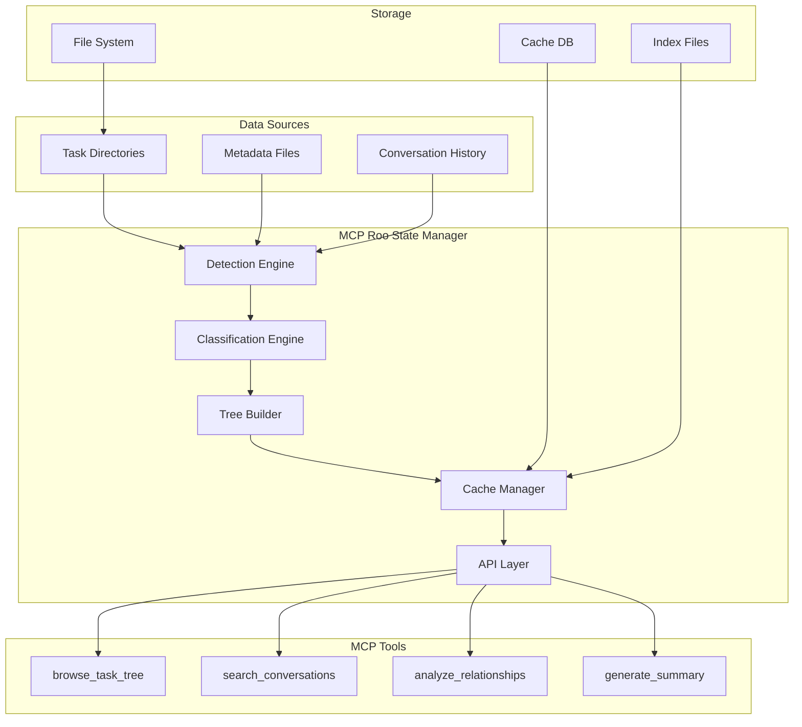
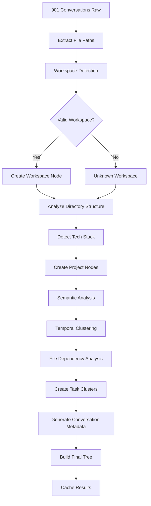
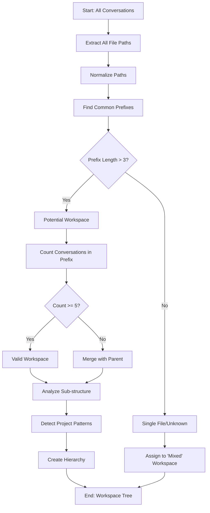
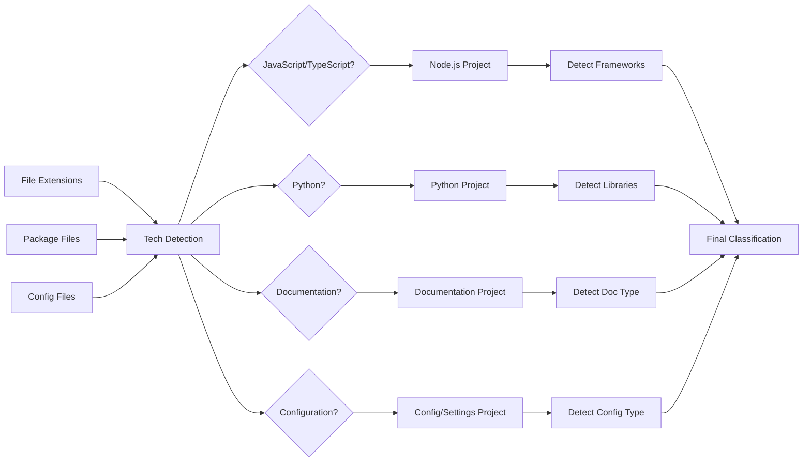

# Spécifications Techniques - Arborescence de Tâches Roo

## Diagrammes d'Architecture

### 1. Architecture Globale du Système



### 2. Flux de Classification des Conversations



### 3. Structure de Données Hiérarchique

```mermaid
erDiagram
    WORKSPACE ||--o{ PROJECT : contains
    PROJECT ||--o{ TASK_CLUSTER : contains
    TASK_CLUSTER ||--o{ CONVERSATION : contains
    CONVERSATION ||--o{ FILE_REFERENCE : references
    
    WORKSPACE {
        string id PK
        string name
        string path
        int totalConversations
        datetime lastActivity
        int totalSize
        string[] detectedFrom
    }
    
    PROJECT {
        string id PK
        string name
        string path
        string type
        string workspaceId FK
        int conversationCount
        string[] filePatterns
        string[] technologies
        datetime lastActivity
    }
    
    TASK_CLUSTER {
        string id PK
        string name
        string theme
        string projectId FK
        datetime startTime
        datetime endTime
        string[] relatedFiles
        string complexity
    }
    
    CONVERSATION {
        string id PK
        string taskId
        string title
        string summary
        string clusterId FK
        string[] tags
        string[] dependencies
        string outcome
        datetime createdAt
        datetime lastActivity
        int messageCount
        int size
    }
    
    FILE_REFERENCE {
        string id PK
        string path
        string conversationId FK
        string recordState
        string recordSource
        datetime rooReadDate
        datetime rooEditDate
        datetime userEditDate
    }
```



### 4. Algorithme de Détection de Workspace



### 5. Classification des Technologies



## Spécifications des Nouveaux Types TypeScript

### Types de Base

```typescript
// Base node interface
interface TreeNode {
  id: string;
  name: string;
  type: 'workspace' | 'project' | 'task_cluster' | 'conversation';
  path?: string;
  parent?: TreeNode;
  children?: TreeNode[];
  metadata: Record<string, any>;
  createdAt: string;
  updatedAt: string;
}

// Workspace detection result
interface WorkspaceDetectionResult {
  workspaces: WorkspaceCandidate[];
  unclassified: ConversationSummary[];
  statistics: {
    totalConversations: number;
    classifiedConversations: number;
    detectedWorkspaces: number;
    averageConversationsPerWorkspace: number;
  };
}

// Classification metadata
interface ClassificationMetadata {
  algorithm: string;
  confidence: number;
  factors: string[];
  alternatives?: string[];
  timestamp: string;
}

// Search and filter types
interface ConversationFilters {
  workspaceId?: string;
  projectId?: string;
  clusterId?: string;
  tags?: string[];
  timeRange?: {
    start: string;
    end: string;
  };
  filePatterns?: string[];
  technologies?: string[];
  outcome?: ('completed' | 'abandoned' | 'ongoing')[];
  minSize?: number;
  maxSize?: number;
}

interface SearchResult {
  conversation: ConversationNode;
  relevanceScore: number;
  matchedFields: string[];
  highlights: {
    field: string;
    text: string;
    positions: number[];
  }[];
}
```

### Types Avancés pour l'Analyse

```typescript
// Relationship analysis
interface RelationshipGraph {
  nodes: RelationshipNode[];
  edges: RelationshipEdge[];
  metadata: {
    totalNodes: number;
    totalEdges: number;
    maxDepth: number;
    analysisType: string[];
  };
}

interface RelationshipNode {
  id: string;
  type: 'conversation' | 'file' | 'concept';
  label: string;
  properties: Record<string, any>;
}

interface RelationshipEdge {
  source: string;
  target: string;
  type: 'file_dependency' | 'temporal_sequence' | 'semantic_similarity' | 'user_reference';
  weight: number;
  properties: Record<string, any>;
}

// Performance and caching
interface CacheEntry {
  key: string;
  data: any;
  timestamp: string;
  ttl: number;
  dependencies: string[];
  size: number;
}

interface PerformanceMetrics {
  operationType: string;
  duration: number;
  memoryUsage: number;
  cacheHitRate: number;
  itemsProcessed: number;
  timestamp: string;
}
```

## Spécifications des Nouveaux Outils MCP

### 1. browse_task_tree

```typescript
{
  name: "browse_task_tree",
  description: "Navigate through the hierarchical task tree structure",
  inputSchema: {
    type: "object",
    properties: {
      path: {
        type: "string",
        description: "Path in the tree (e.g., '/workspaces/roo-extensions/mcps')"
      },
      depth: {
        type: "number",
        description: "Maximum depth to explore (default: 2)",
        default: 2
      },
      includeMetadata: {
        type: "boolean",
        description: "Include detailed metadata in response",
        default: false
      },
      filters: {
        type: "object",
        description: "Filters to apply to the results",
        properties: {
          timeRange: {
            type: "object",
            properties: {
              start: { type: "string" },
              end: { type: "string" }
            }
          },
          technologies: {
            type: "array",
            items: { type: "string" }
          },
          minConversations: { type: "number" }
        }
      }
    }
  }
}
```

### 2. search_conversations

```typescript
{
  name: "search_conversations",
  description: "Search conversations with advanced filtering and ranking",
  inputSchema: {
    type: "object",
    properties: {
      query: {
        type: "string",
        description: "Search query (supports natural language and keywords)"
      },
      scope: {
        type: "string",
        enum: ["global", "workspace", "project", "cluster"],
        description: "Search scope",
        default: "global"
      },
      scopeId: {
        type: "string",
        description: "ID of the scope (required if scope is not global)"
      },
      searchFields: {
        type: "array",
        items: {
          type: "string",
          enum: ["title", "content", "files", "tags", "summary"]
        },
        description: "Fields to search in",
        default: ["title", "content", "tags"]
      },
      filters: {
        type: "object",
        description: "Additional filters (ConversationFilters type)"
      },
      limit: {
        type: "number",
        description: "Maximum number of results",
        default: 20
      },
      includeHighlights: {
        type: "boolean",
        description: "Include text highlights in results",
        default: true
      }
    },
    required: ["query"]
  }
}
```

### 3. analyze_task_relationships

```typescript
{
  name: "analyze_task_relationships",
  description: "Analyze relationships between tasks and conversations",
  inputSchema: {
    type: "object",
    properties: {
      taskId: {
        type: "string",
        description: "ID of the task/conversation to analyze"
      },
      relationshipTypes: {
        type: "array",
        items: {
          type: "string",
          enum: ["file_dependency", "temporal", "semantic", "user_reference"]
        },
        description: "Types of relationships to analyze",
        default: ["file_dependency", "temporal", "semantic"]
      },
      maxDepth: {
        type: "number",
        description: "Maximum depth of relationship traversal",
        default: 3
      },
      minWeight: {
        type: "number",
        description: "Minimum relationship weight to include",
        default: 0.1
      },
      includeVisualization: {
        type: "boolean",
        description: "Include graph visualization data",
        default: false
      }
    },
    required: ["taskId"]
  }
}
```

### 4. generate_task_summary

```typescript
{
  name: "generate_task_summary",
  description: "Generate intelligent summaries of tasks, clusters, or projects",
  inputSchema: {
    type: "object",
    properties: {
      scope: {
        type: "string",
        enum: ["conversation", "cluster", "project", "workspace"],
        description: "Scope of the summary"
      },
      targetId: {
        type: "string",
        description: "ID of the target to summarize"
      },
      summaryType: {
        type: "string",
        enum: ["brief", "detailed", "technical", "timeline"],
        description: "Type of summary to generate",
        default: "brief"
      },
      includeMetrics: {
        type: "boolean",
        description: "Include quantitative metrics",
        default: true
      },
      includeRelationships: {
        type: "boolean",
        description: "Include relationship information",
        default: false
      },
      language: {
        type: "string",
        description: "Language for the summary",
        default: "fr"
      }
    },
    required: ["scope", "targetId"]
  }
}
```

### 5. rebuild_task_tree

```typescript
{
  name: "rebuild_task_tree",
  description: "Rebuild the task tree with updated classification algorithms",
  inputSchema: {
    type: "object",
    properties: {
      forceRebuild: {
        type: "boolean",
        description: "Force complete rebuild ignoring cache",
        default: false
      },
      algorithms: {
        type: "object",
        description: "Algorithm configuration",
        properties: {
          workspaceDetection: {
            type: "string",
            enum: ["path_analysis", "file_clustering", "hybrid"],
            default: "hybrid"
          },
          projectClassification: {
            type: "string",
            enum: ["tech_stack", "directory_structure", "semantic"],
            default: "tech_stack"
          },
          taskClustering: {
            type: "string",
            enum: ["temporal", "semantic", "file_based", "combined"],
            default: "combined"
          }
        }
      },
      filters: {
        type: "object",
        description: "Filters for conversations to include in rebuild"
      }
    }
  }
}
```

## Plan d'Implémentation Détaillé

### Phase 1: Fondations (Jours 1-3)

#### Jour 1: Analyse et Extraction
- [ ] Implémentation du `ConversationAnalyzer`
- [ ] Extraction des métadonnées de fichiers
- [ ] Détection des patterns de workspace
- [ ] Tests unitaires pour l'extraction

#### Jour 2: Classification
- [ ] Algorithmes de clustering par workspace
- [ ] Classification des projets par tech stack
- [ ] Détection des relations temporelles
- [ ] Validation des algorithmes

#### Jour 3: Construction de l'Arbre
- [ ] `TreeBuilder` pour la hiérarchie
- [ ] Génération des métadonnées enrichies
- [ ] Système de cache basique
- [ ] Tests d'intégration

### Phase 2: API et Outils (Jours 4-6)

#### Jour 4: Outils de Navigation
- [ ] Implémentation `browse_task_tree`
- [ ] Formatage des réponses hiérarchiques
- [ ] Gestion des filtres et pagination
- [ ] Tests des outils

#### Jour 5: Recherche et Analyse
- [ ] Implémentation `search_conversations`
- [ ] Moteur de recherche avec scoring
- [ ] `analyze_task_relationships`
- [ ] Génération de graphes de relations

#### Jour 6: Résumés et Utilitaires
- [ ] `generate_task_summary`
- [ ] `rebuild_task_tree`
- [ ] Outils de maintenance
- [ ] Documentation des APIs

### Phase 3: Performance et Cache (Jours 7-8)

#### Jour 7: Optimisation
- [ ] Système de cache avancé
- [ ] Index de recherche
- [ ] Optimisation mémoire
- [ ] Tests de performance

#### Jour 8: Finalisation
- [ ] Tests avec 901 conversations
- [ ] Optimisation des requêtes
- [ ] Monitoring et métriques
- [ ] Documentation finale

## Métriques de Succès

### Performance
- **Temps de construction** : < 30 secondes pour 901 conversations
- **Temps de recherche** : < 2 secondes pour toute requête
- **Utilisation mémoire** : < 500MB pour l'arbre complet
- **Taux de cache hit** : > 80% pour les requêtes répétées

### Qualité de Classification
- **Précision workspace** : > 90% des conversations correctement classées
- **Cohérence projet** : > 85% des projets logiquement groupés
- **Pertinence clusters** : > 80% des clusters thématiquement cohérents

### Utilisabilité
- **Navigation intuitive** : Réduction de 90% du temps de recherche
- **Découvrabilité** : 95% des conversations accessibles en < 3 clics
- **Contexte préservé** : Relations visibles entre tâches connexes

Cette architecture transformera l'expérience utilisateur en passant d'une liste plate de GUIDs à une navigation intelligente et contextuelle des 901 conversations Roo.