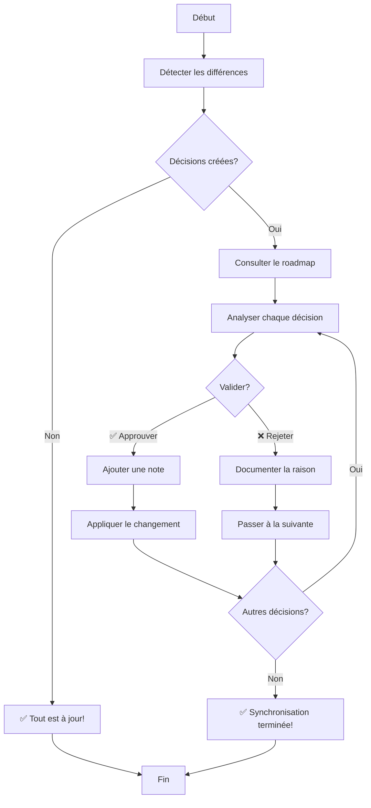

# RooSync v2.1 - Guide Utilisateur

**Version** : 2.1.0  
**Date** : 2025-10-20  
**Architecture** : Baseline-Driven  
**Audience** : Utilisateurs finaux et administrateurs système  

---

## 🎯 Bienvenue dans RooSync v2.1

RooSync v2.1 est un outil de synchronisation de configuration qui vous permet de maintenir des environnements Roo identiques sur plusieurs machines. La nouvelle architecture **baseline-driven** garantit une source de vérité unique et un contrôle humain sur tous les changements critiques.

### 🔄 Qu'est-ce qui a changé ?

| Fonctionnalité | v2.0 | v2.1 | Pour vous c'est... |
|----------------|------|------|-------------------|
| **Comparaison** | Machine ↔ Machine | Machine ↔ Baseline | ✅ Plus clair et prévisible |
| **Validation** | Optionnelle | Obligatoire pour les changements critiques | 🔒 Plus sécurisé |
| **Interface** | JSON technique | Markdown convivial | 📖 Plus lisible |
| **Workflow** | Automatique | Humain au centre | 🎯 Plus contrôlé |

---

## 🚀 Premiers Pas

### 1. Vérification de l'Installation

Avant de commencer, assurez-vous que RooSync est correctement installé :

```bash
# Vérifier que le serveur MCP est actif
use_mcp_tool "roo-state-manager" "minimal_test_tool" {}

# Vérifier l'état de RooSync
use_mcp_tool "roo-state-manager" "roosync_get_status" {}
```

### 2. Comprendre votre Environnement

RooSync v2.1 utilise deux concepts clés :

#### 📋 Baseline (Source de Vérité)
- Fichier : `sync-config.ref.json`
- Contient la configuration de référence
- Ne doit être modifiée que par des utilisateurs expérimentés

#### 🗺️ Roadmap (Tableau de Bord)
- Fichier : `sync-roadmap.md`
- Interface pour valider les changements
- Mis à jour automatiquement

---

## 📖 Workflow Principal

### Étape 1 : Détection des Différences

La première étape consiste à comparer votre machine avec la baseline pour identifier les différences.

```bash
# Comparer votre machine avec la baseline
use_mcp_tool "roo-state-manager" "roosync_compare_config" {
  "target": "votre-machine-id",
  "create_decisions": true,
  "severity_threshold": "IMPORTANT"
}
```

**Que se passe-t-il ?**
1. RooSync analyse votre configuration
2. Il la compare avec la baseline
3. Il crée des décisions pour chaque différence trouvée
4. Il met à jour le fichier `sync-roadmap.md`

#### Exemple de Résultat

```json
{
  "success": true,
  "decisions": 5,
  "roadmap_updated": true,
  "message": "5 décisions créées dans sync-roadmap.md"
}
```

### Étape 2 : Consultation du Roadmap

Ouvrez le fichier `sync-roadmap.md` pour voir les décisions en attente :

```markdown
# RooSync Roadmap - Validation Humaine

## 📊 Résumé
- **Décisions en attente** : 5
- **Critiques** : 2
- **Important** : 2
- **Warning** : 1

---

## 🔴 CRITICAL - Mode manquant
**Decision ID** : decision-1729456800000-0  
**Machine** : votre-machine-id  
**Chemin** : config.roo.modes  
**Description** : Mode 'architect' manquant sur votre machine  
**Valeur baseline** : ["ask", "code", "architect", "debug"]  
**Votre valeur** : ["ask", "code", "debug"]  
**Action recommandée** : sync_to_baseline  

[✅ Approuver] [❌ Rejeter] [📝 Ajouter une note]

---

## 🟡 IMPORTANT - MCP désactivé
**Decision ID** : decision-1729456800000-1  
**Machine** : votre-machine-id  
**Chemin** : config.roo.mcpSettings.quickfiles.enabled  
**Description** : MCP quickfiles est désactivé sur votre machine  
**Valeur baseline** : true  
**Votre valeur** : false  
**Action recommandée** : sync_to_baseline  

[✅ Approuver] [❌ Rejeter] [📝 Ajouter une note]
```

### Étape 3 : Validation des Décisions

Pour chaque décision, vous avez trois options :

#### ✅ Approuver une Décision

```bash
# Approuver une décision spécifique
use_mcp_tool "roo-state-manager" "roosync_approve_decision" {
  "decisionId": "decision-1729456800000-0",
  "comment": "Mode architect nécessaire pour mes tâches de conception"
}
```

#### ❌ Rejeter une Décision

```bash
# Rejeter une décision avec motif
use_mcp_tool "roo-state-manager" "roosync_reject_decision" {
  "decisionId": "decision-1729456800000-1",
  "reason": "Je préfère garder quickfiles désactivé pour des raisons de performance"
}
```

#### 📝 Ajouter une Note

Vous pouvez ajouter des notes pour documenter vos choix :

```bash
# Approuver avec note détaillée
use_mcp_tool "roo-state-manager" "roosync_approve_decision" {
  "decisionId": "decision-1729456800000-0",
  "comment": "Mode architect activé temporairement pour le projet X. À désactiver après livraison."
}
```

### Étape 4 : Application des Changements

Une fois les décisions approuvées, vous pouvez les appliquer :

```bash
# Appliquer une décision approuvée
use_mcp_tool "roo-state-manager" "roosync_apply_decision" {
  "decisionId": "decision-1729456800000-0"
}
```

#### Mode Simulation (Recommandé)

Avant d'appliquer réellement les changements, utilisez le mode simulation :

```bash
# Simulation d'application
use_mcp_tool "roo-state-manager" "roosync_apply_decision" {
  "decisionId": "decision-1729456800000-0",
  "dryRun": true
}
```

#### Application en Lot

Pour appliquer plusieurs décisions d'un coup :

```bash
# Appliquer toutes les décisions approuvées
# (Vous devez d'abord les approuver individuellement)
use_mcp_tool "roo-state-manager" "roosync_apply_decision" {
  "decisionId": "decision-1729456800000-0"
}

use_mcp_tool "roo-state-manager" "roosync_apply_decision" {
  "decisionId": "decision-1729456800000-2"
}

# ... etc pour chaque décision approuvée
```

---

## 🎯 Scénarios d'Usage Courants

### Scénario 1 : Première Configuration

**Objectif** : Configurer une nouvelle machine pour qu'elle corresponde à la baseline.

```bash
# 1. Initialiser RooSync sur la nouvelle machine
use_mcp_tool "roo-state-manager" "roosync_init" {}

# 2. Détecter toutes les différences
use_mcp_tool "roo-state-manager" "roosync_detect_diffs" {
  "targetMachine": "nouvelle-machine",
  "severityThreshold": "INFO"
}

# 3. Consulter le roadmap et valider les décisions importantes
# (Ouvrir sync-roadmap.md manuellement)

# 4. Approuver les décisions critiques
use_mcp_tool "roo-state-manager" "roosync_approve_decision" {
  "decisionId": "decision-xxx",
  "comment": "Configuration initiale requise"
}

# 5. Appliquer les changements
use_mcp_tool "roo-state-manager" "roosync_apply_decision" {
  "decisionId": "decision-xxx"
}
```

### Scénario 2 : Mise à Jour de Configuration

**Objectif** : Mettre à jour votre configuration après un changement sur la baseline.

```bash
# 1. Vérifier s'il y a des différences
use_mcp_tool "roo-state-manager" "roosync_compare_config" {
  "target": "ma-machine",
  "create_decisions": true,
  "severity_threshold": "WARNING"
}

# 2. Si des décisions sont créées, les consulter dans sync-roadmap.md

# 3. Valider uniquement les changements souhaités
use_mcp_tool "roo-state-manager" "roosync_approve_decision" {
  "decisionId": "decision-xxx",
  "comment": "Mise à jour nécessaire pour le nouveau projet"
}

# 4. Appliquer
use_mcp_tool "roo-state-manager" "roosync_apply_decision" {
  "decisionId": "decision-xxx"
}
```

### Scénario 3 : Diagnostic de Problème

**Objectif** : Comprendre pourquoi votre configuration diffère de la baseline.

```bash
# 1. Obtenir le statut complet
use_mcp_tool "roo-state-manager" "roosync_get_status" {}

# 2. Lister toutes les différences
use_mcp_tool "roo-state-manager" "roosync_list_diffs" {
  "filterType": "all"
}

# 3. Comparaison détaillée sans créer de décisions
use_mcp_tool "roo-state-manager" "roosync_compare_config" {
  "target": "ma-machine",
  "create_decisions": false
}

# 4. Analyser les résultats et décider quoi faire
```

---

## 🔧 Personnalisation et Préférences

### Configuration du Seuil de Sévérité

Vous pouvez ajuster le niveau de sensibilité pour la détection des différences :

```bash
# Seuil strict (uniquement les différences critiques)
use_mcp_tool "roo-state-manager" "roosync_detect_diffs" {
  "targetMachine": "ma-machine",
  "severityThreshold": "CRITICAL"
}

# Seuil normal (recommandé)
use_mcp_tool "roo-state-manager" "roosync_detect_diffs" {
  "targetMachine": "ma-machine",
  "severityThreshold": "IMPORTANT"
}

# Seuil large (toutes les différences)
use_mcp_tool "roo-state-manager" "roosync_detect_diffs" {
  "targetMachine": "ma-machine",
  "severityThreshold": "INFO"
}
```

### Gestion des Préférences Personnelles

Pour les différences que vous souhaitez conserver intentionnellement :

1. **Rejetez la décision** avec une raison claire
2. **Documentez votre choix** dans les notes
3. **Créez une règle personnalisée** (contactez votre administrateur)

```bash
# Exemple : Conserver une préférence personnelle
use_mcp_tool "roo-state-manager" "roosync_reject_decision" {
  "decisionId": "decision-xxx",
  "reason": "Préférence personnelle : thème sombre au lieu de thème clair"
}
```

---

## 📊 Comprendre les Niveaux de Sévérité

### 🔴 CRITICAL
- **Impact** : Empêche le fonctionnement normal de Roo
- **Action** : Doit être traité immédiatement
- **Exemples** : Mode essentiel manquant, MCP critique désactivé

### 🟡 IMPORTANT
- **Impact** : Affecte les fonctionnalités avancées
- **Action** : Recommandé de traiter rapidement
- **Exemples** : MCP optionnel désactivé, paramètre de performance

### 🟠 WARNING
- **Impact** : Peut causer des problèmes mineurs
- **Action** : À traiter quand possible
- **Exemples** : Version légèrement différente, paramètre obsolète

### 🔵 INFO
- **Impact** : Informationnel seulement
- **Action** : Optionnel
- **Exemples** : Commentaire de configuration, métadonnée

---

## 🛠️ Résolution des Problèmes

### Problème 1 : "Baseline non trouvée"

**Symptôme** : Erreur lors de la comparaison

**Solution** :
```bash
# Vérifier que le fichier baseline existe
use_mcp_tool "roo-state-manager" "roosync_get_status" {}

# Si absent, initialiser RooSync
use_mcp_tool "roo-state-manager" "roosync_init" {
  "force": true
}
```

### Problème 2 : "Décision déjà appliquée"

**Symptôme** : Erreur lors de l'application d'une décision

**Solution** :
```bash
# Vérifier le statut de la décision
use_mcp_tool "roo-state-manager" "roosync_get_decision_details" {
  "decisionId": "decision-xxx"
}

# Si déjà appliquée, c'est normal !
# Sinon, vérifier pourquoi elle a échoué
```

### Problème 3 : Trop de décisions créées

**Symptôme** : Des dizaines de décisions dans le roadmap

**Solution** :
```bash
# Utiliser un seuil plus strict
use_mcp_tool "roo-state-manager" "roosync_detect_diffs" {
  "targetMachine": "ma-machine",
  "severityThreshold": "CRITICAL"
}

# Ou filtrer par type
use_mcp_tool "roo-state-manager" "roosync_list_diffs" {
  "filterType": "config"
}
```

### Problème 4 : Changement non appliqué

**Symptôme** : La décision est approuvée mais le changement n'est pas visible

**Solution** :
```bash
# Vérifier le statut détaillé
use_mcp_tool "roo-state-manager" "roosync_get_decision_details" {
  "decisionId": "decision-xxx",
  "includeLogs": true
}

# Réessayer l'application
use_mcp_tool "roo-state-manager" "roosync_apply_decision" {
  "decisionId": "decision-xxx"
}
```

---

## 📈 Bonnes Pratiques

### ✅ Ce qu'il faut faire

1. **Vérifier régulièrement** les différences (quotidien/hebdomadaire)
2. **Lire attentivement** chaque décision avant de valider
3. **Documenter vos choix** avec des notes claires
4. **Utiliser le mode simulation** avant d'appliquer les changements
5. **Sauvegarder** avant les changements importants

### ❌ Ce qu'il faut éviter

1. **Approuver aveuglément** toutes les décisions
2. **Ignorer les décisions CRITICAL**
3. **Modifier manuellement** les fichiers de configuration RooSync
4. **Appliquer des changements** sans comprendre leur impact
5. **Partager** votre `sync-roadmap.md` avec d'autres

### 🎯 Recommandations

#### Pour les Utilisateurs Novices

- Commencez avec le seuil `CRITICAL`
- Lisez attentivement les descriptions
- Demandez de l'aide pour les décisions importantes

#### Pour les Utilisateurs Expérimentés

- Utilisez le seuil `IMPORTANT` pour une vue complète
- Personnalisez les décisions selon vos besoins
- Contribuez à l'amélioration de la baseline

#### Pour les Administrateurs

- Surveillez les décisions rejetées
- Maintenez la baseline à jour
- Formez les utilisateurs aux bonnes pratiques

---

## 📋 Glossaire

| Terme | Définition Simple | Exemple |
|-------|-------------------|---------|
| **Baseline** | Configuration de référence officielle | `sync-config.ref.json` |
| **Roadmap** | Tableau de bord des décisions à valider | `sync-roadmap.md` |
| **Décision** | Proposition de changement à valider | "Activer le mode architect" |
| **Sévérité** | Niveau d'importance d'une différence | CRITICAL, IMPORTANT, WARNING, INFO |
| **Validation** | Action d'approuver ou rejeter une décision | Clic sur ✅ ou ❌ |
| **Application** | Action d'appliquer un changement approuvé | `apply_decision` |

---

## 🔄 Workflow Visuel



---

## 🎯 Checklist Quotidienne

### Matin (5 minutes)

- [ ] Vérifier rapidement le statut : `roosync_get_status`
- [ ] Si des différences critiques, consulter le roadmap
- [ ] Traiter les décisions urgentes

### Hebdomadaire (15 minutes)

- [ ] Détection complète avec seuil `IMPORTANT`
- [ ] Validation des décisions en attente
- [ ] Application des changements approuvés

### Mensuel (30 minutes)

- [ ] Détection complète avec seuil `INFO`
- [ ] Revue des décisions rejetées
- [ ] Mise à jour des préférences personnelles

---

## 🆘 Obtenir de l'Aide

### Auto-diagnostic

```bash
# Diagnostic complet
use_mcp_tool "roo-state-manager" "roosync_get_status" {}

# Liste des problèmes
use_mcp_tool "roo-state-manager" "roosync_list_diffs" {
  "filterType": "all"
}
```

### Ressources Disponibles

- **Guide de déploiement** : [`roosync-v2-1-deployment-guide.md`](./roosync-v2-1-deployment-guide.md)
- **Guide développeur** : [`roosync-v2-1-developer-guide.md`](./roosync-v2-1-developer-guide.md)
- **Documentation technique** : `roo-config/reports/`

### Contacter le Support

1. **Consultez ce guide** et les ressources disponibles
2. **Utilisez les outils de diagnostic** intégrés
3. **Préparez les informations suivantes** :
   - Messages d'erreur exacts
   - ID des décisions problématiques
   - Actions effectuées avant le problème

---

## ✅ Résumé des Points Clés

1. **RooSync v2.1 est centré sur l'humain** : vous contrôlez tous les changements importants
2. **La baseline est la source de vérité** : elle garantit la cohérence entre machines
3. **Le roadmap est votre interface** : c'est là que vous prenez vos décisions
4. **La validation est obligatoire** pour les changements critiques
5. **Documentez vos choix** pour maintenir la traçabilité

Avec RooSync v2.1, vous avez le contrôle total sur votre configuration tout en bénéficiant de la cohérence garantie par la baseline. Prenez le temps de comprendre chaque décision avant de la valider !

---

**Version du document** : 1.0  
**Dernière mise à jour** : 2025-10-20  
**Prochaine révision** : 2025-11-20

---

*Besoin d'aide ? N'hésitez pas à consulter les autres guides ou à contacter votre administrateur système.*