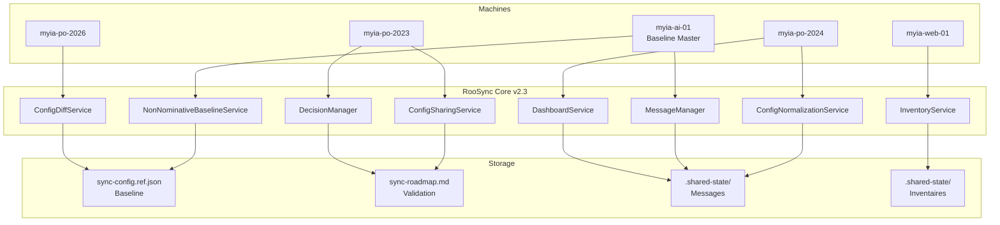
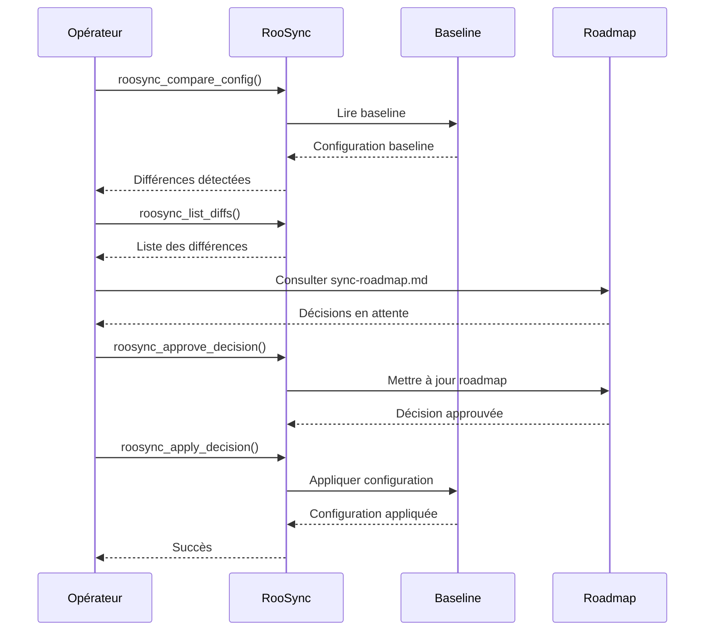
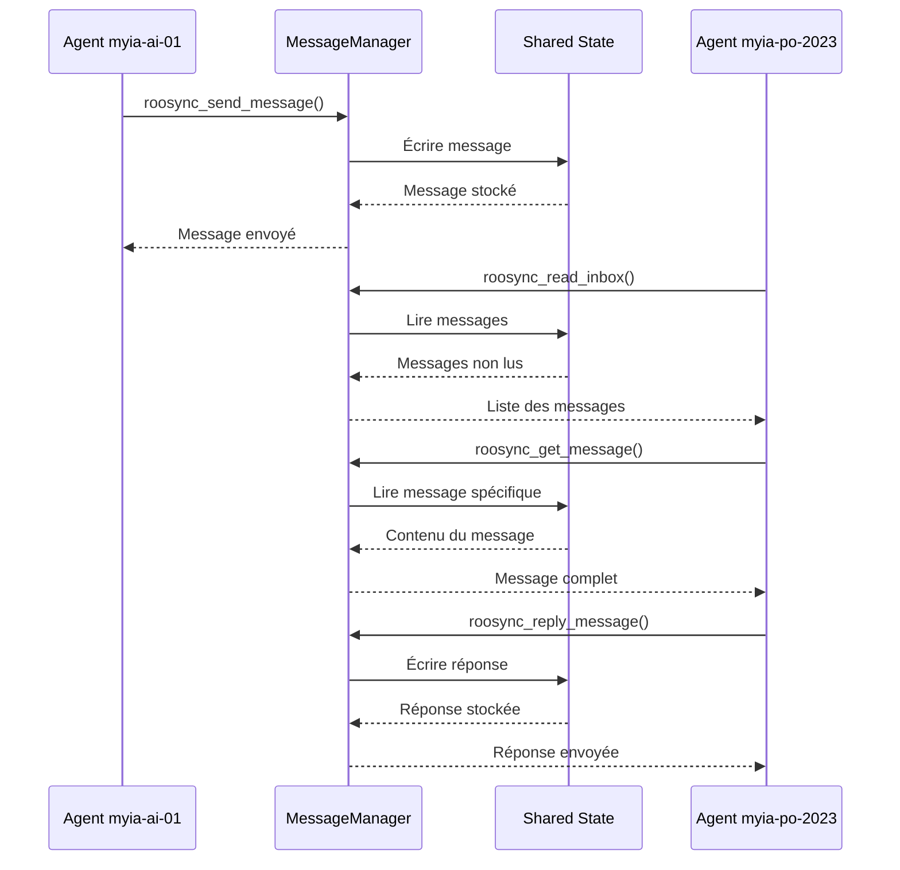
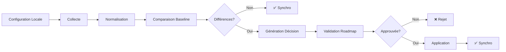

# Architecture RooSync v2.3.0

## Version: 1.1.0
## Date de création: 2026-01-02
## Dernière mise à jour: 2026-01-15

## Description

Ce document décrit l'architecture technique complète du système RooSync v2.3.0, incluant les 8 services principaux, les 24 outils MCP, les diagrammes de flux et les protocoles de communication.

---

## Table des Matières

1. [Vue d'Ensemble](#1-vue-densemble)
2. [Services Principaux](#2-services-principaux)
3. [Outils MCP](#3-outils-mcp)
4. [Diagrammes de Flux](#4-diagrammes-de-flux)
5. [Protocoles de Communication](#5-protocoles-de-communication)
6. [Architecture de Données](#6-architecture-de-données)
7. [Sécurité](#7-sécurité)
8. [Historique des Modifications](#8-historique-des-modifications)

---

## 1. Vue d'Ensemble

### 1.1 Objectifs Architecturaux

RooSync v2.3.0 est conçu pour répondre aux objectifs suivants :

- **Synchronisation Baseline-Driven** : Utilisation d'une baseline unique comme source de vérité
- **Coordination Multi-Agents** : Communication entre agents sur différentes machines
- **Validation Humaine** : Workflow de validation pour toutes les opérations critiques
- **Gestion des Configurations** : Normalisation, diff et application des configurations
- **Sécurité** : Gestion des secrets, rollback automatique, et traçabilité complète

### 1.2 Architecture de Haut Niveau



### 1.3 Architecture Baseline Unifiée (T3.9)

**Décision (2026-01-15)** : Suite à l'analyse T3.9, le modèle **Non-Nominatif v3.0** a été choisi comme baseline unique.

| Critère         | Non-Nominatif v3.0  | Nominatif v2.1 | Choix    |
| --------------- | ------------------- | -------------- | -------- |
| Modularité      | Services distincts  | Monolithique   | **v3.0** |
| Vie privée      | Anonymisé           | Nominatif      | **v3.0** |
| Conformité      | RGPD-ready          | À adapter      | **v3.0** |
| Tests           | 100% couverture     | Partielle      | **v3.0** |
| Migration       | Progressive         | Breaking       | v2.1     |
| Backward compat | Non                 | Oui            | v2.1     |

**Résultat** : v3.0 gagne 4-2

**Service Principal** : [`NonNominativeBaselineService`](../../mcps/internal/servers/roo-state-manager/src/services/roosync/NonNominativeBaselineService.ts:1)

**Note** : L'ancien `BaselineService` (v2.1) est conservé pour backward compatibility mais ne doit plus être utilisé pour de nouveaux développements.

**Référence** : [T3.9 Analyse Baseline Unique](../suivi/RooSync/T3_9_ANALYSE_BASELINE_UNIQUE.md)

---

## 2. Services Principaux

### 2.1 NonNominativeBaselineService

**Responsabilité** : Gestion de la baseline non-nominative (v2.3)

**Méthodes principales** :
- `getBaseline()` : Lire la baseline actuelle
- `updateBaseline(config)` : Mettre à jour la baseline
- `versionBaseline(version)` : Versionner la baseline
- `restoreBaseline(version)` : Restaurer une version
- `exportBaseline(format)` : Exporter la baseline

**Fichiers** :
- `sync-config.ref.json` : Baseline de référence
- `backups/baseline-*.json` : Sauvegardes

**Emplacement** : `mcps/internal/servers/roo-state-manager/src/services/roosync/NonNominativeBaselineService.ts`

### 2.2 ConfigSharingService

**Responsabilité** : Partage de configurations entre machines

**Méthodes principales** :
- `collectConfig(targets)` : Collecter la configuration locale
- `publishConfig(package, version, description)` : Publier un package
- `applyConfig(version, targets)` : Appliquer une configuration

**Fichiers** :
- `.shared-state/packages/` : Packages de configuration
- `.shared-state/versions/` : Métadonnées de version

**Emplacement** : `mcps/internal/servers/roo-state-manager/src/services/roosync/ConfigSharingService.ts`

### 2.3 ConfigNormalizationService

**Responsabilité** : Normalisation des configurations multi-environnements

**Méthodes principales** :
- `normalizeConfig(config)` : Normaliser une configuration
- `applyCategoryRules(config)` : Appliquer les règles par catégorie
- `aggregateConfigs(sources)` : Agréger plusieurs configurations

**Fichiers** :
- `profiles/` : Profils de normalisation
- `config/normalization-rules.json` : Règles de normalisation

**Emplacement** : `mcps/internal/servers/roo-state-manager/src/services/roosync/ConfigNormalizationService.ts`

### 2.4 ConfigDiffService

**Responsabilité** : Comparaison et diff de configurations

**Méthodes principales** :
- `compareConfigs(source, target)` : Comparer deux configurations
- `generateDiff(source, target)` : Générer un diff
- `applyDiff(config, diff)` : Appliquer un diff

**Fichiers** :
- `.shared-state/diffs/` : Diffs stockés

**Emplacement** : `mcps/internal/servers/roo-state-manager/src/services/roosync/ConfigDiffService.ts`

### 2.5 InventoryService

**Responsabilité** : Inventaire des machines et configurations

**Méthodes principales** :
- `getMachineInventory(machineId)` : Obtenir l'inventaire d'une machine
- `getAllMachines()` : Lister toutes les machines
- `updateMachineInventory(machineId, inventory)` : Mettre à jour l'inventaire

**Fichiers** :
- `.shared-state/inventory/` : Inventaires des machines
- `cache/machine-inventory-*.json` : Cache TTL 1h

**Emplacement** : `mcps/internal/servers/roo-state-manager/src/services/roosync/InventoryService.ts`

### 2.6 MessageManager

**Responsabilité** : Système de messagerie inter-agents

**Méthodes principales** :
- `sendMessage(to, subject, body, priority)` : Envoyer un message
- `readInbox(status, limit)` : Lire la boîte de réception
- `getMessage(messageId)` : Obtenir un message
- `replyMessage(messageId, body)` : Répondre à un message
- `markMessageRead(messageId)` : Marquer comme lu
- `archiveMessage(messageId)` : Archiver un message

**Fichiers** :
- `.shared-state/messages/inbox/` : Messages reçus
- `.shared-state/messages/sent/` : Messages envoyés
- `.shared-state/messages/archive/` : Messages archivés

**Emplacement** : `mcps/internal/servers/roo-state-manager/src/services/roosync/MessageManager.ts`

### 2.7 DecisionManager

**Responsabilité** : Gestion des décisions de synchronisation

**Méthodes principales** :
- `createDecision(diff)` : Créer une décision
- `approveDecision(decisionId)` : Approuver une décision
- `rejectDecision(decisionId, reason)` : Rejeter une décision
- `applyDecision(decisionId, dryRun)` : Appliquer une décision
- `rollbackDecision(decisionId, reason)` : Annuler une décision
- `getDecisionDetails(decisionId)` : Obtenir les détails d'une décision

**Fichiers** :
- `sync-roadmap.md` : Roadmap de validation
- `.shared-state/decisions/` : Décisions stockées

**Emplacement** : `mcps/internal/servers/roo-state-manager/src/services/roosync/DecisionManager.ts`

### 2.8 DashboardService

**Responsabilité** : Tableau de bord et monitoring

**Méthodes principales** :
- `getDashboard(machineFilter)` : Obtenir le tableau de bord
- `readDashboard(machineFilter, includeDetails)` : Lire le dashboard avec détails
- `getMachineStatus(machineId)` : Obtenir le statut d'une machine

**Fichiers** :
- `.shared-state/dashboard/` : Données du dashboard
- `cache/dashboard-*.json` : Cache du dashboard

**Emplacement** : `mcps/internal/servers/roo-state-manager/src/services/roosync/DashboardService.ts`

### 2.9 CommitLogService (T3.15c)

**Responsabilité** : Log ordonné de commits pour cohérence distribuée

**Ajouté** : 2026-01-18 (T3.15c)

**Objectif** : Garantir que toutes les machines appliquent les mêmes opérations dans le même ordre, assurant la cohérence finale.

**Méthodes principales** :
- `addEntry(type, data)` : Ajouter une entrée au log
- `getEntries(filter)` : Récupérer les entrées du log
- `applyCommit(commitId)` : Appliquer un commit avec gestion des dépendances
- `rollbackCommit(commitId)` : Rollback avec gestion des dépendances inverses
- `verifyConsistency()` : Vérifier la cohérence du log
- `cleanup(beforeDate)` : Nettoyer les entrées anciennes

**Fichiers** :
- `.shared-state/commit-log/*.json` : Entrées du log
- `.shared-state/commit-log/state.json` : État du commit log
- `.shared-state/commit-log/locks/` : Verrouillage

**Emplacement** : `mcps/internal/servers/roo-state-manager/src/services/roosync/CommitLogService.ts`

**Tests** : 40+ tests (unitaires + intégration)

**Référence** : [Rapport T3.15c](../suivi/RooSync/Archives/T3.15c_RAPPORT_COMPLETION.md)

---

## 3. Outils MCP

### 3.1 Liste des 24 Outils

| # | Outil | Description | Service | Phase Workflow |
|---|-------|-------------|---------|----------------|
| 1 | `roosync_init` | Initialiser l'infrastructure RooSync | DashboardService | Setup |
| 2 | `roosync_get_status` | Obtenir l'état de synchronisation | DashboardService | Monitoring |
| 3 | `roosync_compare_config` | Comparer les configurations | ConfigDiffService | Analyse |
| 4 | `roosync_list_diffs` | Lister les différences | ConfigDiffService | Analyse |
| 5 | `roosync_approve_decision` | Approuver une décision de synchronisation | DecisionManager | Validation |
| 6 | `roosync_reject_decision` | Rejeter une décision de synchronisation | DecisionManager | Validation |
| 7 | `roosync_apply_decision` | Appliquer une décision approuvée | DecisionManager | Exécution |
| 8 | `roosync_rollback_decision` | Annuler une décision appliquée | DecisionManager | Recovery |
| 9 | `roosync_get_decision_details` | Obtenir les détails d'une décision | DecisionManager | Audit |
| 10 | `roosync_send_message` | Envoyer un message à une autre machine | MessageManager | Communication |
| 11 | `roosync_read_inbox` | Lire la boîte de réception des messages | MessageManager | Communication |
| 12 | `roosync_get_message` | Obtenir les détails d'un message | MessageManager | Communication |
| 13 | `roosync_mark_message_read` | Marquer un message comme lu | MessageManager | Communication |
| 14 | `roosync_archive_message` | Archiver un message | MessageManager | Communication |
| 15 | `roosync_reply_message` | Répondre à un message | MessageManager | Communication |
| 16 | `roosync_collect_config` | Collecter la configuration locale | ConfigSharingService | Collecte |
| 17 | `roosync_publish_config` | Publier une configuration partagée | ConfigSharingService | Publication |
| 18 | `roosync_apply_config` | Appliquer une configuration partagée | ConfigSharingService | Application |
| 19 | `roosync_get_machine_inventory` | Collecter l'inventaire machine | InventoryService | Inventaire |
| 20 | `roosync_read_dashboard` | Lire le dashboard RooSync | DashboardService | Monitoring |
| 21 | `roosync_list_diffs` | Lister les différences détectées | ConfigDiffService | Analyse |
| 22 | `roosync_approve_decision` | Approuver une décision | DecisionManager | Validation |
| 23 | `roosync_reject_decision` | Rejeter une décision | DecisionManager | Validation |
| 24 | `roosync_apply_decision` | Appliquer une décision | DecisionManager | Exécution |

### 3.2 ROOSYNC AUTONOMOUS PROTOCOL (RAP)

Le protocole RAP définit 4 verbes pour l'autonomie des agents :

| Verbe | Outil MCP | Description |
|-------|-----------|-------------|
| **OBSERVER** | `roosync_get_status` | Observer l'état du système |
| **SIGNALER** | `roosync_send_message` | Signaler un événement ou problème |
| **COMMUNIQUER** | `roosync_read_inbox` / `roosync_reply_message` | Communiquer avec d'autres agents |
| **AGIR** | `roosync_apply_decision` | Agir sur le système |

---

## 4. Diagrammes de Flux

### 4.1 Workflow de Synchronisation Basique



### 4.2 Workflow de Communication Multi-Agents



### 4.3 Workflow de Décision



---

## 5. Protocoles de Communication

### 5.1 Protocole de Synchronisation

#### 5.1.1 Cycle de Synchronisation

1. **Observation** : `roosync_get_status()` pour observer l'état
2. **Collecte** : `roosync_collect_config()` pour collecter la config locale
3. **Comparaison** : `roosync_compare_config()` pour comparer avec la baseline
4. **Validation** : Consultation de `sync-roadmap.md` pour validation humaine
5. **Application** : `roosync_apply_decision()` pour appliquer les décisions
6. **Vérification** : `roosync_get_status()` pour vérifier le résultat

#### 5.1.2 Stratégie Baseline-Driven

RooSync utilise une stratégie **baseline-driven** plutôt que machine-à-machine :

1. **Baseline Unique** : `sync-config.ref.json` est la source de vérité
2. **Validation Humaine** : Toutes les modifications passent par `sync-roadmap.md`
3. **Application Contrôlée** : Les décisions sont approuvées avant application
4. **Rollback Automatique** : Possibilité de revenir à une version précédente

### 5.2 Protocole de Messagerie

#### 5.2.1 Structure d'un Message

```json
{
  "id": "msg-20251227-001",
  "from": "myia-ai-01",
  "to": "myia-po-2023",
  "subject": "Synchronisation requise",
  "body": "La baseline a été mise à jour. Veuillez synchroniser.",
  "priority": "HIGH",
  "status": "unread",
  "timestamp": "2025-12-27T03:00:00Z",
  "tags": ["sync", "baseline"],
  "thread_id": "thread-20251227-001"
}
```

#### 5.2.2 Priorités des Messages

| Priorité | Description | Usage |
|----------|-------------|-------|
| LOW | Information non critique | Notifications, logs |
| MEDIUM | Information importante | Mises à jour, rapports |
| HIGH | Action requise | Synchronisations, alertes |
| URGENT | Action immédiate requise | Erreurs critiques, incidents |

### 5.3 Protocole de Décision

#### 5.3.1 Cycle de Vie d'une Décision

1. **Création** : Une décision est créée lors de la détection de différences
2. **Validation** : La décision est soumise à validation humaine via `sync-roadmap.md`
3. **Approbation/Rejet** : La décision est approuvée ou rejetée
4. **Application** : Si approuvée, la décision est appliquée
5. **Rollback** : Si nécessaire, la décision peut être annulée

#### 5.3.2 Critères de Validation

- **Impact** : Évaluer l'impact de la modification
- **Risque** : Évaluer le risque de la modification
- **Nécessité** : Vérifier si la modification est nécessaire
- **Urgence** : Évaluer l'urgence de la modification

---

## 6. Architecture de Données

### 6.1 Structure des Fichiers

```
d:/roo-extensions/
├── sync-config.ref.json          # Baseline de référence
├── sync-roadmap.md               # Roadmap de validation
├── .shared-state/
│   ├── messages/
│   │   ├── inbox/                # Messages reçus
│   │   ├── sent/                 # Messages envoyés
│   │   └── archive/              # Messages archivés
│   ├── inventory/                # Inventaires des machines
│   ├── decisions/               # Décisions de synchronisation
│   ├── packages/                # Packages de configuration
│   ├── versions/                # Métadonnées de version
│   ├── diffs/                   # Diffs stockés
│   └── dashboard/               # Données du dashboard
├── backups/
│   └── baseline-*.json          # Sauvegardes de baseline
└── cache/
    ├── machine-inventory-*.json  # Cache d'inventaire
    └── dashboard-*.json         # Cache du dashboard
```

### 6.2 Format de la Baseline

```json
{
  "version": "2.3.0",
  "baseline": {
    "modes": {
      "enabled": ["architect", "code", "debug", "ask", "orchestrator", "manager"]
    },
    "mcp": {
      "servers": {
        "quickfiles": { "enabled": true },
        "jinavigator": { "enabled": true },
        "searxng": { "enabled": true },
        "markitdown": { "enabled": true },
        "playwright": { "enabled": true },
        "roo-state-manager": { "enabled": true }
      }
    }
  }
}
```

### 6.3 Politique de Stockage

- **Code in Git** : Configuration et scripts versionnés
- **Data in Shared Drive** : Données d'exécution et messages
- **Baseline in Reference** : `sync-config.ref.json` comme source de vérité

---

## 7. Sécurité

### 7.1 Gestion des Secrets

- **Clés API** : Stockées dans un gestionnaire de secrets (non en clair)
- **Mots de passe** : Utilisation de variables d'environnement
- **Tokens** : Rotation régulière des tokens

### 7.2 Contrôle d'Accès

- **Rôles** : Baseline Master, Agent, Coordinateur Technique, Testeur
- **Permissions** : Accès basé sur les rôles
- **Audit** : Traçabilité complète des actions

### 7.3 Rollback Automatique

- **Snapshots** : Snapshots automatiques avant chaque modification
- **Restauration** : Possibilité de restaurer une version précédente
- **Validation** : Validation après chaque restauration

---

## 8. Historique des Modifications

| Date       | Version | Auteur           | Description                                                              |
| ---------- | ------- | ---------------- | ------------------------------------------------------------------------ |
| 2026-01-02 | 1.0.0   | Roo Architect    | Création initiale du document d'architecture v2.3.0                      |
| 2026-01-15 | 1.1.0   | Claude Code      | T3.11 - Mise à jour section 1.3 : Architecture Baseline Unifiée (T3.9)   |

---

**Document généré par:** Roo Architect Mode
**Dernière mise à jour par:** Claude Code (T3.11)
**Date de génération:** 2026-01-02T11:37:00Z
**Dernière modification:** 2026-01-15
**Version:** 1.1.0
**Statut:** 🟢 Production Ready
