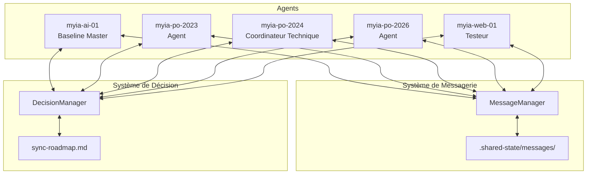
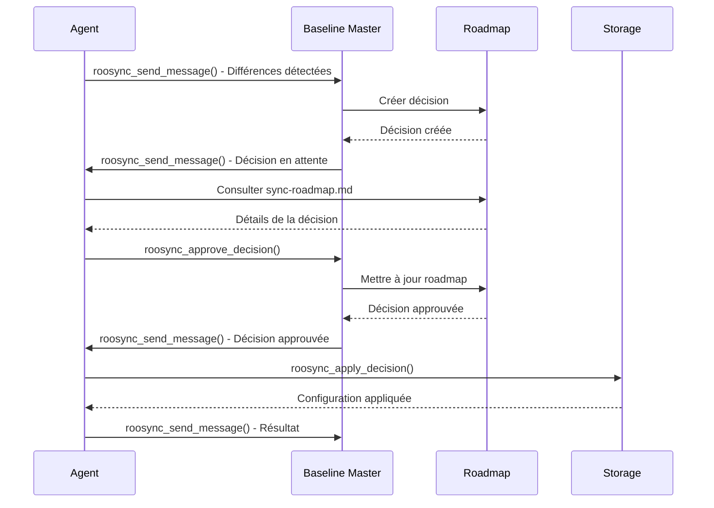
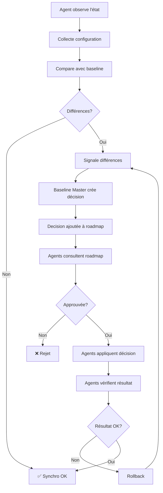
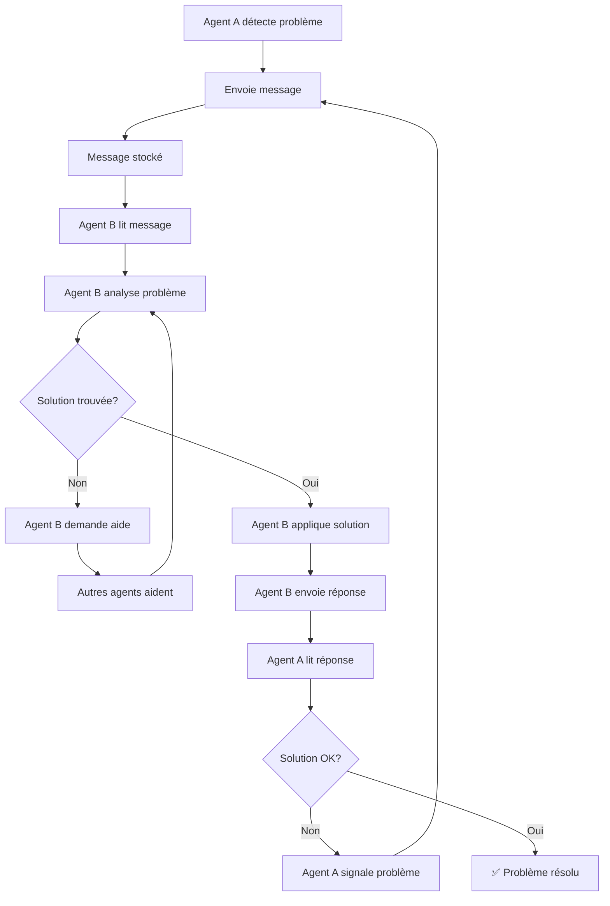
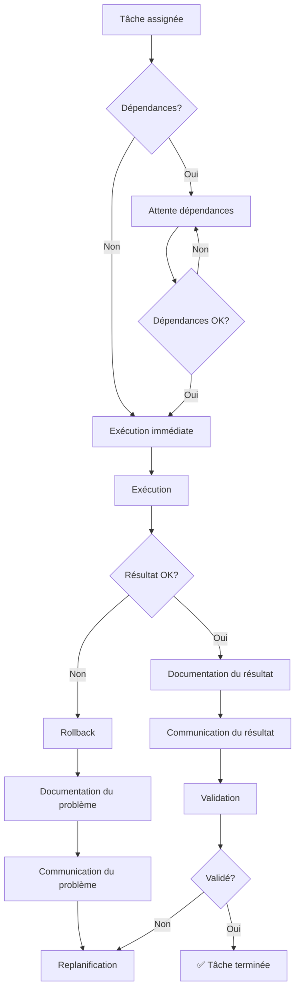

# Gestion Multi-Agent RooSync

## Version: 1.0.0
## Date de création: 2026-01-02
## Dernière mise à jour: 2026-01-02

## Description

Ce document décrit les protocoles de communication multi-agent, la gestion des conflits, les procédures de coordination et les rôles et responsabilités dans le système RooSync.

---

## Table des Matières

1. [Vue d'Ensemble](#1-vue-densemble)
2. [Rôles et Responsabilités](#2-rôles-et-responsabilités)
3. [Protocoles de Communication](#3-protocoles-de-communication)
4. [Gestion des Conflits](#4-gestion-des-conflits)
5. [Procédures de Coordination](#5-procédures-de-coordination)
6. [Workflow Multi-Agent](#6-workflow-multi-agent)
7. [Bonnes Pratiques](#7-bonnes-pratiques)
8. [Historique des Modifications](#8-historique-des-modifications)

---

## 1. Vue d'Ensemble

### 1.1 Architecture Multi-Agent

RooSync est conçu pour fonctionner avec plusieurs agents sur différentes machines, chacun ayant des rôles et responsabilités spécifiques.

**Machines supportées** :

| Machine | Rôle | OS | Statut |
|---------|------|-----|--------|
| myia-ai-01 | Baseline Master | Windows | 🟢 Actif |
| myia-po-2023 | Agent | Windows | 🟢 Actif |
| myia-po-2024 | Coordinateur Technique | Windows | 🟢 Actif |
| myia-po-2026 | Agent | Windows | 🟢 Actif |
| myia-web-01 | Testeur | Windows | 🟢 Actif |

### 1.2 Objectifs de la Gestion Multi-Agent

- **Coordination** : Assurer la coordination entre les agents
- **Communication** : Faciliter la communication entre les agents
- **Résolution de conflits** : Gérer les conflits de manière efficace
- **Traçabilité** : Maintenir une traçabilité complète des actions
- **Sécurité** : Garantir la sécurité des opérations multi-agent

### 1.3 Architecture de Communication



---

## 2. Rôles et Responsabilités

### 2.1 Baseline Master (myia-ai-01)

**Rôle** : Responsable de la gestion de la baseline nominative

**Responsabilités** :
- Gérer la baseline de référence (`sync-config.ref.json`)
- Valider les décisions de synchronisation
- Coordonner les opérations multi-agent
- Maintenir la cohérence de la configuration
- Gérer les conflits de configuration

**Outils principaux** :
- `roosync_update_baseline`
- `roosync_approve_decision`
- `roosync_apply_decision`
- `roosync_get_status`

### 2.2 Agent (myia-po-2023, myia-po-2026)

**Rôle** : Participer au système de synchronisation

**Responsabilités** :
- Collecter la configuration locale
- Appliquer les décisions de synchronisation
- Signaler les problèmes et anomalies
- Communiquer avec les autres agents
- Maintenir la synchronisation locale

**Outils principaux** :
- `roosync_collect_config`
- `roosync_apply_config`
- `roosync_send_message`
- `roosync_read_inbox`

### 2.3 Coordinateur Technique (myia-po-2024)

**Rôle** : Coordonner les aspects techniques du système

**Responsabilités** :
- Coordonner la transition v2.1→v2.3
- Gérer les aspects techniques de la synchronisation
- Valider les modifications techniques
- Documenter les évolutions techniques
- Assurer la cohérence technique

**Outils principaux** :
- `roosync_compare_config`
- `roosync_list_diffs`
- `roosync_get_machine_inventory`
- `roosync_send_message`

### 2.4 Testeur (myia-web-01)

**Rôle** : Tester et valider les fonctionnalités

**Responsabilités** :
- Tester les nouvelles fonctionnalités
- Valider les corrections de bugs
- Exécuter les tests E2E
- Signaler les problèmes de qualité
- Documenter les résultats de tests

**Outils principaux** :
- `roosync_apply_decision` (mode dryRun)
- `roosync_get_status`
- `roosync_send_message`
- `roosync_read_inbox`

---

## 3. Protocoles de Communication

### 3.1 Protocole de Messagerie

#### Structure d'un Message

```json
{
  "id": "msg-20260102-001",
  "from": "myia-ai-01",
  "to": "myia-po-2023",
  "subject": "Synchronisation requise",
  "body": "La baseline a été mise à jour. Veuillez synchroniser.",
  "priority": "HIGH",
  "status": "unread",
  "timestamp": "2026-01-02T10:00:00Z",
  "tags": ["sync", "baseline"],
  "thread_id": "thread-20260102-001"
}
```

#### Priorités des Messages

| Priorité | Description | Usage | Délai de réponse attendu |
|----------|-------------|-------|-------------------------|
| LOW | Information non critique | Notifications, logs | 24h |
| MEDIUM | Information importante | Mises à jour, rapports | 8h |
| HIGH | Action requise | Synchronisations, alertes | 2h |
| URGENT | Action immédiate requise | Erreurs critiques, incidents | 30min |

### 3.2 Protocole de Synchronisation

#### Cycle de Synchronisation

1. **Observation** : L'agent observe l'état du système
2. **Collecte** : L'agent collecte sa configuration locale
3. **Comparaison** : L'agent compare sa configuration avec la baseline
4. **Signalisation** : L'agent signale les différences au Baseline Master
5. **Décision** : Le Baseline Master crée une décision
6. **Validation** : La décision est validée via `sync-roadmap.md`
7. **Application** : L'agent applique la décision
8. **Vérification** : L'agent vérifie le résultat

#### Workflow de Synchronisation



### 3.3 Protocole de Coordination

#### Coordination des Tâches

1. **Assignation** : Les tâches sont assignées aux agents appropriés
2. **Dépendances** : Les dépendances entre tâches sont identifiées
3. **Séquence** : Les tâches sont séquencées selon les dépendances
4. **Exécution** : Les agents exécutent leurs tâches
5. **Validation** : Les résultats sont validés
6. **Documentation** : Les résultats sont documentés

#### Coordination des Conflits

1. **Détection** : Les conflits sont détectés automatiquement
2. **Signalisation** : Les conflits sont signalés aux agents concernés
3. **Négociation** : Les agents négocient une résolution
4. **Validation** : La résolution est validée
5. **Application** : La résolution est appliquée
6. **Documentation** : La résolution est documentée

---

## 4. Gestion des Conflits

### 4.1 Types de Conflits

#### Conflits de Configuration

**Description** : Différences entre les configurations des agents

**Exemples** :
- Différentes versions de Node.js
- Différentes configurations MCP
- Différents modes activés

**Résolution** :
1. Comparer les configurations
2. Identifier les différences
3. Créer une décision
4. Valider la décision
5. Appliquer la décision

#### Conflits d'Identité

**Description** : Conflits d'identité entre les agents

**Exemples** :
- Deux agents avec le même ID
- Conflit myia-web-01 vs myia-web1

**Résolution** :
1. Identifier le conflit
2. Corriger l'identité
3. Valider l'unicité
4. Redémarrer l'agent

#### Conflits de Synchronisation

**Description** : Conflits lors de la synchronisation

**Exemples** :
- Conflits Git
- Conflits de fichiers
- Conflits de versions

**Résolution** :
1. Identifier le conflit
2. Analyser le conflit
3. Résoudre le conflit
4. Valider la résolution
5. Documenter la résolution

### 4.2 Procédures de Résolution

#### Procédure de Résolution de Conflit de Configuration

1. **Détection** :
   ```bash
   roosync_compare_config { "source": "local_machine", "target": "baseline_reference" }
   ```

2. **Analyse** :
   ```bash
   roosync_list_diffs { "filterType": "all" }
   ```

3. **Création de décision** :
   - Le Baseline Master crée une décision
   - La décision est ajoutée à `sync-roadmap.md`

4. **Validation** :
   - Les agents consultent `sync-roadmap.md`
   - Les agents approuvent ou rejettent la décision

5. **Application** :
   ```bash
   roosync_apply_decision { "decisionId": "DECISION_ID", "dryRun": false }
   ```

6. **Vérification** :
   ```bash
   roosync_get_status
   ```

#### Procédure de Résolution de Conflit d'Identité

1. **Détection** :
   - Le système détecte un conflit d'identité
   - Un message est envoyé aux agents concernés

2. **Analyse** :
   - Les agents analysent le conflit
   - Les agents identifient la source du conflit

3. **Correction** :
   - Les agents corrigent leur identité
   - Les agents valident l'unicité

4. **Redémarrage** :
   - Les agents redémarrent
   - Les agents valident leur identité

5. **Documentation** :
   - Le conflit est documenté
   - La résolution est documentée

#### Procédure de Résolution de Conflit de Synchronisation

1. **Détection** :
   - Le système détecte un conflit de synchronisation
   - Un message est envoyé aux agents concernés

2. **Analyse** :
   - Les agents analysent le conflit
   - Les agents identifient la source du conflit

3. **Résolution** :
   - Les agents résolvent le conflit
   - Les agents valident la résolution

4. **Validation** :
   - Les agents valident la synchronisation
   - Les agents vérifient l'intégrité

5. **Documentation** :
   - Le conflit est documenté
   - La résolution est documentée

### 4.3 Prévention des Conflits

#### Prévention des Conflits de Configuration

- **Maintenir une baseline unique** : Utiliser `sync-config.ref.json` comme source de vérité
- **Valider les modifications** : Valider toutes les modifications avant application
- **Documenter les changements** : Documenter tous les changements de configuration
- **Utiliser le mode dryRun** : Tester les modifications avant application

#### Prévention des Conflits d'Identité

- **Valider l'unicité** : Valider l'unicité des identités au démarrage
- **Utiliser des IDs uniques** : Utiliser des IDs uniques pour chaque agent
- **Documenter les identités** : Documenter les identités des agents
- **Surveiller les conflits** : Surveiller les conflits d'identité

#### Prévention des Conflits de Synchronisation

- **Synchroniser régulièrement** : Synchroniser régulièrement les configurations
- **Utiliser des branches** : Utiliser des branches pour les modifications
- **Valider avant de pousser** : Valider les modifications avant de pousser
- **Documenter les conflits** : Documenter les conflits et leurs résolutions

---

## 5. Procédures de Coordination

### 5.1 Coordination des Tâches

#### Assignation des Tâches

Les tâches sont assignées aux agents selon leurs rôles et responsabilités :

| Tâche | Agent Responsable | Critères |
|--------|------------------|----------|
| Gestion de la baseline | myia-ai-01 | Baseline Master |
| Collecte de configuration | Tous les agents | Agent |
| Comparaison de configuration | myia-po-2024 | Coordinateur Technique |
| Validation de décision | myia-ai-01 | Baseline Master |
| Application de décision | Tous les agents | Agent |
| Tests | myia-web-01 | Testeur |

#### Séquence des Tâches

Les tâches sont séquencées selon les dépendances :

1. **Tâches indépendantes** : Peuvent être exécutées en parallèle
2. **Tâches dépendantes** : Doivent être exécutées séquentiellement
3. **Tâches critiques** : Doivent être exécutées en priorité

#### Validation des Tâches

Chaque tâche est validée selon des critères spécifiques :

- **Critères de succès** : La tâche est considérée comme réussie si les critères sont remplis
- **Critères de validation** : La tâche est validée si les critères sont remplis
- **Critères de documentation** : La tâche est documentée si les critères sont remplis

### 5.2 Coordination des Décisions

#### Création des Décisions

Les décisions sont créées par le Baseline Master :

1. **Détection** : Le Baseline Master détecte une différence
2. **Analyse** : Le Baseline Master analyse la différence
3. **Création** : Le Baseline Master crée une décision
4. **Publication** : Le Baseline Master publie la décision

#### Validation des Décisions

Les décisions sont validées par les agents :

1. **Consultation** : Les agents consultent `sync-roadmap.md`
2. **Analyse** : Les agents analysent la décision
3. **Approbation/Rejet** : Les agents approuvent ou rejettent la décision
4. **Documentation** : Les agents documentent leur décision

#### Application des Décisions

Les décisions sont appliquées par les agents :

1. **Notification** : Les agents reçoivent une notification
2. **Préparation** : Les agents préparent l'application
3. **Application** : Les agents appliquent la décision
4. **Vérification** : Les agents vérifient le résultat

### 5.3 Coordination des Communications

#### Communication des Problèmes

Les problèmes sont communiqués selon les priorités :

1. **Problèmes critiques** : Communication immédiate (URGENT)
2. **Problèmes importants** : Communication rapide (HIGH)
3. **Problèmes mineurs** : Communication normale (MEDIUM)
4. **Informations** : Communication différée (LOW)

#### Communication des Résultats

Les résultats sont communiqués selon les critères :

1. **Résultats critiques** : Communication immédiate (URGENT)
2. **Résultats importants** : Communication rapide (HIGH)
3. **Résultats mineurs** : Communication normale (MEDIUM)
4. **Informations** : Communication différée (LOW)

#### Communication des Décisions

Les décisions sont communiquées selon les critères :

1. **Décisions critiques** : Communication immédiate (URGENT)
2. **Décisions importantes** : Communication rapide (HIGH)
3. **Décisions mineures** : Communication normale (MEDIUM)
4. **Informations** : Communication différée (LOW)

---

## 6. Workflow Multi-Agent

### 6.1 Workflow de Synchronisation



### 6.2 Workflow de Communication



### 6.3 Workflow de Coordination



---

## 7. Bonnes Pratiques

### 7.1 Communication

- **Utiliser des priorités appropriées** pour les messages
- **Inclure des tags** pour faciliter la recherche
- **Répondre rapidement** aux messages urgents
- **Documenter les communications** pour référence future
- **Utiliser des threads** pour les conversations complexes

### 7.2 Coordination

- **Planifier les tâches** en tenant compte des dépendances
- **Communiquer régulièrement** sur l'état des tâches
- **Valider les résultats** avant de passer à la tâche suivante
- **Documenter les décisions** pour référence future
- **Utiliser le mode dryRun** pour tester les modifications

### 7.3 Résolution de Conflits

- **Identifier la source** du conflit
- **Analyser le conflit** en détail
- **Négocier une résolution** avec les agents concernés
- **Valider la résolution** avant application
- **Documenter la résolution** pour référence future

### 7.4 Documentation

- **Documenter toutes les actions** pour traçabilité
- **Utiliser des formats standardisés** pour la documentation
- **Inclure des exemples** pour clarifier les concepts
- **Maintenir la documentation à jour** régulièrement
- **Utiliser des diagrammes** pour visualiser les concepts

---

## 8. Historique des Modifications

| Date | Version | Auteur | Description |
|------|---------|--------|-------------|
| 2026-01-02 | 1.0.0 | Roo Architect Mode | Création initiale du document de gestion multi-agent |

---

**Document généré par:** Roo Architect Mode
**Date de génération:** 2026-01-02T11:44:00Z
**Version:** 1.0.0
**Statut:** 🟢 Production Ready
