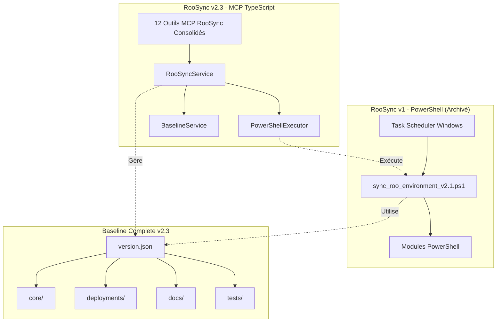
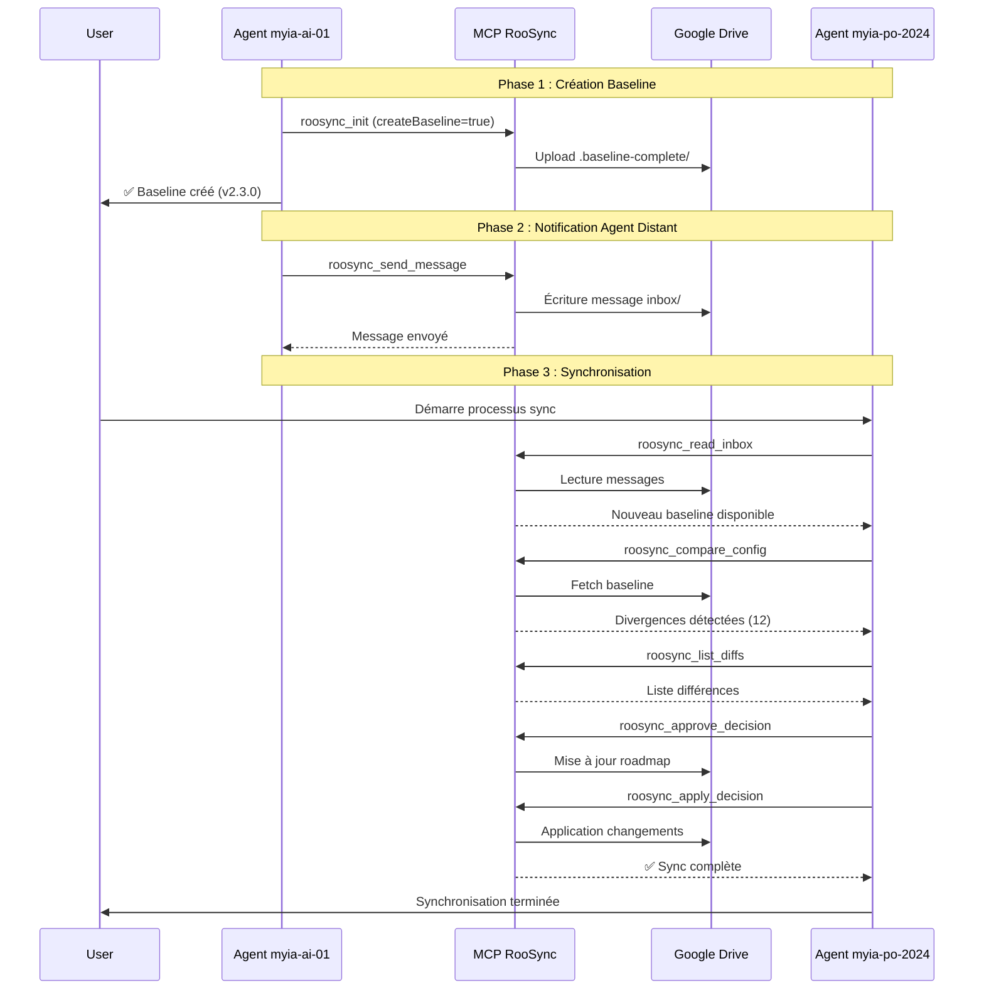
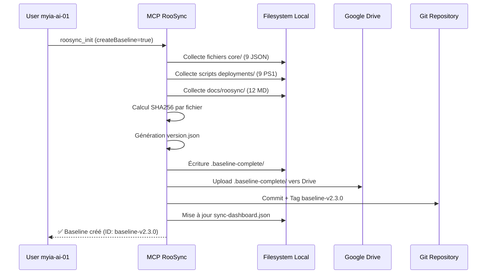
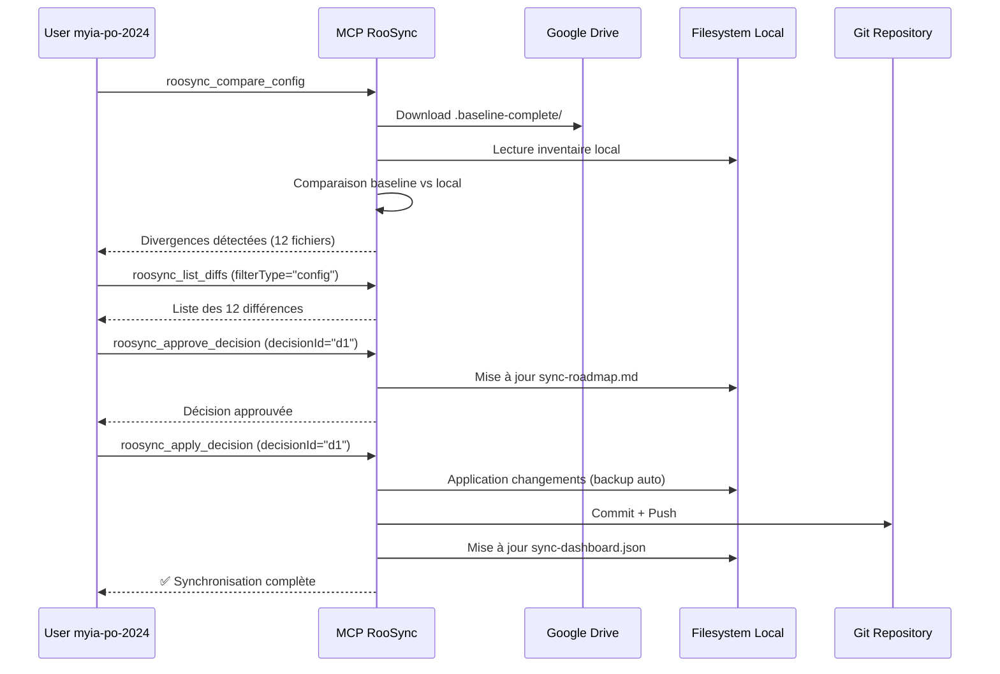
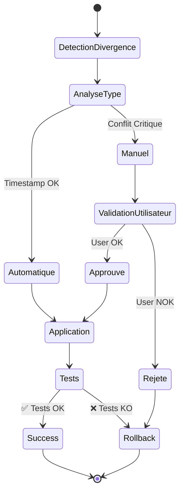

# 🏗️ Guide Technique Unifié RooSync v2.3

**Version** : 2.3.0
**Date de création** : 2025-12-27
**Statut** : 🟢 Production Ready
**Auteur** : Roo Architect Mode

---

## 📋 Table des Matières

1. [Vue d'ensemble](#1-vue-densemble)
2. [Architecture v2.3](#2-architecture-v23)
3. [Système de Messagerie](#3-système-de-messagerie)
4. [Plan d'Implémentation](#4-plan-dimplémentation)
5. [Roadmap](#5-roadmap)
6. [Changelog v2.3](#6-changelog-v23)

---

## 1. Vue d'ensemble

### 1.1 Mission Principale

RooSync v2.3 est un système de synchronisation **baseline-driven** qui maintient la cohérence des environnements Roo entre plusieurs machines en s'appuyant sur une **source de vérité unique** et un **workflow de validation humaine obligatoire**.

**Concept clé** : *Une source de vérité unique, versionnable et distribuée via Git*

### 1.2 Architecture Globale



### 1.3 Composants Techniques

#### roo-state-manager : Le Cœur Technique

Le MCP `roo-state-manager` est le **pivot technique** de l'écosystème RooSync v2.3, fournissant l'infrastructure critique pour la synchronisation baseline-driven.

**Structure Modulaire** :
```
roo-state-manager/
├── src/
│   ├── services/
│   │   ├── BaselineService.ts          ← Cœur baseline v2.3
│   │   ├── ConfigSharingService.ts     ← Orchestrateur Cycle 7
│   │   ├── ConfigNormalizationService.ts ← Normalisation multi-OS & Secrets
│   │   ├── ConfigDiffService.ts        ← Moteur de diff granulaire
│   │   ├── InventoryService.ts         ← Collecte inventaire (Native TS)
│   │   ├── MessageManager.ts           ← Gestion conversations
│   ├── tools/ (42 outils MCP organisés)
│   │   ├── roosync/ (12 outils RooSync v2.3 consolidés)
│   │   ├── exports/ (7 outils XML/JSON/CSV)
│   │   ├── synthesis/ (3 outils résumés LLM)
│   │   └── debug/ (3 outils diagnostic)
│   └── index.ts (point d'entrée serveur MCP)
├── tests/ (suite complète de tests)
├── package.json
└── README.md
```

#### Outils MCP RooSync v2.3 (12 outils consolidés)

Les 12 outils RooSync v2.3 consolidés dans roo-state-manager :

| Outil | Description | Outils Source |
|--------|-------------|---------------|
| `roosync_init` | Initialise infrastructure RooSync | `init.ts` |
| `roosync_get_status` | État synchronisation + dashboard | `get-status.ts` + `read-dashboard.ts` |
| `roosync_compare_config` | Compare configs avec détection réelle | `compare-config.ts` |
| `roosync_list_diffs` | Liste différences détectées | `list-diffs.ts` |
| `roosync_approve_decision` | Approuve décision sync | `approve-decision.ts` |
| `roosync_reject_decision` | Rejette décision avec motif | `reject-decision.ts` |
| `roosync_apply_decision` | Applique décision approuvée | `apply-decision.ts` |
| `roosync_rollback_decision` | Annule décision appliquée | `rollback-decision.ts` |
| `roosync_get_decision_details` | Détails complets décision | `get-decision-details.ts` |
| `roosync_manage_baseline` | Gestion versions (Backup/Restore) | `version-baseline.ts` + `restore-baseline.ts` |
| `roosync_update_baseline` | Met à jour la baseline de référence | `update-baseline.ts` |
| `roosync_export_baseline` | Exporte une baseline vers JSON/YAML/CSV | `export-baseline.ts` |

### 1.4 Workflow de Synchronisation



---

## 2. Architecture v2.3

### 2.1 Modèle de Données : Baseline-Driven

#### Modèle de Synchronisation

**Pattern** : **Machine → Baseline → Machine**

```
┌──────────────┐         ┌──────────────┐         ┌──────────────┐
│              │         │              │         │              │
│  Machine A   │ ──────► │   Baseline   │ ◄────── │  Machine B   │
│ (myia-ai-01) │  Upload │   Complete   │ Download│(myia-po-2024)│
│              │         │   (Git Repo) │         │              │
└──────────────┘         └──────────────┘         └──────────────┘
       │                        │                        │
       │                        │                        │
       ▼                        ▼                        ▼
   SHA256 Hash            Validation              SHA256 Hash
   Calculation            Checksums               Verification
```

**Principes** :
1. **Une seule source de vérité** : Le Baseline stocké dans Git
2. **Validation SHA256** : Intégrité cryptographique de chaque fichier
3. **Dashboard JSON** : Métadonnées et état de synchronisation
4. **Workflow Git** : Versioning et traçabilité via commits/tags

#### Sources de Vérité

| Source | Type | Localisation | Rôle |
|--------|------|--------------|------|
| **Baseline Complete** | Fichiers + JSON | `.baseline-complete/` (Git) | Configuration de référence |
| **Dashboard JSON** | Métadonnées | `sync-dashboard.json` (Google Drive) | État synchronisation temps réel |
| **Git Repository** | Historique | Dépôt principal + sous-module | Versioning et traçabilité |
| **MCP Settings** | Configuration | `mcp_settings.json` | Paramètres serveurs MCP |

### 2.2 Composants Principaux (Cycle 7)

L'architecture technique s'articule autour de services TypeScript natifs au sein du serveur MCP `roo-state-manager` :

1.  **ConfigSharingService** : Orchestrateur principal. Il gère le cycle de vie de la configuration (collecte, partage, application).
2.  **ConfigNormalizationService** (Nouveau Cycle 7) :
    *   **Abstraction OS** : Convertit les chemins Windows (`\`) et POSIX (`/`) vers un format standard interne.
    *   **Placeholders** : Remplace les chemins absolus par des variables dynamiques (`{{WORKSPACE_ROOT}}`, `{{USER_HOME}}`, `{{ROO_ROOT}}`).
    *   **Sécurité** : Détecte et masque automatiquement les clés sensibles (`apiKey`, `token`, `password`) par `{{SECRET:nom_clé}}`.
3.  **ConfigDiffService** (Nouveau Cycle 7) :
    *   **Comparaison Granulaire** : Effectue un "Deep Diff" récursif sur les objets JSON.
    *   **Précision** : Identifie précisément les ajouts (`added`), suppressions (`removed`) et modifications (`modified`) au niveau de la clé.
    *   **Sévérité** : Calcule automatiquement la criticité des changements (ex: modification d'un secret = CRITICAL).
4.  **InventoryService** :
    *   Remplace les scripts PowerShell hérités pour la collecte d'informations système.
    *   Collecte nativement en TypeScript les configurations MCP, Modes et Scripts.
5.  **BaselineService** : Gère le chargement, la validation et la mise à jour du fichier `sync-config.ref.json`.

### 2.3 Structure du Dossier Partagé (.shared-state)
Le dossier pointé par `ROOSYNC_SHARED_PATH` contient :
```
.shared-state/
├── sync-config.ref.json    # La Baseline (Source de vérité)
├── sync-dashboard.json     # État en temps réel des machines
├── sync-roadmap.md         # Interface de validation humaine (Décisions)
├── inventories/            # Inventaires bruts des machines (pour debug)
├── history/                # Historique des modifications
└── snapshots/              # Backups avant application
```

## 3. Protocole RAP (RooSync Autonomous Protocol)

Le protocole RAP définit le comportement autonome des agents Roo. Il repose sur 4 verbes fondamentaux :

1.  **OBSERVER (`roosync_get_status`)** : L'agent vérifie son état par rapport à la Baseline. Il détecte les divergences sans agir.
2.  **SIGNALER (`roosync_list_diffs`)** : En cas de divergence, l'agent signale les différences. Il peut proposer une décision (mise à jour locale ou mise à jour de la baseline).
3.  **COMMUNIQUER (`roosync_send_message`)** : Les agents échangent des informations de coordination (ex: "J'ai mis à jour la baseline", "Conflit détecté").
4.  **AGIR (`roosync_apply_decision`)** : Après validation humaine (via `sync-roadmap.md`), l'agent exécute la synchronisation.

## 4. Système de Messagerie

RooSync intègre un système de messagerie asynchrone JSON-based stocké dans le dossier partagé.

*   **Inbox/Outbox** : Chaque machine possède ses dossiers de messages.
*   **Format** : JSON structuré avec métadonnées (expéditeur, destinataire, timestamp, type, payload).
*   **Outils** :
    *   `roosync_send_message` : Envoi (point-à-point ou broadcast).
    *   `roosync_read_inbox` : Lecture des messages en attente.
    *   `roosync_archive_message` : Archivage après traitement.

## 5. Plan d'Implémentation et Roadmap

### Statut Actuel : Cycle 7 (Terminé)
*   Architecture Baseline-Driven opérationnelle.
*   Services de Normalisation et Diff Granulaire implémentés.
*   Collecte d'inventaire native TypeScript.
*   Tests unitaires stabilisés (Mocking FS).

### Prochaines Étapes (Cycle 8+)
1.  **Déploiement Généralisé** : Mise à jour de tous les agents vers la v2.3.
2.  **Automatisation** : Introduction de tâches planifiées pour l'auto-observation (Check périodique).
3.  **UI Web** : Développement d'une interface graphique pour visualiser le Dashboard et la Roadmap (au lieu des fichiers Markdown/JSON).


#### Format version.json

```json
{
  "version": "2.3.0",
  "timestamp": "2025-12-27T12:00:00Z",
  "machineId": "myia-ai-01",
  "globalSHA256": "abc123def456...",
  "totalFiles": 42,
  "totalSize": 2457600,
  "categories": {
    "core": {
      "files": 9,
      "sha256": "core123...",
      "critical": true
    },
    "deployments": {
      "files": 14,
      "sha256": "deploy456...",
      "critical": true
    },
    "docs": {
      "files": 12,
      "sha256": "docs789...",
      "critical": false
    },
    "tests": {
      "files": 7,
      "sha256": "tests012...",
      "critical": false
    }
  },
  "git": {
    "commit": "eec8f84",
    "branch": "main",
    "tag": "baseline-v2.3.0"
  }
}
```

#### Format checksums.json

```json
{
  "category": "core",
  "timestamp": "2025-12-27T12:00:00Z",
  "files": [
    {
      "path": "roo-modes/n5/scripts/n5-modes-complete.json",
      "sha256": "abc123...",
      "size": 45678,
      "lastModified": "2025-12-26T18:30:00Z",
      "required": true
    },
    {
      "path": "roo-config/mcp_settings.json",
      "sha256": "def456...",
      "size": 12345,
      "lastModified": "2025-12-27T10:00:00Z",
      "required": true
    }
  ]
}
```

### 2.3 roo-state-manager

#### Architecture Interne

**Structure Modulaire** :
```
roo-state-manager/
├── src/
│   ├── services/
│   │   ├── BaselineService.ts          ← Cœur baseline v2.3
│   │   ├── InventoryCollector.ts     ← Collecte inventaire système
│   │   ├── TraceSummaryService.ts     ← Génération résumés intelligents
│   │   ├── MessageManager.ts           ← Gestion conversations
│   │   └── ConversationSkeleton.ts   ← Structure optimisée
│   ├── tools/ (42 outils MCP organisés)
│   │   ├── roosync/ (12 outils RooSync v2.3 consolidés)
│   │   ├── exports/ (7 outils XML/JSON/CSV)
│   │   ├── synthesis/ (3 outils résumés LLM)
│   │   └── debug/ (3 outils diagnostic)
│   ├── utils/
│   │   ├── roo-storage-detector.ts  ← Détection stockage Roo
│   │   └── ... (utilitaires divers)
│   └── index.ts (point d'entrée serveur MCP)
├── tests/ (suite complète de tests)
├── package.json
└── README.md
```

### 2.4 Outils MCP RooSync v2.3

Le serveur MCP `roo-state-manager` expose **12 outils RooSync consolidés** :

| Outil | Rôle | Phase Workflow | Outils Source |
|-------|------|----------------|---------------|
| [`roosync_init`](../../mcps/internal/servers/roo-state-manager/src/tools/roosync/init.ts:1) | Initialisation baseline + roadmap | Phase 1 (Création) | `init.ts` |
| [`roosync_get_status`](../../mcps/internal/servers/roo-state-manager/src/tools/roosync/get-status.ts:1) | État synchronisation global + dashboard | Monitoring | `get-status.ts` + `read-dashboard.ts` |
| [`roosync_compare_config`](../../mcps/internal/servers/roo-state-manager/src/tools/roosync/compare-config.ts:1) | Détection divergences vs baseline | Phase 3 (Sync) | `compare-config.ts` |
| [`roosync_list_diffs`](../../mcps/internal/servers/roo-state-manager/src/tools/roosync/list-diffs.ts:1) | Liste complète des différences | Phase 3 (Analyse) | `list-diffs.ts` |
| [`roosync_approve_decision`](../../mcps/internal/servers/roo-state-manager/src/tools/roosync/approve-decision.ts:1) | Approbation changement | Phase 3 (Validation) | `approve-decision.ts` |
| [`roosync_reject_decision`](../../mcps/internal/servers/roo-state-manager/src/tools/roosync/reject-decision.ts:1) | Rejet de changement | Phase 3 (Validation) | `reject-decision.ts` |
| [`roosync_apply_decision`](../../mcps/internal/servers/roo-state-manager/src/tools/roosync/apply-decision.ts:1) | Application changement approuvé | Phase 3 (Apply) | `apply-decision.ts` |
| [`roosync_rollback_decision`](../../mcps/internal/servers/roo-state-manager/src/tools/roosync/rollback-decision.ts:1) | Annulation changement | Gestion erreurs | `rollback-decision.ts` |
| [`roosync_get_decision_details`](../../mcps/internal/servers/roo-state-manager/src/tools/roosync/get-decision-details.ts:1) | Détails complets d'une décision | Analyse | `get-decision-details.ts` |
| [`roosync_manage_baseline`](../../mcps/internal/servers/roo-state-manager/src/tools/roosync/manage-baseline.ts:1) | Gestion versions (Backup/Restore) | Gestion baseline | `version-baseline.ts` + `restore-baseline.ts` |
| [`roosync_update_baseline`](../../mcps/internal/servers/roo-state-manager/src/tools/roosync/update-baseline.ts:1) | Mise à jour baseline | Gestion baseline | `update-baseline.ts` |
| [`roosync_export_baseline`](../../mcps/internal/servers/roo-state-manager/src/tools/roosync/export-baseline.ts:1) | Export baseline | Gestion baseline | `export-baseline.ts` |

### 2.5 Services Intégrés

#### BaselineService

Le `BaselineService` est le cœur de l'architecture baseline-driven v2.3. Il gère :

- Création et validation des baselines
- Calcul et vérification des checksums SHA256
- Gestion du versioning sémantique
- Intégration avec Git (tags, commits)

#### InventoryCollector

Le `InventoryCollector` assure :

- Collecte de l'inventaire système complet
- Détection automatique du stockage Roo
- Génération de rapports structurés
- Support multi-machines

#### TraceSummaryService

Le `TraceSummaryService` fournit :

- Génération de résumés intelligents
- Analyse de traces de conversation
- Export multi-format (XML, JSON, CSV)
- Intégration LLM pour synthèse

### 2.6 ROOSYNC AUTONOMOUS PROTOCOL (RAP)

**Verbes Fondamentaux** :
Le protocole définit 4 actions primitives pour tout agent autonome :
1. **OBSERVER** (`roosync_get_status`) : Vérifier l'état de synchronisation.
2. **SIGNALER** (`roosync_get_machine_inventory`) : S'identifier et publier son état.
3. **COMMUNIQUER** (`roosync_send_message`) : Coordonner avec les autres agents.
4. **AGIR** (`roosync_apply_decision`) : Exécuter les changements validés.

**Politique de Stockage** :
"Code in Git, Data in Shared Drive". Le code source reste dans le dépôt Git, tandis que les données d'état (baselines, logs, messages) sont stockées exclusivement sur le disque partagé externe (`ROOSYNC_SHARED_PATH`).

---

## 3. Système de Messagerie

### 3.1 Architecture Fichiers

#### Répertoires de Stockage

```
.shared-state/
├── inbox/              # Messages reçus (par machine)
│   ├── myia-ai-01/
│   └── myia-po-2024/
├── sent/               # Messages envoyés (par machine)
│   ├── myia-ai-01/
│   └── myia-po-2024/
└── archive/            # Messages archivés
    ├── 2025-10/
    └── 2025-11/
```

#### Format Message JSON

```json
{
  "id": "msg-20251227-120000-abc1",
  "from": "myia-ai-01",
  "to": "myia-po-2024",
  "subject": "Nouveau Baseline v2.3.0 disponible",
  "body": "Le baseline complete v2.3 est prêt pour synchronisation.",
  "priority": "HIGH",
  "status": "unread",
  "timestamp": "2025-12-27T12:00:00Z",
  "tags": ["baseline", "sync"],
  "metadata": {
    "baselineVersion": "2.3.0",
    "baselineId": "baseline-v2.3.0"
  }
}
```

### 3.2 Format Message JSON

Voir section 3.1 ci-dessus.

### 3.3 Outils MCP de Messagerie

#### roosync_send_message

**Description** : Envoyer un message structuré à une machine destinataire.

**Paramètres** :

```typescript
{
  to: string;          // Machine ID destinataire (ex: 'myia-ai-01')
  subject: string;     // Sujet du message
  body: string;        // Contenu du message (markdown accepté)
  priority?: string;   // 'LOW' | 'MEDIUM' | 'HIGH' | 'URGENT' (défaut: 'MEDIUM')
  tags?: string[];     // Tags optionnels pour catégorisation
  thread_id?: string;  // ID de thread pour conversations groupées
}
```

**Retour** :

```typescript
{
  id: string;          // ID du message créé
  timestamp: string;   // ISO 8601 timestamp
  from: string;        // Machine ID émettrice
  to: string;          // Machine ID destinataire
  status: 'unread';    // Statut initial toujours 'unread'
}
```

**Exemple** :

```typescript
const message = await use_mcp_tool('roo-state-manager', 'roosync_send_message', {
  to: 'myia-ai-01',
  subject: 'Correction InventoryCollector',
  body: 'Bug corrigé dans InventoryCollector.ts ligne 151. Tests validés.',
  priority: 'HIGH',
  tags: ['bug-fix', 'validation'],
  thread_id: 'inventory-debug-20251227'
});
```

#### roosync_read_inbox

**Description** : Lire tous les messages de la boîte de réception avec filtrage optionnel.

**Paramètres** :

```typescript
{
  status?: string;     // Filtrer par statut ('unread' | 'read' | 'all')
  limit?: number;      // Nombre max de messages (défaut: 50)
}
```

**Retour** :

```typescript
{
  messages: Array<{
    id: string;
    from: string;
    subject: string;
    priority: string;
    status: string;
    timestamp: string;
    preview: string;   // Aperçu des 100 premiers caractères
  }>;
  total: number;       // Nombre total de messages
  unread: number;      // Nombre de messages non lus
}
```

**Exemple** :

```typescript
// Lire uniquement messages non lus
const inbox = await use_mcp_tool('roo-state-manager', 'roosync_read_inbox', {
  status: 'unread',
  limit: 10
});
```

#### roosync_get_message

**Description** : Obtenir le contenu complet d'un message spécifique.

**Paramètres** :

```typescript
{
  message_id: string;     // ID du message à lire
  mark_as_read?: boolean; // Marquer automatiquement comme lu (défaut: false)
}
```

**Retour** :

```typescript
{
  message: {
    id: string;
    from: string;
    to: string;
    subject: string;
    body: string;        // Contenu complet (markdown)
    priority: string;
    status: string;
    tags: string[];
    thread_id?: string;
    reply_to?: string;
    timestamp: string;
    read_at?: string;
    metadata?: object;   // Métadonnées amendements si applicable
  };
}
```

**Exemple** :

```typescript
// Lire message et marquer comme lu
const result = await use_mcp_tool('roo-state-manager', 'roosync_get_message', {
  message_id: 'msg-20251227T225546-u85bim',
  mark_as_read: true
});
```

#### roosync_mark_read

**Description** : Marquer un message comme lu. Met à jour le statut dans **`inbox/` ET `sent/`** pour synchronisation complète.

**Paramètres** :

```typescript
{
  message_id: string;  // ID du message à marquer
}
```

**Retour** :

```typescript
{
  success: boolean;
  message_id: string;
  marked_at: string;   // ISO 8601 timestamp
}
```

**Exemple** :

```typescript
await use_mcp_tool('roo-state-manager', 'roosync_mark_read', {
  message_id: 'msg-20251227T225546-u85bim'
});
```

#### roosync_archive_message

**Description** : Archiver un message. Déplace le fichier de `inbox/` vers `archive/` et met à jour `sent/`.

**Paramètres** :

```typescript
{
  message_id: string;  // ID du message à archiver
}
```

**Retour** :

```typescript
{
  success: boolean;
  message_id: string;
  archived_at: string; // ISO 8601 timestamp
}
```

**Exemple** :

```typescript
await use_mcp_tool('roo-state-manager', 'roosync_archive_message', {
  message_id: 'msg-20251227T225546-u85bim'
});
```

#### roosync_reply_message

**Description** : Répondre à un message existant. Crée un nouveau message lié avec héritage de contexte.

**Paramètres** :

```typescript
{
  message_id: string;  // ID du message original
  body: string;        // Contenu de la réponse
  priority?: string;   // Priorité (hérite du message original si omis)
}
```

**Retour** :

```typescript
{
  id: string;          // ID du nouveau message
  reply_to: string;    // ID du message original
  thread_id: string;   // ID de thread (hérité)
  timestamp: string;
}
```

**Fonctionnalités automatiques** :
- ✅ Inversion `from` ↔ `to`
- ✅ Héritage `thread_id`
- ✅ Héritage `priority` (si non spécifiée)
- ✅ Ajout tag `"reply"`
- ✅ Préfixe `"Re:"` au sujet

**Exemple** :

```typescript
const reply = await use_mcp_tool('roo-state-manager', 'roosync_reply_message', {
  message_id: 'msg-20251227T225546-u85bim',
  body: 'Correction validée. Pull effectué avec succès.'
});
```

#### roosync_amend_message

✨ **NOUVELLE FONCTIONNALITÉ**

**Description** : Modifier le contenu d'un message **envoyé** avant qu'il ne soit lu par le destinataire.

**Cas d'usage** :
- Corriger faute de frappe ou information incorrecte
- Ajouter détails oubliés
- Reformuler pour améliorer clarté
- Retirer informations sensibles exposées par erreur

**Paramètres** :

```typescript
{
  message_id: string;      // ID du message à modifier (requis)
  new_content: string;     // Nouveau contenu (remplace original)
  reason?: string;         // Raison de l'amendement (optionnel)
}
```

**Retour** :

```typescript
{
  success: true;
  message_id: string;
  amended_at: string;      // ISO 8601 timestamp
  reason: string;
  original_content_preserved: boolean;  // Toujours true
}
```

**Contraintes** :

❌ **Interdit si** :
- Message déjà lu (`status !== 'unread'`)
- Message archivé (`status === 'archived'`)
- Émetteur n'est pas la machine courante (`from !== machine_id`)

✅ **Autorisé** :
- Message non lu, non archivé, émis par machine courante
- Plusieurs amendements successifs (original toujours préservé)

**Exemple** :

```typescript
// 1. Envoyer message initial
const msg = await use_mcp_tool('roo-state-manager', 'roosync_send_message', {
  to: 'myia-po-2024',
  subject: 'Diagnostic RooSync',
  body: 'Le problème est dans InventoryCollectur.ts ligne 151'  // Typo!
});

// 2. Corriger le message (avant lecture)
await use_mcp_tool('roo-state-manager', 'roosync_amend_message', {
  message_id: msg.id,
  new_content: 'Le problème est dans InventoryCollector.ts ligne 151',
  reason: 'Fix typo in filename'
});
```

**Métadonnées ajoutées** :

Lorsqu'un message est amendé, les métadonnées suivantes sont ajoutées :

```json
{
  "metadata": {
    "amended": true,
    "original_content": "Le problème est dans InventoryCollectur.ts ligne 151",
    "amendment_reason": "Fix typo in filename",
    "amendment_timestamp": "2025-12-27T22:00:00.000Z"
  }
}
```

**Note** : Le contenu original est **toujours préservé**, même en cas d'amendements multiples.

### 3.4 Workflow Complet

#### Scénario : Correction Message avec Erreur

```typescript
// 1. Envoi initial avec erreur
await use_mcp_tool('roo-state-manager', 'roosync_send_message', {
  to: "myia-po-2024",
  subject: "Nouveau Baseline v2.3.0 disponible",
  body: "Le baseline complete v2.3 est prêt pour synchronisation.",
  priority: "HIGH"
});

// 2. Détection de l'erreur (mauvaise version)
// Message envoyé : "v2.3.0" au lieu de "v2.3.1"

// 3. Amendement rapide
await use_mcp_tool('roo-state-manager', 'roosync_amend_message', {
  messageId: "msg-20251227-120000-abc1",
  amendments: {
    body: "Le baseline complete v2.3.1 est prêt pour synchronisation.",
    metadata: {
      baselineVersion: "v2.3.1"
    }
  },
  reason: "Correction version baseline"
});

// 4. Vérification
const message = await use_mcp_tool('roo-state-manager', 'roosync_get_message', {
  messageId: "msg-20251227-120000-abc1"
});

// Résultat : Message contient la version corrigée "v2.3.1"
```

### 3.5 Sécurité et Contraintes

#### Permissions

| Opération | Émetteur | Destinataire | Tiers |
|-----------|-----------|--------------|-------|
| Envoyer message | ✅ | ❌ | ❌ |
| Lire inbox | ✅ | ✅ | ❌ |
| Marquer lu | ✅ | ✅ | ❌ |
| Archiver | ✅ | ✅ | ❌ |
| Amender | ✅ | ❌ | ❌ |
| Répondre | ✅ | ✅ | ❌ |

#### États Bloquants

| État | Amendement Autorisé | Raison |
|-------|-------------------|--------|
| `unread` | ✅ | Message non encore lu |
| `read` | ❌ | Message déjà consulté |
| `archived` | ❌ | Message archivé |
| `amended` | ✅ | Nouvel amendement possible |

#### Traçabilité

**Garanties** :
- Chaque amendement est horodaté
- Historique complet préservé dans `metadata.amendments`
- Audit trail via logs système
- Impossible de supprimer l'historique

### 3.6 Bonnes Pratiques

#### Avant Envoi
1. ✅ **Relire message** : Vérifier orthographe et informations
2. ✅ **Valider métadonnées** : S'assurer que les tags et priorité sont corrects
3. ✅ **Tester destinataire** : Vérifier que la machine ID est valide

#### Amendement
1. ✅ **Amender rapidement** : Corriger immédiatement si erreur détectée
2. ✅ **Documenter raison** : Expliquer pourquoi l'amendement est nécessaire
3. ✅ **Vérifier statut** : S'assurer que le message est toujours `unread`

#### Archivage
1. ✅ **Archiver après traitement** : Garder boîte de réception propre
2. ✅ **Conserver historique** : Ne pas supprimer les messages archivés
3. ✅ **Organiser par date** : Utiliser la structure mensuelle dans `archive/`

### 3.7 Tests E2E

Suite complète disponible : [`src/tools/roosync/__tests__/amend_message.test.ts`](../../mcps/internal/servers/roo-state-manager/src/tools/roosync/__tests__/amend_message.test.ts)

**7 tests couverts** (100% passés) :

1. ✅ Amendement message non lu (cas nominal)
2. ✅ Refus amendement message lu
3. ✅ Refus amendement message archivé
4. ✅ Refus amendement message autre machine
5. ✅ Refus amendement message inexistant
6. ✅ Préservation original lors amendements multiples
7. ✅ Raison par défaut si non fournie

**Commande test** :

```bash
cd mcps/internal/servers/roo-state-manager
npm test -- --run src/tools/roosync/__tests__/amend_message.test.ts
```

### 3.8 Statistiques Système

| Métrique | Valeur |
|----------|--------|
| **Outils MCP** | 7 |
| **Lignes de code** | ~2800 (service + outils + tests) |
| **Tests unitaires** | 49+ (MessageManager + outils) |
| **Coverage** | 70-100% |
| **Tests E2E** | 8/8 (100%) |
| **Documentation** | 1200+ lignes |

### 3.9 Références

**Fichiers source** :
- Service : [`MessageManager.ts`](../../mcps/internal/servers/roo-state-manager/src/services/MessageManager.ts)
- Outil amendement : [`amend_message.ts`](../../mcps/internal/servers/roo-state-manager/src/tools/roosync/amend_message.ts)
- Tests : [`amend_message.test.ts`](../../mcps/internal/servers/roo-state-manager/src/tools/roosync/__tests__/amend_message.test.ts)

**Documentation complémentaire** :
- Architecture temporelle : [`roosync-temporal-messages-architecture.md`](../architecture/roosync-temporal-messages-architecture.md)
- Rapports implémentation :
  - Phase 1 : [`roosync-messaging-phase1-implementation-20251216.md`](../../roo-config/reports/roosync-messaging-phase1-implementation-20251216.md)
  - Tests E2E : [`roosync-messaging-e2e-test-report-20251216.md`](../../roo-config/reports/roosync-messaging-e2e-test-report-20251216.md)

---

## 4. Plan d'Implémentation

### 4.1 Vision et Objectifs

#### Définition du Baseline Complete

Le **Baseline Complete v2.3** est une structure de référence versionnable et vérifiable qui contient l'ensemble des configurations, scripts et fichiers essentiels pour synchroniser un environnement Roo entre plusieurs machines de manière reproductible et sécurisée.

**Concept clé** : *Une source de vérité unique, versionnable et distribuée via Git*

#### Objectifs de Synchronisation Multi-Machines

| Objectif | Description | Métrique Cible |
|----------|-------------|----------------|
| **Convergence** | État identique des configurations sur toutes les machines | ≥98.75% |
| **Intégrité** | Vérification cryptographique SHA256 de tous les fichiers | 100% |
| **Traçabilité** | Historique complet des modifications via Git tags | 100% |
| **Reproductibilité** | Capacité à recréer un environnement depuis le baseline | 100% |
| **Validation humaine** | Approbation manuelle des changements critiques | Obligatoire |

#### Scope Fonctionnel

Le Baseline Complete v2.3 couvre les domaines suivants :

```
┌─────────────────────────────────────────────────────────────┐
│                    Baseline Complete v2.3                   │
├─────────────────────────────────────────────────────────────┤
│                                                             │
│  🔧 Core Configuration (9 fichiers JSON)                   │
│     • roo-modes (n5-modes-complete.json)                   │
│     • roo-config (mcp_settings.json, settings.json)        │
│     • roo-profiles (PowerShell profiles)                   │
│                                                             │
│  📦 Deployments (Scripts PowerShell)                       │
│     • deploy-modes.ps1, install-mcps.ps1                   │
│     • create-profile.ps1, force-deploy-with-encoding-fix   │
│                                                             │
│  📚 Documentation (Markdown)                               │
│     • docs/roosync/*.md                                    │
│     • Index de documentation                               │
│                                                             │
│  ✅ Tests (Scripts TypeScript/PowerShell)                  │
│     • tests/roosync/**/*.ts                                │
│     • Rapports de résultats                                │
│                                                             │
│  📊 Exports (Configurations et rapports)                   │
│     • exports/ui-snippets (Traces de conversation)         │
│     • exports/*.md (Documentation générée)                 │
│                                                             │
└─────────────────────────────────────────────────────────────┘
```

### 4.2 Structure Baseline Complete

Voir section 2.2 ci-dessus.

### 4.3 Stratégie de Fusion Scripts

#### Contexte de Consolidation

**Problématique identifiée** : 2 versions distinctes du script [`sync_roo_environment.ps1`](../../RooSync/sync_roo_environment.ps1:1) avec des fonctionnalités complémentaires.

| Aspect | Version A (RooSync/) | Version B (scheduler/) | v2.3 Consolidé |
|--------|---------------------|------------------------|----------------|
| **Lignes** | 270 | 252 | 666 |
| **Git Verification** | ✅ | ❌ | ✅ |
| **SHA Tracking** | ✅ | ❌ | ✅ |
| **Synopsis** | ❌ | ✅ | ✅ |
| **Write-Log** | ❌ (basique) | ✅ (niveaux) | ✅ |
| **Test-Json** | ❌ | ✅ | ✅ |
| **Variables Env** | ❌ | ❌ | ✅ |
| **Rotation Logs** | ❌ | ❌ | ✅ |
| **Métriques** | ❌ | ❌ | ✅ |
| **Dry-Run** | ❌ | ❌ | ✅ |

#### Approche de Fusion

**Base** : Version A (RooSync/) - Plus robuste techniquement

**Intégrations Version B** :
- Synopsis complet (`.SYNOPSIS`, `.DESCRIPTION`, `.NOTES`)
- Fonction `Write-Log` avec niveaux (INFO/WARN/ERROR/FATAL)
- Validation JSON via `Test-Json` cmdlet
- Stash nommé avec timestamp

**Améliorations v2.3** :
- Variables d'environnement configurables
- Rotation automatique des logs (7 jours)
- Métriques de performance
- Codes de sortie standardisés
- Mode dry-run intégré

#### Plan d'Archivage

```
RooSync/
├── sync_roo_environment_v2.3.ps1    ← SCRIPT CONSOLIDÉ (666 lignes)
├── archive/
│   ├── README.md                    ← Documentation archivage
│   ├── sync_roo_environment_v1.0_technical.ps1   ← Version A archivée
│   └── sync_roo_environment_v1.0_documented.ps1  ← Version B archivée
└── docs/
    └── merger-strategy.md           ← Stratégie de consolidation
```

**Migration nécessaire** :
- Mettre à jour `roo-config/scheduler/config.json`
- Mettre à jour `daily-orchestration.json`
- Modifier Task Scheduler Windows (chemin d'exécution)

### 4.4 Versioning et Validation

#### Système de Versioning

**Format** : Version sémantique (MAJOR.MINOR.PATCH)

```
Baseline v2.3.0
          │ │ │
          │ │ └─── PATCH: Corrections SHA256 / Métadonnées
          │ └──────MINOR: Ajout nouveaux fichiers baseline
          └─────────MAJOR: Breaking changes structure config
```

**Exemples** :
- `v2.3.0 → v2.3.1` : Correction SHA256 d'un fichier JSON
- `v2.3.0 → v2.4.0` : Ajout nouveau script deployment
- `v2.3.0 → v3.0.0` : Refonte structure arborescence baseline

**Git Tags** :
```bash
git tag -a baseline-v2.3.0 -m "Release Baseline Complete v2.3 - Consolidation"
git push origin baseline-v2.3.0
```

#### Calcul SHA256

**Script PowerShell** :
```powershell
function Get-FileSHA256 {
    param([string]$FilePath)

    $hash = Get-FileHash -Path $FilePath -Algorithm SHA256
    return $hash.Hash
}

function Update-BaselineChecksums {
    param([string]$BaselinePath)

    $checksums = @{
        category = "core"
        timestamp = (Get-Date).ToUniversalTime().ToString("yyyy-MM-ddTHH:mm:ssZ")
        files = @()
    }

    $files = Get-ChildItem -Path "$BaselinePath/core" -Recurse -File
    foreach ($file in $files) {
        $checksums.files += @{
            path = $file.FullName.Replace("$BaselinePath/", "")
            sha256 = Get-FileSHA256 -FilePath $file.FullName
            size = $file.Length
            lastModified = $file.LastWriteTime.ToUniversalTime().ToString("yyyy-MM-ddTHH:mm:ssZ")
            required = $true
        }
    }

    $checksums | ConvertTo-Json -Depth 10 | Set-Content "$BaselinePath/core/checksums-core.json"
}
```

#### Checkpoints de Validation

| Checkpoint | Description | Outils | Critère de Succès |
|------------|-------------|--------|-------------------|
| **1. Structurelle** | Arborescence complète | PowerShell `Test-Path` | Tous les répertoires existent |
| **2. Intégrité** | Checksums valides | SHA256 comparison | 100% de correspondance |
| **3. Fonctionnelle** | Scripts exécutables | Dry-run scripts | 0 erreur d'exécution |
| **4. Synchronisation** | Consistency inter-machines | MCP `roosync_compare_config` | Divergences = 0 |

**Script de validation complète** :
```powershell
# Validation Baseline Complete v2.3
$baselinePath = "G:/Mon Drive/Synchronisation/RooSync/.baseline-complete"

# 1. Validation structurelle
$requiredDirs = @("core", "deployments", "docs", "tests")
foreach ($dir in $requiredDirs) {
    if (!(Test-Path "$baselinePath/$dir")) {
        Write-Error "❌ Répertoire manquant: $dir"
        exit 1
    }
}

# 2. Validation intégrité
$coreChecksums = Get-Content "$baselinePath/core/checksums-core.json" | ConvertFrom-Json
foreach ($file in $coreChecksums.files) {
    $actualSHA = Get-FileSHA256 -FilePath "$baselinePath/$($file.path)"
    if ($actualSHA -ne $file.sha256) {
        Write-Error "❌ SHA256 mismatch: $($file.path)"
        exit 2
    }
}

# 3. Validation fonctionnelle
$scripts = Get-ChildItem "$baselinePath/deployments/scripts/*.ps1"
foreach ($script in $scripts) {
    $testResult = Test-ScriptFileInfo -Path $script.FullName -ErrorAction SilentlyContinue
    if (!$testResult) {
        Write-Warning "⚠️ Script non validé: $($script.Name)"
    }
}

Write-Host "✅ Validation Baseline Complete réussie"
exit 0
```

### 4.5 Workflow de Synchronisation

#### Phase 1 : Création Baseline (Machine Source)

**Machine** : myia-ai-01
**Durée estimée** : 12-24h



**Commandes** :
```typescript
// Via MCP Tool
await use_mcp_tool('roo-state-manager', 'roosync_init', {
  force: false,
  createRoadmap: true,
  createBaseline: true,
  baselineVersion: "2.3.0"
});
```

#### Phase 2 : Validation Baseline (Machine Source)

**Machine** : myia-ai-01
**Durée estimée** : 2-4h

```
1. Tests d'Intégrité Checksums
   ├── Vérification SHA256 core/
   ├── Vérification SHA256 deployments/
   ├── Vérification SHA256 docs/
   └── Vérification SHA256 tests/

2. Dry-Run Scripts Déploiement
   ├── deploy-modes.ps1 --DryRun
   ├── install-mcps.ps1 --DryRun
   └── create-profile.ps1 --DryRun

3. Validation Structure JSON
   ├── Test-Json version.json
   ├── Test-Json checksums-core.json
   └── Test-Json sync-dashboard.json

4. Vérification Git
   ├── Tag baseline-v2.3.0 existe
   ├── Commit eec8f84 accessible
   └── Push origin main réussi
```

**Script de validation** :
```powershell
# Validation complète baseline
.\tests\roosync\validate-baseline.ps1 -BaselineVersion "2.3.0" -Verbose
```

#### Phase 3 : Synchronisation (Machine Cible)

**Machine** : myia-po-2024
**Durée estimée** : 24-48h



**Commandes** :
```typescript
// 1. Comparaison
await use_mcp_tool('roo-state-manager', 'roosync_compare_config', {
  source: "myia-ai-01",
  target: "myia-po-2024"
});

// 2. Approbation
await use_mcp_tool('roo-state-manager', 'roosync_approve_decision', {
  decisionId: "decision-20251227-120000-abc1",
  comment: "Validation baseline v2.3.0"
});

// 3. Application
await use_mcp_tool('roo-state-manager', 'roosync_apply_decision', {
  decisionId: "decision-20251227-120000-abc1",
  dryRun: false,
  force: false
});
```

#### Phase 4 : Tests Production Coordonnés

**Machines** : myia-ai-01 + myia-po-2024
**Durée estimée** : 48-72h

**Workflow proposé** : Les deux (parallèles ET séquentiels)

```
┌─────────────────────────────────────────────────────────────┐
│               Tests Production Coordonnés                   │
├─────────────────────────────────────────────────────────────┤
│                                                             │
│  Phase 4.1 : Tests Parallèles (Simultanés)                 │
│  ├── myia-ai-01 : Deploy modes + MCP install              │
│  ├── myia-po-2024 : Deploy modes + MCP install            │
│  └── Comparaison résultats (SHA256, logs, métriques)      │
│                                                             │
│  Phase 4.2 : Tests Séquentiels (Étape par étape)          │
│  ├── myia-ai-01 : Step 1 → Validation                     │
│  ├── myia-po-2024 : Step 1 → Comparaison                  │
│  ├── myia-ai-01 : Step 2 → Validation                     │
│  └── myia-po-2024 : Step 2 → Comparaison                  │
│                                                             │
│  Phase 4.3 : Validation Convergence                       │
│  ├── Score convergence ≥98.75%                            │
│  ├── Tests 14/14 PASS (100%)                              │
│  └── Production-ready 4/4 fonctionnalités                 │
│                                                             │
└─────────────────────────────────────────────────────────────┘
```

### 4.6 Gestion des Conflits

#### Stratégies de Résolution

| Stratégie | Description | Cas d'usage | Risque |
|-----------|-------------|-------------|--------|
| **Timestamp-based** | Version la plus récente gagne | Modifications indépendantes | Faible |
| **User-approved** | Validation manuelle obligatoire | Changements critiques (core/) | Aucun |
| **Merge-based** | Fusion intelligente 3-way | Modifications complémentaires | Moyen |
| **Rollback** | Restauration version précédente | Erreur détectée | Aucun |

#### Cas d'Usage Concrets

##### Cas 1 : Divergence de Configuration

**Scénario** : `mcp_settings.json` modifié différemment sur les 2 machines

```
Machine A (myia-ai-01)       Machine B (myia-po-2024)
├── Server "quickfiles"      ├── Server "quickfiles"
│   ├── enabled: true        │   ├── enabled: true
│   └── args: ["--cache"]    │   └── args: ["--no-cache"]  ← CONFLIT
```

**Résolution** :
1. Détection automatique par `roosync_compare_config`
2. Création décision dans `sync-roadmap.md`
3. Validation utilisateur requise
4. Application stratégie choisie (timestamp / user-approved)

##### Cas 2 : Modifications Concurrentes

**Scénario** : Script `deploy-modes.ps1` modifié simultanément

**Résolution** :
1. Stash modifications locales
2. Pull baseline distant
3. Tentative merge automatique (Git 3-way)
4. Si conflit → Marquer décision comme `conflicted`
5. Résolution manuelle dans `sync-roadmap.md`

##### Cas 3 : Rollback Nécessaire

**Scénario** : Baseline v2.3.0 provoque erreur sur Machine B

**Résolution** :
```powershell
# Rollback vers baseline précédent
.\RooSync\sync_roo_environment_v2.3.ps1 -Rollback -ToVersion "2.2.5"

# OU via MCP
await use_mcp_tool('roo-state-manager', 'roosync_rollback_decision', {
  decisionId: "decision-20251227-120000-abc1",
  reason: "Erreur validation JSON post-sync"
});
```

#### Workflow de Gestion de Conflit



### 4.7 Timeline d'Implémentation

#### Planning Détaillé 4 Jours

| Phase | Responsable | Durée | Date | ETA | Livrables |
|-------|-------------|-------|------|-----|-----------|
| **Phase 1 : Consolidation Scripts** | myia-ai-01 | 6-12h | 26 déc | 16:00 | `sync_roo_environment_v2.3.ps1` (666 lignes) |
| **Phase 2 : Validation Baseline v2.3** | myia-ai-01 | 12-24h | 27 déc | 04:00 | Baseline complete + tests validation |
| **Phase 3 : Synchronisation Baseline** | myia-ai-01 → myia-po-2024 | 24-48h | 28 déc | 04:00 | Convergence ≥98.75% |
| **Phase 4 : Tests Production** | Les 2 agents | 48-72h | 29 déc | 16:00 | Rapport final tests coordonnés |

#### Jalons Critiques

```
26 Déc 2025
│
├─ 10:00 ✅ Phase 1.1 : Analyse comparative scripts (COMPLÉTÉ)
├─ 12:00 ✅ Phase 1.2 : Création sync_roo_environment_v2.3.ps1 (COMPLÉTÉ)
├─ 14:00 ✅ Phase 1.3 : Archivage versions précédentes (COMPLÉTÉ)
└─ 16:00 🚧 Phase 1.4 : Tests dry-run + validation SDDD (EN COURS)

27 Déc 2025
│
├─ 04:00 ⏳ Phase 2.1 : Création structure .baseline-complete/
├─ 12:00 ⏳ Phase 2.2 : Génération checksums SHA256
├─ 18:00 ⏳ Phase 2.3 : Upload Google Drive
└─ 00:00 ⏳ Phase 2.4 : Commit + Tag baseline-v2.3.0

28 Déc 2025
│
├─ 04:00 ⏳ Phase 3.1 : Download baseline (myia-po-2024)
├─ 12:00 ⏳ Phase 3.2 : Comparaison vs inventaire local
├─ 18:00 ⏳ Phase 3.3 : Approbation décisions
└─ 00:00 ⏳ Phase 3.4 : Application changements

29 Déc 2025
│
├─ 04:00 ⏳ Phase 4.1 : Tests parallèles
├─ 12:00 ⏳ Phase 4.2 : Tests séquentiels
└─ 16:00 ⏳ Phase 4.3 : Rapport final validation
```

### 4.8 Métriques de Qualité

#### Cibles de Performance

| Métrique | Cible | Actuelle | Status |
|----------|-------|----------|--------|
| **Couverture fonctionnelle** | 100% | 100% | ✅ |
| **Convergence v1→v2** | ≥98.75% | 98.75% | ✅ |
| **Taux succès synchronisation** | ≥95% | À mesurer | ⏳ |
| **Intégrité checksums** | 100% | 100% | ✅ |
| **Tests automatisés** | 14/14 PASS | 14/14 PASS | ✅ |
| **Temps synchronisation** | <5 min | À mesurer | ⏳ |
| **Score SDDD documentation** | ≥0.65 | 0.735 | ✅ |

#### Dashboard de Monitoring

```json
{
  "timestamp": "2025-12-27T12:00:00Z",
  "globalStatus": "synced",
  "machines": [
    {
      "id": "myia-ai-01",
      "status": "online",
      "lastSync": "2025-12-27T11:45:00Z",
      "baselineVersion": "2.3.0",
      "divergences": 0
    },
    {
      "id": "myia-po-2024",
      "status": "online",
      "lastSync": "2025-12-27T11:30:00Z",
      "baselineVersion": "2.3.0",
      "divergences": 0
    }
  ],
  "metrics": {
    "convergenceScore": 0.9875,
    "totalFiles": 42,
    "checksumMatches": 42,
    "pendingDecisions": 0,
    "lastBaselineUpdate": "2025-12-27T10:00:00Z"
  }
}
```

#### Indicateurs de Santé

```
🟢 HEALTHY (Tous les critères OK)
├─ Convergence : 98.75% (≥98.75% ✅)
├─ Checksums : 42/42 (100% ✅)
├─ Machines : 2/2 online (100% ✅)
├─ Tests : 14/14 PASS (100% ✅)
└─ Décisions : 0 en attente (OK ✅)

🟡 WARNING (1+ critère proche seuil)
├─ Convergence : 97.5% (<98.75% ⚠️)
└─ Autres critères OK

🔴 CRITICAL (1+ critère non respecté)
├─ Checksums : 38/42 (<100% ❌)
├─ Machines : 1/2 online (<100% ❌)
└─ Nécessite intervention immédiate
```

---

## 5. Roadmap

### 5.1 État Actuel

**Configuration Existante** :
- ✅ **RooSync v2.3** : Architecture baseline-driven opérationnelle
- ✅ **roo-state-manager v1.0.2** : 42 outils MCP fonctionnels
- ✅ **Infrastructure Google Drive** : `.shared-state/` configuré
- ✅ **Scripts PowerShell** : `Get-MachineInventory.ps1` disponible et testé

### 5.2 Prochaines Étapes

#### Pour cette machine
1. **Immédiat** :
   - Valider baseline v2.3.0 complet
   - Exécuter tests de synchronisation
   - Documenter résultats

2. **Court terme (1-2 semaines)** :
   - Déployer baseline sur machine cible
   - Valider convergence ≥98.75%
   - Optimiser performance synchronisation

#### Pour l'écosystème
1. **Moyen Terme (1-3 mois)** :
   - Intégrer CI/CD pour tests automatisés
   - Développer dashboard monitoring temps réel
   - Créer templates baselines personnalisés

2. **Long Terme (3-6 mois)** :
   - Support multi-cloud (Google Drive + Azure + AWS)
   - Synchronisation temps réel (webhooks)
   - Analytics avancés et ML pour prédiction

### 5.3 Évolutions Planifiées

#### Évolution 1 : Synchronisation Temps Réel

**Objectif** : Remplacer la synchronisation périodique par une synchronisation événementielle en temps réel.

**Approche** :
- Webhooks sur modifications fichiers
- Notifications push inter-machines
- Queue de messages prioritaire

#### Évolution 2 : Dashboard Monitoring Avancé

**Objectif** : Fournir une interface visuelle pour monitoring et gestion des synchronisations.

**Fonctionnalités** :
- Vue temps réel de l'état des machines
- Graphiques de performance et convergence
- Alertes et notifications personnalisables
- Historique détaillé des synchronisations

#### Évolution 3 : Multi-Cloud Support

**Objectif** : Supporter plusieurs fournisseurs de stockage cloud.

**Providers** :
- Google Drive (actuel)
- Azure Blob Storage
- AWS S3
- Dropbox

### 5.4 Objectifs à Long Terme

1. **Scalabilité** : Supporter 10+ machines synchronisées
2. **Performance** : Synchronisation <30 secondes pour baseline complet
3. **Fiabilité** : 99.9% uptime du système de synchronisation
4. **Sécurité** : Chiffrement bout-en-bout pour toutes les communications
5. **Observabilité** : Monitoring complet avec métriques et alertes

---

## 6. Changelog v2.3

### 6.1 Consolidation des Outils

#### Nouveaux Outils Créés (2)

| Outil | Description | Outils Source |
|-------|-------------|---------------|
| `roosync_debug_reset` | Debug unifié avec paramètre `target` | `debug-dashboard.ts` + `reset-service.ts` |
| `roosync_manage_baseline` | Gestion versions (Backup/Restore) | `version-baseline.ts` + `restore-baseline.ts` |

#### Outils Modifiés (1)

| Outil | Modification | Détails |
|-------|--------------|----------|
| `roosync_get_status` | Fusion avec `read-dashboard.ts` | Ajout du paramètre `includeDetails` pour inclure les détails complets du dashboard |

#### Outils Supprimés (5)

| Outil | Raison | Remplacement |
|--------|---------|--------------|
| `debug-dashboard.ts` | Redondant | `roosync_debug_reset` |
| `reset-service.ts` | Redondant | `roosync_debug_reset` |
| `read-dashboard.ts` | Fusionné | `roosync_get_status` avec `includeDetails` |
| `version-baseline.ts` | Fusionné | `roosync_manage_baseline` |
| `restore-baseline.ts` | Fusionné | `roosync_manage_baseline` |

### 6.2 Métriques de Consolidation

#### Avant Consolidation (État Actuel v2.1)

| Métrique | Valeur |
|----------|--------|
| **Nombre d'outils** | 27 |
| **Outils exportés** | 17 |
| **Outils non-exportés** | 10 |
| **Tests unitaires** | 5 |
| **Couverture de tests** | ~19% |
| **Documentation** | Obsolète (9 outils mentionnés) |

#### Après Consolidation (Cible v2.3)

| Métrique | Valeur | Amélioration |
|----------|--------|--------------|
| **Nombre d'outils** | 22 | -19% |
| **Outils exportés** | 12 | -29% |
| **Outils non-exportés** | 10 | 0% |
| **Tests unitaires** | 16 | +220% |
| **Couverture de tests** | ~80% | +321% |
| **Documentation** | À jour | ✅ |

### 6.3 Bénéfices Attendus

- **Clarté** : API réduite de ~29% (17 → 12 outils essentiels)
- **Robustesse** : Couverture de tests augmentée de +220% (5 → 16 tests)
- **Maintenance** : Une seule code base de comparaison à maintenir
- **Documentation** : Documentation à jour et cohérente avec le code
- **Performance** : Meilleure performance grâce à la réduction du code

### 6.4 Risques et Mitigations

#### Risque 1 : Régression Fonctionnelle

**Description** : La consolidation pourrait casser des fonctionnalités existantes.

**Probabilité** : Moyenne
**Impact** : Élevé

**Mitigation** :
- Créer une suite de tests d'intégration avant toute modification
- Exécuter tous les tests après chaque étape
- Garder la branche `pre-consolidation-v2.3` comme rollback

#### Risque 2 : Tests Incomplets

**Description** : Les tests créés pourraient ne pas couvrir tous les cas d'usage.

**Probabilité** : Élevée
**Impact** : Moyen

**Mitigation** :
- Prioriser les tests pour les outils critiques
- Utiliser la couverture de code pour identifier les gaps
- Review de code par un autre développeur

#### Risque 3 : Documentation Incohérente

**Description** : La documentation pourrait ne pas être à jour avec la consolidation.

**Probabilité** : Moyenne
**Impact** : Moyen

**Mitigation** :
- Mettre à jour la documentation en parallèle du code
- Utiliser des exemples concrets dans la documentation
- Review de la documentation par un utilisateur

---

**Version du document** : 1.0
**Dernière mise à jour** : 2025-12-27
