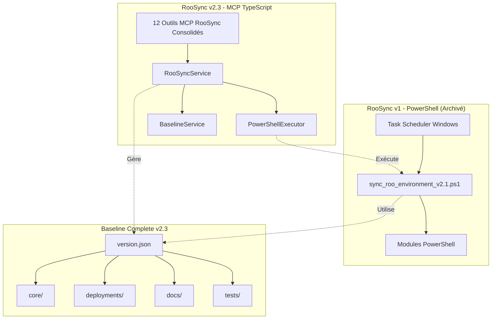
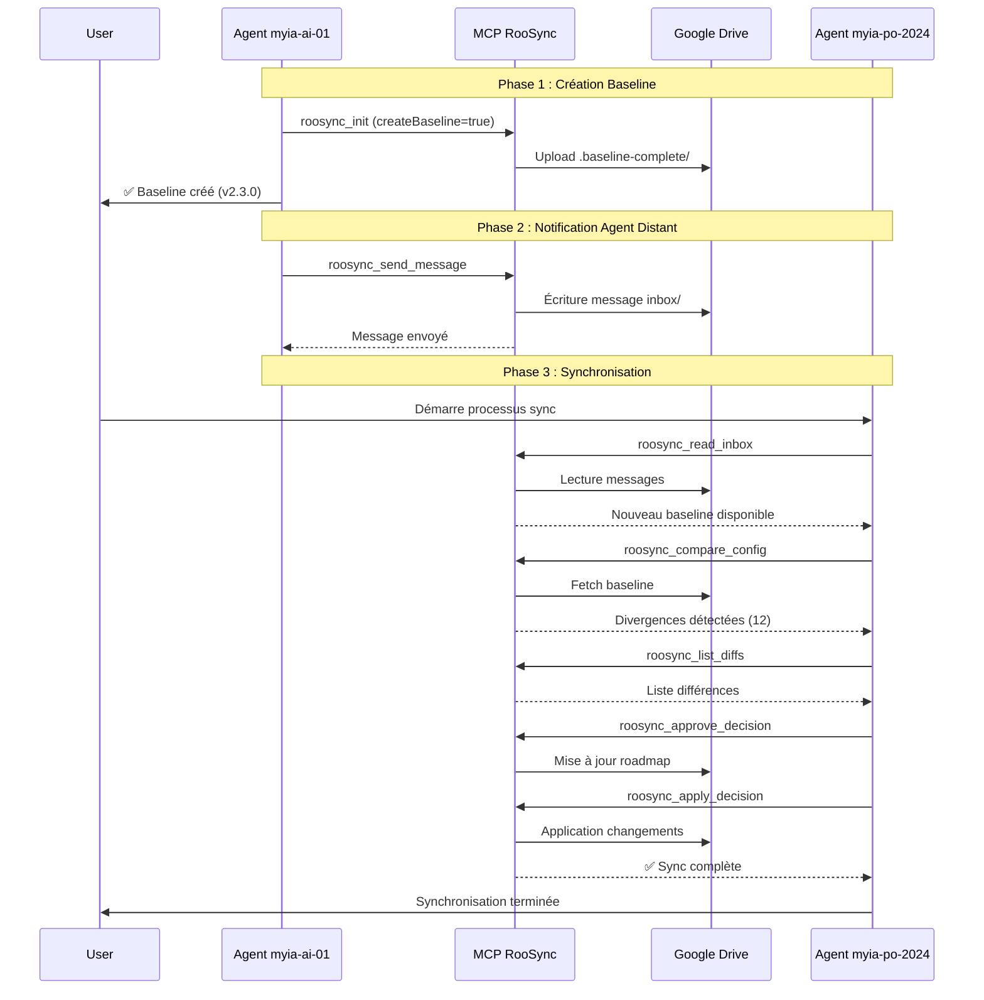
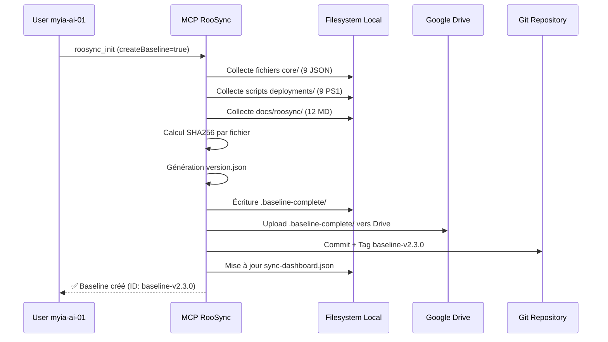
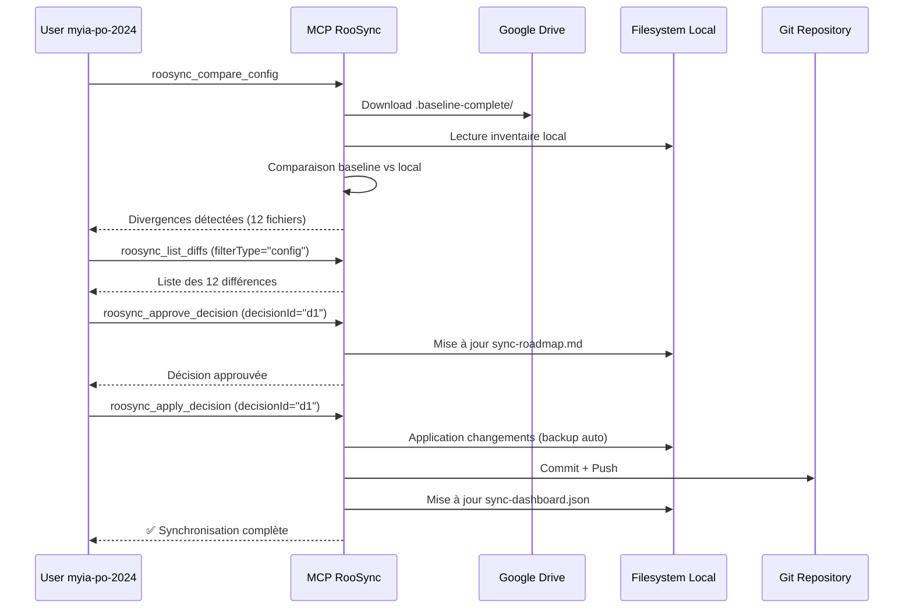
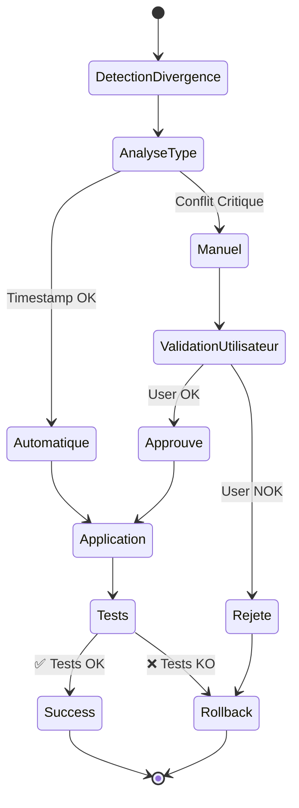

# 🏗️ Guide Technique Unifié RooSync v2.3

**Version** : 2.3.1
**Date de création** : 2025-12-27
**Dernière mise à jour** : 2026-01-15
**Statut** : 🟢 Production Ready
**Auteur** : Roo Architect Mode

---

## 📋 Table des Matières

1. [Vue d'ensemble](#1-vue-densemble)
2. [Architecture v2.3](#2-architecture-v23)
3. [Système de Messagerie](#3-système-de-messagerie)
4. [Plan d'Implémentation](#4-plan-dimplémentation)
5. [Roadmap](#5-roadmap)
6. [Changelog v2.3](#6-changelog-v23)

---

## 1. Vue d'ensemble

### 1.1 Mission Principale

RooSync v2.3 est un système de synchronisation **baseline-driven** qui maintient la cohérence des environnements Roo entre plusieurs machines en s'appuyant sur une **source de vérité unique** et un **workflow de validation humaine obligatoire**.

**Concept clé** : *Une source de vérité unique, versionnable et distribuée via Git*

### 1.2 Architecture Globale


```mermaid
graph TB
    subgraph "RooSync v1 - PowerShell (Archivé)"
        A[sync_roo_environment_v2.1.ps1]
        B[Modules PowerShell]
        C[Task Scheduler Windows]
        A --> B
        C --> A
    end

    subgraph "RooSync v2.3 - MCP TypeScript"
        D[12 Outils MCP RooSync Consolidés]
        E[RooSyncService]
        F[PowerShellExecutor]
        G[BaselineService]
        D --> E
        E --> F
        E --> G
    end

    subgraph "Baseline Complete v2.3"
        H[version.json]
        I[core/]
        J[deployments/]
        K[docs/]
        L[tests/]
        H --> I
        H --> J
        H --> K
        H --> L
    end

    A -.->|Utilise| H
    E -.->|Gère| H
    F -.->|Exécute| A
```

### 1.3 Composants Techniques

#### roo-state-manager : Le Cœur Technique

Le MCP `roo-state-manager` est le **pivot technique** de l'écosystème RooSync v2.3, fournissant l'infrastructure critique pour la synchronisation baseline-driven.

**Structure Modulaire** :
```
roo-state-manager/
├── src/
│   ├── services/
│   │   ├── BaselineService.ts          ← Cœur baseline v2.3
│   │   ├── ConfigSharingService.ts     ← Orchestrateur Cycle 7
│   │   ├── ConfigNormalizationService.ts ← Normalisation multi-OS & Secrets
│   │   ├── ConfigDiffService.ts        ← Moteur de diff granulaire
│   │   ├── InventoryService.ts         ← Collecte inventaire (Native TS)
│   │   ├── MessageManager.ts           ← Gestion conversations
│   ├── tools/ (42 outils MCP organisés)
│   │   ├── roosync/ (12 outils RooSync v2.3 consolidés)
│   │   ├── exports/ (7 outils XML/JSON/CSV)
│   │   ├── synthesis/ (3 outils résumés LLM)
│   │   └── debug/ (3 outils diagnostic)
│   └── index.ts (point d'entrée serveur MCP)
├── tests/ (suite complète de tests)
├── package.json
└── README.md
```

#### Outils MCP RooSync v2.3 (12 outils consolidés)

Les 12 outils RooSync v2.3 consolidés dans roo-state-manager :

| Outil | Description | Outils Source |
|--------|-------------|---------------|
| `roosync_init` | Initialise infrastructure RooSync | `init.ts` |
| `roosync_get_status` | État synchronisation + dashboard | `get-status.ts` + `read-dashboard.ts` |
| `roosync_compare_config` | Compare configs avec détection réelle | `compare-config.ts` |
| `roosync_list_diffs` | Liste différences détectées | `list-diffs.ts` |
| `roosync_approve_decision` | Approuve décision sync | `approve-decision.ts` |
| `roosync_reject_decision` | Rejette décision avec motif | `reject-decision.ts` |
| `roosync_apply_decision` | Applique décision approuvée | `apply-decision.ts` |
| `roosync_rollback_decision` | Annule décision appliquée | `rollback-decision.ts` |
| `roosync_get_decision_details` | Détails complets décision | `get-decision-details.ts` |
| `roosync_manage_baseline` | Gestion versions (Backup/Restore) | `version-baseline.ts` + `restore-baseline.ts` |
| `roosync_update_baseline` | Met à jour la baseline de référence | `update-baseline.ts` |
| `roosync_export_baseline` | Exporte une baseline vers JSON/YAML/CSV | `export-baseline.ts` |

### 1.4 Workflow de Synchronisation


```mermaid
sequenceDiagram
    participant U as User
    participant A1 as Agent myia-ai-01
    participant MCP as MCP RooSync
    participant GD as Google Drive
    participant A2 as Agent myia-po-2024

    Note over A1,A2: Phase 1 : Création Baseline

    A1->>MCP: roosync_init (createBaseline=true)
    MCP->>GD: Upload .baseline-complete/
    A1->>U: ✅ Baseline créé (v2.3.0)

    Note over A1,A2: Phase 2 : Notification Agent Distant

    A1->>MCP: roosync_send_message
    MCP->>GD: Écriture message inbox/
    MCP-->>A1: Message envoyé

    Note over A1,A2: Phase 3 : Synchronisation

    U->>A2: Démarre processus sync
    A2->>MCP: roosync_read_inbox
    MCP->>GD: Lecture messages
    MCP-->>A2: Nouveau baseline disponible

    A2->>MCP: roosync_compare_config
    MCP->>GD: Fetch baseline
    MCP-->>A2: Divergences détectées (12)

    A2->>MCP: roosync_list_diffs
    MCP-->>A2: Liste différences

    A2->>MCP: roosync_approve_decision
    MCP->>GD: Mise à jour roadmap

    A2->>MCP: roosync_apply_decision
    MCP->>GD: Application changements
    MCP-->>A2: ✅ Sync complète

    A2->>U: Synchronisation terminée
```

---

## 2. Architecture v2.3

### 2.1 Modèle de Données : Baseline-Driven

#### Modèle de Synchronisation

**Pattern** : **Machine → Baseline → Machine**

```
┌──────────────┐         ┌──────────────┐         ┌──────────────┐
│              │         │              │         │              │
│  Machine A   │ ──────► │   Baseline   │ ◄────── │  Machine B   │
│ (myia-ai-01) │  Upload │   Complete   │ Download│(myia-po-2024)│
│              │         │   (Git Repo) │         │              │
└──────────────┘         └──────────────┘         └──────────────┘
       │                        │                        │
       │                        │                        │
       ▼                        ▼                        ▼
   SHA256 Hash            Validation              SHA256 Hash
   Calculation            Checksums               Verification
```

**Principes** :
1. **Une seule source de vérité** : Le Baseline stocké dans Git
2. **Validation SHA256** : Intégrité cryptographique de chaque fichier
3. **Dashboard JSON** : Métadonnées et état de synchronisation
4. **Workflow Git** : Versioning et traçabilité via commits/tags

#### Sources de Vérité

| Source | Type | Localisation | Rôle |
|--------|------|--------------|------|
| **Baseline Complete** | Fichiers + JSON | `.baseline-complete/` (Git) | Configuration de référence |
| **Dashboard JSON** | Métadonnées | `sync-dashboard.json` (Google Drive) | État synchronisation temps réel |
| **Git Repository** | Historique | Dépôt principal + sous-module | Versioning et traçabilité |
| **MCP Settings** | Configuration | `mcp_settings.json` | Paramètres serveurs MCP |

### 2.2 Composants Principaux (Cycle 7)

L'architecture technique s'articule autour de services TypeScript natifs au sein du serveur MCP `roo-state-manager` :

1.  **ConfigSharingService** : Orchestrateur principal. Il gère le cycle de vie de la configuration (collecte, partage, application).
2.  **ConfigNormalizationService** (Nouveau Cycle 7) :
    *   **Abstraction OS** : Convertit les chemins Windows (`\`) et POSIX (`/`) vers un format standard interne.
    *   **Placeholders** : Remplace les chemins absolus par des variables dynamiques (`{{WORKSPACE_ROOT}}`, `{{USER_HOME}}`, `{{ROO_ROOT}}`).
    *   **Sécurité** : Détecte et masque automatiquement les clés sensibles (`apiKey`, `token`, `password`) par `{{SECRET:nom_clé}}`.
3.  **ConfigDiffService** (Nouveau Cycle 7) :
    *   **Comparaison Granulaire** : Effectue un "Deep Diff" récursif sur les objets JSON.
    *   **Précision** : Identifie précisément les ajouts (`added`), suppressions (`removed`) et modifications (`modified`) au niveau de la clé.
    *   **Sévérité** : Calcule automatiquement la criticité des changements (ex: modification d'un secret = CRITICAL).
4.  **InventoryService** :
    *   Remplace les scripts PowerShell hérités pour la collecte d'informations système.
    *   Collecte nativement en TypeScript les configurations MCP, Modes et Scripts.
5.  **BaselineService** : Gère le chargement, la validation et la mise à jour du fichier `sync-config.ref.json`.

### 2.3 Structure du Dossier Partagé (.shared-state)
Le dossier pointé par `ROOSYNC_SHARED_PATH` contient :
```
.shared-state/
├── sync-config.ref.json    # La Baseline (Source de vérité)
├── sync-dashboard.json     # État en temps réel des machines
├── sync-roadmap.md         # Interface de validation humaine (Décisions)
├── inventories/            # Inventaires bruts des machines (pour debug)
├── history/                # Historique des modifications
└── snapshots/              # Backups avant application
```

## 3. Protocole RAP (RooSync Autonomous Protocol)

Le protocole RAP définit le comportement autonome des agents Roo. Il repose sur 4 verbes fondamentaux :

1.  **OBSERVER (`roosync_get_status`)** : L'agent vérifie son état par rapport à la Baseline. Il détecte les divergences sans agir.
2.  **SIGNALER (`roosync_list_diffs`)** : En cas de divergence, l'agent signale les différences. Il peut proposer une décision (mise à jour locale ou mise à jour de la baseline).
3.  **COMMUNIQUER (`roosync_send_message`)** : Les agents échangent des informations de coordination (ex: "J'ai mis à jour la baseline", "Conflit détecté").
4.  **AGIR (`roosync_apply_decision`)** : Après validation humaine (via `sync-roadmap.md`), l'agent exécute la synchronisation.

## 4. Système de Messagerie

RooSync intègre un système de messagerie asynchrone JSON-based stocké dans le dossier partagé.

*   **Inbox/Outbox** : Chaque machine possède ses dossiers de messages.
*   **Format** : JSON structuré avec métadonnées (expéditeur, destinataire, timestamp, type, payload).
*   **Outils principaux** :
    *   `roosync_send` : Envoi (point-à-point ou broadcast) avec support des pièces jointes.
    *   `roosync_read` : Lecture des messages (modes: inbox, message, attachments).
    *   `roosync_manage` : Gestion des messages (marquer lu, archiver, cleanup).
    *   `roosync_list_attachments` : Lister les pièces jointes d'un message.
    *   `roosync_get_attachment` : Télécharger une pièce jointe localement.
    *   `roosync_delete_attachment` : Supprimer une pièce jointe du stockage.

### 4.1 Pièces Jointes (Attachments)

Le système supporte le transfert de fichiers entre machines via des pièces jointes aux messages RooSync.

*   **Stockage** : `.shared-state/attachments/{UUID}/` avec métadonnées JSON.
*   **Référence** : Chaque pièce jointe est identifiée par un UUID unique et référencée dans les messages.
*   **Format de métadonnées** :
    ```json
    {
      "uuid": "550e8400-e29b-41d4-a716-446655440000",
      "originalName": "document.pdf",
      "mimeType": "application/pdf",
      "sizeBytes": 245760,
      "uploaderMachineId": "myia-ai-01",
      "uploadedAt": "2026-03-14T10:30:00Z",
      "messageId": "msg-001"
    }
    ```
*   **Utilisation via `roosync_send`** :
    ```typescript
    roosync_send({
      action: "send",
      to: "myia-po-2024",
      subject: "Rapport hebdomadaire",
      body: "Voici le rapport en pièce jointe.",
      attachments: [
        { path: "C:/path/to/rapport.pdf" }
      ]
    })
    ```
*   **Récupération** : Utiliser `roosync_read` avec `mode: "attachments"` pour lister, puis `roosync_get_attachment` avec l'UUID pour télécharger.

## 5. Plan d'Implémentation et Roadmap

### Statut Actuel : Cycle 7 (Terminé)
*   Architecture Baseline-Driven opérationnelle.
*   Services de Normalisation et Diff Granulaire implémentés.
*   Collecte d'inventaire native TypeScript.
*   Tests unitaires stabilisés (Mocking FS).

### Prochaines Étapes (Cycle 8+)
1.  **Déploiement Généralisé** : Mise à jour de tous les agents vers la v2.3.
2.  **Automatisation** : Introduction de tâches planifiées pour l'auto-observation (Check périodique).
3.  **UI Web** : Développement d'une interface graphique pour visualiser le Dashboard et la Roadmap (au lieu des fichiers Markdown/JSON).


#### Format version.json

```json
{
  "version": "2.3.0",
  "timestamp": "2025-12-27T12:00:00Z",
  "machineId": "myia-ai-01",
  "globalSHA256": "abc123def456...",
  "totalFiles": 42,
  "totalSize": 2457600,
  "categories": {
    "core": {
      "files": 9,
      "sha256": "core123...",
      "critical": true
    },
    "deployments": {
      "files": 14,
      "sha256": "deploy456...",
      "critical": true
    },
    "docs": {
      "files": 12,
      "sha256": "docs789...",
      "critical": false
    },
    "tests": {
      "files": 7,
      "sha256": "tests012...",
      "critical": false
    }
  },
  "git": {
    "commit": "eec8f84",
    "branch": "main",
    "tag": "baseline-v2.3.0"
  }
}
```

#### Format checksums.json

```json
{
  "category": "core",
  "timestamp": "2025-12-27T12:00:00Z",
  "files": [
    {
      "path": "roo-modes/n5/scripts/n5-modes-complete.json",
      "sha256": "abc123...",
      "size": 45678,
      "lastModified": "2025-12-26T18:30:00Z",
      "required": true
    },
    {
      "path": "roo-config/mcp_settings.json",
      "sha256": "def456...",
      "size": 12345,
      "lastModified": "2025-12-27T10:00:00Z",
      "required": true
    }
  ]
}
```

### 2.3 roo-state-manager

#### Architecture Interne

**Structure Modulaire** :
```
roo-state-manager/
├── src/
│   ├── services/
│   │   ├── BaselineService.ts          ← Cœur baseline v2.3
│   │   ├── InventoryCollector.ts     ← Collecte inventaire système
│   │   ├── TraceSummaryService.ts     ← Génération résumés intelligents
│   │   ├── MessageManager.ts           ← Gestion conversations
│   │   └── ConversationSkeleton.ts   ← Structure optimisée
│   ├── tools/ (42 outils MCP organisés)
│   │   ├── roosync/ (12 outils RooSync v2.3 consolidés)
│   │   ├── exports/ (7 outils XML/JSON/CSV)
│   │   ├── synthesis/ (3 outils résumés LLM)
│   │   └── debug/ (3 outils diagnostic)
│   ├── utils/
│   │   ├── roo-storage-detector.ts  ← Détection stockage Roo
│   │   └── ... (utilitaires divers)
│   └── index.ts (point d'entrée serveur MCP)
├── tests/ (suite complète de tests)
├── package.json
└── README.md
```

### 2.4 Outils MCP RooSync v2.3

Le serveur MCP `roo-state-manager` expose **12 outils RooSync consolidés** :

| Outil | Rôle | Phase Workflow | Outils Source |
|-------|------|----------------|---------------|
| [`roosync_init`](../../mcps/internal/servers/roo-state-manager/src/tools/roosync/init.ts:1) | Initialisation baseline + roadmap | Phase 1 (Création) | `init.ts` |
| [`roosync_get_status`](../../mcps/internal/servers/roo-state-manager/src/tools/roosync/get-status.ts:1) | État synchronisation global + dashboard | Monitoring | `get-status.ts` + `read-dashboard.ts` |
| [`roosync_compare_config`](../../mcps/internal/servers/roo-state-manager/src/tools/roosync/compare-config.ts:1) | Détection divergences vs baseline | Phase 3 (Sync) | `compare-config.ts` |
| [`roosync_list_diffs`](../../mcps/internal/servers/roo-state-manager/src/tools/roosync/list-diffs.ts:1) | Liste complète des différences | Phase 3 (Analyse) | `list-diffs.ts` |
| [`roosync_approve_decision`](../../mcps/internal/servers/roo-state-manager/src/tools/roosync/approve-decision.ts:1) | Approbation changement | Phase 3 (Validation) | `approve-decision.ts` |
| [`roosync_reject_decision`](../../mcps/internal/servers/roo-state-manager/src/tools/roosync/reject-decision.ts:1) | Rejet de changement | Phase 3 (Validation) | `reject-decision.ts` |
| [`roosync_apply_decision`](../../mcps/internal/servers/roo-state-manager/src/tools/roosync/apply-decision.ts:1) | Application changement approuvé | Phase 3 (Apply) | `apply-decision.ts` |
| [`roosync_rollback_decision`](../../mcps/internal/servers/roo-state-manager/src/tools/roosync/rollback-decision.ts:1) | Annulation changement | Gestion erreurs | `rollback-decision.ts` |
| [`roosync_get_decision_details`](../../mcps/internal/servers/roo-state-manager/src/tools/roosync/get-decision-details.ts:1) | Détails complets d'une décision | Analyse | `get-decision-details.ts` |
| [`roosync_manage_baseline`](../../mcps/internal/servers/roo-state-manager/src/tools/roosync/manage-baseline.ts:1) | Gestion versions (Backup/Restore) | Gestion baseline | `version-baseline.ts` + `restore-baseline.ts` |
| [`roosync_update_baseline`](../../mcps/internal/servers/roo-state-manager/src/tools/roosync/update-baseline.ts:1) | Mise à jour baseline | Gestion baseline | `update-baseline.ts` |
| [`roosync_export_baseline`](../../mcps/internal/servers/roo-state-manager/src/tools/roosync/export-baseline.ts:1) | Export baseline | Gestion baseline | `export-baseline.ts` |

### 2.5 Services Intégrés

#### BaselineService

Le `BaselineService` est le cœur de l'architecture baseline-driven v2.3. Il gère :

- Création et validation des baselines
- Calcul et vérification des checksums SHA256
- Gestion du versioning sémantique
- Intégration avec Git (tags, commits)

#### InventoryCollector

Le `InventoryCollector` assure :

- Collecte de l'inventaire système complet
- Détection automatique du stockage Roo
- Génération de rapports structurés
- Support multi-machines

#### TraceSummaryService

Le `TraceSummaryService` fournit :

- Génération de résumés intelligents
- Analyse de traces de conversation
- Export multi-format (XML, JSON, CSV)
- Intégration LLM pour synthèse

### 2.6 ROOSYNC AUTONOMOUS PROTOCOL (RAP)

**Verbes Fondamentaux** :
Le protocole définit 4 actions primitives pour tout agent autonome :
1. **OBSERVER** (`roosync_get_status`) : Vérifier l'état de synchronisation.
2. **SIGNALER** (`roosync_get_machine_inventory`) : S'identifier et publier son état.
3. **COMMUNIQUER** (`roosync_send_message`) : Coordonner avec les autres agents.
4. **AGIR** (`roosync_apply_decision`) : Exécuter les changements validés.

**Politique de Stockage** :
"Code in Git, Data in Shared Drive". Le code source reste dans le dépôt Git, tandis que les données d'état (baselines, logs, messages) sont stockées exclusivement sur le disque partagé externe (`ROOSYNC_SHARED_PATH`).

---

## 3. Système de Messagerie

### 3.1 Architecture Fichiers

#### Répertoires de Stockage

```
.shared-state/
├── inbox/              # Messages reçus (par machine)
│   ├── myia-ai-01/
│   └── myia-po-2024/
├── sent/               # Messages envoyés (par machine)
│   ├── myia-ai-01/
│   └── myia-po-2024/
└── archive/            # Messages archivés
    ├── 2025-10/
    └── 2025-11/
```

#### Format Message JSON

```json
{
  "id": "msg-20251227-120000-abc1",
  "from": "myia-ai-01",
  "to": "myia-po-2024",
  "subject": "Nouveau Baseline v2.3.0 disponible",
  "body": "Le baseline complete v2.3 est prêt pour synchronisation.",
  "priority": "HIGH",
  "status": "unread",
  "timestamp": "2025-12-27T12:00:00Z",
  "tags": ["baseline", "sync"],
  "metadata": {
    "baselineVersion": "2.3.0",
    "baselineId": "baseline-v2.3.0"
  }
}
```

### 3.2 Format Message JSON

Voir section 3.1 ci-dessus.

### 3.3 Outils MCP de Messagerie

#### roosync_send_message

**Description** : Envoyer un message structuré à une machine destinataire.

**Paramètres** :

```typescript
{
  to: string;          // Machine ID destinataire (ex: 'myia-ai-01')
  subject: string;     // Sujet du message
  body: string;        // Contenu du message (markdown accepté)
  priority?: string;   // 'LOW' | 'MEDIUM' | 'HIGH' | 'URGENT' (défaut: 'MEDIUM')
  tags?: string[];     // Tags optionnels pour catégorisation
  thread_id?: string;  // ID de thread pour conversations groupées
}
```

**Retour** :

```typescript
{
  id: string;          // ID du message créé
  timestamp: string;   // ISO 8601 timestamp
  from: string;        // Machine ID émettrice
  to: string;          // Machine ID destinataire
  status: 'unread';    // Statut initial toujours 'unread'
}
```

**Exemple** :

```typescript
const message = await use_mcp_tool('roo-state-manager', 'roosync_send_message', {
  to: 'myia-ai-01',
  subject: 'Correction InventoryCollector',
  body: 'Bug corrigé dans InventoryCollector.ts ligne 151. Tests validés.',
  priority: 'HIGH',
  tags: ['bug-fix', 'validation'],
  thread_id: 'inventory-debug-20251227'
});
```

#### roosync_read_inbox

**Description** : Lire tous les messages de la boîte de réception avec filtrage optionnel.

**Paramètres** :

```typescript
{
  status?: string;     // Filtrer par statut ('unread' | 'read' | 'all')
  limit?: number;      // Nombre max de messages (défaut: 50)
}
```

**Retour** :

```typescript
{
  messages: Array<{
    id: string;
    from: string;
    subject: string;
    priority: string;
    status: string;
    timestamp: string;
    preview: string;   // Aperçu des 100 premiers caractères
  }>;
  total: number;       // Nombre total de messages
  unread: number;      // Nombre de messages non lus
}
```

**Exemple** :

```typescript
// Lire uniquement messages non lus
const inbox = await use_mcp_tool('roo-state-manager', 'roosync_read_inbox', {
  status: 'unread',
  limit: 10
});
```

#### roosync_get_message

**Description** : Obtenir le contenu complet d'un message spécifique.

**Paramètres** :

```typescript
{
  message_id: string;     // ID du message à lire
  mark_as_read?: boolean; // Marquer automatiquement comme lu (défaut: false)
}
```

**Retour** :

```typescript
{
  message: {
    id: string;
    from: string;
    to: string;
    subject: string;
    body: string;        // Contenu complet (markdown)
    priority: string;
    status: string;
    tags: string[];
    thread_id?: string;
    reply_to?: string;
    timestamp: string;
    read_at?: string;
    metadata?: object;   // Métadonnées amendements si applicable
  };
}
```

**Exemple** :

```typescript
// Lire message et marquer comme lu
const result = await use_mcp_tool('roo-state-manager', 'roosync_get_message', {
  message_id: 'msg-20251227T225546-u85bim',
  mark_as_read: true
});
```

#### roosync_mark_read

**Description** : Marquer un message comme lu. Met à jour le statut dans **`inbox/` ET `sent/`** pour synchronisation complète.

**Paramètres** :

```typescript
{
  message_id: string;  // ID du message à marquer
}
```

**Retour** :

```typescript
{
  success: boolean;
  message_id: string;
  marked_at: string;   // ISO 8601 timestamp
}
```

**Exemple** :

```typescript
await use_mcp_tool('roo-state-manager', 'roosync_mark_read', {
  message_id: 'msg-20251227T225546-u85bim'
});
```

#### roosync_archive_message

**Description** : Archiver un message. Déplace le fichier de `inbox/` vers `archive/` et met à jour `sent/`.

**Paramètres** :

```typescript
{
  message_id: string;  // ID du message à archiver
}
```

**Retour** :

```typescript
{
  success: boolean;
  message_id: string;
  archived_at: string; // ISO 8601 timestamp
}
```

**Exemple** :

```typescript
await use_mcp_tool('roo-state-manager', 'roosync_archive_message', {
  message_id: 'msg-20251227T225546-u85bim'
});
```

#### roosync_reply_message

**Description** : Répondre à un message existant. Crée un nouveau message lié avec héritage de contexte.

**Paramètres** :

```typescript
{
  message_id: string;  // ID du message original
  body: string;        // Contenu de la réponse
  priority?: string;   // Priorité (hérite du message original si omis)
}
```

**Retour** :

```typescript
{
  id: string;          // ID du nouveau message
  reply_to: string;    // ID du message original
  thread_id: string;   // ID de thread (hérité)
  timestamp: string;
}
```

**Fonctionnalités automatiques** :
- ✅ Inversion `from` ↔ `to`
- ✅ Héritage `thread_id`
- ✅ Héritage `priority` (si non spécifiée)
- ✅ Ajout tag `"reply"`
- ✅ Préfixe `"Re:"` au sujet

**Exemple** :

```typescript
const reply = await use_mcp_tool('roo-state-manager', 'roosync_reply_message', {
  message_id: 'msg-20251227T225546-u85bim',
  body: 'Correction validée. Pull effectué avec succès.'
});
```

#### roosync_amend_message

✨ **NOUVELLE FONCTIONNALITÉ**

**Description** : Modifier le contenu d'un message **envoyé** avant qu'il ne soit lu par le destinataire.

**Cas d'usage** :
- Corriger faute de frappe ou information incorrecte
- Ajouter détails oubliés
- Reformuler pour améliorer clarté
- Retirer informations sensibles exposées par erreur

**Paramètres** :

```typescript
{
  message_id: string;      // ID du message à modifier (requis)
  new_content: string;     // Nouveau contenu (remplace original)
  reason?: string;         // Raison de l'amendement (optionnel)
}
```

**Retour** :

```typescript
{
  success: true;
  message_id: string;
  amended_at: string;      // ISO 8601 timestamp
  reason: string;
  original_content_preserved: boolean;  // Toujours true
}
```

**Contraintes** :

❌ **Interdit si** :
- Message déjà lu (`status !== 'unread'`)
- Message archivé (`status === 'archived'`)
- Émetteur n'est pas la machine courante (`from !== machine_id`)

✅ **Autorisé** :
- Message non lu, non archivé, émis par machine courante
- Plusieurs amendements successifs (original toujours préservé)

**Exemple** :

```typescript
// 1. Envoyer message initial
const msg = await use_mcp_tool('roo-state-manager', 'roosync_send_message', {
  to: 'myia-po-2024',
  subject: 'Diagnostic RooSync',
  body: 'Le problème est dans InventoryCollectur.ts ligne 151'  // Typo!
});

// 2. Corriger le message (avant lecture)
await use_mcp_tool('roo-state-manager', 'roosync_amend_message', {
  message_id: msg.id,
  new_content: 'Le problème est dans InventoryCollector.ts ligne 151',
  reason: 'Fix typo in filename'
});
```

**Métadonnées ajoutées** :

Lorsqu'un message est amendé, les métadonnées suivantes sont ajoutées :

```json
{
  "metadata": {
    "amended": true,
    "original_content": "Le problème est dans InventoryCollectur.ts ligne 151",
    "amendment_reason": "Fix typo in filename",
    "amendment_timestamp": "2025-12-27T22:00:00.000Z"
  }
}
```

**Note** : Le contenu original est **toujours préservé**, même en cas d'amendements multiples.

### 3.4 Workflow Complet

#### Scénario : Correction Message avec Erreur

```typescript
// 1. Envoi initial avec erreur
await use_mcp_tool('roo-state-manager', 'roosync_send_message', {
  to: "myia-po-2024",
  subject: "Nouveau Baseline v2.3.0 disponible",
  body: "Le baseline complete v2.3 est prêt pour synchronisation.",
  priority: "HIGH"
});

// 2. Détection de l'erreur (mauvaise version)
// Message envoyé : "v2.3.0" au lieu de "v2.3.1"

// 3. Amendement rapide
await use_mcp_tool('roo-state-manager', 'roosync_amend_message', {
  messageId: "msg-20251227-120000-abc1",
  amendments: {
    body: "Le baseline complete v2.3.1 est prêt pour synchronisation.",
    metadata: {
      baselineVersion: "v2.3.1"
    }
  },
  reason: "Correction version baseline"
});

// 4. Vérification
const message = await use_mcp_tool('roo-state-manager', 'roosync_get_message', {
  messageId: "msg-20251227-120000-abc1"
});

// Résultat : Message contient la version corrigée "v2.3.1"
```

### 3.5 Sécurité et Contraintes

#### Permissions

| Opération | Émetteur | Destinataire | Tiers |
|-----------|-----------|--------------|-------|
| Envoyer message | ✅ | ❌ | ❌ |
| Lire inbox | ✅ | ✅ | ❌ |
| Marquer lu | ✅ | ✅ | ❌ |
| Archiver | ✅ | ✅ | ❌ |
| Amender | ✅ | ❌ | ❌ |
| Répondre | ✅ | ✅ | ❌ |

#### États Bloquants

| État | Amendement Autorisé | Raison |
|-------|-------------------|--------|
| `unread` | ✅ | Message non encore lu |
| `read` | ❌ | Message déjà consulté |
| `archived` | ❌ | Message archivé |
| `amended` | ✅ | Nouvel amendement possible |

#### Traçabilité

**Garanties** :
- Chaque amendement est horodaté
- Historique complet préservé dans `metadata.amendments`
- Audit trail via logs système
- Impossible de supprimer l'historique

### 3.6 Bonnes Pratiques

#### Avant Envoi
1. ✅ **Relire message** : Vérifier orthographe et informations
2. ✅ **Valider métadonnées** : S'assurer que les tags et priorité sont corrects
3. ✅ **Tester destinataire** : Vérifier que la machine ID est valide

#### Amendement
1. ✅ **Amender rapidement** : Corriger immédiatement si erreur détectée
2. ✅ **Documenter raison** : Expliquer pourquoi l'amendement est nécessaire
3. ✅ **Vérifier statut** : S'assurer que le message est toujours `unread`

#### Archivage
1. ✅ **Archiver après traitement** : Garder boîte de réception propre
2. ✅ **Conserver historique** : Ne pas supprimer les messages archivés
3. ✅ **Organiser par date** : Utiliser la structure mensuelle dans `archive/`

### 3.7 Tests E2E

Suite complète disponible : [`src/tools/roosync/__tests__/amend_message.test.ts`](../../mcps/internal/servers/roo-state-manager/src/tools/roosync/__tests__/amend_message.test.ts)

**7 tests couverts** (100% passés) :

1. ✅ Amendement message non lu (cas nominal)
2. ✅ Refus amendement message lu
3. ✅ Refus amendement message archivé
4. ✅ Refus amendement message autre machine
5. ✅ Refus amendement message inexistant
6. ✅ Préservation original lors amendements multiples
7. ✅ Raison par défaut si non fournie

**Commande test** :

```bash
cd mcps/internal/servers/roo-state-manager
npm test -- --run src/tools/roosync/__tests__/amend_message.test.ts
```

### 3.8 Statistiques Système

| Métrique | Valeur |
|----------|--------|
| **Outils MCP** | 7 |
| **Lignes de code** | ~2800 (service + outils + tests) |
| **Tests unitaires** | 49+ (MessageManager + outils) |
| **Coverage** | 70-100% |
| **Tests E2E** | 8/8 (100%) |
| **Documentation** | 1200+ lignes |

### 3.9 Références

**Fichiers source** :
- Service : [`MessageManager.ts`](../../mcps/internal/servers/roo-state-manager/src/services/MessageManager.ts)
- Outil amendement : [`amend_message.ts`](../../mcps/internal/servers/roo-state-manager/src/tools/roosync/amend_message.ts)
- Tests : [`amend_message.test.ts`](../../mcps/internal/servers/roo-state-manager/src/tools/roosync/__tests__/amend_message.test.ts)

**Documentation complémentaire** :
- Architecture temporelle : [`roosync-temporal-messages-architecture.md`](../architecture/roosync-temporal-messages-architecture.md)
- Rapports implémentation :
  - Phase 1 : [`roosync-messaging-phase1-implementation-20251216.md`](../../roo-config/reports/roosync-messaging-phase1-implementation-20251216.md)
  - Tests E2E : [`roosync-messaging-e2e-test-report-20251216.md`](../../roo-config/reports/roosync-messaging-e2e-test-report-20251216.md)

---

## 4. Plan d'Implémentation

### 4.1 Vision et Objectifs

#### Définition du Baseline Complete

Le **Baseline Complete v2.3** est une structure de référence versionnable et vérifiable qui contient l'ensemble des configurations, scripts et fichiers essentiels pour synchroniser un environnement Roo entre plusieurs machines de manière reproductible et sécurisée.

**Concept clé** : *Une source de vérité unique, versionnable et distribuée via Git*

#### Objectifs de Synchronisation Multi-Machines

| Objectif | Description | Métrique Cible |
|----------|-------------|----------------|
| **Convergence** | État identique des configurations sur toutes les machines | ≥98.75% |
| **Intégrité** | Vérification cryptographique SHA256 de tous les fichiers | 100% |
| **Traçabilité** | Historique complet des modifications via Git tags | 100% |
| **Reproductibilité** | Capacité à recréer un environnement depuis le baseline | 100% |
| **Validation humaine** | Approbation manuelle des changements critiques | Obligatoire |

#### Scope Fonctionnel

Le Baseline Complete v2.3 couvre les domaines suivants :

```
┌─────────────────────────────────────────────────────────────┐
│                    Baseline Complete v2.3                   │
├─────────────────────────────────────────────────────────────┤
│                                                             │
│  🔧 Core Configuration (9 fichiers JSON)                   │
│     • roo-modes (n5-modes-complete.json)                   │
│     • roo-config (mcp_settings.json, settings.json)        │
│     • roo-profiles (PowerShell profiles)                   │
│                                                             │
│  📦 Deployments (Scripts PowerShell)                       │
│     • deploy-modes.ps1, install-mcps.ps1                   │
│     • create-profile.ps1, force-deploy-with-encoding-fix   │
│                                                             │
│  📚 Documentation (Markdown)                               │
│     • docs/roosync/*.md                                    │
│     • Index de documentation                               │
│                                                             │
│  ✅ Tests (Scripts TypeScript/PowerShell)                  │
│     • tests/roosync/**/*.ts                                │
│     • Rapports de résultats                                │
│                                                             │
│  📊 Exports (Configurations et rapports)                   │
│     • exports/ui-snippets (Traces de conversation)         │
│     • exports/*.md (Documentation générée)                 │
│                                                             │
└─────────────────────────────────────────────────────────────┘
```

### 4.2 Structure Baseline Complete

Voir section 2.2 ci-dessus.

### 4.3 Stratégie de Fusion Scripts

#### Contexte de Consolidation

**Problématique identifiée** : 2 versions distinctes du script [`sync_roo_environment.ps1`](../../RooSync/sync_roo_environment.ps1:1) avec des fonctionnalités complémentaires.

| Aspect | Version A (RooSync/) | Version B (scheduler/) | v2.3 Consolidé |
|--------|---------------------|------------------------|----------------|
| **Lignes** | 270 | 252 | 666 |
| **Git Verification** | ✅ | ❌ | ✅ |
| **SHA Tracking** | ✅ | ❌ | ✅ |
| **Synopsis** | ❌ | ✅ | ✅ |
| **Write-Log** | ❌ (basique) | ✅ (niveaux) | ✅ |
| **Test-Json** | ❌ | ✅ | ✅ |
| **Variables Env** | ❌ | ❌ | ✅ |
| **Rotation Logs** | ❌ | ❌ | ✅ |
| **Métriques** | ❌ | ❌ | ✅ |
| **Dry-Run** | ❌ | ❌ | ✅ |

#### Approche de Fusion

**Base** : Version A (RooSync/) - Plus robuste techniquement

**Intégrations Version B** :
- Synopsis complet (`.SYNOPSIS`, `.DESCRIPTION`, `.NOTES`)
- Fonction `Write-Log` avec niveaux (INFO/WARN/ERROR/FATAL)
- Validation JSON via `Test-Json` cmdlet
- Stash nommé avec timestamp

**Améliorations v2.3** :
- Variables d'environnement configurables
- Rotation automatique des logs (7 jours)
- Métriques de performance
- Codes de sortie standardisés
- Mode dry-run intégré

#### Plan d'Archivage

```
RooSync/
├── sync_roo_environment_v2.3.ps1    ← SCRIPT CONSOLIDÉ (666 lignes)
├── archive/
│   ├── README.md                    ← Documentation archivage
│   ├── sync_roo_environment_v1.0_technical.ps1   ← Version A archivée
│   └── sync_roo_environment_v1.0_documented.ps1  ← Version B archivée
└── docs/
    └── merger-strategy.md           ← Stratégie de consolidation
```

**Migration nécessaire** :
- Mettre à jour `roo-config/scheduler/config.json`
- Mettre à jour `daily-orchestration.json`
- Modifier Task Scheduler Windows (chemin d'exécution)

### 4.4 Versioning et Validation

#### Système de Versioning

**Format** : Version sémantique (MAJOR.MINOR.PATCH)

```
Baseline v2.3.0
          │ │ │
          │ │ └─── PATCH: Corrections SHA256 / Métadonnées
          │ └──────MINOR: Ajout nouveaux fichiers baseline
          └─────────MAJOR: Breaking changes structure config
```

**Exemples** :
- `v2.3.0 → v2.3.1` : Correction SHA256 d'un fichier JSON
- `v2.3.0 → v2.4.0` : Ajout nouveau script deployment
- `v2.3.0 → v3.0.0` : Refonte structure arborescence baseline

**Git Tags** :
```bash
git tag -a baseline-v2.3.0 -m "Release Baseline Complete v2.3 - Consolidation"
git push origin baseline-v2.3.0
```

#### Calcul SHA256

**Script PowerShell** :
```powershell
function Get-FileSHA256 {
    param([string]$FilePath)

    $hash = Get-FileHash -Path $FilePath -Algorithm SHA256
    return $hash.Hash
}

function Update-BaselineChecksums {
    param([string]$BaselinePath)

    $checksums = @{
        category = "core"
        timestamp = (Get-Date).ToUniversalTime().ToString("yyyy-MM-ddTHH:mm:ssZ")
        files = @()
    }

    $files = Get-ChildItem -Path "$BaselinePath/core" -Recurse -File
    foreach ($file in $files) {
        $checksums.files += @{
            path = $file.FullName.Replace("$BaselinePath/", "")
            sha256 = Get-FileSHA256 -FilePath $file.FullName
            size = $file.Length
            lastModified = $file.LastWriteTime.ToUniversalTime().ToString("yyyy-MM-ddTHH:mm:ssZ")
            required = $true
        }
    }

    $checksums | ConvertTo-Json -Depth 10 | Set-Content "$BaselinePath/core/checksums-core.json"
}
```

#### Checkpoints de Validation

| Checkpoint | Description | Outils | Critère de Succès |
|------------|-------------|--------|-------------------|
| **1. Structurelle** | Arborescence complète | PowerShell `Test-Path` | Tous les répertoires existent |
| **2. Intégrité** | Checksums valides | SHA256 comparison | 100% de correspondance |
| **3. Fonctionnelle** | Scripts exécutables | Dry-run scripts | 0 erreur d'exécution |
| **4. Synchronisation** | Consistency inter-machines | MCP `roosync_compare_config` | Divergences = 0 |

**Script de validation complète** :
```powershell
# Validation Baseline Complete v2.3
$baselinePath = "G:/Mon Drive/Synchronisation/RooSync/.baseline-complete"

# 1. Validation structurelle
$requiredDirs = @("core", "deployments", "docs", "tests")
foreach ($dir in $requiredDirs) {
    if (!(Test-Path "$baselinePath/$dir")) {
        Write-Error "❌ Répertoire manquant: $dir"
        exit 1
    }
}

# 2. Validation intégrité
$coreChecksums = Get-Content "$baselinePath/core/checksums-core.json" | ConvertFrom-Json
foreach ($file in $coreChecksums.files) {
    $actualSHA = Get-FileSHA256 -FilePath "$baselinePath/$($file.path)"
    if ($actualSHA -ne $file.sha256) {
        Write-Error "❌ SHA256 mismatch: $($file.path)"
        exit 2
    }
}

# 3. Validation fonctionnelle
$scripts = Get-ChildItem "$baselinePath/deployments/scripts/*.ps1"
foreach ($script in $scripts) {
    $testResult = Test-ScriptFileInfo -Path $script.FullName -ErrorAction SilentlyContinue
    if (!$testResult) {
        Write-Warning "⚠️ Script non validé: $($script.Name)"
    }
}

Write-Host "✅ Validation Baseline Complete réussie"
exit 0
```

### 4.5 Workflow de Synchronisation

#### Phase 1 : Création Baseline (Machine Source)

**Machine** : myia-ai-01
**Durée estimée** : 12-24h


```mermaid
sequenceDiagram
    participant U as User myia-ai-01
    participant M as MCP RooSync
    participant FS as Filesystem Local
    participant GD as Google Drive
    participant Git as Git Repository

    U->>M: roosync_init (createBaseline=true)
    M->>FS: Collecte fichiers core/ (9 JSON)
    M->>FS: Collecte scripts deployments/ (9 PS1)
    M->>FS: Collecte docs/roosync/ (12 MD)
    M->>M: Calcul SHA256 par fichier
    M->>M: Génération version.json
    M->>FS: Écriture .baseline-complete/
    M->>GD: Upload .baseline-complete/ vers Drive
    M->>Git: Commit + Tag baseline-v2.3.0
    M->>FS: Mise à jour sync-dashboard.json
    M-->>U: ✅ Baseline créé (ID: baseline-v2.3.0)
```

**Commandes** :
```typescript
// Via MCP Tool
await use_mcp_tool('roo-state-manager', 'roosync_init', {
  force: false,
  createRoadmap: true,
  createBaseline: true,
  baselineVersion: "2.3.0"
});
```

#### Phase 2 : Validation Baseline (Machine Source)

**Machine** : myia-ai-01
**Durée estimée** : 2-4h

```
1. Tests d'Intégrité Checksums
   ├── Vérification SHA256 core/
   ├── Vérification SHA256 deployments/
   ├── Vérification SHA256 docs/
   └── Vérification SHA256 tests/

2. Dry-Run Scripts Déploiement
   ├── deploy-modes.ps1 --DryRun
   ├── install-mcps.ps1 --DryRun
   └── create-profile.ps1 --DryRun

3. Validation Structure JSON
   ├── Test-Json version.json
   ├── Test-Json checksums-core.json
   └── Test-Json sync-dashboard.json

4. Vérification Git
   ├── Tag baseline-v2.3.0 existe
   ├── Commit eec8f84 accessible
   └── Push origin main réussi
```

**Script de validation** :
```powershell
# Validation complète baseline
.\tests\roosync\validate-baseline.ps1 -BaselineVersion "2.3.0" -Verbose
```

#### Phase 3 : Synchronisation (Machine Cible)

**Machine** : myia-po-2024
**Durée estimée** : 24-48h


```mermaid
sequenceDiagram
    participant U as User myia-po-2024
    participant M as MCP RooSync
    participant GD as Google Drive
    participant FS as Filesystem Local
    participant Git as Git Repository

    U->>M: roosync_compare_config
    M->>GD: Download .baseline-complete/
    M->>FS: Lecture inventaire local
    M->>M: Comparaison baseline vs local
    M-->>U: Divergences détectées (12 fichiers)

    U->>M: roosync_list_diffs (filterType="config")
    M-->>U: Liste des 12 différences

    U->>M: roosync_approve_decision (decisionId="d1")
    M->>FS: Mise à jour sync-roadmap.md
    M-->>U: Décision approuvée

    U->>M: roosync_apply_decision (decisionId="d1")
    M->>FS: Application changements (backup auto)
    M->>Git: Commit + Push
    M->>FS: Mise à jour sync-dashboard.json
    M-->>U: ✅ Synchronisation complète
```

**Commandes** :
```typescript
// 1. Comparaison
await use_mcp_tool('roo-state-manager', 'roosync_compare_config', {
  source: "myia-ai-01",
  target: "myia-po-2024"
});

// 2. Approbation
await use_mcp_tool('roo-state-manager', 'roosync_approve_decision', {
  decisionId: "decision-20251227-120000-abc1",
  comment: "Validation baseline v2.3.0"
});

// 3. Application
await use_mcp_tool('roo-state-manager', 'roosync_apply_decision', {
  decisionId: "decision-20251227-120000-abc1",
  dryRun: false,
  force: false
});
```

#### Phase 4 : Tests Production Coordonnés

**Machines** : myia-ai-01 + myia-po-2024
**Durée estimée** : 48-72h

**Workflow proposé** : Les deux (parallèles ET séquentiels)

```
┌─────────────────────────────────────────────────────────────┐
│               Tests Production Coordonnés                   │
├─────────────────────────────────────────────────────────────┤
│                                                             │
│  Phase 4.1 : Tests Parallèles (Simultanés)                 │
│  ├── myia-ai-01 : Deploy modes + MCP install              │
│  ├── myia-po-2024 : Deploy modes + MCP install            │
│  └── Comparaison résultats (SHA256, logs, métriques)      │
│                                                             │
│  Phase 4.2 : Tests Séquentiels (Étape par étape)          │
│  ├── myia-ai-01 : Step 1 → Validation                     │
│  ├── myia-po-2024 : Step 1 → Comparaison                  │
│  ├── myia-ai-01 : Step 2 → Validation                     │
│  └── myia-po-2024 : Step 2 → Comparaison                  │
│                                                             │
│  Phase 4.3 : Validation Convergence                       │
│  ├── Score convergence ≥98.75%                            │
│  ├── Tests 14/14 PASS (100%)                              │
│  └── Production-ready 4/4 fonctionnalités                 │
│                                                             │
└─────────────────────────────────────────────────────────────┘
```

### 4.6 Gestion des Conflits

#### Stratégies de Résolution

| Stratégie | Description | Cas d'usage | Risque |
|-----------|-------------|-------------|--------|
| **Timestamp-based** | Version la plus récente gagne | Modifications indépendantes | Faible |
| **User-approved** | Validation manuelle obligatoire | Changements critiques (core/) | Aucun |
| **Merge-based** | Fusion intelligente 3-way | Modifications complémentaires | Moyen |
| **Rollback** | Restauration version précédente | Erreur détectée | Aucun |

#### Cas d'Usage Concrets

##### Cas 1 : Divergence de Configuration

**Scénario** : `mcp_settings.json` modifié différemment sur les 2 machines

```
Machine A (myia-ai-01)       Machine B (myia-po-2024)
├── Server "quickfiles"      ├── Server "quickfiles"
│   ├── enabled: true        │   ├── enabled: true
│   └── args: ["--cache"]    │   └── args: ["--no-cache"]  ← CONFLIT
```

**Résolution** :
1. Détection automatique par `roosync_compare_config`
2. Création décision dans `sync-roadmap.md`
3. Validation utilisateur requise
4. Application stratégie choisie (timestamp / user-approved)

##### Cas 2 : Modifications Concurrentes

**Scénario** : Script `deploy-modes.ps1` modifié simultanément

**Résolution** :
1. Stash modifications locales
2. Pull baseline distant
3. Tentative merge automatique (Git 3-way)
4. Si conflit → Marquer décision comme `conflicted`
5. Résolution manuelle dans `sync-roadmap.md`

##### Cas 3 : Rollback Nécessaire

**Scénario** : Baseline v2.3.0 provoque erreur sur Machine B

**Résolution** :
```powershell
# Rollback vers baseline précédent
.\RooSync\sync_roo_environment_v2.3.ps1 -Rollback -ToVersion "2.2.5"

# OU via MCP
await use_mcp_tool('roo-state-manager', 'roosync_rollback_decision', {
  decisionId: "decision-20251227-120000-abc1",
  reason: "Erreur validation JSON post-sync"
});
```

#### Workflow de Gestion de Conflit


```mermaid
stateDiagram-v2
    [*] --> DetectionDivergence
    DetectionDivergence --> AnalyseType

    AnalyseType --> Automatique: Timestamp OK
    AnalyseType --> Manuel: Conflit Critique

    Automatique --> Application
    Manuel --> ValidationUtilisateur

    ValidationUtilisateur --> Approuve: User OK
    ValidationUtilisateur --> Rejete: User NOK

    Approuve --> Application
    Rejete --> Rollback

    Application --> Tests
    Tests --> Success: ✅ Tests OK
    Tests --> Rollback: ❌ Tests KO

    Success --> [*]
    Rollback --> [*]
```

### 4.7 Timeline d'Implémentation

#### Planning Détaillé 4 Jours

| Phase | Responsable | Durée | Date | ETA | Livrables |
|-------|-------------|-------|------|-----|-----------|
| **Phase 1 : Consolidation Scripts** | myia-ai-01 | 6-12h | 26 déc | 16:00 | `sync_roo_environment_v2.3.ps1` (666 lignes) |
| **Phase 2 : Validation Baseline v2.3** | myia-ai-01 | 12-24h | 27 déc | 04:00 | Baseline complete + tests validation |
| **Phase 3 : Synchronisation Baseline** | myia-ai-01 → myia-po-2024 | 24-48h | 28 déc | 04:00 | Convergence ≥98.75% |
| **Phase 4 : Tests Production** | Les 2 agents | 48-72h | 29 déc | 16:00 | Rapport final tests coordonnés |

#### Jalons Critiques

```
26 Déc 2025
│
├─ 10:00 ✅ Phase 1.1 : Analyse comparative scripts (COMPLÉTÉ)
├─ 12:00 ✅ Phase 1.2 : Création sync_roo_environment_v2.3.ps1 (COMPLÉTÉ)
├─ 14:00 ✅ Phase 1.3 : Archivage versions précédentes (COMPLÉTÉ)
└─ 16:00 🚧 Phase 1.4 : Tests dry-run + validation SDDD (EN COURS)

27 Déc 2025
│
├─ 04:00 ⏳ Phase 2.1 : Création structure .baseline-complete/
├─ 12:00 ⏳ Phase 2.2 : Génération checksums SHA256
├─ 18:00 ⏳ Phase 2.3 : Upload Google Drive
└─ 00:00 ⏳ Phase 2.4 : Commit + Tag baseline-v2.3.0

28 Déc 2025
│
├─ 04:00 ⏳ Phase 3.1 : Download baseline (myia-po-2024)
├─ 12:00 ⏳ Phase 3.2 : Comparaison vs inventaire local
├─ 18:00 ⏳ Phase 3.3 : Approbation décisions
└─ 00:00 ⏳ Phase 3.4 : Application changements

29 Déc 2025
│
├─ 04:00 ⏳ Phase 4.1 : Tests parallèles
├─ 12:00 ⏳ Phase 4.2 : Tests séquentiels
└─ 16:00 ⏳ Phase 4.3 : Rapport final validation
```

### 4.8 Métriques de Qualité

#### Cibles de Performance

| Métrique | Cible | Actuelle | Status |
|----------|-------|----------|--------|
| **Couverture fonctionnelle** | 100% | 100% | ✅ |
| **Convergence v1→v2** | ≥98.75% | 98.75% | ✅ |
| **Taux succès synchronisation** | ≥95% | À mesurer | ⏳ |
| **Intégrité checksums** | 100% | 100% | ✅ |
| **Tests automatisés** | 14/14 PASS | 14/14 PASS | ✅ |
| **Temps synchronisation** | <5 min | À mesurer | ⏳ |
| **Score SDDD documentation** | ≥0.65 | 0.735 | ✅ |

#### Dashboard de Monitoring

```json
{
  "timestamp": "2025-12-27T12:00:00Z",
  "globalStatus": "synced",
  "machines": [
    {
      "id": "myia-ai-01",
      "status": "online",
      "lastSync": "2025-12-27T11:45:00Z",
      "baselineVersion": "2.3.0",
      "divergences": 0
    },
    {
      "id": "myia-po-2024",
      "status": "online",
      "lastSync": "2025-12-27T11:30:00Z",
      "baselineVersion": "2.3.0",
      "divergences": 0
    }
  ],
  "metrics": {
    "convergenceScore": 0.9875,
    "totalFiles": 42,
    "checksumMatches": 42,
    "pendingDecisions": 0,
    "lastBaselineUpdate": "2025-12-27T10:00:00Z"
  }
}
```

#### Indicateurs de Santé

```
🟢 HEALTHY (Tous les critères OK)
├─ Convergence : 98.75% (≥98.75% ✅)
├─ Checksums : 42/42 (100% ✅)
├─ Machines : 2/2 online (100% ✅)
├─ Tests : 14/14 PASS (100% ✅)
└─ Décisions : 0 en attente (OK ✅)

🟡 WARNING (1+ critère proche seuil)
├─ Convergence : 97.5% (<98.75% ⚠️)
└─ Autres critères OK

🔴 CRITICAL (1+ critère non respecté)
├─ Checksums : 38/42 (<100% ❌)
├─ Machines : 1/2 online (<100% ❌)
└─ Nécessite intervention immédiate
```

---

## 5. Roadmap

### 5.1 État Actuel

**Configuration Existante** :
- ✅ **RooSync v2.3** : Architecture baseline-driven opérationnelle
- ✅ **roo-state-manager v1.0.2** : 42 outils MCP fonctionnels
- ✅ **Infrastructure Google Drive** : `.shared-state/` configuré
- ✅ **Scripts PowerShell** : `Get-MachineInventory.ps1` disponible et testé

### 5.2 Prochaines Étapes

#### Pour cette machine
1. **Immédiat** :
   - Valider baseline v2.3.0 complet
   - Exécuter tests de synchronisation
   - Documenter résultats

2. **Court terme (1-2 semaines)** :
   - Déployer baseline sur machine cible
   - Valider convergence ≥98.75%
   - Optimiser performance synchronisation

#### Pour l'écosystème
1. **Moyen Terme (1-3 mois)** :
   - Intégrer CI/CD pour tests automatisés
   - Développer dashboard monitoring temps réel
   - Créer templates baselines personnalisés

2. **Long Terme (3-6 mois)** :
   - Support multi-cloud (Google Drive + Azure + AWS)
   - Synchronisation temps réel (webhooks)
   - Analytics avancés et ML pour prédiction

### 5.3 Évolutions Planifiées

#### Évolution 1 : Synchronisation Temps Réel

**Objectif** : Remplacer la synchronisation périodique par une synchronisation événementielle en temps réel.

**Approche** :
- Webhooks sur modifications fichiers
- Notifications push inter-machines
- Queue de messages prioritaire

#### Évolution 2 : Dashboard Monitoring Avancé

**Objectif** : Fournir une interface visuelle pour monitoring et gestion des synchronisations.

**Fonctionnalités** :
- Vue temps réel de l'état des machines
- Graphiques de performance et convergence
- Alertes et notifications personnalisables
- Historique détaillé des synchronisations

#### Évolution 3 : Multi-Cloud Support

**Objectif** : Supporter plusieurs fournisseurs de stockage cloud.

**Providers** :
- Google Drive (actuel)
- Azure Blob Storage
- AWS S3
- Dropbox

### 5.4 Objectifs à Long Terme

1. **Scalabilité** : Supporter 10+ machines synchronisées
2. **Performance** : Synchronisation <30 secondes pour baseline complet
3. **Fiabilité** : 99.9% uptime du système de synchronisation
4. **Sécurité** : Chiffrement bout-en-bout pour toutes les communications
5. **Observabilité** : Monitoring complet avec métriques et alertes

---

## 6. Changelog v2.3

### 6.1 Consolidation des Outils

#### Nouveaux Outils Créés (2)

| Outil | Description | Outils Source |
|-------|-------------|---------------|
| `roosync_debug_reset` | Debug unifié avec paramètre `target` | `debug-dashboard.ts` + `reset-service.ts` |
| `roosync_manage_baseline` | Gestion versions (Backup/Restore) | `version-baseline.ts` + `restore-baseline.ts` |

#### Outils Modifiés (1)

| Outil | Modification | Détails |
|-------|--------------|----------|
| `roosync_get_status` | Fusion avec `read-dashboard.ts` | Ajout du paramètre `includeDetails` pour inclure les détails complets du dashboard |

#### Outils Supprimés (5)

| Outil | Raison | Remplacement |
|--------|---------|--------------|
| `debug-dashboard.ts` | Redondant | `roosync_debug_reset` |
| `reset-service.ts` | Redondant | `roosync_debug_reset` |
| `read-dashboard.ts` | Fusionné | `roosync_get_status` avec `includeDetails` |
| `version-baseline.ts` | Fusionné | `roosync_manage_baseline` |
| `restore-baseline.ts` | Fusionné | `roosync_manage_baseline` |

### 6.2 Métriques de Consolidation

#### Avant Consolidation (État Actuel v2.1)

| Métrique | Valeur |
|----------|--------|
| **Nombre d'outils** | 27 |
| **Outils exportés** | 17 |
| **Outils non-exportés** | 10 |
| **Tests unitaires** | 5 |
| **Couverture de tests** | ~19% |
| **Documentation** | Obsolète (9 outils mentionnés) |

#### Après Consolidation (Cible v2.3)

| Métrique | Valeur | Amélioration |
|----------|--------|--------------|
| **Nombre d'outils** | 22 | -19% |
| **Outils exportés** | 12 | -29% |
| **Outils non-exportés** | 10 | 0% |
| **Tests unitaires** | 16 | +220% |
| **Couverture de tests** | ~80% | +321% |
| **Documentation** | À jour | ✅ |

### 6.3 Bénéfices Attendus

- **Clarté** : API réduite de ~29% (17 → 12 outils essentiels)
- **Robustesse** : Couverture de tests augmentée de +220% (5 → 16 tests)
- **Maintenance** : Une seule code base de comparaison à maintenir
- **Documentation** : Documentation à jour et cohérente avec le code
- **Performance** : Meilleure performance grâce à la réduction du code

### 6.4 Risques et Mitigations

#### Risque 1 : Régression Fonctionnelle

**Description** : La consolidation pourrait casser des fonctionnalités existantes.

**Probabilité** : Moyenne
**Impact** : Élevé

**Mitigation** :
- Créer une suite de tests d'intégration avant toute modification
- Exécuter tous les tests après chaque étape
- Garder la branche `pre-consolidation-v2.3` comme rollback

#### Risque 2 : Tests Incomplets

**Description** : Les tests créés pourraient ne pas couvrir tous les cas d'usage.

**Probabilité** : Élevée
**Impact** : Moyen

**Mitigation** :
- Prioriser les tests pour les outils critiques
- Utiliser la couverture de code pour identifier les gaps
- Review de code par un autre développeur

#### Risque 3 : Documentation Incohérente

**Description** : La documentation pourrait ne pas être à jour avec la consolidation.

**Probabilité** : Moyenne
**Impact** : Moyen

**Mitigation** :
- Mettre à jour la documentation en parallèle du code
- Utiliser des exemples concrets dans la documentation
- Review de la documentation par un utilisateur

---

## 7. Changements Récents (2026-01)

### 7.1 T3.7 - Classification ErrorCategory (Script vs Système)

**Date** : 2026-01-15
**Statut** : ✅ Implémenté
**Tests** : 57 tests unitaires (100% PASS)

**Objectif** : Distinguer les erreurs de script PowerShell des erreurs système pour un meilleur diagnostic.

**Implémentation** :

```typescript
// Enum ErrorCategory
export enum ErrorCategory {
  SCRIPT = 'SCRIPT',           // Bug dans le code PowerShell (syntaxe, logique, variables)
  SYSTEM = 'SYSTEM',           // Problème système (fichier, réseau, permissions, timeout)
  UNKNOWN = 'UNKNOWN'          // Impossible à déterminer automatiquement
}

// Classe StateManagerError avec catégorie
export class StateManagerError extends Error {
  public readonly category: ErrorCategory;
  // ...
}
```

**Fonctions de classification** :

1. **`detectPowerShellErrorType()`** : Détection automatique basée sur patterns
   - Patterns d'erreur script : syntaxe, tokens, variables, logique
   - Patterns d'erreur système : fichiers, réseau, permissions, timeout

2. **`suggestErrorCategory()`** : Suggestion basée sur le code d'erreur
   - Mapping des codes d'erreur connus vers les catégories
   - Utilisation pour les services avec codes d'erreur structurés

**Bénéfices** :
- Diagnostic plus précis des erreurs
- Meilleure traçabilité des problèmes
- Facilite la résolution des incidents
- Séparation claire entre bugs de code et problèmes système

**Fichiers modifiés** :
- `mcps/internal/servers/roo-state-manager/src/types/errors.ts` (+136 lignes)
- `mcps/internal/servers/roo-state-manager/tests/unit/types/errors-category.test.ts` (+345 lignes)

### 7.2 T2.16 - Harmonisation des Chemins applyConfig()

**Date** : 2026-01-14
**Statut** : ✅ Implémenté

**Objectif** : Harmoniser la gestion des chemins dans `applyConfig()` avec les autres méthodes de `ConfigSharingService`.

**Changements** :
- Utilisation de `ROOSYNC_MACHINE_ID` au lieu de `COMPUTERNAME`
- Validation des chemins `paths.rooExtensions` et `paths.mcpSettings`
- Suppression du fallback `process.cwd()` (incohérent avec les méthodes de collecte)
- Lancement de `ConfigSharingServiceError` si les chemins requis sont manquants

**Bénéfices** :
- Comportement cohérent entre toutes les méthodes de `ConfigSharingService`
- Meilleure gestion des erreurs avec messages explicites
- Utilisation de l'identifiant de machine configuré

**Fichiers modifiés** :
- `mcps/internal/servers/roo-state-manager/src/services/ConfigSharingService.ts` (31 insertions, 32 suppressions)

### 7.3 T2.6 - Augmentation TTL Cache

**Date** : 2026-01-15
**Statut** : ✅ Implémenté

**Objectif** : Augmenter le TTL du cache de 30 secondes à 5 minutes pour réduire les appels système.

**Changements** :
- Modification du TTL dans `RooSyncService.ts`
- Nouveau TTL : 5 minutes (300 secondes)
- Réduction significative des appels système répétitifs

**Bénéfices** :
- Performance améliorée (moins d'appels système)
- Réduction de la charge système
- Meilleure réactivité pour les opérations répétées

**Fichiers modifiés** :
- `mcps/internal/servers/roo-state-manager/src/services/RooSyncService.ts` (2 insertions, 2 suppressions)

### 7.4 Harmonisation MCPs Multi-Machines Complétée

**Date** : 2026-01-21 à 2026-01-23
**Statut** : ✅ Complété

**Objectif** : Harmoniser les MCPs sur les 5 machines du cluster.

**Résultats harmonisation (H2-H7) :**

| Issue     | MCP                 | Statut                         |
|-----------|---------------------|--------------------------------|
| #331 (H2) | jupyter-mcp         | ✅ N/A (myia-web1 sans Jupyter)|
| #333 (H4) | github-projects-mcp | ⚠️ Déprécié (voir gh CLI)    |
| #334 (H5) | markitdown          | ✅ Ajouté sur toutes machines  |
| #335 (H6) | win-cli unbridled   | ✅ Complété (myia-web1)        |
| #336 (H7) | jupyter-mcp-old     | ✅ N/A (pas de legacy)         |

### 7.5 github-projects-mcp: Dépréciation et Migration gh CLI (#364, T88)

**Date** : 2026-01-24
**Statut** : ⚠️ Déprécié
**Migration** : Voir [`docs/suivi/github-projects-migration/GUIDE_MIGRATION.md`](../../suivi/github-projects-migration/GUIDE_MIGRATION.md)

**Historique** :
- 2026-01-23 : Implémentation des paramètres limit/summary (commit `51fbb7e`)
- 2026-01-24 : Dépréciation suite à l'analyse T86/T87

**Raison de la dépréciation** :
- Aucun mode Roo personnalisé n'utilise github-projects-mcp
- gh CLI offre une meilleure maintenance et performance
- Documentation officielle GitHub

**Action requise** :
- Utiliser `gh project list`, `gh project item-list`, `gh issue create`, etc.
- Consulter le guide de migration pour les équivalences de commandes

---

---

## 8. Historique des Consolidations (CONS-1 a CONS-12)

### 8.1 Vue d'ensemble

Le projet de consolidation des outils MCP RooSync a ete mene de janvier a fevrier 2026. L'objectif etait de reduire le nombre d'outils MCP exposes de ~33 outils a ~18 outils, soit une reduction de ~45%, en regroupant les fonctionnalites similaires derriere des interfaces unifiees action-based.

**Pattern de consolidation adopte :** Chaque groupe d'outils partageant des dependances communes est consolide en 1 a 3 outils avec un parametre `action` (ou `type`, `mode`) qui route vers la sous-fonction appropriee.

### 8.2 Tableau recapitulatif

| CONS | Sujet | Avant | Apres | Reduction | Pattern | Statut |
|------|-------|-------|-------|-----------|---------|--------|
| **CONS-1** | Messagerie | 7 outils | 3 outils (`roosync_send`, `roosync_read`, `roosync_manage`) | -57% | `action` (send/reply/amend) + `mode` (inbox/message) | DONE |
| **CONS-2** | Heartbeat | 7 outils | 2 outils | -71% | `action` | DONE |
| **CONS-3** | Config | 4 outils | 2 outils (`roosync_config` + `roosync_compare_config`) | -50% | `action` (collect/publish/apply) | DONE |
| **CONS-4** | Baseline | 3 outils | 1 outil (`roosync_baseline`) | -67% | `action` (update/version/restore/export) | DONE |
| **CONS-5** | Decisions | 5 outils | 2 outils (`roosync_decision` + `roosync_decision_info`) | -60% | `action` (approve/reject/apply/rollback) | DONE |
| **CONS-6** | Debug/Diagnostic | 4 outils | 2 outils | -50% | `action` | DONE |
| **CONS-7** | Init/Status | 3 outils | 2 outils | -33% | - | DONE |
| **CONS-8** | Inventory | 3 outils | 1 outil (`roosync_inventory`) | -67% | `action` | DONE |
| **CONS-9** | Tasks | 4 outils | 2 outils (`task_browse` + `task_export`) | -50% | `action` (tree/current) | DONE |
| **CONS-10** | Export | 6 outils | 2 outils (`roosync_export` + `roosync_export_config`) | -67% | `action` + `format` (xml/json/csv) | DONE |
| **CONS-11** | Machines | 3 outils | 1 outil (`roosync_machines`) | -67% | `action` | DONE |
| **CONS-12** | Summary | 3 outils | 1 outil (`roosync_summarize`) | -67% | `type` (trace/cluster/synthesis) | DONE |

**Bilan global :** De ~50+ outils MCP a ~39 outils exposes via ListTools, puis filtres a 18 outils RooSync via le wrapper Claude Code (`mcp-wrapper.cjs`).

### 8.3 Lecons apprises des consolidations

1. **Checklist de validation obligatoire :** Compter les outils avant/apres, verifier que l'ecart reel correspond a l'ecart annonce. Erreur CONS-3/CONS-4 : outils anciens non retires du tableau `roosyncTools`, resultant en augmentation au lieu de reduction.

2. **TDD recommande :** Ecrire les tests qui valident le decompte final AVANT l'implementation (ex: `expect(roosyncTools.length).toBe(24)`).

3. **Backward compatibility :** Maintenir les anciens handlers `CallTool` comme wrappers pendant une periode de transition (~72 handlers backward compat dans `registry.ts`).

4. **Pattern action-based :** Le pattern `action` comme cle de dispatch s'est avere le plus efficace et le plus coherent. Validation contextuelle Zod avec `superRefine` pour les parametres requis selon l'action.

5. **Type-based dispatcher (CONS-12) :** Pour les outils de synthese, le parametre `type` au lieu de `action` a ete utilise car il n'y a pas d'action de mutation.

---

## 9. Troubleshooting et Post-Mortems

### 9.1 Bug #322 - compare_config echoue (InventoryCollectorWrapper)

**Date :** Janvier 2026 | **Severite :** HIGH | **Statut :** RESOLU

**Symptome :** `roosync_compare_config` retournait 0 differences entre machines alors que 17 differences existaient reellement.

**Cause racine :** Deux problemes imbriques :

1. **Incoherence de recherche de fichiers d'inventaire :** `InventoryService.loadRemoteInventory()` cherchait `{machineId}.json` (exact) tandis que `InventoryCollector.loadFromSharedState()` cherchait `{machineId}-*.json` (avec timestamp).

2. **Transformation de format invisible :** `InventoryCollector` transformait `inventory.mcpServers` en `roo.mcpServers`, mais `compare-config.ts` ne supportait que le chemin `inventory.*`. Resultat : la fonction cherchait les donnees au mauvais endroit et retournait 0 diffs (faux negatif).

3. **Perte du champ `paths` :** Les methodes `convertRawToBaselineFormat()` et `convertToBaselineFormat()` ne copiaient pas le champ `paths`, necessaire pour `ConfigSharingService`.

**Corrections appliquees :**

- **Commit `5140f48` :** Alignement de la recherche de fichiers (exact d'abord, puis timestamp)
- **Commit `e85ef6c` :** Preservation du champ `paths` dans toutes les conversions
- **Commit `90ffb3b` :** Ajout fallback vers `InventoryService`
- **Commit `30564ee` :** Support 3 formats d'inventaire dans `compare-config.ts`

```typescript
// Fix definitif : Support 3 formats d'inventaire
sourceData = (sourceInventory as any).inventory?.mcpServers ||
             (sourceInventory as any).roo?.mcpServers ||
             (sourceInventory as any).mcpServers ||
             {};
```

**Lecons apprises :**

- Un resultat de "0 differences" peut etre un faux negatif silencieux
- Quand un service intermediaire transforme des donnees, tous les consommateurs DOIVENT supporter les multiples formats
- Toujours tester avec des donnees reelles dont on connait les differences attendues
- Creer un script de test isole pour reproduire le probleme hors du contexte MCP

### 9.2 MCP roo-state-manager ne redemarre pas apres build

**Date :** Juillet 2025 | **Statut :** RESOLU

**Symptome :** Apres `npm run build`, le MCP executait une version obsolete du code.

**Cause racine :** Absence de la directive `watchPaths` dans la configuration du serveur dans `mcp_settings.json`. Sans cette directive, le `McpHub` de VS Code n'avait aucune instruction pour surveiller les changements sur les fichiers compiles.

**Correction :** Ajout de `watchPaths` pointant vers le fichier de sortie de la compilation :

```json
"watchPaths": ["D:/roo-extensions/mcps/internal/servers/roo-state-manager/build/src/index.js"]
```

**Recommandations :**
- Toujours configurer `watchPaths` pour les MCPs de type `stdio` qui necessitent une compilation
- Configurer `cwd` au premier niveau de la configuration MCP (pas dans un sous-objet `options`)
- Apres build, VS Code doit etre recharge pour charger les nouveaux outils MCP (les outils sont caches au demarrage)

### 9.3 Cycle de vie des MCPs dans VS Code

Le `McpHub` gere le cycle de vie des serveurs MCP avec deux mecanismes de surveillance :

1. **Surveillance des fichiers de configuration (`mcp_settings.json`)** : Toute modification declenche une relecture complete et un `updateServerConnections` (demarrage/arret de multiples serveurs).

2. **Surveillance de fichiers specifiques (`watchPaths`)** : Uniquement pour les serveurs `stdio`. Un changement declenche `restartConnection` pour ce serveur specifique seulement (hard restart : arret complet puis reconnexion).

**Points importants :**
- Les serveurs marques `"disabled": true` creent une connexion placeholder sans processus
- Le redemarrage via `watchPaths` est cible (un seul serveur) tandis que la modification de `mcp_settings.json` peut affecter tous les serveurs
- Le transport `stdio` lance un processus enfant ; `transport.close()` termine ce processus

---

## 10. Architecture et Design du Sync Manager (Legacy PowerShell)

### 10.1 Vision

Le `sync-manager.ps1` (concu en juillet 2025) est le predecesseur PowerShell de l'architecture MCP TypeScript actuelle. Il implementait une synchronisation bidirectionnelle controlee avec Git comme Source Unique de Verite (SSoT).

**Principes directeurs :**
- Git comme SSoT pour toutes les operations de synchronisation
- Synchronisation bidirectionnelle controlee (pull/push avec validation)
- Gestion assistee des conflits (detection + guidance utilisateur)
- Operations atomiques (complete ou annulee)
- Observabilite via journalisation detaillee

### 10.2 Architecture modulaire

```
sync-manager/
+-- sync-manager.ps1              # Script principal (orchestrateur)
+-- modules/
|   +-- Core.psm1                 # Logique metier centrale
|   +-- Configuration.psm1        # Gestion de configuration
|   +-- GitOperations.psm1        # Operations Git specialisees
|   +-- StateManager.psm1         # Gestion d'etat distribue
|   +-- ConflictResolver.psm1     # Resolution de conflits
|   +-- HookSystem.psm1           # Systeme d'extensions
|   +-- Logger.psm1               # Logging structure
|   +-- Utils.psm1                # Utilitaires communs
+-- config/
|   +-- sync-config.json          # Configuration principale
|   +-- sync-config.schema.json   # Schema de validation
|   +-- .env                      # Variables d'environnement
```

**5 actions principales :** Pull, Push, Status, Resolve, Configure

### 10.3 Configuration (sync-config.json)

Le fichier `sync-config.json` definit les cibles de synchronisation, les parametres globaux et les surcharges par machine. Schema de validation disponible dans `sync-config.schema.json`.

Proprietes cles :
- `syncTargets` : Liste des cibles (type directory, configFile, git)
- `globalSettings` : Parametres globaux
- `machineOverrides` : Surcharges specifiques par machine
- Strategies de resolution de conflits : `source-wins`, `destination-wins`, `manual`

### 10.4 Dashboard (sync-dashboard.json)

Le `sync-dashboard.json` maintient l'etat de synchronisation de chaque machine. Schema defini dans `sync-dashboard.schema.json`.

Proprietes cles :
- `machines` : Etat par machine (lastSeen, lastSyncStatus, targets)
- `aggregatedState` : Vue agregee du parc
- `alerts` : Alertes importantes

**Note :** Cette architecture PowerShell legacy a ete remplacee par l'architecture MCP TypeScript dans roo-state-manager v2.3+. Les schemas JSON restent la reference pour le format des fichiers partages.

---

## 11. Changelog consolide (v2.1 a v2.3)

### 11.1 Version 2.1 - Architecture Baseline-Driven

**Date :** 2025-12-27 | **Type :** Architecture

- Introduction de l'architecture baseline-driven avec `sync-config.ref.json` comme source de verite
- 17 outils MCP exportes
- Service principal : `BaselineService`
- Workflow : Compare -> Validate -> Apply

### 11.2 Version 2.2 - Publication de Configuration

**Date :** 2025-12-27 | **Type :** Publication de configuration (pas de changement d'API)

- Publication de configuration myia-po-2023 avec corrections WP4
- Correction du registre MCP (outils WP4 references incorrectement)
- Ajout de `analyze_roosync_problems` et `diagnose_env` a la liste `alwaysAllow`
- 3 machines en ligne, 0 differences, 0 decisions en attente

### 11.3 Version 2.3 - Consolidation Majeure

**Date :** 2025-12-27 | **Type :** Consolidation majeure (breaking changes)

**Nouveaux outils (2) :**
- `roosync_debug_reset` : Debug unifie (target: dashboard/service/all)
- `roosync_manage_baseline` : Gestion versions (action: version/restore)

**Outil modifie (1) :**
- `roosync_get_status` : Fusion avec `read-dashboard.ts` (parametre `includeDetails`)

**Outils supprimes (5) :** `debug-dashboard`, `reset-service`, `read-dashboard`, `version-baseline`, `restore-baseline`

**Metriques :**
- Outils exportes : 17 -> 12 (-29%)
- Tests unitaires : 5 -> 16 (+220%)
- Couverture de tests : ~19% -> ~80%

### 11.4 Consolidations post-v2.3 (CONS-1 a CONS-12, janvier-fevrier 2026)

Voir section 8 pour le detail de chaque consolidation.

**Etat final (fevrier 2026) :**
- ~39 outils dans ListTools
- 19 outils dans `roosyncTools` array
- 18 outils filtres par le wrapper Claude Code
- ~72 handlers backward compat dans CallTool
- 1829 tests PASS, 0 FAIL

### 11.5 Transitions entre versions

| Transition | Type | Migration requise | Impact |
|------------|------|-------------------|--------|
| v2.1 -> v2.2 | Publication config | Non | Aucun |
| v2.2 -> v2.3 | Consolidation majeure | Oui (breaking changes) | Moyen |
| v2.1 -> v2.3 | Directe possible | Oui | Moyen |

**Compatibilite des donnees :** Les donnees (baselines, messages, configurations) sont compatibles entre toutes les versions.

---

## 12. Features roo-state-manager

### 12.1 Recherche semantique des taches

Le MCP roo-state-manager supporte la recherche semantique via Qdrant (base de donnees vectorielle). Le service d'indexation scanne les taches, genere des embeddings via l'API OpenAI et les stocke dans Qdrant.

**Outil :** `search_tasks_semantic` - Vectorise la requete utilisateur, interroge Qdrant avec filtres (date, etc.) et formate les resultats.

**Prerequis :** Instance Qdrant (Docker Compose) + cle API OpenAI.

### 12.2 Navigation optimisee des taches

L'architecture separe le chargement des donnees en deux niveaux :
- `get_task_summary` : Vue resumee avec dialogues legers (rapide)
- `get_task_details` : Contenu complet d'un artefact specifique (a la demande)

### 12.3 Navigation arborescente

**Outil :** `get_task_tree` (consolide dans `task_browse` avec `action: 'tree'`)

Formats de sortie : `json`, `markdown`, `ascii-tree`, `hierarchical`

### 12.4 Strategie d'indexation granulaire

L'indexation est confiee a un service dedie (`GranularIndexingService`) qui traite les taches de maniere incrementale pour minimiser l'utilisation memoire et le temps de traitement.

---

## 13. Refactoring et stabilisation

### 13.1 Refactoring detect_roo_storage

**Probleme initial :** L'outil `detect_roo_storage` chargeait l'integralite des donnees de toutes les conversations, depassant la limite de contexte du client MCP avec des milliers de conversations.

**Solution :** Separation stricte entre la detection des emplacements et l'analyse du contenu :
- `detect_roo_storage` : Detection des chemins de stockage uniquement (avec cache)
- `get_storage_stats` : Statistiques agregees (scan optimise)
- `scan_conversations_metadata` : Analyse paginee du contenu

### 13.2 Migration Mocha vers Vitest

Les tests ont ete migres de Mocha/Jest vers Vitest pour beneficier de :
- Support natif TypeScript ESM
- Configuration simplifiee
- Performance amelioree
- Compatibilite avec la structure modulaire du projet

**Commande de test :** `npx vitest run` (JAMAIS `npm test` qui bloque en mode watch)

### 13.3 Plan de test E2E

Les tests E2E pour les serveurs MCP necessitent la simulation de l'environnement VS Code. La variable `ROO_STORAGE_PATH` doit etre definie pour pointer vers les donnees de test.

**Approche retenue :** Script `globalSetup` Jest/Vitest qui cree un repertoire temporaire unique et definit `process.env.ROO_STORAGE_PATH`.

**Difficultes documentees :**
- Erreur `Not connected` avec le transport stdio en test E2E
- Complexite du mocking de `fs/promises` en environnement TypeScript ESM
- Pivot vers tests unitaires avec mocks simplifies

---

## 14. Analyse MCP - Coordination Claude Code / Roo

### 14.1 Portabilite des MCPs

Les MCPs sont par nature portables (standard Model Context Protocol). Claude Code peut utiliser tous les MCPs configures pour Roo, a condition que :
- Le fichier de configuration soit correctement reference (`~/.claude.json` ou `.mcp.json`)
- Le wrapper `mcp-wrapper.cjs` filtre les outils exposes (52+ -> 18 outils RooSync)
- VS Code soit recharge apres chaque build pour charger les nouveaux outils

### 14.2 Wrapper MCP (mcp-wrapper.cjs)

Le wrapper intelligent filtre les outils exposes a Claude Code pour eviter la surcharge cognitive :

**Fichier :** `mcps/internal/servers/roo-state-manager/mcp-wrapper.cjs`

**Categories d'outils filtres (18 total) :**
- Messagerie CONS-1 (3) : `roosync_send`, `roosync_read`, `roosync_manage`
- Lecture seule (4) : `get_status`, `list_diffs`, `compare_config`, `refresh_dashboard`
- Consolides (5) : `config`, `inventory`, `baseline`, `machines`, `init`
- Decisions CONS-5 (2) : `roosync_decision`, `roosync_decision_info`
- Monitoring (1) : `heartbeat_status`
- Diagnostic (2) : `analyze_roosync_problems`, `diagnose_env`
- Summary (1) : `roosync_summarize`

### 14.3 MCPs disponibles dans l'ecosysteme

**MCPs internes (6) :** roo-state-manager, github-projects-mcp (deprecie), jinavigator-server, jupyter-papermill-mcp, quickfiles-server, jupyter-mcp-server (obsolete)

**MCPs externes (12) :** filesystem, git, github, searxng, docker, jupyter, markitdown, win-cli, mcp-server-ftp, markitdown/source, playwright/source

---

## 15. Exemples et Templates

### 15.1 Exemple de rapport de synchronisation

```markdown
# Rapport de Synchronisation

**Date :** 2025-07-28 12:25:30
**Machine :** MAIN-PC
**Duree :** 0 minutes, 15 secondes

| Statut | Nombre |
|--------|--------|
| Synchronisees | 3 |
| Avertissements | 1 |
| Erreurs | 1 |

## Cible: projet-alpha
- Statut : Succes
- Changements : 2 fichiers pull, 1 fichier push
- Commit final : a1b2c3d4

## Cible: dotfiles
- Statut : Avertissement
- Message : Conflit de fusion sur '.zshrc'. Resoudre manuellement.
```

### 15.2 Exemple de roadmap de synchronisation

```markdown
# Feuille de Route de Synchronisation

**Statut global :** 1 decision(s) en attente

## Actions en Attente

### Decision: Synchronisation des Commandes Roo Approuvees
- **Detecte par :** DEV-MACHINE-01
- **Resume :** Difference detectee dans les commandes terminal auto-approuvees

**Actions Proposees :**
- [ ] Approuver et Fusionner
- [ ] Rejeter et Aligner
- [ ] Ignorer
- [ ] Reporter

## Historique des Decisions
(decisions traitees archivees pour tracabilite)
```

### 15.3 Template de rapport de comparaison

Le template `comparison-report-template.md` fournit une structure standardisee pour documenter les resultats de tests d'escalade entre configurations (modeles simples vs complexes), avec des tableaux comparatifs et des sections d'analyse.

### 15.4 Template de journal de test

Le template `test-log-template.md` structure les sessions de test avec : informations generales, configuration de l'environnement, resume des tests (tableau), details par scenario, et conclusions.

---

**Version du document** : 2.0
**Derniere mise a jour** : 2026-02-08
