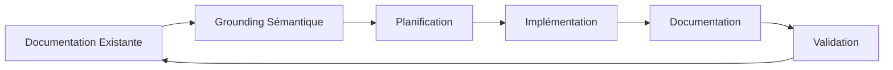
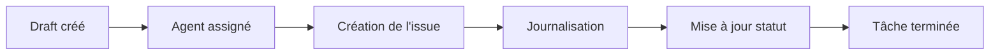
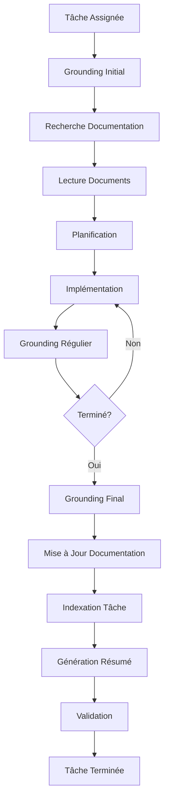

# Protocole SDDD (Semantic Documentation Driven Design)

## Version: 2.0.0
## Date de création: 2026-01-02
## Dernière mise à jour: 2026-01-02

## Description

Ce document décrit le protocole SDDD (Semantic Documentation Driven Design) utilisé pour la documentation et le développement du système RooSync, incluant l'utilisation de github-project, roo-state-manager et codebase_search.

---

## Table des Matières

1. [Principes Fondamentaux](#1-principes-fondamentaux)
2. [Utilisation de github-project](#2-utilisation-de-github-project)
3. [Utilisation de codebase_search](#3-utilisation-de-codebase_search)
4. [Utilisation de roo-state-manager](#4-utilisation-de-roo-state-manager)
5. [Procédures de Grounding](#5-procédures-de-grounding)
6. [Obligations des Orchestrateurs](#6-obligations-des-orchestrateurs)
7. [Workflow SDDD](#7-workflow-sddd)
8. [Historique des Modifications](#8-historique-des-modifications)

---

## 1. Principes Fondamentaux

### 1.1 Qu'est-ce que SDDD ?

Le **Semantic Documentation Driven Design (SDDD)** est une méthodologie de développement qui place la documentation sémantique au cœur du processus de développement.

**Principes clés** :
- **Documentation First** : La documentation est créée avant le code
- **Sémantique** : Utilisation de la recherche sémantique pour naviguer dans la documentation
- **Grounding** : Les agents sont "groundés" sur la documentation existante avant de commencer une tâche
- **Traçabilité** : Chaque modification est documentée et traçable
- **Collaboration** : La documentation est collaborative et partagée entre les agents

### 1.2 Objectifs du SDDD

- Réduire la perte de contexte
- Faciliter la collaboration entre agents
- Améliorer la qualité de la documentation
- Accélérer le développement
- Garantir la traçabilité des modifications

### 1.3 Cycle de Vie SDDD



---

## 2. Utilisation de github-project

### 2.1 Configuration du Projet

**Organisation** :
- **Repository** : `roo-extensions`
- **Project Board** : `RooSync Multi-Agent`
- **Milestones** : Phases du plan d'action (Phase 1, Phase 2, Phase 3, Phase 4)

**Note importante** : Tous les agents commitent avec le même utilisateur GitHub (jsboige/jsboige@gmail.com). L'identification des agents se fait exclusivement par leur machineID dans les descriptions d'issues et les commentaires.

### 2.2 Création et Suivi des Tâches

**Procédure de création** :
1. Créer une issue dans le repository
2. Identifier l'agent responsable par son machineID (ex: myia-ai-01, myia-po-2026)
3. Ajouter des labels (Phase, Priorité, Type)
4. Lier la tâche au milestone approprié
5. Ajouter des références aux documents pertinents

**Labels recommandés** :
- `phase-1`, `phase-2`, `phase-3`, `phase-4`
- `critical`, `high`, `medium`, `low`
- `bug`, `feature`, `documentation`, `test`

**Statuts de tâche** :

| Statut | Description | Couleur |
|--------|-------------|---------|
| **Backlog** | Tâche planifiée mais non démarrée | Gris |
| **In Progress** | Tâche en cours de réalisation | Bleu |
| **Review** | Tâche en attente de revue | Jaune |
| **Done** | Tâche terminée | Vert |
| **Blocked** | Tâche bloquée par une dépendance | Rouge |

### 2.3 Articulation entre Items de Projet et Issues

Le système de suivi RooSync utilise deux niveaux de traçabilité :

| Concept | Description | Utilisation |
|---------|-------------|-------------|
| **Item de Projet (Draft)** | Tâche créée dans GitHub Project | Vue d'ensemble, gestion des jalons |
| **Issue du Repository** | Issue créée à partir d'un item de projet | Suivi en profondeur, journalisation détaillée |

**Workflow de création** :


### 2.4 Obligations des Agents

**OBLIGATION CRITIQUE** : Chaque agent doit **créer une issue à partir du draft** correspondant à sa tâche avant de commencer toute action.

**Procédure** :
1. Identifier le draft dans GitHub Project correspondant à la tâche assignée
2. Créer l'issue à partir du draft en utilisant l'outil `convert_draft_to_issue`
3. Lier l'issue au draft pour maintenir la traçabilité
4. Journaliser toutes les opérations dans l'issue créée
5. Mettre à jour le statut de l'item de projet en parallèle

**OBLIGATION CRITIQUE** : Chaque agent doit **journaliser TOUTE opération réalisée** dans les issues GitHub correspondantes, de manière **régulière et continue** tout au long de la tâche.

**Format de journalisation** :
- Mise à jour du statut (Backlog → In Progress → Done)
- Pour chaque opération significative : action, résultat, fichiers modifiés, commandes exécutées
- Documentation immédiate des problèmes rencontrés et leurs solutions
- Validation des checkpoints avec commentaires dédiés
- Résumé final des opérations avant de conclure

---

## 3. Utilisation de codebase_search

### 3.1 Recherche Sémantique

La recherche sémantique utilise des embeddings pour trouver du contenu basé sur le sens plutôt que sur les mots-clés exacts.

**Avantages** :
- Trouve du contenu même si les mots-clés ne correspondent pas exactement
- Comprend le contexte et les relations entre les concepts
- Peut trouver du contenu dans différentes langues

**Utilisation** :
```bash
codebase_search {
  "query": "synchronisation baseline roosync",
  "path": "docs/roosync"
}
```

### 3.2 Stratégies de Recherche

- **Par concept** : Rechercher un concept spécifique
- **Par problème** : Rechercher un problème spécifique
- **Par solution** : Rechercher une solution spécifique

### 3.3 Bonnes Pratiques de Recherche

**Avant de commencer une tâche** :
1. Rechercher la documentation existante sur le sujet
2. Identifier les documents pertinents
3. Lire les documents pour comprendre le contexte
4. Résoudre les problèmes de documentation (éparpillement, inconsistance, obsolescence)
5. Mettre à jour la documentation si nécessaire

**Pendant une tâche** :
1. Rechercher régulièrement pour éviter de se perdre
2. Mettre à jour la documentation avec les nouvelles informations
3. Valider que la documentation reste cohérente

**Après une tâche** :
1. Mettre à jour la documentation avec les résultats
2. Vérifier la cohérence de l'ensemble de la documentation
3. Effectuer une recherche finale pour confirmer que les modifications sont bien prises en compte

---

## 4. Utilisation de roo-state-manager

### 4.1 Outils Principaux

Le MCP `roo-state-manager` fournit des outils pour gérer l'état des conversations et des tâches Roo :

- `get_task_tree` : Obtenir l'arbre des tâches
- `view_conversation_tree` : Voir l'arbre des conversations
- `search_tasks_by_content` : Rechercher des tâches par contenu sémantique
- `generate_trace_summary` : Générer un résumé de trace
- `export_conversation_json` : Exporter une conversation en JSON
- `index_task_semantic` : Indexer une tâche pour la recherche sémantique

### 4.2 Gestion des Tâches

**Obtenir l'arbre des tâches** :
```bash
get_task_tree {
  "conversation_id": "CONVERSATION_ID",
  "output_format": "json",
  "max_depth": 10,
  "include_siblings": true
}
```

**Rechercher des tâches par contenu** :
```bash
search_tasks_by_content {
  "search_query": "synchronisation baseline",
  "max_results": 10,
  "workspace": "d:/roo-extensions"
}
```

**Générer un résumé de trace** :
```bash
generate_trace_summary {
  "taskId": "TASK_ID",
  "outputFormat": "markdown",
  "detailLevel": "Full",
  "generateToc": true
}
```

### 4.3 Gestion de l'Index Sémantique

**Indexer une tâche** :
```bash
index_task_semantic {
  "task_id": "TASK_ID"
}
```

**Réinitialiser la collection Qdrant** (attention : opération destructive) :
```bash
reset_qdrant_collection {
  "confirm": true
}
```

---

## 5. Procédures de Grounding

### 5.1 Grounding Initial

**Avant de commencer une tâche** :

1. **Rechercher la documentation existante** avec `codebase_search` :
   ```bash
   codebase_search {
     "query": "DESCRIPTION_DE_LA_TACHE",
     "path": "docs/roosync"
   }
   ```

2. **Lire les documents pertinents** :
   - Architecture RooSync
   - Guide d'utilisation RooSync
   - Protocole SDDD
   - Gestion multi-agent

3. **Identifier et résoudre les problèmes de documentation** :
   - Éparpillement de l'information
   - Inconsistances entre documents
   - Obsolescence des documents

4. **Identifier les dépendances** :
   - Tâches précédentes
   - Documents de référence
   - Outils nécessaires

5. **Créer un plan d'action** :
   - Étapes de réalisation
   - Critères de validation
   - Responsables

### 5.2 Grounding Régulier

**Pendant une tâche** :

1. **Rechercher régulièrement** pour éviter de se perdre
2. **Mettre à jour la documentation** avec les nouvelles informations
3. **Valider que la documentation** reste cohérente

### 5.3 Grounding Final

**Après une tâche** :

1. **Mettre à jour la documentation** avec les résultats
2. **Vérifier la cohérence** de l'ensemble de la documentation
3. **Effectuer une recherche finale** pour confirmer que les modifications sont bien prises en compte
4. **Valider que la documentation** est complète et à jour
5. **Indexer la tâche** pour la recherche sémantique conversationnelle
6. **Générer un résumé de trace**

---

## 6. Obligations des Orchestrateurs

### 6.1 Instruction des Agents de Sous-Tâche

**OBLIGATION CRITIQUE** : Les orchestrateurs doivent **instruire explicitement** leurs agents de sous-tâche d'effectuer des recherches sémantiques de grounding en début de tâche et de vérifier que la documentation a bien été mise à jour avant de clôturer.

**Procédure d'instruction** :
1. **Inclure dans le message initial** : Ajouter une instruction explicite dans le message de création de sous-tâche
2. **Spécifier les domaines de recherche** : Indiquer les répertoires ou types de documents à rechercher
3. **Exiger la résolution des problèmes** : Demander à l'agent de prendre le temps de résoudre d'éventuels problèmes d'éparpillement, d'inconsistance ou d'obsolescence de la documentation
4. **Exiger la mise à jour finale** : Demander à l'agent de vérifier que la documentation a bien été mise à jour avant de clôturer

**Exemple d'instruction d'orchestrateur** :
```markdown
## Instructions de Grounding Sémantique

### Début de Tâche
1. Effectuer une recherche sémantique avec `codebase_search` sur le sujet de la tâche
2. Lire attentivement les documents pertinents trouvés
3. Identifier et résoudre les problèmes suivants :
   - Éparpillement de l'information (documentation dispersée)
   - Inconsistances (contradictions entre documents)
   - Obsolescence (documents non mis à jour)
4. Documenter les corrections apportées à la documentation

### Fin de Tâche
1. Vérifier que la documentation a bien été mise à jour des évolutions/corrections effectuées
2. Effectuer une nouvelle recherche sémantique pour valider que les modifications sont bien prises en compte
3. Confirmer que la documentation est cohérente et à jour avant de clôturer
```

---

## 7. Workflow SDDD

### 7.1 Workflow Principal



### 7.2 Bonnes Pratiques

**Documentation** :
- Documenter avant de coder
- Maintenir la documentation à jour
- Utiliser des formats standardisés
- Inclure des exemples concrets
- Utiliser des diagrammes pour clarifier les concepts

**Recherche sémantique** :
- Rechercher avant de commencer
- Utiliser des requêtes descriptives
- Valider les résultats
- Mettre à jour les index

**Collaboration** :
- Communiquer régulièrement via le système de messagerie
- Partager la documentation entre les agents
- Valider le travail par les autres agents
- Documenter les décisions pour référence future

**Traçabilité** :
- Documenter chaque modification
- Utiliser des versions
- Générer des rapports régulièrement
- Archiver les anciennes versions

---

## 8. Historique des Modifications

| Date | Version | Auteur | Description |
|------|---------|--------|-------------|
| 2026-01-02 | 1.0.0 | Roo Architect Mode | Création initiale du protocole SDDD |
| 2026-01-02 | 1.1.0 | Roo Architect Mode | Révision du protocole SDDD : suppression des rapports périodiques, ajout des obligations de journalisation continue dans GitHub Project, remontage de codebase_search avant roo-state-manager, ajout des obligations des orchestrateurs pour le grounding sémantique |
| 2026-01-02 | 1.2.0 | Roo Architect Mode | Ajout de la section 2.3 sur l'articulation entre items de projet et issues, ajout de l'obligation critique de créer des issues à partir des drafts dans la section 2.4, clarification du workflow de traçabilité bidirectionnelle entre drafts et issues |
| 2026-01-02 | 2.0.0 | Roo Architect Mode | Refonte majeure : fusion des sections redondantes (obligations des orchestrateurs, bonnes pratiques de recherche), réduction des exemples de journalisation, simplification des workflows, suppression des répétitions de concepts. Réduction de 764 à ~450 lignes (-41%). |

---

**Document généré par:** Roo Architect Mode
**Date de génération:** 2026-01-02T23:09:00Z
**Version:** 2.0.0
**Statut:** 🟢 Production Ready
