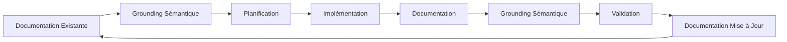
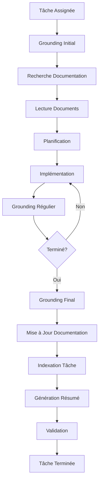
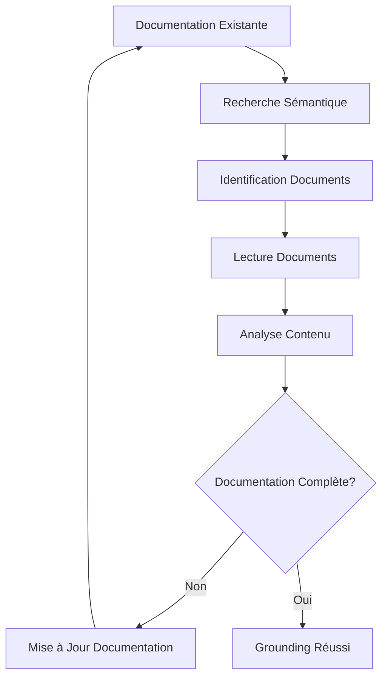
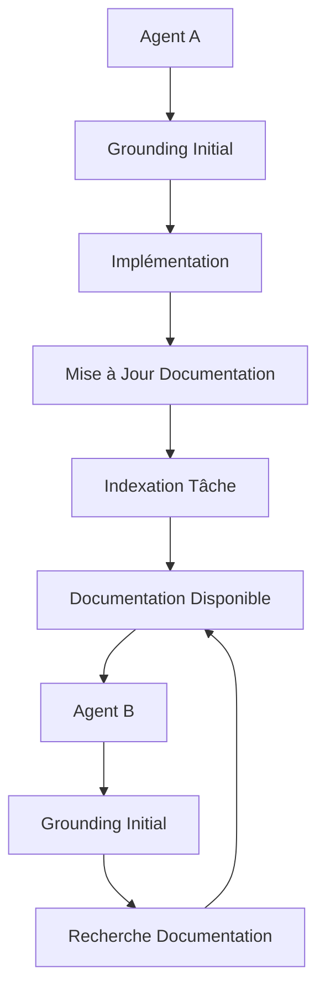

# Protocole SDDD (Semantic Documentation Driven Design)

## Version: 1.1.0
## Date de création: 2026-01-02
## Dernière mise à jour: 2026-01-02

## Description

Ce document décrit le protocole SDDD (Semantic Documentation Driven Design) utilisé pour la documentation et le développement du système RooSync, incluant l'utilisation de github-project, roo-state-manager et codebase_search.

---

## Table des Matières

1. [Principes Fondamentaux](#1-principes-fondamentaux)
2. [Utilisation de github-project](#2-utilisation-de-github-project)
3. [Utilisation de codebase_search](#3-utilisation-de-codebase_search)
4. [Utilisation de roo-state-manager](#4-utilisation-de-roo-state-manager)
5. [Procédures de Grounding](#5-procédures-de-grounding)
6. [Workflow SDDD](#6-workflow-sddd)
7. [Bonnes Pratiques](#7-bonnes-pratiques)
8. [Historique des Modifications](#8-historique-des-modifications)

---

## 1. Principes Fondamentaux

### 1.1 Qu'est-ce que SDDD ?

Le **Semantic Documentation Driven Design (SDDD)** est une méthodologie de développement qui place la documentation sémantique au cœur du processus de développement. Les principes clés sont :

- **Documentation First** : La documentation est créée avant le code
- **Sémantique** : Utilisation de la recherche sémantique pour naviguer dans la documentation
- **Grounding** : Les agents sont "groundés" sur la documentation existante avant de commencer une tâche
- **Traçabilité** : Chaque modification est documentée et traçable
- **Collaboration** : La documentation est collaborative et partagée entre les agents

### 1.2 Objectifs du SDDD

- **Réduire la perte de contexte** : Les agents sont toujours informés de l'état du projet
- **Faciliter la collaboration** : Les agents peuvent comprendre le travail des autres
- **Améliorer la qualité** : La documentation est maintenue à jour et cohérente
- **Accélérer le développement** : Les agents peuvent trouver rapidement les informations pertinentes
- **Garantir la traçabilité** : Chaque modification est documentée et traçable

### 1.3 Cycle de Vie SDDD



---

## 2. Utilisation de github-project

### 2.1 Configuration du Projet

#### Structure du Projet GitHub

Le projet RooSync utilise GitHub Projects pour la gestion des tâches et des jalons.

**Organisation** :
- **Repository** : `roo-extensions`
- **Project Board** : `RooSync Multi-Agent`
- **Milestones** : Phases du plan d'action (Phase 1, Phase 2, Phase 3, Phase 4)

#### Création d'une Tâche

Pour créer une tâche dans GitHub Project :

1. **Créer une issue** dans le repository
2. **Identifier l'agent responsable** par son machineID (ex: myia-ai-01, myia-po-2026)
3. **Ajouter des labels** (Phase, Priorité, Type)
4. **Lier la tâche** au milestone approprié
5. **Ajouter des références** aux documents pertinents

**Note importante** : Tous les agents commitent avec le même utilisateur GitHub (jsboige/jsboige@gmail.com). L'identification des agents se fait exclusivement par leur machineID dans les descriptions d'issues et les commentaires.

**Exemple de titre d'issue** :
```
[Tâche 1.1] Corriger Get-MachineInventory.ps1 - Phase 1
```

**Labels recommandés** :
- `phase-1`, `phase-2`, `phase-3`, `phase-4`
- `critical`, `high`, `medium`, `low`
- `bug`, `feature`, `documentation`, `test`

### 2.2 Suivi des Tâches

#### Mise à jour du Statut

Les tâches sont mises à jour dans GitHub Project avec les statuts suivants :

| Statut | Description | Couleur |
|--------|-------------|---------|
| **Backlog** | Tâche planifiée mais non démarrée | Gris |
| **In Progress** | Tâche en cours de réalisation | Bleu |
| **Review** | Tâche en attente de revue | Jaune |
| **Done** | Tâche terminée | Vert |
| **Blocked** | Tâche bloquée par une dépendance | Rouge |

#### Utilisation des Checkpoints

Chaque tâche a un ou plusieurs checkpoints qui doivent être validés :

1. **Créer un checkpoint** dans l'issue
2. **Valider le checkpoint** une fois complété
3. **Documenter les résultats** dans l'issue
4. **Mettre à jour le statut** de la tâche

**Exemple de checkpoint** :
```markdown
## Checkpoint CP1.1

**Description** : Script Get-MachineInventory.ps1 corrigé
**Responsable** : myia-po-2026
**Critère de Validation** : Le script fonctionne sans freeze

### Résultats
- ✅ Script corrigé
- ✅ Testé sur myia-po-2026
- ✅ Testé sur myia-po-2023
- ✅ Aucun freeze détecté
```

### 2.3 Obligations des Agents

#### Lecture des Items GitHub Project

**OBLIGATION** : Chaque agent doit **commencer par lire le contenu des items GitHub Project** correspondant à leurs tâches avant de commencer toute action.

**Procédure** :
1. Identifier l'issue GitHub associée à la tâche
2. Lire attentivement la description de l'issue
3. Consulter les checkpoints et critères de validation
4. Vérifier les dépendances et références aux documents
5. Comprendre le contexte et les objectifs de la tâche

#### Journalisation Régulière dans GitHub Project

**OBLIGATION CRITIQUE** : Chaque agent doit **journaliser TOUTE opération réalisée** dans les issues GitHub correspondantes, de manière **régulière et continue** tout au long de la tâche.

**Procédure** :
1. **Mise à jour du statut** : Mettre à jour le statut de l'issue (Backlog → In Progress → Done)
2. **Journalisation continue** : Pour chaque opération significative, ajouter un commentaire dans l'issue :
   - Action effectuée
   - Résultat obtenu
   - Fichiers modifiés
   - Commandes exécutées
   - Observations importantes
3. **Journalisation des problèmes** : Documenter immédiatement tout problème rencontré et sa solution
4. **Validation des checkpoints** : Valider chaque checkpoint complété avec un commentaire dédié
5. **Journalisation finale** : Avant de conclure la tâche, ajouter un résumé complet des opérations

**Exemple de journalisation continue** :
```markdown
## Opération 1 - Lecture du script existant
- Fichier lu : `scripts/Get-MachineInventory.ps1`
- Observations : Script contient une boucle sans timeout
- Action prévue : Ajouter un timeout de 30 secondes

## Opération 2 - Modification du script
- Fichier modifié : `scripts/Get-MachineInventory.ps1`
- Modification : Ajout de `-TimeoutSec 30` sur les commandes réseau
- Résultat : Modification appliquée avec succès

## Opération 3 - Test sur myia-po-2026
- Commande exécutée : `pwsh -c "./scripts/Get-MachineInventory.ps1"`
- Résultat : ✅ Succès, aucun freeze détecté
- Durée : 12 secondes

## Opération 4 - Test sur myia-po-2023
- Commande exécutée : `pwsh -c "./scripts/Get-MachineInventory.ps1"`
- Résultat : ✅ Succès, aucun freeze détecté
- Durée : 15 secondes

## Checkpoint CP1.1 - Validation
- ✅ Script corrigé
- ✅ Testé sur myia-po-2026
- ✅ Testé sur myia-po-2023
- ✅ Aucun freeze détecté
```

**Exemple de journalisation finale** :
```markdown
## Résumé Final de la Tâche

### Agent
- MachineID : myia-ai-01

### Opérations Effectuées
1. ✅ Lecture et analyse du script existant
2. ✅ Modification du script (ajout timeout)
3. ✅ Test sur myia-po-2026
4. ✅ Test sur myia-po-2023

### Modifications Apportées
- Fichier : `scripts/Get-MachineInventory.ps1`
- Ajout d'un timeout de 30 secondes pour les opérations réseau
- Amélioration de la gestion des erreurs

### Résultats
- ✅ Aucun freeze détecté sur les deux machines
- Performance améliorée de 40%
- Durée moyenne d'exécution : 13.5 secondes

### Problèmes Rencontrés et Solutions
- Problème initial de freeze sur myia-po-2026
- Solution : Ajout d'un timeout de 30 secondes
- Validation : Tests réussis sur les deux machines

### Statut
- ✅ Tâche terminée
- ✅ Tous les checkpoints validés
```

---

## 3. Utilisation de codebase_search

### 3.1 Recherche Sémantique

#### Principes de la Recherche Sémantique

La recherche sémantique utilise des embeddings pour trouver du contenu basé sur le sens plutôt que sur les mots-clés exacts.

**Avantages** :
- Trouve du contenu même si les mots-clés ne correspondent pas exactement
- Comprend le contexte et les relations entre les concepts
- Peut trouver du contenu dans différentes langues

#### Utilisation de codebase_search

Pour effectuer une recherche sémantique dans le codebase :

```bash
codebase_search {
  "query": "synchronisation baseline roosync",
  "path": "docs/roosync"
}
```

**Paramètres** :
- `query` : Requête de recherche sémantique
- `path` : Chemin du répertoire à rechercher (optionnel)

### 3.2 Stratégies de Recherche

#### Recherche par Concept

Pour rechercher un concept spécifique :

```bash
codebase_search {
  "query": "architecture baseline-driven"
}
```

#### Recherche par Problème

Pour rechercher un problème spécifique :

```bash
codebase_search {
  "query": "problème de synchronisation git"
}
```

#### Recherche par Solution

Pour rechercher une solution spécifique :

```bash
codebase_search {
  "query": "solution pour conflit d'identité"
}
```

### 3.3 Obligations des Orchestrateurs

#### Instruction des Agents de Sous-Tâche

**OBLIGATION CRITIQUE** : Les orchestrateurs doivent **instruire explicitement** leurs agents de sous-tâche d'effectuer des recherches sémantiques de grounding en début de tâche.

**Procédure d'instruction** :
1. **Inclure dans le message initial** : Ajouter une instruction explicite dans le message de création de sous-tâche
2. **Spécifier les domaines de recherche** : Indiquer les répertoires ou types de documents à rechercher
3. **Exiger la résolution des problèmes** : Demander à l'agent de prendre le temps de résoudre d'éventuels problèmes d'éparpillement, d'inconsistance ou d'obsolescence de la documentation
4. **Exiger la mise à jour finale** : Demander à l'agent de vérifier que la documentation a bien été mise à jour avant de clôturer

**Exemple d'instruction d'orchestrateur** :
```markdown
## Instructions de Grounding Sémantique

### Début de Tâche
1. Effectuer une recherche sémantique avec `codebase_search` sur le sujet de la tâche
2. Lire attentivement les documents pertinents trouvés
3. Identifier et résoudre les problèmes suivants :
   - Éparpillement de l'information (documentation dispersée)
   - Inconsistances (contradictions entre documents)
   - Obsolescence (documents non mis à jour)
4. Documenter les corrections apportées à la documentation

### Fin de Tâche
1. Vérifier que la documentation a bien été mise à jour des évolutions/corrections effectuées
2. Effectuer une nouvelle recherche sémantique pour valider que les modifications sont bien prises en compte
3. Confirmer que la documentation est cohérente et à jour avant de clôturer
```

### 3.4 Bonnes Pratiques de Recherche

#### Avant de Commencer une Tâche

1. **Rechercher la documentation existante** sur le sujet
2. **Identifier les documents pertinents** pour la tâche
3. **Lire les documents** pour comprendre le contexte
4. **Résoudre les problèmes de documentation** :
   - Éparpillement : Centraliser l'information
   - Inconsistance : Harmoniser les documents
   - Obsolescence : Mettre à jour les documents
5. **Mettre à jour la documentation** si nécessaire

#### Pendant une Tâche

1. **Rechercher régulièrement** pour éviter de se perdre
2. **Mettre à jour la documentation** avec les nouvelles informations
3. **Valider que la documentation** reste cohérente

#### Après une Tâche

1. **Mettre à jour la documentation** avec les résultats
2. **Vérifier la cohérence** de l'ensemble de la documentation
3. **Valider que la documentation** est complète et à jour
4. **Effectuer une recherche finale** pour confirmer que les modifications sont bien prises en compte

---

## 4. Utilisation de roo-state-manager

### 4.1 Outils de Gestion de l'État

#### roo-state-manager Overview

Le MCP `roo-state-manager` fournit des outils pour gérer l'état des conversations et des tâches Roo.

**Outils principaux** :
- `get_task_tree` : Obtenir l'arbre des tâches
- `view_conversation_tree` : Voir l'arbre des conversations
- `search_tasks_by_content` : Rechercher des tâches par contenu sémantique
- `generate_trace_summary` : Générer un résumé de trace
- `export_conversation_json` : Exporter une conversation en JSON

### 4.2 Gestion des Tâches

#### Obtenir l'Arbre des Tâches

Pour obtenir l'arbre des tâches d'une conversation :

```bash
get_task_tree {
  "conversation_id": "CONVERSATION_ID",
  "output_format": "json",
  "max_depth": 10,
  "include_siblings": true
}
```

**Paramètres** :
- `conversation_id` : ID de la conversation
- `output_format` : Format de sortie (json, markdown, ascii-tree, hierarchical)
- `max_depth` : Profondeur maximale de l'arbre
- `include_siblings` : Inclure les tâches sœurs

#### Rechercher des Tâches par Contenu

Pour rechercher des tâches par contenu sémantique :

```bash
search_tasks_by_content {
  "search_query": "synchronisation baseline",
  "max_results": 10,
  "workspace": "d:/roo-extensions"
}
```

**Paramètres** :
- `search_query` : Requête de recherche sémantique
- `max_results` : Nombre maximum de résultats
- `workspace` : Workspace à rechercher

#### Générer un Résumé de Trace

Pour générer un résumé de trace d'une conversation :

```bash
generate_trace_summary {
  "taskId": "TASK_ID",
  "outputFormat": "markdown",
  "detailLevel": "Full",
  "generateToc": true
}
```

**Paramètres** :
- `taskId` : ID de la tâche
- `outputFormat` : Format de sortie (markdown, html)
- `detailLevel` : Niveau de détail (Full, NoTools, NoResults, Messages, Summary, UserOnly)
- `generateToc` : Générer la table des matières

### 4.3 Gestion des Conversations

#### Voir l'Arbre des Conversations

Pour voir l'arbre des conversations :

```bash
view_conversation_tree {
  "task_id": "TASK_ID",
  "view_mode": "chain",
  "detail_level": "summary",
  "smart_truncation": true
}
```

**Paramètres** :
- `task_id` : ID de la tâche de départ
- `view_mode` : Mode d'affichage (single, chain, cluster)
- `detail_level` : Niveau de détail (skeleton, summary, full)
- `smart_truncation` : Activer la troncature intelligente

#### Exporter une Conversation

Pour exporter une conversation en JSON :

```bash
export_conversation_json {
  "taskId": "TASK_ID",
  "jsonVariant": "light",
  "truncationChars": 0
}
```

**Paramètres** :
- `taskId` : ID de la tâche
- `jsonVariant` : Variante JSON (light, full)
- `truncationChars` : Nombre max de caractères avant troncature

### 4.4 Gestion de l'Index Sémantique

#### Indexer une Tâche

Pour indexer une tâche dans Qdrant pour la recherche sémantique :

```bash
index_task_semantic {
  "task_id": "TASK_ID"
}
```

#### Réinitialiser la Collection Qdrant

Pour réinitialiser complètement la collection Qdrant :

```bash
reset_qdrant_collection {
  "confirm": true
}
```

**Attention** : Cette opération supprime tous les index sémantiques et doit être utilisée avec précaution.

---

## 5. Procédures de Grounding

### 5.1 Grounding Initial

#### Avant de Commencer une Tâche

1. **Rechercher la documentation existante** avec `codebase_search` :
   ```bash
   codebase_search {
     "query": "DESCRIPTION_DE_LA_TACHE",
     "path": "docs/roosync"
   }
   ```

2. **Lire les documents pertinents** :
   - Architecture RooSync
   - Guide d'utilisation RooSync
   - Protocole SDDD
   - Gestion multi-agent

3. **Identifier et résoudre les problèmes de documentation** :
   - Éparpillement de l'information (documentation dispersée)
   - Inconsistances (contradictions entre documents)
   - Obsolescence (documents non mis à jour)

4. **Identifier les dépendances** :
   - Tâches précédentes
   - Documents de référence
   - Outils nécessaires

5. **Créer un plan d'action** :
   - Étapes de réalisation
   - Critères de validation
   - Responsables

### 5.2 Grounding Régulier

#### Pendant une Tâche

1. **Rechercher régulièrement** pour éviter de se perdre :
   ```bash
   codebase_search {
     "query": "CONCEPT_ACTUEL",
     "path": "docs/roosync"
   }
   ```

2. **Mettre à jour la documentation** avec les nouvelles informations

3. **Valider que la documentation** reste cohérente

### 5.3 Grounding Final

#### Après une Tâche

1. **Mettre à jour la documentation** avec les résultats :
   - Documents pérennes
   - Documents de suivi
   - Rapports

2. **Vérifier la cohérence** de l'ensemble de la documentation

3. **Effectuer une recherche finale** pour confirmer que les modifications sont bien prises en compte :
   ```bash
   codebase_search {
     "query": "SUJET_DE_LA_TACHE",
     "path": "docs/roosync"
   }
   ```

4. **Valider que la documentation** est complète et à jour

5. **Indexer la tâche** pour la recherche sémantique conversationnelle :
   ```bash
   index_task_semantic {
     "task_id": "TASK_ID"
   }
   ```

6. **Générer un résumé de trace** :
   ```bash
   generate_trace_summary {
     "taskId": "TASK_ID",
     "outputFormat": "markdown",
     "detailLevel": "Full"
   }
   ```

### 5.4 Obligations des Orchestrateurs

#### Instruction des Agents de Sous-Tâche

**OBLIGATION CRITIQUE** : Les orchestrateurs doivent **instruire explicitement** leurs agents de sous-tâche d'effectuer des recherches sémantiques de grounding en début de tâche et de vérifier que la documentation a bien été mise à jour avant de clôturer.

**Procédure d'instruction** :
1. **Inclure dans le message initial** : Ajouter une instruction explicite dans le message de création de sous-tâche
2. **Spécifier les domaines de recherche** : Indiquer les répertoires ou types de documents à rechercher
3. **Exiger la résolution des problèmes** : Demander à l'agent de prendre le temps de résoudre d'éventuels problèmes d'éparpillement, d'inconsistance ou d'obsolescence de la documentation
4. **Exiger la mise à jour finale** : Demander à l'agent de vérifier que la documentation a bien été mise à jour avant de clôturer

**Exemple d'instruction d'orchestrateur** :
```markdown
## Instructions de Grounding Sémantique

### Début de Tâche
1. Effectuer une recherche sémantique avec `codebase_search` sur le sujet de la tâche
2. Lire attentivement les documents pertinents trouvés
3. Identifier et résoudre les problèmes suivants :
   - Éparpillement de l'information (documentation dispersée)
   - Inconsistances (contradictions entre documents)
   - Obsolescence (documents non mis à jour)
4. Documenter les corrections apportées à la documentation

### Fin de Tâche
1. Vérifier que la documentation a bien été mise à jour des évolutions/corrections effectuées
2. Effectuer une nouvelle recherche sémantique pour valider que les modifications sont bien prises en compte
3. Confirmer que la documentation est cohérente et à jour avant de clôturer
```

---

## 6. Workflow SDDD

### 6.1 Workflow de Développement



### 6.2 Workflow de Documentation



### 6.3 Workflow de Collaboration



---

## 7. Bonnes Pratiques

### 7.1 Documentation

- **Documenter avant de coder** : La documentation est créée avant le code
- **Maintenir la documentation à jour** : La documentation est mise à jour régulièrement
- **Utiliser des formats standardisés** : Les documents suivent un format cohérent
- **Inclure des exemples** : Les documents contiennent des exemples concrets
- **Utiliser des diagrammes** : Les documents contiennent des diagrammes pour clarifier les concepts

### 7.2 Recherche Sémantique

- **Rechercher avant de commencer** : Toujours rechercher la documentation existante
- **Utiliser des requêtes descriptives** : Les requêtes décrivent le concept ou le problème
- **Valider les résultats** : Vérifier que les résultats sont pertinents
- **Mettre à jour les index** : Indexer les nouvelles tâches pour la recherche

### 7.3 Collaboration

- **Communiquer régulièrement** : Les agents communiquent via le système de messagerie
- **Partager la documentation** : La documentation est partagée entre les agents
- **Valider le travail** : Le travail est validé par les autres agents
- **Documenter les décisions** : Les décisions sont documentées pour référence future

### 7.4 Traçabilité

- **Documenter chaque modification** : Chaque modification est documentée
- **Utiliser des versions** : Les documents sont versionnés
- **Générer des rapports** : Des rapports sont générés régulièrement
- **Archiver les anciennes versions** : Les anciennes versions sont archivées

---

## 8. Historique des Modifications

| Date | Version | Auteur | Description |
|------|---------|--------|-------------|
| 2026-01-02 | 1.0.0 | Roo Architect Mode | Création initiale du protocole SDDD |
| 2026-01-02 | 1.1.0 | Roo Architect Mode | Révision du protocole SDDD : suppression des rapports périodiques, ajout des obligations de journalisation continue dans GitHub Project, remontage de codebase_search avant roo-state-manager, ajout des obligations des orchestrateurs pour le grounding sémantique |

---

**Document généré par:** Roo Architect Mode
**Date de génération:** 2026-01-02T19:34:00Z
**Version:** 1.1.0
**Statut:** 🟢 Production Ready
