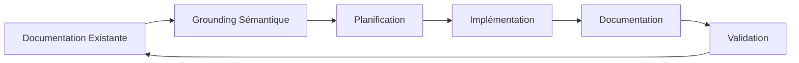
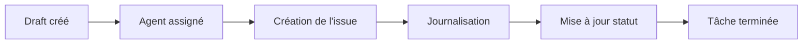
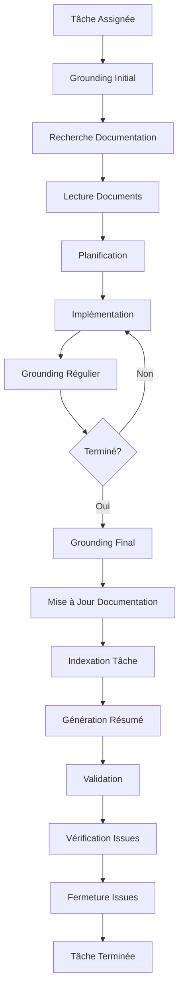

# Protocole SDDD (Semantic Documentation Driven Design)

## Version: 2.6.0
## Date de création: 2026-01-02
## Dernière mise à jour: 2026-01-15

## Description

Ce document décrit le protocole SDDD (Semantic Documentation Driven Design) utilisé pour la documentation et le développement du système RooSync, incluant l'utilisation de github-project, roo-state-manager et codebase_search.

---

## Table des Matières

1. [Principes Fondamentaux](#1-principes-fondamentaux)
2. [Utilisation de github-project](#2-utilisation-de-github-project)
3. [Exemples d'Appels MCP GitHub-Projects](#3-exemples-dappels-mcp-github-projects)
4. [Utilisation de codebase_search](#4-utilisation-de-codebase_search)
5. [Utilisation de roo-state-manager](#5-utilisation-de-roo-state-manager)
6. [Procédures de Grounding](#6-procédures-de-grounding)
7. [Obligations des Orchestrateurs](#7-obligations-des-orchestrateurs)
8. [Workflow SDDD](#8-workflow-sddd)
9. [Historique des Modifications](#9-historique-des-modifications)

---

## 1. Principes Fondamentaux

### 1.1 Qu'est-ce que SDDD ?

Le **Semantic Documentation Driven Design (SDDD)** est une méthodologie de développement qui place la documentation sémantique au cœur du processus de développement.

**Principes clés** :
- **Documentation First** : La documentation est créée avant le code
- **Sémantique** : Utilisation de la recherche sémantique pour naviguer dans la documentation
- **Grounding** : Les agents sont "groundés" sur la documentation existante avant de commencer une tâche
- **Traçabilité** : Chaque modification est documentée et traçable
- **Collaboration** : La documentation est collaborative et partagée entre les agents

### 1.2 Objectifs du SDDD

- Réduire la perte de contexte
- Faciliter la collaboration entre agents
- Améliorer la qualité de la documentation
- Accélérer le développement
- Garantir la traçabilité des modifications

### 1.3 Cycle de Vie SDDD



---

## 2. Utilisation de github-project

### 2.1 Configuration du Projet

**Organisation** :
- **Owner GitHub** : `jsboige`
- **Repository** : `roo-extensions`
- **Project Boards** :
  - **Project #67** : `RooSync Multi-Agent Tasks` (pour les agents Roo)
  - **Project #70** : `RooSync Multi-Agent Coordination` (pour les agents Claude Code)
- **Milestones** : Phases du plan d'action (Phase 1, Phase 2, Phase 3, Phase 4)

**Note importante** : Tous les agents commitent avec le même utilisateur GitHub (jsboige/jsboige@gmail.com). L'identification des agents se fait exclusivement par leur machineID dans les descriptions d'issues et les commentaires.

### 2.2 Création et Suivi des Tâches

**Répartition des responsabilités** :
- **Agents Roo** : Code technique, tests, builds, scripts → Project #67
- **Agents Claude Code** : Documentation, coordination, analysis, reporting → Project #70

**Procédure de création** :
1. Créer une issue dans le repository
2. Identifier l'agent responsable par son machineID (ex: myia-ai-01, myia-po-2026)
3. Ajouter des labels (Phase, Priorité, Type)
4. Lier la tâche au milestone approprié
5. Ajouter des références aux documents pertinents

**Labels recommandés** :
- `phase-1`, `phase-2`, `phase-3`, `phase-4`
- `critical`, `high`, `medium`, `low`
- `bug`, `feature`, `documentation`, `test`

**Statuts de tâche** :

| Statut | Description | Couleur |
|--------|-------------|---------|
| **Backlog** | Tâche planifiée mais non démarrée | Gris |
| **In Progress** | Tâche en cours de réalisation | Bleu |
| **Review** | Tâche en attente de revue | Jaune |
| **Done** | Tâche terminée | Vert |
| **Blocked** | Tâche bloquée par une dépendance | Rouge |

### 2.3 Articulation entre Items de Projet et Issues

Le système de suivi RooSync utilise deux niveaux de traçabilité :

| Concept | Description | Utilisation |
|---------|-------------|-------------|
| **Item de Projet (Draft)** | Tâche créée dans GitHub Project | Vue d'ensemble, gestion des jalons |
| **Issue du Repository** | Issue créée à partir d'un item de projet | Suivi en profondeur, journalisation détaillée |

**Workflow de création** :


### 2.4 Obligations des Agents

**OBLIGATION CRITIQUE** : Chaque agent doit **créer une issue à partir du draft** correspondant à sa tâche avant de commencer toute action.

**Procédure** :
1. Identifier le draft dans GitHub Project correspondant à la tâche assignée
2. Créer l'issue à partir du draft en utilisant l'outil `convert_draft_to_issue`
3. Lier l'issue au draft pour maintenir la traçabilité
4. Journaliser toutes les opérations dans l'issue créée
5. Mettre à jour le statut de l'item de projet en parallèle

**OBLIGATION CRITIQUE** : Chaque agent doit **journaliser TOUTE opération réalisée** dans les issues GitHub correspondantes, de manière **régulière et continue** tout au long de la tâche.

**OBLIGATION CRITIQUE** : Chaque agent doit **vérifier et fermer les issues complétées** après validation, en suivant la procédure décrite dans la section 2.6.

### 2.5 Communication Inter-Agents

**Fichiers INTERCOM locaux** :
- Chaque instance VSCode dispose d'un fichier INTERCOM local dans `.claude/local/INTERCOM-{machineID}.md`
- Ce fichier permet la communication locale entre Roo et Claude Code dans la même instance VSCode
- Les agents doivent utiliser ce fichier pour :
  - Coordonner les tâches entre Roo et Claude Code
  - Partager des informations contextuelles
  - Signaler des dépendances ou des blocages
  - Documenter les décisions conjointes

**Format de communication INTERCOM** :
```markdown
## Communication - [Date] - [Agent]

### Objet
Description de l'objet de la communication

### Contenu
Contenu détaillé de la communication

### Actions requises
- [ ] Action 1
- [ ] Action 2

### Statut
En attente / En cours / Terminé
```

**Format de journalisation** :
- Mise à jour du statut (Backlog → In Progress → Done)
- Pour chaque opération significative : action, résultat, fichiers modifiés, commandes exécutées
- Documentation immédiate des problèmes rencontrés et leurs solutions
- Validation des checkpoints avec commentaires dédiés
- Résumé final des opérations avant de conclure

### 2.6 Vérification et Fermeture des Issues

**OBLIGATION CRITIQUE** : Chaque agent doit **vérifier régulièrement** les issues GitHub qui ont des commentaires et qui auraient dû être fermées, et **fermer les issues complétées** après validation.

**Procédure de vérification régulière** :
1. Lister les issues ouvertes avec des commentaires dans les projets RooSync (#67 et #70)
2. Identifier les issues qui semblent complétées (statut "Done" dans le projet, commentaires de validation, etc.)
3. Vérifier que toutes les actions requises ont été effectuées
4. Confirmer que l'issue peut être fermée

**Checklist de validation avant fermeture** :
- [ ] Toutes les actions requises ont été effectuées
- [ ] Les tests ont été validés (si applicable)
- [ ] La documentation a été mise à jour
- [ ] Les changements ont été commités et poussés
- [ ] Les dépendances ont été résolues
- [ ] Les commentaires indiquent que la tâche est terminée
- [ ] Le statut dans le projet GitHub est "Done"

**Procédure de fermeture** :
1. Ajouter un commentaire final de validation dans l'issue
2. Mettre à jour le statut de l'item de projet à "Done" (si ce n'est pas déjà fait)
3. Fermer l'issue en utilisant l'outil `update_issue_state`
4. Documenter la fermeture dans le journal de l'agent

**Fréquence de vérification** :
- **Avant de commencer une nouvelle tâche** : Vérifier les issues en cours
- **Après avoir terminé une tâche** : Vérifier si d'autres issues peuvent être fermées
- **Régulièrement** : Au moins une fois par jour pour les agents actifs

---

## 3. Exemples d'Appels MCP GitHub-Projects

Cette section fournit des exemples concrets d'utilisation des outils MCP `github-projects-mcp` pour interagir avec le projet GitHub RooSync Multi-Agent.

### 3.1 Lister les Projets

**Outil** : `list_projects`

**Paramètres requis** :
- `owner` : Nom d'utilisateur ou d'organisation (ex: `jsboige`)
- `type` : Type de propriétaire (`user` ou `org`, défaut: `user`)
- `state` : État des projets (`open`, `closed`, `all`, défaut: `open`)

**Exemple d'appel** :
```bash
list_projects {
  "owner": "jsboige",
  "type": "user",
  "state": "open"
}
```

**Résultat attendu** :
```json
{
  "projects": [
    {
      "id": "PVT_kwHOADA1Xc4BLw3w",
      "title": "RooSync Multi-Agent",
      "description": "Projet de synchronisation multi-agent pour Roo",
      "state": "OPEN",
      "number": 67
    }
  ]
}
```

### 3.2 Obtenir les Détails d'un Projet

**Outil** : `get_project`

**Paramètres requis** :
- `owner` : Nom d'utilisateur ou d'organisation (ex: `jsboige`)
- `project_number` : Numéro du projet (ex: `67`)
- `type` : Type de propriétaire (`user` ou `org`, défaut: `user`)

**Exemple d'appel** :
```bash
get_project {
  "owner": "jsboige",
  "project_number": 67,
  "type": "user"
}
```

**Résultat attendu** :
```json
{
  "id": "PVT_kwHOADA1Xc4BLw3w",
  "title": "RooSync Multi-Agent",
  "description": "Projet de synchronisation multi-agent pour Roo",
  "state": "OPEN",
  "number": 67,
  "fields": [
    {
      "id": "status_field_id",
      "name": "Status",
      "dataType": "SINGLE_SELECT"
    }
  ]
}
```

### 3.3 Obtenir les Items d'un Projet

**Outil** : `get_project_items`

**Paramètres requis** :
- `owner` : Propriétaire du projet (ex: `jsboige`)
- `project_id` : ID du projet (ex: `PVT_kwHOADA1Xc4BLw3w`)
- `filterOptions` : Critères de filtrage (optionnel, ex: `{ "status": "Done" }`)

**Exemple d'appel** :
```bash
get_project_items {
  "owner": "jsboige",
  "project_id": "PVT_kwHOADA1Xc4BLw3w",
  "filterOptions": {
    "status": "In Progress"
  }
}
```

**Résultat attendu** :
```json
{
  "items": [
    {
      "id": "item_id_1",
      "content": {
        "title": "Implémenter la synchronisation baseline",
        "type": "DRAFT_ISSUE"
      },
      "fieldValues": [
        {
          "fieldId": "status_field_id",
          "value": "In Progress"
        }
      ]
    }
  ]
}
```

### 3.4 Convertir un Draft en Issue

**Outil** : `convert_draft_to_issue`

**Paramètres requis** :
- `owner` : Propriétaire du projet (ex: `jsboige`)
- `projectId` : ID du projet (ex: `PVT_kwHOADA1Xc4BLw3w`)
- `draftId` : ID du draft à convertir

**Exemple d'appel** :
```bash
convert_draft_to_issue {
  "owner": "jsboige",
  "projectId": "PVT_kwHOADA1Xc4BLw3w",
  "draftId": "item_id_1"
}
```

**Résultat attendu** :
```json
{
  "issue": {
    "id": "issue_id_1",
    "number": 123,
    "title": "Implémenter la synchronisation baseline",
    "state": "OPEN",
    "repository": {
      "name": "roo-extensions",
      "owner": {
        "login": "jsboige"
      }
    }
  }
}
```

### 3.5 Mettre à Jour un Champ d'Item

**Outil** : `update_project_item_field`

**Paramètres requis** :
- `owner` : Propriétaire du projet (ex: `jsboige`)
- `project_id` : ID du projet (ex: `PVT_kwHOADA1Xc4BLw3w`)
- `item_id` : ID de l'item (ex: `item_id_1`)
- `field_id` : ID du champ à mettre à jour
- `field_type` : Type de champ (`text`, `date`, `single_select`, `number`)
- `value` : Nouvelle valeur (ou `option_id` pour `single_select`)

**Exemple d'appel** (mise à jour du statut) :
```bash
update_project_item_field {
  "owner": "jsboige",
  "project_id": "PVT_kwHOADA1Xc4BLw3w",
  "item_id": "item_id_1",
  "field_id": "status_field_id",
  "field_type": "single_select",
  "option_id": "done_option_id"
}
```

**Résultat attendu** :
```json
{
  "item": {
    "id": "item_id_1",
    "fieldValues": [
      {
        "fieldId": "status_field_id",
        "value": "Done"
      }
    ]
  }
}
```

#### 3.5.1 IDs de Référence pour Project #67 (RooSync Multi-Agent Tasks)

**IMPORTANT** : Pour les champs `single_select`, utilisez `option_id` (pas `value`).

| Élément | ID |
|---------|-----|
| **Project ID** | `PVT_kwHOADA1Xc4BLw3w` |
| **Status Field ID** | `PVTSSF_lAHOADA1Xc4BLw3wzg7PYHY` |

**Options du champ Status** :

| Status | option_id |
|--------|-----------|
| Todo | `f75ad846` |
| In Progress | `47fc9ee4` |
| Done | `98236657` |

**Exemple concret** (marquer une tâche "Done") :
```bash
update_project_item_field {
  "owner": "jsboige",
  "project_id": "PVT_kwHOADA1Xc4BLw3w",
  "item_id": "PVTI_lAHOADA1Xc4BLw3wzgjKN5k",
  "field_id": "PVTSSF_lAHOADA1Xc4BLw3wzg7PYHY",
  "field_type": "single_select",
  "option_id": "98236657"
}
```

#### 3.5.2 IDs de Référence pour Project #70 (RooSync Multi-Agent Coordination)

| Élément | ID |
|---------|-----|
| **Project ID** | `PVT_kwHOADA1Xc4BL7qS` |
| **Status Field ID** | `PVTSSF_lAHOADA1Xc4BL7qSzg7W_SE` |

**Options du champ Status** (mêmes IDs que #67) :

| Status | option_id |
|--------|-----------|
| Todo | `f75ad846` |
| In Progress | `47fc9ee4` |
| Done | `98236657` |

### 3.6 Ajouter un Commentaire à une Issue

**Note** : L'ajout de commentaires aux issues se fait via l'API GitHub standard ou via l'outil `create_issue` avec un corps de message détaillé.

**Procédure de journalisation** :
1. Utiliser l'outil `create_issue` pour créer une nouvelle issue avec un corps de message
2. Ou utiliser l'API GitHub REST pour ajouter des commentaires à une issue existante

**Exemple de format de journalisation** :
```markdown
## Journalisation - [Date]

### Opération effectuée
- **Action** : Description de l'action
- **Résultat** : Résultat obtenu
- **Fichiers modifiés** : Liste des fichiers
- **Commandes exécutées** : Liste des commandes

### Problèmes rencontrés
- Description du problème
- Solution appliquée

### Validation
- Checkpoint validé : [X]
- Tests effectués : [X]
```

---

## 4. Utilisation de codebase_search

### 4.1 Recherche Sémantique

La recherche sémantique utilise des embeddings pour trouver du contenu basé sur le sens plutôt que sur les mots-clés exacts.

**Avantages** :
- Trouve du contenu même si les mots-clés ne correspondent pas exactement
- Comprend le contexte et les relations entre les concepts
- Peut trouver du contenu dans différentes langues

**Utilisation** :
```bash
codebase_search {
  "query": "synchronisation baseline roosync",
  "path": "docs/roosync"
}
```

(ou "path": "docs\suivi\RooSync")

### 4.2 Stratégies de Recherche

- **Par concept** : Rechercher un concept spécifique
- **Par problème** : Rechercher un problème spécifique
- **Par solution** : Rechercher une solution spécifique

### 4.3 Bonnes Pratiques de Recherche

**Avant de commencer une tâche** :
1. Rechercher la documentation existante sur le sujet
2. Identifier les documents pertinents
3. Lire les documents pour comprendre le contexte
4. Résoudre les problèmes de documentation (éparpillement, inconsistance, obsolescence)
5. Mettre à jour la documentation si nécessaire

**Pendant une tâche** :
1. Rechercher régulièrement pour éviter de se perdre
2. Mettre à jour la documentation avec les nouvelles informations
3. Valider que la documentation reste cohérente

**Après une tâche** :
1. Mettre à jour la documentation avec les résultats
2. Vérifier la cohérence de l'ensemble de la documentation
3. Effectuer une recherche finale pour confirmer que les modifications sont bien prises en compte

---

## 5. Utilisation de roo-state-manager

### 5.1 Outils Principaux

Le MCP `roo-state-manager` fournit des outils pour gérer l'état des conversations et des tâches Roo :

- `get_task_tree` : Obtenir l'arbre des tâches
- `view_conversation_tree` : Voir l'arbre des conversations
- `search_tasks_by_content` : Rechercher des tâches par contenu sémantique
- `generate_trace_summary` : Générer un résumé de trace
- `export_conversation_json` : Exporter une conversation en JSON
- `index_task_semantic` : Indexer une tâche pour la recherche sémantique

### 5.2 Gestion des Tâches

**Obtenir l'arbre des tâches** :
```bash
get_task_tree {
  "conversation_id": "CONVERSATION_ID",
  "output_format": "json",
  "max_depth": 10,
  "include_siblings": true
}
```

**Rechercher des tâches par contenu** :
```bash
search_tasks_by_content {
  "search_query": "synchronisation baseline",
  "max_results": 10,
  "workspace": "d:/roo-extensions"
}
```

**Générer un résumé de trace** :
```bash
generate_trace_summary {
  "taskId": "TASK_ID",
  "outputFormat": "markdown",
  "detailLevel": "Full",
  "generateToc": true
}
```

### 5.3 Gestion de l'Index Sémantique

**Indexer une tâche** :
```bash
index_task_semantic {
  "task_id": "TASK_ID"
}
```

**Réinitialiser la collection Qdrant** (attention : opération destructive) :
```bash
reset_qdrant_collection {
  "confirm": true
}
```

---

## 6. Procédures de Grounding

### 6.1 Grounding Initial

**Avant de commencer une tâche** :

1. **Rechercher la documentation existante** avec `codebase_search` :
   ```bash
   codebase_search {
     "query": "DESCRIPTION_DE_LA_TACHE",
     "path": "docs/roosync"
   }
   ```
(ou "path": "docs\suivi\RooSync")

2. **Lire les documents pertinents** :
   - Architecture RooSync
   - Guide d'utilisation RooSync
   - Protocole SDDD
   - Gestion multi-agent

3. **Identifier et résoudre les problèmes de documentation** :
   - Éparpillement de l'information
   - Inconsistances entre documents
   - Obsolescence des documents

4. **Identifier les dépendances** :
   - Tâches précédentes
   - Documents de référence
   - Outils nécessaires

5. **Créer un plan d'action** :
   - Étapes de réalisation
   - Critères de validation
   - Responsables

### 6.2 Grounding Régulier

**Pendant une tâche** :

1. **Rechercher régulièrement** pour éviter de se perdre
2. **Mettre à jour la documentation** avec les nouvelles informations
3. **Valider que la documentation** reste cohérente

### 6.3 Grounding Final

**Après une tâche** :

1. **Mettre à jour la documentation** avec les résultats
2. **Vérifier la cohérence** de l'ensemble de la documentation
3. **Effectuer une recherche finale** pour confirmer que les modifications sont bien prises en compte
4. **Valider que la documentation** est complète et à jour
5. **Indexer la tâche** pour la recherche sémantique conversationnelle
6. **Générer un résumé de trace**

---

## 7. Obligations des Orchestrateurs

### 7.1 Instruction des Agents de Sous-Tâche

**OBLIGATION CRITIQUE** : Les orchestrateurs doivent **instruire explicitement** leurs agents de sous-tâche d'effectuer des recherches sémantiques de grounding en début de tâche et de vérifier que la documentation a bien été mise à jour avant de clôturer.

**Procédure d'instruction** :
1. **Inclure dans le message initial** : Ajouter une instruction explicite dans le message de création de sous-tâche
2. **Spécifier les domaines de recherche** : Indiquer les répertoires ou types de documents à rechercher
3. **Exiger la résolution des problèmes** : Demander à l'agent de prendre le temps de résoudre d'éventuels problèmes d'éparpillement, d'inconsistance ou d'obsolescence de la documentation
4. **Exiger la mise à jour finale** : Demander à l'agent de vérifier que la documentation a bien été mise à jour avant de clôturer

**Exemple d'instruction d'orchestrateur** :
```markdown
## Instructions de Grounding Sémantique

### Début de Tâche
1. Effectuer une recherche sémantique avec `codebase_search` sur le sujet de la tâche
2. Lire attentivement les documents pertinents trouvés
3. Identifier et résoudre les problèmes suivants :
   - Éparpillement de l'information (documentation dispersée)
   - Inconsistances (contradictions entre documents)
   - Obsolescence (documents non mis à jour)
4. Documenter les corrections apportées à la documentation

### Fin de Tâche
1. Vérifier que la documentation a bien été mise à jour des évolutions/corrections effectuées
2. Effectuer une nouvelle recherche sémantique pour valider que les modifications sont bien prises en compte
3. Confirmer que la documentation est cohérente et à jour avant de clôturer
```

### 7.2 Prévention du Travail en Parallèle (Anti-Duplication)

**OBLIGATION CRITIQUE** : Les orchestrateurs doivent **éviter que plusieurs agents travaillent sur la même tâche simultanément**.

**Risques du travail en parallèle :**
- Perte de temps et d'effort
- Conflits de merge dans git
- Incohérences dans la documentation
- Frustration des agents

**Procédure de réservation de tâche :**
1. **Vérifier le statut** dans Project #67 ou #70 avant de commencer
2. **Commenter explicitement** "Je m'en occupe" sur la tâche GitHub
3. **Mettre le statut "In Progress"** si possible
4. **Communiquer via RooSync** aux autres agents si la tâche est complexe

**Exemple de message de réservation :**
```markdown
@all Je m'occupe de T3.7 - ErrorCategory implementation.
Si quelqu'un d'autre travaille déjà dessus, merci de me le faire savoir ASAP.
```

**En cas de découverte de travail en parallèle :**
1. **Arrêter immédiatement** le travail en cours
2. **Communiquer** avec l'autre agent via RooSync
3. **Fusionner** les travaux ou décider qui continue
4. **Documenter** l'incident dans SUIVI_ACTIF.md

**Exemple de documentation d'incident :**
```markdown
### 2026-01-15 (Après-midi) - Incident T3.7

**Problème:** T3.7 a été réalisé en parallèle par myia-po-2024 et myia-ai-01
**Résolution:** Fusion des implémentations, tests conservés par myia-po-2024
**Leçon:** Toujours vérifier et commenter dans Project #67 avant de commencer
```

---

## 8. Workflow SDDD

### 8.1 Workflow Principal



### 8.2 Bonnes Pratiques

**Documentation** :
- Documenter avant de coder
- Maintenir la documentation à jour
- Utiliser des formats standardisés
- Inclure des exemples concrets
- Utiliser des diagrammes pour clarifier les concepts

**Recherche sémantique** :
- Rechercher avant de commencer
- Utiliser des requêtes descriptives
- Valider les résultats
- Mettre à jour les index

**Collaboration** :
- Communiquer régulièrement via le système de messagerie RooSync
- Utiliser les fichiers INTERCOM locaux pour la coordination Roo ↔ Claude Code
- Partager la documentation entre les agents
- Valider le travail par les autres agents
- Documenter les décisions pour référence future
**Traçabilité** :
- **Git commits** avec messages conventionnels (voir format ci-dessous)
- **GitHub Issues** pour suivi des tâches et bugs
- **GitHub Projects** pour statut de progression
- Référencer les issues dans les messages de commit

**Format des Commits** :
```
type(scope): description

Exemples:
fix(roosync): Fix #289 - BOM UTF-8 in JSON parsing
feat(roosync): Add baseline comparison feature
docs(coord): Update PROTOCOLE_SDDD.md to v2.5.0
test(roosync): Add E2E tests for sync workflow
refactor(roosync): Simplify baseline loading logic
```

**Gestion des Issues** :
- Vérifier régulièrement les issues ouvertes avec des commentaires
- Fermer les issues complétées après validation
- Suivre la checklist de validation avant fermeture
- Documenter la fermeture des issues
- Maintenir la cohérence entre statuts de projet et d'issues

---

## 9. Historique des Modifications

| Date | Version | Auteur | Description |
|------|---------|--------|-------------|
| 2026-01-02 | 1.0.0 | Roo Architect Mode | Création initiale du protocole SDDD |
| 2026-01-02 | 1.1.0 | Roo Architect Mode | Révision du protocole SDDD : suppression des rapports périodiques, ajout des obligations de journalisation continue dans GitHub Project, remontage de codebase_search avant roo-state-manager, ajout des obligations des orchestrateurs pour le grounding sémantique |
| 2026-01-02 | 1.2.0 | Roo Architect Mode | Ajout de la section 2.3 sur l'articulation entre items de projet et issues, ajout de l'obligation critique de créer des issues à partir des drafts dans la section 2.4, clarification du workflow de traçabilité bidirectionnelle entre drafts et issues |
| 2026-01-02 | 2.0.0 | Roo Architect Mode | Refonte majeure : fusion des sections redondantes (obligations des orchestrateurs, bonnes pratiques de recherche), réduction des exemples de journalisation, simplification des workflows, suppression des répétitions de concepts. Réduction de 764 à ~450 lignes (-41%). |
| 2026-01-04 | 2.1.0 | Roo Orchestrator Mode (myia-ai-01) | Ajout de l'information sur l'owner GitHub (jsboige) dans la section 2.1 Configuration du Projet. |
| 2026-01-04 | 2.2.0 | Roo Orchestrator Mode (myia-ai-01) | Ajout de la section 3 "Exemples d'Appels MCP GitHub-Projects" avec des exemples concrets d'utilisation des outils MCP github-projects-mcp (list_projects, get_project, get_project_items, convert_draft_to_issue, update_project_item_field, add_issue_comment). Mise à jour de la numérotation des sections suivantes. |
| 2026-01-05 | 2.3.0 | Roo Code Mode (myia-ai-01) | Ajout du projet #70 "RooSync Multi-Agent Coordination" pour les agents Claude Code dans la section 2.1. Ajout de la répartition des responsabilités Roo ↔ Claude Code dans la section 2.2. Ajout de la section 2.5 sur la communication inter-agents avec les fichiers INTERCOM locaux. Mise à jour de la section 8.2 Collaboration pour mentionner les fichiers INTERCOM. |
| 2026-01-05 | 2.4.0 | Roo Code Mode (myia-ai-01) | Ajout de la section 2.6 sur la vérification et fermeture des issues. Ajout de l'obligation critique de vérifier et fermer les issues complétées dans la section 2.4. Mise à jour du workflow principal (section 8.1) pour inclure l'étape de vérification et fermeture des issues. Ajout d'une sous-section sur la gestion des issues dans les bonnes pratiques (section 8.2). |
| 2026-01-13 | 2.5.0 | Claude Code (myia-ai-01) | **NOUVEAU PARADIGME Git-first** : Git/GitHub devient la source principale de journalisation. Plus de rapports verbeux - SUIVI_ACTIF.md devient un résumé minimal avec références git/github. Format de commits conventionnelisé. Documentation du dépôt = doc système pérenne qui se consolide. |
| 2026-01-15 | 2.6.0 | Claude Code (myia-ai-01) | **Prévention du travail en parallèle** : Ajout de la section 7.2 sur la prévention du travail en parallèle (anti-duplication) suite à l'incident T3.7. Procédure de réservation de tâche, communication RooSync, et documentation des incidents. |

---

**Document généré par:** Claude Code (myia-ai-01)
**Date de génération:** 2026-01-15T12:45:00Z
**Version:** 2.5.0
**Statut:** 🟢 Production Ready
