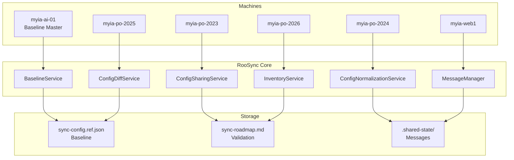
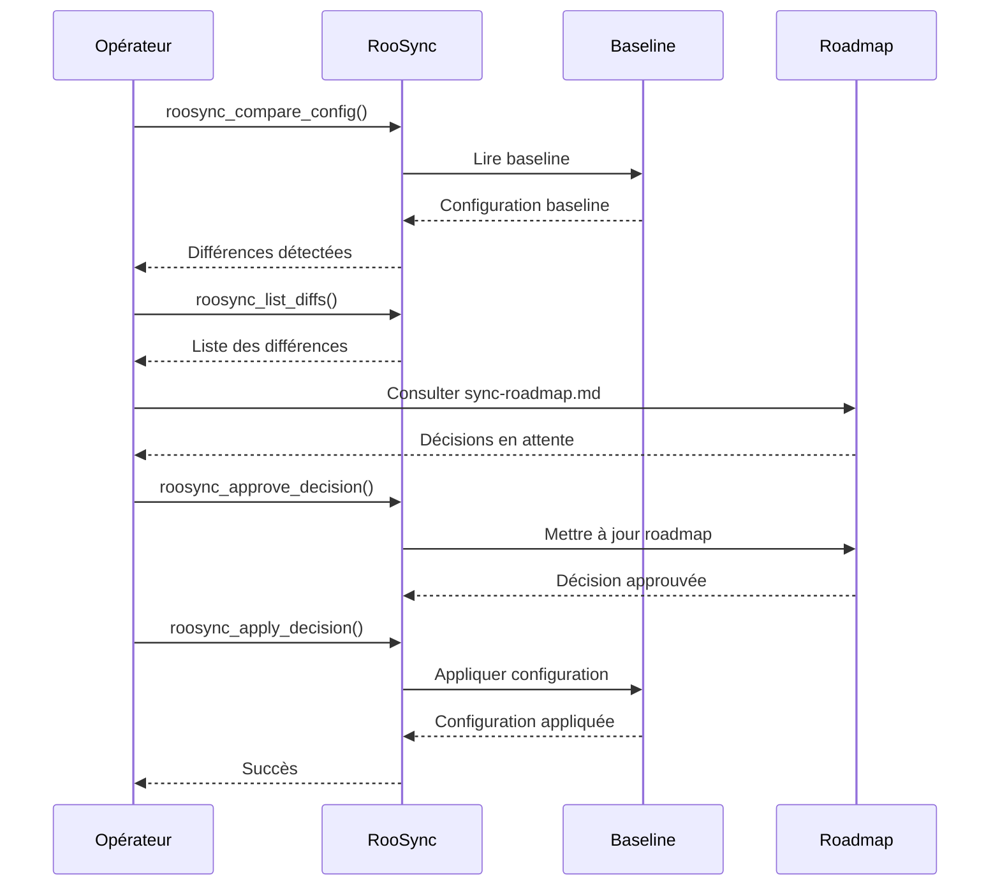
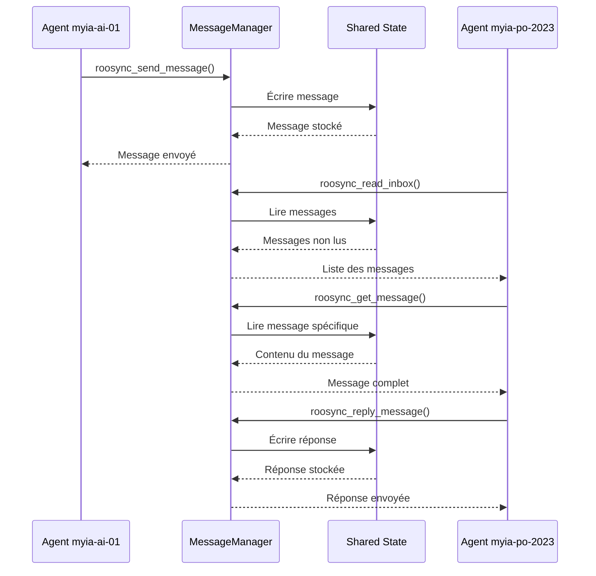
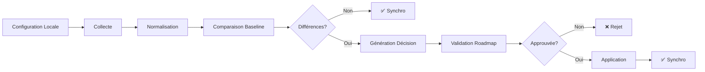

# RooSync - Système de Synchronisation Multi-Environnements

**Description** : Système de synchronisation et coordination multi-agents pour Roo
**Version actuelle** : 2.3 (voir [CHANGELOG-v2.3.md](CHANGELOG-v2.3.md))
**Date de dernière mise à jour** : 2026-01-10
**Statut** : 🟢 Production Ready

> **Note** : Ce document est le point d'entrée principal. Pour les transitions entre versions, voir la section [Historique et Évolutions](#6-historique-et-évolutions).

---

## 📋 Table des Matières

1. [Vue d'Ensemble](#1-vue-densemble)
2. [Démarrage Rapide](#2-démarrage-rapide)
3. [Guides par Audience](#3-guides-par-audience)
4. [Outils MCP RooSync](#4-outils-mcp-roosync)
5. [Architecture Technique](#5-architecture-technique)
6. [Historique et Évolutions](#6-historique-et-évolutions)
7. [Documentation Complémentaire](#7-documentation-complémentaire)
8. [Support et Contribution](#8-support-et-contribution)

---

## 1. Vue d'Ensemble

### Qu'est-ce que RooSync ?

RooSync est un système de synchronisation et coordination multi-environnements pour Roo, conçu pour gérer la configuration et la coordination entre plusieurs machines et agents. Il permet de maintenir une configuration cohérente à travers différents environnements tout en offrant des mécanismes de validation humaine pour garantir la sécurité des opérations.

### Objectifs Principaux

- **Synchronisation Baseline-Driven** : Utilisation d'une baseline unique (`sync-config.ref.json`) comme source de vérité
- **Coordination Multi-Agents** : Système de messagerie pour la communication entre agents sur différentes machines
- **Validation Humaine** : Workflow de validation via `sync-roadmap.md` pour toutes les opérations critiques
- **Gestion des Configurations** : Normalisation, diff et application des configurations multi-environnements
- **Sécurité** : Gestion des secrets, rollback automatique, et traçabilité complète

### Architecture de Haut Niveau



### Machines Supportées

| Machine | Rôle | OS | Statut |
|---------|------|-----|--------|
| myia-ai-01 | Coordinateur | Windows | 🟢 Actif |
| myia-po-2023 | Agent | Windows | 🟢 Actif |
| myia-po-2024 | Agent | Windows | 🟢 Actif |
| myia-po-2026 | Agent | Windows | 🟢 Actif |
| myia-web-01 | Agent | Windows | 🟢 Actif |

---

## 2. Démarrage Rapide

### Installation

#### Prérequis

- **Node.js** : v18+ (recommandé : v20 LTS)
- **PowerShell** : 7+ (recommandé : 7.4+)
- **Git** : 2.40+
- **VS Code** : avec extension Roo Code

#### Installation en 5 Minutes

```bash
# 1. Cloner le dépôt Roo
git clone https://github.com/your-org/roo-extensions.git
cd roo-extensions

# 2. Installer les dépendances
npm install

# 3. Construire le MCP roo-state-manager
cd mcps/internal/servers/roo-state-manager
npm run build
cd ../../..

# 4. Initialiser RooSync
# Via Roo Code MCP :
roosync_init { "force": false, "createRoadmap": true }
```

### Configuration Initiale

#### Variables d'Environnement

```bash
# Variables essentielles
export ROO_SYNC_BASELINE_PATH="d:/roo-extensions/sync-config.ref.json"
export ROO_SYNC_ROADMAP_PATH="d:/roo-extensions/sync-roadmap.md"
export ROO_SYNC_SHARED_STATE_PATH="d:/roo-extensions/.shared-state"
export ROO_SYNC_MACHINE_ID="myia-ai-01"  # Adapter à votre machine
```

#### Fichiers de Configuration

**`sync-config.ref.json`** (Baseline de référence) :
```json
{
  "version": "2.1.0",
  "baseline": {
    "modes": {
      "enabled": ["architect", "code", "debug", "ask", "orchestrator", "manager"]
    },
    "mcp": {
      "servers": {
        "quickfiles": { "enabled": true },
        "jinavigator": { "enabled": true },
        "searxng": { "enabled": true },
        "markitdown": { "enabled": true },
        "playwright": { "enabled": true },
        "roo-state-manager": { "enabled": true }
      }
    }
  }
}
```

### Première Synchronisation

```bash
# 1. Comparer la configuration locale avec la baseline
roosync_compare_config { "source": "local_machine", "target": "baseline_reference", "force_refresh": false }

# 2. Lister les différences
roosync_list_diffs { "filterType": "all" }

# 3. Consulter le roadmap pour les décisions
# Ouvrir sync-roadmap.md

# 4. Approuver et appliquer les décisions
roosync_approve_decision { "decisionId": "DECISION_ID" }
roosync_apply_decision { "decisionId": "DECISION_ID", "dryRun": false }
```

### Commandes Essentielles

| Commande | Description | Usage |
|----------|-------------|-------|
| `roosync_get_status` | Obtenir l'état de synchronisation | Monitoring quotidien |
| `roosync_compare_config` | Comparer les configurations | Avant synchronisation |
| `roosync_list_diffs` | Lister les différences | Audit de configuration |
| `roosync_collect_config` | Collecter la configuration locale | Publication de config |
| `roosync_publish_config` | Publier une configuration | Mise à jour baseline |
| `roosync_apply_config` | Appliquer une configuration | Synchronisation |
| `roosync_send_message` | Envoyer un message | Communication inter-agents |
| `roosync_read_inbox` | Lire les messages reçus | Communication inter-agents |

---

## 3. Guides par Audience

### 📘 Pour les Opérateurs

**Guide Opérationnel Unifié v2.1** : [`GUIDE-OPERATIONNEL-UNIFIE-v2.1.md`](GUIDE-OPERATIONNEL-UNIFIE-v2.1.md)

**Contenu** :
- Installation et configuration
- Opérations quotidiennes
- Dépannage et recovery
- Windows Task Scheduler
- Architecture Baseline-Driven
- Bonnes pratiques opérationnelles

**Public cible** : Utilisateurs, Opérateurs, Administrateurs système

---

### 📗 Pour les Développeurs

**Guide Développeur v2.1** : [`GUIDE-DEVELOPPEUR-v2.1.md`](GUIDE-DEVELOPPEUR-v2.1.md)

**Contenu** :
- Architecture technique détaillée
- API complète (TypeScript, PowerShell)
- Logger production-ready
- Tests unitaires et intégration
- Git Workflow et helpers
- Bonnes pratiques de développement

**Public cible** : Développeurs, Contributeurs, Testeurs

---

### 📙 Pour les Architectes

**Guide Technique v2.1** : [`GUIDE-TECHNIQUE-v2.1.md`](GUIDE-TECHNIQUE-v2.1.md)

**Contenu** :
- Architecture baseline-driven
- ROOSYNC AUTONOMOUS PROTOCOL (RAP)
- Système de messagerie
- Plan d'implémentation
- Roadmap et évolutions
- Métriques de convergence

**Public cible** : Architectes, Ingénieurs système, Experts techniques

---

## 4. Outils MCP RooSync

RooSync fournit **17 outils MCP** pour la synchronisation et la coordination multi-environnements.

### Liste des Outils

| # | Outil | Description | Phase Workflow |
|---|-------|-------------|----------------|
| 1 | `roosync_init` | Initialiser l'infrastructure RooSync | Setup |
| 2 | `roosync_get_status` | Obtenir l'état de synchronisation | Monitoring |
| 3 | `roosync_compare_config` | Comparer les configurations | Analyse |
| 4 | `roosync_list_diffs` | Lister les différences | Analyse |
| 5 | `roosync_approve_decision` | Approuver une décision de synchronisation | Validation |
| 6 | `roosync_reject_decision` | Rejeter une décision de synchronisation | Validation |
| 7 | `roosync_apply_decision` | Appliquer une décision approuvée | Exécution |
| 8 | `roosync_rollback_decision` | Annuler une décision appliquée | Recovery |
| 9 | `roosync_get_decision_details` | Obtenir les détails d'une décision | Audit |
| 10 | `roosync_update_baseline` | Mettre à jour la configuration baseline | Baseline |
| 11 | `roosync_version_baseline` | Versionner la baseline avec Git | Versioning |
| 12 | `roosync_restore_baseline` | Restaurer une baseline précédente | Recovery |
| 13 | `roosync_export_baseline` | Exporter la baseline (JSON, YAML, CSV) | Export |
| 14 | `roosync_collect_config` | Collecter la configuration locale | Collecte |
| 15 | `roosync_publish_config` | Publier une configuration partagée | Publication |
| 16 | `roosync_apply_config` | Appliquer une configuration partagée | Application |
| 17 | `roosync_get_machine_inventory` | Collecter l'inventaire machine | Inventaire |

### Cas d'Usage Typiques

#### Workflow de Synchronisation Basique



#### Workflow de Communication Multi-Agents



### ROOSYNC AUTONOMOUS PROTOCOL (RAP)

Le protocole RAP définit 4 verbes pour l'autonomie des agents :

| Verbe | Outil MCP | Description |
|-------|-----------|-------------|
| **OBSERVER** | `roosync_get_status` | Observer l'état du système |
| **SIGNALER** | `roosync_send_message` | Signaler un événement ou problème |
| **COMMUNIQUER** | `roosync_read_inbox` / `roosync_reply_message` | Communiquer avec d'autres agents |
| **AGIR** | `roosync_apply_decision` | Agir sur le système |

---

## 5. Architecture Technique

### Services Principaux

RooSync est organisé autour de 6 services principaux :

#### 1. BaselineService

**Responsabilité** : Gestion de la baseline de configuration

**Méthodes principales** :
- `getBaseline()` : Lire la baseline actuelle
- `updateBaseline(config)` : Mettre à jour la baseline
- `versionBaseline(version)` : Versionner la baseline
- `restoreBaseline(version)` : Restaurer une version
- `exportBaseline(format)` : Exporter la baseline

**Fichiers** :
- `sync-config.ref.json` : Baseline de référence
- `backups/baseline-*.json` : Sauvegardes

#### 2. ConfigSharingService

**Responsabilité** : Partage de configurations entre machines

**Méthodes principales** :
- `collectConfig(targets)` : Collecter la configuration locale
- `publishConfig(package, version, description)` : Publier un package
- `applyConfig(version, targets)` : Appliquer une configuration

**Fichiers** :
- `.shared-state/packages/` : Packages de configuration
- `.shared-state/versions/` : Métadonnées de version

#### 3. ConfigNormalizationService

**Responsabilité** : Normalisation des configurations multi-environnements

**Méthodes principales** :
- `normalizeConfig(config)` : Normaliser une configuration
- `applyCategoryRules(config)` : Appliquer les règles par catégorie
- `aggregateConfigs(sources)` : Agréger plusieurs configurations

**Fichiers** :
- `profiles/` : Profils de normalisation
- `config/normalization-rules.json` : Règles de normalisation

#### 4. ConfigDiffService

**Responsabilité** : Comparaison et diff de configurations

**Méthodes principales** :
- `compareConfigs(source, target)` : Comparer deux configurations
- `generateDiff(source, target)` : Générer un diff
- `applyDiff(config, diff)` : Appliquer un diff

**Fichiers** :
- `.shared-state/diffs/` : Diffs stockés

#### 5. InventoryService

**Responsabilité** : Inventaire des machines et configurations

**Méthodes principales** :
- `getMachineInventory(machineId)` : Obtenir l'inventaire d'une machine
- `getAllMachines()` : Lister toutes les machines
- `updateMachineInventory(machineId, inventory)` : Mettre à jour l'inventaire

**Fichiers** :
- `.shared-state/inventory/` : Inventaires des machines
- `cache/machine-inventory-*.json` : Cache TTL 1h

#### 6. MessageManager

**Responsabilité** : Système de messagerie inter-agents

**Méthodes principales** :
- `sendMessage(to, subject, body, priority)` : Envoyer un message
- `readInbox(status, limit)` : Lire la boîte de réception
- `getMessage(messageId)` : Obtenir un message
- `replyMessage(messageId, body)` : Répondre à un message
- `markMessageRead(messageId)` : Marquer comme lu
- `archiveMessage(messageId)` : Archiver un message

**Fichiers** :
- `.shared-state/messages/inbox/` : Messages reçus
- `.shared-state/messages/sent/` : Messages envoyés
- `.shared-state/messages/archive/` : Messages archivés

### Système de Messagerie

Le système de messagerie permet la communication entre agents sur différentes machines.

#### Structure d'un Message

```json
{
  "id": "msg-20251227-001",
  "from": "myia-ai-01",
  "to": "myia-po-2023",
  "subject": "Synchronisation requise",
  "body": "La baseline a été mise à jour. Veuillez synchroniser.",
  "priority": "HIGH",
  "status": "unread",
  "timestamp": "2025-12-27T03:00:00Z",
  "tags": ["sync", "baseline"],
  "thread_id": "thread-20251227-001"
}
```

#### Priorités des Messages

| Priorité | Description | Usage |
|----------|-------------|-------|
| LOW | Information non critique | Notifications, logs |
| MEDIUM | Information importante | Mises à jour, rapports |
| HIGH | Action requise | Synchronisations, alertes |
| URGENT | Action immédiate requise | Erreurs critiques, incidents |

### Gestion des Configurations

#### Stratégie Baseline-Driven

RooSync utilise une stratégie **baseline-driven** plutôt que machine-à-machine :

1. **Baseline Unique** : `sync-config.ref.json` est la source de vérité
2. **Validation Humaine** : Toutes les modifications passent par `sync-roadmap.md`
3. **Application Contrôlée** : Les décisions sont approuvées avant application
4. **Rollback Automatique** : Possibilité de revenir à une version précédente

#### Workflow de Synchronisation



### Stratégie de Synchronisation

#### Politique de Stockage

- **Code in Git** : Configuration et scripts versionnés
- **Data in Shared Drive** : Données d'exécution et messages
- **Baseline in Reference** : `sync-config.ref.json` comme source de vérité

#### Cycle de Synchronisation

1. **Observation** : `roosync_get_status()` pour observer l'état
2. **Collecte** : `roosync_collect_config()` pour collecter la config locale
3. **Comparaison** : `roosync_compare_config()` pour comparer avec la baseline
4. **Validation** : Consultation de `sync-roadmap.md` pour validation humaine
5. **Application** : `roosync_apply_decision()` pour appliquer les décisions
6. **Vérification** : `roosync_get_status()` pour vérifier le résultat

---

## 6. Versions et Transitions

### Vue d'Ensemble des Versions

RooSync a évolué à travers plusieurs versions, chacune avec un objectif spécifique :

| Version | Date | Type | Statut | Description |
|---------|------|------|--------|-------------|
| **v2.1** | 2025-12-27 | Architecture Baseline-Driven | 🟢 Production Ready | Architecture de base avec BaselineService |
| **v2.2** | 2025-12-27 | Publication de configuration | 🟢 Production Ready | Publication de configuration avec corrections WP4 |
| **v2.3** | 2025-12-27 | Consolidation majeure | 🟢 Production Ready | Consolidation de l'API (17 → 12 outils) |

**⚠️ Note importante :** v2.2 n'est PAS une nouvelle version de RooSync. C'est une **publication de configuration** basée sur l'architecture v2.1.

### Transitions Entre Versions

#### v2.1 → v2.2 : Publication de Configuration

**Type:** Publication de configuration (pas de changement d'architecture)

**Changements:**
- Publication de la configuration myia-po-2023 avec corrections WP4
- Aucun changement d'architecture ou d'API
- Basée sur l'architecture v2.1 existante

**Breaking Changes:** ❌ Aucun

**Migration requise:** ❌ Non requise (même architecture v2.1)

#### v2.2 → v2.3 : Consolidation Majeure

**Type:** Consolidation majeure de l'API (Breaking changes)

**Changements:**
- Consolidation de l'API RooSync (17 → 12 outils)
- Amélioration de la couverture de tests (+220%)
- Fusion de 5 outils obsolètes en 2 nouveaux outils consolidés

**Breaking Changes:** ✅ OUI - Breaking changes importants

**Migration requise:** ✅ OUI - Migration requise

**Outils affectés:**
| Outil v2.1/v2.2 | Remplacement v2.3 | Action requise |
|------------------|-------------------|----------------|
| `debug-dashboard` | `roosync_debug_reset` (target='dashboard') | Mettre à jour les appels |
| `reset-service` | `roosync_debug_reset` (target='service') | Mettre à jour les appels |
| `read-dashboard` | `roosync_get_status` (includeDetails=true) | Mettre à jour les appels |
| `version-baseline` | `roosync_manage_baseline` (action='version') | Mettre à jour les appels |
| `restore-baseline` | `roosync_manage_baseline` (action='restore') | Mettre à jour les appels |

#### v2.1 → v2.3 : Consolidation Directe

**Type:** Consolidation majeure (Breaking changes)

**Note importante:** La transition v2.1 → v2.3 est directe. v2.2 est une étape intermédiaire de publication de configuration qui ne nécessite pas de migration spécifique.

**Changements:**
- Mêmes changements que v2.2 → v2.3 (consolidation majeure)
- Migration directe de v2.1 vers v2.3 possible

**Breaking Changes:** ✅ OUI - Breaking changes importants

**Migration requise:** ✅ OUI - Migration requise

### Documentation des Versions

#### Documentation v2.1

| Document | Chemin | Statut |
|---------|--------|--------|
| README v2.1 | [`README.md`](README.md) | ✅ Complet |
| Guide Technique v2.1 | [`GUIDE-TECHNIQUE-v2.1.md`](GUIDE-TECHNIQUE-v2.1.md) | ✅ Complet |
| Guide Opérationnel v2.1 | [`GUIDE-OPERATIONNEL-UNIFIE-v2.1.md`](GUIDE-OPERATIONNEL-UNIFIE-v2.1.md) | ✅ Complet |
| Guide Développeur v2.1 | [`GUIDE-DEVELOPPEUR-v2.1.md`](GUIDE-DEVELOPPEUR-v2.1.md) | ✅ Complet |

#### Documentation v2.2

| Document | Chemin | Statut |
|---------|--------|--------|
| Changelog v2.2 | [`CHANGELOG-v2.2.md`](CHANGELOG-v2.2.md) | ✅ Complet |
| Document de Transition | [`TRANSITIONS_VERSIONS_V2.1_V2.2_V2.3.md`](TRANSITIONS_VERSIONS_V2.1_V2.2_V2.3.md) | ✅ Complet |

#### Documentation v2.3

| Document | Chemin | Statut |
|---------|--------|--------|
| Changelog v2.3 | [`CHANGELOG-v2.3.md`](CHANGELOG-v2.3.md) | ✅ Complet |
| Guide Technique v2.3 | [`GUIDE-TECHNIQUE-v2.3.md`](GUIDE-TECHNIQUE-v2.3.md) | ✅ Complet |
| Plan Migration v2.1→v2.3 | [`PLAN_MIGRATION_V2.1_V2.3.md`](PLAN_MIGRATION_V2.1_V2.3.md) | ✅ Complet |

### Guide de Migration

Pour migrer de v2.1 vers v2.3, consultez le guide détaillé :

**📄 Guide de Migration v2.1 → v2.3 :** [`PLAN_MIGRATION_V2.1_V2.3.md`](PLAN_MIGRATION_V2.1_V2.3.md)

**📄 Document de Transition :** [`TRANSITIONS_VERSIONS_V2.1_V2.2_V2.3.md`](TRANSITIONS_VERSIONS_V2.1_V2.2_V2.3.md)

---

## 7. Historique et Évolutions

### Versions RooSync

| Version | Date | Description | Changelog |
|---------|------|-------------|-----------|
| **v2.3** | 2026-01 | Consolidation API, coordination multi-agent | [CHANGELOG-v2.3.md](CHANGELOG-v2.3.md) |
| v2.2 | 2025-12 | Publication de configuration (corrections WP4) | - |
| v2.1 | 2025-12 | Architecture Baseline-Driven | [GUIDE-TECHNIQUE-v2.1.md](GUIDE-TECHNIQUE-v2.1.md) |

**Migration recommandée :** v2.1 → v2.3 (voir [PLAN_MIGRATION_V2.1_V2.3.md](PLAN_MIGRATION_V2.1_V2.3.md))

---

### Résumé des Cycles de Développement

#### Cycle 6 : Consolidation de la Documentation

**Période** : 2025-12-27

**Objectifs** :
- Consolidation de 13 documents pérennes en 3 guides unifiés
- Standardisation de la structure de documentation
- Amélioration de la navigabilité

**Résultats** :
- ✅ Création de 3 guides unifiés (Opérationnel, Développeur, Technique)
- ✅ Réduction de 77% du nombre de documents (13 → 3)
- ✅ Élimination des redondances (~20% → ~0%)
- ✅ Structure cohérente et liens croisés

**Documents créés** :
- [`GUIDE-OPERATIONNEL-UNIFIE-v2.1.md`](GUIDE-OPERATIONNEL-UNIFIE-v2.1.md)
- [`GUIDE-DEVELOPPEUR-v2.1.md`](GUIDE-DEVELOPPEUR-v2.1.md)
- [`GUIDE-TECHNIQUE-v2.1.md`](GUIDE-TECHNIQUE-v2.1.md)

#### Cycle 7 : Vérification et Corrections

**Période** : 2025-12-27

**Objectifs** :
- Vérification des guides contre le code source
- Correction des incohérences identifiées
- Mise à jour de la documentation

**Résultats** :
- ✅ 16 incohérences identifiées et corrigées
- ✅ Mise à jour des paramètres des outils MCP
- ✅ Correction de la liste des 17 outils
- ✅ Suppression des sections non implémentées

**Corrections effectuées** :
- 13 corrections dans le Guide Opérationnel
- 0 correction dans le Guide Développeur
- 3 corrections dans le Guide Technique

#### Cycle 8 : Diagnostic et Correction MCP

**Période** : 2025-12-27

**Objectifs** :
- Diagnostic de l'erreur de chargement des outils roo-state-manager
- Correction du problème de validation Zod
- Validation de la correction

**Résultats** :
- ✅ Identification de la cause racine (format JSON Schema manquant)
- ✅ Correction de l'outil `getMachineInventoryTool`
- ✅ Validation du build TypeScript
- ✅ Rétablissement du système de messagerie

**Documentation** :
- [`DEBUG_MCP_LOADING_2025-12-27.md`](DEBUG_MCP_LOADING_2025-12-27.md)

### Corrections Récentes (Tâche 18)

**Total des corrections** : 16/16 ✅

#### Guide Opérationnel (13 corrections)

1. `roosync_init` avec paramètres corrects
2. `roosync_compare_config` avec target correct
3. `roosync_get_decision_details` avec decisionId
4. `roosync_approve_decision` avec decisionId
5. `roosync_apply_decision` avec decisionId et dryRun
6. `roosync_collect_config` avec paramètres corrects
7. `roosync_publish_config` avec paramètres corrects
8. `roosync_list_decisions` remplacé
9. Outils de diagnostic remplacés
10. TaskSchedulerService remplacé
11. Liste des 17 outils MCP RooSync
12. ROOSYNC AUTONOMOUS PROTOCOL - Verbe OBSERVER
13. Section Windows Task Scheduler supprimée

#### Guide Technique (3 corrections)

1. Liste des 17 outils MCP RooSync
2. ROOSYNC AUTONOMOUS PROTOCOL - Verbe OBSERVER
3. Section Windows Task Scheduler supprimée

### Prochaines Étapes

#### Court Terme

- [ ] Mise à jour du README.md comme point d'entrée (Tâche 20 - En cours)
- [ ] Validation sémantique de la documentation
- [ ] Création de diagrammes Mermaid supplémentaires

#### Moyen Terme

- [ ] Intégration avec Windows Task Scheduler
- [ ] Automatisation des tests de documentation
- [ ] Création de tutoriels interactifs

#### Long Terme

- [ ] Interface web pour le monitoring
- [ ] Système d'alertes avancé
- [ ] Machine Learning pour la prédiction de problèmes

---

## 7. Documentation Complémentaire

### Fichiers de Consolidation

| Fichier | Description | Lien |
|---------|-------------|------|
| SUIVI_TRANSVERSE_ROOSYNC.md | Suivi transverse des évolutions RooSync | [`docs/suivi/RooSync/SUIVI_TRANSVERSE_ROOSYNC.md`](../suivi/RooSync/SUIVI_TRANSVERSE_ROOSYNC.md) |
| DEBUG_MCP_LOADING_2025-12-27.md | Diagnostic de l'erreur de chargement MCP | [`DEBUG_MCP_LOADING_2025-12-27.md`](DEBUG_MCP_LOADING_2025-12-27.md) |

### Rapports de Tests

| Rapport | Description | Lien |
|---------|-------------|------|
| test1-logger-report.md | Tests du Logger | [`tests/results/roosync/test1-logger-report.md`](../../tests/results/roosync/test1-logger-report.md) |
| test2-git-helpers-report.md | Tests des Git Helpers | [`tests/results/roosync/test2-git-helpers-report.md`](../../tests/results/roosync/test2-git-helpers-report.md) |
| test3-deployment-report.md | Tests de déploiement | [`tests/results/roosync/test3-deployment-report.md`](../../tests/results/roosync/test3-deployment-report.md) |
| test4-task-scheduler-report.md | Tests du Task Scheduler | [`tests/results/roosync/test4-task-scheduler-report.md`](../../tests/results/roosync/test4-task-scheduler-report.md) |
| validation-wp1-wp4.md | Validation des Work Packages 1-4 | [`tests/results/roosync/validation-wp1-wp4.md`](../../tests/results/roosync/validation-wp1-wp4.md) |

### Guides de Déploiement

Les guides de déploiement sont intégrés dans les guides unifiés :

- **Installation** : Voir [`GUIDE-OPERATIONNEL-UNIFIE-v2.1.md`](GUIDE-OPERATIONNEL-UNIFIE-v2.1.md) - Section "Installation"
- **Configuration** : Voir [`GUIDE-OPERATIONNEL-UNIFIE-v2.1.md`](GUIDE-OPERATIONNEL-UNIFIE-v2.1.md) - Section "Configuration"
- **Déploiement** : Voir [`GUIDE-DEVELOPPEUR-v2.1.md`](GUIDE-DEVELOPPEUR-v2.1.md) - Section "Deployment Helpers"

### Fichiers de Configuration

| Fichier | Description | Emplacement |
|---------|-------------|-------------|
| sync-config.ref.json | Baseline de référence | `d:/roo-extensions/sync-config.ref.json` |
| sync-roadmap.md | Roadmap de validation | `d:/roo-extensions/sync-roadmap.md` |
| mcp_settings.json | Configuration MCP | `c:/Users/MYIA/AppData/Roaming/Code/User/globalStorage/rooveterinaryinc.roo-cline/settings/mcp_settings.json` |

---

## 8. Support et Contribution

### Comment Signaler un Problème

Pour signaler un problème ou une anomalie :

1. **Vérifier la documentation** : Consulter les guides unifiés pour voir si le problème est documenté
2. **Utiliser les outils de diagnostic** :
   ```bash
   roosync_get_status
   roosync_compare_config { "source": "local_machine", "target": "baseline_reference" }
   roosync_list_diffs
   ```
3. **Consulter les logs** :
   - Logs RooSync : `.shared-state/logs/`
   - Logs système : Windows Event Log
4. **Créer un rapport** : Inclure les informations suivantes :
   - Description du problème
   - Étapes pour reproduire
   - Logs et messages d'erreur
   - Configuration de la machine

### Comment Contribuer

Pour contribuer à RooSync :

1. **Code** :
   - Forker le dépôt
   - Créer une branche pour votre contribution
   - Suivre les bonnes pratiques du [`GUIDE-DEVELOPPEUR-v2.1.md`](GUIDE-DEVELOPPEUR-v2.1.md)
   - Soumettre une Pull Request

2. **Documentation** :
   - Proposer des améliorations aux guides
   - Signaler les incohérences
   - Ajouter des exemples et cas d'usage

3. **Tests** :
   - Contribuer aux tests unitaires
   - Signaler les bugs de test
   - Proposer des scénarios de test

### Contacts

| Rôle | Contact | Responsabilité |
|------|---------|----------------|
| Architecte Lead | Roo Architect Mode | Architecture technique, roadmap |
| Développeur Lead | Roo Code Mode | Développement, API |
| Opérateur Lead | Roo Orchestrator Mode | Opérations, déploiement |
| Support | Roo Ask Mode | Documentation, support |

### Ressources

- **Documentation principale** : Ce README et les 3 guides unifiés
- **Suivi des évolutions** : [`docs/suivi/RooSync/SUIVI_TRANSVERSE_ROOSYNC.md`](../suivi/RooSync/SUIVI_TRANSVERSE_ROOSYNC.md)
- **Code source** : `mcps/internal/servers/roo-state-manager/src/tools/roosync/`
- **Tests** : `tests/results/roosync/`

---

## 📊 Métriques

### Documentation

| Métrique | Valeur |
|---------|--------|
| Guides unifiés | 3 |
| Documents consolidés | 13 |
| Sections totales | 50+ |
| Lignes de documentation | 6500+ |
| Outils MCP documentés | 17 |
| Machines supportées | 6 |

### Qualité

| Métrique | Valeur |
|---------|--------|
| Structure standardisée | ✅ Oui |
| Navigation facilitée | ✅ Oui |
| Liens croisés | ✅ Oui |
| Exemples de code | ✅ Complet |
| Dépannage | ✅ Complet |

---

## 📝 Licence

RooSync est publié sous licence MIT et fait partie du projet Roo Extensions.

---

**Dernière mise à jour** : 2026-01-10
**Version** : 2.3
**Statut** : 🟢 Production Ready
**Contributeurs** : Roo Architect Mode, Claude Code (myia-po-2024)
