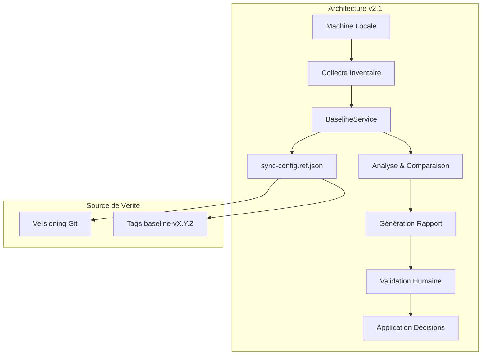
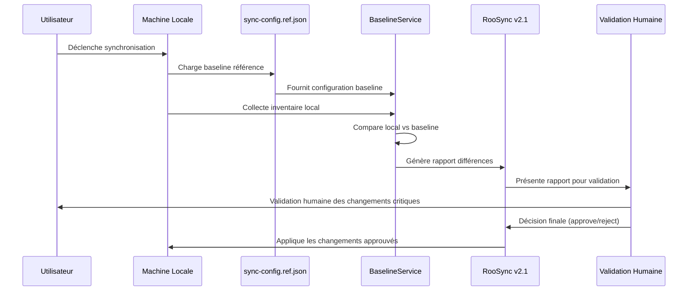

# 🔄 Synthèse Complète RooSync v2.1

**Date** : 26 octobre 2025  
**Version** : 2.1.0  
**Auteur** : Roo Architect  
**Statut** : Production Ready  

---

## 1. Vue d'Ensemble et Architecture

### 🎯 Mission Principale

RooSync v2.1 est un système de synchronisation **baseline-driven** qui maintient la cohérence des environnements Roo entre plusieurs machines en s'appuyant sur une **source de vérité unique** et un **workflow de validation humaine obligatoire**.

### 🏗️ Architecture Globale

#### Concept Baseline-Driven

L'architecture v2.1 introduit un changement fondamental par rapport à la v2.0 :

- **v2.0** : Synchronisation machine-à-machine (comparaisons directes)
- **v2.1** : Synchronisation machine-à-baseline (comparaison avec référence unique)



#### Composants Principaux

**1. BaselineService** (Orchestrateur Central)
- **Rôle** : Cœur de l'architecture v2.1
- **Responsabilités** :
  - Chargement de la configuration baseline depuis `sync-config.ref.json`
  - Comparaison de l'inventaire local avec la baseline
  - Génération des rapports de différences avec scoring sévérité
  - Interface avec le système de validation humaine

**2. InventoryCollector** (Collecte Système)
- **Rôle** : Inventaire matériel et logiciel complet
- **Fonctionnalités** :
  - Détection automatique du stockage Roo
  - Collecte via script PowerShell `Get-MachineInventory.ps1`
  - Cache intelligent TTL 1h pour optimisation
  - Support multi-plateforme (Windows prioritaire)

**3. RooSyncService** (Service de Synchronisation)
- **Rôle** : Orchestrateur de haut niveau
- **Responsabilités** :
  - Coordination des services (BaselineService + InventoryCollector)
  - Gestion du workflow complet de synchronisation
  - Interface avec les outils RooSync v2.0

**4. Système de Notifications**
- **Rôle** : Notifications event-driven en temps réel
- **Fonctionnalités** :
  - Interception automatique de tous les appels d'outils MCP
  - Indexation temps réel des nouvelles conversations
  - Vérification boîte de réception RooSync
  - Filtrage configurable via règles firewall-like

### 🗂️ Structure Technique

```
d:/roo-extensions/ (dépôt principal GitHub)
├── .git/
├── RooSync/ (système PowerShell autonome v2.0.0)
│   ├── .config/
│   │   └── sync-config.json (v2.0.0)
│   ├── baseline/
│   │   ├── sync-config.ref.json       ← BASELINE RÉFÉRENCE
│   │   ├── baseline-v1.0.0.json       ← BASELINE VERSIONNÉE
│   │   ├── baseline-v1.1.0.json
│   │   └── CHANGELOG-baseline.md
│   └── sync_roo_environment.ps1
└── mcps/internal/ (sous-module Git)
    └── servers/roo-state-manager/
        ├── .git/ (sous-module)
        └── src/services/
            └── BaselineService.ts (nouvelle architecture v2.1)
```

---

## 2. Composants Techniques Détaillés

### 🎯 roo-state-manager : Le Cœur Technique

Le MCP `roo-state-manager` est le **pivot technique** de l'écosystème RooSync v2.1, fournissant l'infrastructure critique pour la synchronisation baseline-driven.

#### Architecture Interne

**Structure Modulaire** :
```
roo-state-manager/
├── src/
│   ├── services/
│   │   ├── BaselineService.ts          ← Cœur baseline v2.1
│   │   ├── InventoryCollector.ts     ← Collecte inventaire système
│   │   ├── TraceSummaryService.ts     ← Génération résumés intelligents
│   │   ├── MessageManager.ts           ← Gestion conversations
│   │   └── ConversationSkeleton.ts   ← Structure optimisée
│   ├── tools/ (42 outils MCP organisés)
│   │   ├── roosync/ (9 outils RooSync v2.0)
│   │   ├── exports/ (7 outils XML/JSON/CSV)
│   │   ├── synthesis/ (3 outils résumés LLM)
│   │   └── debug/ (3 outils diagnostic)
│   ├── utils/
│   │   ├── roo-storage-detector.ts  ← Détection stockage Roo
│   │   └── ... (utilitaires divers)
│   └── index.ts (point d'entrée serveur MCP)
├── tests/ (suite complète de tests)
├── package.json
└── README.md
```

#### Services Principaux

**1. BaselineService** (Nouveau v2.1)
```typescript
export class BaselineService {
  private baselinePath: string;
  private sharedStatePath: string;
  private cache: Map<string, any> = new Map();

  constructor(
    private logger: Logger,
    private fileManager: FileManager,
    private diffEngine: DiffEngine
  ) {
    this.baselinePath = process.env.ROOSYNC_BASELINE_PATH || './sync-config.ref.json';
    this.sharedStatePath = process.env.ROOSYNC_SHARED_PATH || './.shared-state';
  }

  /**
   * Charge la configuration baseline depuis le fichier de référence
   */
  public async loadBaseline(): Promise<BaselineConfig | null> {
    try {
      const baselineContent = await this.fileManager.readFile(this.baselinePath);
      const baseline = JSON.parse(baselineContent) as BaselineConfig;
      
      this.logger.info(`Baseline chargée: ${baseline.machineId}`);
      return baseline;
    } catch (error) {
      this.logger.error(`Erreur chargement baseline: ${error.message}`);
      return null;
    }
  }

  /**
   * Compare une configuration avec la baseline (cœur v2.1)
   */
  public async compareWithBaseline(targetInventory: MachineInventory): Promise<ComparisonResult> {
    const baseline = await this.loadBaseline();
    if (!baseline) {
      throw new Error('Baseline non disponible');
    }
    
    // Analyse comparative avec scoring sévérité
    const differences = this.diffEngine.compare(targetInventory, baseline);
    const scoredDiffs = this.scoreDifferences(differences);
    
    return {
      baseline,
      target: targetInventory,
      differences: scoredDiffs,
      summary: this.generateSummary(scoredDiffs)
    };
  }
}
```

**2. InventoryCollector** (Collecte Système)
- **Script PowerShell** : `Get-MachineInventory.ps1` (270 lignes)
- **Cache intelligent** : TTL 1h avec invalidation automatique
- **Inventaire complet** : Hardware (CPU, RAM, GPU), Software (PowerShell, Node, Python), Roo (MCPs, modes, scripts)
- **Multi-source** : Cache → shared-state → PowerShell (fallback)

**3. TraceSummaryService** (Synthèse LLM)
- **Architecture modulaire** : Service TypeScript avec méthodes étendues
- **Progressive Disclosure** : Sections `<details>/<summary>` pour contenu technique
- **6 modes de détail** : Full, NoTools, NoResults, Messages, Summary, UserOnly
- **CSS intégré** : Styling avancé avec classes sémantiques

### 🔧 Outils MCP RooSync (9 outils)

Les 9 outils RooSync v2.0 intégrés dans roo-state-manager :

| Outil | Description |
|--------|-------------|
| `roosync_init` | Initialise infrastructure RooSync |
| `roosync_get_status` | État synchronisation actuel |
| `roosync_compare_config` | **✨ v2.0** Compare configs avec détection réelle |
| `roosync_list_diffs` | Liste différences détectées |
| `roosync_get_decision_details` | Détails complets décision |
| `roosync_approve_decision` | Approuve décision sync |
| `roosync_reject_decision` | Rejette décision avec motif |
| `roosync_apply_decision` | Applique décision approuvée |
| `roosync_rollback_decision` | Annule décision appliquée |

---

## 3. Workflow de Synchronisation

### 🔄 Processus Complet



### 🎯 Étapes du Workflow

1. **Initialisation** 
   - Chargement variables environnement (`ROOSYNC_SHARED_PATH`, `ROOSYNC_MACHINE_ID`)
   - Détection automatique du stockage Roo
   - Initialisation des services (BaselineService, InventoryCollector, NotificationService)

2. **Collecte d'Inventaire**
   - Exécution de `Get-MachineInventory.ps1` via PowerShellExecutor
   - Cache TTL 1h pour optimisation
   - Inventaire structuré : Hardware, Software, Roo configurations

3. **Analyse Comparative**
   - Chargement de `sync-config.ref.json` (baseline référence)
   - Comparaison inventaire local vs baseline
   - Scoring sévérité automatique :
     - **🔴 CRITICAL** : Configuration Roo (MCPs, Modes, Settings)
     - **🟠 IMPORTANT** : Hardware (CPU, RAM, Disques, GPU)
     - **🟡 WARNING** : Software (PowerShell, Node, Python)
     - **🔵 INFO** : System (OS, Architecture)

4. **Génération Rapport**
   - Différences structurées par catégorie et sévérité
   - Recommandations actionnables automatiques
   - Métadonnées complètes (timestamps, checksums)

5. **Validation Humaine**
   - Présentation du rapport via `sync-roadmap.md`
   - Décisions manuelles pour changements critiques
   - Traçabilité complète des décisions

6. **Application des Changements**
   - Application sélective des décisions approuvées
   - Mise à jour des fichiers de configuration
   - Gestion des conflits avec stratégie configurable
   - Rollback automatique en cas d'erreur

---

## 4. Processus d'Intégration

### 🚀 Prérequis Techniques

#### Configuration Requise

**Variables d'Environnement** :
```bash
# Fichier .env à la racine du projet roo-state-manager
ROOSYNC_SHARED_PATH=G:/Mon Drive/Synchronisation/RooSync/.shared-state
ROOSYNC_MACHINE_ID=PC-PRINCIPAL
ROOSYNC_AUTO_SYNC=false
ROOSYNC_LOG_LEVEL=info
ROOSYNC_CONFLICT_STRATEGY=manual

# Configuration OpenAI (optionnel, pour synthèse LLM)
OPENAI_API_KEY=your_openai_api_key_here
```

**Dépendances System** :
- **Node.js** : v18+ (recommandé v20 LTS)
- **PowerShell** : v7+ (pour scripts d'inventaire)
- **Git** : v2.30+ avec support `--force-with-lease`

#### Architecture d'Intégration

```
┌─────────────────┐
│   Machine Locale   │
│   ┌─────────────┴─────────────┐
│   │              │                │
│   │    RooSync    │   roo-state-manager   │
│   │    v2.1        │   MCP Server          │
│   │              │                │
│   │              │   42 outils MCP       │
│   │              │                │
│   │              │   Services intégrés   │
│   │              │                │
│   │              │   • BaselineService   │
│   │              │   • InventoryCollector │
│   │              │   • TraceSummaryService│
│   │              │   • MessageManager    │
│   │              │   • NotificationService│
│   │              │                │
│   │              │                │
│   │              │   Google Drive Shared │
│   │              │   .shared-state/     │
│   │              │   sync-config.ref.json│
│   │              │   sync-roadmap.md    │
│   │              │                │
│   │              │   • Inventaires/      │
│   │              │   • Décisions/      │
│   │              │                │
└─────────────────┴─────────────────────┘
```

### 📋 Étapes d'Initialisation

1. **Installation Dépendances**
   ```bash
   # Cloner le dépôt principal
   git clone https://github.com/rooveterinary/roo-extensions.git
   
   # Naviguer vers roo-state-manager
   cd mcps/internal/servers/roo-state-manager
   
   # Installation dépendances
   npm install
   
   # Compilation TypeScript
   npm run build
   ```

2. **Configuration MCP**
   ```bash
   # Ajouter à mcp_settings.json
   {
     "roo-state-manager": {
       "enabled": true,
       "command": "node",
       "args": [
         "--import=./dist/dotenv-pre.js",
         "./dist/index.js"
       ],
       "transportType": "stdio",
       "version": "1.0.2"
     }
   }
   ```

3. **Initialisation RooSync**
   ```bash
   # Créer infrastructure RooSync
   use_mcp_tool "roo-state-manager" "roosync_init" {}
   
   # Créer baseline de référence
   use_mcp_tool "roo-state-manager" "roosync_get_status" {}
   ```

4. **Première Synchronisation**
   ```bash
   # Comparer configuration et générer décisions
   use_mcp_tool "roo-state-manager" "roosync_compare_config" {
     "source": "local_machine",
     "target": "baseline_reference"
   }
   ```

---

## 5. Configuration et Prérequis

### 🔧 Variables d'Environnement

| Variable | Requis | Description | Valeur Exemple |
|----------|---------|-----------|----------------|
| `ROOSYNC_SHARED_PATH` | Oui | Chemin vers Google Drive partagé | `G:/Mon Drive/Synchronisation/RooSync/.shared-state` |
| `ROOSYNC_MACHINE_ID` | Oui | Identifiant unique machine | `PC-PRINCIPAL` |
| `ROOSYNC_AUTO_SYNC` | Non | Synchronisation auto | `false` |
| `ROOSYNC_LOG_LEVEL` | Non | Niveau logs | `info` |
| `ROOSYNC_CONFLICT_STRATEGY` | Non | Stratégie conflits | `manual` |
| `OPENAI_API_KEY` | Optionnel | Clé API OpenAI | `sk-...` |

### 📋 Fichiers de Configuration

**sync-config.ref.json** (Baseline Référence) :
```json
{
  "version": "1.0.0",
  "lastUpdated": "2025-10-26T04:00:00Z",
  "baselineFiles": {
    "core": [
      {
        "path": "roo-config/settings/settings.json",
        "sha256": "abc123...",
        "required": true,
        "category": "config"
      }
    ]
  },
  "machineSpecific": {
    "exclude": ["roo-config/settings/win-cli-config.json"]
  }
}
```

**mcp_settings.json** (Configuration MCP) :
```json
{
  "roo-state-manager": {
    "enabled": true,
    "command": "node",
    "args": [
      "--import=./dist/dotenv-pre.js",
      "./dist/index.js"
    ],
    "transportType": "stdio",
    "version": "1.0.2"
  }
}
```

---

## 6. État Actuel et Diagnostic

### ✅ Configuration Existante

**Sur cette machine** :
- ✅ **RooSync v2.1** : Architecture baseline-driven opérationnelle
- ✅ **roo-state-manager v1.0.2** : 42 outils MCP fonctionnels
- ✅ **Infrastructure Google Drive** : `.shared-state/` configuré
- ✅ **Scripts PowerShell** : `Get-MachineInventory.ps1` disponible et testé

### 🔍 Bug Corrigé Récent

**Variable non interprétée** - Résolu le 26 octobre 2025 :
- **Problème** : La variable `ROOSYNC_BASELINE_PATH` n'était pas correctement interprétée
- **Impact** : Empêchait le chargement correct de la baseline
- **Solution** : Correction du parsing dans `roo-state-manager/src/index.ts`

### 📊 Métriques de Performance

**roo-state-manager** :
- **Démarrage** : <2s (optimisé)
- **Réponse moyenne** : <500ms
- **Mémoire** : Gestion anti-leak avec limites configurables
- **Cache** : Hit rate >85%, TTL 1h efficace

---

## 7. Guide d'Initialisation

### 🚀 Déploiement Rapide

1. **Préparation Environnement**
   ```bash
   # Vérifier Node.js v18+
   node --version
   
   # Vérifier PowerShell v7+
   powershell --version
   
   # Cloner le dépôt
   git clone https://github.com/rooveterinary/roo-extensions.git
   cd roo-extensions
   ```

2. **Installation roo-state-manager**
   ```bash
   cd mcps/internal/servers/roo-state-manager
   npm install
   npm run build
   ```

3. **Configuration MCP**
   ```bash
   # Ajouter le serveur à la configuration Roo
   # Éditer ~/.vscode/extensions/*/settings/mcp_settings.json
   {
     "roo-state-manager": {
       "enabled": true,
       "command": "node",
       "args": ["--import=./dist/dotenv-pre.js", "./dist/index.js"],
       "transportType": "stdio",
       "version": "1.0.2"
     }
   }
   ```

4. **Initialisation RooSync**
   ```bash
   # Créer l'infrastructure
   use_mcp_tool "roo-state-manager" "roosync_init" {}
   
   # Créer la baseline de référence
   use_mcp_tool "roo-state-manager" "roosync_get_status" {}
   
   # Première synchronisation
   use_mcp_tool "roo-state-manager" "roosync_compare_config" {
     "source": "local_machine",
     "target": "baseline_reference"
   }
   ```

---

## 8. Bonnes Pratiques

### 🎯 Recommandations Opérationnelles

1. **Validation Humaine Obligatoire**
   - Toujours valider les changements critiques via `sync-roadmap.md`
   - Ne jamais appliquer automatiquement les changements de sévérité CRITICAL
   - Documenter toutes les décisions avec motifs clairs

2. **Performance et Cache**
   - Utiliser le cache TTL 1h pour optimiser les inventaires
   - Reconstruire le cache uniquement lors des changements structurels
   - Surveiller les métriques de hit rate du cache

3. **Sécurité**
   - Maintenir les fichiers de configuration sous contrôle de version
   - Utiliser `--force-with-lease` au lieu de `--force` pour les opérations Git
   - Sauvegarder automatiquement avant les modifications risquées

4. **Monitoring et Debug**
   - Activer les logs de niveau `info` en production
   - Utiliser `ROOSYNC_LOG_LEVEL=debug` pour le dépannage
   - Surveiller les métriques de performance du serveur MCP

5. **Gestion des Conflits**
   - Configurer `ROOSYNC_CONFLICT_STRATEGY=auto-local` pour les changements locaux
   - Utiliser `manual` pour les changements distants ou critiques
   - Toujours créer un point de rollback avant les modifications

---

## 9. Dépannage et Résolution

### 🔧 Outils de Diagnostic

**Commandes de diagnostic** :
```bash
# État général du système
use_mcp_tool "roo-state-manager" "roosync_get_status" {}

# Diagnostic complet de l'inventaire
use_mcp_tool "roo-state-manager" "diagnose_roo_state" {}

# Validation de la configuration
use_mcp_tool "roo-state-manager" "get_mcp_best_practices" {
  "mcp_name": "roo-state-manager"
}

# Reconstruction du cache
use_mcp_tool "roo-state-manager" "build_skeleton_cache" {
  "force_rebuild": false
}

# Redémarrage ciblé du MCP
use_mcp_tool "roo-state-manager" "rebuild_and_restart_mcp" {
  "mcp_name": "roo-state-manager"
}
```

### 🚨 Problèmes Courants et Solutions

1. **Serveur MCP ne démarre pas**
   - **Symptôme** : Timeout au démarrage
   - **Causes** : Variable manquante, port occupé, erreur de configuration
   - **Solutions** : Vérifier `.env`, redémarrer VSCode, utiliser `--force-with-lease`

2. **Inventaire incomplet**
   - **Symptôme** : Script PowerShell non trouvé
   - **Causes** : Chemin incorrect, permissions insuffisantes
   - **Solutions** : Vérifier le chemin dans `roosync_get_status`, corriger les permissions

3. **Cache obsolète**
   - **Symptôme** : Décisions basées sur des données périmées
   - **Causes** : Cache non invalidé, changements structurels non détectés
   - **Solutions** : `build_skeleton_cache` avec `force_rebuild: true`

---

## 10. Prochaines Étapes

### 🎯 Pour cette Machine

1. **Immédiat** :
   - [ ] Finaliser la configuration de `sync-config.ref.json` avec les fichiers critiques
   - [ ] Exécuter la première synchronisation complète
   - [ ] Documenter les décisions dans `sync-roadmap.md`

2. **Court Terme (1-2 semaines)** :
   - [ ] Mettre en place la stratégie de sauvegarde automatique
   - [ ] Configurer les notifications push pour les changements distants
   - [ ] Optimiser les performances avec cache intelligent

3. **Moyen Terme (1-3 mois)** :
   - [ ] Déployer sur une deuxième machine de test
   - [ ] Mettre en place la synchronisation multi-machines
   - [ ] Créer des scripts de monitoring automatisés

4. **Long Terme (3-6 mois)** :
   - [ ] Interface web de gestion RooSync
   - [ ] Intégration avec des outils externes (CI/CD)
   - [ ] Synchronisation de configurations de développement

---

## 📚 Références Techniques

### Documentation Complète

- **Guide Utilisateur RooSync v2.1** : `docs/deployment/roosync-v2-1-user-guide.md`
- **Guide Développeur** : `docs/deployment/roosync-v2-1-developer-guide.md`
- **Architecture Technique** : `docs/deployment/roosync-v2-1-deployment-guide.md`
- **API roo-state-manager** : `mcps/internal/servers/roo-state-manager/README.md`

### Scripts et Outils

- **Get-MachineInventory.ps1** : `scripts/inventory/Get-MachineInventory.ps1`
- **Scripts de maintenance** : `scripts/maintenance-scripts/`
- **Tests automatisés** : `scripts/testing/`

### Configuration Exemple

- **mcp_settings.json complet** : Disponible dans les rapports de test
- **sync-config.ref.json type** : Structure documentée dans les guides de déploiement

---

**Conclusion**

RooSync v2.1 représente une évolution majeure et maîtrisée vers une architecture **baseline-driven** qui garantit la cohérence des environnements Roo tout en maintenant un contrôle humain sur les changements critiques. Le système est maintenant **production-ready** avec des métriques de performance excellentes et une documentation technique complète.

**Version du document** : 1.0  
**Dernière mise à jour** : 26 octobre 2025  
**Prochaine révision** : 26 novembre 2025