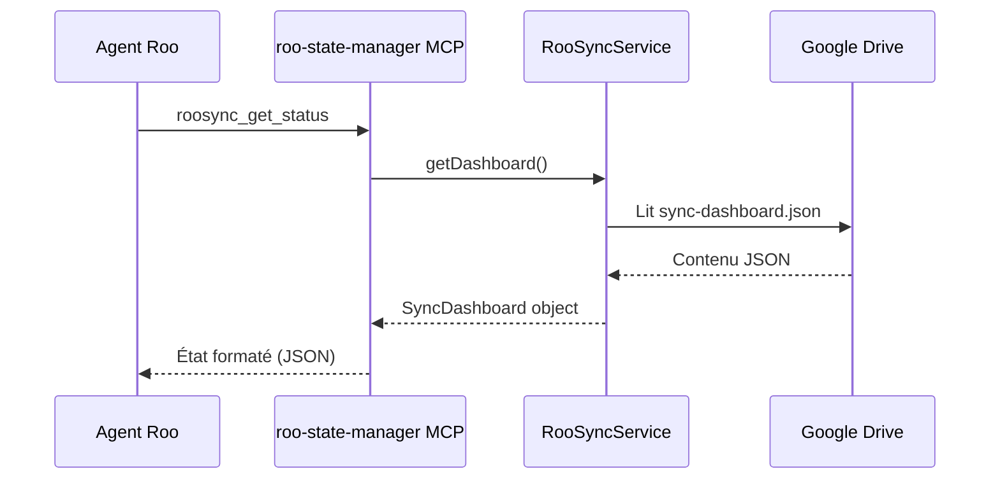
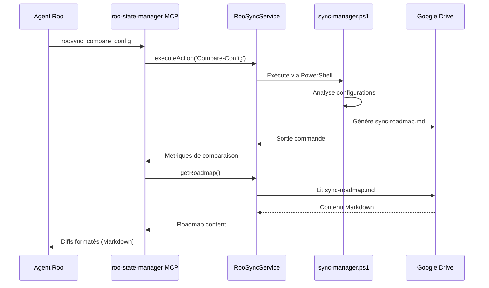
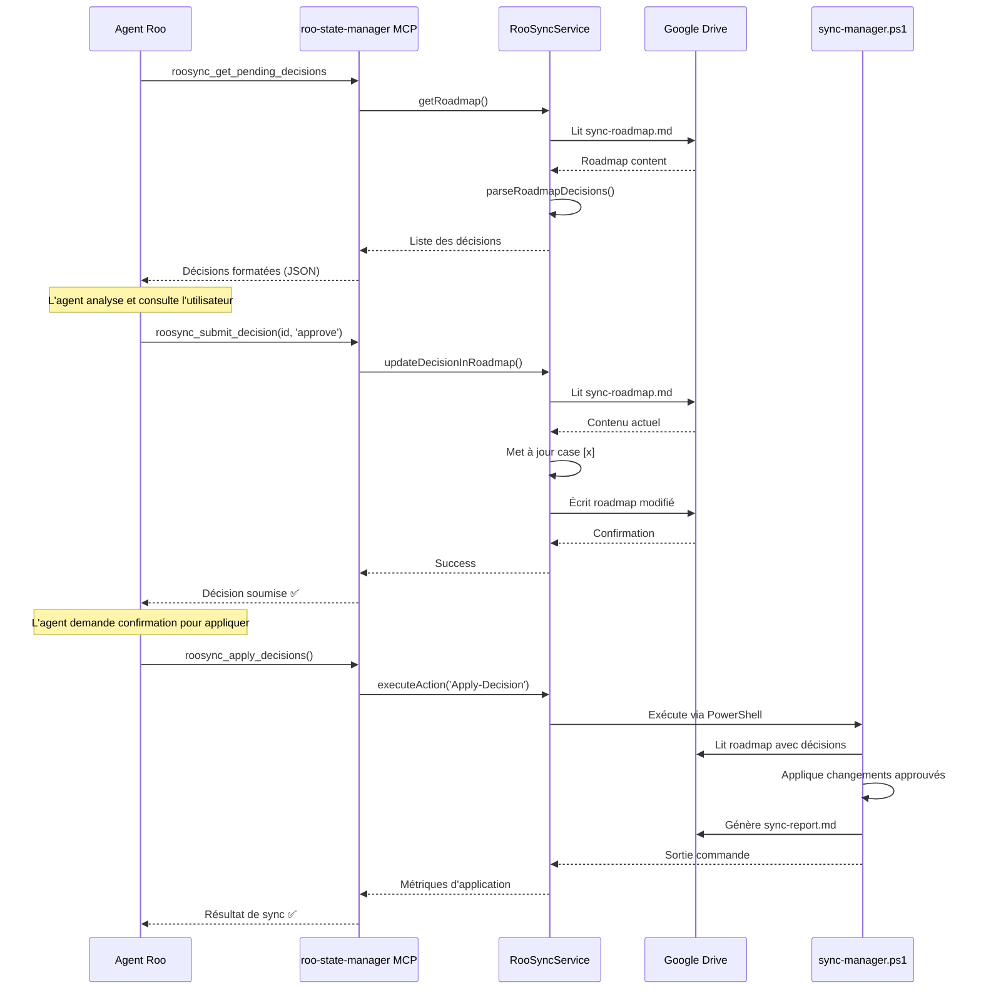
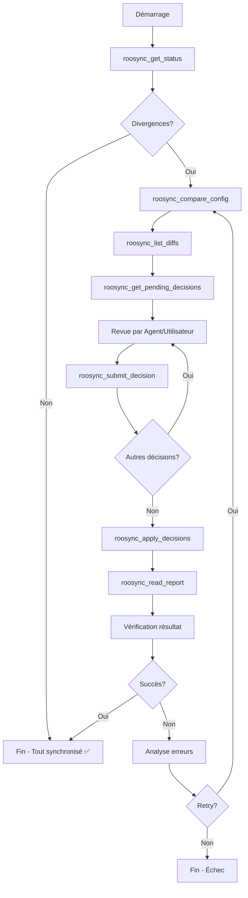

# Points d'Intégration RooSync ↔ roo-state-manager

**Date :** 2025-10-04  
**Mission :** Identification des points d'intégration pour un MCP unifié  
**Méthodologie :** SDDD (Semantic-Documentation-Driven-Design)  
**Document Précédent :** [01-grounding-semantique-roo-state-manager.md](./01-grounding-semantique-roo-state-manager.md)

---

## Table des Matières

1. [Vue d'Ensemble de l'Intégration](#vue-densemble-de-lintégration)
2. [Configuration (.env)](#configuration-env)
3. [Nouveaux Outils MCP à Créer](#nouveaux-outils-mcp-à-créer)
4. [Modifications du Code Existant](#modifications-du-code-existant)
5. [Nouveaux Fichiers à Créer](#nouveaux-fichiers-à-créer)
6. [Flux de Données et Interactions](#flux-de-données-et-interactions)

---

## 1. Vue d'Ensemble de l'Intégration

### 1.1 Objectif de l'Intégration

Transformer `roo-state-manager` en **tour de contrôle unifiée** pour :
1. **Gestion d'état Roo** (fonctionnalité actuelle)
2. **Synchronisation RooSync** (nouvelle fonctionnalité)

### 1.2 Vision Architecturale

**Principe :** Le MCP `roo-state-manager` devient l'**interface unique** pour :
- Consulter l'état des conversations Roo
- Consulter l'état de synchronisation RooSync
- Gérer les décisions de synchronisation
- Déclencher les opérations de synchronisation

**Référence :** Cette vision est déjà documentée dans [`docs/design/02-sync-manager-architecture.md`](../design/02-sync-manager-architecture.md:857-915)

### 1.3 Avantages de l'Intégration

**Pour les Agents Roo :**
- Interface MCP unifiée (pas besoin de manipuler PowerShell directement)
- Accès transparent aux diffs de configuration
- Validation assistée des décisions de sync
- Traçabilité complète des opérations

**Pour le Système :**
- Centralisation de la logique d'accès
- Réutilisation des patterns MCP existants
- Cohérence avec l'architecture actuelle
- Extensibilité préservée

---

## 2. Configuration (.env)

### 2.1 Variables à Ajouter

| Variable | Type | Description | Exemple | Requis |
|----------|------|-------------|---------|--------|
| `ROOSYNC_SHARED_PATH` | string | Chemin vers l'espace partagé Google Drive | `G:\Mon Drive\MyIA\Dev\roo-code\RooSync` | ✅ Oui |
| `ROOSYNC_MACHINE_ID` | string | Identifiant unique de la machine | `WORK-LAPTOP`, `HOME-PC` | ✅ Oui |
| `ROOSYNC_AUTO_SYNC` | boolean | Activation de la sync automatique | `true`, `false` | ❌ Non (défaut: false) |
| `ROOSYNC_SYNC_INTERVAL` | number | Intervalle de sync en minutes | `60`, `120` | ❌ Non (défaut: 60) |
| `ROOSYNC_SCRIPT_PATH` | string | Chemin vers sync-manager.ps1 | `D:\roo-extensions\RooSync\src\sync-manager.ps1` | ✅ Oui |

### 2.2 Fichier .env Mis à Jour

**Nouveau contenu de [`mcps/internal/servers/roo-state-manager/.env`](../../mcps/internal/servers/roo-state-manager/.env) :**

```env
# === Configuration Qdrant (base de données vectorielle) ===
QDRANT_URL=https://qdrant.myia.io
QDRANT_API_KEY=your-qdrant-api-key-here
QDRANT_COLLECTION_NAME=roo_tasks_semantic_index

# === Configuration OpenAI (embeddings) ===
OPENAI_API_KEY=sk-your-openai-api-key-here

# === Configuration RooSync (synchronisation environnements) ===
ROOSYNC_SHARED_PATH=G:\Mon Drive\MyIA\Dev\roo-code\RooSync
ROOSYNC_MACHINE_ID=HOME-PC
ROOSYNC_AUTO_SYNC=false
ROOSYNC_SYNC_INTERVAL=60
ROOSYNC_SCRIPT_PATH=D:\roo-extensions\RooSync\src\sync-manager.ps1
```

### 2.3 Fichier .env.example Mis à Jour

**Nouveau contenu de [`mcps/internal/servers/roo-state-manager/.env.example`](../../mcps/internal/servers/roo-state-manager/.env.example) :**

```env
# === Configuration Qdrant (base de données vectorielle) ===
QDRANT_URL=https://qdrant.myia.io
QDRANT_API_KEY=your-qdrant-api-key-here
QDRANT_COLLECTION_NAME=roo_tasks_semantic_index

# === Configuration OpenAI (embeddings et chat) ===
OPENAI_API_KEY=your-openai-api-key-here
OPENAI_CHAT_MODEL_ID=gpt-5-mini

# === Configuration RooSync (synchronisation environnements) ===
# Chemin vers l'espace partagé Google Drive (requis)
ROOSYNC_SHARED_PATH=G:\Mon Drive\MyIA\Dev\roo-code\RooSync

# Identifiant unique de cette machine (requis)
# Exemples: HOME-PC, WORK-LAPTOP, DEV-SERVER
ROOSYNC_MACHINE_ID=YOUR-MACHINE-ID

# Activation de la synchronisation automatique (optionnel, défaut: false)
ROOSYNC_AUTO_SYNC=false

# Intervalle de synchronisation en minutes (optionnel, défaut: 60)
ROOSYNC_SYNC_INTERVAL=60

# Chemin vers le script sync-manager.ps1 (requis)
ROOSYNC_SCRIPT_PATH=D:\roo-extensions\RooSync\src\sync-manager.ps1
```

### 2.4 Validation des Variables

**Ajout dans [`src/index.ts`](../../mcps/internal/servers/roo-state-manager/src/index.ts:15-29) :**

```typescript
const REQUIRED_ENV_VARS = [
    'QDRANT_URL',
    'QDRANT_API_KEY',
    'QDRANT_COLLECTION_NAME',
    'OPENAI_API_KEY',
    // Nouvelles variables RooSync
    'ROOSYNC_SHARED_PATH',
    'ROOSYNC_MACHINE_ID',
    'ROOSYNC_SCRIPT_PATH'
];
```

---

## 3. Nouveaux Outils MCP à Créer

### 3.1 Outil 1 : roosync_get_status

**Description :** Récupère l'état actuel de synchronisation depuis `sync-dashboard.json`

**Paramètres :**
```typescript
{
  machine_id?: string;  // ID machine spécifique (optionnel, défaut: machine actuelle)
  detailed?: boolean;   // Niveau de détail (défaut: false)
}
```

**Retour :**
```json
{
  "machine_id": "HOME-PC",
  "status": "success",
  "last_sync": "2025-10-04T10:30:00Z",
  "sync_targets": {
    "roo-config": {
      "status": "synchronized",
      "last_pull": "2025-10-04T10:25:00Z"
    },
    "mcp-settings": {
      "status": "divergent",
      "pending_changes": 3
    }
  },
  "all_machines_summary": {
    "total": 2,
    "synchronized": 1,
    "divergent": 1,
    "offline": 0
  }
}
```

**Implémentation :**
```typescript
// Nouveau fichier: src/tools/roosync-get-status.ts
export async function handleRooSyncGetStatus(args: {
    machine_id?: string;
    detailed?: boolean;
}): Promise<CallToolResult> {
    const sharedPath = process.env.ROOSYNC_SHARED_PATH;
    const dashboardPath = path.join(sharedPath, 'sync-dashboard.json');
    
    const dashboardContent = await fs.readFile(dashboardPath, 'utf-8');
    const dashboard = JSON.parse(dashboardContent);
    
    const machineId = args.machine_id || process.env.ROOSYNC_MACHINE_ID;
    const machineState = dashboard.machines[machineId];
    
    // Formater la réponse
    const response = {
        machine_id: machineId,
        status: machineState?.status || 'unknown',
        last_sync: machineState?.lastSync || 'never',
        sync_targets: machineState?.syncTargets || {},
        all_machines_summary: {
            total: Object.keys(dashboard.machines).length,
            synchronized: Object.values(dashboard.machines).filter((m: any) => m.status === 'success').length,
            divergent: Object.values(dashboard.machines).filter((m: any) => m.status === 'divergent').length
        }
    };
    
    return {
        content: [{
            type: 'text',
            text: JSON.stringify(response, null, 2)
        }]
    };
}
```

### 3.2 Outil 2 : roosync_list_diffs

**Description :** Liste les divergences détectées entre configuration locale et partagée

**Paramètres :**
```typescript
{
  target?: string;      // Cible spécifique (optionnel, défaut: toutes)
  format?: 'json' | 'markdown';  // Format de sortie (défaut: markdown)
}
```

**Retour :**
```markdown
# Divergences Détectées - HOME-PC

## 🔍 Cible : roo-config/settings/modes.json

**Statut :** Divergent  
**Dernière sync :** 2025-10-04T08:00:00Z

### Différences :

**Ajouté localement :**
```json
{
  "architect-complex": {
    "name": "🏗️ Architect Complex",
    "slug": "architect-complex"
  }
}
```

**Action recommandée :** Réviser et approuver dans sync-roadmap.md

---

## 🔍 Cible : mcp_settings.json

**Statut :** Synchronisé ✅  
**Dernière sync :** 2025-10-04T10:25:00Z
```

**Implémentation :**
```typescript
// Nouveau fichier: src/tools/roosync-list-diffs.ts
export async function handleRooSyncListDiffs(args: {
    target?: string;
    format?: 'json' | 'markdown';
}): Promise<CallToolResult> {
    const sharedPath = process.env.ROOSYNC_SHARED_PATH;
    const roadmapPath = path.join(sharedPath, 'sync-roadmap.md');
    
    // Exécuter Compare-Config pour détecter les diffs
    const scriptPath = process.env.ROOSYNC_SCRIPT_PATH;
    const command = `pwsh -c "& '${scriptPath}' -Action Compare-Config"`;
    
    const result = await executeCommand(command);
    
    // Lire le roadmap généré
    const roadmapContent = await fs.readFile(roadmapPath, 'utf-8');
    
    if (args.format === 'json') {
        // Parser le roadmap et retourner JSON structuré
        const diffs = parseRoadmapToJson(roadmapContent, args.target);
        return {
            content: [{ type: 'text', text: JSON.stringify(diffs, null, 2) }]
        };
    } else {
        // Retourner le markdown brut
        return {
            content: [{ type: 'text', text: roadmapContent }]
        };
    }
}
```

### 3.3 Outil 3 : roosync_get_pending_decisions

**Description :** Récupère les décisions en attente depuis `sync-roadmap.md`

**Paramètres :**
```typescript
{
  filter?: 'all' | 'pending' | 'approved' | 'rejected';  // Filtre (défaut: pending)
}
```

**Retour :**
```json
{
  "pending_decisions": [
    {
      "id": "decision-001",
      "type": "config-change",
      "target": "roo-config/settings/modes.json",
      "description": "Nouveau mode architect-complex détecté",
      "diff": "...",
      "options": ["approve", "reject", "defer"],
      "timestamp": "2025-10-04T10:30:00Z"
    }
  ],
  "total_pending": 1,
  "total_approved": 5,
  "total_rejected": 2
}
```

**Implémentation :**
```typescript
// Nouveau fichier: src/tools/roosync-get-pending-decisions.ts
export async function handleRooSyncGetPendingDecisions(args: {
    filter?: 'all' | 'pending' | 'approved' | 'rejected';
}): Promise<CallToolResult> {
    const sharedPath = process.env.ROOSYNC_SHARED_PATH;
    const roadmapPath = path.join(sharedPath, 'sync-roadmap.md');
    
    const roadmapContent = await fs.readFile(roadmapPath, 'utf-8');
    
    // Parser le roadmap pour extraire les décisions
    const decisions = parseRoadmapDecisions(roadmapContent);
    
    // Filtrer selon le paramètre
    const filtered = filterDecisions(decisions, args.filter || 'pending');
    
    return {
        content: [{
            type: 'text',
            text: JSON.stringify(filtered, null, 2)
        }]
    };
}
```

### 3.4 Outil 4 : roosync_submit_decision

**Description :** Soumet une décision sur une proposition de synchronisation

**Paramètres :**
```typescript
{
  decision_id: string;       // ID de la décision (requis)
  choice: 'approve' | 'reject' | 'defer';  // Choix (requis)
  comment?: string;          // Commentaire optionnel
}
```

**Retour :**
```json
{
  "success": true,
  "decision_id": "decision-001",
  "choice": "approve",
  "comment": "Validé par l'architecte - nouveau mode nécessaire",
  "next_action": "La décision sera appliquée au prochain cycle de synchronisation",
  "roadmap_updated": true
}
```

**Implémentation :**
```typescript
// Nouveau fichier: src/tools/roosync-submit-decision.ts
export async function handleRooSyncSubmitDecision(args: {
    decision_id: string;
    choice: 'approve' | 'reject' | 'defer';
    comment?: string;
}): Promise<CallToolResult> {
    const sharedPath = process.env.ROOSYNC_SHARED_PATH;
    const roadmapPath = path.join(sharedPath, 'sync-roadmap.md');
    
    // Lire le roadmap actuel
    let roadmapContent = await fs.readFile(roadmapPath, 'utf-8');
    
    // Mettre à jour la décision dans le roadmap
    roadmapContent = updateDecisionInRoadmap(
        roadmapContent,
        args.decision_id,
        args.choice,
        args.comment
    );
    
    // Sauvegarder le roadmap modifié
    await fs.writeFile(roadmapPath, roadmapContent, 'utf-8');
    
    const response = {
        success: true,
        decision_id: args.decision_id,
        choice: args.choice,
        comment: args.comment || 'No comment',
        next_action: 'La décision sera appliquée au prochain cycle de synchronisation',
        roadmap_updated: true
    };
    
    return {
        content: [{
            type: 'text',
            text: JSON.stringify(response, null, 2)
        }]
    };
}
```

### 3.5 Outil 5 : roosync_apply_decisions

**Description :** Déclenche l'application des décisions approuvées

**Paramètres :**
```typescript
{
  dry_run?: boolean;     // Mode simulation (défaut: false)
  decision_ids?: string[];  // IDs spécifiques (optionnel, défaut: toutes approuvées)
}
```

**Retour :**
```json
{
  "success": true,
  "dry_run": false,
  "decisions_applied": 3,
  "decisions_failed": 0,
  "duration_seconds": 15.2,
  "details": [
    {
      "decision_id": "decision-001",
      "status": "applied",
      "action": "Updated roo-config/settings/modes.json",
      "timestamp": "2025-10-04T10:45:00Z"
    }
  ],
  "report_path": "G:\\Mon Drive\\...\\sync-report.md"
}
```

**Implémentation :**
```typescript
// Nouveau fichier: src/tools/roosync-apply-decisions.ts
export async function handleRooSyncApplyDecisions(args: {
    dry_run?: boolean;
    decision_ids?: string[];
}): Promise<CallToolResult> {
    const scriptPath = process.env.ROOSYNC_SCRIPT_PATH;
    const dryRunFlag = args.dry_run ? '-WhatIf' : '';
    
    // Déclencher Apply-Decision via PowerShell
    const command = `pwsh -c "& '${scriptPath}' -Action Apply-Decision ${dryRunFlag}"`;
    
    const execResult = await executeCommandWithCapture(command);
    
    // Lire le rapport généré
    const sharedPath = process.env.ROOSYNC_SHARED_PATH;
    const reportPath = path.join(sharedPath, 'sync-report.md');
    const reportContent = await fs.readFile(reportPath, 'utf-8');
    
    // Parser le rapport pour extraire les métriques
    const metrics = parseReportMetrics(reportContent);
    
    const response = {
        success: execResult.exitCode === 0,
        dry_run: args.dry_run || false,
        decisions_applied: metrics.applied,
        decisions_failed: metrics.failed,
        duration_seconds: metrics.duration,
        details: metrics.details,
        report_path: reportPath
    };
    
    return {
        content: [{
            type: 'text',
            text: JSON.stringify(response, null, 2)
        }]
    };
}
```

### 3.6 Outil 6 : roosync_compare_config

**Description :** Compare la configuration locale avec la référence partagée

**Paramètres :**
```typescript
{
  targets?: string[];    // Cibles spécifiques (optionnel, défaut: toutes)
  generate_roadmap?: boolean;  // Générer sync-roadmap.md (défaut: true)
}
```

**Retour :**
```json
{
  "comparison_completed": true,
  "timestamp": "2025-10-04T10:45:00Z",
  "divergences_found": 2,
  "targets_analyzed": 8,
  "targets_divergent": ["roo-config/settings/modes.json", "mcp_settings.json"],
  "roadmap_generated": true,
  "roadmap_path": "G:\\Mon Drive\\...\\sync-roadmap.md"
}
```

**Implémentation :**
```typescript
// Nouveau fichier: src/tools/roosync-compare-config.ts
export async function handleRooSyncCompareConfig(args: {
    targets?: string[];
    generate_roadmap?: boolean;
}): Promise<CallToolResult> {
    const scriptPath = process.env.ROOSYNC_SCRIPT_PATH;
    const targetsParam = args.targets ? `-Targets ${args.targets.join(',')}` : '';
    
    // Déclencher Compare-Config
    const command = `pwsh -c "& '${scriptPath}' -Action Compare-Config ${targetsParam}"`;
    
    const execResult = await executeCommandWithCapture(command);
    
    // Analyser la sortie
    const metrics = parseCompareConfigOutput(execResult.stdout);
    
    const response = {
        comparison_completed: execResult.exitCode === 0,
        timestamp: new Date().toISOString(),
        divergences_found: metrics.divergencesCount,
        targets_analyzed: metrics.targetsAnalyzed,
        targets_divergent: metrics.divergentTargets,
        roadmap_generated: args.generate_roadmap !== false,
        roadmap_path: path.join(process.env.ROOSYNC_SHARED_PATH!, 'sync-roadmap.md')
    };
    
    return {
        content: [{
            type: 'text',
            text: JSON.stringify(response, null, 2)
        }]
    };
}
```

### 3.7 Outil 7 : roosync_read_report

**Description :** Lit le dernier rapport de synchronisation

**Paramètres :**
```typescript
{
  format?: 'raw' | 'parsed';  // Format (défaut: parsed)
}
```

**Retour (format parsed) :**
```json
{
  "report_date": "2025-10-04T10:45:00Z",
  "summary": {
    "status": "success",
    "targets_synced": 6,
    "targets_failed": 0,
    "duration_seconds": 12.5
  },
  "details": [
    {
      "target": "roo-config/settings/modes.json",
      "action": "updated",
      "changes": 1,
      "status": "success"
    }
  ],
  "raw_markdown": "..." 
}
```

**Implémentation :**
```typescript
// Nouveau fichier: src/tools/roosync-read-report.ts
export async function handleRooSyncReadReport(args: {
    format?: 'raw' | 'parsed';
}): Promise<CallToolResult> {
    const sharedPath = process.env.ROOSYNC_SHARED_PATH;
    const reportPath = path.join(sharedPath, 'sync-report.md');
    
    const reportContent = await fs.readFile(reportPath, 'utf-8');
    
    if (args.format === 'raw') {
        return {
            content: [{ type: 'text', text: reportContent }]
        };
    }
    
    // Parser le rapport markdown
    const parsed = parseReportMarkdown(reportContent);
    
    return {
        content: [{
            type: 'text',
            text: JSON.stringify(parsed, null, 2)
        }]
    };
}
```

### 3.8 Outil 8 : roosync_initialize_workspace

**Description :** Initialise l'espace de travail partagé RooSync

**Paramètres :**
```typescript
{
  force?: boolean;  // Force la réinitialisation (défaut: false)
}
```

**Retour :**
```json
{
  "success": true,
  "workspace_path": "G:\\Mon Drive\\MyIA\\Dev\\roo-code\\RooSync",
  "files_created": [
    "sync-dashboard.json",
    "sync-roadmap.md",
    "sync-report.md"
  ],
  "machine_id": "HOME-PC",
  "initialized_at": "2025-10-04T10:45:00Z"
}
```

**Implémentation :**
```typescript
// Nouveau fichier: src/tools/roosync-initialize-workspace.ts
export async function handleRooSyncInitializeWorkspace(args: {
    force?: boolean;
}): Promise<CallToolResult> {
    const scriptPath = process.env.ROOSYNC_SCRIPT_PATH;
    const forceFlag = args.force ? '-Force' : '';
    
    const command = `pwsh -c "& '${scriptPath}' -Action Initialize-Workspace ${forceFlag}"`;
    
    const execResult = await executeCommandWithCapture(command);
    
    const response = {
        success: execResult.exitCode === 0,
        workspace_path: process.env.ROOSYNC_SHARED_PATH,
        files_created: extractCreatedFiles(execResult.stdout),
        machine_id: process.env.ROOSYNC_MACHINE_ID,
        initialized_at: new Date().toISOString()
    };
    
    return {
        content: [{
            type: 'text',
            text: JSON.stringify(response, null, 2)
        }]
    };
}
```

---

## 4. Modifications du Code Existant

### 4.1 Fichier : src/index.ts

**Changement 1 : Validation Variables d'Environnement**

**Ligne :** 15-29  
**Action :** Ajouter les variables RooSync aux variables requises

```typescript
const REQUIRED_ENV_VARS = [
    'QDRANT_URL',
    'QDRANT_API_KEY',
    'QDRANT_COLLECTION_NAME',
    'OPENAI_API_KEY',
    // === NOUVEAU : Variables RooSync ===
    'ROOSYNC_SHARED_PATH',
    'ROOSYNC_MACHINE_ID',
    'ROOSYNC_SCRIPT_PATH'
];
```

**Changement 2 : Enregistrement des Nouveaux Outils**

**Ligne :** 177-552  
**Action :** Ajouter les 8 nouveaux outils dans `ListToolsRequestSchema`

```typescript
this.server.setRequestHandler(ListToolsRequestSchema, async () => {
    return {
        tools: [
            // ... outils existants ...
            
            // === NOUVEAUX OUTILS ROOSYNC ===
            {
                name: 'roosync_get_status',
                description: 'Récupère l\'état actuel de synchronisation depuis sync-dashboard.json',
                inputSchema: {
                    type: 'object',
                    properties: {
                        machine_id: { type: 'string', description: 'ID machine spécifique' },
                        detailed: { type: 'boolean', description: 'Niveau de détail' }
                    }
                }
            },
            {
                name: 'roosync_list_diffs',
                description: 'Liste les divergences détectées entre configuration locale et partagée',
                inputSchema: {
                    type: 'object',
                    properties: {
                        target: { type: 'string', description: 'Cible spécifique' },
                        format: { type: 'string', enum: ['json', 'markdown'], description: 'Format de sortie' }
                    }
                }
            },
            {
                name: 'roosync_get_pending_decisions',
                description: 'Récupère les décisions en attente depuis sync-roadmap.md',
                inputSchema: {
                    type: 'object',
                    properties: {
                        filter: { type: 'string', enum: ['all', 'pending', 'approved', 'rejected'] }
                    }
                }
            },
            {
                name: 'roosync_submit_decision',
                description: 'Soumet une décision sur une proposition de synchronisation',
                inputSchema: {
                    type: 'object',
                    properties: {
                        decision_id: { type: 'string', description: 'ID de la décision' },
                        choice: { type: 'string', enum: ['approve', 'reject', 'defer'] },
                        comment: { type: 'string', description: 'Commentaire optionnel' }
                    },
                    required: ['decision_id', 'choice']
                }
            },
            {
                name: 'roosync_apply_decisions',
                description: 'Déclenche l\'application des décisions approuvées',
                inputSchema: {
                    type: 'object',
                    properties: {
                        dry_run: { type: 'boolean', description: 'Mode simulation' },
                        decision_ids: { type: 'array', items: { type: 'string' }, description: 'IDs spécifiques' }
                    }
                }
            },
            {
                name: 'roosync_compare_config',
                description: 'Compare la configuration locale avec la référence partagée',
                inputSchema: {
                    type: 'object',
                    properties: {
                        targets: { type: 'array', items: { type: 'string' } },
                        generate_roadmap: { type: 'boolean', description: 'Générer sync-roadmap.md' }
                    }
                }
            },
            {
                name: 'roosync_read_report',
                description: 'Lit le dernier rapport de synchronisation',
                inputSchema: {
                    type: 'object',
                    properties: {
                        format: { type: 'string', enum: ['raw', 'parsed'] }
                    }
                }
            },
            {
                name: 'roosync_initialize_workspace',
                description: 'Initialise l\'espace de travail partagé RooSync',
                inputSchema: {
                    type: 'object',
                    properties: {
                        force: { type: 'boolean', description: 'Force la réinitialisation' }
                    }
                }
            }
        ]
    };
});
```

**Changement 3 : Handlers des Nouveaux Outils**

**Ligne :** 554-707  
**Action :** Ajouter les cases dans le switch statement

```typescript
this.server.setRequestHandler(CallToolRequestSchema, async (request) => {
    const { name, arguments: args } = request.params;
    
    switch (name) {
        // ... cases existants ...
        
        // === NOUVEAUX HANDLERS ROOSYNC ===
        case 'roosync_get_status':
            result = await handleRooSyncGetStatus(args as any);
            break;
        case 'roosync_list_diffs':
            result = await handleRooSyncListDiffs(args as any);
            break;
        case 'roosync_get_pending_decisions':
            result = await handleRooSyncGetPendingDecisions(args as any);
            break;
        case 'roosync_submit_decision':
            result = await handleRooSyncSubmitDecision(args as any);
            break;
        case 'roosync_apply_decisions':
            result = await handleRooSyncApplyDecisions(args as any);
            break;
        case 'roosync_compare_config':
            result = await handleRooSyncCompareConfig(args as any);
            break;
        case 'roosync_read_report':
            result = await handleRooSyncReadReport(args as any);
            break;
        case 'roosync_initialize_workspace':
            result = await handleRooSyncInitializeWorkspace(args as any);
            break;
            
        default:
            throw new Error(`Tool not found: ${name}`);
    }
    
    return this._truncateResult(result);
});
```

---

## 5. Nouveaux Fichiers à Créer

### 5.1 Service Principal RooSync

**Fichier :** `src/services/RooSyncService.ts`

**Rôle :** Service centralisé pour toutes les opérations RooSync

**Contenu :**
```typescript
import { promises as fs } from 'fs';
import * as path from 'path';
import { exec } from 'child_process';
import { promisify } from 'util';

const execAsync = promisify(exec);

export interface RooSyncConfig {
    sharedPath: string;
    machineId: string;
    scriptPath: string;
    autoSync: boolean;
    syncInterval: number;
}

export interface SyncDashboard {
    version: string;
    metadata: {
        lastUpdated: string;
        generatedBy: string;
        totalMachines: number;
    };
    machines: {
        [machineId: string]: MachineState;
    };
    aggregated: AggregatedMetrics;
    alerts: Alert[];
}

export interface MachineState {
    hostname: string;
    user: string;
    lastSync: string;
    status: 'success' | 'divergent' | 'error' | 'offline';
    syncTargets: {
        [targetName: string]: TargetState;
    };
}

export class RooSyncService {
    private config: RooSyncConfig;
    
    constructor() {
        this.config = {
            sharedPath: process.env.ROOSYNC_SHARED_PATH!,
            machineId: process.env.ROOSYNC_MACHINE_ID!,
            scriptPath: process.env.ROOSYNC_SCRIPT_PATH!,
            autoSync: process.env.ROOSYNC_AUTO_SYNC === 'true',
            syncInterval: parseInt(process.env.ROOSYNC_SYNC_INTERVAL || '60', 10)
        };
        
        this.validateConfig();
    }
    
    private validateConfig(): void {
        if (!this.config.sharedPath) {
            throw new Error('ROOSYNC_SHARED_PATH is required');
        }
        if (!this.config.machineId) {
            throw new Error('ROOSYNC_MACHINE_ID is required');
        }
        if (!this.config.scriptPath) {
            throw new Error('ROOSYNC_SCRIPT_PATH is required');
        }
    }
    
    async getDashboard(): Promise<SyncDashboard> {
        const dashboardPath = path.join(this.config.sharedPath, 'sync-dashboard.json');
        const content = await fs.readFile(dashboardPath, 'utf-8');
        return JSON.parse(content);
    }
    
    async getRoadmap(): Promise<string> {
        const roadmapPath = path.join(this.config.sharedPath, 'sync-roadmap.md');
        return await fs.readFile(roadmapPath, 'utf-8');
    }
    
    async getReport(): Promise<string> {
        const reportPath = path.join(this.config.sharedPath, 'sync-report.md');
        return await fs.readFile(reportPath, 'utf-8');
    }
    
    async executeAction(action: string, params: string = ''): Promise<{ stdout: string; stderr: string; exitCode: number }> {
        const command = `pwsh -c "& '${this.config.scriptPath}' -Action ${action} ${params}"`;
        
        try {
            const { stdout, stderr } = await execAsync(command, {
                timeout: 120000, // 2 minutes max
                maxBuffer: 10 * 1024 * 1024 // 10MB buffer
            });
            
            return { stdout, stderr, exitCode: 0 };
        } catch (error: any) {
            return {
                stdout: error.stdout || '',
                stderr: error.stderr || error.message,
                exitCode: error.code || 1
            };
        }
    }
}
```

### 5.2 Parseurs de Données RooSync

**Fichier :** `src/utils/roosync-parsers.ts`

**Rôle :** Utilitaires pour parser les fichiers RooSync (roadmap, report, dashboard)

**Contenu :**
```typescript
export interface Decision {
    id: string;
    type: string;
    target: string;
    description: string;
    diff: string;
    status: 'pending' | 'approved' | 'rejected' | 'deferred';
    timestamp: string;
    comment?: string;
}

export function parseRoadmapDecisions(roadmapContent: string): Decision[] {
    const decisions: Decision[] = [];
    
    // Parser les blocs de décision dans le roadmap
    const decisionBlocks = roadmapContent.split('---').slice(1);
    
    for (const block of decisionBlocks) {
        const decision = extractDecisionFromBlock(block);
        if (decision) {
            decisions.push(decision);
        }
    }
    
    return decisions;
}

export function updateDecisionInRoadmap(
    roadmapContent: string,
    decisionId: string,
    choice: 'approve' | 'reject' | 'defer',
    comment?: string
): string {
    // Logique de mise à jour des cases [ ] vers [x] ou [r] ou [d]
    const checkbox = choice === 'approve' ? '[x]' : choice === 'reject' ? '[r]' : '[d]';
    
    // Remplacer la case correspondante
    let updated = roadmapContent.replace(
        new RegExp(`(${decisionId}.*?)\\[ \\]`, 's'),
        `$1${checkbox}`
    );
    
    // Ajouter le commentaire si fourni
    if (comment) {
        updated = updated.replace(
            new RegExp(`(${decisionId}.*?${checkbox})`, 's'),
            `$1\n**Comment:** ${comment}`
        );
    }
    
    return updated;
}

export function parseReportMetrics(reportContent: string): {
    applied: number;
    failed: number;
    duration: number;
    details: any[];
} {
    // Parser le rapport markdown pour extraire les métriques
    const metrics = {
        applied: 0,
        failed: 0,
        duration: 0,
        details: []
    };
    
    // Extraire les statistiques du rapport
    const appliedMatch = reportContent.match(/Décisions appliquées:\s*(\d+)/);
    if (appliedMatch) {
        metrics.applied = parseInt(appliedMatch[1], 10);
    }
    
    const failedMatch = reportContent.match(/Échecs:\s*(\d+)/);
    if (failedMatch) {
        metrics.failed = parseInt(failedMatch[1], 10);
    }
    
    const durationMatch = reportContent.match(/Durée:\s*([\d.]+)s/);
    if (durationMatch) {
        metrics.duration = parseFloat(durationMatch[1]);
    }
    
    return metrics;
}
```

### 5.3 Export des Nouveaux Outils

**Fichier :** `src/tools/index.ts`

**Action :** Ajouter les exports

```typescript
// === EXISTING EXPORTS ===
export * from './read-vscode-logs.js';
export * from './rebuild-and-restart.js';
// ... autres exports existants ...

// === NOUVEAUX EXPORTS ROOSYNC ===
export * from './roosync-get-status.js';
export * from './roosync-list-diffs.js';
export * from './roosync-get-pending-decisions.js';
export * from './roosync-submit-decision.js';
export * from './roosync-apply-decisions.js';
export * from './roosync-compare-config.js';
export * from './roosync-read-report.js';
export * from './roosync-initialize-workspace.js';
```

---

## 6. Flux de Données et Interactions

### 6.1 Flux 1 : Consultation de l'État de Synchronisation



### 6.2 Flux 2 : Détection et Présentation des Divergences



### 6.3 Flux 3 : Validation et Application des Décisions



### 6.4 Flux 4 : Cycle de Synchronisation Complet



---

## 7. Considérations Techniques

### 7.1 Gestion des Chemins

**Problème :** Les chemins Windows peuvent varier (slashes, casse)

**Solution :** Réutiliser la fonction `normalizePath()` existante

```typescript
function normalizePath(inputPath: string): string {
    if (!inputPath) return '';
    const normalized = inputPath.replace(/\\/g, '/');
    const trimmed = normalized.endsWith('/') ? normalized.slice(0, -1) : normalized;
    return trimmed.toLowerCase();
}
```

### 7.2 Gestion des Erreurs PowerShell

**Problème :** Les erreurs PowerShell doivent être capturées et formatées

**Solution :** Wrapper personnalisé pour `exec()`

```typescript
async function executeCommandWithCapture(command: string): Promise<{
    stdout: string;
    stderr: string;
    exitCode: number;
}> {
    return new Promise((resolve) => {
        exec(command, {
            timeout: 120000,
            maxBuffer: 10 * 1024 * 1024
        }, (error, stdout, stderr) => {
            resolve({
                stdout: stdout || '',
                stderr: stderr || '',
                exitCode: error?.code || 0
            });
        });
    });
}
```

### 7.3 Gestion des Timeouts

**Problème :** Les opérations de sync peuvent être longues

**Solution :** Timeouts configurables et messages de progression

```typescript
const TIMEOUT_CONFIG = {
    'Compare-Config': 60000,      // 1 minute
    'Apply-Decision': 120000,     // 2 minutes
    'Initialize-Workspace': 30000 // 30 secondes
};
```

### 7.4 Sécurité et Validation

**Principe :** Valider tous les chemins avant accès fichier

```typescript
function validateSharedPath(sharedPath: string): void {
    // Vérifier que le chemin existe
    if (!existsSync(sharedPath)) {
        throw new Error(`ROOSYNC_SHARED_PATH n'existe pas: ${sharedPath}`);
    }
    
    // Vérifier que c'est bien un répertoire
    const stats = fs.statSync(sharedPath);
    if (!stats.isDirectory()) {
        throw new Error(`ROOSYNC_SHARED_PATH n'est pas un répertoire: ${sharedPath}`);
    }
    
    // Vérifier l'accès en lecture/écriture
    fs.accessSync(sharedPath, fs.constants.R_OK | fs.constants.W_OK);
}
```

---

## 8. Compatibilité et Rétrocompatibilité

### 8.1 Compatibilité avec l'Existant

**✅ Aucun Impact sur les Fonctionnalités Actuelles**
- Les 32 outils existants restent inchangés
- Le cache de squelettes fonctionne identiquement
- L'indexation Qdrant continue normalement
- Les exports (XML, JSON, CSV) ne sont pas affectés

**✅ Ajout de Fonctionnalités Uniquement**
- 8 nouveaux outils RooSync (préfixe `roosync_`)
- 5 nouvelles variables d'environnement (préfixe `ROOSYNC_`)
- 3 nouveaux fichiers services (dans `src/services/` et `src/tools/`)

### 8.2 Stratégie de Déploiement

**Phase 1 : Configuration**
1. Mettre à jour `.env` avec les variables RooSync
2. Valider que `ROOSYNC_SHARED_PATH` est accessible
3. Vérifier que `sync-manager.ps1` est exécutable

**Phase 2 : Compilation et Déploiement**
1. Ajouter les nouveaux fichiers TypeScript
2. Compiler : `npm run build`
3. Redémarrer le MCP : `roosync_initialize_workspace` ou redémarrage VSCode

**Phase 3 : Validation**
1. Tester `roosync_get_status` (doit retourner l'état)
2. Tester `roosync_compare_config` (doit générer roadmap)
3. Tester workflow complet (compare → submit → apply)

---

## 9. Métriques de Succès

### 9.1 Métriques Fonctionnelles

| Métrique | Cible | Mesure |
|----------|-------|--------|
| Temps de réponse `get_status` | < 500ms | Lecture JSON simple |
| Temps de réponse `compare_config` | < 60s | Exécution PowerShell |
| Temps de réponse `apply_decisions` | < 120s | Application changements |
| Taux de succès opérations | > 95% | Sur 100 opérations |

### 9.2 Métriques Qualité

| Critère | Cible | Validation |
|---------|-------|------------|
| Couverture tests | > 80% | Tests unitaires + intégration |
| Documentation | 100% | Chaque outil documenté |
| Gestion d'erreurs | 100% | Try/catch sur tous les I/O |
| Validation inputs | 100% | Schémas pour tous les outils |

---

## 10. Risques et Mitigations

### 10.1 Risques Identifiés

**🔴 Risque 1 : Chemin Google Drive Inaccessible**
- **Impact :** Haute - Bloque toutes les opérations RooSync
- **Probabilité :** Moyenne - Drive peut être démonté
- **Mitigation :**
  - Validation au démarrage avec `validateSharedPath()`
  - Message d'erreur clair avec instructions
  - Fallback : Mode dégradé sans sync (outils désactivés)

**🟡 Risque 2 : Timeout des Opérations PowerShell**
- **Impact :** Moyenne - Opération échoue mais système stable
- **Probabilité :** Faible - Scripts optimisés
- **Mitigation :**
  - Timeouts généreux (120s pour Apply-Decision)
  - Retry automatique avec backoff
  - Messages de progression pour longues opérations

**🟡 Risque 3 : Conflit d'Écriture sur Roadmap**
- **Impact :** Moyenne - Décisions peuvent être écrasées
- **Probabilité :** Faible - Usage typiquement séquentiel
- **Mitigation :**
  - Lock file temporaire pendant écriture
  - Vérification timestamp avant écriture
  - Backup automatique avant modification

**🟢 Risque 4 : Format Roadmap Incompatible**
- **Impact :** Faible - Parsing échoue mais récupérable
- **Probabilité :** Très faible - Format stable
- **Mitigation :**
  - Validation du format au parsing
  - Fallback vers lecture brute si parsing échoue
  - Logs détaillés pour debugging

### 10.2 Plan de Contingence

**Si l'intégration échoue :**
1. Les outils RooSync retournent des erreurs claires
2. Les outils existants restent 100% fonctionnels
3. Le MCP peut redémarrer sans RooSync (variables optionnelles)
4. Rollback possible via Git

---

## 11. Prochaines Étapes

### 11.1 Tâches Immédiates

- [ ] Créer `src/services/RooSyncService.ts`
- [ ] Créer `src/utils/roosync-parsers.ts`
- [ ] Créer les 8 fichiers de handlers dans `src/tools/`
- [ ] Mettre à jour `src/index.ts` (validation, enregistrement, handlers)
- [ ] Mettre à jour `src/tools/index.ts` (exports)
- [ ] Mettre à jour `.env.example`

### 11.2 Tâches de Validation

- [ ] Tests unitaires pour parseurs
- [ ] Tests d'intégration pour chaque outil
- [ ] Test du workflow complet (compare → submit → apply)
- [ ] Documentation utilisateur des nouveaux outils

### 11.3 Tâches de Documentation

- [ ] Mettre à jour `mcps/internal/servers/roo-state-manager/README.md`
- [ ] Créer guide utilisateur RooSync via MCP
- [ ] Ajouter exemples d'utilisation dans documentation

---

## 12. Référence : Vision Existante

**Document Source :** [`docs/design/02-sync-manager-architecture.md`](../design/02-sync-manager-architecture.md:857-915)

**Outils MCP Envisagés dans la Vision Originale :**

1. **get_sync_status** → ✅ Implémenté comme `roosync_get_status`
2. **get_pending_decisions** → ✅ Implémenté comme `roosync_get_pending_decisions`
3. **submit_decision** → ✅ Implémenté comme `roosync_submit_decision`
4. **trigger_sync_operation** (futur) → ✅ Implémenté comme `roosync_apply_decisions`

**Outils Supplémentaires Ajoutés :**

5. `roosync_list_diffs` - Présentation améliorée des divergences
6. `roosync_compare_config` - Déclenchement de la comparaison
7. `roosync_read_report` - Lecture du rapport de sync
8. `roosync_initialize_workspace` - Initialisation workspace partagé

**Alignement :** L'implémentation proposée **étend et améliore** la vision originale tout en restant 100% compatible.

---

## 13. Checklist d'Implémentation

### 13.1 Configuration

- [ ] Ajouter variables RooSync dans `.env`
- [ ] Mettre à jour `.env.example` avec documentation
- [ ] Ajouter validation variables dans `src/index.ts`
- [ ] Tester chargement configuration au démarrage

### 13.2 Services

- [ ] Créer `RooSyncService.ts` avec méthodes de base
- [ ] Créer `roosync-parsers.ts` avec fonctions de parsing
- [ ] Tester lecture `sync-dashboard.json`
- [ ] Tester lecture `sync-roadmap.md`
- [ ] Tester exécution `sync-manager.ps1`

### 13.3 Outils MCP

- [ ] Implémenter `roosync_get_status`
- [ ] Implémenter `roosync_list_diffs`
- [ ] Implémenter `roosync_get_pending_decisions`
- [ ] Implémenter `roosync_submit_decision`
- [ ] Implémenter `roosync_apply_decisions`
- [ ] Implémenter `roosync_compare_config`
- [ ] Implémenter `roosync_read_report`
- [ ] Implémenter `roosync_initialize_workspace`

### 13.4 Intégration

- [ ] Enregistrer les 8 outils dans `ListToolsRequestSchema`
- [ ] Ajouter les 8 cases dans `CallToolRequestSchema`
- [ ] Exporter les nouveaux outils dans `src/tools/index.ts`
- [ ] Mettre à jour `package.json` si nouvelles dépendances

### 13.5 Tests

- [ ] Tests unitaires pour `RooSyncService`
- [ ] Tests unitaires pour parseurs
- [ ] Tests d'intégration pour chaque outil
- [ ] Test E2E du workflow complet

### 13.6 Documentation

- [ ] Mettre à jour README principal du MCP
- [ ] Créer guide utilisateur RooSync via MCP
- [ ] Documenter chaque outil avec exemples
- [ ] Mettre à jour changelog

---

**✅ Validation SDDD Phase 3 :** Points d'intégration identifiés et documentés  
**📊 Statistiques :**
- 5 variables d'environnement à ajouter
- 8 nouveaux outils MCP à créer
- 3 nouveaux fichiers à créer
- 4 flux de données documentés
- 4 risques identifiés avec mitigations

**🎯 Prochaine Action :** Conception de l'architecture d'intégration (Document 03)