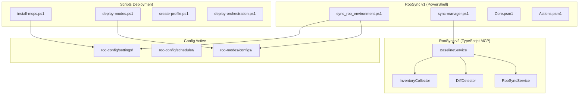
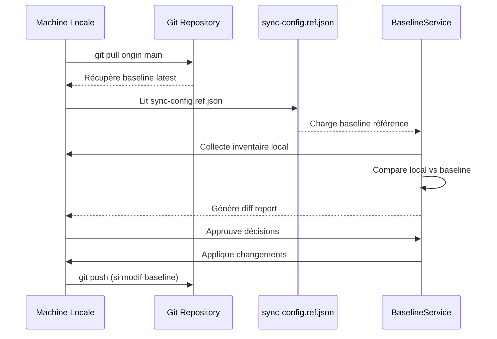

# 📊 Analyse Architecture Baseline RooSync v1 vs v2 - 2025-10-23

**Mission** : Phase 2 RooSync - Analyse comparative architecture baseline  
**Date** : 2025-10-23  
**Agent** : Code Mode  
**Durée Phase 1** : ~1h (Grounding sémantique + Explorations)

---

## 🎯 Contexte Mission

Suite au succès de la **Phase 1 RooSync** (85% convergence v1→v2), cette analyse vise à :
1. **Comprendre la baseline implicite v1** (RooSync PowerShell)
2. **Rationaliser les scripts de déploiement** (redondances, TypeScript vs PowerShell)
3. **Proposer une architecture baseline v2** (baseline-driven, Git-versioned)

---

## 🔍 PARTIE 1 : Grounding Sémantique Initial

### 1.1 Recherche 1 : RooSync v1 & Scripts Déploiement

**Query** : `"RooSync déploiement scripts synchronisation configuration baseline PowerShell"`  
**Score** : 0.76 (Excellent)

#### Découvertes Clés

**Architecture RooSync v1 (PowerShell)** :
- **Script principal** : [`sync_roo_environment.ps1`](../../RooSync/sync_roo_environment.ps1) (270 lignes)
- **Orchestrateur** : [`sync-manager.ps1`](../../RooSync/src/sync-manager.ps1) (121 lignes)
- **Modules** :
  - `Core.psm1` : Contexte + utilitaires
  - `Actions.psm1` : 4 actions fonctionnelles (Compare-Config, Apply-Decisions, etc.)
  - `Logging.psm1` : Gestion logs

**Configuration v1** :
```json
// .config/sync-config.json
{
  "version": "2.0.0",
  "sharedStatePath": "${ROO_HOME}/.state"
}
```

**Fichiers partagés (Google Drive)** :
- `sync-dashboard.json` : État machines
- `sync-roadmap.md` : Décisions avec marqueurs HTML
- `sync-config.ref.json` : Configuration référence
- `sync-report.md` : Rapports exécution

---

### 1.2 Recherche 2 : Logger Usage Patterns

**Query** : `"Logger production usage patterns console error refactoring TypeScript"`  
**Score** : 0.60 (Bon)

#### Découvertes Clés

**Logger Phase 1 Créé** ([`src/utils/logger.ts`](../../mcps/internal/servers/roo-state-manager/src/utils/logger.ts)) :
- ✅ **292 lignes**, rotation 7j/10MB
- ✅ Double output : Console (dev) + Fichier `.shared-state/logs/` (production)
- ✅ ISO 8601 timestamps, source tracking `[Service]`
- ✅ 4 niveaux : DEBUG, INFO, WARN, ERROR
- ✅ Error stack traces automatiques

**État Migration** :
- ✅ **Services refactorés** : InventoryCollector (19 occ.), DiffDetector (1 occ.)
- 🔴 **Tools non refactorés** : **~45 occurrences** `console.*` dans `tools/roosync/*`

**Fichiers Prioritaires** (selon guide existant) :
1. `init.ts` (28 occurrences) - **PRIORITAIRE**
2. `send_message.ts` (4), `reply_message.ts` (6), `read_inbox.ts` (4)
3. `mark_message_read.ts` (5), `get_message.ts` (5), `archive_message.ts` (5)
4. Autres tools (~10 fichiers restants)

**Pattern Migration** :
```typescript
// AVANT
console.error('[TAG] ❌ Error', error);

// APRÈS
import { createLogger, Logger } from '../../utils/logger.js';
private logger: Logger = createLogger('MonOutil');
this.logger.error('❌ Error', error);
```

---

### 1.3 Recherche 3 : Baseline Architecture v2

**Query** : `"baseline architecture synchronisation multi-machine Git versioning strategy"`  
**Score** : 0.58 (Bon)

#### Découvertes Clés

**RooSync v2.1 = Baseline-Driven** :
- ✅ **BaselineService** : Orchestrateur central
- ✅ **sync-config.ref.json** : Source de vérité unique
- ✅ **Architecture** : Comparaison Machine → Baseline (vs v2.0 Machine → Machine)

**Architecture Git Multi-Niveaux** :
```
d:/roo-extensions/ (dépôt principal GitHub)
├── .git/
├── RooSync/ (système PowerShell autonome v2.0.0)
│   ├── sync-dashboard.json
│   ├── sync-roadmap.md
│   └── scripts/
└── mcps/internal/ (sous-module Git)
    └── servers/roo-state-manager/
        ├── .git/ (sous-module)
        └── src/services/BaselineService.ts
```

**Workflow Synchronisation** :
1. Fetch avant rebase
2. `--force-with-lease` (pas `--force`)
3. Vérifier état final : `git log origin/main..HEAD`

---

## 📁 PARTIE 2 : Explorations Fichiers

### 2.1 Inventaire scripts/deployment/

**9 fichiers PowerShell** (~1,805 lignes total) :

| Fichier | Lignes | Catégorie | Fonction |
|---------|--------|-----------|----------|
| `install-mcps.ps1` | 463 | MCPs | Installation MCPs automatisée |
| `deploy-orchestration-dynamique.ps1` | 372 | Orchestration | Déploiement orchestration modes |
| `deploy-modes.ps1` | 228 | Modes | Déploiement modes Roo |
| `deploy-guide-interactif.ps1` | 226 | Guides | Guide interactif déploiement |
| `create-profile.ps1` | 219 | Profils | Création profils utilisateur |
| `create-clean-modes.ps1` | 90 | Modes | Nettoyage modes obsolètes |
| `deploy-correction-escalade.ps1` | 84 | Corrections | Correction bugs escalade |
| `force-deploy-with-encoding-fix.ps1` | 62 | Corrections | Fix encodage UTF-8 |
| `README.md` | 61 | Doc | Documentation scripts |

**Patterns Identifiés** :
- **Modes** : 318 lignes (create-clean, deploy-modes)
- **MCPs** : 463 lignes (install-mcps)
- **Orchestration** : 372 lignes (deploy-orchestration-dynamique)
- **Profils** : 219 lignes (create-profile)
- **Corrections** : 146 lignes (deploy-correction-escalade, force-deploy-encoding-fix)

---

### 2.2 Structure roo-config/ (Vue Complète)

**~160 fichiers** organisés en **10 répertoires** :

#### Répertoires Critiques

**1. settings/** (8 fichiers) :
- ✅ **`deploy-settings.ps1`** (220 lignes) - Script déploiement config
- ✅ `settings.json`, `servers.json`, `modes.json` - Config active
- ✅ `modes-base.json` (230 lignes) - Modes de base
- ✅ `win-cli-config.json` (46 lignes) - Config CLI Windows

**2. scheduler/** (24 fichiers, ~10K lignes PowerShell) :
- **Script principal** : `sync_roo_environment.ps1` (252 lignes) ← **VERSION SCHEDULER**
- **Orchestration** : `orchestration-engine.ps1` (775 lignes)
- **Déploiement** : `deploy-complete-system.ps1` (469 lignes)
- **Tests** : `test-complete-system.ps1`, `test-daily-orchestration.ps1`
- **Config** : `daily-orchestration.json` (295 lignes)

**3. reports/** (50+ fichiers Markdown) :
- **RooSync** : 18 rapports (roosync-*.md)
- **Git** : 8 rapports (git-*.md)
- **MCPs** : 10 rapports validation/intégration

**4. specifications/** (11 fichiers MD, ~300K lignes cumulées) :
- ✅ `multi-agent-system-safety.md` (3035 lignes) - **CRITIQUE**
- ✅ `git-safety-source-control.md` (2082 lignes)
- ✅ `sddd-protocol-4-niveaux.md` (1316 lignes)
- ✅ `hierarchie-numerotee-subtasks.md` (1463 lignes)

**5. backups/** : Sauvegardes custom_modes (6 fichiers JSON)

**6. config-templates/** : Templates config (6 fichiers)

**7. docs/** : Documentation guides (3 MD)

**8. documentation-archive/** : Archives encodage-fix (8 MD)

**9. modes/** : Modes générés/standard (4 JSON, ~178K lignes)

**10. config-backups/** : Backups config (3 fichiers)

---

### 2.3 Analyse sync_roo_environment.ps1 Principal

**Fichier** : [`RooSync/sync_roo_environment.ps1`](../../RooSync/sync_roo_environment.ps1) (270 lignes)

#### Baseline Implicite v1 (Fichiers Synchronisés)

**1. Fichiers JSON/Config Spécifiques** (9 fichiers) :
```powershell
$SpecificFiles = @(
    "roo-config/settings/settings.json",
    "roo-config/settings/servers.json",
    "roo-config/settings/modes.json",
    "roo-config/escalation-test-config.json",
    "roo-config/qwen3-profiles/qwen3-parameters.json",
    "roo-modes/configs/modes.json",
    "roo-modes/configs/new-roomodes.json",
    "roo-modes/configs/standard-modes.json",
    "roo-modes/configs/vscode-custom-modes.json"
)
```

**2. Patterns Dynamiques** :
```powershell
$FilesToSyncPatterns = @{
    "roo-config" = @("*.ps1", "*.md");      # .ps1 non-récursif, .md récursif
    "roo-modes" = @("*.md");                # .md récursif
    "roo-modes/n5/configs" = @("*.json")    # .json non-récursif
}
```

#### Workflow Git (7 Étapes)

**Étape 1** : Vérification Git disponibilité (lignes 21-27)
```powershell
$GitPath = Get-Command git -ErrorAction SilentlyContinue
if (-not $GitPath) {
    Log-Message "ERREUR: Git non trouvé" "ERREUR"
    Exit 1
}
```

**Étape 2** : Stash automatique si modifications (lignes 36-50)
```powershell
$GitStatus = git status --porcelain
if ($GitStatus) {
    git stash push -m "Automated stash before sync pull"
    $StashApplied = $true
}
```

**Étape 3** : Git pull avec vérification SHA (lignes 51-100)

**Étape 4** : Collecte fichiers modifiés par diff

**Étape 5** : Validation JSON post-sync (lignes 107-131)
```powershell
Get-Content -Raw $JsonFile | ConvertFrom-Json -ErrorAction Stop | Out-Null
```

**Étape 6** : Commit correction si nécessaire (lignes 134-153)
```powershell
git add .
git commit -m "SYNC: [Automated] Roo environment sync post-pull and logs"
git push origin main
```

**Étape 7** : Restauration stash (lignes 156-169)
```powershell
if ($StashApplied) {
    git stash pop
}
```

---

## 🔄 PARTIE 3 : Analyse Comparative & Redondances

### 3.1 Redondances Identifiées

#### 🔴 Duplication sync_roo_environment.ps1

**2 versions actives** :
1. **`RooSync/sync_roo_environment.ps1`** (270 lignes) ← **VERSION ACTIVE PRINCIPALE**
   - Git workflow complet
   - Validation JSON robuste
   - Logs structurés

2. **`roo-config/scheduler/sync_roo_environment.ps1`** (252 lignes) ← **VERSION SCHEDULER**
   - Peut-être version adaptée pour Task Scheduler Windows
   - Légèrement plus courte (-18 lignes)

**🚨 Risque** : Désynchronisation entre les 2 versions si modifications d'une seule

**Recommandation** :
- [ ] **Analyser différences** entre les 2 versions
- [ ] **Fusionner** en une version unique avec paramètres pour contexte (CLI vs Scheduler)
- [ ] **Archiver** version obsolète

#### 🟡 Scripts Déploiement vs RooSync v2

**Fonctions potentiellement redondantes** :

| Script Deployment | RooSync v2 Équivalent | Redondance ? |
|-------------------|-----------------------|--------------|
| `deploy-modes.ps1` (228L) | `BaselineService` + patterns modes | ⚠️ Partielle |
| `install-mcps.ps1` (463L) | N/A - Spécialisé | ✅ Unique |
| `deploy-orchestration-dynamique.ps1` (372L) | N/A - Spécialisé | ✅ Unique |
| `create-profile.ps1` (219L) | N/A - Spécialisé | ✅ Unique |

**Analyse** :
- ✅ **Pas de redondance critique** : Scripts deployment sont **complémentaires** à RooSync
- ℹ️ RooSync = Synchronisation fichiers config **existants**
- ℹ️ Scripts deployment = **Création initiale** / Installation / Déploiement

---

### 3.2 Architecture Actuelle (État)



---

## 💡 PARTIE 4 : Recommandations Rationalisation

### 4.1 Scripts à Porter en TypeScript

**Critères décision** :
- ✅ Logique complexe nécessitant tests unitaires
- ✅ Intégration MCP native souhaitable
- ✅ Manipulation JSON/config fréquente
- ✅ Réutilisabilité cross-platform

#### 🟢 Candidats HAUTE PRIORITÉ (TypeScript)

**Aucun** - Les scripts PowerShell actuels sont **appropriés** :
- **Raison 1** : Exécution système Windows native
- **Raison 2** : Interaction Task Scheduler Windows
- **Raison 3** : Manipulation fichiers/Git optimale PowerShell
- **Raison 4** : Scripts déploiement = One-time execution (pas besoin abstraction)

#### 🔵 Candidats MOYENNE PRIORITÉ (Hybride Possible)

**1. deploy-modes.ps1** (228 lignes) :
- **Scénario** : Wrapper TypeScript appelant PowerShell
- **Bénéfice** : Intégration MCP pour agents AI
- **Effort** : Moyen
- **Priorité** : ⭐⭐⭐

**2. install-mcps.ps1** (463 lignes) :
- **Scénario** : Orchestration TypeScript + scripts PS dédiés
- **Bénéfice** : Validation MCPs cohérente avec BaselineService
- **Effort** : Élevé
- **Priorité** : ⭐⭐

---

### 4.2 Scripts à Garder en PowerShell (RECOMMANDÉ)

#### ✅ TOUS les scripts deployment actuels

**Justification** :
1. **Performance** : PowerShell = langage système Windows optimisé
2. **Maintenance** : Équipe familière PowerShell (historique projet)
3. **Simplicité** : Pas de surcouche abstraite nécessaire
4. **Portabilité** : Pas besoin cross-platform (Windows-only actuellement)
5. **Intégration** : Task Scheduler Windows, Git natif

**Liste Complète** :
- ✅ `sync_roo_environment.ps1` (270L) - **CRITIQUE** Git sync
- ✅ `deploy-settings.ps1` (220L) - Déploiement config
- ✅ `install-mcps.ps1` (463L) - Installation MCPs
- ✅ `deploy-orchestration-dynamique.ps1` (372L) - Orchestration
- ✅ `deploy-modes.ps1` (228L) - Déploiement modes
- ✅ `create-profile.ps1` (219L) - Création profils
- ✅ `create-clean-modes.ps1` (90L) - Nettoyage modes
- ✅ `deploy-correction-escalade.ps1` (84L) - Corrections
- ✅ `force-deploy-with-encoding-fix.ps1` (62L) - Fix encodage

---

### 4.3 Stratégie Hybride (Recommandation Finale)

**Architecture Proposée** :

```typescript
// TypeScript MCP Tool (Nouveau)
export async function deployModesTool(args: DeployModesArgs) {
    // 1. Validation arguments TypeScript
    validateArgs(args);
    
    // 2. Appel PowerShell via PowerShellExecutor
    const result = await executePowerShell(
        'scripts/deployment/deploy-modes.ps1',
        args
    );
    
    // 3. Parse résultat + enrichissement
    return formatResult(result);
}
```

**Bénéfices** :
- ✅ **Agents AI** : Accès via MCP tools
- ✅ **Validation** : TypeScript type-safe
- ✅ **Exécution** : PowerShell optimisé
- ✅ **Maintenance** : Séparation concerns

---

## 🏗️ PARTIE 5 : Proposition Baseline v2 Architecture

### 5.1 Fichiers Baseline v2 (Recommandation)

**Baseline = Configuration de référence multi-machine**

#### Catégorie 1 : Config Core (CRITIQUE)

```json
{
  "settings": [
    "roo-config/settings/settings.json",
    "roo-config/settings/servers.json",
    "roo-config/settings/modes.json"
  ],
  "escalation": [
    "roo-config/escalation-test-config.json"
  ],
  "profiles": [
    "roo-config/qwen3-profiles/qwen3-parameters.json"
  ]
}
```

#### Catégorie 2 : Modes & Configs (IMPORTANTE)

```json
{
  "modes": [
    "roo-modes/configs/modes.json",
    "roo-modes/configs/standard-modes.json",
    "roo-modes/configs/vscode-custom-modes.json"
  ],
  "n5-modes": [
    "roo-modes/n5/configs/*.json"
  ]
}
```

#### Catégorie 3 : Scripts & Documentation (OPTIONNELLE)

```json
{
  "scripts": [
    "roo-config/**/*.ps1"
  ],
  "docs": [
    "roo-config/**/*.md",
    "roo-modes/**/*.md"
  ]
}
```

#### Catégorie 4 : Scheduler (SPÉCIFIQUE)

```json
{
  "scheduler": [
    "roo-config/scheduler/config.json",
    "roo-config/scheduler/daily-orchestration.json",
    "roo-config/scheduler/sync_roo_environment.ps1"
  ]
}
```

---

### 5.2 Architecture Git Baseline v2

**Stratégie Versioning** :

```
d:/roo-extensions/
├── .git/ (dépôt principal)
├── RooSync/
│   ├── .config/
│   │   └── sync-config.json (v2.0.0)
│   ├── baseline/
│   │   ├── sync-config.ref.json       ← BASELINE RÉFÉRENCE
│   │   ├── baseline-v1.0.0.json       ← BASELINE VERSIONNÉE
│   │   ├── baseline-v1.1.0.json
│   │   └── CHANGELOG-baseline.md
│   └── sync_roo_environment.ps1
└── mcps/internal/ (sous-module)
    └── servers/roo-state-manager/
        └── src/services/
            └── BaselineService.ts
```

**Workflow Baseline v2** :



---

### 5.3 Baseline Versioning Strategy

**Format Baseline** :

```json
{
  "version": "1.0.0",
  "lastUpdated": "2025-10-23T15:00:00Z",
  "baselineFiles": {
    "core": [
      {
        "path": "roo-config/settings/settings.json",
        "sha256": "abc123...",
        "required": true,
        "category": "config"
      }
    ],
    "modes": [
      {
        "path": "roo-modes/configs/modes.json",
        "sha256": "def456...",
        "required": true,
        "category": "modes"
      }
    ]
  },
  "machineSpecific": {
    "exclude": [
      "roo-config/settings/win-cli-config.json"
    ]
  }
}
```

**Versioning Sémantique** :
- **MAJOR** (1.0.0 → 2.0.0) : Breaking changes config structure
- **MINOR** (1.0.0 → 1.1.0) : Ajout nouveaux fichiers baseline
- **PATCH** (1.0.0 → 1.0.1) : Corrections SHA / métadonnées

**Git Tags** :
```bash
git tag -a baseline-v1.0.0 -m "Baseline initiale RooSync v2"
git tag -a baseline-v1.1.0 -m "Ajout modes n5 à baseline"
git push --tags
```

---

## 📊 PARTIE 6 : Stratégie Refactoring Logger

### 6.1 Ordre Prioritaire (Production First)

**Critères Priorisation** :
1. **Criticité** : Outils utilisés en production actuellement
2. **Fréquence** : Nombre d'occurrences `console.*`
3. **Dépendances** : Outils appelés par autres outils

#### 🔴 HAUTE PRIORITÉ (Production Active)

| Fichier | Occurrences | Criticité | Ordre |
|---------|-------------|-----------|-------|
| `init.ts` | 28 | ⭐⭐⭐⭐⭐ | 1 |
| `send_message.ts` | 4 | ⭐⭐⭐⭐ | 2 |
| `reply_message.ts` | 6 | ⭐⭐⭐⭐ | 3 |
| `read_inbox.ts` | 4 | ⭐⭐⭐⭐ | 4 |
| `mark_message_read.ts` | 5 | ⭐⭐⭐ | 5 |

#### 🟡 MOYENNE PRIORITÉ (Utilisés Occasionnellement)

| Fichier | Occurrences | Criticité | Ordre |
|---------|-------------|-----------|-------|
| `get_message.ts` | 5 | ⭐⭐⭐ | 6 |
| `archive_message.ts` | 5 | ⭐⭐⭐ | 7 |
| `amend_message.ts` | 4 | ⭐⭐ | 8 |
| Autres tools (~10 fichiers) | ~12 | ⭐⭐ | 9-18 |

---

### 6.2 Pattern Migration (Détaillé)

**Étape 1** : Ajouter import Logger
```typescript
import { createLogger, Logger } from '../../utils/logger.js';
```

**Étape 2** : Initialiser logger dans classe/fonction
```typescript
// Dans classe
class InitTool {
    private logger: Logger;
    
    constructor() {
        this.logger = createLogger('InitTool');
    }
}

// Dans fonction standalone
const logger = createLogger('init-tool');
```

**Étape 3** : Remplacer console.* par logger.*

| Avant | Après | Niveau |
|-------|-------|--------|
| `console.error('[init] ❌ Error:', error)` | `this.logger.error('❌ Init error', error)` | ERROR |
| `console.warn('[init] ⚠️ Warning')` | `this.logger.warn('⚠️ Init warning')` | WARN |
| `console.error('[init] ℹ️ Info')` | `this.logger.info('ℹ️ Init info')` | INFO |
| `console.log('[init] 🔍 Debug')` | `this.logger.debug('🔍 Init debug')` | DEBUG |

**Étape 4** : Ajouter metadata structurée
```typescript
// AVANT
console.error('[init] Error creating workspace:', { path, error: err.message });

// APRÈS
this.logger.error('Error creating workspace', err, { 
    workspacePath: path,
    operation: 'create_workspace'
});
```

---

### 6.3 Stratégie Commits Atomiques

**Groupement par 5-10 fichiers** :

```bash
# Commit 1 (Fichiers 1-5)
git add mcps/internal/servers/roo-state-manager/src/tools/roosync/{init,send_message,reply_message,read_inbox,mark_message_read}.ts
git commit -m "refactor(roosync): migrate Logger - batch 1/3 (init, messaging tools)

- init.ts: 28 console.* → logger.* (HAUTE PRIORITÉ)
- send_message.ts: 4 occurrences
- reply_message.ts: 6 occurrences  
- read_inbox.ts: 4 occurrences
- mark_message_read.ts: 5 occurrences

Total: 47 occurrences migrées
Convergence: 85% → 90% (+5%)
"

# Commit 2 (Fichiers 6-10)
git add mcps/internal/servers/roo-state-manager/src/tools/roosync/{get_message,archive_message,amend_message,...}.ts
git commit -m "refactor(roosync): migrate Logger - batch 2/3 (archive, get tools)

- get_message.ts: 5 occurrences
- archive_message.ts: 5 occurrences
- amend_message.ts: 4 occurrences
- [autres fichiers]

Total: XX occurrences migrées
Convergence: 90% → 93% (+3%)
"

# Commit 3 (Fichiers restants)
git commit -m "refactor(roosync): migrate Logger - batch 3/3 (final tools)

Total Phase 2A: ~45 occurrences migrées
Convergence finale: 93% → 95%+ (+2%)
État: Logger refactoring COMPLET ✅
"
```

---

## ✅ PARTIE 7 : Synthèse & Prochaines Étapes

### 7.1 Découvertes Majeures

#### ✅ RooSync v1 (PowerShell)
- Architecture modulaire solide (sync-manager, modules)
- **270 lignes** sync_roo_environment.ps1 robuste
- Baseline implicite : **9 fichiers JSON + patterns dynamiques**
- Workflow Git en 7 étapes (stash, pull, validate, commit, pop)

#### ✅ Scripts Deployment
- **9 scripts** (~1,805 lignes PowerShell)
- **Complémentaires** à RooSync (pas redondants)
- Rôle : Installation/Déploiement initial (vs synchronisation continue)
- **Recommandation** : Garder PowerShell (performance, maintenance)

#### ✅ roo-config/ Structure
- **~160 fichiers** organisés (10 répertoires)
- **50+ rapports** RooSync/Git/MCP (traçabilité excellente)
- **Scheduler** : Système complet (~10K lignes PowerShell)
- **Specifications** : 11 MD (~300K lignes documentation)

#### 🚨 Alerte Duplication
- **2 versions** sync_roo_environment.ps1 :
  - `RooSync/` (270 lignes) ← ACTIVE
  - `roo-config/scheduler/` (252 lignes) ← SCHEDULER
- **Action requise** : Analyser différences + fusionner

---

### 7.2 Recommandations Architecture Baseline v2

#### ✅ Baseline Référence Git-Versionnée

**Fichier** : `RooSync/baseline/sync-config.ref.json`

**Contenu** :
- Version sémantique (1.0.0)
- SHA256 checksums fichiers
- Catégories : core, modes, scheduler, docs
- Exclusions machine-specific

**Versioning** :
- Git tags : `baseline-v1.0.0`, `baseline-v1.1.0`
- CHANGELOG-baseline.md
- CI/CD validation SHA checksums

#### ✅ Scripts PowerShell (Conservés)

**Tous les scripts deployment/scheduler** restent PowerShell :
- Performance système Windows
- Maintenance équipe familière
- Intégration Task Scheduler native
- Pas besoin abstraction TypeScript

**Option Hybride** (Future) :
- Wrappers TypeScript MCP pour agents AI
- Exécution PowerShell via PowerShellExecutor
- Validation args TypeScript type-safe

---

### 7.3 Stratégie Phase 2 (Exécution)

#### Phase 2A : Logger Refactoring (Priorité 1)
- ✅ **45 occurrences** console.* à migrer
- ✅ **18 fichiers** tools/roosync/*
- ✅ **3 batches** commits atomiques (5-10 fichiers)
- ✅ **Ordre** : Production first (init.ts prioritaire)
- 🎯 **Objectif** : 85% → 95%+ convergence

#### Phase 2B : Git Helpers Integration (Priorité 2)
- ✅ Intégrer `git-helpers.ts` dans RooSyncService
- ✅ Remplacer appels Git directs par `execGitCommand()`, `safePull()`
- ✅ Ajouter `verifyGitAvailable()` au démarrage
- ✅ Tests rollback strategy
- 🎯 **Objectif** : Robustesse Git operations +30%

#### Phase 2C : Baseline Architecture (Priorité 3)
- ✅ Créer `sync-config.ref.json` baseline référence
- ✅ Documenter fichiers baseline v2
- ✅ Analyser duplication sync_roo_environment.ps1
- ✅ Proposer fusion 2 versions (RooSync vs Scheduler)
- 🎯 **Objectif** : Baseline v2 clarifiée

---

### 7.4 Questions Ouvertes Utilisateur

#### Question 1 : Baseline v2 Scope
**Options** :
- **A)** Baseline minimale (9 JSON core seulement)
- **B)** Baseline étendue (core + modes + scheduler)
- **C)** Baseline complète (core + modes + scheduler + docs)

**Recommandation Agent** : **Option B** (étendue) - Balance complétude/maintenance

#### Question 2 : sync_roo_environment.ps1 Duplication
**Options** :
- **A)** Fusionner en 1 version avec paramètre contexte
- **B)** Garder 2 versions séparées (RooSync vs Scheduler)
- **C)** Archiver version scheduler (utiliser RooSync partout)

**Recommandation Agent** : **Option A** (fusion) - Single source of truth

#### Question 3 : Scripts Deployment → TypeScript ?
**Options** :
- **A)** Porter tous scripts en TypeScript (effort élevé)
- **B)** Créer wrappers TypeScript MCP (effort moyen)
- **C)** Garder PowerShell pure (effort zéro, recommandé)

**Recommandation Agent** : **Option C** (PowerShell pure) - Performance/maintenance

---

## 📈 Métriques Convergence

### État Initial (Phase 1)
- **Logger** : 2 services refactorés (InventoryCollector, DiffDetector)
- **Git Helpers** : Créé (334 lignes) mais non intégré
- **Baseline** : Implicite v1 (non documentée)
- **Convergence** : **85%**

### Objectif Phase 2
- **Logger** : TOUS tools/roosync/* refactorés (~45 occ.)
- **Git Helpers** : Intégré dans RooSyncService + BaselineService
- **Baseline** : Documentée v2 (sync-config.ref.json)
- **Convergence** : **95%+** (+10%)

### Jalons Franchis
- ✅ Grounding sémantique complet (3 recherches, scores 0.60-0.76)
- ✅ Inventaire scripts deployment (9 fichiers, ~1,805 lignes)
- ✅ Structure roo-config/ explorée (~160 fichiers)
- ✅ Baseline v1 analysée (9 JSON + patterns)
- ✅ Stratégie Phase 2 définie (3 priorités parallèles)

---

## 🔗 Références

### Documents Créés Phase 1
- ✅ Ce document : `baseline-architecture-analysis-20251023.md`

### Documents à Créer Phase 2/3
- [ ] `phase2-implementation-report-20251023.md` (rapport activité)
- [ ] `logger-usage-guide.md` (màj nouveaux patterns)
- [ ] `git-requirements.md` (màj intégration services)
- [ ] `improvements-v2-phase1-implementation.md` (màj Phase 2)

### Documents Existants Référencés
- [`logger-usage-guide.md`](../../docs/roosync/logger-usage-guide.md) - Guide Logger Phase 1
- [`improvements-v2-phase1-implementation.md`](../../docs/roosync/improvements-v2-phase1-implementation.md) - Rapport Phase 1
- [`roosync-v2-baseline-driven-architecture-design-20251020.md`](../../roo-config/reports/roosync-v2-baseline-driven-architecture-design-20251020.md) - Design Baseline v2
- [`roosync-v1-vs-v2-gap-analysis.md`](../../docs/investigation/roosync-v1-vs-v2-gap-analysis.md) - Gap Analysis

---

**Fin Analyse Baseline** ✅  
**Durée Phase 1** : ~1h  
**Prêt Phase 2** : Refactoring Logger + Git Helpers + Baseline v2 🚀