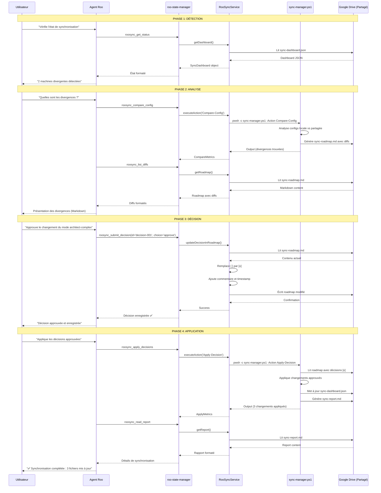
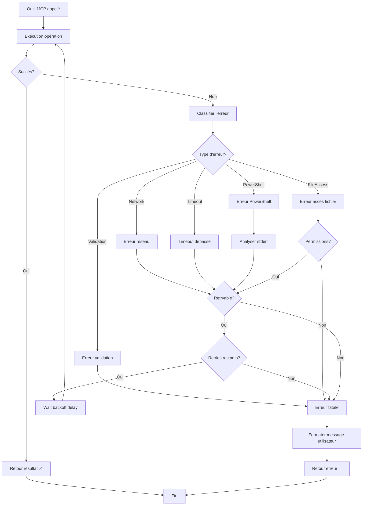
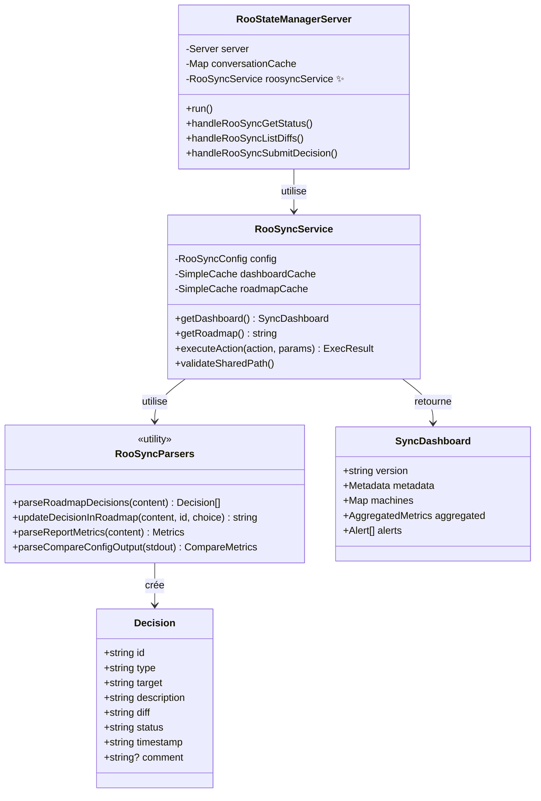

# Architecture d'Intégration RooSync ↔ roo-state-manager

**Date :** 2025-10-04  
**Mission :** Conception complète de l'architecture d'intégration  
**Méthodologie :** SDDD (Semantic-Documentation-Driven-Design)  
**Documents Précédents :**
- [01-grounding-semantique-roo-state-manager.md](./01-grounding-semantique-roo-state-manager.md)
- [02-points-integration-roosync.md](./02-points-integration-roosync.md)

---

## Table des Matières

1. [Vue d'Ensemble](#vue-densemble)
2. [Architecture en Couches](#architecture-en-couches)
3. [Flux de Données Détaillés](#flux-de-données-détaillés)
4. [Gestion des Erreurs](#gestion-des-erreurs)
5. [Considérations de Sécurité](#considérations-de-sécurité)
6. [Performance et Optimisation](#performance-et-optimisation)
7. [Stratégie de Déploiement](#stratégie-de-déploiement)

---

## 1. Vue d'Ensemble

### 1.1 Vision Architecturale

Le serveur MCP `roo-state-manager` devient la **tour de contrôle unifiée** orchestrant deux domaines complémentaires :

```
┌─────────────────────────────────────────────────────────────────────┐
│                    roo-state-manager MCP                            │
│                     (Tour de Contrôle)                              │
└────────────┬─────────────────────────────────────┬──────────────────┘
             │                                     │
             ▼                                     ▼
┌────────────────────────────┐      ┌────────────────────────────┐
│  Domaine 1 : Roo State     │      │  Domaine 2 : RooSync       │
│  (Conversations & Tasks)   │      │  (Config Synchronization)  │
└────────────┬───────────────┘      └────────────┬───────────────┘
             │                                   │
             ▼                                   ▼
┌────────────────────────────┐      ┌────────────────────────────┐
│ • 32 outils existants      │      │ • 8 nouveaux outils        │
│ • Cache squelettes         │      │ • Lecture fichiers sync    │
│ • Index Qdrant             │      │ • Exécution PowerShell     │
│ • Export multi-formats     │      │ • Gestion décisions        │
└────────────────────────────┘      └────────────────────────────┘
```

**Principe Architectural :** **Single Entry Point, Multiple Domains**
- Un seul serveur MCP pour tout
- Deux domaines métier distincts mais cohérents
- Réutilisation maximale des patterns existants
- Extensibilité préservée

### 1.2 Architecture Globale

```
┌─────────────────────────────────────────────────────────────────────────────┐
│                           Agent Roo / Interface CLI                         │
└───────────────────────────────────┬─────────────────────────────────────────┘
                                    │
                                    │ MCP Protocol (stdio)
                                    │
┌───────────────────────────────────▼─────────────────────────────────────────┐
│                         roo-state-manager MCP Server                        │
│                                                                             │
│  ┌─────────────────────────────────────────────────────────────────────┐   │
│  │                        Unified API Gateway                          │   │
│  │  (Routage des outils vers les domaines appropriés)                │   │
│  └──────────┬─────────────────────────────────────┬────────────────────┘   │
│             │                                     │                        │
│  ┌──────────▼──────────┐              ┌──────────▼──────────┐             │
│  │   Roo State Domain  │              │   RooSync Domain    │             │
│  │                     │              │                     │             │
│  │  • TaskNavigator    │              │  • RooSyncService   │             │
│  │  • TaskIndexer      │              │  • RooSyncParsers   │             │
│  │  • TaskSearcher     │              │  • PowerShellExec   │             │
│  │  • XmlExporter      │              │  • DecisionManager  │             │
│  │  • SynthesisOrch    │              │  • StateReader      │             │
│  └──────────┬──────────┘              └──────────┬──────────┘             │
│             │                                     │                        │
└─────────────┼─────────────────────────────────────┼────────────────────────┘
              │                                     │
              ▼                                     ▼
┌──────────────────────────┐        ┌──────────────────────────────┐
│   Stockage Roo Local     │        │   Espace Partagé (GDrive)    │
│                          │        │                              │
│  • tasks/                │        │  • sync-dashboard.json       │
│  • .skeletons/           │        │  • sync-roadmap.md           │
│  • task_metadata.json    │        │  • sync-report.md            │
│  • api_conversation.json │        │  • .config/sync-config.json  │
└──────────────────────────┘        └──────────────────────────────┘
              │                                     │
              ▼                                     ▼
┌──────────────────────────┐        ┌──────────────────────────────┐
│   Services Externes      │        │   Système Local (PowerShell) │
│                          │        │                              │
│  • Qdrant (indexation)   │        │  • sync-manager.ps1          │
│  • OpenAI (embeddings)   │        │  • modules/Core.psm1         │
│  • SQLite (VS Code)      │        │  • modules/Actions.psm1      │
└──────────────────────────┘        └──────────────────────────────┘
```

### 1.3 Principes de Conception

**1. Séparation des Domaines**
- Roo State et RooSync restent logiquement séparés
- Chaque domaine a ses propres services
- Pas de couplage entre les deux domaines

**2. Unified Gateway**
- Point d'entrée unique via le MCP
- Routage transparent vers le bon domaine
- Interface cohérente pour l'utilisateur

**3. Réutilisation Maximale**
- Patterns existants réutilisés (error handling, retry, validation)
- Services existants non modifiés
- Nouveaux services suivent les mêmes patterns

**4. Extensibilité**
- Facile d'ajouter de nouveaux outils dans chaque domaine
- Architecture ouverte pour futurs domaines (ex: RooMetrics, RooBackup)
- Pattern d'intégration documenté et réplicable

---

## 2. Architecture en Couches

### 2.1 Couche 1 : Configuration

**Responsabilité :** Charger et valider la configuration au démarrage

```
┌─────────────────────────────────────────────────────────────┐
│              Couche Configuration (Startup)                 │
├─────────────────────────────────────────────────────────────┤
│                                                             │
│  [1] Chargement .env                                        │
│      └─> dotenv.config()                                    │
│      └─> Chemin: mcps/internal/servers/roo-state-manager/.env
│                                                             │
│  [2] Validation Variables Critiques                         │
│      ├─> Roo State : QDRANT_URL, OPENAI_API_KEY           │
│      └─> RooSync   : ROOSYNC_SHARED_PATH, MACHINE_ID       │
│                                                             │
│  [3] Validation Chemins & Accès                            │
│      ├─> Vérifier ROOSYNC_SHARED_PATH existe               │
│      ├─> Vérifier sync-manager.ps1 exécutable              │
│      └─> Tester accès R/W sur Google Drive                 │
│                                                             │
│  [4] Initialisation Services                                │
│      ├─> RooStorageDetector                                │
│      ├─> QdrantClient (singleton)                          │
│      ├─> OpenAIClient (singleton)                          │
│      └─> RooSyncService ✨ NOUVEAU                         │
│                                                             │
│  [5] Démarrage Background Services                          │
│      ├─> Qdrant indexing queue                             │
│      └─> RooSync auto-sync (si activé) ✨ NOUVEAU         │
│                                                             │
└─────────────────────────────────────────────────────────────┘
```

**Code Clé :**
```typescript
// src/index.ts (lignes 2-31)
import dotenv from 'dotenv';
dotenv.config({ path: path.join(__dirname, '../..', '.env') });

const REQUIRED_ENV_VARS = [
    // Roo State
    'QDRANT_URL', 'QDRANT_API_KEY', 'QDRANT_COLLECTION_NAME', 'OPENAI_API_KEY',
    // RooSync ✨ NOUVEAU
    'ROOSYNC_SHARED_PATH', 'ROOSYNC_MACHINE_ID', 'ROOSYNC_SCRIPT_PATH'
];

// Validation stricte
const missingVars = REQUIRED_ENV_VARS.filter(v => !process.env[v]);
if (missingVars.length > 0) {
    console.error('🚨 ERREUR CRITIQUE: Variables manquantes:', missingVars);
    process.exit(1);
}
```

**Gestion des Erreurs :**
- ❌ Variables manquantes → Exit immédiat avec message clair
- ❌ Chemin invalide → Exception avec instructions
- ❌ Script PS1 introuvable → Warning (RooSync désactivé)
- ✅ Configuration complète → Log de confirmation

### 2.2 Couche 2 : Lecture/Analyse

**Responsabilité :** Accéder aux données RooSync et les analyser

```
┌─────────────────────────────────────────────────────────────┐
│           Couche Lecture/Analyse (Runtime)                  │
├─────────────────────────────────────────────────────────────┤
│                                                             │
│  ┌─────────────────────────────────────────────────────┐   │
│  │  RooSyncService (src/services/RooSyncService.ts)    │   │
│  ├─────────────────────────────────────────────────────┤   │
│  │                                                     │   │
│  │  async getDashboard(): SyncDashboard                │   │
│  │  ├─> Lit sync-dashboard.json                        │   │
│  │  ├─> Parse JSON avec validation                     │   │
│  │  ├─> Cache en mémoire (5 min TTL)                   │   │
│  │  └─> Retourne objet typé                            │   │
│  │                                                     │   │
│  │  async getRoadmap(): string                         │   │
│  │  ├─> Lit sync-roadmap.md                            │   │
│  │  ├─> Aucun parsing (format libre)                   │   │
│  │  └─> Retourne Markdown brut                         │   │
│  │                                                     │   │
│  │  async getReport(): string                          │   │
│  │  ├─> Lit sync-report.md                             │   │
│  │  └─> Retourne Markdown brut                         │   │
│  │                                                     │   │
│  │  async executeAction(action, params): ExecResult    │   │
│  │  ├─> Construit commande PowerShell                  │   │
│  │  ├─> Exécute via child_process.exec()              │   │
│  │  ├─> Capture stdout/stderr                          │   │
│  │  └─> Retourne résultat avec exitCode                │   │
│  │                                                     │   │
│  └─────────────────────────────────────────────────────┘   │
│                           │                                 │
│                           ▼                                 │
│  ┌─────────────────────────────────────────────────────┐   │
│  │  RooSyncParsers (src/utils/roosync-parsers.ts)     │   │
│  ├─────────────────────────────────────────────────────┤   │
│  │                                                     │   │
│  │  parseRoadmapDecisions(content): Decision[]         │   │
│  │  ├─> Split par séparateurs "---"                    │   │
│  │  ├─> Extract metadata (id, type, target)            │   │
│  │  ├─> Extract diff content                           │   │
│  │  ├─> Detect status ([ ], [x], [r], [d])            │   │
│  │  └─> Return array of Decision objects               │   │
│  │                                                     │   │
│  │  updateDecisionInRoadmap(content, id, choice): str  │   │
│  │  ├─> Find decision block by ID                      │   │
│  │  ├─> Replace checkbox [ ] → [x]/[r]/[d]            │   │
│  │  ├─> Add comment if provided                        │   │
│  │  ├─> Add timestamp                                  │   │
│  │  └─> Return updated content                         │   │
│  │                                                     │   │
│  │  parseReportMetrics(content): Metrics               │   │
│  │  ├─> Extract stats (applied, failed, duration)      │   │
│  │  ├─> Extract target details                         │   │
│  │  └─> Return structured metrics                      │   │
│  │                                                     │   │
│  │  parseCompareConfigOutput(stdout): CompareMetrics   │   │
│  │  ├─> Parse PowerShell output                        │   │
│  │  ├─> Count divergences                              │   │
│  │  └─> Extract divergent targets list                 │   │
│  │                                                     │   │
│  └─────────────────────────────────────────────────────┘   │
│                                                             │
└─────────────────────────────────────────────────────────────┘
```

**Services Créés :**
- `RooSyncService` : Orchestrateur principal
- `RooSyncParsers` : Utilitaires de parsing

**Réutilisation :**
- `executeCommandWithCapture()` : Pattern existant pour `touch_mcp_settings`
- `normalizePath()` : Fonction existante pour chemins
- Error handling patterns : Retry, circuit breaker

### 2.2 Couche 3 : Présentation

**Responsabilité :** Formatter les données pour l'utilisateur

```
┌─────────────────────────────────────────────────────────────┐
│              Couche Présentation (Output)                   │
├─────────────────────────────────────────────────────────────┤
│                                                             │
│  [1] Format JSON Structuré                                  │
│      ├─> Pour outils nécessitant parsing (get_status)      │
│      ├─> Schema validé et typé                              │
│      └─> Compatible avec other MCPs                         │
│                                                             │
│  [2] Format Markdown Riche                                  │
│      ├─> Pour présentation humaine (list_diffs)            │
│      ├─> Réutilise TraceSummaryService patterns            │
│      ├─> Syntaxe coloration (```diff, ```json)             │
│      └─> Emojis et mise en forme                           │
│                                                             │
│  [3] Format Hybride                                         │
│      ├─> JSON avec embedded Markdown                        │
│      ├─> Utilisé par generate_trace_summary                 │
│      └─> Best of both worlds                                │
│                                                             │
│  [4] Troncature Intelligente                                │
│      ├─> MAX_OUTPUT_LENGTH = 150KB                          │
│      ├─> Préserve structure essentielle                     │
│      └─> Indique position de troncature                     │
│                                                             │
└─────────────────────────────────────────────────────────────┘
```

**Exemple de Sortie `roosync_list_diffs` (Markdown) :**

```markdown
# 🔄 Divergences Détectées - HOME-PC

**Date :** 2025-10-04T11:00:00Z  
**Machine :** HOME-PC  
**Cibles analysées :** 8  
**Divergences trouvées :** 2

---

## 🔍 Cible 1 : roo-config/settings/modes.json

**Statut :** 🟡 Divergent  
**Type :** Configuration modifiée localement  
**Dernière sync :** 2025-10-03T15:30:00Z

### 📊 Différence Détectée

```diff
+ {
+   "architect-complex": {
+     "name": "🏗️ Architect Complex",
+     "slug": "architect-complex",
+     "model": "anthropic/claude-sonnet-4.5"
+   }
+ }
```

**📝 Description :** Nouveau mode ajouté localement

**⚡ Action recommandée :** Réviser et approuver dans sync-roadmap.md

**🔗 ID Décision :** `decision-modes-20251004-001`

---

## ✅ Cible 2 : mcp_settings.json

**Statut :** 🟢 Synchronisé  
**Dernière sync :** 2025-10-04T10:25:00Z  
**Aucune action requise**

---

**💡 Prochaines Étapes :**
1. Consulter les décisions : `roosync_get_pending_decisions`
2. Valider les changements : `roosync_submit_decision`
3. Appliquer : `roosync_apply_decisions`
```

### 2.3 Couche 4 : Décision

**Responsabilité :** Gérer le workflow de décision utilisateur

```
┌─────────────────────────────────────────────────────────────┐
│             Couche Décision (Decision Flow)                 │
├─────────────────────────────────────────────────────────────┤
│                                                             │
│  ┌───────────────────────────────────────────────────┐     │
│  │  DecisionManager (intégré dans RooSyncService)    │     │
│  └───────────────────────────────────────────────────┘     │
│                                                             │
│  [1] Lecture des Décisions Pendantes                        │
│      getRoadmap() → parseRoadmapDecisions()                 │
│      └─> Extrait les blocs avec [ ] (non décidés)          │
│                                                             │
│  [2] Validation de Décision                                 │
│      └─> Vérifie que decision_id existe                     │
│      └─> Vérifie que choice est valide                      │
│      └─> Vérifie pas déjà décidée                          │
│                                                             │
│  [3] Application de Décision                                │
│      updateDecisionInRoadmap(id, choice, comment)           │
│      ├─> Lock fichier roadmap (éviter conflits)            │
│      ├─> Remplace [ ] par [x]/[r]/[d]                      │
│      ├─> Ajoute commentaire et timestamp                    │
│      ├─> Sauvegarde atomique (temp → rename)               │
│      └─> Unlock fichier                                     │
│                                                             │
│  [4] Traçabilité                                            │
│      └─> Chaque décision horodatée                          │
│      └─> Auteur de la décision tracé                        │
│      └─> Historique préservé dans roadmap                   │
│                                                             │
└─────────────────────────────────────────────────────────────┘
```

**États de Décision :**
```
[ ] → Pending    (En attente de décision)
[x] → Approved   (Approuvé pour application)
[r] → Rejected   (Rejeté, ne pas appliquer)
[d] → Deferred   (Reporté à plus tard)
```

**Workflow de Validation :**
```typescript
async validateDecision(decisionId: string, choice: string): Promise<void> {
    // 1. Vérifier que la décision existe
    const roadmap = await this.getRoadmap();
    const decisions = parseRoadmapDecisions(roadmap);
    const decision = decisions.find(d => d.id === decisionId);
    
    if (!decision) {
        throw new Error(`Decision ${decisionId} not found`);
    }
    
    // 2. Vérifier que la décision n'est pas déjà traitée
    if (decision.status !== 'pending') {
        throw new Error(`Decision ${decisionId} already ${decision.status}`);
    }
    
    // 3. Vérifier que le choix est valide
    const validChoices = ['approve', 'reject', 'defer'];
    if (!validChoices.includes(choice)) {
        throw new Error(`Invalid choice: ${choice}. Must be one of: ${validChoices.join(', ')}`);
    }
}
```

### 2.4 Couche 5 : Exécution

**Responsabilité :** Déclencher les scripts RooSync et capturer les résultats

```
┌─────────────────────────────────────────────────────────────┐
│            Couche Exécution (PowerShell Bridge)             │
├─────────────────────────────────────────────────────────────┤
│                                                             │
│  [1] Construction de la Commande                            │
│      buildPowerShellCommand(action, params)                 │
│      └─> Template: pwsh -c "& 'script.ps1' -Action X"      │
│                                                             │
│  [2] Exécution avec Timeout                                 │
│      executeCommandWithCapture(command, timeout)            │
│      ├─> child_process.exec()                               │
│      ├─> Timeout configurable par action                    │
│      ├─> Buffer 10MB pour output                            │
│      └─> Capture stdout + stderr + exitCode                 │
│                                                             │
│  [3] Gestion des Erreurs PowerShell                         │
│      analyzePowerShellError(stderr, exitCode)               │
│      ├─> Parse erreurs PowerShell                           │
│      ├─> Extract stack trace si disponible                  │
│      ├─> Classify error (retryable vs fatal)               │
│      └─> Format message utilisateur                         │
│                                                             │
│  [4] Retry avec Backoff                                     │
│      retryWithBackoff(operation, maxRetries=3)              │
│      ├─> Retry sur erreurs network/timeout                  │
│      ├─> Backoff: 2s, 4s, 8s                               │
│      └─> Log chaque tentative                               │
│                                                             │
│  [5] Parsing des Résultats                                  │
│      parseActionOutput(stdout, action)                      │
│      ├─> Extract métriques de la sortie                     │
│      ├─> Détecte success/failure patterns                   │
│      └─> Structure résultat pour MCP                        │
│                                                             │
└─────────────────────────────────────────────────────────────┘
```

**Timeouts par Action :**
```typescript
const ACTION_TIMEOUTS: Record<string, number> = {
    'Compare-Config': 60000,        // 1 minute
    'Apply-Decision': 120000,       // 2 minutes
    'Initialize-Workspace': 30000,  // 30 secondes
    'Status': 10000                 // 10 secondes
};
```

**Pattern d'Exécution :**
```typescript
async function executeRooSyncAction(
    action: string,
    params: string = '',
    retries: number = 3
): Promise<ExecutionResult> {
    const timeout = ACTION_TIMEOUTS[action] || 60000;
    const command = buildCommand(action, params);
    
    return await retryWithBackoff(async () => {
        const result = await executeCommandWithCapture(command, timeout);
        
        if (result.exitCode !== 0) {
            const error = analyzePowerShellError(result.stderr, result.exitCode);
            if (error.isRetryable) {
                throw new RetryableError(error.message);
            } else {
                throw new FatalError(error.message);
            }
        }
        
        return parseActionOutput(result.stdout, action);
    }, retries);
}
```

---

## 3. Flux de Données Détaillés

### 3.1 Flux Complet : Synchronisation Guidée



### 3.2 Flux d'Erreur : Gestion des Échecs



**Classification des Erreurs :**

| Type | Retryable | Stratégie | Exemple |
|------|-----------|-----------|---------|
| Network | ✅ Oui | Retry 3x avec backoff | `ENOTFOUND`, `ETIMEDOUT` |
| Timeout | ✅ Oui | Retry avec timeout augmenté | PowerShell timeout |
| FileAccess | ⚠️ Dépend | Retry si temporaire | `EACCES` temporaire vs permanent |
| PowerShell | ⚠️ Dépend | Analyser stderr pour décider | Script error vs syntax error |
| Validation | ❌ Non | Échec immédiat | Variable manquante, ID invalide |
| Parse | ❌ Non | Échec immédiat | JSON malformé |

### 3.3 Flux de Cache : Optimisation des Lectures

```
┌─────────────────────────────────────────────────────────────┐
│                Stratégie de Cache (Performance)             │
├─────────────────────────────────────────────────────────────┤
│                                                             │
│  Dashboard Cache (sync-dashboard.json)                      │
│  ├─> TTL: 5 minutes                                         │
│  ├─> Invalidation: Sur apply_decisions                      │
│  └─> Storage: Map<string, CachedDashboard>                 │
│                                                             │
│  Roadmap Cache (sync-roadmap.md)                            │
│  ├─> TTL: 2 minutes                                         │
│  ├─> Invalidation: Sur submit_decision                      │
│  └─> Storage: Map<string, CachedRoadmap>                   │
│                                                             │
│  Report Cache (sync-report.md)                              │
│  ├─> TTL: 10 minutes                                        │
│  ├─> Invalidation: Sur apply_decisions                      │
│  └─> Storage: Map<string, CachedReport>                    │
│                                                             │
└─────────────────────────────────────────────────────────────┘
```

**Implémentation du Cache :**
```typescript
interface CachedItem<T> {
    data: T;
    timestamp: number;
    ttl: number;
}

class SimpleCache<T> {
    private cache = new Map<string, CachedItem<T>>();
    
    set(key: string, data: T, ttl: number): void {
        this.cache.set(key, {
            data,
            timestamp: Date.now(),
            ttl
        });
    }
    
    get(key: string): T | null {
        const item = this.cache.get(key);
        if (!item) return null;
        
        const age = Date.now() - item.timestamp;
        if (age > item.ttl) {
            this.cache.delete(key);
            return null;
        }
        
        return item.data;
    }
    
    invalidate(key: string): void {
        this.cache.delete(key);
    }
}

// Usage dans RooSyncService
private dashboardCache = new SimpleCache<SyncDashboard>();
private roadmapCache = new SimpleCache<string>();

async getDashboard(): Promise<SyncDashboard> {
    const cached = this.dashboardCache.get('dashboard');
    if (cached) {
        console.log('📊 Cache HIT: sync-dashboard.json');
        return cached;
    }
    
    console.log('📊 Cache MISS: Reading sync-dashboard.json from disk');
    const dashboard = await this.readDashboardFromDisk();
    this.dashboardCache.set('dashboard', dashboard, 5 * 60 * 1000); // 5 min
    return dashboard;
}
```

---

## 4. Gestion des Erreurs

### 4.1 Stratégie Globale

**Principe :** **Graceful Degradation** - Le système doit rester opérationnel même en cas de défaillance partielle.

```
┌─────────────────────────────────────────────────────────────┐
│              Hiérarchie de Gestion d'Erreurs                │
├─────────────────────────────────────────────────────────────┤
│                                                             │
│  Niveau 1: Try/Catch Local                                  │
│  └─> Chaque fonction async protégée                         │
│  └─> Erreurs loggées avec contexte                          │
│                                                             │
│  Niveau 2: Retry avec Backoff                               │
│  └─> Erreurs réseau/timeout retryées                        │
│  └─> Max 3 tentatives par défaut                            │
│                                                             │
│  Niveau 3: Circuit Breaker                                  │
│  └─> Suspension temporaire si trop d'échecs                 │
│  └─> Auto-recovery après cooldown                           │
│                                                             │
│  Niveau 4: Fallback                                         │
│  └─> Mode dégradé si service indisponible                   │
│  └─> Message utilisateur explicite                          │
│                                                             │
│  Niveau 5: Monitoring & Alerting                            │
│  └─> Métriques d'erreurs exposées                           │
│  └─> Logs structurés pour debugging                         │
│                                                             │
└─────────────────────────────────────────────────────────────┘
```

### 4.2 Codes d'Erreur Standardisés

| Code | Nom | Description | Action Utilisateur |
|------|-----|-------------|-------------------|
| `ROOSYNC_001` | CONFIG_MISSING | Variable d'environnement manquante | Vérifier `.env` |
| `ROOSYNC_002` | PATH_INVALID | Chemin SHARED_PATH invalide | Vérifier montage Google Drive |
| `ROOSYNC_003` | SCRIPT_NOT_FOUND | sync-manager.ps1 introuvable | Vérifier ROOSYNC_SCRIPT_PATH |
| `ROOSYNC_004` | PERMISSION_DENIED | Accès refusé au fichier sync | Vérifier permissions Drive |
| `ROOSYNC_005` | PARSE_ERROR | Erreur parsing roadmap/dashboard | Fichier corrompu, réinitialiser |
| `ROOSYNC_006` | EXECUTION_TIMEOUT | Timeout exécution PowerShell | Augmenter timeout ou vérifier réseau |
| `ROOSYNC_007` | DECISION_NOT_FOUND | ID décision introuvable | Vérifier ID ou regénérer roadmap |
| `ROOSYNC_008` | ALREADY_DECIDED | Décision déjà traitée | Consulter historique |
| `ROOSYNC_009` | LOCK_CONFLICT | Fichier verrouillé par autre process | Attendre et réessayer |
| `ROOSYNC_010` | POWERSHELL_ERROR | Erreur script PowerShell | Consulter stderr détaillé |

**Format de Message d'Erreur :**
```json
{
  "success": false,
  "error": {
    "code": "ROOSYNC_002",
    "message": "Le chemin ROOSYNC_SHARED_PATH est invalide",
    "details": "Le répertoire G:\\Mon Drive\\... n'existe pas ou n'est pas accessible",
    "suggestion": "Vérifiez que Google Drive est monté et que le chemin est correct dans le fichier .env",
    "retryable": false
  }
}
```

### 4.3 Logging Structuré

**Pattern de Logging :**
```typescript
interface LogEntry {
    timestamp: string;
    level: 'DEBUG' | 'INFO' | 'WARN' | 'ERROR';
    component: string;
    operation: string;
    message: string;
    metadata?: any;
}

function logOperation(
    level: string,
    operation: string,
    message: string,
    metadata?: any
): void {
    const entry: LogEntry = {
        timestamp: new Date().toISOString(),
        level: level as any,
        component: 'RooSyncService',
        operation,
        message,
        metadata
    };
    
    console.log(JSON.stringify(entry));
}

// Usage
logOperation('INFO', 'getDashboard', 'Reading dashboard from shared drive', {
    path: process.env.ROOSYNC_SHARED_PATH,
    machineId: process.env.ROOSYNC_MACHINE_ID
});
```

---

## 5. Considérations de Sécurité

### 5.1 Menaces Identifiées

**🔒 Menace 1 : Exposition des Tokens dans Logs**
- **Risque :** Variables d'environnement loggées accidentellement
- **Mitigation :**
  - Redact automatique des patterns sensibles (API keys)
  - Fonction `sanitizeForLog()` pour tous les logs
  - Revue des logs avant export

**🔒 Menace 2 : Injection de Commandes PowerShell**
- **Risque :** Paramètres utilisateur non sanitizés
- **Mitigation :**
  - Validation stricte des inputs (regex)
  - Whitelist des commandes autorisées
  - Pas de construction dynamique de commandes

**🔒 Menace 3 : Accès Non Autorisé aux Fichiers Partagés**
- **Risque :** Lecture/écriture de fichiers sensibles
- **Mitigation :**
  - Validation des chemins (path traversal prevention)
  - Whitelist des fichiers accessibles
  - Permissions minimales (principe du moindre privilège)

**🔒 Menace 4 : Corruption de l'État Partagé**
- **Risque :** Écritures concurrentes mal gérées
- **Mitigation :**
  - Lock files pendant opérations critiques
  - Atomic writes (temp file → rename)
  - Validation de schéma avant écriture

### 5.2 Mesures de Sécurité Implémentées

**Validation des Chemins :**
```typescript
function validatePath(userPath: string): string {
    // 1. Résoudre le chemin absolu
    const resolved = path.resolve(userPath);
    
    // 2. Vérifier qu'il ne remonte pas (..)
    if (resolved.includes('..')) {
        throw new Error('Path traversal attempt detected');
    }
    
    // 3. Vérifier qu'il est dans ROOSYNC_SHARED_PATH
    const sharedPath = process.env.ROOSYNC_SHARED_PATH!;
    if (!resolved.startsWith(sharedPath)) {
        throw new Error('Path outside shared directory');
    }
    
    return resolved;
}
```

**Sanitization des Logs :**
```typescript
function sanitizeForLog(obj: any): any {
    const sensitiveKeys = ['api_key', 'token', 'password', 'secret'];
    const sanitized = { ...obj };
    
    for (const key of Object.keys(sanitized)) {
        if (sensitiveKeys.some(sk => key.toLowerCase().includes(sk))) {
            sanitized[key] = '***REDACTED***';
        }
    }
    
    return sanitized;
}
```

**Whitelist des Actions PowerShell :**
```typescript
const ALLOWED_ACTIONS = [
    'Compare-Config',
    'Apply-Decision',
    'Initialize-Workspace',
    'Status'
];

function validateAction(action: string): void {
    if (!ALLOWED_ACTIONS.includes(action)) {
        throw new Error(`Action '${action}' not allowed. Valid: ${ALLOWED_ACTIONS.join(', ')}`);
    }
}
```

---

## 6. Performance et Optimisation

### 6.1 Optimisations Planifiées

**🚀 Optimisation 1 : Cache Multi-Niveaux**
```
Niveau 1: Mémoire (Map)
├─> TTL: 2-10 minutes selon le fichier
├─> Invalidation intelligente
└─> Hit rate cible: > 70%

Niveau 2: Fichier Local (optionnel)
├─> Cache des dashboards parsés
├─> TTL: 1 heure
└─> Fallback si Google Drive slow

Niveau 3: Google Drive
└─> Source de vérité
```

**🚀 Optimisation 2 : Lazy Loading**
- Roadmap chargé seulement si `get_pending_decisions` appelé
- Dashboard chargé à la demande
- Pas de lecture systématique au démarrage

**🚀 Optimisation 3 : Batch Operations**
- Application de décisions par lot
- Minimise les allers-retours PowerShell
- Réduit les I/O sur Google Drive

**🚀 Optimisation 4 : Async Non-Bloquant**
```typescript
// Opérations longues en background
async function applyDecisionsBackground(decisionIds: string[]): Promise<void> {
    // Ne pas bloquer l'outil MCP
    setImmediate(async () => {
        try {
            await applyDecisionsSync(decisionIds);
        } catch (error) {
            console.error('Background apply failed:', error);
        }
    });
}
```

### 6.2 Métriques de Performance

**Targets :**

| Opération | Target | Justification |
|-----------|--------|---------------|
| `get_status` | < 500ms | Lecture JSON simple avec cache |
| `list_diffs` | < 2s | Lecture roadmap + formatting |
| `get_pending_decisions` | < 1s | Parse roadmap (cached) |
| `submit_decision` | < 1s | Update roadmap (lock + write) |
| `compare_config` | < 60s | Exécution PowerShell complexe |
| `apply_decisions` | < 120s | Application changements multiples |

**Monitoring :**
```typescript
interface PerformanceMetrics {
    operation: string;
    duration: number;
    cacheHit: boolean;
    retries: number;
    timestamp: string;
}

const performanceLog: PerformanceMetrics[] = [];

function recordPerformance(operation: string, duration: number, cacheHit: boolean, retries: number): void {
    performanceLog.push({
        operation,
        duration,
        cacheHit,
        retries,
        timestamp: new Date().toISOString()
    });
    
    // Garde seulement les 1000 dernières entrées
    if (performanceLog.length > 1000) {
        performanceLog.shift();
    }
}
```

---

## 7. Stratégie de Déploiement

### 7.1 Phase de Déploiement

**Phase 1 : Préparation (15 minutes)**
```powershell
# 1. Vérifier environnement
cd mcps/internal/servers/roo-state-manager
npm run build  # Vérifier que la compilation fonctionne

# 2. Configurer .env
cp .env.example .env
# Éditer .env pour ajouter variables RooSync

# 3. Valider configuration RooSync
pwsh -c "& 'D:\roo-extensions\RooSync\src\sync-manager.ps1' -Action Status"
```

**Phase 2 : Développement (3-5 heures)**
```bash
# 1. Créer les nouveaux fichiers
mkdir -p src/services src/utils src/tools

# Services
touch src/services/RooSyncService.ts
touch src/utils/roosync-parsers.ts

# Tools (8 fichiers)
for tool in get-status list-diffs get-pending-decisions submit-decision \
            apply-decisions compare-config read-report initialize-workspace; do
    touch src/tools/roosync-$tool.ts
done

# 2. Implémenter les services
# ... (voir section 5 du document 02)

# 3. Mettre à jour index.ts
# ... (voir section 4 du document 02)

# 4. Compiler
npm run build
```

**Phase 3 : Tests (2-3 heures)**
```bash
# 1. Tests unitaires
npm run test

# 2. Tests d'intégration manuels
# Via l'interface Roo, tester chaque outil

# 3. Test workflow complet
# Suivre le flux : get_status → compare → submit → apply
```

**Phase 4 : Documentation (1 heure)**
```bash
# 1. Mettre à jour README
# 2. Créer guide utilisateur
# 3. Ajouter exemples d'utilisation
```

### 7.2 Rollback Plan

**Si problème critique détecté :**

```bash
# Option 1: Rollback Git
git checkout HEAD~1 mcps/internal/servers/roo-state-manager/
npm run build

# Option 2: Désactiver RooSync temporairement
# Commenter les variables ROOSYNC_* dans REQUIRED_ENV_VARS
# Les outils RooSync retourneront des erreurs mais le reste fonctionne

# Option 3: Restoration complète
git stash
git checkout main
npm run build
```

### 7.3 Plan de Migration

**Pour les machines existantes :**

1. **Backup de la configuration actuelle**
   ```bash
   cp .env .env.backup.$(date +%Y%m%d)
   ```

2. **Mise à jour progressive**
   - Machine 1 (test) : Déploiement complet + validation 48h
   - Machine 2 : Déploiement après validation Machine 1
   - Machine 3+ : Déploiement en parallèle

3. **Validation multi-machines**
   - Test de sync entre 2 machines minimum
   - Validation workflow complet
   - Test de cas d'erreur (Drive démonté, etc.)

---

## 8. Architecture Détaillée des Services

### 8.1 Service RooSyncService

```
RooSyncService
│
├─ Configuration
│  ├─ sharedPath: string
│  ├─ machineId: string
│  ├─ scriptPath: string
│  ├─ autoSync: boolean
│  └─ syncInterval: number
│
├─ Cache Layer
│  ├─ dashboardCache: SimpleCache<SyncDashboard>
│  ├─ roadmapCache: SimpleCache<string>
│  └─ reportCache: SimpleCache<string>
│
├─ File Operations
│  ├─ getDashboard(): Promise<SyncDashboard>
│  ├─ getRoadmap(): Promise<string>
│  ├─ getReport(): Promise<string>
│  ├─ updateRoadmap(content): Promise<void>
│  └─ validateSharedPath(): void
│
├─ PowerShell Execution
│  ├─ executeAction(action, params): Promise<ExecResult>
│  ├─ buildCommand(action, params): string
│  ├─ parseOutput(stdout, action): any
│  └─ handleError(stderr, exitCode): Error
│
└─ Decision Management
   ├─ getPendingDecisions(): Promise<Decision[]>
   ├─ submitDecision(id, choice, comment): Promise<void>
   ├─ validateDecision(id, choice): Promise<void>
   └─ lockRoadmap(): Promise<void>
```

### 8.2 Diagramme de Classes



---

## 9. Patterns de Conception Appliqués

### 9.1 Pattern Singleton (Réutilisé)

**Existant :** `getQdrantClient()`, `getOpenAIClient()`  
**Nouveau :** `getRooSyncService()`

```typescript
// src/services/roosync-service-singleton.ts
let roosyncServiceInstance: RooSyncService | null = null;

export function getRooSyncService(): RooSyncService {
    if (!roosyncServiceInstance) {
        roosyncServiceInstance = new RooSyncService();
        console.log('✅ RooSyncService initialized');
    }
    return roosyncServiceInstance;
}

export function resetRooSyncService(): void {
    roosyncServiceInstance = null;
    console.log('🔄 RooSyncService reset');
}
```

### 9.2 Pattern Strategy (Nouveau)

**Pour la gestion des formats de sortie :**

```typescript
interface OutputFormatter {
    format(data: any): string;
}

class JsonFormatter implements OutputFormatter {
    format(data: any): string {
        return JSON.stringify(data, null, 2);
    }
}

class MarkdownFormatter implements OutputFormatter {
    format(data: any): string {
        return formatAsMarkdown(data);
    }
}

class HybridFormatter implements OutputFormatter {
    format(data: any): string {
        return JSON.stringify({
            ...data,
            markdown: formatAsMarkdown(data)
        }, null, 2);
    }
}

// Usage dans les handlers
const formatters = {
    'json': new JsonFormatter(),
    'markdown': new MarkdownFormatter(),
    'hybrid': new HybridFormatter()
};

function formatOutput(data: any, format: string): string {
    const formatter = formatters[format] || formatters['json'];
    return formatter.format(data);
}
```

### 9.3 Pattern Observer (Pour Auto-Sync)

**Pour la synchronisation automatique périodique :**

```typescript
class AutoSyncScheduler {
    private interval: NodeJS.Timeout | null = null;
    private listeners: Array<() => Promise<void>> = [];
    
    start(intervalMinutes: number): void {
        if (this.interval) {
            console.warn('AutoSync already running');
            return;
        }
        
        this.interval = setInterval(async () => {
            console.log('🔄 Auto-sync triggered');
            await this.notifyListeners();
        }, intervalMinutes * 60 * 1000);
        
        console.log(`✅ Auto-sync started (interval: ${intervalMinutes}min)`);
    }
    
    stop(): void {
        if (this.interval) {
            clearInterval(this.interval);
            this.interval = null;
            console.log('🛑 Auto-sync stopped');
        }
    }
    
    subscribe(listener: () => Promise<void>): void {
        this.listeners.push(listener);
    }
    
    private async notifyListeners(): Promise<void> {
        for (const listener of this.listeners) {
            try {
                await listener();
            } catch (error) {
                console.error('Auto-sync listener error:', error);
            }
        }
    }
}

// Usage dans RooStateManagerServer constructor
if (process.env.ROOSYNC_AUTO_SYNC === 'true') {
    const scheduler = new AutoSyncScheduler();
    scheduler.subscribe(async () => {
        const service = getRooSyncService();
        await service.executeAction('Compare-Config');
    });
    scheduler.start(parseInt(process.env.ROOSYNC_SYNC_INTERVAL || '60', 10));
}
```

### 9.4 Pattern Circuit Breaker (Réutilisé)

**Existant dans task-indexer.ts, à réutiliser :**

```typescript
let circuitBreakerState = 'CLOSED'; // CLOSED | OPEN | HALF_OPEN
let failureCount = 0;
let lastFailureTime = 0;

async function executeWithCircuitBreaker<T>(
    operation: () => Promise<T>,
    operationName: string
): Promise<T> {
    // Si circuit ouvert, rejeter immédiatement
    if (circuitBreakerState === 'OPEN') {
        const timeSinceLastFailure = Date.now() - lastFailureTime;
        if (timeSinceLastFailure < 30000) { // 30s timeout
            throw new Error(`Circuit breaker OPEN for ${operationName}`);
        }
        circuitBreakerState = 'HALF_OPEN';
    }
    
    try {
        const result = await operation();
        
        // Succès : reset counter
        if (circuitBreakerState === 'HALF_OPEN') {
            circuitBreakerState = 'CLOSED';
            failureCount = 0;
            console.log(`✅ Circuit breaker CLOSED for ${operationName}`);
        }
        
        return result;
    } catch (error) {
        failureCount++;
        lastFailureTime = Date.now();
        
        // Ouvrir circuit après 3 échecs
        if (failureCount >= 3) {
            circuitBreakerState = 'OPEN';
            console.error(`🔥 Circuit breaker OPEN for ${operationName}`);
        }
        
        throw error;
    }
}
```

---

## 10. Intégration avec l'Écosystème Existant

### 10.1 Compatibilité avec les Modes Roo

**Modes Compatibles :**
- ✅ **Architect** : Consultation état, validation décisions
- ✅ **Code** : Application automatisée des décisions
- ✅ **Orchestrator** : Orchestration workflow complet
- ✅ **Debug** : Diagnostic problèmes sync

**Exemples d'Usage par Mode :**

**Mode Architect :**
```
Utilisateur: "Analyse l'état de synchronisation et recommande des actions"

Agent Architect:
1. roosync_get_status → Récupère l'état
2. roosync_list_diffs → Analyse les divergences
3. Présente analyse et recommandations
4. Propose plan d'action
```

**Mode Code :**
```
Utilisateur: "Applique les configurations approuvées"

Agent Code:
1. roosync_get_pending_decisions → Vérifie décisions approuvées
2. roosync_apply_decisions → Applique automatiquement
3. roosync_read_report → Vérifie le résultat
4. Confirme succès ou rapporte erreurs
```

### 10.2 Intégration avec Autres MCPs

**Synergies Potentielles :**

**Avec `quickfiles` :**
- Lecture batch des fichiers de configuration
- Comparaison de fichiers multiples
- Export de résultats vers fichiers

**Avec `git` :**
- Commit automatique après apply_decisions
- Tracking des changements de configuration
- Synchronisation Git post-RooSync

**Avec `github-projects` :**
- Création d'issues pour divergences critiques
- Tracking des décisions dans GitHub Projects
- Workflow approval via GitHub

---

## 11. Cas d'Usage Avancés

### 11.1 Cas 1 : Onboarding Nouvelle Machine

**Scénario :** Configuration d'une nouvelle machine de développement

```
Étape 1: roosync_initialize_workspace
└─> Crée sync-dashboard.json, sync-roadmap.md, sync-report.md

Étape 2: roosync_compare_config
└─> Compare avec état partagé (première machine = référence)

Étape 3: roosync_get_pending_decisions
└─> Liste toutes les décisions (probablement beaucoup)

Étape 4: roosync_submit_decision (× N)
└─> Approuve en masse les configurations standards

Étape 5: roosync_apply_decisions
└─> Synchronise la nouvelle machine avec l'état partagé

Résultat: Machine configurée identiquement aux autres ✅
```

### 11.2 Cas 2 : Déploiement Nouveau Mode

**Scénario :** Un nouveau mode Roo est créé sur une machine

```
[Machine A - Création]
1. Mode créé : roo-modes/architect-complex.md
2. roosync_compare_config (automatique toutes les heures)
   └─> Détecte divergence dans modes.json
3. Génère decision-001 dans sync-roadmap.md

[Machine A - Validation]
4. roosync_get_pending_decisions
   └─> Agent présente la décision à l'utilisateur
5. Utilisateur révise et approuve
6. roosync_submit_decision(id='decision-001', choice='approve')

[Machine A - Application]
7. roosync_apply_