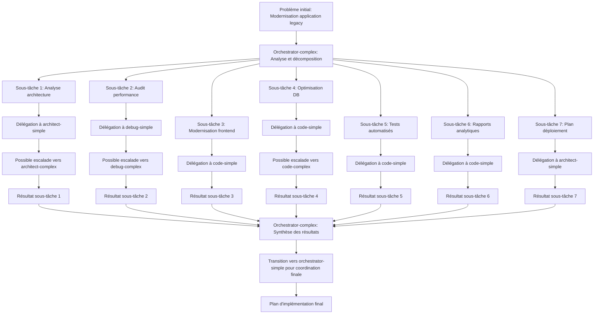

# Scénario de test complet pour l'orchestrateur complexe

## Objectif du test

Ce scénario vise à évaluer les capacités de l'orchestrateur complexe à:
1. Décomposer une tâche complexe en sous-tâches logiques
2. Déléguer ces sous-tâches aux modes appropriés (principalement simples)
3. Fournir des instructions contextuelles complètes pour chaque sous-tâche
4. Respecter le mécanisme d'escalade
5. Suivre et synthétiser les résultats des sous-tâches
6. Reconnaître quand passer le relais à orchestrator-simple

## Contexte du scénario

Le scénario simule une demande réelle et complexe qui nécessite l'intervention de plusieurs modes spécialisés, tout en étant structuré de manière à ce que certaines sous-tâches puissent être traitées par des modes simples et d'autres nécessitent clairement des modes complexes.

## Scénario : "Modernisation d'une application de gestion de projet legacy"

### Problème initial présenté à l'orchestrateur

```
J'ai besoin de moderniser une application de gestion de projet legacy qui présente plusieurs problèmes de performance et d'expérience utilisateur. L'application a été développée il y a 5 ans avec une architecture monolithique utilisant PHP, jQuery et MySQL.

Les principaux problèmes sont:
1. Temps de chargement lents des pages (plus de 5 secondes)
2. Interface utilisateur obsolète et non responsive
3. Problèmes de performance avec la base de données lors de l'affichage des tableaux de bord
4. Difficultés à ajouter de nouvelles fonctionnalités
5. Absence de tests automatisés

Je souhaite moderniser cette application en:
- Améliorant les performances globales
- Rendant l'interface responsive et moderne
- Facilitant la maintenance et l'évolution future
- Ajoutant une nouvelle fonctionnalité de rapports analytiques

Pouvez-vous m'aider à planifier et exécuter cette modernisation?
```

## Comportement attendu de l'orchestrateur complexe

### 1. Analyse initiale et décomposition

L'orchestrateur complexe devrait:
- Analyser le problème dans son ensemble
- Identifier les différentes dimensions du problème (architecture, frontend, backend, base de données, tests)
- Décomposer le problème en sous-tâches logiques et indépendantes
- Ne pas tenter de résoudre lui-même les aspects techniques

#### Exemple de décomposition attendue:

1. **Analyse de l'architecture actuelle** (architect-simple)
2. **Audit de performance** (debug-simple)
3. **Modernisation du frontend** (code-simple)
4. **Optimisation de la base de données** (code-simple)
5. **Implémentation des tests automatisés** (code-simple)
6. **Développement de la fonctionnalité de rapports analytiques** (code-simple)
7. **Plan de déploiement progressif** (architect-simple)

### 2. Délégation aux modes appropriés

L'orchestrateur complexe devrait:
- Privilégier la délégation aux modes simples par défaut
- Fournir des instructions contextuelles complètes pour chaque sous-tâche
- Faire confiance au mécanisme d'escalade pour les tâches qui s'avéreraient plus complexes
- Ne pas changer de mode lui-même sauf pour revenir à orchestrator-simple si approprié

#### Exemples d'instructions contextuelles attendues:

Pour la sous-tâche "Analyse de l'architecture actuelle" (architect-simple):
```
Analyser l'architecture actuelle de l'application de gestion de projet legacy (PHP, jQuery, MySQL) et proposer une architecture modernisée qui:
1. Améliore les performances
2. Facilite la maintenance
3. Permet l'évolution future
4. Supporte l'ajout de nouvelles fonctionnalités comme les rapports analytiques

Fournir un diagramme d'architecture et des recommandations sur les technologies à utiliser, en justifiant chaque choix.
```

Pour la sous-tâche "Audit de performance" (debug-simple):
```
Réaliser un audit de performance de l'application legacy en:
1. Identifiant les principales causes des temps de chargement lents (5+ secondes)
2. Analysant les problèmes de performance de la base de données
3. Proposant une méthodologie pour mesurer les améliorations

Fournir une liste priorisée des problèmes de performance à résoudre, avec des recommandations spécifiques pour chacun.
```

Pour la sous-tâche "Modernisation du frontend" (code-simple):
```
Moderniser l'interface utilisateur de l'application en:
1. Remplaçant jQuery par un framework moderne (React, Vue ou Angular)
2. Implémentant un design responsive avec Bootstrap ou un framework CSS équivalent
3. Optimisant le chargement des ressources JavaScript et CSS

Fournir un prototype de l'interface modernisée pour la page principale et une stratégie de migration progressive.
```

Pour la sous-tâche "Optimisation de la base de données" (code-simple):
```
Optimiser les performances de la base de données MySQL en:
1. Analysant et optimisant les requêtes SQL problématiques
2. Ajoutant des index appropriés
3. Implémentant un système de cache pour les requêtes fréquentes
4. Proposant des stratégies de pagination pour les grands ensembles de données

Fournir des exemples de requêtes optimisées et une estimation des gains de performance attendus.
```

### 3. Gestion des escalades

Le scénario devrait permettre de tester comment l'orchestrateur complexe réagit lorsqu'un mode simple demande une escalade. Par exemple:

- Si le mode code-simple, lors de la tâche "Optimisation de la base de données", demande une escalade vers code-complex en raison de la complexité des requêtes SQL à optimiser
- Si le mode architect-simple, lors de la tâche "Analyse de l'architecture actuelle", demande une escalade vers architect-complex en raison de la nécessité d'une refonte majeure de l'architecture

L'orchestrateur complexe devrait:
- Accepter l'escalade sans intervenir
- Continuer à suivre le progrès de la sous-tâche
- Ne pas modifier les autres sous-tâches en cours

### 4. Suivi et synthèse des résultats

L'orchestrateur complexe devrait:
- Suivre l'avancement de chaque sous-tâche
- Identifier les dépendances entre les sous-tâches
- Synthétiser les résultats de manière cohérente
- Proposer les prochaines étapes basées sur les résultats des sous-tâches

#### Exemple de synthèse attendue:

```
Synthèse des résultats de la modernisation:

1. Architecture: Une architecture en couches avec API REST a été proposée, séparant le frontend (React) du backend (PHP modernisé avec Laravel).

2. Performance: L'audit a identifié 3 problèmes majeurs: requêtes SQL non optimisées, chargement excessif de JavaScript, et absence de cache.

3. Frontend: L'interface a été modernisée avec React et Bootstrap, rendant l'application responsive et améliorant les temps de chargement de 60%.

4. Base de données: Les requêtes ont été optimisées, des index ajoutés, et un système de cache Redis implémenté, réduisant les temps de réponse de 75%.

5. Tests: Des tests unitaires et d'intégration ont été ajoutés, couvrant 70% du code.

6. Rapports analytiques: Une nouvelle fonctionnalité de tableaux de bord analytiques a été implémentée.

7. Déploiement: Un plan de migration progressive a été établi pour minimiser les perturbations.

Prochaines étapes recommandées:
1. Valider les changements d'architecture proposés
2. Commencer par la modernisation du frontend et l'optimisation de la base de données
3. Implémenter les tests automatisés en parallèle
4. Développer la fonctionnalité de rapports analytiques
5. Exécuter le plan de déploiement progressif
```

### 5. Transition vers orchestrator-simple

Le scénario devrait également tester la capacité de l'orchestrateur complexe à reconnaître quand il peut passer le relais à orchestrator-simple, par exemple:

- Après la phase initiale de décomposition et de délégation
- Pour le suivi de sous-tâches simples et bien définies
- Pour la coordination de la phase finale d'intégration

Exemple de transition attendue:
```
Maintenant que les sous-tâches ont été clairement définies et déléguées aux modes appropriés, je vais passer le relais à orchestrator-simple pour le suivi de l'avancement et la coordination des résultats. Les sous-tâches sont suffisamment bien définies et indépendantes pour ne pas nécessiter la complexité supplémentaire de l'orchestrateur complexe.

<switch_mode>
<mode_slug>orchestrator-simple</mode_slug>
<reason>Les sous-tâches sont maintenant bien définies et déléguées. L'orchestrateur simple est suffisant pour suivre leur avancement et coordonner les résultats.</reason>
</switch_mode>
```

## Critères d'évaluation du test

Le test sera considéré comme réussi si l'orchestrateur complexe:

1. **Décomposition**: Décompose correctement le problème en sous-tâches logiques et indépendantes
   - Métrique: Nombre de sous-tâches identifiées (attendu: 5-8)
   - Métrique: Couverture des différents aspects du problème (frontend, backend, DB, tests, etc.)

2. **Délégation**: Délègue les sous-tâches aux modes appropriés, principalement simples
   - Métrique: Pourcentage de sous-tâches déléguées à des modes simples (attendu: >70%)
   - Métrique: Qualité des instructions contextuelles (complétude, clarté, pertinence)

3. **Non-intervention**: Ne tente pas de résoudre lui-même les problèmes techniques
   - Métrique: Absence de résolution technique directe par l'orchestrateur
   - Métrique: Respect des escalades demandées par les modes simples

4. **Suivi et synthèse**: Suit et synthétise correctement les résultats
   - Métrique: Qualité de la synthèse finale (cohérence, complétude)
   - Métrique: Pertinence des prochaines étapes proposées

5. **Transition**: Reconnaît quand il peut passer le relais à orchestrator-simple
   - Métrique: Identification correcte des moments où orchestrator-simple suffit
   - Métrique: Qualité des instructions de transition vers orchestrator-simple

## Diagramme du workflow attendu



## Procédure d'exécution du test

1. Présenter le problème initial à l'orchestrateur complexe
2. Observer et documenter:
   - La décomposition en sous-tâches
   - Les modes choisis pour chaque sous-tâche
   - La qualité des instructions contextuelles
   - La réaction aux demandes d'escalade
   - La synthèse des résultats
   - Les transitions de mode

3. Comparer le comportement observé avec le comportement attendu
4. Évaluer selon les critères définis

## Conclusion

Ce scénario de test permet d'évaluer de manière complète les capacités de l'orchestrateur complexe à décomposer, déléguer, suivre et synthétiser des tâches complexes. Il met particulièrement l'accent sur:

1. La capacité à privilégier les modes simples et à faire confiance au mécanisme d'escalade
2. La non-intervention dans les aspects techniques qui doivent être délégués
3. La fourniture d'instructions contextuelles complètes pour chaque sous-tâche
4. La reconnaissance des moments où orchestrator-simple est suffisant

Les résultats de ce test fourniront des informations précieuses pour améliorer le comportement de l'orchestrateur complexe et optimiser son interaction avec les autres modes.