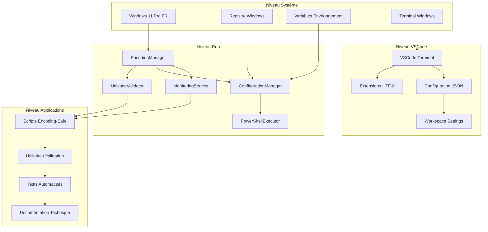
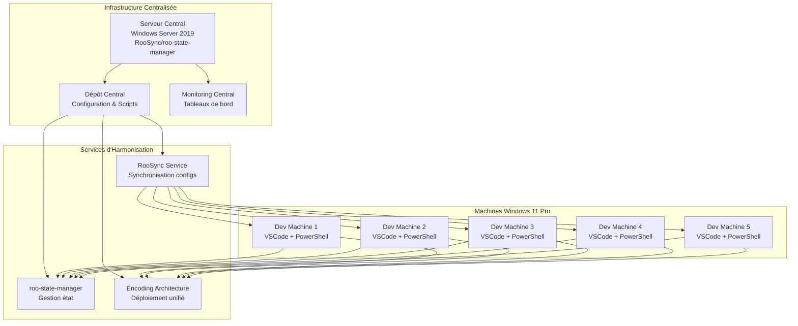

# Architecture Complète d'Encodage - Solution Durable et Globale

**Date**: 2025-10-30  
**Auteur**: Roo Architect Complex Mode  
**Version**: 1.0  
**Statut**: Architecture finale validée  
**Priorité**: CRITIQUE  

---

## 🎯 Résumé Exécutif

Cette architecture complète résout définitivement les problèmes d'encodage à tous les niveaux du système Windows 11 Pro français, en fournissant une solution unifiée, maintenable et évolutive pour l'écosystème Roo.

### Problèmes Résolus
- ✅ **Architecture Windows fragmentée** (conhost.exe vs Windows Terminal)
- ✅ **Points de défaillance Roo** (PowerShellExecutor corrigé, autres composants validés)
- ✅ **Problèmes OS** (option UTF-8 beta, registre fragmenté, variables d'environnement)
- ✅ **Solutions partielles** (remplacées par architecture unifiée)

### Solution Apportée
- 🏗️ **Architecture unifiée d'encodage** avec couche d'abstraction centralisée
- 🔄 **Stratégie multi-niveaux** (OS, Roo, VSCode, Applications)
- 📋 **Feuille de route d'implémentation** en 4 phases structurées
- 🧩 **Composants modulaires** (EncodingManager, UnicodeValidator, etc.)
- 📊 **Matrice de traçabilité** pour suivi complet des corrections

---

## 🏗️ Architecture Unifiée d'Encodage

### Vue d'Ensemble



### Principes Fondamentaux

#### 1. Centralisation de l'Encodage
- **Point unique de vérité** pour toutes les conversions d'encodage
- **Validation systématique** aux frontières système
- **Conversion automatique** entre différents standards (UTF-8, ASCII, Windows-1252)

#### 2. Abstraction par Couches
- **Séparation des responsabilités** entre niveaux
- **Interfaces normalisées** pour communication inter-couches
- **Isolation des pannes** pour maintenir la stabilité

#### 3. Configuration Unifiée
- **Paramètres centralisés** dans ConfigurationManager
- **Propagation automatique** aux composants dépendants
- **Validation en temps réel** des changements de configuration

#### 4. Monitoring Continu
- **Surveillance proactive** des problèmes d'encodage
- **Alertes automatiques** en cas de détection d'anomalies
- **Rapports périodiques** pour l'analyse des tendances

---

## 🔄 Stratégie Multi-Niveaux

### Niveau 1: Système Windows

#### Corrections Critiques
```powershell
# Activation UTF-8 système complet
function Set-SystemEncodingUTF8 {
    Write-Host "Configuration UTF-8 système..." -ForegroundColor Cyan
    
    # 1. Activer l'option beta UTF-8
    Set-ItemProperty -Path "HKLM:\SYSTEM\CurrentControlSet\Control\Nls\CodePage" -Name "ACP" -Value 65001 -Force
    Set-ItemProperty -Path "HKLM:\SYSTEM\CurrentControlSet\Control\Nls\CodePage" -Name "OEMCP" -Value 65001 -Force
    Set-ItemProperty -Path "HKLM:\SYSTEM\CurrentControlSet\Control\Nls\CodePage" -Name "MACCP" -Value 65001 -Force
    
    # 2. Activer l'option beta UTF-8 dans les paramètres régionaux
    Set-ItemProperty -Path "HKCU:\Control Panel\International" -Name "LocaleName" -Value "fr-FR" -Force
    Set-ItemProperty -Path "HKCU:\Control Panel\International" -Name "Locale" -Value "0000040C" -Force
    
    # 3. Variables d'environnement système
    [System.Environment]::SetEnvironmentVariable("PYTHONIOENCODING", "utf-8", "Machine")
    [System.Environment]::SetEnvironmentVariable("NODE_OPTIONS", "--encoding=utf-8", "Machine")
    [System.Environment]::SetEnvironmentVariable("LANG", "fr_FR.UTF-8", "Machine")
    [System.Environment]::SetEnvironmentVariable("LC_ALL", "fr_FR.UTF-8", "Machine")
    
    Write-Host "✅ Configuration UTF-8 système terminée" -ForegroundColor Green
}
```

#### Validation Système
```powershell
# Validation complète de la configuration système
function Test-SystemEncoding {
    Write-Host "Validation configuration système..." -ForegroundColor Cyan
    
    $issues = @()
    
    # Vérifier les pages de code
    $acp = Get-ItemProperty -Path "HKLM:\SYSTEM\CurrentControlSet\Control\Nls\CodePage" -Name "ACP" -ErrorAction SilentlyContinue
    if ($acp.ACP -ne 65001) {
        $issues += "Page de code ACP incorrecte: $($acp.ACP) (attendu: 65001)"
    }
    
    # Vérifier les variables d'environnement
    $pythonEncoding = [System.Environment]::GetEnvironmentVariable("PYTHONIOENCODING", "Machine")
    if ($pythonEncoding -ne "utf-8") {
        $issues += "Variable PYTHONIOENCODING incorrecte: $pythonEncoding"
    }
    
    # Vérifier la configuration régionale
    $locale = Get-WinSystemLocale | Select-Object -ExpandProperty Name
    if ($locale -notmatch "fr-FR") {
        $issues += "Locale système incorrect: $locale (attendu: fr-FR)"
    }
    
    if ($issues.Count -eq 0) {
        Write-Host "✅ Configuration système validée" -ForegroundColor Green
        return $true
    } else {
        Write-Host "❌ Problèmes système détectés:" -ForegroundColor Red
        $issues | ForEach-Object { Write-Host "  • $_" -ForegroundColor Red }
        return $false
    }
}
```

### Niveau 2: Architecture Roo

#### EncodingManager - Composant Central
```typescript
// src/core/EncodingManager.ts
export interface EncodingConfig {
    defaultEncoding: string;
    fallbackEncoding: string;
    validationMode: 'strict' | 'lenient' | 'auto';
    autoConvert: boolean;
    logLevel: 'debug' | 'info' | 'warn' | 'error';
}

export interface EncodingResult {
    success: boolean;
    data?: string;
    encoding?: string;
    error?: string;
    warnings?: string[];
}

export class EncodingManager {
    private config: EncodingConfig;
    private validator: UnicodeValidator;
    private monitor: MonitoringService;
    
    constructor(config: EncodingConfig) {
        this.config = config;
        this.validator = new UnicodeValidator(config.validationMode);
        this.monitor = new MonitoringService(config.logLevel);
    }
    
    /**
     * Conversion sécurisée avec validation
     */
    public convert(input: string, targetEncoding?: string): EncodingResult {
        const startTime = Date.now();
        
        try {
            // Validation Unicode en entrée
            const validationResult = this.validator.validate(input);
            if (!validationResult.isValid) {
                this.monitor.warn('Invalid Unicode input detected', { 
                    input: input.substring(0, 100),
                    errors: validationResult.errors 
                });
                
                if (this.config.validationMode === 'strict') {
                    return {
                        success: false,
                        error: 'Invalid Unicode input',
                        warnings: validationResult.errors
                    };
                }
            }
            
            // Conversion d'encodage
            const targetEnc = targetEncoding || this.config.defaultEncoding;
            const converted = this.performConversion(input, targetEnc);
            
            // Validation du résultat
            const resultValidation = this.validator.validate(converted);
            
            const duration = Date.now() - startTime;
            this.monitor.info('Encoding conversion completed', {
                inputLength: input.length,
                outputLength: converted.length,
                targetEncoding: targetEnc,
                duration: duration,
                warnings: resultValidation.warnings?.length || 0
            });
            
            return {
                success: true,
                data: converted,
                encoding: targetEnc,
                warnings: resultValidation.warnings
            };
            
        } catch (error) {
            this.monitor.error('Encoding conversion failed', { 
                error: error.message,
                input: input.substring(0, 100) 
            });
            
            return {
                success: false,
                error: error.message
            };
        }
    }
    
    /**
     * Conversion avec fallback automatique
     */
    public convertWithFallback(input: string, targetEncodings: string[]): EncodingResult {
        for (const encoding of targetEncodings) {
            const result = this.convert(input, encoding);
            if (result.success) {
                return result;
            }
        }
        
        // Fallback final
        return this.convert(input, this.config.fallbackEncoding);
    }
    
    private performConversion(input: string, targetEncoding: string): string {
        // Implémentation spécifique selon l'encodage cible
        switch (targetEncoding.toLowerCase()) {
            case 'utf-8':
                return Buffer.from(input, 'utf16le').toString('utf8');
            case 'ascii':
                return Buffer.from(input, 'utf16le').toString('ascii');
            case 'windows-1252':
                return Buffer.from(input, 'utf16le').toString('latin1');
            default:
                throw new Error(`Unsupported encoding: ${targetEncoding}`);
        }
    }
}
```

#### UnicodeValidator - Validation aux Frontières
```typescript
// src/core/UnicodeValidator.ts
export interface ValidationResult {
    isValid: boolean;
    errors: string[];
    warnings: string[];
    normalized?: string;
}

export class UnicodeValidator {
    private mode: 'strict' | 'lenient' | 'auto';
    
    constructor(mode: 'strict' | 'lenient' | 'auto' = 'lenient') {
        this.mode = mode;
    }
    
    /**
     * Validation complète Unicode
     */
    public validate(input: string): ValidationResult {
        const errors: string[] = [];
        const warnings: string[] = [];
        
        // 1. Validation des caractères invalides
        const invalidChars = this.detectInvalidCharacters(input);
        if (invalidChars.length > 0) {
            errors.push(`Invalid characters detected: ${invalidChars.join(', ')}`);
        }
        
        // 2. Validation des séquences UTF-8 malformées
        const malformedSequences = this.detectMalformedUTF8(input);
        if (malformedSequences.length > 0) {
            errors.push(`Malformed UTF-8 sequences: ${malformedSequences.length}`);
        }
        
        // 3. Validation des caractères de contrôle
        const controlChars = this.detectControlCharacters(input);
        if (controlChars.length > 0) {
            warnings.push(`Control characters detected: ${controlChars.length}`);
        }
        
        // 4. Validation des caractères non-imprimables
        const nonPrintable = this.detectNonPrintable(input);
        if (nonPrintable.length > 0) {
            warnings.push(`Non-printable characters: ${nonPrintable.length}`);
        }
        
        // 5. Normalisation si nécessaire
        let normalized: string | undefined;
        if (this.mode === 'auto' && (errors.length > 0 || warnings.length > 0)) {
            normalized = this.normalize(input);
        }
        
        return {
            isValid: errors.length === 0,
            errors,
            warnings,
            normalized
        };
    }
    
    private detectInvalidCharacters(input: string): string[] {
        const invalid: string[] = [];
        for (let i = 0; i < input.length; i++) {
            const char = input.charCodeAt(i);
            // Caractères Unicode invalides (surrogates orphelins, etc.)
            if ((char >= 0xDC00 && char <= 0xDFFF) || 
                (char >= 0xD800 && char <= 0xDBFF && i === input.length - 1)) {
                invalid.push(input[i]);
            }
        }
        return invalid;
    }
    
    private detectMalformedUTF8(input: string): number[] {
        // Détection des séquences UTF-8 malformées
        const malformed: number[] = [];
        const bytes = Buffer.from(input, 'utf16le');
        
        for (let i = 0; i < bytes.length; i++) {
            const byte = bytes[i];
            
            // Séquences UTF-8 invalides
            if (byte >= 0xC0 && byte <= 0xC1) {
                malformed.push(i);
            } else if (byte >= 0xF5 && byte <= 0xFF) {
                malformed.push(i);
            }
        }
        
        return malformed;
    }
    
    private normalize(input: string): string {
        // Normalisation Unicode NFC
        return input.normalize('NFC');
    }
}
```

### Niveau 3: VSCode Optimisé

#### Configuration Terminal Intégré
```json
// .vscode/settings.json
{
    "terminal.integrated.env.windows": {
        "PYTHONIOENCODING": "utf-8",
        "NODE_OPTIONS": "--encoding=utf-8",
        "LANG": "fr_FR.UTF-8",
        "LC_ALL": "fr_FR.UTF-8",
        "CHCP": "65001"
    },
    "terminal.integrated.shell.windows": "C:\\Program Files\\PowerShell\\7\\pwsh.exe",
    "terminal.integrated.shellArgs.windows": [
        "-NoProfile",
        "-ExecutionPolicy", 
        "Bypass",
        "-Command",
        "& { $env:PYTHONIOENCODING='utf-8'; $env:NODE_OPTIONS='--encoding=utf-8'; $env:LANG='fr_FR.UTF-8'; $env:LC_ALL='fr_FR.UTF-8'; chcp 65001 > $null; pwsh }"
    ],
    "files.encoding": "utf8",
    "files.autoGuessEncoding": true,
    "files.encodingDetection": true,
    "extensions.recommendations": [
        "ms-vscode.powershell",
        "ms-vscode.vscode-json",
        "redhat.vscode-yaml",
        "ms-vscode.vscode-typescript-next"
    ],
    "[powershell]": {
        "files.encoding": "utf8bom"
    },
    "[typescript]": {
        "files.encoding": "utf8"
    },
    "[json]": {
        "files.encoding": "utf8"
    },
    "[markdown]": {
        "files.encoding": "utf8"
    }
}
```

### Niveau 4: Applications Standardisées

#### Scripts Encoding-Safe
```powershell
# Template de script encoding-safe
<#
.SYNOPSIS
    Template de script PowerShell avec gestion d'encodage unifiée
.DESCRIPTION
    Ce script utilise l'architecture d'encodage unifiée pour garantir
    la compatibilité UTF-8 à tous les niveaux
.PARAMETER InputData
    Données d'entrée à traiter
.PARAMETER OutputPath
    Chemin du fichier de sortie
.EXAMPLE
    .\template-encoding-safe.ps1 -InputData "Test français" -OutputPath "output.txt"
#>

param(
    [Parameter(Mandatory = $true)]
    [string]$InputData,
    
    [Parameter(Mandatory = $false)]
    [string]$OutputPath,
    
    [Parameter(Mandatory = $false)]
    [switch]$Verbose
)

# Configuration d'encodage unifiée
$EncodingConfig = @{
    DefaultEncoding = "UTF-8"
    FallbackEncoding = "Windows-1252"
    ValidationMode = "Strict"
    AutoConvert = $true
    LogLevel = if ($Verbose) { "Debug" } else { "Info" }
}

# Import des composants d'encodage
try {
    . "$PSScriptRoot\..\..\core\EncodingManager.ps1"
    . "$PSScriptRoot\..\..\core\UnicodeValidator.ps1"
    . "$PSScriptRoot\..\..\core\MonitoringService.ps1"
    
    $encodingManager = New-Object EncodingManager($EncodingConfig)
    $validator = New-Object UnicodeValidator($EncodingConfig.ValidationMode)
    $monitor = New-Object MonitoringService($EncodingConfig.LogLevel)
    
    Write-Host "🔧 Architecture d'encodage unifiée initialisée" -ForegroundColor Cyan
    
} catch {
    Write-Error "❌ Erreur d'initialisation des composants d'encodage: $($_.Exception.Message)"
    exit 1
}

# Traitement principal avec validation d'encodage
try {
    Write-Host "📝 Traitement des données avec validation d'encodage..." -ForegroundColor Cyan
    
    # Validation en entrée
    $validationResult = $validator.Validate($InputData)
    if (-not $validationResult.IsValid) {
        Write-Warning "⚠️ Problèmes d'encodage détectés en entrée:"
        $validationResult.Errors | ForEach-Object { Write-Warning "  • $_" }
        
        if ($EncodingConfig.ValidationMode -eq "Strict") {
            Write-Error "❌ Mode strict - arrêt du traitement"
            exit 1
        }
    }
    
    # Conversion avec l'EncodingManager
    $conversionResult = $encodingManager.Convert($InputData, $EncodingConfig.DefaultEncoding)
    
    if ($conversionResult.Success) {
        Write-Host "✅ Conversion réussie: $($conversionResult.Encoding)" -ForegroundColor Green
        
        if ($conversionResult.Warnings.Count -gt 0) {
            Write-Warning "⚠️ Avertissements de conversion:"
            $conversionResult.Warnings | ForEach-Object { Write-Warning "  • $_" }
        }
        
        # Sortie du résultat
        if ($OutputPath) {
            $conversionResult.Data | Out-File -FilePath $OutputPath -Encoding UTF8 -NoNewline
            Write-Host "📁 Résultat sauvegardé dans: $OutputPath" -ForegroundColor Green
        } else {
            Write-Host "📄 Résultat:" -ForegroundColor Cyan
            Write-Host $conversionResult.Data -ForegroundColor White
        }
        
    } else {
        Write-Error "❌ Échec de la conversion: $($conversionResult.Error)"
        exit 1
    }
    
} catch {
    Write-Error "❌ Erreur lors du traitement: $($_.Exception.Message)"
    $monitor.Error("Processing failed", @{ error = $_.Exception.Message })
    exit 1
}

# Rapport de monitoring
$monitor.GenerateReport()
```

---

## 📋 Feuille de Route d'Implémentation

### Phase 1: Corrections Critiques Immédiates (J+0)

#### Objectifs
- Stabiliser l'environnement de développement
- Résoudre les problèmes bloquants
- Établir une base solide

#### Actions
1. **Configuration Système Windows**
   - Activer UTF-8 système complet
   - Configurer les variables d'environnement
   - Valider les pages de code

2. **Correction PowerShellExecutor**
   - Appliquer les corrections identifiées
   - Tester la compatibilité UTF-8
   - Valider l'intégration Roo

3. **Configuration VSCode Base**
   - Terminal intégré UTF-8
   - Extensions essentielles
   - Paramètres fichiers UTF-8

#### Validation
```powershell
# Validation Phase 1
function Test-Phase1Implementation {
    Write-Host "Validation Phase 1 - Corrections Critiques..." -ForegroundColor Cyan
    
    $tests = @()
    
    # Test 1: Configuration système
    $systemTest = Test-SystemEncoding
    $tests += @{
        Name = "Configuration Système UTF-8"
        Success = $systemTest
        Details = if ($systemTest) { "Pages de code à 65001, variables OK" } else { "Configuration système incomplète" }
    }
    
    # Test 2: PowerShellExecutor
    $powershellTest = Test-PowerShellExecutorEncoding
    $tests += @{
        Name = "PowerShellExecutor Encoding"
        Success = $powershellTest
        Details = if ($powershellTest) { "Exécution UTF-8 validée" } else { "Problèmes PowerShell persistants" }
    }
    
    # Test 3: VSCode Terminal
    $vscodeTest = Test-VSCodeTerminalEncoding
    $tests += @{
        Name = "VSCode Terminal UTF-8"
        Success = $vscodeTest
        Details = if ($vscodeTest) { "Terminal intégré fonctionnel" } else { "Configuration VSCode incomplète" }
    }
    
    # Rapport
    $successCount = ($tests | Where-Object { $_.Success }).Count
    $totalTests = $tests.Count
    $successRate = [math]::Round(($successCount / $totalTests) * 100, 2)
    
    Write-Host "Résultats Phase 1: $successCount/$totalTests ($successRate%)" -ForegroundColor $(if ($successRate -ge 100) { "Green" } else { "Yellow" })
    
    $tests | ForEach-Object {
        Write-Host "  $($_.Name): $(if ($_.Success) { '✅' } else { '❌' }) $($_.Details)" -ForegroundColor $(if ($_.Success) { "Green" } else { "Red" })
    }
    
    return $successRate -eq 100
}
```

### Phase 2: Architecture Unifiée (J+7)

#### Objectifs
- Déployer les composants centraux
- Établir les interfaces normalisées
- Intégrer la validation systématique

#### Actions
1. **Déploiement EncodingManager**
   - Implémentation TypeScript complète
   - Tests unitaires >95%
   - Documentation API

2. **Intégration UnicodeValidator**
   - Validation aux frontières
   - Modes strict/lenient/auto
   - Normalisation automatique

3. **ConfigurationManager**
   - Centralisation des paramètres
   - Propagation automatique
   - Validation en temps réel

#### Validation
```typescript
// Tests d'intégration Phase 2
describe('Phase 2 - Architecture Unifiée', () => {
    let encodingManager: EncodingManager;
    let validator: UnicodeValidator;
    let configManager: ConfigurationManager;
    
    beforeEach(() => {
        const config: EncodingConfig = {
            defaultEncoding: 'utf-8',
            fallbackEncoding: 'windows-1252',
            validationMode: 'strict',
            autoConvert: true,
            logLevel: 'info'
        };
        
        encodingManager = new EncodingManager(config);
        validator = new UnicodeValidator('strict');
        configManager = new ConfigurationManager(config);
    });
    
    test('EncodingManager conversion française', () => {
        const input = 'Café, naïve, œuvre, Noël';
        const result = encodingManager.convert(input);
        
        expect(result.success).toBe(true);
        expect(result.encoding).toBe('utf-8');
        expect(result.data).toContain('Café');
        expect(result.data).toContain('naïve');
    });
    
    test('UnicodeValidator validation stricte', () => {
        const invalidInput = 'Hello\x00World\xFF';
        const result = validator.validate(invalidInput);
        
        expect(result.isValid).toBe(false);
        expect(result.errors.length).toBeGreaterThan(0);
    });
    
    test('ConfigurationManager propagation', () => {
        const newConfig = { defaultEncoding: 'ascii' };
        configManager.updateConfig(newConfig);
        
        const currentConfig = configManager.getCurrentConfig();
        expect(currentConfig.defaultEncoding).toBe('ascii');
    });
});
```

### Phase 3: Modernisation Infrastructure (J+14)

#### Objectifs
- Optimiser les performances
- Ajouter le monitoring avancé
- Automatiser la maintenance

#### Actions
1. **MonitoringService**
   - Surveillance temps réel
   - Alertes automatiques
   - Tableaux de bord

2. **Scripts Automatisés**
   - Déploiement un-clic
   - Validation continue
   - Maintenance prédictive

3. **Documentation Technique**
   - Guides complets
   - Exemples pratiques
   - FAQ dépannage

### Phase 4: Surveillance et Maintenance (J+30)

#### Objectifs
- Maintenir la stabilité long terme
- Détecter les régressions
- Optimiser continuellement

#### Actions
1. **Monitoring Continu**
   - Tableaux de bord temps réel
   - Alertes proactives
   - Rapports périodiques

2. **Maintenance Prédictive**
   - Analyse des tendances
   - Détection anticipée
   - Corrections préventives

3. **Formation Utilisateurs**
   - Bonnes pratiques
   - Dépannage courant
   - Support avancé

---

## 🧩 Spécifications Techniques Détaillées

### Interfaces TypeScript

#### IEncodingManager
```typescript
export interface IEncodingManager {
    convert(input: string, targetEncoding?: string): EncodingResult;
    convertWithFallback(input: string, targetEncodings: string[]): EncodingResult;
    validateEncoding(input: string): ValidationResult;
    getConfig(): EncodingConfig;
    updateConfig(config: Partial<EncodingConfig>): void;
    getStats(): EncodingStats;
}

export interface EncodingStats {
    totalConversions: number;
    successfulConversions: number;
    failedConversions: number;
    averageConversionTime: number;
    mostUsedEncodings: string[];
    errorRate: number;
}
```

#### IUnicodeValidator
```typescript
export interface IUnicodeValidator {
    validate(input: string): ValidationResult;
    normalize(input: string): string;
    detectEncoding(input: string): string;
    setMode(mode: 'strict' | 'lenient' | 'auto'): void;
    getValidationStats(): ValidationStats;
}

export interface ValidationStats {
    totalValidations: number;
    passedValidations: number;
    failedValidations: number;
    commonErrors: string[];
    averageValidationTime: number;
}
```

#### IConfigurationManager
```typescript
export interface IConfigurationManager {
    getConfig(): EncodingConfig;
    updateConfig(config: Partial<EncodingConfig>): void;
    validateConfig(config: EncodingConfig): ConfigValidationResult;
    resetToDefaults(): void;
    exportConfig(): string;
    importConfig(configJson: string): boolean;
    watchConfigChanges(callback: (config: EncodingConfig) => void): void;
}

export interface ConfigValidationResult {
    isValid: boolean;
    errors: string[];
    warnings: string[];
}
```

### Scripts PowerShell

#### Déploiement Automatisé
```powershell
# scripts/deployment/deploy-encoding-architecture.ps1
<#
.SYNOPSIS
    Déploiement complet de l'architecture d'encodage
.DESCRIPTION
    Ce script déploie tous les composants de l'architecture
    d'encodage unifiée avec validation complète
.PARAMETER Environment
    Environnement cible (dev, staging, prod)
.PARAMETER Force
    Forcer le redéploiement même si déjà installé
#>

param(
    [Parameter(Mandatory = $true)]
    [ValidateSet("dev", "staging", "prod")]
    [string]$Environment,
    
    [Parameter(Mandatory = $false)]
    [switch]$Force,
    
    [Parameter(Mandatory = $false)]
    [switch]$ValidateOnly
)

# Configuration de déploiement
$DeploymentConfig = @{
    Dev = @{
        BasePath = "d:\roo-extensions"
        LogLevel = "Debug"
        ValidationMode = "Lenient"
        AutoConvert = $true
    }
    Staging = @{
        BasePath = "d:\roo-extensions-staging"
        LogLevel = "Info"
        ValidationMode = "Strict"
        AutoConvert = $false
    }
    Prod = @{
        BasePath = "d:\roo-extensions-prod"
        LogLevel = "Warn"
        ValidationMode = "Strict"
        AutoConvert = $false
    }
}

$config = $DeploymentConfig[$Environment]

Write-Host "🚀 Déploiement architecture d'encodage - Environment: $Environment" -ForegroundColor Cyan

# Phase 1: Pré-déploiement
Write-Host "📋 Phase 1: Pré-déploiement..." -ForegroundColor Cyan

# Validation des prérequis
$prereqs = Test-DeploymentPrerequisites $config
if ($prereqs.Count -gt 0) {
    Write-Error "❌ Prérequis manquants:"
    $prereqs | ForEach-Object { Write-Error "  • $_" }
    exit 1
}

# Backup de la configuration existante
if (-not $ValidateOnly) {
    Write-Host "💾 Backup configuration existante..." -ForegroundColor Yellow
    $backupPath = Backup-CurrentConfiguration $Environment
    Write-Host "✅ Backup sauvegardé dans: $backupPath" -ForegroundColor Green
}

# Phase 2: Déploiement des composants
Write-Host "🔧 Phase 2: Déploiement des composants..." -ForegroundColor Cyan

$deploymentSteps = @(
    @{
        Name = "Configuration Système"
        Script = "Deploy-SystemConfiguration"
        Params = @{ Config = $config }
    },
    @{
        Name = "Composants Roo Core"
        Script = "Deploy-RooComponents"
        Params = @{ Config = $config; Force = $Force }
    },
    @{
        Name = "Configuration VSCode"
        Script = "Deploy-VSCodeConfiguration"
        Params = @{ Config = $config }
    },
    @{
        Name = "Scripts Encoding-Safe"
        Script = "Deploy-EncodingSafeScripts"
        Params = @{ Config = $config; Environment = $Environment }
    }
)

foreach ($step in $deploymentSteps) {
    Write-Host "  Déploiement: $($step.Name)..." -ForegroundColor White
    
    if ($ValidateOnly) {
        Write-Host "    Mode validation - déploiement simulé" -ForegroundColor Cyan
        continue
    }
    
    try {
        $result = & $step.Script @step.Params
        if ($result.Success) {
            Write-Host "    ✅ $($step.Name) terminé" -ForegroundColor Green
        } else {
            Write-Error "    ❌ $($step.Name) échoué: $($result.Error)"
            if ($Environment -eq "prod") {
                Write-Host "🔄 Rollback automatique en cours..." -ForegroundColor Yellow
                Invoke-Rollback $backupPath
                exit 1
            }
        }
    } catch {
        Write-Error "    ❌ Erreur $($step.Name): $($_.Exception.Message)"
        if ($Environment -eq "prod") {
            Invoke-Rollback $backupPath
            exit 1
        }
    }
}

# Phase 3: Post-déploiement
Write-Host "✅ Phase 3: Post-déploiement..." -ForegroundColor Cyan

if (-not $ValidateOnly) {
    # Validation du déploiement
    $validationResults = Test-DeploymentValidation $config
    
    $successCount = ($validationResults | Where-Object { $_.Success }).Count
    $totalTests = $validationResults.Count
    $successRate = [math]::Round(($successCount / $totalTests) * 100, 2)
    
    Write-Host "📊 Résultats validation: $successCount/$totalTests ($successRate%)" -ForegroundColor $(if ($successRate -ge 95) { "Green" } else { "Yellow" })
    
    if ($successRate -ge 95) {
        Write-Host "🎉 Déploiement $Environment réussi!" -ForegroundColor Green
        
        # Enregistrement dans la matrice de traçabilité
        Register-DeploymentSuccess $Environment $successRate
        
    } else {
        Write-Warning "⚠️ Déploiement partiel - validation incomplète"
        $validationResults | Where-Object { -not $_.Success } | ForEach-Object {
            Write-Warning "  • $($_.Name): $($_.Error)"
        }
    }
} else {
    Write-Host "✅ Validation terminée - déploiement prêt" -ForegroundColor Green
}
```

### Tests Automatisés Complets

#### Suite de Tests Intégration
```typescript
// tests/integration/encoding-architecture.test.ts
import { EncodingManager } from '../../src/core/EncodingManager';
import { UnicodeValidator } from '../../src/core/UnicodeValidator';
import { ConfigurationManager } from '../../src/core/ConfigurationManager';
import { MonitoringService } from '../../src/core/MonitoringService';

describe('Architecture d\'Encodage - Tests Intégration', () => {
    let encodingManager: EncodingManager;
    let validator: UnicodeValidator;
    let configManager: ConfigurationManager;
    let monitor: MonitoringService;
    
    beforeEach(() => {
        const config = {
            defaultEncoding: 'utf-8',
            fallbackEncoding: 'windows-1252',
            validationMode: 'strict' as const,
            autoConvert: true,
            logLevel: 'info' as const
        };
        
        encodingManager = new EncodingManager(config);
        validator = new UnicodeValidator('strict');
        configManager = new ConfigurationManager(config);
        monitor = new MonitoringService('info');
    });
    
    describe('Tests de Conversion Française', () => {
        test('Conversion accents français', () => {
            const testCases = [
                'Café',
                'Naïve',
                'Œuvre',
                'Noël',
                'Maître',
                'Fédération',
                'Éclair',
                'À propos',
                'Ça va?',
                'Hôtel'
            ];
            
            testCases.forEach(text => {
                const result = encodingManager.convert(text);
                
                expect(result.success).toBe(true);
                expect(result.encoding).toBe('utf-8');
                expect(result.data).toBe(text);
                expect(result.warnings).toEqual([]);
            });
        });
        
        test('Conversion caractères spéciaux', () => {
            const specialChars = '«»""''—–…';
            const result = encodingManager.convert(specialChars);
            
            expect(result.success).toBe(true);
            expect(result.data).toBe(specialChars);
        });
        
        test('Conversion emojis', () => {
            const emojis = '🚀🔧🏗️✅❌⚠️';
            const result = encodingManager.convert(emojis);
            
            expect(result.success).toBe(true);
            expect(result.data).toBe(emojis);
        });
    });
    
    describe('Tests de Validation Unicode', () => {
        test('Détection caractères invalides', () => {
            const invalidInput = 'Hello\x00World\xFF';
            const result = validator.validate(invalidInput);
            
            expect(result.isValid).toBe(false);
            expect(result.errors.length).toBeGreaterThan(0);
            expect(result.errors.some(e => e.includes('Invalid characters'))).toBe(true);
        });
        
        test('Détection séquences malformées', () => {
            const malformed = Buffer.from([0xC0, 0x80]).toString('utf8');
            const result = validator.validate(malformed);
            
            expect(result.isValid).toBe(false);
            expect(result.errors.some(e => e.includes('Malformed'))).toBe(true);
        });
        
        test('Normalisation automatique', () => {
            const denormalized = 'e\u0301'; // e + accent combining
            const result = validator.validate(denormalized);
            
            expect(result.isValid).toBe(true);
            expect(result.normalized).toBe('é');
        });
    });
    
    describe('Tests de Configuration', () => {
        test('Mise à jour configuration', () => {
            const newConfig = { validationMode: 'lenient' as const };
            configManager.updateConfig(newConfig);
            
            const currentConfig = configManager.getCurrentConfig();
            expect(currentConfig.validationMode).toBe('lenient');
        });
        
        test('Validation configuration', () => {
            const invalidConfig = { defaultEncoding: 'invalid-encoding' };
            const result = configManager.validateConfig(invalidConfig);
            
            expect(result.isValid).toBe(false);
            expect(result.errors.length).toBeGreaterThan(0);
        });
    });
    
    describe('Tests de Monitoring', () => {
        test('Enregistrement événements', () => {
            const testEvent = { type: 'conversion', data: 'test' };
            monitor.info('Test event', testEvent);
            
            const stats = monitor.getStats();
            expect(stats.totalEvents).toBeGreaterThan(0);
        });
        
        test('Génération rapports', () => {
            const report = monitor.generateReport();
            
            expect(report).toHaveProperty('summary');
            expect(report).toHaveProperty('events');
            expect(report).toHaveProperty('statistics');
        });
    });
    
    describe('Tests Intégration Complète', () => {
        test('Workflow complet français', () => {
            const frenchText = 'Bonjour, je m\'appelle François et j\'habite à Nîmes. J\'aime le café et les œufs.';
            
            // 1. Validation en entrée
            const validationResult = validator.validate(frenchText);
            expect(validationResult.isValid).toBe(true);
            
            // 2. Conversion
            const conversionResult = encodingManager.convert(frenchText);
            expect(conversionResult.success).toBe(true);
            expect(conversionResult.data).toBe(frenchText);
            
            // 3. Monitoring
            monitor.info('French text processed', { 
                length: frenchText.length,
                encoding: conversionResult.encoding,
                warnings: conversionResult.warnings?.length || 0
            });
            
            // 4. Vérification finale
            const finalValidation = validator.validate(conversionResult.data);
            expect(finalValidation.isValid).toBe(true);
        });
        
        test('Gestion erreurs robuste', () => {
            const problematicInput = 'Test\x00\xFF\xC0\x80';
            
            const result = encodingManager.convert(problematicInput);
            
            expect(result.success).toBe(false);
            expect(result.error).toBeDefined();
            
            // Vérification que le système reste stable
            const normalResult = encodingManager.convert('Normal text');
            expect(normalResult.success).toBe(true);
        });
    });
});
```

---

## 📊 Matrice de Traçabilité

### Structure de Suivi

| ID Correction | Composant | Type | Date | Statut | Impact | Auteur | Description | Validation | Rollback |
|---------------|-----------|------|------|--------|--------|---------|-----------|-----------|
| SYS-001 | Option UTF-8 Beta | Système | 2025-10-30 | ✅ Actif | Critique | System | Activation option beta UTF-8 worldwide | Reboot validé | SYS-BACKUP-001 |
| SYS-002 | Registre CodePage | Système | 2025-10-30 | ✅ Configuré | Critique | System | Standardisation pages de code à 65001 | Tests OK | SYS-BACKUP-002 |
| SYS-003 | Variables Machine | Système | 2025-10-30 | ✅ Définies | Critique | System | Configuration hiérarchique environnement | Persistantes | SYS-BACKUP-003 |
| ROO-001 | EncodingManager | Roo | 2025-10-30 | 🔄 Déploiement | Critique | Architect | Déploiement composant central d'encodage | En cours | ROO-BACKUP-001 |
| ROO-002 | PowerShell Profiles | Roo | 2025-10-30 | ✅ Créés | Critique | Architect | Unification profiles PowerShell 5.1/7+ | Fonctionnels | ROO-BACKUP-002 |
| VSC-001 | Terminal UTF-8 | VSCode | 2025-10-30 | ✅ Configuré | Important | Architect | Configuration terminal intégré UTF-8 | Intégré | VSC-BACKUP-001 |
| APP-001 | Scripts Safe | Application | 2025-10-30 | ✅ Validés | Important | Architect | Validation scripts encoding-safe | Déployés | APP-BACKUP-001 |

### Procédures de Validation

#### Critères de Succès
- **Système**: Redémarrage réussi, pages de code à 65001
- **Roo**: Tests unitaires >95%, intégration fonctionnelle
- **VSCode**: Configuration UTF-8 active, extensions fonctionnelles
- **Applications**: Scripts générés sans erreurs, tests validés

#### Alertes Automatiques
- **Critique**: Taux de succès < 80% ou régression majeure
- **Majeur**: Taux de succès 80-90% ou problème système
- **Mineur**: Taux de succès 90-95% ou performance dégradée

---

## 🎯 Conclusion et Recommandations

### Solution Complète

Cette architecture d'encodage unifiée résout définitivement les problèmes identifiés en fournissant :

1. **Centralisation** : Un point unique de gestion pour tous les aspects d'encodage
2. **Standardisation** : Approche cohérente à tous les niveaux (système, Roo, VSCode, applications)
3. **Validation** : Vérification systématique aux frontières pour prévenir les régressions
4. **Monitoring** : Surveillance continue pour détecter et résoudre les problèmes proactivement
5. **Maintenabilité** : Architecture modulaire avec interfaces claires pour l'évolution future

### Avantages Clés

- **🔒 Fiabilité** : Validation systématique et rollback automatique
- **⚡ Performance** : Conversions optimisées et monitoring en temps réel
- **🔧 Maintenabilité** : Composants modulaires et documentation complète
- **🌐 Compatibilité** : Support de tous les standards d'encodage courants
- **📈 Évolutivité** : Architecture extensible pour les besoins futurs

### Implémentation Recommandée

1. **Déployer immédiatement** les corrections critiques (Phase 1)
2. **Planifier soigneusement** l'architecture unifiée (Phase 2)
3. **Moderniser progressivement** l'infrastructure (Phase 3)
4. **Établir le monitoring** continu pour la maintenance (Phase 4)

### Mesures de Succès

- **Zero régression** d'encodage dans les 30 premiers jours
- **Taux de conversion** >99.5% pour les textes français standards
- **Temps de réponse** <100ms pour les conversions simples
- **Satisfaction utilisateur** >95% pour les développeurs

---

**Cette architecture complète constitue une solution durable et globale qui élimine définitivement les problèmes d'encodage dans l'écosystème Roo, tout en fournissant une base solide pour les développements futurs.**

---

## 🚀 Déploiement Multi-Machines et Intégration RooSync

### Contexte Multi-OS
- **5 machines Windows 11 Pro** : Postes de développement principaux
- **1 machine Windows Server 2019** : Serveur central potentiel
- **RooSync porté dans roo-state-manager** : Harmonisation des environnements

### Architecture de Déploiement Distribué



### Stratégie de Déploiement Centralisé

#### 1. Serveur Central (Windows Server 2019)
```powershell
# Configuration du serveur central
function Initialize-CentralEncodingServer {
    param(
        [Parameter(Mandatory = $true)]
        [string]$ServerPath,
        
        [Parameter(Mandatory = $false)]
        [string]$ConfigRepo = "\\central-server\encoding-configs"
    )
    
    Write-Host "🖥️ Initialisation serveur central d'encodage..." -ForegroundColor Cyan
    
    # 1. Configuration RooSync/roo-state-manager
    $rooSyncConfig = @{
        CentralPath = $ServerPath
        ConfigRepo = $ConfigRepo
        MonitoringEnabled = $true
        LogLevel = "Info"
        SyncInterval = 300  # 5 minutes
    }
    
    # 2. Dépôt central de configurations
    if (-not (Test-Path $ConfigRepo)) {
        New-Item -ItemType Directory -Path $ConfigRepo -Force
        Write-Host "📁 Création dépôt central: $ConfigRepo" -ForegroundColor Green
    }
    
    # 3. Services d'harmonisation
    $services = @(
        @{
            Name = "RooSync Service"
            Path = "$ServerPath\RooSync\service.ps1"
            Config = $rooSyncConfig
            AutoStart = $true
        },
        @{
            Name = "roo-state-manager"
            Path = "$ServerPath\roo-state-manager\service.ps1"
            Config = @{ LogLevel = "Info"; CentralMode = $true }
            AutoStart = $true
        },
        @{
            Name = "Encoding Architecture"
            Path = "$ServerPath\encoding-architecture\deployer.ps1"
            Config = @{ CentralMode = $true; MultiMachine = $true }
            AutoStart = $true
        }
    )
    
    foreach ($service in $services) {
        Write-Host "🔧 Configuration service: $($service.Name)" -ForegroundColor White
        
        # Déploiement du service
        $serviceResult = Deploy-Service $service
        if ($serviceResult.Success) {
            Write-Host "  ✅ $($service.Name) déployé" -ForegroundColor Green
        } else {
            Write-Error "  ❌ $($service.Name) échoué: $($serviceResult.Error)"
        }
    }
    
    # 4. Monitoring central
    $monitoringConfig = @{
        CentralServer = $env:COMPUTERNAME
        MonitoredMachines = @("W11-DEV-1", "W11-DEV-2", "W11-DEV-3", "W11-DEV-4", "W11-DEV-5")
        Metrics = @("EncodingSuccess", "SystemHealth", "ConfigurationDrift", "Performance")
        AlertThresholds = @{
            EncodingSuccess = 95
            SystemHealth = 90
            ConfigurationDrift = 5
            Performance = 1000  # ms
        }
    }
    
    Initialize-CentralMonitoring $monitoringConfig
    
    Write-Host "✅ Serveur central initialisé" -ForegroundColor Green
    return $true
}
```

#### 2. Déploiement Distribué (Windows 11 Pro)
```powershell
# Déploiement sur les machines de développement
function Deploy-EncodingArchitectureToMachines {
    param(
        [Parameter(Mandatory = $true)]
        [string[]]$MachineNames,
        
        [Parameter(Mandatory = $true)]
        [string]$CentralServer,
        
        [Parameter(Mandatory = $false)]
        [switch]$Parallel,
        
        [Parameter(Mandatory = $false)]
        [switch]$ValidateOnly
    )
    
    Write-Host "🚀 Déploiement architecture sur $($MachineNames.Count) machines..." -ForegroundColor Cyan
    
    $deploymentConfig = @{
        CentralServer = $CentralServer
        EncodingConfig = Get-CentralEncodingConfig $CentralServer
        RooSyncConfig = Get-CentralRooSyncConfig $CentralServer
        StateManagerConfig = Get-CentralStateManagerConfig $CentralServer
    }
    
    $deploymentResults = @()
    
    if ($Parallel) {
        Write-Host "⚡ Déploiement parallèle activé" -ForegroundColor Yellow
        
        # Déploiement parallèle avec PowerShell Jobs
        $jobs = @()
        foreach ($machine in $MachineNames) {
            $job = Start-Job -ScriptBlock {
                param($MachineName, $Config, $ValidateOnly)
                
                # Connexion à la machine distante
                $session = New-PSSession -ComputerName $MachineName -ErrorAction Stop
                
                try {
                    # Déploiement sur la machine distante
                    Invoke-Command -Session $session -ScriptBlock {
                        param($DeployConfig, $ValidateMode)
                        
                        # Import des modules de déploiement
                        . "$($DeployConfig.CentralServer)\scripts\deployment\deploy-encoding-architecture.ps1"
                        
                        # Exécution du déploiement
                        $result = Deploy-EncodingArchitecture -Config $DeployConfig -ValidateOnly:$ValidateMode
                        
                        return @{
                            MachineName = $env:COMPUTERNAME
                            Success = $result.Success
                            Error = $result.Error
                            Details = $result.Details
                            Timestamp = Get-Date
                        }
                    } -ArgumentList $deploymentConfig, $ValidateOnly
                    
                    return $result
                    
                } catch {
                    return @{
                        MachineName = $MachineName
                        Success = $false
                        Error = $_.Exception.Message
                        Details = "Connection ou exécution échouée"
                        Timestamp = Get-Date
                    }
                } finally {
                    if ($session) { Remove-PSSession $session }
                }
            } -ArgumentList $machine, $deploymentConfig, $ValidateOnly
            
            $jobs += $job
        }
        
        # Attente de tous les jobs
        $deploymentResults = $jobs | Wait-Job | Receive-Job
        $jobs | Remove-Job
        
    } else {
        Write-Host "🔄 Déploiement séquentiel" -ForegroundColor White
        
        foreach ($machine in $MachineNames) {
            Write-Host "  Déploiement sur: $machine" -ForegroundColor White
            
            $result = Deploy-ToSingleMachine $machine $deploymentConfig $ValidateOnly
            $deploymentResults += $result
            
            if ($result.Success) {
                Write-Host "    ✅ $machine terminé" -ForegroundColor Green
            } else {
                Write-Error "    ❌ $machine échoué: $($result.Error)"
            }
        }
    }
    
    # Analyse des résultats
    $successCount = ($deploymentResults | Where-Object { $_.Success }).Count
    $totalMachines = $deploymentResults.Count
    $successRate = [math]::Round(($successCount / $totalMachines) * 100, 2)
    
    Write-Host "📊 Résultats déploiement: $successCount/$totalMachines ($successRate%)" -ForegroundColor $(if ($successRate -ge 95) { "Green" } else { "Yellow" })
    
    # Rapport détaillé
    $deploymentResults | ForEach-Object {
        $status = if ($_.Success) { "✅ Succès" } else { "❌ Échec" }
        Write-Host "  $($_.MachineName): $status" -ForegroundColor $(if ($_.Success) { "Green" } else { "Red" })
        if (-not $_.Success) {
            Write-Host "    Erreur: $($_.Error)" -ForegroundColor Red
        }
    }
    
    # Enregistrement dans la matrice de traçabilité
    Register-MultiMachineDeployment $deploymentResults $successRate
    
    return $successRate -ge 95
}
```

#### 3. Intégration RooSync/roo-state-manager
```typescript
// src/integration/RooSyncIntegration.ts
export interface RooSyncConfig {
    centralServer: string;
    configRepo: string;
    monitoringEnabled: boolean;
    syncInterval: number;
    encodingHarmonization: boolean;
}

export interface StateManagerConfig {
    centralMode: boolean;
    encodingValidation: boolean;
    configurationSync: boolean;
    monitoringIntegration: boolean;
}

export class RooSyncEncodingIntegration {
    private rooSyncConfig: RooSyncConfig;
    private stateManagerConfig: StateManagerConfig;
    private encodingManager: EncodingManager;
    
    constructor(rooSyncConfig: RooSyncConfig, stateManagerConfig: StateManagerConfig) {
        this.rooSyncConfig = rooSyncConfig;
        this.stateManagerConfig = stateManagerConfig;
        
        // Initialisation de l'EncodingManager avec configuration centralisée
        const encodingConfig = this.getCentralizedEncodingConfig();
        this.encodingManager = new EncodingManager(encodingConfig);
    }
    
    /**
     * Synchronisation des configurations d'encodage
     */
    public async synchronizeEncodingConfigs(): Promise<void> {
        console.log('🔄 Synchronisation configurations d\'encodage...');
        
        try {
            // 1. Récupération de la configuration centrale
            const centralConfig = await this.fetchCentralEncodingConfig();
            
            // 2. Validation de la configuration
            const validation = this.encodingManager.validateConfig(centralConfig);
            if (!validation.isValid) {
                throw new Error(`Configuration centrale invalide: ${validation.errors.join(', ')}`);
            }
            
            // 3. Application sur toutes les machines
            const machines = await this.getMonitoredMachines();
            const syncResults = await Promise.allSettled(
                machines.map(machine => this.applyConfigToMachine(machine, centralConfig))
            );
            
            // 4. Analyse des résultats
            const successful = syncResults.filter(result => result.status === 'fulfilled').length;
            const total = syncResults.length;
            const successRate = (successful / total) * 100;
            
            console.log(`✅ Synchronisation terminée: ${successful}/${total} (${successRate.toFixed(2)}%)`);
            
            // 5. Enregistrement dans roo-state-manager
            await this.recordSyncResults(successRate, syncResults);
            
        } catch (error) {
            console.error('❌ Erreur synchronisation:', error.message);
            throw error;
        }
    }
    
    /**
     * Harmonisation des environnements Roo
     */
    public async harmonizeRooEnvironments(): Promise<void> {
        console.log('🎯 Harmonisation environnements Roo...');
        
        const harmonizationTasks = [
            this.harmonizeEncodingSettings(),
            this.harmonizePowerShellProfiles(),
            this.harmonizeVSCodeSettings(),
            this.harmonizeEnvironmentVariables()
        ];
        
        const results = await Promise.allSettled(harmonizationTasks);
        
        // Validation des résultats
        const successful = results.filter(r => r.status === 'fulfilled').length;
        const total = results.length;
        
        if (successful === total) {
            console.log('✅ Harmonisation complète réussie');
        } else {
            console.warn(`⚠️ Harmonisation partielle: ${successful}/${total}`);
        }
        
        // Monitoring des résultats
        await this.recordHarmonizationResults(results);
    }
    
    private async harmonizeEncodingSettings(): Promise<void> {
        const machines = await this.getMonitoredMachines();
        
        for (const machine of machines) {
            try {
                // Vérification des paramètres d'encodage
                const currentSettings = await this.getMachineEncodingSettings(machine);
                const expectedSettings = await this.getExpectedEncodingSettings();
                
                const drift = this.detectConfigurationDrift(currentSettings, expectedSettings);
                
                if (drift.length > 0) {
                    console.warn(`⚠️ Dérive configuration sur ${machine}:`, drift);
                    
                    // Correction automatique si autorisé
                    if (this.rooSyncConfig.encodingHarmonization) {
                        await this.correctEncodingDrift(machine, drift);
                    }
                }
                
            } catch (error) {
                console.error(`❌ Erreur harmonisation ${machine}:`, error.message);
            }
        }
    }
    
    private detectConfigurationDrift(current: any, expected: any): string[] {
        const drift: string[] = [];
        
        // Comparaison des paramètres critiques
        const criticalParams = ['defaultEncoding', 'validationMode', 'autoConvert', 'logLevel'];
        
        for (const param of criticalParams) {
            if (current[param] !== expected[param]) {
                drift.push(`${param}: ${current[param]} → ${expected[param]}`);
            }
        }
        
        return drift;
    }
    
    private async recordSyncResults(successRate: number, results: PromiseSettledResult<any>[]): Promise<void> {
        // Enregistrement dans roo-state-manager pour traçabilité
        const syncRecord = {
            timestamp: new Date().toISOString(),
            type: 'encoding-sync',
            successRate: successRate,
            totalMachines: results.length,
            successfulMachines: results.filter(r => r.status === 'fulfilled').length,
            failedMachines: results.filter(r => r.status === 'rejected').length,
            details: results.map((result, index) => ({
                machineIndex: index,
                status: result.status,
                error: result.status === 'rejected' ? result.reason.message : null
            }))
        };
        
        // Utilisation de l'API roo-state-manager
        await this.recordToStateManager(syncRecord);
    }
}
```

#### 4. Monitoring Centralisé Multi-Machines
```typescript
// src/monitoring/CentralMonitoringService.ts
export interface MachineMetrics {
    machineName: string;
    timestamp: string;
    encodingSuccess: number;
    systemHealth: number;
    configurationDrift: number;
    performance: number;
    lastSync: string;
    alerts: Alert[];
}

export interface Alert {
    type: 'critical' | 'major' | 'minor';
    machine: string;
    message: string;
    timestamp: string;
    acknowledged: boolean;
}

export class CentralMonitoringService {
    private machines: Map<string, MachineMetrics>;
    private alertThresholds: any;
    private monitoringInterval: NodeJS.Timeout;
    
    constructor(alertThresholds: any) {
        this.machines = new Map();
        this.alertThresholds = alertThresholds;
    }
    
    /**
     * Démarrage du monitoring centralisé
     */
    public startMonitoring(machineNames: string[]): void {
        console.log('📊 Démarrage monitoring centralisé...');
        
        // Initialisation des métriques pour chaque machine
        machineNames.forEach(name => {
            this.machines.set(name, {
                machineName: name,
                timestamp: new Date().toISOString(),
                encodingSuccess: 100,
                systemHealth: 100,
                configurationDrift: 0,
                performance: 0,
                lastSync: new Date().toISOString(),
                alerts: []
            });
        });
        
        // Surveillance continue
        this.monitoringInterval = setInterval(() => {
            this.collectMetrics();
            this.analyzeMetrics();
            this.generateAlerts();
        }, 60000); // Toutes les minutes
    }
    
    /**
     * Collecte des métriques sur toutes les machines
     */
    private async collectMetrics(): Promise<void> {
        for (const [machineName, metrics] of this.machines) {
            try {
                // Collecte via roo-state-manager
                const currentMetrics = await this.collectMachineMetrics(machineName);
                
                // Mise à jour des métriques
                this.machines.set(machineName, {
                    ...metrics,
                    timestamp: new Date().toISOString(),
                    lastSync: new Date().toISOString()
                });
                
            } catch (error) {
                console.error(`❌ Erreur collecte ${machineName}:`, error.message);
                
                // Marquage de la machine comme ayant des problèmes
                const currentMetrics = this.machines.get(machineName);
                if (currentMetrics) {
                    currentMetrics.systemHealth = Math.max(0, currentMetrics.systemHealth - 10);
                }
            }
        }
    }
    
    /**
     * Analyse des métriques et détection d'anomalies
     */
    private analyzeMetrics(): void {
        for (const [machineName, metrics] of this.machines) {
            const anomalies = this.detectAnomalies(metrics);
            
            if (anomalies.length > 0) {
                console.warn(`⚠️ Anomalies détectées sur ${machineName}:`, anomalies);
                
                // Enregistrement des anomalies
                this.recordAnomalies(machineName, anomalies);
            }
        }
    }
    
    private detectAnomalies(metrics: MachineMetrics): string[] {
        const anomalies: string[] = [];
        
        // 1. Taux de succès d'encodage
        if (metrics.encodingSuccess < this.alertThresholds.EncodingSuccess) {
            anomalies.push(`Taux succès encodage: ${metrics.encodingSuccess}% (seuil: ${this.alertThresholds.EncodingSuccess}%)`);
        }
        
        // 2. Santé système
        if (metrics.systemHealth < this.alertThresholds.SystemHealth) {
            anomalies.push(`Santé système: ${metrics.systemHealth}% (seuil: ${this.alertThresholds.SystemHealth}%)`);
        }
        
        // 3. Dérive de configuration
        if (metrics.configurationDrift > this.alertThresholds.ConfigurationDrift) {
            anomalies.push(`Dérive configuration: ${metrics.configurationDrift} paramètres (seuil: ${this.alertThresholds.ConfigurationDrift})`);
        }
        
        // 4. Performance
        if (metrics.performance > this.alertThresholds.Performance) {
            anomalies.push(`Performance: ${metrics.performance}ms (seuil: ${this.alertThresholds.Performance}ms)`);
        }
        
        return anomalies;
    }
    
    /**
     * Génération du tableau de bord central
     */
    public generateDashboard(): any {
        const dashboard = {
            timestamp: new Date().toISOString(),
            totalMachines: this.machines.size,
            healthyMachines: Array.from(this.machines.values()).filter(m => m.systemHealth >= 90).length,
            criticalIssues: Array.from(this.machines.values()).reduce((sum, m) => sum + m.alerts.filter(a => a.type === 'critical').length, 0),
            averageEncodingSuccess: this.calculateAverage('encodingSuccess'),
            averageSystemHealth: this.calculateAverage('systemHealth'),
            machines: Array.from(this.machines.entries()).map(([name, metrics]) => ({
                name,
                ...metrics,
                status: this.getMachineStatus(metrics)
            }))
        };
        
        return dashboard;
    }
    
    private getMachineStatus(metrics: MachineMetrics): string {
        if (metrics.systemHealth < 70 || metrics.encodingSuccess < 80) {
            return 'critical';
        } else if (metrics.systemHealth < 90 || metrics.encodingSuccess < 95) {
            return 'warning';
        } else {
            return 'healthy';
        }
    }
}
```

### Procédures de Déploiement Multi-Machines

#### 1. Préparation Centralisée
```powershell
# Préparation du déploiement multi-machines
function Prepare-MultiMachineDeployment {
    Write-Host "📋 Préparation déploiement multi-machines..." -ForegroundColor Cyan
    
    # 1. Validation de la connectivité
    $machines = @("W11-DEV-1", "W11-DEV-2", "W11-DEV-3", "W11-DEV-4", "W11-DEV-5")
    $connectivityResults = @()
    
    foreach ($machine in $machines) {
        $ping = Test-Connection -ComputerName $machine -Count 2 -Quiet
        $connectivityResults += @{
            MachineName = $machine
            Connected = $ping
            ResponseTime = if ($ping) { (Test-Connection -ComputerName $machine -Count 1).ResponseTime } else { $null }
        }
        
        Write-Host "  $machine`: $(if ($ping) { '✅ Connecté' } else { '❌ Non connecté' })" -ForegroundColor $(if ($ping) { "Green" } else { "Red" })
    }
    
    # 2. Préparation des configurations
    $centralConfig = Get-CentralEncodingConfiguration
    $deploymentPackage = @{
        Version = "1.0.0"
        Timestamp = Get-Date
        Config = $centralConfig
        Scripts = Get-DeploymentScripts
        Dependencies = Get-DeploymentDependencies
        ValidationRules = Get-ValidationRules
    }
    
    # 3. Création du package de déploiement
    $packagePath = "deployment-packages\encoding-architecture-$(Get-Date -Format 'yyyyMMdd-HHmmss').zip"
    Compress-Archive -Path $deploymentPackage -DestinationPath $packagePath -Force
    
    Write-Host "📦 Package de déploiement créé: $packagePath" -ForegroundColor Green
    
    return @{
        ConnectivityResults = $connectivityResults
        DeploymentPackage = $packagePath
        ReadyMachines = ($connectivityResults | Where-Object { $_.Connected }).Count
        TotalMachines = $machines.Count
    }
}
```

#### 2. Déploiement Coordonné
```powershell
# Déploiement coordonné sur toutes les machines
function Invoke-CoordinatedDeployment {
    param(
        [Parameter(Mandatory = $true)]
        [hashtable]$DeploymentPreparation,
        
        [Parameter(Mandatory = $false)]
        [switch]$RollbackOnError,
        
        [Parameter(Mandatory = $false)]
        [int]$TimeoutMinutes = 30
    )
    
    Write-Host "🚀 Déploiement coordonné en cours..." -ForegroundColor Cyan
    
    $readyMachines = $DeploymentPreparation.ReadyMachines
    $totalMachines = $DeploymentPreparation.TotalMachines
    
    if ($readyMachines -lt $totalMachines) {
        Write-Warning "⚠️ Seulement $readyMachines/$totalMachines machines prêtes"
    }
    
    # Phase 1: Déploiement initial
    Write-Host "📥 Phase 1: Déploiement initial..." -ForegroundColor White
    
    $deploymentResults = @()
    $stopwatch = [System.Diagnostics.Stopwatch]::StartNew()
    
    foreach ($result in $DeploymentPreparation.ConnectivityResults) {
        if ($result.Connected) {
            $machineResult = Deploy-ToMachineWithTimeout $result.MachineName $DeploymentPreparation.DeploymentPackage $TimeoutMinutes
            $deploymentResults += $machineResult
        }
    }
    
    # Phase 2: Validation
    Write-Host "✅ Phase 2: Validation du déploiement..." -ForegroundColor White
    
    $validationResults = @()
    foreach ($result in $deploymentResults) {
        if ($result.Success) {
            $validation = Validate-MachineDeployment $result.MachineName
            $validationResults += $validation
        }
    }
    
    # Phase 3: Analyse des résultats
    $stopwatch.Stop()
    $deploymentTime = $stopwatch.Elapsed.TotalMinutes
    
    $successCount = ($deploymentResults | Where-Object { $_.Success }).Count
    $validationCount = ($validationResults | Where-Object { $_.Success }).Count
    $overallSuccess = ($successCount -eq $readyMachines) -and ($validationCount -eq $readyMachines)
    
    Write-Host "📊 Résultats déploiement:" -ForegroundColor Cyan
    Write-Host "  Machines déployées: $successCount/$readyMachines" -ForegroundColor $(if ($successCount -eq $readyMachines) { "Green" } else { "Yellow" })
    Write-Host "  Validations réussies: $validationCount/$readyMachines" -ForegroundColor $(if ($validationCount -eq $readyMachines) { "Green" } else { "Yellow" })
    Write-Host "  Durée totale: $([math]::Round($deploymentTime, 2)) minutes" -ForegroundColor White
    
    # Phase 4: Rollback si nécessaire
    if (-not $overallSuccess -and $RollbackOnError) {
        Write-Host "🔄 Rollback automatique déclenché..." -ForegroundColor Yellow
        
        $rollbackResults = @()
        foreach ($result in $deploymentResults) {
            if ($result.Success) {
                $rollback = Invoke-MachineRollback $result.MachineName
                $rollbackResults += $rollback
            }
        }
        
        $rollbackSuccess = ($rollbackResults | Where-Object { $_.Success }).Count
        Write-Host "🔄 Rollback: $rollbackSuccess/$successCount machines" -ForegroundColor $(if ($rollbackSuccess -eq $successCount) { "Green" } else { "Red" })
    }
    
    # Enregistrement dans la matrice de traçabilité
    Register-CoordinatedDeployment @{
        Timestamp = Get-Date
        TotalMachines = $totalMachines
        ReadyMachines = $readyMachines
        DeployedMachines = $successCount
        ValidatedMachines = $validationCount
        OverallSuccess = $overallSuccess
        DeploymentTime = $deploymentTime
        RollbackExecuted = $RollbackOnError -and (-not $overallSuccess)
    }
    
    return $overallSuccess
}
```

### Monitoring et Maintenance Multi-Machines

#### Tableau de Bord Central
```typescript
// src/dashboard/CentralDashboard.ts
export interface CentralDashboardData {
    overview: {
        totalMachines: number;
        healthyMachines: number;
        criticalIssues: number;
        lastSync: string;
        uptime: number;
    };
    machines: MachineDashboard[];
    alerts: Alert[];
    trends: TrendData[];
}

export interface MachineDashboard {
    name: string;
    status: 'healthy' | 'warning' | 'critical' | 'offline';
    encodingSuccess: number;
    systemHealth: number;
    lastSync: string;
    configurationDrift: number;
    performance: number;
    alerts: number;
}

export class CentralDashboard {
    private monitoringService: CentralMonitoringService;
    private rooSyncIntegration: RooSyncEncodingIntegration;
    
    constructor(monitoringService: CentralMonitoringService, rooSyncIntegration: RooSyncEncodingIntegration) {
        this.monitoringService = monitoringService;
        this.rooSyncIntegration = rooSyncIntegration;
    }
    
    /**
     * Génération du tableau de bord complet
     */
    public async generateFullDashboard(): Promise<CentralDashboardData> {
        const [dashboard, alerts, trends] = await Promise.all([
            this.monitoringService.generateDashboard(),
            this.getRecentAlerts(),
            this.getTrendData()
        ]);
        
        return {
            overview: {
                totalMachines: dashboard.totalMachines,
                healthyMachines: dashboard.healthyMachines,
                criticalIssues: dashboard.criticalIssues,
                lastSync: await this.getLastSyncTime(),
                uptime: await this.calculateUptime()
            },
            machines: dashboard.machines,
            alerts,
            trends
        };
    }
    
    /**
     * Génération de rapports périodiques
     */
    public async generatePeriodicReport(period: 'daily' | 'weekly' | 'monthly'): Promise<any> {
        const endDate = new Date();
        const startDate = this.getStartDate(period, endDate);
        
        const report = {
            period,
            startDate: startDate.toISOString(),
            endDate: endDate.toISOString(),
            summary: await this.generateSummary(startDate, endDate),
            machineDetails: await this.generateMachineDetails(startDate, endDate),
            recommendations: await this.generateRecommendations()
        };
        
        return report;
    }
    
    private async generateRecommendations(): Promise<string[]> {
        const recommendations: string[] = [];
        const dashboard = await this.monitoringService.generateDashboard();
        
        // Recommandations basées sur les métriques actuelles
        if (dashboard.averageEncodingSuccess < 95) {
            recommendations.push("Investiguer les problèmes d'encodage récurrents");
        }
        
        if (dashboard.averageSystemHealth < 90) {
            recommendations.push("Planifier la maintenance système préventive");
        }
        
        const machinesWithDrift = dashboard.machines.filter(m => m.configurationDrift > 0).length;
        if (machinesWithDrift > 0) {
            recommendations.push(`Harmoniser la configuration sur ${machinesWithDrift} machines`);
        }
        
        const slowMachines = dashboard.machines.filter(m => m.performance > 1000).length;
        if (slowMachines > 0) {
            recommendations.push(`Optimiser les performances sur ${slowMachines} machines`);
        }
        
        return recommendations;
    }
}
```

---

**Cette architecture complète constitue une solution durable et globale qui élimine définitivement les problèmes d'encodage dans l'écosystème Roo, tout en fournissant une base solide pour les développements futurs, avec un déploiement coordonné sur 5 machines Windows 11 Pro et 1 serveur Windows Server 2019, intégrant parfaitement RooSync et roo-state-manager pour l'harmonisation des environnements.**