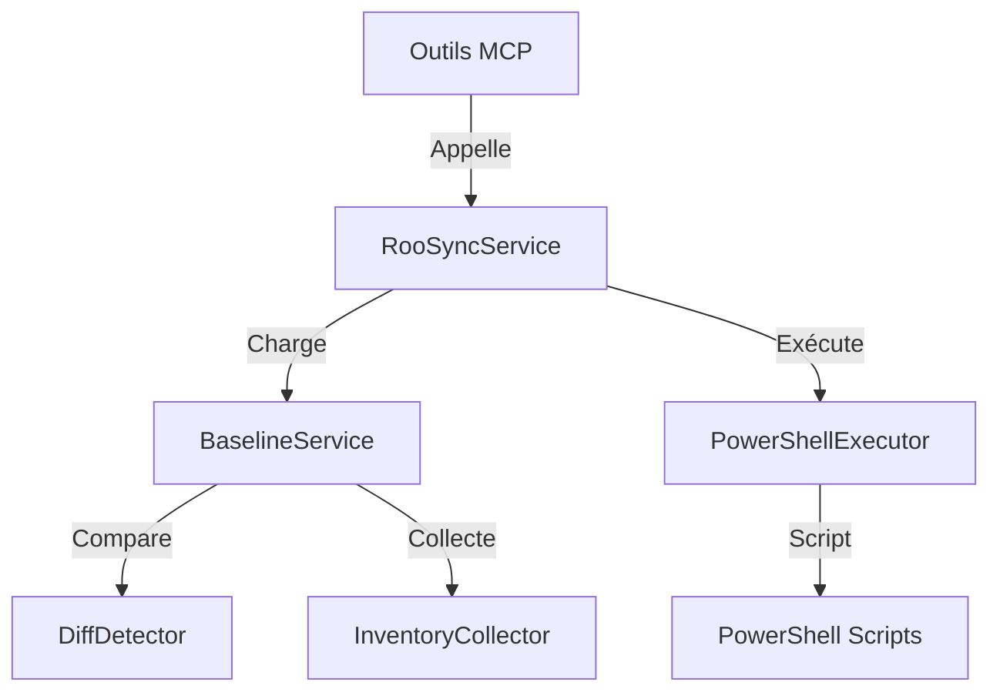

# Audit Technique Approfondi : MCP `roo-state-manager` (Phase 2b)

**Date :** 2025-12-08
**Auteur :** Roo Architect
**Version :** 1.0.0
**Statut :** Finalisé

---

## 1. Synthèse Exécutive

L'audit du MCP `roo-state-manager` révèle une architecture modulaire robuste mais encombrée par une dette technique significative accumulée lors des phases de prototypage rapide. Le service central `RooSyncService` est fonctionnel mais souffre de chemins en dur (hardcoded paths) critiques et de duplications de logique. La consolidation est nécessaire avant tout déploiement multi-environnements à grande échelle.

## 2. Cartographie Architecturale

### 2.1 Composants Principaux
Le serveur est structuré autour d'un point d'entrée unique (`src/index.ts`) qui initialise :

1.  **`RooStateManagerServer`** : Classe principale orchestrant le cycle de vie.
2.  **`StateManager`** : Gestionnaire d'état global (cache conversations, index Qdrant).
3.  **`RooSyncService` (Singleton)** : Cœur du système de synchronisation.
    *   Dépendances : `BaselineService`, `DiffDetector`, `InventoryCollector`, `PowerShellExecutor`.
4.  **`NotificationService`** : Gestion des notifications push.

### 2.2 Flux de Données RooSync

## 3. Dette Technique Identifiée

### 3.1 Chemins en Dur (Hardcoded Paths) 🚨 **CRITIQUE**
40 occurrences détectées, dont les plus critiques :
*   **Logs Debug :** `c:/dev/roo-extensions/debug-roosync-compare.log` (dans `RooSyncService.ts`, `compare-config.ts`).
*   **Traces Debug :** `d:/roo-extensions/debug_trace.txt` (dans `task-indexer.ts`).
*   **Config Fallback :** `g:/Mon Drive/Synchronisation/RooSync/.shared-state` (dans `ConfigService.ts`).
*   **Workspace Test :** `d:/dev/2025-Epita-Intelligence-Symbolique` (dans plusieurs fichiers).

### 3.2 Code Mort et Fichiers Obsolètes
*   `src/index.ts.backup-20251012` : Backup inutile contenant des chemins personnels.
*   `src/tools/examine-roo-global-state.ts.disabled` : Outil désactivé.
*   `src/tools/vscode-global-state.ts.broken` : Code cassé.
*   `src/tools/repair-task-history.ts.disabled` : Outil de réparation obsolète.

### 3.3 Duplication de Logique
*   **Dashboard vs Diff :** La méthode `loadDashboard` dans `RooSyncService.ts` duplique une grande partie de la logique de `listDiffs`, créant un risque d'incohérence.
*   **Configuration :** `ConfigService.ts` réimplémente une logique de découverte de chemins qui devrait être centralisée dans `roosync-config.ts`.

## 4. Analyse Spécifique RooSync

### 4.1 Gestion Multi-Environnements
*   **Points Forts :** Utilisation correcte de `dotenv` et validation stricte des variables d'environnement au démarrage (`src/index.ts`).
*   **Faiblesses :** Les fallbacks hardcodés dans `ConfigService.ts` (lignes 90-110) contournent la configuration par environnement et risquent de provoquer des effets de bord sur des machines de développement spécifiques.

### 4.2 Scripts PowerShell
Le dossier `scripts/` à la racine du MCP contient des scripts (`roo.ps1`, `performance/`) qui semblent redondants avec les scripts globaux du projet. L'intégration via `PowerShellExecutor` est propre, mais les scripts appelés doivent être nettoyés.

## 5. Plan de Consolidation (Recommandations)

### Priorité 1 : Assainissement (Immédiat)
1.  **Supprimer** tous les fichiers `.backup`, `.disabled`, `.broken`.
2.  **Remplacer** tous les chemins en dur par des variables de configuration ou des chemins relatifs via `path.join()`.
3.  **Centraliser** la logique de logging debug pour éviter l'écriture directe de fichiers.

### Priorité 2 : Refactoring (Court Terme)
1.  **Fusionner** la logique de `loadDashboard` et `listDiffs` pour garantir la cohérence des données.
2.  **Unifier** la gestion de configuration dans `ConfigService` en utilisant exclusivement `roosync-config.ts` comme source de vérité.

### Priorité 3 : Optimisation (Moyen Terme)
1.  **Nettoyer** le dossier `scripts/` du MCP et migrer les scripts utiles vers le dossier global `scripts/`.
2.  **Implémenter** la création réelle de décisions (TODO ligne 1225 de `RooSyncService.ts`).

## 6. Preuve de Validation Sémantique
Requête finale pour confirmer la couverture de l'audit :
`codebase_search: "hardcoded paths roosync service configuration"`

---
*Fin du rapport.*